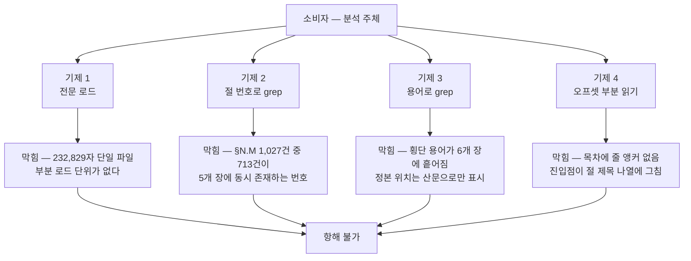
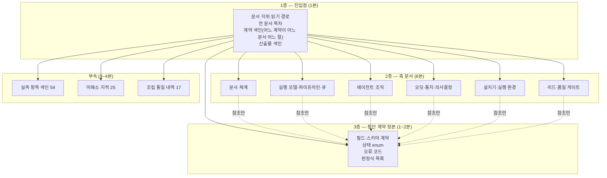

# 설계 프롬프트·설계 문서 재생성 — 분석

## 1. 요약

재생성 대상 두 문서를 명령으로 실측하고, "항해 불가능"의 원인을 검색 기제 단위로 분해했다. 결론 네 줄:

1. **분량은 근원이 아니다.** 대조군인 입력 스펙(666줄)은 같은 참조 표기를 쓰면서 모호 참조가 **0건**인데, 설계 문서(4,404줄)는 절 번호 참조 1,027건 중 **713건(69.4%)** 이 여러 장에 동시에 존재하는 번호를 가리킨다. 차이를 만든 것은 크기가 아니라 **주소 체계의 부재**다.
2. **요청 문서가 원인으로 지목한 "중복 서술"은 실측에서 재현되지 않았다.** 40자 이상 완전 동일 줄의 장을 넘는 중복은 **0건**, 근접 중복(25자 shingle 2개 이상 일치)도 **6쌍**뿐이며 그중 3쌍은 색인(부록 A)과 정본의 의도된 대응이다. 중복 제거는 남은 작업이 거의 없는 축이고, 대신 **정본 위치가 산문으로만 표시된 상태**(문자열 "정본" 117회 · "소유" 170회)가 이중 정의로 오인될 표면이다.
3. **요청 문서가 "출발점"으로 든 조립 전 절 파일 6본은 낡았다.** 조립본과 **375줄**이 어긋나 있고(조립본에만 204줄 · 절 파일에만 171줄), 아부 금지 규율의 반영분(규율 항목 1건과 그 전용 절)은 절 파일에 **0건**이다. 재생성의 입력 정본은 조립본 단 하나다.
4. **근원은 5건**(§6): 단일 파일 안에 주소 없는 정본이 들어앉음 · 절 번호 네임스페이스 충돌 · 개요와 상세의 층위 미분리(절 길이 7~352줄, 50배) · 진입점의 해상도가 절 제목 나열에 그침(표본 10건 중 2건은 어떤 헤딩으로도 도달 불가) · 횡단 계약의 소유가 산문으로만 선언됨.

권고는 **축별 분권(6본) + 횡단 계약 정본 문서 분리 + 진입점 색인 3종 + 전역 유일 절 주소**의 조합이다(§7). 단일 파일 유지·2분할·계층 요약 단독은 각각 §7.3의 어느 평가 축에서 미달한다. 보존 자산은 무손실 이관 대상 **11종**으로 확정했고 대조 방법을 항목마다 붙였다(§8).

분석이 확정하지 못하고 설계 단계로 넘기는 미결은 **9건**(§9)이며, 그중 2건은 설계가 시작하기 전에 답이 필요한 봉쇄성 미결이다 — 재생성 대상에 입력 스펙이 포함되는가(순환 준거 문제), 그리고 문서 유형 enum 모순이 아부 금지 장치의 집행 경로를 끊고 있는 문제.

원장·프롬프트와 정본이 어긋난 사실 **4건**을 §11에 보고한다. 그중 하나는 완료 기준 자체의 갈림이다 — 실 원장에 등재된 같은 일의 완료 기준 두 항목이 분량 상한 철회 발화(§17) 이전 문면 그대로 남아 "읽어야 할 총량이 줄었는지를 근거로 보이라"고 요구한다.

## 2. 분석 범위와 입력 정본

### 2.1 입력 목록과 정본 판정

| # | 입력 | 이 분석에서의 지위 | 실측 시각 |
|---|---|---|---|
| I1 | 요청 원장 `docs/requests/public/2026/07/RQ-20260728T170616Z-d0bc4127-…md` | 완료 기준의 정본 | 2026-07-29 02:10 KST |
| I2 | 설계 프롬프트(확정 제약 19항) `docs/design/harness-design-prompt-shared.md` | 재생성 준거이자 재생성 대상 후보(§9 Q8) | 2026-07-29 02:12 KST |
| I3 | 설계 문서 `docs/design/harness-design.md` | 원자료 — 무손실 이관 대상의 정본 | 2026-07-29 02:12 KST |
| I4 | 조립 전 축별 절 파일 6본 | **정본 아님** — 낡은 스냅샷(§5.6) | 2026-07-29 02:14 KST |
| I5 | 발화 원문 전사(인테이크 문서 §14·§15·§16·§17) | 요건의 원천 | 2026-07-29 02:15 KST |
| I6 | 실 원장의 동일 작업 등재분과 확정 결정 기록 | 병존 원장 — §11-1 보고 대상 | 2026-07-29 02:16 KST |

### 2.2 착수 전 정본 재확인(프롬프트 단언 대조)

디스패치 프롬프트는 설계 문서를 **4,369줄**로 단언했다. 착수 직전 재측정값은 **4,404줄**(`wc -l`, 파일 수정 시각 2026-07-29 02:01:46 KST)이다. 요청 원장도 같은 차이를 이미 보고했다(차이 35줄). 이 분석은 **파일 실측값을 쓴다** — 아래 모든 수치는 위 시각 기준이며, 후속 단계는 착수 시 재측정한다.

## 3. 측정 방법 (재현 절차)

수치를 인용할 때 어떻게 쟀는지를 함께 남긴다. 재측정 없이 이 문서의 값을 인용하는 것은 추정 인용이다.

| 지표 | 방법 |
|---|---|
| 줄·바이트·문자 | `wc -l` · `wc -c` · `wc -m` |
| 헤딩 | 코드펜스 토글 상태를 추적하며 `^#{1,4} ` 매칭(코드 블록 안 `#` 주석 제외) |
| 장 경계 | h1 헤딩 사이 구간. 마지막 장은 파일 끝까지 |
| 절 길이 | 코드펜스 밖 `## ` 경계 간 줄 수 |
| mermaid | ` ```mermaid ` 로 시작하는 줄 수 |
| 표 행 | 코드펜스 밖에서 `|` 로 시작하는 줄 수(헤더·구분행 포함) |
| 절 번호 중복 | `## N.` · `### N.M` 을 파싱해 번호별 등장 횟수 집계 |
| 참조 모호도 | 본문의 `§N.M` 을 전수 수집해, 그 번호를 갖는 헤딩이 2개 이상인 경우를 모호로 계수 |
| 규율 항목 | `[R숫자]` 전수 수집 후 유일값·최초 정의 위치 집계 |
| 완전 중복 | 40자 이상 본문 줄의 완전 일치(표 구분행 제외) |
| 근접 중복 | 공백·강조 기호 제거 후 25자 shingle(보폭 8)을 색인해, 3줄 이상 떨어진 두 줄이 2개 이상의 shingle을 공유하면 중복 쌍으로 계수 |
| 절 파일 이격 | 절 파일 본문과 조립본 장 본문을 줄 단위 `SequenceMatcher` 로 대조 |

## 4. 구조 실측 — 설계 문서

### 4.1 전체 지표

| 지표 | 값 |
|---|---|
| 줄 / 바이트 / 문자 | 4,404 / 408,113 / 232,829 |
| 장(h1) | 11 — 진입부 1 · 본편 6 · 부록 4 |
| 절(h2) / 소절(h3) / 세부(h4) | 79 / 178 / 18 (합 275, 진입부 h1 포함 시 286) |
| mermaid 블록 | 38 |
| 코드펜스 블록 | 160 |
| 표 행 | 1,041 |
| 절 참조 `§` | 1,503 (그중 `§N.M` 형태 1,027) |
| 규율 항목 | 39 (R1~R39, 번호 중복 0) |
| 설치 전 실측 항목 | 54 (부록 A 색인) |

### 4.2 장별 분포

| 장 | 줄 | h2 | h3 | h4 | mermaid | 표 행 | 실측 항목 | 규율 정의 |
|---|---:|---:|---:|---:|---:|---:|---:|---:|
| 진입부(제목·요약·일러두기·목차) | 42 | 3 | 0 | 0 | 0 | 10 | — | — |
| 1장 문서 체계 | 785 | 13 | 30 | 0 | 7 | 183 | 7 | 15 |
| 2장 실행 모델·파이프라인·큐 | 785 | 12 | 35 | 0 | 9 | 144 | 10 | 0 |
| 3장 에이전트 조직 | 702 | 14 | 24 | 9 | 5 | 166 | 6 | 0 |
| 4장 오딧·통지·의사결정 문서 | 549 | 12 | 28 | 0 | 7 | 125 | 10 | 16 |
| 5장 설치기·실행 환경 | 737 | 11 | 22 | 9 | 6 | 154 | 14 | 0 |
| 6장 리드·품질 게이트 | 660 | 14 | 39 | 0 | 4 | 184 | 7 | 8 |
| 부록 A 실측 항목 색인 | 61 | 0 | 0 | 0 | 0 | 56 | (54 색인) | — |
| 부록 B 미해소 지적 | 42 | 0 | 0 | 0 | 0 | 0 | — | — |
| 부록 C 조립 통일 내역 | 24 | 0 | 0 | 0 | 0 | 19 | — | — |
| 부록 D 자기 일관성 기록 | 6 | 0 | 0 | 0 | 0 | 0 | — | — |
| **합계** | **4,393**(+frontmatter 11 = 4,404) | **79** | **178** | **18** | **38** | **1,041** | **54** | **39** |

관측 두 가지. ①**규율 정의가 3개 장에 몰려 있다** — 39건 중 1장 15 · 4장 16 · 6장 8이고 2·3·5장은 0건이다. 규율이 없는 장이 아니라, 규율 표기 규약(`- [R번호]` + 장치 슬롯)이 세 장에만 적용된 상태다. ②**h4 사용이 두 장에만 있다**(3장 9 · 5장 9) — 깊이 정책이 장마다 다르다.

### 4.3 절 길이 분포 — 개요와 상세가 같은 층에 있다

| 통계 | 값 |
|---|---:|
| 절(h2) 수 | 79 |
| 최소 | 7줄 |
| 1사분위 | 16줄 |
| 중앙값 | 43줄 |
| 3사분위 | 79줄 |
| 90분위 | 125줄 |
| 최대 | 352줄 |
| 100줄 이상 절 | 16건 |
| 20줄 이하 절 | 25건 |

최장·최단 극단은 다음과 같다. **둘은 같은 헤딩 깊이(h2)에 있다.**

| 구분 | 장 | 절 | 줄 |
|---|---|---|---:|
| 최장 1 | 5장 | 설치 트랜잭션 | 352 |
| 최장 2 | 6장 | 설치 전 실측 항목 | 149 |
| 최장 3 | 2장 | 큐·스케줄러 | 144 |
| 최장 4 | 1장 | 디렉토리 트리 | 138 |
| 최단 1 | 4장 | 요약 | 7 |
| 최단 2 | 5장 | 미결점 | 11 |
| 최단 3 | 1장 | 설치 전 실측 항목 | 12 |

같은 이름의 절("설치 전 실측 항목")이 한쪽에서는 12줄, 다른 쪽에서는 149줄이다. 훑기(개요)와 파고들기(상세)를 헤딩 깊이로 구분할 수 없다.

### 4.4 절 번호와 참조 — 주소가 유일하지 않다

| 지표 | 설계 문서 | 입력 스펙(대조군) |
|---|---:|---:|
| `## N.` 절 | 64개가 14개 번호를 공유 | 13개가 13개 번호(유일) |
| `### N.M` 소절 | 148개가 61개 번호를 공유 | 29개가 29개 번호(유일) |
| 중복 번호 종수 | 39종 | 0종 |
| `§N.M` 참조 | 1,027건 | 71건 |
| 그중 다중 정의 번호 지시 | **713건 (69.4%)** | **0건 (0%)** |
| 장 한정 표기(`N장 §x.y`) | 44건 (전체 참조의 4.3%) | 해당 없음(단일 네임스페이스) |

번호 0~10은 각각 **5회씩** 등장한다. 가장 심한 참조는 `§3.4`·`§4.2`·`§2.4`로 각 47회씩 쓰이며, 각 번호는 5개 장에 동시에 존재한다.

동일한 참조 표기(`§N.M`)를 쓰는 두 문서의 모호도가 0%와 69.4%로 갈린다. **표기법이 아니라 번호 네임스페이스 관리가 변수**다.

### 4.5 중복 실측 — 요청 문서의 원인 지목을 기각한다

요청 원장 frontmatter의 `why`는 "중복 서술"을 항해 불가의 원인 중 하나로 들었다. 측정 결과:

| 검사 | 결과 |
|---|---|
| 40자 이상 완전 동일 줄(표 구분행 제외) | 중복 유형 **0건** |
| 그중 장을 넘는 중복 | **0건** |
| 근접 중복 쌍(25자 shingle 2개 이상 공유, 3줄 이상 이격) | **6쌍** |

6쌍의 내역: 부록 A 색인 ↔ 3장 실측 항목 정본 3쌍(색인은 "정본은 각 장의 해당 절이며 여기는 전수 색인"이라고 자기 선언한 의도된 대응), 5장 내부 필드 표 반복 1쌍, 2장 전이 함수 호출 반복 1쌍, 1장 규율 표기 규약 ↔ 6장 린트 규약 1쌍.

**판정: 문자열 수준의 중복은 항해 실패의 원인이 아니다.** 마지막 1쌍(규약의 두 곳 서술)만 정본 단일화 대상이고, 나머지는 색인·재사용이다. 다만 다른 표면이 있다 — 문자열 "정본"이 117회, "소유"가 170회 등장한다. 즉 **어느 계약의 정본이 어디인지가 산문 문장으로만 표시**돼 있고, 기계가 읽을 색인이 없다. 이것은 중복이 아니라 **정본 소재의 비색인화**이며, 재생성이 해소해야 할 것은 후자다.

### 4.6 항해 기준선 — 표본 10건의 도달 실측

임의 주제를 진입점(목차)에서 찾을 수 있는지 표본 10건으로 측정했다. "목차 도달"은 목차 문자열에 그 주제어가 있는지, "헤딩 도달"은 문서 내 어떤 헤딩에라도 그 주제어가 있는지다.

| # | 표본 주제 | 목차 도달 | 헤딩 도달 | 정본 위치 |
|---|---|:---:|:---:|---|
| 1 | 파일명 문법 | O | O | 1장 §2 |
| 2 | 착지 게이트 오류 코드 15종 | X | **X** | 1장 §5.2 판정식 안 |
| 3 | 큐·스케줄러 | O | O | 2장 §4 |
| 4 | 아부 금지 장치 | **X** | O | 6장 §7.9 |
| 5 | TDD 증거 필드 계약 | X | **X** | 1장 §4.2 |
| 6 | 이름 레지스트리 | O | O | 3장 §7 |
| 7 | 백업 대상 목록 | O | O | 1장 §9 |
| 8 | 설치 전 실측 항목 전수 | O | O | 부록 A |
| 9 | 3채널 동시 통지 | O | O | 4장 D.5 |
| 10 | 워크트리·브랜치 모델 | X | O | 2장 §6.1.1 |
| | **합계** | **7/10** | **8/10** | |

미도달 2건(오류 코드 15종, TDD 증거 필드 계약)은 **어떤 헤딩에도 이름이 없어** 전문 스캔으로만 찾을 수 있다. 둘 다 다른 축이 참조만 하는 **횡단 계약**이라는 공통점이 있다. 목차 미도달 3건 중 아부 금지 장치는 가장 최근에 추가된 확정 규율인데 목차가 갱신되지 않았다 — 목차가 수작업 산문이라 본문 변경과 동기화되지 않는다.

### 4.7 부록의 성격

| 부록 | 내용 | 성격 | 이관 시 쟁점 |
|---|---|---|---|
| A | 설치 전 실측 항목 54건 색인(1장 7 · 2장 10 · 3장 6 · 4장 10 · 5장 14 · 6장 7) | 각 장 정본의 파생 색인 | 파생물은 문서 트리 밖이라는 규율(1장 R3)과의 관계 — §9 Q6 |
| B | 미해소 지적 25항(보류 2 · 사람 결정 대기 2 · 조립 발견 5 · 각 축 미결 15 · 미검증 제안값 1묶음) | 정본(다른 곳에 없음) | 무손실 이관 필수 |
| C | 조립 통일 내역 17건(어긋남 → 통일 결과 → 반영 위치) | 정본(재생성의 근거 이력) | 무손실 이관 필수 |
| D | 자기 일관성 검사 기록 | 정본(짧음) | 무손실 이관 필수 |

## 5. 구조 실측 — 설계 프롬프트(스펙)와 절 파일

### 5.1 스펙 전체 지표

| 지표 | 값 |
|---|---:|
| 줄 / 바이트 / 문자 | 666 / 97,655 / 46,593 |
| 절(h2) / 소절(h3) | 13 / 29 |
| mermaid | 13 |
| 표 행 | 25 |
| `§` 참조 | 121 (그중 `§N.M` 71) |
| 모호 참조 | **0** |
| 확정 제약 항목 | 19 (§2 — 마지막 항이 아부 금지) |

### 5.2 스펙 절별 분포

| 절 | 줄 | mermaid | 표 행 |
|---|---:|---:|---:|
| 0 이 문서의 지위와 사용법 | 9 | 0 | 0 |
| 1 목표와 비목표 | 31 | 1 | 0 |
| 2 확정 제약 (19항) | 42 | 0 | 17 |
| 3 문서 체계 요구사항 | 120 | 3 | 0 |
| 4 실행 모델 | 49 | 2 | 0 |
| 5 요청 파이프라인 | 159 | 5 | 8 |
| 6 에이전트 조직 | 62 | 1 | 0 |
| 7 감사 | 14 | 0 | 0 |
| 8 설치·초기화·백업 | 31 | 1 | 0 |
| 9 계승할 원칙 | 76 | 0 | 0 |
| 10 반복하지 말 것 | 22 | 0 | 0 |
| 11 최적화 지점 | 25 | 0 | 0 |
| 12 설계 세션 과제 | 15 | 0 | 0 |

스펙은 절 길이가 9~159줄로 **17배** 범위이고 설계 문서는 7~352줄로 **50배** 범위다. 절 번호가 유일하고 편차가 작다는 두 성질이 겹쳐 스펙은 같은 표기로도 항해된다.

### 5.3 스펙에는 있고 설계 문서 형태에는 없는 것

스펙 §0은 "이 문서의 지위와 사용법"을 9줄로 먼저 선언한다. 설계 문서에는 대응 절이 없다 — 진입부는 요약·참조 표기 규약·목차 3절이며, **누가 어느 순서로 읽어야 하는가**를 지시하는 절이 없다. 읽기 경로가 없는 것은 §6-RC4의 직접 원인 중 하나다.

### 5.4 스펙의 요구가 설계 문서 형태에 남긴 흔적

스펙 §3.5는 "읽기는 요약 우선, 전문은 필요할 때만(깊이 1 + 요약 우선)"을 요구한다. 설계 문서는 이 요구를 **내용으로는 설계했으나**(1장 §5.1 문서 본문 구조 · 규율 R8) **자기 형태에는 적용하지 않았다** — 문서 전체 요약 1개와 장별 요약 7개는 있으나, 요약만 읽고 상세를 건너뛸 수 있게 하는 **물리적 분리**(별도 파일)가 없어 깊이 1 읽기가 성립하지 않는다. R8 자신이 "읽기는 착지점이 없어 게이트를 걸 수 없다"고 장치 불가를 선언한 항목이다.

### 5.5 절 파일 6본과 조립본의 이격 — 실측

| 축 파일 | 절 파일 본문 | 조립본 장 | 조립본에만 있는 줄 | 절 파일에만 있는 줄 | 유사도 |
|---|---:|---:|---:|---:|---:|
| A 문서 체계 | 784 | 785 | 7 | 6 | 0.992 |
| B 파이프라인·큐 | 784 | 785 | 7 | 6 | 0.992 |
| C 조직 | 701 | 702 | 18 | 17 | 0.975 |
| D 오딧·통지 | 559 | 549 | 91 | 101 | 0.827 |
| E 설치·환경 | 734 | 737 | 18 | 15 | 0.978 |
| F 리드 게이트 | 623 | 660 | 63 | 26 | 0.931 |
| **합계** | **4,185** | **4,218** | **204** | **171** | — |

추가 확인: 절 파일 6본 전체에서 아부 금지 규율(`R39`)과 그 전용 절의 문자열은 **0건**이다. 아부 금지는 확정 제약 19항의 마지막 항이자 이번 재생성이 반영해야 할 항목인데, 절 파일에는 존재하지 않는다.

**판정**: 요청 원장의 형태 문제 근거 3("원천은 이미 분리돼 있고 조립본만 단일 파일이다 — 재구조화의 출발점은 백지가 아니다")은 **부분 기각**한다. 절 파일은 장 경계와 절 골격의 참고자료로는 유효하지만 **내용 정본이 아니다**. 375줄이 어긋나 있고 최신 확정 규율이 빠져 있다. 절 파일을 출발점으로 삼으면 그 375줄이 조용히 되돌아간다.

## 6. 가독 실패의 근원 분석

### 6.1 소비자와 검색 기제부터 고정한다

의사결정권자는 §17에서 소비자를 지정했다 — "사람이 볼게 아니라 클로드가 분석할 프롬프트 문서". 따라서 "읽기 어렵다"를 사람의 피로가 아니라 **소비자가 실제로 가진 검색 기제의 실패**로 재정의한다. 소비자가 문서에 접근하는 기제는 넷이고, 넷 다 현재 문서에서 막힌다.



기제 3의 실측: "착지 게이트"는 6개 장에 걸쳐 등장하고(1장 22 · 2장 15 · 3장 19 · 5장 5 · 6장 2 · 부록 1), "판정식"은 7개 장(1장 6 · 2장 25 · 3장 7 · 4장 7 · 5장 19 · 6장 15 · 부록 1), "실측 항목"은 8개 구역에 걸쳐 있다. 용어 grep은 정본 1건과 언급 다수를 구분해주지 않는다.

### 6.2 근원 5건 (관찰 → 실측 → 확정)

| ID | 근원 | 실측 근거 | 막는 기제 |
|---|---|---|---|
| RC1 | **단일 파일 안에 다수 정본이 주소 없이 들어앉음** — 부분 로드의 단위가 존재하지 않는다 | 4,404줄 / 232,829자 단일 파일. 축 6개 · 정본 계약 다수가 한 파일 | 1, 4 |
| RC2 | **절 번호 네임스페이스 충돌** — 장마다 번호가 재시작 | `## 0.`~`## 10.` 각 5회 · `### N.M` 39종 중복 · 참조 69.4% 모호. 대조군 스펙 0% | 2 |
| RC3 | **개요와 상세가 같은 헤딩 깊이** — 훑기와 파고들기가 분리되지 않음 | 절 길이 7~352줄(50배) · 100줄 이상 16건과 20줄 이하 25건이 같은 h2 | 1, 4 |
| RC4 | **진입점의 해상도 부족** — 목차가 절 제목 나열이고 계약·산출물 색인이 없으며 수작업이라 본문과 동기화되지 않음 | 표본 10건 중 목차 도달 7 · 헤딩 도달 8. 미도달 2건은 전문 스캔만 가능. 최신 확정 절이 목차에 없음 | 4 |
| RC5 | **횡단 계약의 정본 소재가 산문으로만 선언됨** — 기계가 읽을 소유 색인 없음 | "정본" 117회 · "소유" 170회 · "위임" 37회가 본문 문장에 분산. 위임 경계 절이 8개 장·절에 흩어짐 | 3 |

### 6.3 기각한 가설

| 가설 | 출처 | 실측 | 판정 |
|---|---|---|---|
| H1 중복 서술이 분량을 부풀렸다 | 요청 원장 `why` | 완전 중복 0건 · 근접 중복 6쌍(3쌍은 의도된 색인) | **기각** — 남은 단일화 대상 1쌍 |
| H2 절 파일이 이미 분리돼 있어 출발점이 있다 | 요청 원장 형태 근거 3 | 조립본과 375줄 이격 · 최신 확정 규율 0건 | **부분 기각** — 골격 참고자료로만 유효 |
| H3 분량 자체가 원인이다 | §14 평가의 표면적 독해 | 스펙 666줄과 설계 문서 4,404줄은 같은 표기로 모호도 0% 대 69.4% | **기각** — 분량은 근원이 아니라 근원을 드러낸 조건 |

H3의 기각은 §17과 정합적이다. 분량 상한을 철회해도 RC1~RC5는 그대로 남으며, 상한을 걸어도 RC2·RC4·RC5는 해소되지 않는다. 즉 **분량 축은 이 문제와 직교한다**.

### 6.4 왜 이 상태가 만들어졌는가 (재발 방지의 근거)

축별로 병렬 집필한 뒤 조립하는 방식은 각 축 문서가 **자기 완결적 번호 체계**를 갖게 한다(각 축이 §1부터 시작). 조립 시 번호를 전역화하지 않고 "장 내부의 §N은 그 장 자신의 절 번호"라는 **해석 규약**(진입부 일러두기)으로 처리한 것이 RC2의 직접 원인이다. 해석 규약은 사람이 읽을 때만 작동하고 grep에는 작동하지 않는다. 재생성에서 같은 조립 방식을 쓰려면 **번호 전역화를 조립 단계의 기계 처리로 넣어야** 재발하지 않는다.

## 7. 재생성 전략 후보와 권고

### 7.1 후보

| ID | 전략 | 형태 | 해소하는 근원 |
|---|---|---|---|
| A | 현행 단일 파일 유지 + 앵커 보강 | 1본 + 강화된 목차·용어 색인 | RC4 일부 |
| B | 본문 + 참조 2분할 | 개요 1본 + 상세 1본 | RC3 일부 |
| C | 계층 요약 3층 | 진입점 / 축 개요 / 절 상세 | RC1·RC3·RC4 |
| D | 축별 분권 | 진입점 1 + 축 6 + 부록 3~4 | RC1·RC3 |
| E | 횡단 계약 정본 문서 분리 | 계약 레지스트리 1~2본 | RC5·RC3 |
| F | 기계 판독 색인 파생 | 파생 인덱스(문서 아님) | RC4·RC5 |
| G | 절 주소 전역 유일화 | 표기 규약 + 조립 단계 기계 처리 | RC2 |

### 7.2 평가 축

1. **항해** — 임의 주제를 진입점에서 2홉 내 도달
2. **참조 무결성** — 분할이 유실 경로가 되지 않는가(착지 게이트가 검사할 수 있는가)
3. **정본 단일성** — 같은 계약이 두 곳에서 정의되지 않는가
4. **무손실 이관 비용** — 원자료 대조 가능성
5. **새 문서 규격 적합** — 문서당 frontmatter·요약 절·착지 게이트 통과
6. **부분 읽기 비용** — 소비자가 필요한 만큼만 로드할 수 있는가

### 7.3 평가

| | A | B | C | D | E | F | G |
|---|:-:|:-:|:-:|:-:|:-:|:-:|:-:|
| 1 항해 | 미달 | 부분 | 충족 | 충족 | 충족 | 충족 | 부분 |
| 2 참조 무결성 | 무영향 | 위험↑ | 위험↑ | 위험↑ | 위험↑ | 무영향 | 개선 |
| 3 정본 단일성 | 미달 | 미달 | 부분 | 부분 | 충족 | 부분 | 무영향 |
| 4 이관 비용 | 최저 | 낮음 | 중 | 중 | 높음 | 낮음 | 중 |
| 5 규격 적합 | **미달** | 부분 | 충족 | 충족 | 충족 | 해당없음 | 무영향 |
| 6 부분 읽기 | **미달** | 부분 | 충족 | 충족 | 충족 | 충족 | 무영향 |

- **A 단독 기각**: 4,404줄 단일 파일은 새 문서 규격의 착지 대상이 될 수 있으나(규격 위반은 아님) 기제 1·4를 그대로 둔다. RC1·RC2·RC3가 무해소다.
- **B 단독 기각**: "개요/상세" 2분할은 상세본이 여전히 3,000줄 이상 단일 파일로 남는다 — RC1이 상세본에 그대로 이월된다.
- **C 단독 부족**: 층은 나뉘지만 층 안의 축 경계가 없으면 상세층이 다시 단일 거대 파일이 된다. D와 결합해야 의미가 있다.
- **D 단독 부족**: 축 분권만으로는 횡단 계약(오류 코드·필드 계약·상태 enum)이 어느 축 문서에 들어갈지 임의가 되고, 그 결과가 §4.6의 미도달 2건이다.
- **E는 D의 전제**: 횡단 계약을 먼저 뽑아야 축 문서의 경계가 결정된다.
- **G는 독립적으로 필수**: 어떤 분할을 택하든 번호가 유일하지 않으면 참조가 계속 모호하다. 비용은 낮고 효과는 참조 1,027건 전량에 걸린다.

### 7.4 권고 — D + E + F + G, C의 요약 규율을 얹어서



권고의 구성 요소와 근거:

| 요소 | 내용 | 근거 |
|---|---|---|
| 축 분권 6본 | 현 6장 경계 유지 | 장 간 직접 참조가 이미 희소하다 — 본편 6개 장 사이의 `N장` 형태 상호 참조는 **5건**뿐이고, 나머지 188건은 진입부·부록에서 나온다. 경계가 이미 낮은 결합도로 서 있다 |
| 횡단 계약 문서 분리 | 필드 표·상태 enum·오류 코드·판정식 목록·TDD 증거 계약을 정본 1~2본으로 | §4.6 미도달 2건이 정확히 이 부류. RC5 해소 |
| 진입점 색인 3종 | ①문서 목차 ②계약 색인 ③읽기 경로(역할별) | RC4 해소. 스펙 §0에 대응하는 절이 없다는 §5.3의 공백을 메움 |
| 절 주소 전역 유일화 | 축 접두 부여(예: 문서 체계 축 §4.2 → `A§4.2`) 또는 전역 연속 번호. 조립·생성 단계에서 기계 부여 | RC2 해소. 방식 택일은 §9 Q2 |
| 요약 규율 | 각 문서 `## 요약` 은 그 문서만으로 판단 가능한 결론을 담고, 상세는 아래 절로 — 깊이 1 읽기가 물리적으로 성립 | 스펙 §3.5 요구의 자기 적용(§5.4의 공백 해소) |
| 파생 색인 | 계약명 → 정본 문서·절, 용어 → 문서 매핑을 파생 인덱스로 | RC4·RC5의 기계 축. 문서가 아니므로 파생물 위치 규율에 부합 |

**분량에 대한 입장**: 이 권고는 총량을 줄이지 않는다. 줄이지 않는 것이 §17의 요구이며, 총량 축소를 성과 지표로 삼는 것은 §17이 배제한 수단이다. 대신 **1회 로드 단위**가 4,404줄에서 축 문서 1본(현 기준 549~785줄) 또는 요약층(수십 줄)으로 줄어든다. 이것이 "인간적으로 쉽지 않네"에 대한 이 권고의 해소 방식이다.

### 7.5 권고가 만드는 새 위험

| 위험 | 실측 근거 | 완화 |
|---|---|---|
| 분할이 참조 유실 경로가 된다 | 착지 게이트는 문서 ID 참조만 검사한다(1장 §5.2 E07·E08). **절 단위 앵커는 검사 대상이 아니다** | 문서 간 참조는 frontmatter `refs` 에 등재해 게이트가 검사하게 하고, 절 앵커 검사 도입 여부는 §9 Q3 |
| 문서 수 증가로 메타 오버헤드 | 문서당 공통 필수 필드 17개 | 자동 주입 대상(사람이 쓰지 않는 필드가 대부분) |
| 계약 문서와 축 문서의 이중 정의 재발 | 조립 통일 내역 17건이 이미 그 재발의 기록 | 계약 문서를 정본으로 선언하고 축 문서는 참조만 — 이중 정의 0건을 검증 기준으로 |
| 조립 없는 분권이 전체 일관성 검사를 어렵게 함 | 부록 D(자기 일관성 검사)가 단일 파일 전제 | 일관성 검사를 문서 간 대조 절차로 재정의 — 설계 단계 산출 |

## 8. 보존 자산 목록 — 무손실 이관 대상

완료 기준 3은 "매핑표에 누락 항목 0건 · 삭제 행은 삭제 근거 비공백"을 요구한다. 그 매핑표가 대상으로 삼아야 할 자산을 실측 건수와 함께 확정한다.

| # | 자산 | 건수 | 현 위치 | 이관 규칙 | 대조 방법 |
|---|---|---:|---|---|---|
| 1 | 규율 항목 R1~R39 | 39 | 1장 15 · 4장 16 · 6장 8 | 번호 유지. 통합·이동 허용, 삭제 시 근거 필수. 각 항목의 `[장치 \| 장치 불가]` 슬롯 동반 이관 | `[R숫자]` 전수 수집 후 1:1 대조 |
| 2 | 설치 전 실측 항목 | 54 | 각 장 정본 + 부록 A 색인 | 정본은 축 문서에, 색인은 재생성(§9 Q6) | 색인 행 수 대조 + 각 항목의 정본 절 실재 확인 |
| 3 | 절 헤딩(코드펜스 밖) | 286 | 전 장 | 통합·분할 허용. 이동 후 위치를 매핑표에 기재 | 헤딩 전수 수집 후 매핑표 좌변과 대조 |
| 4 | mermaid 다이어그램 | 38 | 1장 7 · 2장 9 · 3장 5 · 4장 7 · 5장 6 · 6장 4 | 무손실 — 시각화는 요건이다(적극 사용 지시) | 블록 수 대조 |
| 5 | 표 행 | 1,041 | 전 장 | 무손실 원칙. 통합 시 행 수 감소분에 근거 기재 | 표 행 수 대조 |
| 6 | 코드펜스 블록(판정식·트리·스키마) | 160 | 전 장 | 무손실 — 판정식은 구현 재량 제거의 핵심 | 블록 수 + 각 판정식 실재 대조 |
| 7 | 미해소 지적(부록 B) | 25 | 부록 B | 무손실 — 미결은 소실되면 재발한다 | 항목 번호 대조 |
| 8 | 조립 통일 내역(부록 C) | 17 | 부록 C | 무손실 — 재생성이 같은 어긋남을 되살리지 않게 하는 근거 | 항목 번호 대조 |
| 9 | 자기 일관성 검사 기록(부록 D) | 1절 | 부록 D | 무손실 | 절 실재 확인 |
| 10 | 확정 제약 대응(스펙 §2 19항) | 19 | 스펙 §2 ↔ 설계 문서 전반 | 재생성본이 19항 전건에 대응 절을 갖는지 | 19항 각각에 대응 절 매핑표 |
| 11 | 설계 세션 과제 해소(스펙 §12) | 10(T1~T10) | 스펙 §12 ↔ 각 장 | 해소 상태 유지 — 미해소분은 미해소로 이관 | 과제별 해소 절 매핑 |

주의 2건.
- 자산 1의 규율 항목은 **표기 규약이 세 장에만 적용된 상태**다(§4.2). 재생성에서 나머지 장의 규율을 같은 표기로 승격하면 항목 수가 늘어난다 — 이는 손실이 아니라 표면화이므로 매핑표에 "신규 표기 승격"으로 구분 기재한다.
- 자산 5·6은 총량 지표라 통합 시 자연 감소한다. 감소분 자체를 결함으로 보지 않되, **감소 사유가 "분량"인 행이 0건**이어야 한다(완료 기준 6).

## 9. 설계 단계에 넘길 미결

| ID | 미결 | 왜 분석이 정할 수 없나 | 결정 주체 | 봉쇄성 |
|---|---|---|---|:---:|
| Q1 | 분할 단위 — 축 6분할이 적정한가, 최장 축을 더 쪼개는가 | 축 내부 결합도는 설계 판단이다. 실측 재료만 제공: 축 문서는 549~785줄, 최장 절 352줄 | architect + staff engineer | |
| Q2 | 절 주소 방식 — 축 접두 / 전역 연속 / 문서ID+앵커 중 택1 | 셋 다 RC2를 해소한다. 선택은 참조 표기 비용과 게이트 검사 가능성의 교환 | architect | |
| Q3 | 절 단위 참조의 무결성 장치 — 게이트가 앵커를 검사할 것인가 | 도입하면 검사 비용과 오탐이 생기고, 안 하면 분할이 유실 경로가 된다. 비용 판단 필요 | architect + staff engineer | |
| Q4 | 횡단 계약 문서의 유형 — 설계 산출 유형인가 참조 문서 유형인가 | 유형 선택이 필수 절·규율 슬롯 린트 적용 대상과 연동된다 | architect | |
| Q5 | **문서 유형 enum 모순 해소** — 규율 슬롯 린트의 적용 대상이 실재하지 않는 유형 값으로 선언돼 있다(§11-3) | 스키마 축과 리드 게이트 축의 소유 경계에 걸쳐 있고, 아부 금지 장치의 문서 축 집행 경로가 여기 걸린다 | architect(스키마 축) + 결정 필요 시 사람 | **봉쇄** |
| Q6 | 부록 A·C를 문서로 둘 것인가 파생 색인으로 뺄 것인가 | 파생물은 문서 트리 밖이라는 규율(1장 R3)과 "설계 산출은 문서"라는 요구가 맞선다 | architect | |
| Q7 | 요약 계층의 계약 — 각 문서 요약이 무엇을 담아야 깊이 1 읽기가 성립하는가 | 상한을 두면 §17 위반, 안 두면 요약이 다시 상세가 된다. 분량이 아니라 **내용 항목**으로 계약해야 한다 | architect + document specialist | |
| Q8 | **재생성 대상에 입력 스펙이 포함되는가 — 순환 준거 문제** | 스펙을 재생성하면 설계 문서의 준거가 이동한다. 실 원장은 "스펙은 입력이며 재생성 대상 아님"이라 적었고 §16과 리허설 원장은 대상에 포함시킨다(§11-2) | 사람 결정 대상 | **봉쇄** |
| Q9 | 재생성본의 검증 기준 3요소를 어느 단위로 다는가 — 문서별인가 전체 1벌인가 | 분권 구조에서는 문서별 검증 기준이 늘어나 중복 위험이 생긴다 | architect + qa | |

Q8에 대한 분석의 권고(결정은 사람 몫): 문면 정합은 **포함**쪽이다 — §16의 "대시보드 요청 프롬프트"와 대구를 이루는 것은 "설계 프롬프트"이고, §17이 분량 상한을 철회한 대상도 "클로드가 분석할 프롬프트 문서"다. 순환은 **순서와 범위 제한**으로 푼다: 스펙 재생성은 내용 변경이 아니라 **규격 이관**(확정 제약 19항 무손실 + 구조화)으로 한정하고, 재생성된 스펙과 원 스펙의 항목 대조표를 산출해 준거 이동이 없음을 보인 뒤 설계 문서를 재생성한다.

Q5에 대한 분석의 관측(결정은 설계 몫): 규율 슬롯 린트는 적용 대상을 `type ∈ {design, decision, norm, charter}` 로 선언하는데, 착지 게이트가 강제하는 `type` 값은 유형 코드 집합(요청·감사·회의록·실패·결정·의사결정요청·설계·인계·참조)이고 ID 접두와 교차 검증된다. 두 어휘가 겹치지 않으므로 **규격을 지켜 착지한 어떤 문서도 린트 적용 대상이 되지 않는다**. 아부 금지 장치는 3층(자리 제거 · 닫힌 어휘 차단 · 정의 내장) 중 문서 축 집행이 이 린트에 걸려 있어, 재생성본이 자기 규격을 만족하는 순간 이 모순이 표면화된다.

## 10. 무게·우선순위·의존·중복 검사

### 10.1 무게 분류 (체크리스트 판정 — 재량은 상향만)

| 체크 항목 | 해당 |
|---|:-:|
| 산출이 다른 요청의 준거가 되는가 | O |
| 다단계 파이프라인(2단계 초과)을 요구하는가 | O |
| 사람 결정이 필요한 미결을 포함하는가 | O (Q5·Q8) |
| 무손실 대조가 완료 판정에 포함되는가 | O |
| 되돌리기 비용이 큰가(원자료 대체) | 부분 — 원자료는 보존되므로 가역 |

**판정: 최상위 무게 등급 유지.** 실 원장의 기존 분류와 동일하며 하향하지 않는다.

### 10.2 우선순위

요청 원장의 잠정값 80을 **유지하되 근거를 교체한다**. 원장이 적은 근거("요청 DAG에서 상위 스트림이다 — 형제 요청이 준거로 삼는 규격을 바꿀 수 있다")는 실 원장의 의존 선언 방향과 반대다: 실 원장에서 이 작업은 형제 리허설 건에 **의존하는** 쪽으로 등재돼 있다. 교체 근거는 둘이다 — ①범위를 확대한 정정 발화(§16)의 직접 대상이다 ②산출이 하네스 구현 전체의 준거 문서다.

### 10.3 의존

| 항목 | 판정 |
|---|---|
| 형제 요청(대시보드 설계 프롬프트) | `depends_on` 에 **넣지 않는다** — 두 산출 사이에 입력·출력 의존이 없다. 실 원장의 의존 선언은 파이프라인 실증 순서 의존이며 산출 의존이 아니다. 순서 의존은 스케줄링 입력으로만 다룬다 |
| 에이전트·스킬 설치(요청 원장이 "미등재 — 등재 필요"로 표시) | **실측 결과 이미 집행 완료** — 신규 역할 정의 4종이 2026-07-29 01:50에 배치돼 있고 필요한 스킬은 기설치 확인 기록이 있다. 별도 요청 등재의 실익은 사후 기록뿐이므로, 등재 대신 이 분석의 실측 기록으로 대체할 것을 권고한다(§11-4) |

### 10.4 중복 검사

| 대상 | 방법 | 결과 |
|---|---|---|
| 리허설 트리 요청 | 트리 전수 열거 | 2건 — 본 요청과 형제(대시보드). 중복 아님(대상 문서가 다름) |
| 실 원장 활성 요청 | 제목·요약 grep("재생성"·"설계 문서") | 1건 일치 — 동일 작업이 실 원장에도 등재돼 있다. **중복 등재가 아니라 원장 병존**(§11-1) |
| 분석 단계 산출 | 리허설 트리 설계 카테고리 전수 | 0건 — 본 문서가 최초 착지 |

## 11. 관측 — 정본·스키마 축에 보고할 항목

### 11-1. 같은 작업이 두 원장에 등재돼 있다

리허설 트리의 요청 원장과 실 원장에 같은 작업이 각각 등재돼 있고, 완료 기준이 서로 다르다. 어느 쪽이 완료 판정의 정본인지 선언돼 있지 않다. 검증 단계가 두 기준 중 하나를 임의로 고르면 판정이 갈린다.

### 11-2. 완료 기준의 갈림 — 분량 축과 재생성 대상 축

| 축 | 실 원장 등재분(2026-07-29 02:01:02) | 확정 결정 기록의 정정 항(02:02:00) | 리허설 원장(02:06:16) |
|---|---|---|---|
| 분량 | "읽어야 할 양 자체가 줄었는지를 근거로 보인다" · "분할이 총량을 숨기는 수단이 되면 안 된다" | 분량 상한 철회 — 완전성·구조 우선, 인위적 줄수 상한 금지(중복 서술 금지는 유지) | 완료 기준 6 — 분량 사유 축약 고지 0건 |
| 재생성 대상 | "입력 정본은 공유 스펙이며 **재생성 대상이 아니다**" | 두 파이프라인(대시보드 프롬프트·설계 재생성)의 기준에서 상한 제거 | 완료 기준 2 — "재생성된 설계 프롬프트와 설계 문서" |

발화 §17은 02:00 무렵, 실 원장 등재는 02:01:02이다. 즉 실 원장 등재분은 §17 반영 **이전 문면**이고, 2분 뒤 결정 기록이 정정했으나 요청 문서 본문은 갱신되지 않았다. **가장 늦은 정본(결정 기록의 정정 항 + 리허설 원장)을 따르고**, 실 원장 등재분의 해당 두 항목은 정정 대상으로 보고한다. 재생성 대상 축은 정정 기록에도 명시가 없어 사람 결정이 필요하다(§9 Q8).

### 11-3. 문서 유형 enum 모순 — 규율 슬롯 린트의 적용 대상이 공집합이다

§9 Q5에 상술. 조립 통일 내역 8항이 이 건을 "해소"로 기록했으나, 그 해소 방식(조립 문서의 유형 값을 `design` 으로 정규화)은 착지 게이트의 유형 검사와 양립하지 않는다 — 유형 값은 ID 접두와 교차 검증되므로 `design` 은 착지 자체가 거부된다. **해소 기록이 실제로는 미해소**이며, 아부 금지 장치의 문서 축 집행 경로가 여기 걸려 있다.

### 11-4. 요청 원장의 "미등재 선행 요건" 표시가 실측과 다르다

요청 원장 '범위 분할' 표는 에이전트·스킬 설치를 "원장 미등재 — 등재 필요"로 표시했다. 실측하면 신규 역할 정의 4종이 2026-07-29 01:50에 이미 배치돼 있고, 실 원장의 확정 결정 기록 집행 절에도 설치 완료가 기재돼 있다. 표시는 갱신 대상이다.

### 11-5. 상태 필드 이중 표기(요청 원장이 이미 보고한 건)

요청 유형에서 공통 필드와 유형 전용 필드가 같은 enum을 가리켜 같은 값이 두 자리에 적힌다. 이 분석에서 새로 확인한 사항은 없으며, 원 보고를 설계 단계로 그대로 전달한다.

〔본 문서는 유형이 설계 단계 산출이라 규율 슬롯 린트의 적용 대상이 아니며, 규율 항목 0건이다. 표기 규약 준수 여부는 재생성본에서 판정된다.〕

## 12. 표기 고지

- `author` 값은 실제 표시명이 아니라 역할 기반 자리표시자다. 공유 전제의 정제 지시에 따라 개인·에이전트 고유 이름을 산출물에 싣지 않으며, 실 표시명의 정본은 이름 레지스트리(조직 축 소유)다. 리허설 트리의 형제 문서와 같은 규약을 쓴다.
- 저장소 경로는 재생성 대상 트리의 루트 상대 경로로만 적었다. 정제 목록에 걸리는 절대 경로 리터럴은 본문에 싣지 않는다.
- 선행 판에 대한 지시어는 "선행 운영"으로 풀어 적었다.

## 13. 다음 단계 인계

설계 단계(architect + staff engineer)가 이 문서에서 받아야 할 것:

1. **§6 근원 5건** — 재구조화의 판정 기준. 설계안은 RC1~RC5 각각을 어떻게 해소하는지 항목별로 답해야 한다.
2. **§7.4 권고 구조** — 채택·수정·기각 중 하나를 근거와 함께 선택한다. 기각 시 §7.3 평가 축으로 대안을 평가한다.
3. **§8 보존 자산 11종** — 매핑표의 좌변. 설계 단계는 우변(이관 목적지)을 정한다.
4. **§9 미결 9건** — Q5·Q8은 봉쇄성이다. Q8은 사람 결정 대상이므로 의사결정 요청 경로를 탈 수 있다.
5. **§11 관측 5건** — 그중 11-2·11-3은 설계 산출에 직접 영향한다.

설계 단계 산출에 요구되는 것(요청 원장 완료 기준 2·4·5와 문서 규격에서 도출): 검증 기준 3요소 기계 판독 블록, 테스트 시나리오 절, 그리고 이 분석의 실측값 재측정(값은 측정 시점 값이다).

## 14. 참조

| 구분 | 식별 | 이 문서에서의 용도 |
|---|---|---|
| 요청 원장(정본) | `docs/requests/public/2026/07/RQ-20260728T170616Z-d0bc4127-…md` | 완료 기준 · 판독 대상 |
| 설계 프롬프트(준거·재생성 대상 후보) | `docs/design/harness-design-prompt-shared.md` | §5 실측 · 확정 제약 19항 |
| 설계 문서(원자료) | `docs/design/harness-design.md` | §4 실측 · §8 보존 자산의 정본 |
| 조립 전 절 파일 6본 | 축별 절 파일 디렉토리 | §5.5 이격 실측 — 정본 아님 |
| 발화 원문 전사 | 인테이크 문서 §14 · §15 · §16 · §17 | 요건 원천 |
| 실 원장 등재분·확정 결정 기록 | 운영 저장소 요청·결정 카테고리 | §11-1 · §11-2 보고 근거 |
| 형제 요청 | `RQ-20260728T165829Z-f3ccf365` | 중복 검사 · 의존 판정 |
