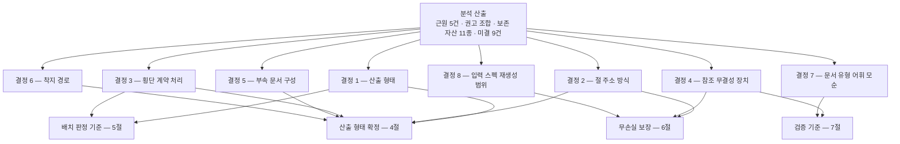
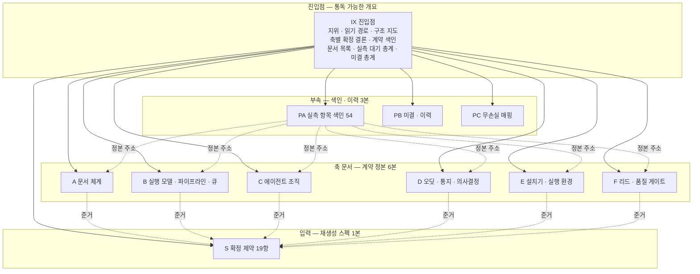
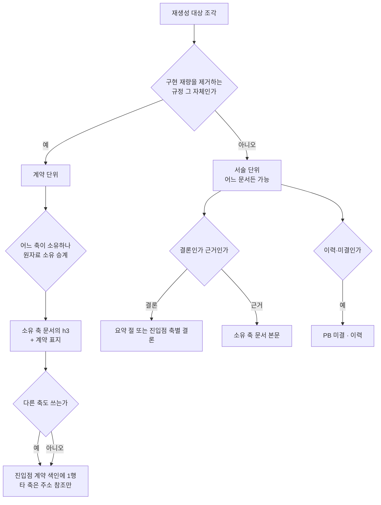
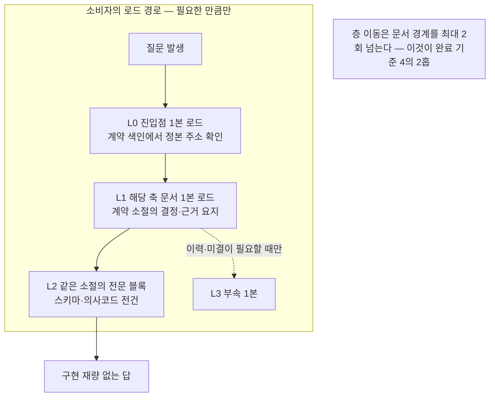
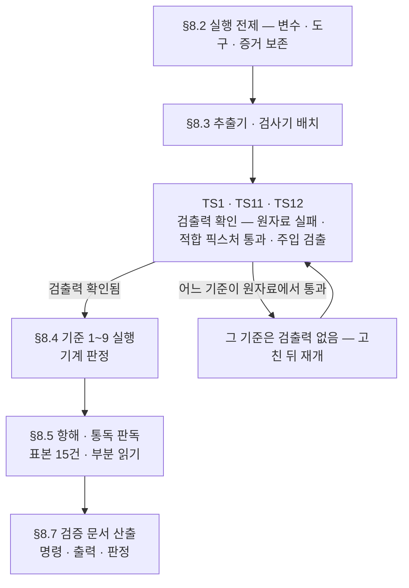
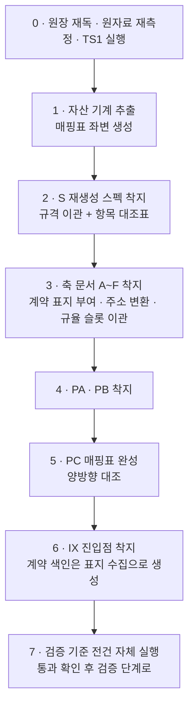

# 설계 프롬프트·설계 문서 재생성 — 구조 설계

## 요약

**무엇을 확정했나.** 재생성본의 산출 형태를 **11본 분권**으로 확정했다 — 진입점 1본(통독 가능한 개요) · 축 문서 6본(계약 정본) · 부속 3본(색인·이력·무손실 매핑) · 재생성 입력 스펙 1본. 분석 권고(진입점 1 + 축 6 + 횡단 계약 문서 1~2 + 부속 3~4 = 11~13본)에서 **횡단 계약 문서 분리를 기각**하고 **색인화 + 계약 표지**로 대체했으며(결정 3), 부속 5본 1:1 이관 대신 **3본 통합**을 택했다(결정 5). 두 수정 모두 근거는 같다 — 문서를 늘리는 것과 검색 기제를 세우는 것은 다른 일이고, 분석이 실측한 결손은 후자다.

**무엇으로 판정하는가.** 본문에 남길 것과 부속으로 내릴 것의 경계를 취향이 아니라 **계약 단위(정의 단위)와 서술 단위의 구분**으로 고정했다(§5). 계약 단위에는 저자가 `[계약]` 표지를 달고, 진입점의 계약 색인이 그 표지를 수집한다. 이로써 세 가지가 동시에 기계 검사 대상이 된다 — 개요/상세 분리(진입점·부속에 표지 0건), 이중 정의(표지 계약명 중복 0건), 정본 소재의 색인화(표지 집합 = 색인 집합).

**주소는 어떻게 유일해지나.** 문서 접두 + 문서 내 절 번호의 2단 주소를 채택했다(결정 2). 축 문서는 기존 축 별칭 `A`~`F`를 그대로 접두로 쓰고, 진입점 `IX` · 부속 `PA`·`PB`·`PC` · 스펙 `S`를 더한다. 재측정 결과 원자료의 절 참조 1,503건은 스펙 참조 756 · 무자격 608 · 장 한정 107 · 축 한정 32로 갈리며(§3.2), 이 중 축 문서 내부의 무자격 586건은 기계 변환 대상이고 22건만 개별 판독이 필요하다.

**무손실은 무엇으로 보장하나.** 매핑표를 기계 판독 블록으로 두고 **양방향 대조**를 건다(§6) — 좌변은 원자료에서 기계 추출한 자산 집합과 대조해 누락 0건, 우변은 재생성본에서 같은 추출을 돌려 출처 불명 0건. 손으로 나열한 목록은 좌변으로 인정하지 않는다.

**검증 기준은 9항목**이며(§7) 줄 수 상한은 기준에서 제외했다. 각 항목은 원자료에 돌리면 실패하고 재생성본에 돌리면 통과해야 하며, 그 실패 확인이 테스트 시나리오 TS1이다(§8) — 통과만 하는 검사는 검사가 아니다.

**보고 — §11에 9항목**(`11-1`~`11-9`). 설계 1차가 낸 6항목: 디스패치 프롬프트의 착지 디렉토리 제안이 요청 원장 완료 기준 2와 어긋나 원장을 따랐다 · 분석의 코드펜스 블록 수 160은 구분선 줄 수다 · 분석이 사람 결정 대상으로 넘긴 미결 하나는 원장 문면으로 이미 확정돼 있다 · 문서작성 단계 산출에 걸리는 증거 계약이 문서 산출과 부정합이다 · 참조 슬롯 신설의 스키마 판 문제 · 선행 보고 3건의 이월. 심화 라운드가 더한 3항목: 자산 기준값 정정 2건(코드펜스 실블록은 **81** — 1차 정정값 80도 재측정에서 1건 미달 · 부속 참조 36은 두 변환 규칙이 섞인 값) · 부속 B의 `B-n` 표기가 그룹과 항목 두 축에 겹쳐 항목 식별자 부여가 충돌한다 · 정제 스캔이 대소문자 구분 실행에 의존한다.

**심화 라운드에서 무엇이 더해졌나**(설계 2/2 · staff engineer). 위 확정에 실행 가능성을 붙였다 — 판정 기준이 명령으로 조작화되지 않으면 검증은 다시 판독 재량이 된다.

| 더한 것 | 어디 | 무엇을 막나 |
|---|---|---|
| 개요/상세 분리의 **층위 계약** L0~L3 + 배치 규칙 P7~P11 | §5.4~§5.6 | "요지와 전문"이 취향으로 갈리는 것 · 분리 규칙이 분량 상한으로 오독되는 것 |
| 무손실 매핑의 **기계 검증 규칙** M8~M14 + 규율 39건 전건 대조 블록 스키마 | §6.6 | 손 나열 좌변 · 좌우변 추출기 불일치 · 총량 감소의 무설명 통과 |
| 자산 기준값 **재측정과 정정 3건** + 확인 8건 | §6.7 | 틀린 기준값이 소실을 정상으로 판정하는 것 |
| 검증 기준 9항목의 **실행 절차 전문**(추출기·검사기 스크립트 · 명령 · 기대 출력) | §8.2~§8.4 | 검증 단계의 판독 재량 · 재현 불가능한 판정 |
| **통독·항해 검증 절차**(표본 15건 · 홉 계수 규칙 · 부분 읽기 시험 · 기록 양식) | §8.5 | 항해 가능성 주장이 인상 진술로 남는 것 |
| **TS1 선행 실패 실측 기록**(원자료에서 기준 1·3·4·6이 실제로 실패함을 확인) | §8.6 | 검출력 없는 검사가 통과를 만들어내는 것 |

심화 라운드가 발견한 것 중 설계 판단을 바꾼 것은 셋이다. ①검증 기준 1은 원자료에서 **공허 통과**한다 — 진입점·부속이 없으면 "표지 0건"이 통과 조건을 만족한다. 관할 검사(모든 계약 전문 블록의 최근접 상위 소절이 표지를 보유)와 비공허 하한을 추가했다(§8.4). ②검증 기준 2의 "규율 39건 전건이 장치 슬롯 동반"은 브랜치 비공백으로 읽으면 원자료가 22/39라 재생성본이 통과하려면 없던 내용을 만들어야 한다 — 슬롯 스팬 실재로 조작화했다(§6.7). ③요약 3항은 어휘 탐색으로는 판정이 휴리스틱이 된다 — 고정 라벨로 계약했다(P11).

## 1. 이 문서의 지위와 선행 단계 대조

### 1.1 지위

- 본 문서는 요청 원장 `RQ-20260728T170616Z-d0bc4127`의 **설계 단계 산출**이다. 재생성본 자체가 아니라 **재생성본의 구조 규격과 판정 기준**을 확정한다.
- 완료 판정의 정본은 요청 원장 본문 `## 완료 기준`의 기계 판독 블록이다. 본 문서 §7의 검증 기준은 그 완료 기준을 재생성본에 걸리는 검사로 조작화한 것이며, 완료 기준을 대체하지 않는다.
- 분석 단계 산출 `DS-20260728T171936Z-85146dc7`의 §13이 설계에 요구한 5건 — 근원 5건 항목별 답 · 권고 구조의 채택·수정·기각 · 보존 자산 11종의 이관 목적지 · 미결 9건 · 관측 5건의 반영 — 은 각각 §9.1 · §3 · §6.3 · §9.2 · §11에서 답한다.

### 1.2 착수 전 정본 재확인

정본 대조는 프롬프트 요약이 아니라 실물에 대해 수행했다.

| 대조 축 | 프롬프트·선행 문서의 단언 | 착수 시 실측 | 처리 |
|---|---|---|---|
| 설계 문서 줄 수 | 디스패치 프롬프트 4,369줄 | **4,404줄** (`wc -l`, 파일 수정 시각 2026-07-29 02:01:46 KST) | 실측값 사용. 원장·분석이 이미 보고한 건과 동일 |
| 완료 기준 | 프롬프트가 항목을 열거 | 원장 본문 `## 완료 기준` 9항목 실재 | 원장 문면으로 판정 |
| 산출 착지 위치 | 프롬프트가 평면 디렉토리 지정 | 원장 완료 기준 2가 경로 문법 준수를 요구 | **원장을 따름** — §11-1 보고 |
| 코드펜스 블록 수 | 분석 §4.1·§8이 160건 | 구분선 줄 160 = **블록 80건** | 보존 자산 대조 기준값 정정 — §11-2 |

### 1.3 실측 재측정 (값은 측정 시점 값)

측정 방법은 분석 §3의 절차를 그대로 재사용했다. 재측정에서 분석과 어긋난 항목은 위 표의 코드펜스 1건뿐이다.

| 지표 | 재측정값 | 분석 보고값 | 일치 |
|---|---:|---:|:---:|
| 줄 / 바이트 / 문자 | 4,404 / 408,113 / 232,829 | 동일 | O |
| 헤딩(코드펜스 밖) | 286 — h1 11 · h2 79 · h3 178 · h4 18 | 동일 | O |
| mermaid 블록 | 38 | 38 | O |
| 코드펜스 블록 | **80**(구분선 160줄) | 160 | **X** |
| 표 행 | 1,041 | 1,041 | O |
| 규율 항목 | 39 (R1~R39, 중복 0) | 동일 | O |
| 절 참조 `§` 총계 | 1,503 (그중 `§N.M` 형태 1,027) | 동일 | O |
| 장 경계 | 진입부 42 · 본편 785/785/702/549/737/660 · 부속 61/42/24/6 | 동일 | O |

## 2. 무엇이 결정 대상인가

분석은 항해 실패의 근원 5건과 권고 조합을 고정했으나, 그 권고를 실행 가능한 지침으로 만들려면 여덟 지점에서 택일이 필요하다. 아래 §3이 각각을 대안 비교로 결정한다. 결정 없이 옵션을 나열하지 않는다.



## 3. 결정 — 대안 비교와 트레이드오프

### 3.1 결정 1 — 산출 형태

**후보**

| 안 | 형태 | 문서 수 |
|---|---|---:|
| 1-a | 현행 단일 파일 유지 + 앵커·색인 보강 | 1 |
| 1-b | 개요 1 + 상세 1의 2분할 | 2 |
| 1-c | **진입점 1 + 축 6 + 부속 3 + 스펙 1** | 11 |
| 1-d | 분석 권고 원안 — 진입점 1 + 축 6 + 횡단 계약 1~2 + 부속 3~4 + 스펙 1 | 12~14 |
| 1-e | 축을 더 쪼갠 세분권 — 최장 축을 절 단위로 분할 | 20 이상 |

**평가** (평가 축은 분석 §7.2를 그대로 사용하되, 재생성 고유 축인 '이관 추적 가능성'을 더했다)

| 평가 축 | 1-a | 1-b | 1-c | 1-d | 1-e |
|---|:-:|:-:|:-:|:-:|:-:|
| 항해 — 임의 주제 2홉 도달 | 미달 | 부분 | 충족 | 충족 | 충족 |
| 부분 읽기 — 1회 로드 단위 | 미달 | 부분 | 충족 | 충족 | 충족 |
| 정본 단일성 | 미달 | 미달 | 충족 | 충족 | 위험 — 소유가 절 단위로 흩어짐 |
| 소유 경계 보존 | 무영향 | 무영향 | **보존** | **이동 발생** | **붕괴** |
| 이관 추적 가능성 | 최고 | 높음 | 높음 | 중 | 낮음 |
| 문서 메타 오버헤드 | 최저 | 낮음 | 중 | 중 | 높음 |
| 규격 적합 — 문서당 필수 절·게이트 | 미달 | 부분 | 충족 | 충족 | 충족 |

**결정: 1-c.**

근거 셋.
1. **1-a·1-b는 근원을 남긴다.** 4,404줄 단일 파일은 새 문서 규격 위반은 아니지만 부분 로드 단위가 없다는 근원 RC1을 그대로 둔다. 2분할은 상세본이 3,000줄대로 남아 RC1이 상세본으로 이월될 뿐이다.
2. **1-d는 소유를 이동시킨다.** 이 판단이 분석 권고와 갈리는 지점이며 §3.3에서 상술한다.
3. **1-e는 정본 단일성을 깬다.** 절 단위 분권은 "이 계약이 어느 문서 소유인가"를 절마다 다시 정해야 하고, 조립 통일 내역 17건이 기록한 소유 확정을 되돌린다. 최장 절(352줄)의 층위 문제는 문서를 쪼개는 것이 아니라 **헤딩 깊이를 의미에 결속**시켜 해소한다(§5 배치 규칙 P4) — 분할 단위와 층위 규율은 다른 축이며, 분석 미결 Q1이 물은 것은 전자다.

### 3.2 결정 2 — 절 주소 방식 (분석 미결 Q2)

**후보와 비용 실측**

재측정으로 각 안의 변환 대상 건수를 고정했다. 원자료의 `§` 참조 1,503건 분류:

| 참조 형태 | 건수 | 재생성 시 처리 |
|---|---:|---|
| 스펙 참조 (`스펙 §…`) | 756 | 스펙 접두로 정규화 |
| 무자격 참조 (`§…` 단독) | 608 | 소속 문서 접두 부여 |
| ├ 그중 단독 표기 | 498 | 자기 축 접두 기계 부여 |
| └ 그중 연쇄 표기 (직전에 `·`·`~`·`, `) | 110 | 직전 참조의 자격을 상속하는 것으로 보이며, 전건 판독은 하지 않았다 — 변환 시 개별 확인 |
| 장 한정 (`N장 §…`) | 107 | 접두 표기로 정규화 |
| 축 한정 (`축 X §…`) | 32 | 접두 표기로 정규화 |

무자격 608건의 문서별 분포: 축 문서 6본 합계 586 · 진입부 11 · 부속 11. **축 문서 내부 586건은 "장 내부의 §N은 그 장 자신의 절 번호"라는 기존 해석 규약이 그대로 변환식이 되므로 기계 변환 대상**이고, 진입부·부속의 22건은 소속 장이 문면에서 정해지지 않아 개별 판독이 필요하다(표본 확인 — 부속의 무자격 참조는 `§4.4`·`§12 T3` 형태로 다른 장을 가리킨다).

| 축 | 2-a 문서 접두 + 절 번호 | 2-b 전역 연속 번호 | 2-c 문서 ID + 앵커 |
|---|---|---|---|
| 표기 예 | `A§4.2` | `§147` | `DS-20260728T…Z-41b9cace§4.2` |
| 변환 비용 | 접두 부여 — 586건 기계 + 22건 판독 | 1,027건 전건 재번호 + 참조 재매핑 | 접두 자리에 ID 삽입 — 기계 |
| 절 추가 시 유지비 | 없음 — 문서 내부에서만 번호가 유일하면 됨 | 높음 — 삽입마다 후속 번호가 밀림 | 없음 |
| 사람·모델 가독 | 높음 | 낮음 — 번호가 위치 정보를 담지 않음 | 낮음 — 32자 접두 |
| 게이트 검사 가능성 | 문자열 대조로 가능 | 가능 | 최고 — 문서 실재까지 검사 |
| 원자료 참조 이력 보존 | 절 번호가 남아 원자료 대조가 쉬움 | 끊김 — 매핑표 없이는 추적 불가 | 절 번호가 남음 |

**결정: 2-a — 문서 접두 + 문서 내 절 번호.** 게이트 검사 가능성이 가장 높은 2-c를 채택하지 않는 근거는, **본문 참조와 프론트매터 참조를 같은 표기로 통일할 필요가 없다**는 점이다. 문서 간 참조 무결성은 프론트매터 `refs`가 문서 ID로 담당하고(게이트 E07·E08이 검사), 본문 주소는 사람과 모델이 읽는 층이다. 두 층을 분리하면 각 층이 자기 축에서 최적이 된다.

**주소 문법 (확정)**

```text
ADDR   := DOC "§" SEC
DOC    := "IX" | "S" | "PA" | "PB" | "PC" | "A" | "B" | "C" | "D" | "E" | "F"
SEC    := N ( "." M )*          # 문서 내 절 번호. 문서 안에서 유일
ITEM   := DOC "-" TAG N         # 부속 문서의 항목 식별자 (예: PB-B5)
RULE   := "R" N                 # 규율 항목 — 재생성본 전역에서 유일
```

- 파서는 두 글자 접두(`IX`·`PA`·`PB`·`PC`)를 한 글자 접두(`A`~`F`·`S`)보다 먼저 매칭한다. 접두 집합이 서로의 접두사가 아니므로 모호가 발생하지 않는다.
- **전역 유일성의 성립 조건**: DOC이 유일하고 SEC이 문서 내부에서 유일하면 ADDR은 전역 유일이다. 이 성질은 §7 검증 기준 V4가 직접 검사한다.
- **기존 표기 중 충돌 1건 — 4장의 `D.N`**: 오딧·통지 축은 절을 `D.0`~`D.10`으로 표기하며 본문에 156건 등장한다. 축 코드 `D`를 부여하면 `D.5`와 `D§5`가 같은 대상을 두 표기로 가리키게 된다. **`D§N`으로 단일화**하고 변환 156건을 매핑표에 기록한다.
- **부속 항목 식별자**: 기존 `부록 B-5` → `PB-B5`, `부록 C-8` → `PB-C8`. 원 접두 문자를 항목 태그로 보존해 이관 추적이 자명해진다(본문 참조 36건이 기계 변환 대상이 된다).

### 3.3 결정 3 — 횡단 계약의 처리 (분석 미결 Q4)

분석 §7.4는 "필드 표·상태 enum·오류 코드·판정식 목록·증거 계약을 정본 1~2본으로" 분리할 것을 권고했다. 이 권고의 목표(근원 RC5 해소)에는 동의하되 수단을 바꾼다.

| | 3-a 별도 문서 분리 (분석 권고) | 3-b **계약 표지 + 진입점 색인** (채택) |
|---|---|---|
| RC5 해소 — 정본 소재의 색인화 | 충족 | 충족 |
| 근원 RC4의 미도달 2건 해소 | 충족 — 계약이 자기 헤딩을 가짐 | 충족 — 계약이 자기 헤딩과 표지를 가짐 |
| 소유 축 이동 | **발생** — 오류 코드 15종·프론트매터 스키마·증거 계약은 현재 문서 체계 축 소유다. 새 문서로 옮기면 소유가 이동한다 | 없음 — 소유는 그대로, 색인만 신설 |
| 조립 통일 내역 17건과의 관계 | 그 17건이 확정한 소유를 일부 되돌림 | 보존 |
| 무손실 원칙과의 관계 | 소유 이동은 형태 변경이 아니라 내용 변경 | 형태 변경에 머무름 |
| 이중 정의 위험 | 증가 — 축 문서가 자기 계약을 다시 서술할 유인이 생김 | 감소 — 표지 중복이 곧 검출 신호 |
| 문서 수 | +1~2 | +0 |

**결정: 3-b.** 근거는 소유 이동이다. 분석 §4.6이 찾아낸 미도달 2건(오류 코드 15종 · 증거 필드 계약)의 실제 결손은 "다른 문서에 있어야 한다"가 아니라 **"어떤 헤딩에도 이름이 없다"** 였다. 결손이 헤딩 부재라면 처방은 헤딩 승격이고, 문서 신설은 그보다 큰 개입이면서 소유 이동이라는 부작용을 동반한다. 더 작은 개입으로 같은 검색 기제가 서므로 문서 신설은 과설계다.

**표지 규약 (확정)**

- 계약을 정의하는 헤딩은 제목 끝에 `[계약]` 표지를 단다. 예: `### 4.2 착지 게이트 오류 코드 [계약]`
- 표지가 붙은 헤딩의 주소·계약명은 진입점의 계약 색인에 1행씩 대응한다. 색인은 표지 수집으로 생성하며 손으로 유지하지 않는다.
- 표지는 저자의 선언이므로 분류에 오탐이 없다. 누락은 검증 단계의 후보 스캔(§7 V1의 how)이 잡는다.

### 3.4 결정 4 — 절 단위 참조의 무결성 장치 (분석 미결 Q3)

| | 4-a 착지 게이트가 앵커 검사 | 4-b **검증 단계 배치 검사** (채택) | 4-c 검사 없음 |
|---|---|---|---|
| 분할이 유실 경로가 되는가 | 막힘 | 막힘 — 시점이 착지가 아니라 검증 | 유실 경로 |
| 전방 참조 처리 | **문제 발생** — 아직 착지하지 않은 문서의 절을 가리키면 거부되어, 착지 순서를 절 단위까지 강제하게 됨 | 없음 — 전건 착지 후 1회 검사 | 해당 없음 |
| 상시 비용 | 착지마다 전 문서 주소 집합 재구축 | 검증 시 1회 | 0 |
| 오탐 | 인용·예시 안의 주소 표기가 걸림 | 같은 오탐이지만 판독자가 있음 | 해당 없음 |
| 탐지-무소비 위험 | 낮음 | **낮음 — 검증 기준 V4의 통과 조건이라 소비처가 있다** | 해당 없음 |

**결정: 4-b.** 게이트는 문서 ID 참조만 검사하고(기존 E07·E08 그대로), 절 주소 해소는 검증 단계가 전수 배치로 판정한다. 근거 둘 — ①전방 참조는 분권 구조의 정상 상태이므로 착지 시점 검사는 착지 순서를 절 단위까지 구속한다 ②주소가 전역 유일해지면 해소 판정이 문자열 집합 연산이라 배치 1회로 충분하다. 경고만 내고 아무도 읽지 않는 검사가 되지 않도록, 이 검사는 §7 V4의 통과 조건에 직접 묶는다.

### 3.5 결정 5 — 부속 문서 구성 (분석 미결 Q6)

원자료의 부속은 4종이다 — 실측 항목 색인 54건(61줄) · 미해소 지적 25항(42줄) · 조립 통일 내역 17건(24줄) · 자기 일관성 검사 기록(6줄).

| | 5-a 1:1 이관 4본 + 매핑표 1본 = 5본 | 5-b **3본 통합** (채택) | 5-c 전부 파생 인덱스로 이동 |
|---|---|---|---|
| 이관 매핑 자명성 | 최고 — 1:1 | 높음 — 항목 태그 보존으로 추적 가능 | 낮음 |
| 로드 단위로서의 의미 | 6줄 문서 1본이 발생 | 세 이력 자산이 한 로드 단위 | 해당 없음 |
| 문서 메타 오버헤드 | 문서당 필수 필드 17종 × 5 | × 3 | 0 |
| 무손실 검증 대상 여부 | 포함 | 포함 | **이탈** — 문서 트리 밖은 완료 기준 3의 대조 대상이 아님 |
| 진입점 목차 항해 비용 | 항목 5 | 항목 3 | 항목 0이나 자산 추적 불가 |

**결정: 5-b — 부속 3본.**

| 접두 | 문서 | 담는 것 | 원자료 출처 |
|---|---|---|---|
| `PA` | 실측 항목 색인 | 설치 전 실측 항목 54건 · 각 항목의 정본 주소 열 | 부록 A |
| `PB` | 미결·이력 | 미해소 지적 25항(`PB-B1`~) · 조립 통일 내역 17건(`PB-C1`~) · 자기 일관성 검사 기록 | 부록 B·C·D |
| `PC` | 무손실 매핑 | 원자료 자산 ↔ 재생성본 주소의 전건 매핑표 · 신규 산출 목록 | 신규 |

5-c를 기각하는 근거는 검증 대상 이탈이다. 파생물은 문서 트리 밖이라는 규율과 "설계 산출은 문서"라는 요구가 맞선다는 것이 분석 Q6의 물음이었는데, 결정 요인은 셋째 축이다 — **완료 기준 3의 무손실 대조는 문서에만 걸린다.** 색인을 트리 밖으로 빼면 54건이 대조 대상에서 빠진다. 다만 PA는 축 문서에서 재생성 가능한 성질을 가지므로, **생성 규칙을 PA 본문에 명시하고 손 갱신을 금지**한다. 별도의 기계 소비용 파생 인덱스를 두는 것은 이번 범위 밖이다(소비처가 아직 없다).

### 3.6 결정 6 — 착지 경로

| | 6-a 평면 디렉토리 (디스패치 프롬프트 제안) | 6-b **문서 규격 경로** (채택) |
|---|---|---|
| 요청 원장 완료 기준 2 | **위반** — 경로 문법 위반이 산출 건수만큼 발생 | 충족 |
| 파일명 문법 | 위반 — 규격 파일명이 아님 | 충족 |
| 문서 간 참조 | 상대 경로 문자열 | 프론트매터 참조 슬롯 + 문서 ID |
| 정제 스캔 | 경로 문자열 자체가 금지 패턴에 걸림 | 본문에 경로 리터럴이 필요 없음 |
| 게이트 검사 가능성 | 없음 | E03~E08 전 항목 |

**결정: 6-b.** 재생성본 11본은 리허설 트리의 규격 경로 `docs/design/public/2026/07/`에 착지하고, 문서 간 관계는 경로가 아니라 프론트매터 참조 슬롯으로 맺는다. 디스패치 프롬프트가 제안한 평면 디렉토리를 따르지 않는 근거는 원장 완료 기준 2의 문면이며, 이 불일치는 §11-1에 보고한다.

**참조 슬롯 (신설 2종)**

| 슬롯 | 방향 | 타입 | 필수 | 기대 유형 |
|---|---|---|---|---|
| `refs.parts` | 진입점 → 구성 문서 | ID[] | 진입점만 필수 | DS |
| `refs.spec` | 재생성 설계 문서 → 재생성 스펙 | ID | 선택 | RF |

- **역방향 슬롯은 두지 않는다.** 구성 문서가 진입점을 가리키면 상호 참조가 되어 착지 시점에 어느 쪽도 상대 실재를 만족시키지 못한다. 역방향은 파생 인덱스가 계산한다 — 대체 관계의 역방향 처리와 같은 패턴이다.
- 슬롯 신설이 스키마 판 상승을 요구하는 변경인지는 미확정이다. 리허설에서는 선택 슬롯으로 쓰고, 실 가동 시의 판정 필요를 `PB`에 미결로 등재한다(§11-4).

### 3.7 결정 7 — 문서 유형 어휘 모순 (분석 미결 Q5 · 봉쇄성)

분석 §11-3이 보고한 모순: 규율 슬롯 린트는 적용 대상을 `type ∈ {design, decision, norm, charter}`로 선언하는데, 착지 게이트가 강제하는 `type`은 유형 코드 집합이며 ID 접두와 교차 검증된다. 두 어휘가 겹치지 않으므로 **규격을 지켜 착지한 어떤 문서도 린트 적용 대상이 되지 않는다.**

| | 7-a 린트 어휘를 유형 코드로 치환 | 7-b **트리거를 내용 기반으로 재선언** (채택) | 7-c 유형 코드 집합에 이형 값 추가 |
|---|---|---|---|
| 모순 해소 | 해소 — `{DS, DN, RF}` | **해소 — 유형 어휘를 참조하지 않으므로 갈릴 어휘가 소멸** | 해소되지 않음 — 이형 허용은 우회 표면을 다시 엶 |
| 과적용 | 발생 — 규율과 무관한 참조 문서 전건이 대상 | 없음 — 규율 표기를 쓴 문서만 | 해당 없음 |
| 우회 가능성 | 유형을 바꿔 회피 | 표기를 안 쓰면 규율로 인정되지 않으므로 회피 이익이 없음 | 높음 |
| 검사식 복잡도 | 동일 | **감소** — 유형 조회가 사라짐 | 증가 |

**결정: 7-b — 적용 트리거를 "본문에 규율 항목 표기가 1건 이상 존재하는 문서"로 재선언한다.** "규율 항목 없음" 선언 줄의 요구는 규율을 담아야 하는 유형(`DS`·`DN`)에만 부과한다.

**단, 이 결정을 재생성본에 반영하지 않는다.** 재생성의 범위는 형태이고, 스키마 변경은 내용이다. 재생성본과 원자료의 차이가 곧 형태 변경분이어야 무손실 검증이 성립하므로, 내용 변경을 같은 산출에 섞으면 검증 전제가 깨진다. 처리: 원자료의 해당 절을 그대로 이관하고, 모순을 `PB`의 미결 항목으로 갱신 등재하며, 시정은 별도 요청으로 세운다.

분석이 이 미결을 봉쇄성으로 분류한 이유는 아부 금지 장치의 문서 축 집행 경로가 여기 걸려 있다는 것이었다. **봉쇄는 해제된다** — 이번 산출의 아부 금지 판정은 원장 완료 기준 7이 정한 대로 전문 스캔과 전문가 판독이며(§7 V7), 린트 장치의 작동이 완료 조건이 아니다. 봉쇄의 실체는 "설계가 답을 모른다"가 아니라 "반영 여부가 미정이라 산출 범위가 안 정해진다"였고, 범위를 분리함으로써 해소된다.

### 3.8 결정 8 — 입력 스펙의 재생성 범위 (분석 미결 Q8 · 봉쇄성)

분석은 이 항목을 사람 결정 대상으로 넘기며 "포함" 쪽을 권고했다. **정본 대조 결과 이미 확정돼 있다** — 요청 원장 본문 완료 기준 2의 문면이 "재생성된 **설계 프롬프트와** 설계 문서가 새 문서 규격을 만족한다"이다. 원장이 완료 판정의 정본이므로 포함은 결정 대상이 아니라 기정 사실이며, 별도의 사람 결정 경로를 태울 근거가 없다(§11-3 보고).

남는 것은 **순환 준거를 어떻게 푸는가**이고, 여기에 결정이 필요하다.

| | 8-a 스펙 내용까지 재작성 | 8-b **규격 이관 한정** (채택) |
|---|---|---|
| 준거 이동 | 발생 — 설계 문서의 준거가 바뀌어 기존 산출의 정합성 판정이 불가 | 없음 |
| 확정 제약 19항 | 재해석 여지 | 문면 무손실 + 주소 부여만 |
| 검증 가능성 | 낮음 — 무엇과 대조할지가 사라짐 | 높음 — 항목 대조표로 준거 불변 증명 |
| 원장 완료 기준 3(무손실)과의 관계 | 충돌 위험 | 정합 |

**결정: 8-b.** 스펙 재생성은 ①프론트매터·필수 절의 규격 이관 ②`## 요약` 절 신설 ③절 주소 접두 `S` 부여 ④항목 대조표 산출에 한정한다. 확정 제약 19항의 문면은 무손치 전사한다.

**스펙은 분권하지 않는다.** 근거는 근원 대조다 — 스펙은 666줄로 1회 로드 가능하고(RC1 미해당), 절 번호가 유일하며 모호 참조 0건이고(RC2 미해당), 진입점 역할의 `§0` 절을 이미 갖는다(RC4 미해당). 남는 것은 층위 미분리(RC3)와 요약 절 부재뿐이며, 둘 다 문서 내부 처리로 해소된다. 분권은 해소할 근원이 없는 곳에 비용만 더한다.

**문서 유형은 `RF`(참조)** 로 착지한다 — 스펙은 설계의 입력이지 단계 산출이 아니다. `source` 필드는 발화 원문 전사 문서를 가리킨다.

**참조 표기 단일화**: 기존 `스펙 §N` 756건을 `S§N`으로 치환한다. 근거는 파서 단일화다 — 주소 문법이 하나여야 §7 V4의 해소 판정이 하나의 규칙으로 전건에 걸린다. 치환은 단순 문자열 변환이다.

## 4. 산출 형태 확정

### 4.1 문서 구성 — 11본



| 접두 | 문서 | 유형 | stage | 무엇을 소유하나 |
|---|---|---|---|---|
| `IX` | 진입점 | DS | dev | 소유 없음 — 색인과 개요만 |
| `A` | 문서 체계 | DS | dev | 트리·파일명·채번·프론트매터 스키마·착지 게이트·수명주기·태그·백업 |
| `B` | 실행 모델·파이프라인·큐 | DS | dev | 요청 상태기계·워크플로 실행·큐/스케줄러·자발 요청 게이트·검증-반영 결합 |
| `C` | 에이전트 조직 | DS | dev | 역할 정의·모델 티어·프롬프트 골격·3렌즈 운용·이름 레지스트리·통신 평면·스킬 매핑 |
| `D` | 오딧·통지·의사결정 | DS | dev | 훅 설계·오딧 스트림 레코드·신원 전파·의사결정 문서 운용·3채널 통지·에이징 |
| `E` | 설치기·실행 환경 | DS | dev | 설치 트랜잭션·멱등·환경 인터뷰·플랫폼 차이 흡수·세션 기본값·버전 체계 |
| `F` | 리드·품질 게이트 | DS | dev | 판정 대상·수용 기준·응답 클래스·번복 감지·권한 협착·슬롯 린트·과공학 경계 |
| `PA` | 실측 항목 색인 | DS | dev | 소유 없음 — 정본 주소 색인 |
| `PB` | 미결·이력 | DS | dev | 미해소 지적·조립 통일 내역·자기 일관성 기록 |
| `PC` | 무손실 매핑 | DS | dev | 매핑표·신규 산출 목록 |
| `S` | 재생성 스펙 | RF | — | 확정 제약 19항·목표·계승 원칙·설계 세션 과제 |

축 경계를 현행 6장 그대로 유지하는 근거는 결합도 실측이다 — 본편 6개 장 사이의 장 한정 상호 참조는 5건뿐이고 나머지는 진입부·부속에서 나온다(분석 §7.4). 경계가 이미 낮은 결합도로 서 있으므로 새로 긋지 않는다.

### 4.2 진입점의 내부 규격

진입점은 "통독 가능한 개요"이며 판정 기준은 줄 수가 아니라 **아래 9절의 실재와 계약 정의 0건**이다.

| 절 | 담는 것 | 원자료 대응 |
|---|---|---|
| `IX§0` 요약 | 확정 3항 — 무엇을 설계했나 / 무엇이 실측 대기인가 / 무엇이 미결인가 | 진입부 요약 |
| `IX§1` 이 문서군의 지위와 사용법 | 무엇을 승인하지 않는가 · 준거는 무엇인가 | 원자료에 없음 — 스펙 `S§0`에 대응하는 절 신설 |
| `IX§2` 읽기 경로 | 역할별 진입 순서 — 구현자 · 검증자 · 설치자 · 의사결정자 | 신규 |
| `IX§3` 구조 지도 | 문서 간 관계 다이어그램 · 축 별칭 해석표 | 진입부 일러두기 |
| `IX§4` 축별 확정 결론 | 6축 각각의 결론 서술 — 계약 정의는 담지 않는다 | 진입부 요약의 확정 단락 |
| `IX§5` 계약 색인 | 계약명 → 정본 주소. 표지 수집으로 생성 | 신규 — 근원 RC5 해소 |
| `IX§6` 문서 목록 | 접두 · 제목 · 문서 ID · 소유 범위 | 진입부 목차 |
| `IX§7` 실측 대기 총계 | 54건 총계와 축별 분포. 전수는 `PA` | 원자료 요약의 실측 단락 |
| `IX§8` 미결 총계 | 미해소 지적 총계와 성격별 분류. 전수는 `PB` | 원자료 요약의 보류 단락 |
| `IX§9` 주소·참조 표기 규약 | 주소 문법 · 읽는 법 | 진입부 일러두기 |

읽기 경로(`IX§2`)는 분석 §5.3이 지적한 공백 — 스펙에는 있고 설계 문서에는 없는 "누가 어느 순서로 읽는가" — 을 메운다. 근원 RC4의 직접 해소 수단이다.

### 4.3 축 문서의 내부 규격

```text
(frontmatter)
## 요약                      ← 필수. 확정 3항 (§5 배치 규칙 P5)
## 1. 범위와 소유 경계        ← 이 축이 소유하는 계약 / 타 축 위임분은 주소 참조만
## 2. ~ ## N. <계약 그룹>     ← h2 = 계약 그룹, h3 = 개별 계약 [계약] 표지 단위
## N+1. 설치 전 실측 항목     ← 정본. PA가 색인
## N+2. 미결점                ← PB로 이관하고 주소 참조
## 참조                       ← S 및 타 축 주소
```

- 규율 항목 `- [R번호]`는 해당 계약의 h3 안에 위치하며, `[장치 — … | 장치 불가 — …]` 슬롯을 동반 이관한다.
- 헤딩 깊이는 의미에 결속한다 — h2는 그 축의 산출 단위, h3는 개별 계약 또는 한 묶음, h4는 그 안의 분기·시나리오. 길이로 깊이를 정하지 않는다(§5 P4).

### 4.4 착지 순서 — 전방 참조 회피

프론트매터 참조 슬롯은 대상 실재를 요구하므로(게이트 E07) 착지 순서가 정해진다. 본문 절 주소는 게이트 검사 대상이 아니므로 순서를 구속하지 않는다(결정 4).


## 5. 배치 판정 기준 — 본문에 남길 것과 부속으로 내릴 것

### 5.1 정의 단위와 서술 단위

배치를 취향이 아니라 판정으로 만들려면 무엇이 "정의"인지를 먼저 닫아야 한다.

| 구분 | 정의 | 예 | 중복 금지 대상인가 |
|---|---|---|---|
| **계약 단위** | 구현 재량을 제거하는 규정 그 자체 | 필드 표 행(이름·타입·필수·기입 주체) · enum 원소 목록 · 판정식 의사코드 · 오류 코드표 · 경로/파일명/ID 문법 · 상태 전이표 행 · 스키마 블록 · 규율 항목 | **예 — 정본 1곳** |
| **서술 단위** | 계약의 근거·맥락·시각화 | 요약 · 결정 근거 · 대안 비교표 · 평가표 · 다이어그램 · 해설 | 아니오 |

이 구분이 완료 기준 5("같은 계약이 두 곳에서 정의되지 않는다")를 판정 가능하게 만든다 — 금지되는 것은 계약의 이중 정의이지 서술의 존재가 아니다. 요약이 여러 문서에 있는 것은 중복이 아니고, 오류 코드표가 두 문서에 있는 것은 중복이다.

### 5.2 배치 규칙

- **P1 — 계약 단위는 소유 축 문서에만 둔다.** 소유는 원자료의 기존 소유(조립 통일 내역 17건이 확정한 것 포함)를 그대로 승계한다.
- **P2 — 진입점과 부속에는 계약 단위를 두지 않는다.** 진입점은 색인과 개요만, 부속은 색인과 이력만 담는다.
- **P3 — 타 축의 계약은 주소 참조만 한다.** 값을 재기술하지 않는다. 재기술이 필요해 보이면 소유 경계가 잘못 그어진 것이므로 소유를 옮기고 매핑표에 기록한다.
- **P4 — 헤딩 깊이는 의미에 결속한다.** h2 = 계약 그룹, h3 = 개별 계약, h4 = 분기·시나리오. 길이 상한으로 쪼개지 않는다.
- **P5 — 각 문서의 `## 요약`은 그 문서만 읽고 판단할 수 있는 결론을 담는다** — 확정 / 실측 대기 / 미결 3항. 계약 단위를 담지 않는다. 분량 상한을 두지 않고 **내용 항목으로 계약**한다(분석 미결 Q7의 답 — 상한을 두면 완전성 우선 확정에 어긋나고, 안 두면 요약이 다시 상세가 되므로 항목으로 닫는다).
- **P6 — 부속의 각 항목은 정본 주소 열을 갖는다.** 색인이 정본을 대체하지 않는다.

### 5.3 판정 흐름



### 5.4 개요/상세 분리의 층위 계약 (L0~L3)

디스패치 지시의 어휘는 "본문은 결정과 근거 요지, 부속은 스키마·의사코드 전문"이다. 이 어휘를 **문서 단위로** 그대로 이행하면 계약 정본이 부속 문서로 이동해 P1(계약은 소유 축 문서에만)·P3(타 축은 주소 참조만)과 충돌하고, 완료 기준 5(정본 1곳)의 판정 대상이 흩어진다. 지시의 목적은 훑기와 파고들기의 분리이므로, 분리 축을 **문서 간 1축이 아니라 문서 간 + 문서 내 2축**으로 정의해 목적을 달성하되 소유는 이동시키지 않는다. 프롬프트와 정본이 어긋나면 정본을 따르고 불일치를 보고한다는 규율의 적용이며, 보고는 §11-9다.

| 층 | 물리적 자리 | 담는 것 | 계약 정본인가 | 1회 로드 단위 | 위반 판정 |
|---|---|---|:---:|---|---|
| **L0 색인층** | 진입점 `IX` | 축별 결론 · 계약 색인 · 문서 목록 · 읽기 경로 · 총계 | 아니다 | 문서 1본 | 계약 표지 또는 계약 전문 블록이 1건이라도 존재 |
| **L1 요지층** | 축 문서 계약 소절(h3)의 도입부 | 무엇을 결정했나(1문) + 왜인가(근거 요지) + 전문 블록으로의 지시 | 아니다 | 소절 | 필드명·enum 원소·수치 임계·경로 리터럴 등 **값**이 요지 문장에 등장 |
| **L2 전문층** | 같은 소절 안의 코드펜스·필드 표 | 스키마 · 판정식 의사코드 · enum 전건 · 문법 · 전이표 · 오류 코드표 | **그렇다** | 블록 | 표지 소절의 관할 밖에 전문 블록이 존재 |
| **L3 색인·이력층** | 부속 `PA`·`PB`·`PC` | 실측 항목 색인 · 미결 · 이력 · 무손실 매핑 | 아니다 | 문서 1본 | 계약 표지 또는 계약 전문 블록이 1건이라도 존재 |



**어휘 대응** — 지시 어휘가 이 설계의 어느 자리에 착지하는가.

| 지시 어휘 | 이 설계의 자리 | 왜 그렇게 대응시키나 |
|---|---|---|
| 본문 = 결정과 근거 요지 | L1 요지층(축 문서 소절 도입부) | 결정·근거는 서술 단위라 중복 금지 대상이 아니다(§5.1). 축 문서에 두면 계약과 같은 로드 단위 안에 있다 |
| 부속 = 스키마·의사코드 전문 | **L2 전문층**(같은 소절 안의 블록) | 전문은 계약 단위다. 별도 문서로 내리면 소유가 이동해 P1·P3와 충돌하고 이중 정의 위험이 증가한다(§3.3의 3-a 기각 근거와 동형) |
| 문서로서의 부속 | L3(`PA`·`PB`·`PC`) | 색인·이력·매핑 전용. 계약 전문을 받지 않는다(P10) |
| "상한 아님" | P9 | 어느 층에도 줄 수 상한을 두지 않는다. 완전성·구조 우선이 확정 사항이다 |

### 5.5 배치 규칙 P7~P11 (P1~P6에 이어짐)

- **P7 — 계약 소절은 3부 구성이다.** ①결정 1문(무엇이 확정인가) ②근거 요지(왜 이 선택인가 · 기각한 대안) ③전문 블록(스키마·판정식·enum). 전문 블록이 없는 소절은 계약이 아니므로 표지를 달지 않는다 — 표지는 전문의 존재와 함께 온다.
- **P8 — 요지층에 값을 쓰지 않는다.** 필드명·enum 원소·수치 임계·경로/파일명 리터럴·오류 코드는 L2에만 두고, 요지는 그 블록을 가리킨다. 요지에 값을 복사하는 순간 같은 계약이 두 자리에서 정의된다(완료 기준 5 위반의 최다 발생 경로).
- **P9 — 길이는 판정 기준이 아니다.** 어느 층에도 줄 수 상한을 두지 않는다. 위반은 "길다"가 아니라 **"요지 자리에 계약이 있다"** 또는 **"전문 자리에 결론만 있다"** 이다. 요지가 길어진 것은 근거가 두꺼운 것이고, 그 자체로는 결함이 아니다.
- **P10 — 부속 문서(`PA`·`PB`·`PC`)는 계약 전문을 담지 않는다.** 부속이 담는 것은 색인·미결·이력·매핑이며, 각 항목은 정본 주소 열을 갖는다(P6).
- **P11 — 요약 3항은 고정 라벨로 적는다.** `**확정**` · `**실측 대기**` · `**미결**` 세 문자열을 그대로 쓴다. 근거: 어휘 탐색 방식으로 3항을 판정하면 휴리스틱이 되고, 원자료 실측에서 그 방식은 요약 절 7건 중 1건만 충족으로 셌다(§8.6). 라벨을 고정하면 판정이 문자열 존재 검사가 되어 결정론이 된다.

### 5.6 층위 위반의 검출 지점

규칙마다 어디서 걸리는지를 명시한다 — 검출 지점이 없는 규칙은 산문이고, 산문 규칙은 회귀한다.

| 위반 형태 | 검출 검사 | 검출 방식 | 자동 판정 |
|---|---|---|:---:|
| 진입점·부속에 계약 전문이 들어감 | 기준 1 | 표지·전문 블록·필드 표 계수 = 0 | O |
| 전문 블록이 표지 소절 관할 밖에 있음 | 기준 1 관할 검사(§8.4) | 각 블록의 최근접 상위 h3가 표지 보유인지 | O |
| 요지층에 값이 복사됨 | 기준 3 | 계약명 중복 + 값 재기술 판독 | 부분 — 후보 자동, 판정 판독 |
| 요약 3항 결손 | 기준 6 | 고정 라벨 3종 문자열 존재(P11) | O |
| 요약 절에 계약 단위가 들어감 | 기준 6 | 요약 절 범위 안의 표지·전문 블록·필드 표 계수 = 0 | O |
| 길이를 이유로 내용을 줄임 | 기준 9 + 매핑표 | 축약 고지 표현 스캔 + `delete` 행 사유 대조 | O |
| 표지 없는 계약이 남음 | 기준 1 후보 스캔 | 관할 검사 결손 목록을 판독 대상으로 제출 | 부분 |

## 6. 무손실 보장

### 6.1 매핑 규칙

- **M1 — 매핑표는 `PC` 문서의 기계 판독 블록으로 둔다.** 산문 서술은 대조 대상이 아니다.
- **M2 — 좌변은 원자료에서 기계 추출한다.** 손으로 나열한 목록은 좌변으로 인정하지 않는다. 추출식은 분석 §3의 측정 절차를 그대로 쓴다.
- **M3 — 연산 어휘는 닫혀 있다.** `op ∈ {keep, move, split, merge, promote, delete}`. `delete`·`merge`·`split` 행은 `note` 비공백 필수이며, `delete` 행의 `note`에 분량·지면 사유 어휘가 있으면 위반이다.
- **M4 — 양방향 대조.** 좌변은 원자료 추출 집합과 일치(누락 0건), 우변은 재생성본에서 같은 추출을 돌린 결과가 매핑표 우변 ∪ 신규 목록에 포함(출처 불명 0건).
- **M5 — 규율 항목은 번호를 유지한다.** 장치 슬롯을 동반 이관하며, 표기 규약이 적용되지 않았던 축의 규율을 승격할 경우 `R40`부터 부여하고 `op: promote`로 기록한다. 승격은 손실이 아니라 표면화다.
- **M6 — 실측 항목 54건은 정본을 축 문서에, 색인을 `PA`에 둔다.** `PA`의 행 수는 축 문서에서 추출한 실측 항목 수와 일치해야 한다.
- **M7 — 다이어그램은 설명 대상 계약과 같은 문서에 간다.** 진입점의 구조 지도·읽기 경로 다이어그램은 원자료에 대응이 없으므로 신규 목록에 등재한다.

### 6.2 매핑 레코드 스키마

```yaml
# PC 문서 본문의 기계 판독 블록
mappings:
  - asset: "R17"                 # 자산 식별자 — 추출식이 만든 값
    kind: rule                   # rule|measure|heading|diagram|fence|table|open-issue|unify|consistency|constraint|task
    from: "6장 §8.2"             # 원자료 위치
    to: "F§8.2"                  # 재생성본 주소
    op: move                     # keep|move|split|merge|promote|delete
    note: ""                     # op 가 delete·merge·split 이면 비공백 필수
new:
  - asset: "IX§2 읽기 경로"
    kind: heading
    to: "IX§2"
    reason: "진입점 해상도 부족의 해소 — 원자료에 대응 절 없음"
```

### 6.3 보존 자산의 이관 목적지

분석 §8의 보존 자산 11종에 대해 우변을 확정한다. 코드펜스 블록의 대조 기준값은 분석의 160(구분선 줄 수)에서 80으로 1차 정정했고, 심화 라운드의 재측정에서 **81**로 재정정했다 — 들여쓴 펜스 1건이 줄머리 일치 방식에 잡히지 않았다(§6.7·§11-7). 아래 표의 기준값은 전부 §6.7의 재측정값이며, 인용이 아니라 재측정으로만 갱신한다(M13).

| # | 자산 | 건수 | 이관 목적지 | 대조 방법 |
|---|---|---:|---|---|
| 1 | 규율 항목 `R1`~`R39` | 39 | 각 계약의 h3 안 — 소유 축 문서 | 표기 전수 수집 후 1:1 대조 · 장치 슬롯 비공백 |
| 2 | 설치 전 실측 항목 | 54 | 정본은 축 문서의 실측 항목 절 · 색인은 `PA` | 색인 행 수 = 축 문서 추출 수 · 각 항목의 정본 주소 실재 |
| 3 | 절 헤딩(코드펜스 밖) | 286 | 축 문서·부속의 헤딩 | 헤딩 전수 수집 후 매핑표 좌변과 집합 대조 |
| 4 | mermaid 다이어그램 | 38 | 설명 대상 계약과 같은 문서 | 블록 수 대조 + 각 블록의 소속 주소 확인 |
| 5 | 표 행 | 1,041 | 계약 표는 소유 축, 근거 표는 서술 위치 | 행 수 대조 — 감소분은 `op` 와 `note` 로 설명 |
| 6 | 코드펜스 블록 | **81** (mermaid 38 · 기타 43) | 판정식·문법·스키마는 소유 축의 계약 소절 관할(L2) | 블록 수 대조 + info 문자열별 내역 대조 + 판정식 실재 대조 |
| 7 | 미해소 지적 | 25 | `PB-B1`~`PB-B25` | 항목 번호 대조 |
| 8 | 조립 통일 내역 | 17 | `PB-C1`~`PB-C17` | 항목 번호 대조 |
| 9 | 자기 일관성 검사 기록 | 1절 | `PB` 의 해당 절 | 절 실재 확인 |
| 10 | 확정 제약 19항 | 19 | `S§2-1`~`S§2-19` · 각 항에 대응 절 매핑 | 19항 각각의 대응 주소 실재 |
| 11 | 설계 세션 과제 `T1`~`T10` | 10 | `S§12` · 해소 상태를 축 문서 주소로 매핑 | 과제별 해소 주소 실재 — 미해소분은 미해소로 이관 |

### 6.4 참조 변환 규칙

| 원 표기 | 건수 | 변환 | 자동화 |
|---|---:|---|---|
| `스펙 §N` | 756 | `S§N` | 기계 치환 |
| 무자격 `§N` — 축 문서 내부 | 586 | `<자기 축 접두>§N` | 기계 부여 |
| 무자격 `§N` — 진입부·부속 | 22 | 소속 문서를 판독해 접두 부여 | 개별 판독 |
| `N장 §M` | 107 | `<축 접두>§M` | 기계 치환 |
| `축 X §N` | 32 | `X§N` | 기계 치환 |
| `D.N` (오딧 축 절 표기) | 156 | `D§N` | 기계 치환 |
| 부속 **단위** 언급 (`부록 X`) | 34 | `PA` / `PB` 문서 접두 | 기계 치환 |
| 부속 **항목** 지정 (`부록 X-N`) | **2** | `PB-B<항목번호>` | 기계 치환 + 항목 축 판독(§11-8) |

- 위 두 행은 원래 한 행(`부록 X-N` 36건)이었다. 재측정에서 36건은 **부속 언급 총계**이고 항목 번호까지 지정한 참조는 2건뿐임이 확인돼 분해했다(§6.7·§11-7). 변환 규칙이 서로 달라 한 행으로 두면 34건이 잘못된 형태로 치환된다.
- 연쇄 표기(직전 참조에 `·`·`~`·`, `로 이어진 것)는 직전 참조의 자격을 상속하는 것으로 보이나 전건 판독은 하지 않았다 — 변환 시 개별 확인 대상이다. 건수는 판정식에 따라 갈린다(설계 1차 110 · 심화 재측정 121 — 앞 문맥 창 길이 차이로 추정, 미확인). **판정식을 §8.3 추출기로 고정**하고 그 출력값을 작업 대상 목록으로 쓴다.
- **적용 범위 주의**: `§` 참조 1,503건 중 **140건은 코드펜스 내부**(의사코드 주석·트리 설명)에 있다(펜스 밖 1,363 · 재측정). 자산 추출기는 펜스 밖만 훑지만 **주소 변환기는 펜스 내부까지 대상**이다 — 두 도구의 적용 범위가 다르다는 것을 변환 작업의 전제로 명시한다. 펜스 내부를 빼고 변환하면 미해소 참조 140건이 남아 기준 4에서 걸린다.

### 6.5 조립을 하지 않는다 — 재발 방지

분석 §6.4는 이 상태가 만들어진 경위를 "축별 병렬 집필 후 조립하면서 번호를 전역화하지 않고 해석 규약으로 처리한 것"으로 특정했다. 재생성은 **조립 단계 자체를 두지 않는다** — 축 문서가 최종 산출이고 단일 파일 조립본을 만들지 않으므로, 번호 재시작 문제가 재발할 자리가 원천적으로 없다.

전체를 한 파일로 보려는 요구가 뒤에 생기면 파생 조립본을 트리 밖에 두고 생성기가 주소를 그대로 보존하게 한다. 주소가 이미 전역 유일하므로 조립해도 충돌이 발생하지 않는다 — 이것이 결정 2가 만든 성질이다.

### 6.6 매핑의 기계 검증 규칙 (M8~M14)

M1~M7은 매핑표가 무엇을 담는지를 정했다. M8~M14는 **그 표를 기계가 판정할 수 있는 형태로 닫는다** — 어느 값이 어디서 나오고, 무엇과 무엇을 비교하며, 어떤 조건에서 실패인가.

- **M8 — 좌변과 우변은 같은 추출기 1벌로 만든다.** §8.3의 추출기가 유일한 산출 경로이며, 좌변(원자료)과 우변(재생성본)에 **같은 코드·같은 판정식**으로 돌린다. 좌우변에 다른 추출식을 쓰면 대조 결과가 자산 차이인지 판정식 차이인지 구분되지 않는다. 실측 근거: 같은 자산(코드펜스 블록)에 세 판정식이 적용돼 160·80·81 세 값이 나왔다(§6.7).
- **M9 — 자산 식별자는 제목이 아니라 산식으로 만든다.** 제목 문자열을 식별자로 쓰면 재생성에서 제목이 다듬어지는 순간 전건이 "누락 + 출처 불명" 쌍으로 잡혀 대조가 무력화된다. 식별자는 아래 산식으로 고정하고, 제목 변경은 `note`에 원 제목을 남긴다.

| kind | 식별자 | 산식 | 원자료 건수 |
|---|---|---|---:|
| `rule` | `R<n>` | 규율 표기 정의행의 번호 | 39 |
| `measure` | `MS<n>` | 부속 A 색인 행 번호(1~54) — 순서가 바뀌어도 번호는 유지 | 54 |
| `heading` | `H<장코드>-<장내 일련>` | 코드펜스 밖 헤딩의 등장 순서 | 286 |
| `diagram` | `G<일련>` | mermaid 블록 등장 순서 | 38 |
| `fence` | `F<일련>` | 비 mermaid 코드펜스 등장 순서(+ info 문자열) | 43 |
| `table` | `TB<일련>` | 표 헤더 행 등장 순서(+ 행 수) | 104 (행 1,041) |
| `open-issue` | `B<n>` | 부속 B 항목 번호(1~25) — 그룹 소제목 번호와 구분(§11-8) | 25 |
| `unify` | `C<n>` | 부속 C 행 번호(1~17) | 17 |
| `consistency` | `D1` | 부속 D 절 | 1 |
| `constraint` | `S2-<n>` | 스펙 확정 제약 번호(1~19) | 19 |
| `task` | `TK<n>` | 스펙 설계 세션 과제 번호(1~10) | 10 |

- **M10 — 규율 항목은 전건 대조 블록을 따로 둔다.** 39건은 매핑표 일반 행에 섞지 않고 `PC` 안의 별도 기계 판독 블록 `rule_map`으로 둔다. **행 수 39 고정 · 번호 집합 = {1..39} · 결번 0 · 번호 재부여 금지**가 블록 자체의 판정 조건이다. 승격 신설은 `R40`부터 부여하고 `op: promote`로 기록한다(M5).

```yaml
# PC 문서: 규율 전건 대조 블록 — 39행 고정, 번호 집합 {1..39}
rule_map:
  - rule: R1
    from: "1장 §1.1"          # 원자료 위치
    to: "A§1.1"               # 재생성본 주소
    op: keep                  # keep|move|split|merge|promote|delete
    slot: present             # 장치 슬롯 스팬 실재 — present|absent
    branches: [device]        # 원자료가 보유한 브랜치 그대로: device | no_device | both
    note: ""                  # op 가 delete·merge·split 이면 비공백 필수
```

- **M11 — 대조는 집합 연산으로 판정한다.** 아래가 판정식 전문이며, 서술이 아니라 이 식이 판정한다.

```text
LEFT   = extract(원자료)                 # §8.3 추출기
RIGHT  = extract(재생성본 11본 전건)      # 같은 추출기 · 같은 판정식
MAP    = parse(PC 매핑표 블록)
NEW    = parse(PC 신규 목록 블록)
RULES  = parse(PC rule_map 블록)

# 1) 좌변 — 원자료 자산의 누락 0건
missing        = LEFT.ids - MAP.from_ids
# 2) 우변 — 재생성본 자산의 출처 불명 0건
unaccounted    = RIGHT.ids - (MAP.to_ids | NEW.ids)
# 3) 연산 어휘와 사유
bad_op         = { r | r.op not in {keep,move,split,merge,promote,delete} }
blank_note     = { r | r.op in {delete,merge,split} and r.note == "" }
size_excuse    = { r | r.op == delete and note_has_size_reason(r.note) }
# 4) 총량 축 — 집합 대조가 불가능한 kind (table 행 수 등)
for kind in TOTAL_KINDS:
    declared_drop = sum(r.delta for r in MAP if r.kind == kind and r.op in {delete,merge})
    drift[kind]   = LEFT.count(kind) - RIGHT.count(kind) - declared_drop
# 5) 규율 축
rule_ok = (len(RULES) == 39) and (RULES.numbers == {1..39})
          and all(r.slot == "present" for r in RULES)
          and all(address_exists(r.to) for r in RULES)

PASS  ⟺  missing == ∅ ∧ unaccounted == ∅ ∧ bad_op == ∅ ∧ blank_note == ∅
         ∧ size_excuse == ∅ ∧ ∀kind: drift[kind] == 0 ∧ rule_ok
```

- **M12 — 총량 자산의 감소는 선언으로만 허용한다.** 표 행·펜스 블록·헤딩처럼 통합 시 자연 감소하는 축은 집합 대조가 성립하지 않으므로 **선언 감소량(`delta`)** 을 매핑 행에 적고, 실측 감소량과 선언 감소량의 차이(`drift`)가 0이어야 한다. 설명되지 않은 감소는 곧 소실이다.
- **M13 — 기준값의 출처는 재측정뿐이다.** 선행 문서(분석·설계 1차)에 적힌 값을 대조 기준으로 인용하지 않는다. 이 규칙이 없었으면 코드펜스 기준값 80이 그대로 쓰여 블록 1건 소실이 정상 판정을 받았다(§6.7).
- **M14 — 대조 실패의 처리 경로를 미리 정한다.** ①자산이 실제로 빠졌으면 문서작성 단계로 반려(재작업) ②기준값이 틀렸으면 §6.7 표를 재측정으로 갱신하고 갱신 사실을 §15 변경 이력에 남긴다 ③판정식이 자산을 잘못 세고 있으면 추출기를 고치고 **좌우변을 함께 재실행**한다(한쪽만 다시 돌리면 M8 위반).

### 6.7 자산 기준값 재측정과 정정 (측정 시각 2026-07-29 03:00 KST)

측정식은 §8.3 추출기다. 아래 값은 측정 시점 값이며, 문서작성·검증 착수 시 각자 재측정한다(M13).

| 자산·지표 | 선행 단계 기재값 | 재측정값 | 판정 |
|---|---|---|---|
| 줄 수 | 4,404 | 4,404 | 일치 |
| 헤딩(펜스 밖) | 286 (h1 11 · h2 79 · h3 178 · h4 18) | 동일 | 일치 |
| mermaid 블록 | 38 | 38 | 일치 |
| 코드펜스 블록 | 분석 160 · 설계 1차 80 | **81** (mermaid 38 · text 22 · bare 19 · yaml 1 · gitignore 1) | **정정** |
| 표 | 행 1,041 | 행 1,041 · **표 104개** · **필드 표 29개**(신규 측정) | 일치 + 신규 |
| 규율 항목 | 39 (R1~R39 · 결번 0) | 39 · 결번 0 · **슬롯 스팬 39/39** · **양 브랜치 비공백 22/39** | 일치 + **검사식 정정** |
| `§` 참조 총계 | 1,503 | 1,503 (**펜스 밖 1,363 · 펜스 안 140**) | 일치 + 신규 |
| 참조 분류 | 스펙 756 · 무자격 608 · 장 한정 107 · 축 한정 32 | 동일 (무자격 내부 분포: 축 문서 586 · 진입부 11 · 부속 11) | 일치 |
| 오딧 축 절 표기 | `D.N` 156 | 156 (**3단 `D.N.M` 111 · 2단 45**) | 일치 + 신규 |
| 부속 참조 | `부록 X-N` 36 | **단위 언급 34 + 항목 지정 2** | **정정** |
| 부속 A 색인 | 54 | 54 (장별 7 · 10 · 6 · 10 · 14 · 7) | 일치 |
| 부속 B | 미해소 지적 25 | 항목 25 + **그룹 소제목 B-1~B-11**(신규 측정 — §11-8) | 일치 + 충돌 발견 |
| 부속 C | 17 | 17 | 일치 |
| 절 번호 중복 | h2 64절/14종 · h3 148소절/61종 | h2 64절/14종(전 종이 중복) · **h3 150소절**/61종(그중 39종 중복) | 소절 수 +2 — 판정식 차이(추정, 미확인) |
| 요약 절 | — | 7건(문서 1 + 장 6) 중 어휘 기준 3항 충족 **1건** | 신규 — P11의 근거 |

**정정 3건이 판정에 미치는 영향**

| 정정 | 그대로 뒀다면 | 조치 |
|---|---|---|
| 코드펜스 81 (기준값 80) | 재생성본이 블록 80건이어도 통과 — **1건 소실이 정상 판정** | §6.3 표 기준값 교체 · info 문자열별 내역까지 대조 항목에 추가 |
| 부속 참조 34 + 2 (기준값 36) | 부속 단위 언급 34건이 항목 형태(`PB-B<n>`)로 잘못 치환돼 **존재하지 않는 항목을 가리키는 참조 34건**이 생김. 기준 4의 "해소" 판정은 통과할 수 있다(주소 형태는 유효하므로) | §6.4 표 행 분해 · 변환 규칙 2종 분리 |
| 규율 슬롯 22/39 (검사식 "전건 슬롯 동반") | 브랜치 비공백으로 읽으면 재생성본이 통과하려면 원자료에 없던 장치 서술 17건을 **만들어내야** 한다 — 무손실 이관이 내용 생성으로 바뀐다 | 기준 2의 조작적 정의를 **슬롯 스팬 실재**로 고정(아래) |

**규율 슬롯 검사의 조작적 정의(확정)**

```text
slot_span_exists(rule) ⟺ 규율 항목의 정의행부터 다음 규율 정의행 또는 다음 헤딩 직전까지의 범위 안에
                         "[장치" 로 여는 대괄호 스팬이 존재한다
# 브랜치 구성(device / no_device / both)은 원자료 상태를 그대로 옮기고 rule_map.branches 에 기록한다.
# 브랜치 비공백을 통과 조건으로 걸지 않는다 — 원자료 실측이 both 22 · device only 16 · no_device only 1 이며,
# 이 분포를 바꾸는 것은 형태 변경이 아니라 내용 변경이다(§3.7과 같은 범위 규율).
# 브랜치 보강이 필요하다는 판단은 별도 요청으로 세운다 — PB 미결로 등재.
```

이 정의는 원자료 상태를 **보존하면서 표면화**한다 — 브랜치가 한쪽뿐인 17건이 `rule_map.branches`에 그대로 기록되므로, 다음 라운드가 그 목록을 입력으로 받을 수 있다. 검사를 느슨하게 하는 것이 아니라 검사 대상을 바꾸는 것이며, 느슨화가 아닌 근거는 "무손실 이관 판정"과 "장치 슬롯 품질 판정"이 다른 질문이라는 점이다.

## 7. 검증 기준

각 항목은 원자료에 돌리면 실패하고 재생성본에 돌리면 통과해야 한다. **줄 수 상한은 기준에 두지 않는다** — 완전성·구조 우선이 확정 사항이며, 총량 축소를 성과 지표로 삼는 것은 배제된 수단이다.

```yaml
criteria:
  - what: "개요층과 상세층이 물리적으로 분리된다 — 진입점과 부속에 계약 정의가 들어가지 않는다"
    how: "진입점 1본과 부속 3본 전문에서 계약 표지 헤딩 수, 판정식·문법·스키마 코드펜스 수, 필드 표(헤더에 '타입'과 '기입 주체'가 함께 있는 표) 수를 집계한다. 축 문서 6본에 대해서는 ①계약 표지 헤딩 집합과 진입점 계약 색인 행 집합을 양방향 차집합으로 대조하고 ②모든 비 mermaid 코드펜스와 필드 표의 최근접 상위 h3가 계약 표지를 보유하는지 관할 검사한다. 표지 누락 후보는 관할 결손 목록으로 제출해 판독한다. 절차 전문과 명령은 §8.4"
    pass: "진입점·부속의 계약 표지 0건 · 판정식/문법/스키마 코드펜스 0건 · 필드 표 0건 · 축 문서 표지 집합과 색인 집합의 양방향 차집합 0건 · 관할 결손 0건 · 표지 누락 후보 판독 결과 미표지 계약 0건 · 비공허 조건(계약 표지 ≥ 1 ∧ 색인 행 ≥ 1) 충족"

  - what: "원자료의 보존 자산이 재생성본의 어느 주소로 갔는지 전건 확인되고, 재생성본에 출처 불명 자산이 없다"
    how: "①원자료에서 자산을 기계 추출한다 — 규율 항목 표기 / 코드펜스 밖 헤딩 / mermaid 블록 / 코드펜스 블록 / 표 행 / 실측 항목 / 부속 항목 번호 / 확정 제약 19항 / 설계 세션 과제 10건. 추출 결과와 매핑표 좌변을 집합 대조한다 ②재생성본에 같은 추출을 돌려 매핑표 우변과 신규 목록의 합집합과 대조한다 ③연산 어휘가 delete·merge·split 인 행의 사유 필드 비공백을 확인한다"
    pass: "좌변 누락 0건 · 우변 미등재 0건 · 사유 공백 0건 · rule_map 39행 · 번호 집합 {1..39} · 전건 장치 슬롯 스팬 실재(브랜치 비공백은 조건이 아니다 — §6.7 조작적 정의) · 총량 축 drift 0 · 실측 항목 색인 행 수와 축 문서 추출 수 일치"

  - what: "같은 계약이 두 주소에서 정의되지 않는다"
    how: "재생성본 전건에서 계약 표지 헤딩의 계약명을 정규화 수집해 중복을 집계하고, 축 문서 간 필드 표·enum 목록·판정식의 계약명을 교차 집계한다. 중복이 나오면 각 출현이 '정본 주소 + 참조만' 형태인지 값 재기술인지 판독한다"
    pass: "계약명 중복 0건 — 또는 중복 전건이 정본 주소 참조 형태이고 값 재기술 0건"

  - what: "절 주소가 전역 유일하고 모든 절 참조가 해소된다"
    how: "재생성본 전건의 헤딩에서 주소를 추출해 중복을 집계하고, 본문의 절 참조를 전수 수집해 주소 집합에 대한 해소 여부를 판정한다. 문서 접두가 없는 참조는 미해소로 계수한다"
    pass: "주소 중복 0건 · 미해소 참조 0건 · 무자격 참조 0건 · 오딧 축의 옛 절 표기 잔존 0건"

  - what: "임의 주제를 진입점에서 2홉 이내에 찾을 수 있다"
    how: "표본 주제 15건 — 분석 §4.6의 표본 10건 + 재생성에서 표지를 새로 얻은 계약 5건 — 에 대해 진입점의 계약 색인·문서 목록·읽기 경로에서 출발해 정본 주소에 도달할 때까지 연 문서 수를 센다"
    pass: "15건 전부 2홉 이내 도달 · 진입점에서 도달 불가 0건 · 원자료에서 미도달이던 2건이 도달로 전환"

  - what: "각 문서가 단독으로 판단 가능한 요약을 갖는다 — 깊이 1 읽기가 물리적으로 성립한다"
    how: "재생성본 전건의 요약 절에서 확정·실측 대기·미결 3항의 존재를 확인하고, 요약 절 안에 계약 표지·판정식 코드펜스·필드 표가 없음을 확인한다"
    pass: "요약 절 부재 0건 · 3항 결손 0건 · 요약 절 내 계약 단위 0건"

  - what: "산출 전건이 정제 목록 스캔을 통과한다"
    how: "정제 목록의 각 정규식을 재생성본 11본과 본 설계 문서 전건에 대해 검색한다"
    pass: "패턴별 검출 0건 — 정제 불가 항목이 있으면 사유와 대체 표기가 문서에 명시"

  - what: "품질 상찬·동의 대체 표현이 산출 전건에 없다"
    how: "닫힌 어휘 스캔(품질 형용 표현 + 동의 표명 패턴)을 전문에 돌리고, 검증 단계의 전문가 판정자가 전문을 판독한다"
    pass: "스캔 검출 0건 · 판독 지적 0건"

  - what: "재생성본 전건이 문서 체계 축 스키마로 착지 가능하고, 인위적 분량 축약이 없다"
    how: "각 파일의 경로·파일명 문법, 공통 필수 필드와 유형별 필수 필드, 필수 절의 존재·비공백을 대조한다. 참조 슬롯은 대상 실재와 유형 일치를 확인한다. 별도로 산출 전문에서 지면·분량 사유 축약 고지 표현을 검색하고 매핑표의 삭제 행 사유와 교차 확인한다"
    pass: "필수 필드 결손 0건 · 필수 절 결손 0건 · 경로/파일명 위반 0건 · 참조 대상 부재 0건 · 참조 유형 불일치 0건 · 분량 사유 축약 고지 0건 · 삭제 행 중 사유가 분량인 행 0건"
```

### 7.1 검증 기준과 근원·완료 기준의 대응

| 검증 기준 | 해소하는 근원 | 원장 완료 기준 |
|---|---|---|
| 1 개요/상세 분리 | RC1 · RC3 | 4 (항해) |
| 2 무손실 양방향 | — | 3 (무손실) · 6 (축약 금지) |
| 3 이중 정의 | RC5 | 5 (중복 제거) |
| 4 주소 유일·해소 | RC2 | 4 (절 번호 중복 0) |
| 5 항해 2홉 | RC4 | 4 (표본 10건 2홉) |
| 6 요약 계층 | RC3 | 4 |
| 7 정제 스캔 | — | 9 |
| 8 아부 금지 | — | 7 |
| 9 규격 착지·축약 금지 | — | 2 · 6 |

원장 완료 기준 1(4단계 실수행)과 8(3렌즈 검증)은 파이프라인 수행 자체에 대한 기준이라 재생성본에 걸리는 검사가 아니다 — 각 단계 산출 문서의 착지와 참조 일치로 판정한다.

### 7.2 검증 기준의 단위 (분석 미결 Q9)

**검증 기준은 재생성 묶음 전체에 1벌로 단다.** 문서별로 쪼개면 같은 기준이 11번 반복돼 그 자체가 중복 서술이 된다. 문서 단위 판정이 필요한 항목은 통과 조건에 "전건에 대해"로 표현한다.

## 8. 테스트 시나리오

이 절은 **검증 단계가 그대로 실행하는 절차**다. 판정은 명령의 출력으로 하고, 판독은 명령이 답할 수 없는 축(항해·통독·값 재기술)에만 쓴다. 검사가 검출력을 갖는지를 먼저 확인한다 — 통과만 하는 검사는 검사가 아니다.



### 8.1 검출력 매트릭스 (TS1~TS14)

| # | 시나리오 | 기대 결과 |
|---|---|---|
| TS1 | 검증 기준 1·3·4·6을 **원자료**(단일 파일 상태)에 돌린다 | **전부 실패** — 계약 표지 0건이라 색인 대조 불가 · 절 주소 중복 다수 · 무자격 참조 608건 · 요약 3항 미충족. 실패하지 않으면 검사가 대상을 보지 못하고 있는 것이다 |
| TS2 | 축 문서 1본만 착지한 상태에서 진입점을 착지시킨다 | 참조 슬롯의 미착지 대상이 게이트 E07로 거부 — 착지 순서(§4.4)가 강제됨을 확인 |
| TS3 | 축 문서 1본만 로드해 그 축이 소유한 계약 3건을 답한다 | 답할 수 있음 — 부분 읽기 성립(RC1 해소 확인). 타 축 계약을 물으면 주소만 답하고 값은 답하지 않음(P3 준수) |
| TS4 | 매핑표에 삭제 행을 사유 없이 넣는다 / 사유를 분량으로 넣는다 | 검증 기준 2가 사유 공백을 검출 · 기준 9가 분량 사유를 검출 |
| TS5 | 두 축 문서에 같은 계약명 표지를 넣는다 | 검증 기준 3이 계약명 중복을 검출 |
| TS6 | 접두 없는 절 참조를 본문에 넣는다 | 검증 기준 4가 무자격 참조로 검출 |
| TS7 | 진입점에 필드 표를 넣는다 | 검증 기준 1이 진입점의 계약 단위로 검출 |
| TS8 | 산출물에 품질 상찬 표현과 정제 금지 토큰을 넣는다 | 검증 기준 7·8이 각각 검출 |
| TS9 | 원자료의 규율 항목 1건을 매핑표에서 누락시킨다 | 검증 기준 2의 좌변 대조가 누락으로 검출 |
| TS10 | 재생성본에만 있는 절을 신규 목록에 등재하지 않는다 | 검증 기준 2의 우변 대조가 출처 불명으로 검출 |
| TS11 | 규격을 만족하는 **최소 적합 픽스처**(진입점 1 + 축 문서 1)에 검사기를 돌린다 | **PASS**. 실패하면 그 검사기는 항상 실패하는 검사이며 판정에 쓸 수 없다 — 한쪽 방향 검출력만으로는 판정 도구가 아니다 |
| TS12 | 적합 픽스처의 같은 문서 안에 계약명 중복을 주입한다 | 기준 3이 검출. 이 라운드의 실행에서 **집합 수집이 동일 문서 내 중복을 삼키는 검사기 결함**이 실제로 드러났다(§8.6) |
| TS13 | 코드펜스 **내부**의 절 참조를 변환하지 않은 채 제출한다 | 기준 4가 미해소로 검출 — 변환기의 적용 범위가 추출기와 다르다는 §6.4 주의의 회귀 시험 |
| TS14 | 매핑 대조기를 **누락 1건을 주입한 합성 매핑표**에 먼저 돌린다 | 좌변 대조가 누락을 검출. 검출을 확인하기 전에는 실 대조에 쓰지 않는다(TS1과 같은 논리) |

TS1은 문서작성 착수 **전에** 실행한다 — 검사가 원자료에서 실패하는 것을 확인한 기록이, 문서 산출에 걸리는 증거 계약의 선행 실패 증거 자리를 채운다(§11-4의 부정합 처리). 실행 결과는 §8.6에 있다.

### 8.2 실행 전제

- **도구**: `python3`(표준 라이브러리만) · `grep -E` · `wc`. 외부 패키지를 요구하지 않는다 — 실행 환경이 사용자마다 다르다는 전제(스펙 §4.3) 때문이다.
- **변수**(경로 리터럴을 문서에 싣지 않기 위해 전부 변수로 받는다):

| 변수 | 가리키는 것 |
|---|---|
| `SRC` | 원자료 — 조립본 설계 문서 1본 |
| `SPEC` | 입력 스펙 — 확정 제약 19항 |
| `OUT` | 재생성본 11본이 착지한 디렉토리 |
| `SCAN` | 정제 목록 파일(1줄 1정규식) |
| `PRAISE` | 상찬 어휘 목록 파일(1줄 1정규식) — 아래 주의 참조 |
| `EV` | 증거 보존 디렉토리 — 모든 명령의 표준 출력을 파일로 남긴다 |

- **상찬 어휘 목록을 문서 본문에 싣지 않는다.** 어휘를 본문에 나열하면 그 문서 자신이 기준 8 스캔에 걸린다(스캔 대상에 이 설계 문서가 포함된다). 닫힌 어휘는 정책 파일 소유이고 명령은 `grep -f`로 파일을 읽는다 — 원자료 규율(정책과 메커니즘 분리)과 같은 형태다.
- **스캔은 대소문자 구분으로 실행한다.** 무시 옵션을 붙이면 검증 기준 라벨 표기가 정제 목록의 소문자 판 번호 패턴에 오탐된다. 이 의존은 §11-9에 관측으로 남긴다.
- **증거 없는 통과 주장은 무효다.** 각 기준의 판정은 `$EV` 안의 출력 파일을 근거로만 인정한다.

### 8.3 추출기·검사기 (전문)

파일 2개다. 좌변(원자료)과 우변(재생성본)에 **같은 코드**로 돌린다(M8).

```python
#!/usr/bin/env python3
"""assets.py — 자산 추출기. 좌변·우변에 같은 코드로 돌린다(M8).
사용: python3 assets.py <파일 또는 디렉토리> [...]   → JSON 1줄
식별자 산식은 §6.6 M9 표와 1:1 대응한다."""
import json, os, re, sys

FENCE = re.compile(r'^(\s*)```(.*)$')          # 들여쓴 펜스 포함 — 줄머리 일치는 블록을 놓친다(§6.7)
HEAD  = re.compile(r'^(#{1,4}) +(.*\S)\s*$')
RULE  = re.compile(r'^\s*-\s*\[R(\d+)\]')
SEC   = re.compile(r'^(\d+(?:\.\d+)*)\.?\s')   # 헤딩 제목 앞머리의 절 번호
MARK  = '[계약]'
FIELD_HDR = ('기입 주체',)

def parse(path):
    a = {"file": os.path.basename(path), "path": path, "addr": None, "lines": 0,
         "headings": [], "rules": [], "mermaid": [], "fences": [], "tables": [],
         "refs": [], "marks": [], "summaries": []}
    txt = open(path, encoding='utf-8').read().splitlines()
    a["lines"] = len(txt)
    m = re.search(r'^addr:\s*([A-Za-z]{1,2})\s*$', "\n".join(txt[:40]), re.M)
    if m:
        a["addr"] = m.group(1)
    infence, info, hdr, h3, insum = False, None, None, None, False
    for i, line in enumerate(txt, 1):
        f = FENCE.match(line)
        if f:
            if not infence:
                info = f.group(2).strip() or "(bare)"
                (a["mermaid"] if info == "mermaid" else a["fences"]).append(
                    {"line": i, "info": info, "owner": h3})
            infence = not infence
            continue
        for r in re.finditer(r'§', line):
            pre = line[max(0, r.start() - 14):r.start()]
            nxt = line[r.start():r.start() + 24]
            a["refs"].append({"line": i, "pre": pre[-3:], "raw": nxt.split()[0] if nxt.split() else "§",
                              "infence": infence})
        if infence:
            continue
        h = HEAD.match(line)
        if h:
            depth, title = len(h.group(1)), h.group(2)
            s = SEC.match(title)
            a["headings"].append({"line": i, "depth": depth, "title": title,
                                  "sec": s.group(1) if s else None, "mark": MARK in title})
            if MARK in title:
                nm = SEC.sub("", title.replace(MARK, "").strip()).strip()
                a["marks"].append({"line": i, "sec": s.group(1) if s else None, "name": nm})
            if depth == 3:
                h3 = title
            if depth <= 2:
                h3 = None
            insum = bool(re.match(r'^(\d+\.\s*)?요약$', title))
            if insum:
                a["summaries"].append({"line": i, "labels": []})
            continue
        r = RULE.match(line)
        if r:
            a["rules"].append({"line": i, "n": int(r.group(1))})
        if line.lstrip().startswith('|'):
            if hdr is None:
                hdr = line
            elif re.match(r'^\s*\|[\s:\-|]+\|\s*$', line):
                a["tables"].append({"line": i, "owner": h3,
                                    "field": any(k in hdr for k in FIELD_HDR)
                                             or ('타입' in hdr and '필수' in hdr)})
                hdr = None
        else:
            hdr = None
        if insum and a["summaries"]:   # 라벨 수집은 요약 절 범위 안으로 한정 — 범위를 안 막으면 본문의 라벨 언급이 요약을 충족시킨다
            for lab in ("**확정**", "**실측 대기**", "**미결**"):
                if lab in line and lab not in a["summaries"][-1]["labels"]:
                    a["summaries"][-1]["labels"].append(lab)
    return a

def walk(paths):
    out = []
    for p in paths:
        if os.path.isdir(p):
            for root, _, files in os.walk(p):
                out += [os.path.join(root, f) for f in sorted(files) if f.endswith('.md')]
        else:
            out.append(p)
    return out

if __name__ == "__main__":
    docs = [parse(p) for p in walk(sys.argv[1:])]
    tot = lambda k: sum(len(d[k]) for d in docs)
    print(json.dumps({
        "docs": len(docs), "lines": sum(d["lines"] for d in docs),
        "headings": tot("headings"), "rules_unique": len({r["n"] for d in docs for r in d["rules"]}),
        "mermaid": tot("mermaid"), "fences_nonmermaid": tot("fences"),
        "tables": tot("tables"), "field_tables": sum(1 for d in docs for t in d["tables"] if t["field"]),
        "refs": tot("refs"), "refs_in_fence": sum(1 for d in docs for r in d["refs"] if r["infence"]),
        "marks": tot("marks"), "summaries": tot("summaries"),
        "per_doc": [{"file": d["file"], "addr": d["addr"], "marks": len(d["marks"]),
                     "fences": len(d["fences"]), "field_tables": sum(1 for t in d["tables"] if t["field"]),
                     "summaries": [s["labels"] for s in d["summaries"]]} for d in docs],
    }, ensure_ascii=False))
```

```python
#!/usr/bin/env python3
"""checks.py — 구조 검사기. 검증 기준 1·3·4·6을 판정한다. 추출은 assets.py 1벌만 쓴다(M8).
사용: python3 checks.py <대상 파일 또는 디렉토리>
      원자료(단일 파일·주소 접두 없음)에도 그대로 돌린다 — TS1의 선행 실패 확인용."""
import collections, re, sys
from assets import parse, walk

ENTRY, ANNEX = {"IX"}, {"PA", "PB", "PC"}
LABELS = ("**확정**", "**실측 대기**", "**미결**")

def addr_of(doc, sec):
    return f"{doc['addr']}§{sec}" if doc["addr"] else f"§{sec}"

def run(paths):
    docs = [parse(p) for p in walk(paths)]
    fail = collections.OrderedDict()

    # 기준 1 — 개요/상세 분리 + 관할 + 비공허
    c1 = {"진입점·부속의 계약 단위": 0, "관할 결손": 0, "표지 총계": 0, "색인 행": 0}
    marked = []   # 리스트 — 집합으로 모으면 같은 문서 안의 중복이 조용히 접힌다(픽스처 시험에서 검출)
    for d in docs:
        c1["표지 총계"] += len(d["marks"])
        for m in d["marks"]:
            marked.append((d["file"], m["name"], m["sec"]))
        if d["addr"] in ENTRY | ANNEX:
            c1["진입점·부속의 계약 단위"] += len(d["marks"]) + len(d["fences"]) + \
                sum(1 for t in d["tables"] if t["field"])
        else:
            owners = {h["title"] for h in d["headings"] if h["mark"]}
            for blk in d["fences"] + [t for t in d["tables"] if t["field"]]:
                if blk.get("owner") not in owners:
                    c1["관할 결손"] += 1
    c1["색인 행"] = len(index_rows(docs))
    if c1["표지 총계"] < 1 or c1["색인 행"] < 1:
        fail["기준1-비공허"] = c1
    if c1["진입점·부속의 계약 단위"] or c1["관할 결손"]:
        fail["기준1-분리·관할"] = c1
    diff = symdiff({n for _, n, _ in marked}, {r[0] for r in index_rows(docs)})
    if diff:
        fail["기준1-표지↔색인 차집합"] = sorted(diff)[:20]

    # 기준 3 — 계약명 중복
    names = collections.Counter(n for _, n, _ in marked)
    dup = {k: v for k, v in names.items() if v > 1}
    if not names:
        fail["기준3-판정 불능"] = "계약 표지 0건 — 수집 대상이 없어 '중복 0건'은 공허 통과다"
    if dup:
        fail["기준3-계약명 중복"] = dup

    # 기준 4 — 주소 유일 · 참조 해소
    addrs = collections.Counter()
    for d in docs:
        for h in d["headings"]:
            if h["sec"]:
                addrs[addr_of(d, h["sec"])] += 1
    dup_addr = {k: v for k, v in addrs.items() if v > 1}
    bare = sum(1 for d in docs for r in d["refs"]
               if not re.match(r'^(IX|PA|PB|PC|[A-FS])$', r["pre"].strip()[-2:].strip() or "-"))
    if dup_addr:
        fail["기준4-주소 중복"] = {"종수": len(dup_addr), "최다": collections.Counter(dup_addr).most_common(3)}
    if bare:
        fail["기준4-무자격 참조"] = bare

    # 기준 6 — 요약 3항 라벨 (요약 절 안의 계약 단위는 기준 1의 관할 검사가 잡는다: owner 부재 = 결손)
    miss = [(d["file"], i + 1, [l for l in LABELS if l not in s["labels"]])
            for d in docs for i, s in enumerate(d["summaries"]) if len(s["labels"]) < 3]
    nosum = [d["file"] for d in docs if not d["summaries"]]
    if miss or nosum:
        fail["기준6-요약 3항"] = {"라벨 결손": miss[:20], "요약 절 부재": nosum}

    print(f"대상 문서 {len(docs)}본 · 표지 {c1['표지 총계']} · 색인 행 {c1['색인 행']} · "
          f"관할 결손 {c1['관할 결손']} · 주소 중복 {len(dup_addr)}종 · 무자격 참조 {bare} · "
          f"요약 결손 {len(miss) + len(nosum)}")
    for k, v in fail.items():
        print(f"FAIL {k}: {v}")
    print("PASS" if not fail else f"판정: FAIL ({len(fail)}항목)")
    return 0 if not fail else 1

def index_rows(docs):
    """진입점의 계약 색인 표에서 (계약명, 주소) 행을 읽는다."""
    rows = []
    for d in docs:
        if d["addr"] not in ENTRY:
            continue
        txt = open(d["path"], encoding="utf-8").read()
        for blk in re.split(r'^##+ ', txt, flags=re.M):
            if blk.startswith(tuple("0123456789")) and "계약 색인" in blk.splitlines()[0]:
                for line in blk.splitlines():
                    m = re.match(r'^\|\s*([^|]+?)\s*\|\s*((?:IX|PA|PB|PC|[A-FS])§[\d.]+)\s*\|', line)
                    if m:
                        rows.append((m.group(1), m.group(2)))
    return rows

def symdiff(a, b):
    return (a - b) | (b - a)

if __name__ == "__main__":
    sys.exit(run(sys.argv[1:]))
```

두 도구가 요구하는 **문서 측 계약 2건**(문서작성 단계가 지켜야 손 목록이 사라진다):

| 계약 | 내용 | 없으면 |
|---|---|---|
| 주소 접두 필드 | 각 문서 프론트매터에 `addr: <DOC>` 를 둔다(값 집합은 §3.2 주소 문법의 `DOC`) | 검사기가 파일→접두 매핑을 손 목록으로 받아야 한다 — 손 나열 금지 규율 위반 |
| 계약명 정합 | 진입점 색인 행의 계약명 = 표지 헤딩 제목에서 **절 번호와 표지를 뺀 문자열**. 정규화는 추출기가 수행한다 | 표지↔색인 차집합이 표기 차이만으로 상시 FAIL이 되어 검사가 무력해진다 |

`addr` 는 신설 필드이므로 `refs.parts`·`refs.spec` 와 같은 미결(스키마 판 상승 필요 여부)로 `PB`에 등재한다(§11-5).

### 8.4 검사 절차 — 기준 1~9

| 기준 | 실행 | 통과 조건 | 판정 |
|---|---|---|---|
| 1 개요/상세 분리 | `python3 checks.py "$OUT" \| tee "$EV/c1346.txt"` | 출력에 `기준1-` 로 시작하는 FAIL 행 0건 | 기계 |
| 2 무손실 양방향 | `python3 assets.py "$SRC" > "$EV/left.json"` · `python3 assets.py "$OUT" > "$EV/right.json"` · 매핑 대조기(§8.4.1)를 M11 판정식으로 실행 | M11의 `PASS` 조건 전건 | 기계 |
| 3 이중 정의 | 위 `checks.py` 출력 | `기준3-` FAIL 0건 + 값 재기술 판독 0건 | 기계 + 판독 |
| 4 주소 유일·해소 | 위 `checks.py` 출력 | `기준4-` FAIL 0건 (주소 중복 0종 · 무자격 참조 0건) | 기계 |
| 5 항해 2홉 | §8.5 판독 절차 | 표본 15건 전부 2홉 이내 | 판독 |
| 6 요약 계층 | 위 `checks.py` 출력 | `기준6-` FAIL 0건 | 기계 |
| 7 정제 스캔 | 아래 스캔 루프 | 패턴별 검출 0건 | 기계 |
| 8 아부 금지 | `grep -rEonf "$PRAISE" "$OUT" \| tee "$EV/praise.txt"` + 전문가 판독 | 검출 0건 · 판독 지적 0건 | 기계 + 판독 |
| 9 규격 착지·축약 금지 | 경로·파일명·필수 필드·필수 절 대조 + 축약 고지 스캔(아래) | 결손 0건 · 축약 고지 0건 · `delete` 사유가 분량인 행 0건 | 기계 |

```bash
# 기준 7 — 정제 스캔 (대소문자 구분. -i 를 붙이지 않는다 — §8.2)
while IFS= read -r p; do
  case "$p" in \#*|'') continue;; esac
  n=$(grep -rEoh -- "$p" "$OUT" | wc -l)
  [ "$n" -gt 0 ] && echo "HIT[$n] $p"
done < "$SCAN" | tee "$EV/sanitize.txt"

# 기준 9 — 축약 고지 스캔 (분량·지면 사유로 내용을 줄인 흔적)
grep -rEon -- '지면 (관계|사정)|분량 (관계|제한|상한)|생략한다|줄여 적|축약했' "$OUT" | tee "$EV/abridge.txt"

# 관측 지표 — 판정 기준이 아니다(상한 없음, P9). 1회 로드 단위의 변화를 기록하기 위한 실측
wc -l "$SRC" "$SPEC" "$OUT"/*.md | tee "$EV/lines.txt"
```

**줄 수는 판정에 쓰지 않는다.** `wc -l` 은 "1회 로드 단위가 얼마나 줄었는가"를 기록하는 관측이며, 총량 축소는 성과 지표가 아니다(§7 머리말). 이 명령의 출력은 검증 문서의 관측 절에만 싣는다.

#### 8.4.1 매핑 대조기 — 아직 실행되지 않았다 (정직 공지)

기준 2의 대조 도구는 **대상 산출물(`PC` 매핑표)이 아직 존재하지 않아 이 라운드에서 실행되지 않았다.** 사양은 §6.6 M11의 판정식 전문이 정본이며, 도구는 문서작성 단계 W5에서 구현·최초 실행한다. 사용 전 TS14(누락 1건 주입 합성 매핑표에서의 검출 확인)를 먼저 통과해야 한다 — 검출을 확인하지 않은 대조기는 통과를 만들어낼 뿐이다.

입출력 계약만 여기서 고정한다.

| 입력 | 형태 |
|---|---|
| `$EV/left.json` | 원자료 추출 결과 — `assets.py "$SRC"` |
| `$EV/right.json` | 재생성본 추출 결과 — `assets.py "$OUT"` |
| `PC` 문서의 `mappings` · `new` · `rule_map` 블록 | 기계 판독 yaml 블록 3종 |

| 출력 | 형태 |
|---|---|
| 판정 | `PASS` 또는 실패 항목별 목록(누락 · 출처 불명 · 사유 공백 · 분량 사유 · drift · 규율 축) |
| 증거 | `$EV/mapcheck.txt` — 각 실패 항목의 자산 식별자 전건 |

### 8.5 항해·통독 검증 절차 (판독형 — 기준 5)

기계가 답할 수 없는 축이다. 절차를 고정해 판독자가 달라도 같은 값이 나오게 한다.

**홉 계수 규칙**

| 행위 | 홉 |
|---|---|
| 진입점 `IX` 1본 로드 | 0 (출발점) |
| 색인·목록·읽기 경로에서 주소를 읽고 그 문서를 로드 | +1 |
| 그 문서 안에서 절을 찾아 이동 | +0 (문서 내 이동은 홉이 아니다) |
| 그 문서가 가리키는 또 다른 문서를 로드 | +1 |
| 진입점을 거치지 않고 전문 검색으로 찾음 | **미도달로 계수** |

**절차**

1. 표본 15건을 고정한다 — 분석의 표본 10건(파일명 문법 · 착지 게이트 오류 코드 · 큐와 스케줄러 · 아부 금지 장치 · 테스트 선행 증거 필드 계약 · 이름 레지스트리 · 백업 대상 목록 · 설치 전 실측 항목 전수 · 3채널 동시 통지 · 워크트리와 브랜치 모델) + 재생성에서 **표지를 새로 얻은 계약 5건**(선정 규칙: 진입점 계약 색인에서 원자료 헤딩에 이름이 없던 계약을 앞에서부터 5건).
2. 각 표본에 대해 진입점 1본만 로드한 상태에서 정본 주소를 도출한다.
3. 그 주소의 문서만 로드해 답을 적는다. 답이 나오지 않으면 다음 문서를 열고 홉을 +1 한다.
4. 아래 양식으로 기록한다. 2홉 초과 또는 미도달이 1건이라도 있으면 기준 5는 FAIL이다.

| # | 표본 주제 | 진입점에서 주소 도출 | 정본 주소 | 홉 | 판정 | 비고 |
|---:|---|:---:|---|---:|:---:|---|
| 1 | (표본) | O/X | `A§4.2` | 1 | 통과 | |

**부분 읽기 시험(TS3)** — 축 문서 1본만 로드한 상태에서 ①그 축이 소유한 계약 3건을 값 수준으로 답할 수 있는가 ②타 축 계약을 물었을 때 **주소만 답하고 값은 답하지 않는가**(P3 준수). 두 번째가 실패하면 값 재기술이 있다는 뜻이므로 기준 3의 판독 대상으로 넘긴다.

**통독 시험** — 진입점 1본만 통독한 뒤 6축 각각의 결론을 재진술한다. 재진술이 안 되는 축이 있으면 `IX§4`(축별 확정 결론)의 결손이다. 이것이 "통독 가능한 개요"의 조작적 정의이며, 줄 수로 판정하지 않는다.

### 8.6 TS1 선행 실패 실측 (측정 시각 2026-07-29 03:00 KST)

검사기를 원자료·적합 픽스처·주입 픽스처 세 대상에 실행했다. 명령은 §8.3의 도구 그대로다.

| 대상 | 명령 | 결과 | 의미 |
|---|---|---|---|
| **원자료**(단일 파일) | `python3 checks.py "$SRC"` | **FAIL 5항목** — 표지 0 · 색인 행 0 · 관할 결손 **72** · 주소 중복 **53종** · 무자격 참조 **1,471** · 요약 절 7건 전건 라벨 결손 | 기준 1·3·4·6이 원자료에서 실제로 실패한다 → 검출력 있음 |
| **적합 픽스처**(진입점 1 + 축 문서 1, 규격 준수) | `python3 checks.py fx` | **PASS** | 항상 실패하는 검사가 아니다 → 판정 도구로 성립 |
| **주입 픽스처**(같은 문서에 계약명 중복 1건) | `python3 checks.py fx2` | **FAIL 기준3** — `{'착지 게이트 오류 코드': 2}` | 이중 정의를 실제로 잡는다 |
| 정제 스캔 | §8.4 스캔 루프 | 현 리허설 산출 3본에 대해 **검출 0건** · 합성 탐침 파일에서 **1건 검출** | 명령이 동작하고 검출력도 있다 |

**항목별 원자료 실패 내역**

| 기준 | 실패 사유(실측) |
|---|---|
| 1 | 계약 표지 0건 · 진입점 색인 0행 → **비공허 조건 위반**. 관할 검사에서 비 mermaid 펜스 43 + 필드 표 29 = **72건**이 표지 소절 밖 |
| 3 | 표지 0건이라 계약명 수집 자체가 불가 → "중복 0건"은 공허 통과이므로 **판정 불능으로 FAIL 처리** |
| 4 | 주소 중복 53종(h2 14 + h3 39) · 무자격 참조 1,471건 |
| 6 | 요약 절 7건(문서 1 + 장 6) 전건이 고정 라벨 3종 결손 |

**이 라운드가 검사기에서 찾아낸 결함 2건** — 둘 다 "통과" 방향으로 나타났다. 검사기의 결함은 항상 그 방향이라 실행하지 않으면 드러나지 않는다.

| # | 결함 | 어떻게 드러났나 | 수정 |
|---|---|---|---|
| 1 | 계약 표지를 `(파일, 계약명)` **집합**으로 모으면 같은 문서 안의 중복이 조용히 접혀 기준 3이 통과한다 | 주입 픽스처(TS12) 실행 | 리스트 수집으로 교체. 수정 후 검출 재확인 |
| 2 | 요약 3항 라벨 수집이 **요약 절 범위로 한정되지 않아** 본문 어디에 있는 라벨 문자열이든 그 요약을 충족시킨다 | 본 설계 문서 자신에 추출기를 돌렸더니, 본문에 인용된 라벨 문자열 때문에 요약이 3항 충족으로 잡혔다 | 요약 절 범위 플래그를 두어 절 안에서만 수집. 수정 후 원자료 7건 전건 라벨 0 재확인 |

**본문에 실린 스크립트 그 자체를 실행했다.** §8.3의 두 코드펜스를 파일로 추출해 원자료·적합 픽스처·주입 픽스처에 돌렸고, 판정이 위 표와 동일함을 확인했다(원자료 FAIL 5항목 · 픽스처 PASS · 주입 FAIL 1항목). 문서에 적힌 코드와 실행한 코드가 다른 상태를 만들지 않기 위한 절차이며, 문서작성·검증 단계도 같은 방식으로 추출해 쓴다.

### 8.7 검증 문서에 실을 것

| 항목 | 형태 | 없으면 |
|---|---|---|
| 기준별 판정 | 기준 번호 · 실행한 명령 · 출력 파일 경로 · 통과/불통과 | 판정이 재현 불가능하다 |
| 검출력 확인 기록 | TS1 · TS11 · TS12 · TS14의 실행 결과 | 통과가 검출력 없는 검사의 산물일 수 있다 |
| 판독 축의 기록 | 기준 5 표(표본 15행) · 기준 3의 값 재기술 판독 · 기준 8의 전문 판독 | 판독 결론이 인상 진술로 남는다 |
| 무전제 관점 2인의 의견 | 의견 원문 · 채택/기각 · 근거 | 3렌즈 요건(원장 완료 기준 8) 미충족 |
| 관측 지표 | 줄 수 · 1회 로드 단위 · 문서별 표지 수 | 판정은 아니지만 다음 라운드의 기준선이 사라진다 |

## 9. 분석 인계 항목에 대한 답

### 9.1 근원 5건의 해소 (분석 §6.2)

| 근원 | 해소 수단 | 검증 |
|---|---|---|
| RC1 단일 파일 안에 주소 없는 정본 | 11본 분권 — 1회 로드 단위가 축 문서 1본 또는 요약층으로 축소 | 검증 기준 1 · TS3 |
| RC2 절 번호 네임스페이스 충돌 | 문서 접두 + 문서 내 절 번호의 2단 주소 · 조립 단계 제거로 재발 자리 소멸 | 검증 기준 4 |
| RC3 개요와 상세가 같은 깊이 | 개요층(진입점)과 상세층(축 문서)의 물리 분리 + 헤딩 깊이의 의미 결속(P4) + 요약 3항 계약(P5) | 검증 기준 1 · 6 |
| RC4 진입점 해상도 부족 | 진입점 9절 — 읽기 경로 · 계약 색인 · 문서 목록. 색인은 표지 수집으로 생성해 손 동기화를 제거 | 검증 기준 5 |
| RC5 정본 소재가 산문으로만 선언됨 | 계약 표지 + 진입점 계약 색인 + 축 문서의 소유 경계 절 | 검증 기준 3 · 5 |

### 9.2 미결 9건에 대한 답 (분석 §9)

| 미결 | 답 | 근거 위치 |
|---|---|---|
| Q1 분할 단위 | 축 6분할 유지. 최장 절은 문서 분할이 아니라 헤딩 깊이 규율로 해소 | 결정 1 · P4 |
| Q2 절 주소 방식 | 문서 접두 + 문서 내 절 번호. 문서 ID는 프론트매터 참조 층에 둔다 | 결정 2 |
| Q3 앵커 무결성 장치 | 착지 게이트 미도입. 검증 단계 배치 검사로 처리하고 검증 기준 4에 묶는다 | 결정 4 |
| Q4 횡단 계약 문서의 유형 | 별도 문서를 만들지 않으므로 유형 질문이 소멸. 표지 + 색인으로 대체 | 결정 3 |
| Q5 문서 유형 어휘 모순 | 트리거를 내용 기반으로 재선언(결정). 반영은 재생성 범위에서 분리하고 미결로 이관 | 결정 7 |
| Q6 부속의 문서/파생 여부 | 문서로 유지 — 트리 밖은 무손실 대조 대상에서 이탈한다. 부속은 3본 통합 | 결정 5 |
| Q7 요약 계층의 계약 | 분량이 아니라 내용 항목으로 계약 — 확정/실측 대기/미결 3항 | P5 |
| Q8 스펙 재생성 포함 여부 | 원장 완료 기준 2의 문면으로 포함이 이미 확정. 순환은 규격 이관 한정 + 항목 대조표로 해소 | 결정 8 · §11-3 |
| Q9 검증 기준의 단위 | 묶음 전체 1벌 | §7.2 |

## 10. 이 설계가 만드는 새 위험

| 위험 | 근거 | 완화 | 잔여 |
|---|---|---|---|
| 계약 표지 누락이 검사를 무력화한다 | 표지는 저자 선언이라 안 붙이면 색인에도 안 잡힌다 | 검증 기준 1의 표지 누락 후보 스캔 — 코드펜스 유형과 표 헤더 어휘로 후보를 뽑아 판독 | 휴리스틱이 놓치는 형태의 계약. 판독 하한이 남는다 |
| 분권이 참조 유실 경로가 된다 | 게이트는 문서 ID 참조만 검사하고 절 앵커는 검사 대상이 아니다 | 프론트매터 참조 슬롯 + 검증 단계 배치 검사(검증 기준 4) | 착지와 검증 사이의 시차 동안 미해소 참조가 존재할 수 있다 |
| 문서 수 증가로 메타 오버헤드 | 문서당 공통 필수 필드 17종 | 대부분 자동 주입 대상. 부속 통합으로 문서 수를 3본 절약 | 사람 기입 필드 4종 × 11본 |
| 소유 경계 승계가 원자료의 잘못된 소유까지 물려받는다 | 조립 통일 내역 17건 중 일부는 잠정 처리였다 | 소유 이동이 필요한 건은 매핑표에 기록하고 `PB`에 미결로 남긴다 | 잠정 소유가 그대로 굳을 위험 |
| 주소 접두 부여의 기계 변환이 오변환을 만든다 | 무자격 참조 608건 중 110건은 연쇄 표기라 자격 상속 여부가 문면에 없다 | 연쇄 표기는 개별 확인 대상으로 분리. 변환 후 검증 기준 4가 해소 여부를 전수 판정 | 해소되지만 잘못된 대상을 가리키는 참조는 검사가 잡지 못한다 |
| 검증 기준이 원자료에서도 통과해버린다 | 검출력 없는 검사는 통과를 만들 뿐이다 | TS1 — 착수 전 원자료에 돌려 실패를 확인(§8.6에서 실행 완료) | 실패 확인이 기록되지 않으면 이 완화가 무효 |
| **검사기 자신의 결함이 통과를 만든다** | 이 라운드에서 실제로 1건 발생 — 집합 수집이 동일 문서 내 계약명 중복을 삼켰다(§8.6) | 적합 픽스처(TS11) + 주입 픽스처(TS12)의 양방향 확인을 검사 실행의 전제로 둔다 | 픽스처가 다루지 않는 형태의 결함은 남는다. 픽스처는 하한이지 커버리지가 아니다 |
| **매핑 대조기가 미실행 상태로 판정에 쓰인다** | 대상 산출물 부재로 이 라운드에서 실행되지 않았다(§8.4.1) | TS14를 통과 전제로 명문화 · 사양은 M11 판정식으로 고정 | 구현이 사양과 어긋나도 TS14 하나로는 다 잡히지 않는다 |
| 주소 접두 필드(`addr`) 신설이 스키마 판정에 걸린다 | 검사기가 파일→접두 매핑을 이 필드에서만 얻는다 | 선택 슬롯으로 쓰고 `PB` 미결로 등재(§8.3·§11-5) | 판 상승이 필요하다는 판정이 나오면 재생성본 11본 전건의 프론트매터를 손대야 한다 |
| 요약 3항 고정 라벨이 원자료 표기와 다르다 | 원자료 요약은 라벨 없이 산문으로 3항을 담았다(어휘 기준 충족 1/7) | 라벨 부여는 형태 변경이며 매핑표에 `op: keep` + `note`(라벨 신설)로 기록 | 라벨을 붙이는 과정에서 원문 요지가 재작성될 수 있다 — 요약 절은 매핑 대조의 사각이다 |

## 11. 관측 — 보고 항목

### 11-1. 디스패치 프롬프트의 착지 경로 제안이 원장 완료 기준과 어긋난다

디스패치 프롬프트는 상세 부속 문서를 평면 디렉토리 하위에 두는 것을 기본안으로 제시했다. 요청 원장 완료 기준 2는 산출 파일의 경로·파일명이 문서 체계 축 스키마를 만족할 것과 "경로/파일명 문법 위반 0건"을 요구한다. 평면 디렉토리는 경로 문법 위반이고 규격 파일명도 아니다. 프롬프트가 "기본안으로 하되 분석 권고와 대조해 결정"이라 명시했으므로 재량 범위 안이며, **원장을 따라 규격 경로에 착지**하기로 결정했다(결정 6). 프롬프트가 지정한 디렉토리명 자체가 정제 목록 패턴에 걸린다는 점도 같은 방향의 근거다.

### 11-2. 분석의 코드펜스 블록 수는 구분선 줄 수다

분석 §4.1과 §8은 코드펜스 블록을 160건으로 기록했다. 재측정하면 코드펜스 구분선으로 시작하는 줄이 160개이고 블록은 80건이다(여는 줄과 닫는 줄이 각각 계수됨). 이 값이 틀린 채로 남으면 무손실 대조가 블록 절반 소실을 정상으로 판정하게 된다.

**이 정정 자체가 심화 라운드에서 다시 정정됐다 — 확정값은 81이다.** 줄머리 일치(`^` + 펜스)는 들여쓴 펜스 1건을 놓친다. 들여쓰기를 허용해 다시 세면 구분선 162줄 · 블록 **81건**(mermaid 38 · text 22 · 이름 없는 블록 19 · yaml 1 · gitignore 1)이며, 여닫이가 전건 교대함을 개별 확인했다. 보존 자산 6의 대조 기준값은 81이다(§6.7 · §11-7).

### 11-3. 분석이 사람 결정 대상으로 넘긴 미결 하나는 원장 문면으로 이미 확정돼 있다

분석 §9 Q8은 "재생성 대상에 입력 스펙이 포함되는가"를 사람 결정 대상·봉쇄성으로 분류했다. 요청 원장 본문 완료 기준 2의 문면은 "재생성된 설계 프롬프트와 설계 문서"이며, 원장이 완료 판정의 정본이다. 분석이 근거로 든 갈림은 병존 원장과의 차이인데, 이 파이프라인의 정본은 리허설 원장이다. **포함은 결정 대상이 아니라 기정 사실**이며 별도의 사람 결정 경로를 태우지 않는다. 분석의 봉쇄 분류는 이 대조로 해제한다.

### 11-4. 문서작성 단계 산출에 걸리는 증거 계약이 문서 산출과 부정합이다

문서 체계 축은 문서작성 단계 산출에 증거 계약 5필드를 필수로 요구하며 그중 둘은 "실패 테스트가 구현보다 먼저 존재했음"의 증거다. 재생성본은 코드가 아니라 문서이므로 실패 테스트가 성립하지 않는다.

**이번 처리**: 검증 기준 9항목을 기계 검사로 구현하고, **원자료에 돌려 실패하는 실행 기록**(TS1)을 선행 실패 증거로, 재생성본 통과 기록을 최종 실행 증거로 삼는다. 이탈 고지 필드에 "검사 단위가 파일이 아니라 재생성 묶음"이라고 적는다 — 계약이 마련한 고지 슬롯을 쓰는 것이지 계약을 비우는 것이 아니다.

**미결로 이관**: 문서 산출에 대한 증거 계약의 적정 형태는 스키마 축 결정 대상이다. `PB`에 등재한다.

### 11-5. 참조 슬롯 신설의 스키마 판 문제

`refs.parts`·`refs.spec` 신설이 스키마 판 상승을 요구하는 변경인지는 확정돼 있지 않다. 참조 필드가 슬롯 맵으로 열려 있고 유형별 필수 슬롯만 규정돼 있으므로 선택 슬롯 추가는 판 상승 없이 가능해 보이나, 판정 근거는 없다. 리허설에서는 선택 슬롯으로 쓰고 `PB`에 미결로 등재한다.

같은 사안이 본 문서 자신에도 있다 — 본 문서는 프론트매터에 `refs.analysis`를 썼다. 이 슬롯 이름은 요청 유형에서 분석 문서를 가리키는 슬롯으로 이미 정의돼 있고 기대 유형도 동일(DS)하지만, 설계 단계 산출 유형에서의 사용은 스키마에 열거돼 있지 않다. 은닉하지 않고 여기 고지하며, 위와 같은 미결로 다룬다.

### 11-6. 선행 보고 3건의 이월

분석 §11-1(같은 작업의 원장 병존) · §11-2(완료 기준의 갈림) · §11-5(상태 필드 이중 표기)는 본 설계에서 새로 확인한 사항이 없다. 원 보고를 그대로 문서작성·검증 단계로 전달하며, 완료 판정의 정본은 리허설 원장이라는 §11-3의 판정이 §11-1·§11-2에도 동일하게 적용된다.

### 11-7. 자산 기준값 정정 2건 — 대조 기준이 틀리면 소실이 정상 판정을 받는다

심화 라운드의 재측정에서 두 값이 어긋났다(§6.7 표).

| 값 | 경위 | 정정 |
|---|---|---|
| 코드펜스 블록 | 분석 160(구분선 줄 수) → 설계 1차 80(줄머리 일치로 절반 계산) → 재측정 **81** | 들여쓴 펜스 1건이 줄머리 일치 방식에 잡히지 않았다. 추출기는 들여쓰기를 허용해 토글하며, 여닫이 교대가 전건 성립함을 확인했다(개별 확인) |
| 부속 참조 | 설계 1차 `부록 X-N` 36건 → 재측정 **단위 언급 34 + 항목 지정 2** | 36은 부속 언급 총계였다. 변환 규칙이 서로 달라 한 행으로 두면 34건이 존재하지 않는 항목 주소로 치환된다 |

같은 자산에 세 판정식이 적용돼 세 값이 나온 것이 이 항목의 실질이다. 처방은 값 정정이 아니라 **판정식 고정**이며, M8(좌우변 동일 추출기)·M13(재측정만이 기준값 출처)이 그 처방이다.

### 11-8. 부속 B의 `B-n` 표기가 두 축에 겹친다 — 항목 식별자 부여 전 해소 필요

원자료 부속 B는 **그룹 소제목 `B-1`~`B-11`** 과 **항목 번호 1~25** 를 함께 쓴다. 본문의 `부록 B-6`·`부록 B-7` 2건은 문면 대조 결과 **항목 축**을 가리킨다(`B-7` = "blocked 표지 기입 주체" 항목 7). 설계 1차의 `PB-B1`~`PB-B25` 부여는 항목 축을 쓰는데, 그룹 소제목이 같은 표기를 쓰면 `PB-B7`이 두 대상을 가리키게 된다.

**처리(확정)**: 항목 축이 `PB-B<항목번호>`(1~25)를 갖고, 그룹 소제목은 `PB§2.<n>` 절 번호로만 표기한다 — `B-n` 표기를 그룹에서 제거한다. 기존 본문 참조 2건은 항목 축으로 변환한다. 이 변환은 매핑표에 `op: move` + `note`(표기 축 분리)로 기록한다.

### 11-9. 정제 스캔이 대소문자 구분에 의존한다

검증 기준 라벨을 대문자로 쓰고 있고, 정제 목록에는 같은 글자의 소문자 판 번호 패턴이 있다. 현재 명령(대소문자 구분)에서는 검출 0건이지만, 누군가 무시 옵션을 붙이면 산출물 전건이 오탐된다. 실행 규약으로 §8.2에 못박았고, 어휘 자체를 바꾸는 것은 형태 변경 범위 밖이라 하지 않았다. 실 가동 시 스캔 명령을 고정 스크립트로 두는 것이 근원 처방이며 `PB` 미결로 등재한다.

## 12. 문서작성 단계 인계

### 12.1 착수 전 필수 절차

1. **원장 전문을 직접 읽는다.** 본 문서의 §7 검증 기준은 완료 기준의 조작화이지 완료 기준 자체가 아니다.
2. **원자료를 재측정한다.** 본 문서 §1.3의 값은 측정 시점 값이다.
3. **TS1을 재실행한다.** 검증 기준 1·3·4·6을 원자료에 돌려 실패를 확인하고 그 출력을 보존한다(설계 라운드의 실행 결과는 §8.6에 있으나 그것은 측정 시점 값이다). 실패하지 않는 검사 항목이 있으면 그 항목은 검출력이 없으므로 문서작성에 들어가기 전에 고친다.
4. **적합 픽스처(TS11)와 주입 픽스처(TS12)를 함께 돌린다.** 원자료에서 실패하는 것만으로는 판정 도구가 아니다 — 통과할 수 있어야 하고, 주입한 결함을 잡아야 한다.
5. **표기 계약 2건을 먼저 고정한다**(§8.3 표): 프론트매터 `addr` 필드 · 계약명 정합 규칙. 이 둘이 없으면 검사기가 손 목록을 요구하게 되고, 그 순간 손 나열 금지 규율이 깨진다.
6. **요약 3항 라벨(P11)과 계약 표지 규약을 문서 골격에 먼저 심는다.** 본문을 다 쓴 뒤 라벨을 덧붙이는 순서로 가면 요약이 상세의 압축이 되어 P5가 무너진다.

### 12.2 작업 순서



### 12.3 산출 목록

| 순서 | 문서 | 유형 | 필수 절 |
|---:|---|---|---|
| 1 | `S` 재생성 스펙 | RF | 요약 · 지위와 사용법 · 확정 제약 19항 · 항목 대조표 |
| 2~7 | `A`~`F` 축 문서 6본 | DS(dev) | 요약 · 범위와 소유 경계 · 계약 그룹 · 실측 항목 · 미결점 · 참조 |
| 8 | `PA` 실측 항목 색인 | DS(dev) | 요약 · 색인표 · 생성 규칙 |
| 9 | `PB` 미결·이력 | DS(dev) | 요약 · 미해소 지적 · 조립 통일 내역 · 자기 일관성 기록 |
| 10 | `PC` 무손실 매핑 | DS(dev) | 요약 · 매핑표 · 신규 목록 · 대조 결과 |
| 11 | `IX` 진입점 | DS(dev) | 요약 외 9절(§4.2 표) |

### 12.4 하지 말 것

- **분량을 이유로 내용을 줄이지 않는다.** 축약이 필요해 보이면 그것은 배치 문제이므로 §5의 판정 흐름으로 되돌아간다.
- **손으로 목록을 나열하지 않는다.** 매핑표 좌변·계약 색인·실측 항목 색인은 전부 추출·수집으로 생성한다.
- **타 축의 계약을 재기술하지 않는다.** 주소 참조만 한다.
- **품질 상찬·동의 대체 표현을 쓰지 않는다.** 재생성본은 원자료의 서술을 옮기므로, 옮기는 과정에서 평가 수식이 섞여 들어가는 자리가 생긴다.
- **내용 변경을 형태 변경에 섞지 않는다.** 결정 7의 스키마 시정을 포함해, 재생성 범위 밖의 수정은 `PB`에 미결로 남긴다.
- **요지 자리에 값을 복사하지 않는다**(P8). 필드명·enum 원소·임계 수치·경로 리터럴은 전문 블록에만 있고, 요지는 그 블록을 가리킨다. 이 한 가지가 이중 정의의 최다 발생 경로다.
- **검사를 통과시키기 위해 없던 내용을 만들지 않는다.** 규율 슬롯의 브랜치가 한쪽뿐인 17건은 그대로 옮기고 `rule_map.branches`에 기록한다(§6.7). 검사가 내용 생성을 요구하는 것처럼 보이면 그 검사식이 잘못된 것이므로 설계로 되돌린다.
- **선행 문서의 수치를 인용해 대조하지 않는다**(M13). 기준값은 착수 시 재측정한 값만 쓴다 — 이 라운드에서 인용된 기준값 2건이 재측정에서 틀린 것으로 드러났다(§11-7).

## 13. 표기 고지

- 작성자 필드 값은 실제 표시명이 아니라 역할 기반 자리표시자다. 공유 전제의 정제 지시에 따라 개인·에이전트 고유 이름을 산출물에 싣지 않으며, 실 표시명의 정본은 이름 레지스트리(조직 축 소유)다. 리허설 트리의 형제 문서와 같은 규약을 쓴다.
- 저장소 경로는 재생성 대상 트리의 루트 상대 경로로만 적었다. 정제 목록에 걸리는 절대 경로 리터럴은 본문에 싣지 않는다.
- 선행 판에 대한 지시어는 "선행 운영"으로 풀어 적었다.
- 규율 항목 없음 — 본 문서는 재생성본의 저작 규칙(배치 규칙·매핑 규칙)을 정의하며, 이는 하네스 운영 규율(규율 항목 번호 체계)과 다른 축이다. 운영 규율의 정본은 재생성본의 축 문서다.
- `author` 는 두 역할의 합작 표기다. 설계 단계는 설계 담당 단독 산출이 아니며, 심화 설계와 테스트 시나리오를 함께 산출하도록 스펙이 규정한다(스펙 §3.9·§5.1). 어느 라운드가 무엇을 더했는지는 §15 변경 이력이 정본이다.
- 본 문서에 실린 스크립트는 실행 결과와 함께 실었다(§8.6). 실행되지 않은 도구는 §8.4.1에서 미실행임을 명시했다 — 실행 여부를 흐리지 않는다.

## 14. 참조

| 구분 | 식별 | 이 문서에서의 용도 |
|---|---|---|
| 요청 원장(완료 판정 정본) | `RQ-20260728T170616Z-d0bc4127` | 완료 기준 · 착지 경로 판정 · 스펙 포함 여부 판정 |
| 분석 단계 산출 | `DS-20260728T171936Z-85146dc7` | 근원 5건 · 보존 자산 11종 · 미결 9건 · 관측 5건 |
| 설계 프롬프트(준거·재생성 대상) | `docs/design/harness-design-prompt-shared.md` | 확정 제약 19항 · 메타데이터 요구 · 단계 산출 요구 |
| 설계 문서(원자료) | `docs/design/harness-design.md` | 문서 규격 정본 · 보존 자산의 정본 · §1.3 재측정 대상 |
| 정제 목록 | 재생성 대상 트리 루트의 스캔 목록 파일 | 검증 기준 7 |
| 형제 요청 | `RQ-20260728T165829Z-f3ccf365` | 대시보드 설계 프롬프트 — 본 산출의 규격을 준거로 삼는 쪽 |

## 15. 변경 이력

설계 단계는 두 라운드로 수행됐다. 이 절은 **무엇이 언제 왜 바뀌었는지**의 정본이며, 갱신(새 증거로 고침)과 번복(새 증거 없이 뒤집음)을 구분해 기록한다.

| 라운드 | 시각 (KST) | 역할 | 유형 | 내용 | 근거 | 영향 절 |
|---|---|---|---|---|---|---|
| R1 | 2026-07-29 02:40 | architect | 신설 | 초판 착지 — 결정 8건 · 산출 형태 11본 · 배치 규칙 P1~P6 · 매핑 규칙 M1~M7 · 보존 자산 우변 11종 · 검증 기준 9항목 · 테스트 시나리오 TS1~TS10 · 보고 4건 | 분석 산출 · 요청 원장 · 원자료 실측 | 전 절 |
| R2 | 2026-07-29 03:00 | staff engineer | 신설 | 개요/상세 분리의 층위 계약 L0~L3 · 배치 규칙 P7~P11 · 층위 위반의 검출 지점 | 디스패치 지시 어휘와 P1·P3의 충돌을 정본 기준으로 해소 | §5.4 · §5.5 · §5.6 |
| R2 | 〃 | 〃 | 신설 | 매핑의 기계 검증 규칙 M8~M14 · 자산 식별자 산식 · 규율 전건 대조 블록(`rule_map`) · M11 판정식 전문 | 완료 기준 3의 "1:1 매핑표" 요구를 집합 연산으로 조작화 | §6.6 |
| R2 | 〃 | 〃 | **정정** | 코드펜스 블록 기준값 80 → **81** | 들여쓴 펜스 1건을 줄머리 일치가 놓침. 구분선 162줄 · 여닫이 전건 교대 확인 | §요약 · §6.3 · §6.7 · §11-2 · §11-7 |
| R2 | 〃 | 〃 | **정정** | 부속 참조 `부록 X-N` 36건 → **단위 34 + 항목 2** | 36은 부속 언급 총계였다. 변환 규칙 2종을 분리 | §6.4 · §6.7 · §11-7 |
| R2 | 〃 | 〃 | **정정** | 검증 기준 2의 규율 슬롯 조건을 **슬롯 스팬 실재**로 조작화 | 원자료 실측 — 양 브랜치 비공백 22/39. 브랜치 비공백을 걸면 무손실 이관이 내용 생성이 된다 | §6.7 · §7 기준 2 |
| R2 | 〃 | 〃 | 갱신 | 검증 기준 1에 **관할 검사와 비공허 조건** 추가 | 원자료에서 기준 1이 공허 통과함을 실행으로 확인 | §7 기준 1 · §8.4 |
| R2 | 〃 | 〃 | 신설 | 실행 절차 전문 — 실행 전제 · 추출기·검사기 스크립트 · 기준 1~9 명령 · 항해·통독 판독 절차 · 검증 문서 산출 양식 | 검증 단계가 판독 재량으로 돌아가지 않게 | §8.2~§8.5 · §8.7 |
| R2 | 〃 | 〃 | 신설 | TS11~TS14 · TS1 선행 실패 실측 기록 | 검출력은 양방향(원자료 실패 · 적합 픽스처 통과)으로만 성립 | §8.1 · §8.6 |
| R2 | 〃 | 〃 | **정정** | 검사기 결함 2건 수정 — 계약명 중복의 집합 접힘 · 요약 라벨 수집 범위 미한정 | 픽스처 실행과 자기 적용 실행에서 검출 | §8.3 · §8.6 |
| R2 | 〃 | 〃 | 신설 | 관측 3건 — 기준값 정정 · 부속 `B-n` 표기 충돌 · 스캔의 대소문자 의존 | 재측정과 문면 대조 | §11-7 · §11-8 · §11-9 |
| R2 | 〃 | 〃 | 갱신 | 새 위험 5행 · 하지 말 것 4항 · 착수 전 절차 3항 추가 | 위 신설·정정에서 파생 | §10 · §12.1 · §12.4 |

**뒤집힌 결론 0건.** R1의 결정 1~8(산출 형태 11본 · 2단 주소 · 계약 표지 + 색인 · 검증 단계 배치 검사 · 부속 3본 · 규격 경로 · 유형 어휘 트리거 · 스펙 규격 이관 한정)은 R2에서 유지됐다. R2가 바꾼 것은 **판정의 조작적 정의와 기준값**이고, 셋 다 재측정·실행이라는 새 증거를 동반한다.

**기록 계약(이후 라운드가 지킬 것)**

| 열 | 필수 | 규칙 |
|---|:---:|---|
| 라운드 · 시각 · 역할 | O | 시각은 실측값 |
| 유형 | O | `신설` · `정정`(값·판정식이 틀렸음) · `갱신`(새 증거로 조건을 더함) · `철회`(제거) 중 하나 |
| 근거 | O | 측정 명령 또는 정본 문면. "판단"·"검토 결과"는 근거가 아니다 |
| 영향 절 | O | 이 문서의 절 주소. 비면 추적이 끊긴다 |

**재생성본의 변경 이력은 여기 두지 않는다.** 재생성본 11본의 이력 정본은 `PB`(미결·이력)이며, 문서마다 이력 절을 두지 않는다 — 이력이 11곳에 흩어지면 그 자체가 이중 정의다(P2·P10과 같은 뿌리).
