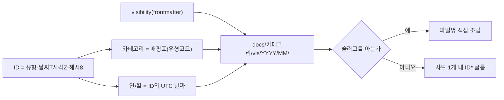
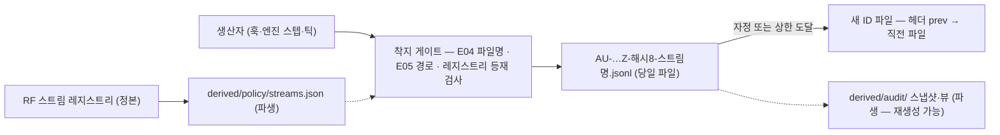
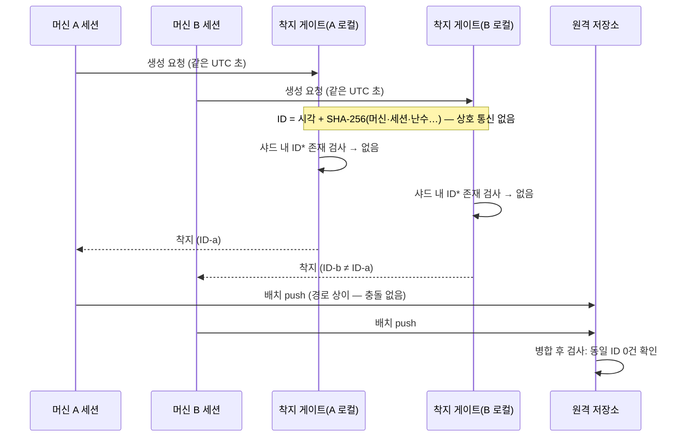
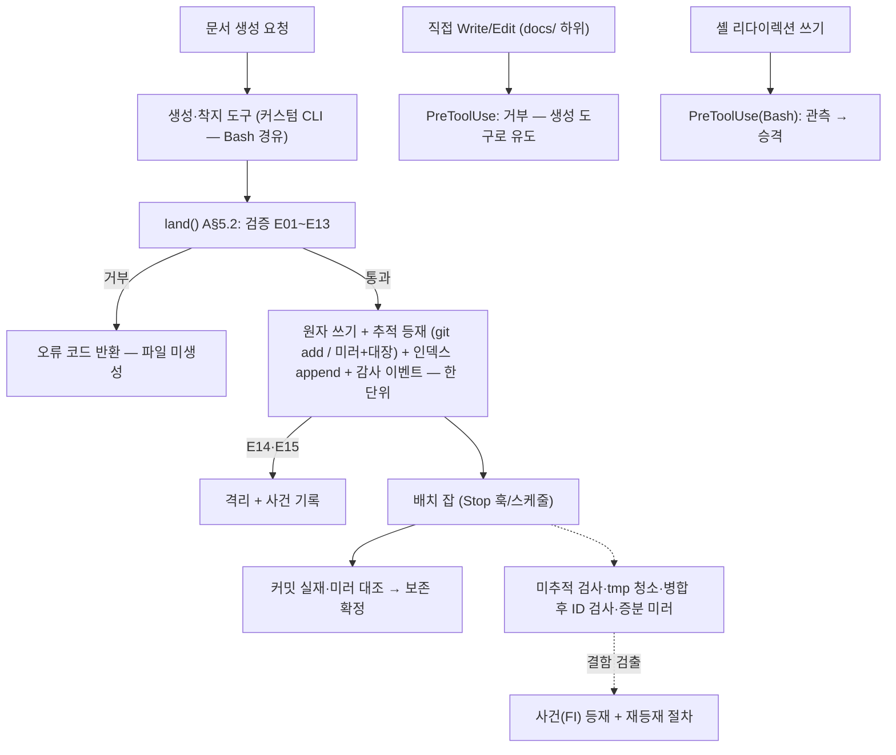
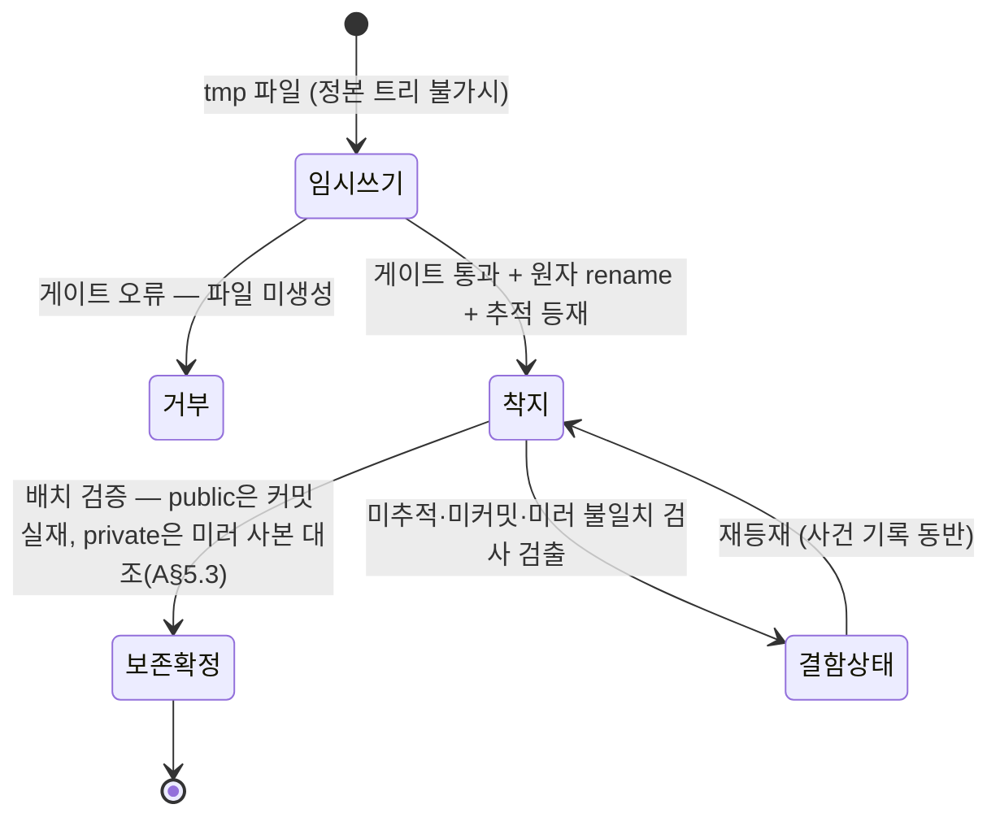
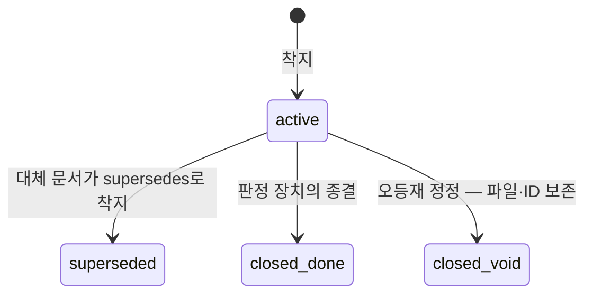
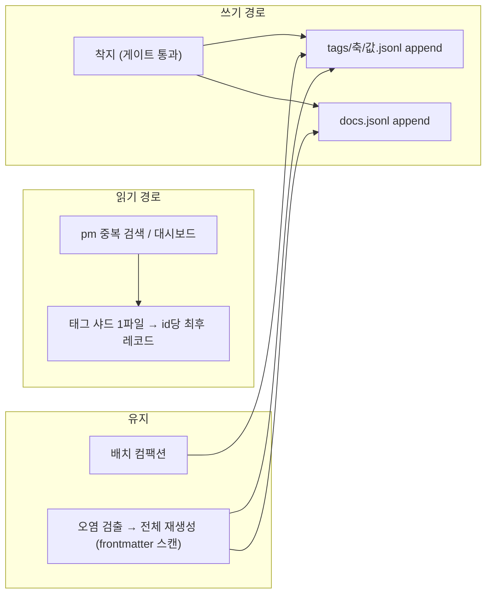

## 요약

**확정** — 아래가 본 축이 소유 정본으로 확정한 것이다. 계약 전문(필드 표·판정식·문법·전이표)은 각 계약 소절의 블록에 있고 이 절은 결론만 담는다.


- **디렉토리**: `docs/<카테고리>/<public|private>/<YYYY>/<MM>/` — 카테고리 외축, 가시성 내축. 9개 카테고리 전부 동일 구조(S§3.1). 시간 파티션은 생성 시점에 확정되어 이후 이동이 발생하지 않는다(S§9.1-6).
- **파일명**: `<유형코드>-<YYYYMMDD>T<HHMMSS>Z-<해시8>[-<슬러그>].md` — UTC 시각 접두로 정렬성, 해시 8자로 유일성, 슬러그는 장식 전용(생성 실패 시 생략).
- **채번**: 3안 비교 후 **시각 접두 + 결정론적 해시** 채택(S§3.8 후보① · S§11-7). 채번 락·소각 대장·할당기가 전부 불요해지는 것이 채택 근거다. 경합 3시나리오(동시 채번·동시 이동·중도 사망)의 동작 정의와 검증 시나리오 VS1~VS4를 A§3.4에 확정.
- **스키마**: 공통 필수 메타 17필드(언제·누가·누구들과·머신·세션·무슨일·왜·요청자·작성자·태그·참조 + 식별 계열), 기입 주체(사람|자동)를 필드 단위로 확정. 머신·세션·시각·신원 계열은 사람이 쓰지 않는다(S§3.5). visibility는 **silent default 금지** — 미지정은 거부다(A§1.5). RQ의 진행 상태 enum 정본은 파이프라인 축 B§1.1(11종 진행형)이며 본 축은 `state` 필드 자리만 계약한다(A§4.2·A§6.2).
- **착지 게이트**: 요약 부재·메타 결손·참조 무결성 위반·경로-메타 불일치는 **거부**(경고 아님). 게이트의 호스트는 **커스텀 생성·착지 도구**이고 플랫폼 훅은 우회 차단·관측 전용이다(A§5.4 — 훅 의미론상 훅이 원자 쓰기·추적 확인을 대행할 수 없다). 착지 = 원자 쓰기 + 추적 등재(public은 git, private은 동기 미러+백업 대장)까지, 보존 확정 = 배치 검증(커밋 실재 / 미러 사본 대조)까지의 2단계(S§2-14·S§3.8·S§11-1).
- **태그**: 통제 어휘 5축(`domain/ stage/ kind/ component/ origin/`), 어휘 밖 값은 거부 대신 `unclassified/`로 표면화(S§3.6). 인덱스는 태그별 JSONL 샤드, 1레코드 = 1물리행 계약, 전량 순수 파생.
- **push 차단**: `.gitignore`로 private 트리·볼트·파생물·`config/` 전체 제외. 잔여 통과 경로 5종을 A§8.2에 전수 명시(S§3.4의 의무).
- **백업 대상**: 버전관리 밖 자산 전수 목록을 A§9에 확정. private·볼트의 **운영 중 보존 경로**(착지 시점 동기 미러 + 배치 증분 미러)를 A§5.2·A§9에 명시 — 스냅샷·순환·복구 리허설은 설치 축 소유.
- **기계 스트림 파일 계약**: 감사·사건 스트림(AU·FS)의 파일명·회전·헤더 레코드 계약을 A§2.4에서 ID 문법의 확장으로 단일 확정 — 스트림별 하위 디렉토리·비ID 파일명은 게이트가 거부한다.

**실측 대기** — 7건. 정본은 A§11, 전수 색인은 부속 PA. 플랫폼 기능의 존부·의미를 단정하지 않았다 — 각 항목에 의존하는 구현은 실측 결과 기록 없이 착수하지 않는다.

**미결** — 본 축의 미결 절 정본은 A§12이며, 재생성본 전체의 미결·이력 정본은 부속 PB다.

## 1. 디렉토리 트리 (산출 ①)

### 1.1 전체 트리 [계약]

```text
<저장소 루트 = 실행 루트>                  ← S§2-3
├── docs/
│   ├── requests/        # 요청 원장
│   │   ├── public/
│   │   │   └── YYYY/
│   │   │       └── MM/
│   │   │           └── RQ-YYYYMMDDTHHMMSSZ-xxxxxxxx[-slug].md
│   │   └── private/
│   │       └── YYYY/MM/ … (public과 완전 동형)
│   ├── audit/           # 감사 — 기계 스트림 (JSONL)
│   │   ├── public/YYYY/MM/AU-….jsonl
│   │   └── private/YYYY/MM/
│   ├── minutes/         # 회의록
│   │   ├── public/YYYY/MM/MN-….md
│   │   └── private/YYYY/MM/
│   ├── failures/        # 실패 — 사슬 문서(md) + 사건 스트림(jsonl)
│   │   ├── public/YYYY/MM/FL-….md , FS-….jsonl
│   │   └── private/YYYY/MM/
│   ├── decisions/       # 내려진 결정
│   │   ├── public/YYYY/MM/DN-….md
│   │   └── private/YYYY/MM/
│   ├── adjudications/   # 의사결정 요청 (사람 응답 대기 — S§3.7)
│   │   ├── public/YYYY/MM/AJ-….md
│   │   └── private/YYYY/MM/
│   ├── design/          # 설계 문서 (분석·디자인·개발·검증 단계 산출 포함 — A§1.4)
│   │   ├── public/YYYY/MM/DS-….md
│   │   └── private/YYYY/MM/
│   ├── handoff/         # 인계
│   │   ├── public/YYYY/MM/HO-….md
│   │   └── private/YYYY/MM/
│   └── reference/       # 참조 (통제 어휘 문서 포함 — A§7.1)
│       ├── public/YYYY/MM/RF-….md
│       └── private/YYYY/MM/
├── vault/               # 민감정보 볼트 — git 밖 (S§2-8·S§3.4)
│   └── <대상별 하위 디렉토리 — 자유 구조, 백업 매니페스트가 전수 열거>
├── derived/             # 파생물 전량 — git 밖, 전부 재생성 가능 (S§3.6·S§10-2)
│   ├── index/
│   │   ├── tags/<축>/<값>.jsonl        # 태그 → 문서들 (A§7.3)
│   │   ├── tag-agents/<축>/<값>.jsonl  # 태그 → 에이전트들 (A§7.4)
│   │   └── docs.jsonl                  # 전 문서 요약 인덱스 (A§7.3)
│   ├── policy/
│   │   ├── tag-vocab.json              # 어휘 문서에서 재생성되는 판정용 파생 (A§7.1)
│   │   └── streams.json                # 스트림 레지스트리 문서에서 재생성되는 판정용 파생 (A§2.4)
│   ├── audit/                          # 감사 파생(스냅샷·집계 뷰) — 감사 축이 내용 소유, 위치는 본 축 계약(A§2.4)
│   │   ├── snapshots/
│   │   └── views/
│   └── state/                          # 큐·현재 상태 스냅샷 — 스케줄링 축 소유(S§5.6)
└── config/              # 로컬 정책·상태 전체 — git 밖 (A§8.1 — 머신 편성·이름 레지스트리 등 비공개 정보 포함)
    ├── local/           # 머신별 정책 값 (S§8 엔진 청결)
    └── <설치 축 소유 하위 — 머신 편성·이름 레지스트리·설치 저널 등. 구조는 설치 축 정본>
```

- [R1] **모든 카테고리는 위 트리와 완전 동형이다.** 생성·이동·인덱싱·백업 도구는 카테고리 이름을 인자로 받는 단일 구현이다(S§3.1).
  [장치 — 경로 계산 함수가 단일 구현이고, 착지 게이트(A§5)가 계산 경로와 실제 경로의 불일치를 E05로 거부한다. 트리 동형성 자체는 도구가 트리를 만들 때만 성립하므로, 수동 디렉토리 생성은 게이트가 흡수(미존재 샤드는 게이트가 생성)한다. | 장치 불가 — 해당 없음]
- [R2] **문서는 태어난 연/월 샤드에서 이동하지 않는다.** 아카이브 이동이라는 연산 자체를 없앤다(S§9.1-6). 남는 이동은 가시성 재분류 1종뿐(A§6.3).
  [장치 — 경로가 ID의 UTC 연월에서 계산되므로 "이동할 곳"이 존재하지 않는다. 구조가 강제하며 별도 검사 불요. | 장치 불가 — 해당 없음]
- [R3] **파생물은 `derived/` 밖에 존재할 수 없다.** 문서 트리에는 정본만 있다(S§3.6·S§10-2). 감사 파생(스냅샷·집계 뷰)도 예외가 아니다 — `docs/` 하위 파생 디렉토리는 금지이며 루트 `derived/audit/`에만 둔다(A§2.4).
  [장치 — `.gitignore`가 `derived/`를 제외하고(A§8.1), 착지 게이트는 `docs/` 하위에 인덱스류 파일 패턴(`*.jsonl` 중 AU·FS 유형 코드가 아닌 것)의 착지를 E10으로 거부한다. | 장치 불가 — 해당 없음]
- [R4] **증거 바이너리(스크린샷 등)는 문서 트리에 넣지 않는다**(S§10-15). 바이너리는 볼트 또는 `derived/` 하위 증거 보관소에 두고 문서에는 경로 참조만 적는다.
  [장치 — 착지 게이트가 `docs/` 하위 비텍스트 확장자를 E11로 거부한다. | 장치 불가 — 해당 없음]

### 1.2 경로 문법 (확정) [계약]

```text
PATH      := "docs/" CATEGORY "/" VIS "/" YYYY "/" MM "/" FILENAME
CATEGORY  := "requests" | "audit" | "minutes" | "failures" | "decisions"
           | "adjudications" | "design" | "handoff" | "reference"
VIS       := "public" | "private"
YYYY, MM  := ID 속 날짜의 UTC 연·월 (제로 패딩)
FILENAME  := A§2 파일명 문법
```

**경로는 (ID, visibility) 2값에서 O(1)로 계산된다.** ID만 알 때는 public·private 두 경로를 stat — 최대 2회 접근으로 확정(S§3.2 "경로 계산 가능"). 슬러그 미상 시 해당 샤드 디렉토리 1개에서 `<ID>*` 글롭 — 스캔 상한 = 샤드 1개(S§3.2 "스캔 상한 보장").



### 1.3 축 순서 결정 — 카테고리 외축 · 가시성 내축

S§3.4는 두 안을 허용한다. **카테고리 외축을 채택**한다.

| 판단 기준 | 카테고리 외축(채택) | 가시성 외축(기각) |
|---|---|---|
| `.gitignore` 규칙 수 | 1행 (`docs/*/private/`) | 1행 (`docs/private/`) — 동률 |
| 카테고리 도구의 루트 수 | 카테고리당 1루트(가시성은 내부 분기) | 카테고리당 2루트(public·private에 흩어짐) |
| 가시성 재분류 이동 거리 | 같은 카테고리 내 형제 트리 간 | 트리 최상위를 가로지름 |
| 사람의 탐색("요청 원장을 보자") | 1디렉토리 진입 | 2디렉토리를 오가야 함 |

동률 1건·우세 3건으로 카테고리 외축. 〔장치 — 결정 자체는 이 문서가 정본이고, 경로 문법(A§1.2)을 따르지 않는 착지는 게이트 E05가 거부하므로 재론이 코드에 스며들 수 없다.〕

### 1.4 카테고리 ↔ 유형 코드 매핑 (확정)

| 카테고리 | 유형 코드 | 파일 형식 | 내용물 |
|---|---|---|---|
| requests | `RQ` | md | 요청 원장 문서(원문+분석 참조 허브) |
| audit | `AU` | jsonl | 세션별 감사 이벤트 스트림(레코드 스키마는 감사 축 소유 — S§7. 트리·파일명·메타 계약만 본 축 소유) |
| minutes | `MN` | md | 회의록 |
| failures | `FL` / `FS` / `FI` | md / jsonl / (레코드 내 ID) | FL=실패 사슬 문서(사람), FS=사건 스트림 파일(세션별), FI=사건 ID(레코드 단위 — A§4.2) |
| decisions | `DN` | md | 내려진 결정 기록 |
| adjudications | `AJ` | md | 의사결정 요청(사람 응답 대기 — S§3.7) |
| design | `DS` | md | 설계·분석·개발·검증 단계 산출 문서(S§3.9 — 단계 구분은 태그 `stage/` 축과 frontmatter `stage` 필드로) |
| handoff | `HO` | md | 인계 문서(재개 스키마 A§4.2) |
| reference | `RF` | md | 참조 문서(통제 어휘 정본 포함) |

단계별 산출 문서(분석·디자인·개발·검증 — S§3.9)를 별도 카테고리로 쪼개지 않고 `design` 카테고리 + `stage` 필드로 수용한다. 근거: 카테고리 증식은 트리·도구·게이트 분기를 늘리는데, 단계 구분은 필드 1개로 충분하며 검색은 태그 인덱스가 담당한다(S§2-6 최소화 방향).

### 1.5 public / private 판정 기준 (정본 — S§3.4 요구)

**private 판정 기준(어느 하나라도 해당하면 private):**
1. 하네스 밖 실제 프로젝트의 산출물 원문·소스 발췌가 본문에 포함된 것.
2. 타인·외부 조직의 실명, 실제 접속 주소, 시스템 구성 상세가 본문에 포함된 것.
3. 자격증명·계정 정보는 문서가 아니라 **볼트**에만 둔다 — 문서에는 볼트 경로 참조만(S§3.4). 값이 들어간 문서는 private 여부와 무관하게 착지 거부 대상(A§5.2 E12).
4. 사람이 명시적으로 private을 선언한 것.

**기본값은 없다 — silent default 금지.** visibility는 생성 도구의 필수 인자이고(A§4.1과 동일 규정), 미지정 착지는 게이트가 E03으로 **거부**한다. 어느 구현자도 "미지정 → public"으로 읽을 수 없다 — 그 해석 자체가 존재하지 않는 값이기 때문이다. 오케스트레이션 산문의 단순 언급·포인터는 **명시적으로 public을 지정해** 착지한다 — 언급까지 막으면 원장이 성립 불가능해진다는 S§3.4의 계층 구분은 유지하되, 그 허용을 기본값이 아니라 명시 지정으로 흡수한다.

**판정 불확실 시 규율(fail-safe 방향)**: 위 기준 1·2의 해당 여부가 불확실하면 **private을 선택한다.** 비대칭 근거 — 잘못 private으로 간 문서는 재분류(A§6.3)로 손실 없이 시정되지만, 잘못 public으로 간 문서는 push 후 히스토리에서 제거되지 않는다(A§8.2-5, 비가역).

**겹침 게이트(정책 스위치)**: 하네스 밖 실제 프로젝트의 콘텐츠를 다루는 프로파일(`config/local/` 정책값으로 활성화)에서는, 해당 도메인 태그(예: `domain/external-project`)가 붙는 문서의 public 착지에 사람 확인(AJ 문서 경유 — A§4.2)을 겹쳐 요구한다. 내용 판정의 장치 불가 축(아래)을 사람 확인으로 보강하는 선택 계층이다.
- [R15] **visibility는 명시 지정만 유효하다 — 미지정 착지·암묵 기본값은 존재하지 않는다.**
  [장치 — 생성 도구의 인자 스키마가 visibility를 필수 인자로 선언(미지정 시 도구가 실행 자체를 거부), 착지 게이트 E03이 필드 부재를 거부, E05가 경로-메타 불일치를 거부. 기준 3(자격증명)은 E12 패턴 검출 + push 경로 스캔(S§3.4 심층 방어)이 겹쳐 커버. | 장치 불가 — 기준 1·2의 "산출물 원문인가, 언급인가" 판정은 세계 지식이 필요해 훅이 다룰 수 없다(S§9.4-19와 동일 구조). E12는 자격증명 **패턴 축만** 검출한다 — 하네스 밖 프로젝트의 소스 원문·실주소·실명은 패턴에 걸리지 않는다(정직 공지 — S§9.4-21). 완화: 불확실 시 private 규율(fail-safe) + 외부 프로젝트 프로파일의 public 착지 사람 확인 게이트. 잔여는 A§8.2에 명시.]

---

## 2. 파일명 문법 (산출 ②)

### 2.1 ID 문법 (확정) [계약]

```text
ID     := TYPE "-" DATE "T" TIME "Z-" HASH8
TYPE   := "RQ"|"AU"|"MN"|"FL"|"FS"|"FI"|"DN"|"AJ"|"DS"|"HO"|"RF"
DATE   := YYYYMMDD        (UTC — 경로 샤딩과 동일 기준)
TIME   := HHMMSS          (UTC)
HASH8  := [0-9a-f]{8}     (A§3.2의 해시 생성식)
```

- FI(사건 ID)만 예외 문법: `"FI-" [0-9a-f]{12}` — 시각 없이 맥락 키의 결정론적 해시(A§3.4-보충). 사건은 여러 날에 걸치므로 시각 접두가 의미를 갖지 않는다.
- 요구 속성 대응(S§3.3): ①시간순 정렬성 — UTC 시각 접두가 초 단위 사전순 정렬을 보장 ②전역 유일성 — A§3 채번 ③경로 계산 — A§1.2 ④셸 안전 — 문자 집합이 `[A-Z0-9a-z-]`뿐 ⑤가독 — 유형 코드와 시점이 파일명에서 즉독.

### 2.2 파일명과 슬러그 [계약]

```text
FILENAME := ID [ "-" SLUG ] "." EXT
EXT      := "md" | "jsonl"
SLUG     := [a-z0-9] ( [a-z0-9-]{0,38} [a-z0-9] )?     # 최대 40자
```

- 슬러그 생성 규칙: 제목 → 소문자화 → ASCII 영숫자 외 전부 하이픈 → 연속 하이픈 압축 → 40자 절단(단어 경계 우선).
- **유의미 문자가 3자 미만이면 슬러그를 생략한다.** 무의미 조각을 방출하느니 ID만 남긴다 — 선행 운영의 슬러그 생성 붕괴 사고에 대한 대응(S§3.3). 비ASCII 제목(한글 등)은 로마자 변환을 시도하지 않는다: 플랫폼별 유니코드 정규화 차이가 파일명 축에 들어오는 것을 원천 차단한다(S§4.3 실행 환경 불문).
- 슬러그는 **장식 전용**이다. 어떤 도구도 슬러그를 파싱해 의미를 얻지 않는다 — 파싱 대상은 ID뿐.
  〔장치 — 착지 게이트가 FILENAME 문법 부합을 E04로 검사(슬러그 40자 초과·금지 문자 포함 시 거부). 슬러그 생성은 생성 도구의 단일 함수이므로 규칙 이탈이 발생할 자리가 없다.〕

### 2.3 예시 (전부 자리표시자) [계약]

```text
docs/requests/public/2026/07/RQ-20260728T145303Z-3f9c2a71-dashboard-data-shape.md
docs/decisions/public/2026/07/DN-20260728T150102Z-8b1d44e0.md            # 슬러그 생략례
docs/adjudications/public/2026/07/AJ-20260728T151500Z-a02b9c3e-parallel-cap.md
docs/audit/public/2026/07/AU-20260728T140000Z-77aa01c2-agent-events.jsonl # 세션 스트림 (슬러그 = 스트림명 — 장식)
docs/failures/public/2026/07/FS-20260728T140000Z-77aa01c2.jsonl           # 사건 스트림
```

### 2.4 기계 스트림 파일 계약 (AU·FS — A§1.2 경로 문법의 확장, 단일 정본)

감사·단언·사건 스트림 등 **`docs/` 하위에 착지하는 모든 JSONL**은 예외 없이 이 계약을 따른다. 스트림별 하위 디렉토리·비ID 파일명·part 접미 파일명은 전부 게이트 거부 대상이다(E04·E05·E10) — 감사 축·리드 게이트 축의 스트림도 동일하다(레코드 스키마·스트림 의미론은 각 축 소유, **파일 계약만** 본 축 정본).

1. **경로**: `docs/<카테고리>/<vis>/YYYY/MM/` **직치**. 추가 디렉토리 층(스트림명·writer 하위 디렉토리) 금지 — A§1.2 문법이 전 카테고리 유일 문법이다(S§3.1).
2. **파일명**: `AU-<UTC시각>Z-<해시8>[-<슬러그>].jsonl`(감사) / `FS-…`(사건). 슬러그 자리에 스트림명을 넣는 것을 권장한다(사람 가독) — 단 슬러그는 여전히 장식 전용이며(A§2.2), **스트림 식별은 파일명 파싱이 아니라 헤더 레코드가 정본**이다.
3. **헤더 레코드**: 파일의 첫 레코드는 자기 서술 레코드다 — 필드: `stream`(레지스트리 등재명) · `producer` · `consumer` · `transition` · `retention` · `writer`(세션 ID 또는 `<머신코드>-<YYYYMMDD>`) · `prev`(직전 회전 파일의 ID | null) · `schema`(int). S§7의 4계약 선언을 파일 수준에서 강제하는 표면이다.
4. **writer 규약**(S§9.1-1 — 세션당 자기 파일): 세션 산 스트림은 세션당 1파일(ID 해시 입력에 세션이 들어가 자동 유일). 세션이 없는 생산자(프로브·스케줄러 틱)는 머신코드+UTC 날짜를 세션 자리에 넣어 해시한다 — 머신·일 단위 1파일.
5. **회전(정본 단일화)**: UTC 자정 도달 **또는** 크기 상한(기본 8MB 또는 10,000줄 — `config/local/` 정책값) 선도달 시, **새 ID로 새 파일**을 열고 새 파일의 헤더 레코드 `prev`가 직전 파일 ID를 가리킨다(part 번호 파일명 대신 체인 — 파일명 문법 단일 유지). 타 축 문서의 회전 서술은 이 절을 참조만 한다.
6. **스트림 레지스트리**: 4계약(producer/consumer/transition/보존기간)의 정본은 `reference` 카테고리의 RF 문서(기계 가독 yaml 블록 포함, 현행 판 식별은 `component/stream-registry` 태그 — A§7.1과 동일 기제)다. 루트·샤드 밖 직치 파일(레지스트리를 트리 규약 밖에 두는 형태)은 A§1.2 위반이라 불허. 게이트·봉투 조립기가 읽는 것은 파생 `derived/policy/streams.json`(tag-vocab과 동형 — 부재·손상 시 RF에서 재생성). 미등재 스트림명의 착지는 fail-closed 거부(감사 축 규율과 동일 방향 — 집행 표면은 본 축 게이트).
7. **파생·병합의 위치**: 스냅샷·집계 뷰·월 마감 병합본은 전부 `derived/audit/` 하위다(A§1.1 트리·R3). 정본 스트림 파일은 태어난 샤드에서 재작성·이동하지 않는다(R2) — 블록 증폭 억제가 필요한 보존 처리는 파생·백업 아카이브 축에서 수행하고 정본은 불변이다.



---

## 3. 채번 설계 (산출 ③ — S§3.8·S§12 T6)

### 3.1 후보 3안 비교

| 기준 | ① 시각+결정론적 해시 (채택) | ② 머신/세션 네임스페이스 순번 | ③ 단일 라이터 직렬화 |
|---|---|---|---|
| 동시 채번 충돌 | 같은 UTC 초 안에서만 가능, 쌍당 2⁻³² (입력에 머신·세션·난수 포함) | 네임스페이스 등록이 정확하면 0 — 등록 실수 시 충돌이 조용히 재발 | 0 (직렬화) |
| 조정(코디네이션) 필요 | 없음 | 네임스페이스 레지스트리 필요 | 할당기 상주 필요 |
| 중도 사망 영향 | 없음 (채번에 지속 상태가 없다) | 카운터 파일 복구 절차 필요 | 락 고아화 → 전 채번 정지 |
| 오프라인 멀티머신 | 성립 | 성립(레지스트리 사전 배포 전제) | 불성립 |
| 커스텀 장치 잔량 | 해시 함수 1개 (표준 도구) | 카운터 저장·복구 + 레지스트리 + 소각 대장 | 할당기 프로세스 (S§2-6 역행) |
| ID 재사용 위험 | 구조적으로 발생 불가 → 소각 대장 불요 | 카운터 리셋 사고 시 재사용 발생 → 소각 대장 필수 | 할당기 상태 유실 시 재사용 |
| 정렬성 | 전역 초 단위 | 네임스페이스 내부만 | 전역 |
| 사람 가독성(짧은 번호) | 낮음 — 시각으로 보완 | 높음 | 높음 |

**채택: ①.** 결정 근거 — 채번 락·소각 관리·형식 불일치 표면을 통째로 제거한 실증이 있고(S§3.8 후보①), 분산 생성 충돌 불가능 요구(S§11-7)를 조정 장치 0으로 만족하며, 커스텀 최소화(S§2-6)와 같은 방향이다. 순번의 가독성 손실은 파일명의 시각 성분과 슬러그가 보완한다. 선행 운영의 실사고(두 머신 동번 채번 → 동일 ID 파일 2개 → 소각 규율로 해소 불능 — S§3.8)는 ②·③ 계열에서만 발생 가능한 클래스다.

### 3.2 해시 생성식 (확정) [계약]

```text
HASH8 = hex( SHA-256( machine_id ‖ session_id ‖ ts_ns ‖ rand128 ‖ TYPE ) )[0:8]
  machine_id : 머신 레지스트리의 머신 코드 (설치 축이 발급 — S§8)
  session_id : 세션 시작 시 발급된 신원의 세션 식별자 (S§7)
  ts_ns      : 생성 시각 나노초
  rand128    : CSPRNG 128비트
```

- FI(사건 ID)는 `hex(SHA-256(context_key))[0:12]` — **같은 맥락 키는 언제 어디서 계산해도 같은 사건 ID로 수렴**한다. 동일 주체·맥락·위반을 사건 1건에 접는 요구(S§7·S§9.1-4)를 채번 수준에서 구현하는 것이다. `context_key`의 구성(주체·맥락·위반 유형의 정규화 문자열)은 감사 축과 공동 소유 — 필드 자리만 여기서 확정.
- **ID 영구 소각(S§3.3)의 이행**: 삭제·재사용이 없고(A§6), void 종결도 파일과 ID를 보존하는 상태 변경이므로, 소각 "대장"이라는 별도 장치 없이 소각 규율이 성립한다. 유일한 예외 경로(병합 충돌 재발급 — A§3.3-시나리오 S1)는 사건 기록 + 상호 참조로 흔적을 남긴다.
  〔장치 — 채번이 무상태이므로 "재사용을 막는 검사"가 아니라 "재사용이 일어날 메커니즘의 부재"로 강제된다. 잔여(수동으로 남의 ID를 베껴 파일을 만드는 행위)는 착지 게이트의 로컬 중복 검사(E13)가 잡는다.〕

### 3.3 경합 시나리오별 동작 정의

**S1. 동시 채번(두 머신, 같은 UTC 초)**
- 정상 경로: 입력에 머신·세션·난수가 들어가므로 ID가 달라진다. 조정 통신 0회.
- 로컬 중복(같은 머신·같은 초·해시 우연 일치): 착지 게이트가 대상 샤드에서 `<ID>*` 글롭으로 존재 검사 → 존재 시 rand128 갱신 후 재생성(최대 3회, 초과 시 착지 실패 + 사건 기록). 검사 비용 = 샤드 1개.
- 원격 병합 시 동일 전체 ID 발견(확률상 무시 가능하나 동작은 정의한다): 병합 후 검사(A§5.4의 배치 검증 잡)가 동일 ID 파일 2개를 검출 → ①사건(FI) 등재 ②두 파일 모두 보존 ③시각이 늦은 쪽 문서를 새 ID로 재착지하고 원 파일 위치에는 새 ID를 가리키는 스텁만 남긴다 ④스텁과 사건 기록이 원 ID의 이력을 보존한다(무유실·무오염 — S§3.8).



**S2. 동시 이동(가시성 재분류 경합)**
- 이동은 compare-and-move다: 이동 도구는 착수 시점에 대상 문서의 `updated`·`visibility`를 읽고, 실제 이동 직전에 재읽기하여 값이 다르면 **거부 + 사건 기록**(선착 1승·후착 명시 실패 — 조용한 덮어쓰기 금지).
- 이동 자체는 A§6.3의 절차(스텁 잔류 + 원자 rename)라, 경합 패자가 보는 것은 "원 경로에 스텁이 있고 본문이 다른 트리에 있다"는 일관 상태다. 중간 상태(본문 2벌·본문 0벌)는 rename 원자성으로 배제된다.
- 서로 다른 두 문서의 동시 이동은 경로가 서로소라 경합 자체가 없다.

**S3. 중도 사망(쓰기 도중 프로세스 소멸)**
- 임시 파일 쓰기 중 사망: 정본 트리에 아무것도 나타나지 않는다(불가시). 청소 배치가 잔류 `*.tmp`를 수거하고 사건 카운트를 올린다.
- rename 후 `git add` 전 사망: 정본 파일은 존재하나 미추적. **미추적 검사 잡**(A§5.4)이 "docs/ public 트리의 미추적 파일 = 결함 상태"로 검출 → 게이트 재통과 후 등재. S§3.8의 "자동 커밋 경로가 신규 문서를 흡수하지 못한 사고" 클래스의 대응이다.
- add 후 배치 커밋 전 사망: 스테이징은 지속 상태이므로 다음 배치 커밋이 흡수한다. 배치 커밋 잡 자체의 사망은 다음 주기가 이어받는다(잡은 멱등 — 스테이징 전량 커밋).

### 3.4 검증 시나리오 (구현 단계 실행 의무 — S§3.8 "실제로 돌려서")

| # | 시나리오 | 절차 | 통과 기준 |
|---|---|---|---|
| VS1 | 동시 채번 폭주 | 프로세스 2개(가능하면 머신 2대)에서 각 500건/초당 생성 × 10초 | ID 중복 0 · 전량 착지 · 게이트 재시도 로그와 최종 상태 일치 |
| VS2 | 재분류 경합 | 같은 문서에 두 세션이 동시 재분류(방향 상이) | 정확히 1건 성공 · 1건 명시 거부 · 사건 1건 기록 · 스텁-본문 정합 |
| VS3 | 중도 사망 3지점 | kill -9를 임시쓰기 중 / rename 후 add 전 / add 후 커밋 전에 주입 | 부분 파일 불가시 · 미추적 검사가 2번째 케이스 검출 · 3번째 케이스 다음 배치 흡수 · 유실 0 |
| VS4 | 병합 동일 ID | 두 클론에서 같은 초 대량 생성 후 병합 + 인위적 동일 ID 1건 주입 | 자연 충돌 0 · 주입 건을 병합 후 검사가 검출하고 S1 ③④ 절차 수행 |

〔장치 — VS1~VS4는 설치기의 자가 검증 스위트에 편입한다(설치 축 소유). 검증 없는 무결성 주장은 무효(S§3.8).〕

---

## 4. frontmatter 스키마 (산출 ④ — S§3.5·S§2-18·S§12 T9)

### 4.1 공통 필드 (전 유형) [계약]

| 필드 | 타입 | 필수 | 기입 주체 | 스펙 근거 · 비고 |
|---|---|---|---|---|
| `schema` | int | 필수 | 자동 | frontmatter 스키마 판. 게이트가 지원 판만 수용 |
| `id` | string(ID 문법) | 필수 | 자동 | A§3 채번 |
| `type` | enum(A§1.4 코드) | 필수 | 자동 | ID와 교차 검증(E04) |
| `title` | string ≤120자 | 필수 | 사람(생성 인자) | |
| `visibility` | `public`\|`private` | 필수 | 사람(생성 인자) | 경로와 대조(E05). 기본값 없음 — 명시 필수(A§1.5) |
| `status` | enum(유형별 — A§6.2) | 필수 | 자동(전이 장치만 변경) | 사람 직접 편집 금지 |
| `created` | ISO 8601(+오프셋) | 필수 | 자동 | S§3.5 — 사람이 쓰지 않는다 |
| `updated` | ISO 8601(+오프셋) | 필수 | 자동 | 〃 |
| `machine` | string(머신 코드) | 필수 | 자동 | 세션 신원에서 주입(S§7) |
| `session` | string(세션 ID) | 필수 | 자동 | 〃 |
| `author` | 표시명 | 필수 | 자동(세션 신원) | 표시명만 — 역할 키 단독 표기 금지(S§3.5) |
| `requester` | 표시명 | 필수 | 자동(요청 체인에서 전파) | 사람 발의면 사람의 등록 표시명(S§2-18) |
| `participants` | 표시명[] | 회의록 필수 · 그 외 선택 | 사람 기입 + 게이트가 이름 레지스트리 대조 | 레지스트리는 조직 축 소유 — 게이트는 "표시명 ∈ 레지스트리" 조회 계약만 |
| `what` | string 1줄 | 필수 | 사람(생성 인자) | 무슨 일(S§3.5) |
| `why` | string 1줄 | 필수 | 사람(생성 인자) | 왜(S§3.5) |
| `tags` | string[](통제 어휘) | 필수(자동 축 포함이라 공집합 불가) | 자동 파생 + 사람 보충 | A§7 |
| `refs` | map(슬롯→ID 또는 ID[]) | 유형별(A§4.2) | 자동 + 사람 | 착지 시 무결성 검증(E07·E08) |
| `supersedes` | ID | 선택 | 사람 | 대체 관계. 역방향(`superseded_by`)은 파생 인덱스가 계산 — 정본 문서를 사후 수정하지 않는다 |

- [R5] **머신·세션·시각·author·requester·status는 사람이 쓰지 않는다**(S§3.5 — 사람이 쓰면 누락·오기가 표준이 된다).
  [장치 — 생성 도구가 세션 신원(S§7 발급)에서 자동 주입하고, 착지 게이트가 "세션 신원과 frontmatter 불일치"를 E03으로 거부한다. 사람이 손으로 파일을 만들어도 게이트를 통과하려면 신원과 일치해야 하므로 위조 유인이 소멸한다. | 장치 불가 — 해당 없음]
- [R6] **사람 기입 필수 필드는 생성 인자에서만 필수다.** 등재 경로가 인자로 요구하지 않으면서 게이트로 거부하는 것은 부당하다 — 입력구가 게이트보다 먼저다(S§9.4-23). 생성 이후의 사람 필드 보충은 전부 선택이다(필수 강제는 거짓값을 부른다 — S§9.1-3).
  [장치 — 생성 도구의 인자 스키마가 title·what·why·visibility를 필수 인자로 선언. 게이트 E03은 "인자가 있었는데 비어 있는" 상태만 잡는다. | 장치 불가 — 해당 없음]

### 4.2 유형별 추가 필드 [계약]

**RQ (요청 원장)** — 파이프라인·스케줄링과의 접점. 상태 enum·전이 판정·스케줄링 의미론은 파이프라인 축 B§1.1·B§1.3(S§5.2 확정판)과 스케줄링 판정식(S§5.6·S§12 T10)이 정본이고, **필드 자리(이름·타입·필수여부)만 여기서 계약**한다.

| 필드 | 타입 | 필수 | 기입 주체 |
|---|---|---|---|
| `priority` | int | 필수 | 사람 또는 발의 에이전트 — 판정식 입력(S§5.6) |
| `weight` | enum(무게 분류 — 스케줄링 축 소유) | 필수 | pm 역할 |
| `depends_on` | ID[] | 필수(공집합 허용) | pm 역할 — 산문 유예 금지(S§9.5-27) |
| `state` | enum 11종 — 원소 열거의 정본은 파이프라인 축 B§1.1이며 본 축은 재기술하지 않는다 | 필수 | 자동(전이 함수만 — 파이프라인 축 전이표의 행으로만) |
| 실행 엔진 필드 9종 `rework_count`·`escalation_count`·`design_review_count`·`restart_count`·`merge_retry_count`·`blocked_on`·`derived_from`·`session_ref`·`base_observed` | 파이프라인 축 B§1.2 그대로 | 파이프라인 축 B§1.2 그대로 | 실행 엔진·스케줄러 — **자리만 본 축 등재**(타입·기본값·의미론은 파이프라인 축 정본. 초안의 "8종"은 `base_observed` 추가 반영으로 9종 — PB) |
| `refs.analysis` | ID | `analyzed` 진입 이후 필수(분석 문서 착지가 전이 가드) | 자동(단계 산출 착지 시) |
| `refs.design` | ID[] | `building` 진입 이후 필수(설계 문서 착지·적대 리뷰 통과가 designing→building 가드) | 자동 |
| `refs.dev` | ID[] | `verifying` 진입 이후 필수(BuildReport 전건 착지가 building→verifying 가드) | 자동 |
| `refs.verification` | ID[] | `merging` 진입 이후 필수(verdict 전건이 verifying→merging 가드) | 자동 |
| `refs.adjudications` | ID[] | 선택(단, `hold` 재개·종결 전이는 응답 착지된 AJ 참조 필수 — 파이프라인 축 전이 17~19) | 자동 |
| 종결 4필드 `closure.request / reason / resolution / retro` | string×4 | 종결 상태(`done`·`failed`·`void`) 진입 시 필수(retro는 증거 인용 — S§9.5-31) | 사람+자동 |

- **`closed_as` 필드는 두지 않는다**(초안 폐기): 종결값은 `state`가 직접 보유한다(`done`·`failed`·`void`). 같은 사실을 두 필드에 두면 갈림 표면이 된다.
- **`hold`는 종결이 아니라 준종결이다**(재개 가능): 재개 목적지는 `queued`(파이프라인 축 전이 17 — 사람 결정의 응답 착지 실재가 가드)이며, `hold`에서 `failed`·`void`로의 종결도 사람 결정 경유다(전이 18·19). 본 축의 문서 수명주기(A§6.2)도 이 지위를 그대로 따른다.

본문 필수 절: `## 요약` · `## 원문`(요청 발화 원문 그대로) · `## 완료 기준`(기계 판독 블록 — DS와 동일 문법). 완료 기준 절이 비면 착지 거부(E06의 유형별 확장).

**MN (회의록)**: `participants` 필수(공통 표의 조건 발동). 본문 필수 절: `## 요약` · `## 합의`(상호 응답·합의 형성이 회의 성립 조건 — S§9.5-31) · `## 원문`.

**FL (실패 사슬 문서)**: `incidents`(FI ID[], 필수·사람) · `root_cause`(string, 선택) · `prevention_refs`(ID[], 선택 — 재발 방지 장치를 만든 요청·결정 참조).

**FS (사건 스트림 레코드)** — 파일이 아니라 레코드 스키마(JSONL 1행):

| 레코드 필드 | 타입 | 기입 주체 |
|---|---|---|
| `incident_id` | FI ID | 자동(맥락 키 해시) |
| `event` | enum(`opened`\|`recount`\|`state_change`) | 자동 |
| `state` | enum(`open`\|`working`\|`resolved`\|`false_positive`) | 자동/판정 장치 |
| `count_delta` | int | 자동 — 동일 사건 재탐지는 카운트만(S§7) |
| `actor` | {machine, session, role, display} | 자동(신원 전파 — S§7) |
| `closer` | 표시명 | 종결 레코드에 필수 — 종결 책임 주체(S§7) |
| `evidence_anchor` | string(줄 번호 아닌 앵커 — S§9.1-4) | 자동 |

현재 상태는 파생 뷰(`derived/`)가 최후 레코드 기준으로 계산한다 — append-only 원본은 불변.

**DN (결정 기록)**: `decided_by`(사람 표시명, 필수 — 승인은 사람에게서만, S§9.5-29) · `refs.adjudication`(AJ ID, 승격 경로인 경우 필수) · `device_status`(enum `device-paired`|`device-missing`, 필수) · `refs.followup`(RQ ID — `device-missing`이면 **필수**: 장치 없는 결정은 후속 요청을 세워야 착지된다. S§9.4-24·S§11-22의 게이트화).

**AJ (의사결정 요청)** — **소유 분할 확정(축 간 이중 정의 해소)**: 문서 스키마(필드 자리·상태 enum·승격 규칙·파일명)는 **본 축 정본**이고, 통지 계열 필드(`deadline` 계산·`escalation` 갱신·`notify[]` 기입)의 **값 의미론과 갱신 장치는 통지 축 소유**다 — 본 축은 그 자리만 계약한다(RQ의 스케줄링 필드와 동일 패턴). 파일명은 A§2.1 ID 문법(`AJ-…`)이 유일 정본이다 — 타 축 문서의 별도 접두 표기는 이 문법으로 단일화한다.

| 필드 | 타입 | 필수 | 기입 주체 |
|---|---|---|---|
| `question` | string 1문장(배경은 본문) | 필수 | 생성 에이전트 |
| `reason` | enum(`hitl-gate`\|`starvation`\|`lead-gate`\|`budget`\|`other`) | 필수 | 생성 호출부(트리거 목록은 통지·파이프라인 축) |
| `options[]` | {`oid`: string, `label`: string, `summary`: string, `impact`: string, `recommended`: bool}[] | 필수(≥1 — 자유 응답 상시 허용이므로 최소 1로 완화. 단일 확인형 상신이 정당하게 존재한다) | 생성 에이전트 |
| `deadline` | ISO 8601 | 필수 | 자동(값 계산 정책은 통지·스케줄링 축) |
| `escalation` | {`level`: int, `last_notified_at`, `next_check_at`} | 필수 | 자동(에스컬레이션 체커 — 통지 축). **에스컬레이션은 상태가 아니라 이 필드다** |
| `notify[]` | 통지 스트림 레코드 ID[] | 발송 후 필수 | 자동(통지 파이프 — 통지 축) |
| `refs.request` | RQ ID | 필수(원장에서 참조되는 요건 — S§3.7. 착지 게이트 E07·E08 검증) | 자동 |
| `response` | {`chosen_oid`?: string, `free_text`?: string, `human_utterance_ref`: string(**필수** — 실제 사람 발화의 세션 기록 앵커), `responded_via`: enum(`terminal`\|`dashboard`)} — `chosen_oid`·`free_text` 중 1개 이상 | `answered` 전이 시 필수 | 기록 에이전트(사람 발화 인용 필수) |
| `responded_by` | 사람 표시명 | `answered` 전이 시 필수 | 기록 에이전트 |
| `refs.decision` | DN ID | `adopted` 전이 시 필수(승격 산출) | 자동(승격기) |

상태 enum(정본 — A§6.2에 수록): `open → notified → answered → adopted`, 오상신은 `open`·`notified`에서 `void`. 재통지는 `notified` 자기 전이 + `escalation.level` 증가이며 `expired`·`escalated`·`promoted` 상태는 **폐기**한다(초안 어휘 — 에스컬레이션·승격은 각각 필드·`adopted` 전이로 흡수). `answered` 전이 가드는 `response.human_utterance_ref` 실재 + `responded_by` 비공백 — **어떤 에이전트·통지 메시지도 사람의 승인이 아니다**(S§9.5-29)의 스키마 수준 강제이고, 파이프라인 축 전이 17~19의 "응답 착지 실재" 가드가 검증하는 대상이 정확히 이 두 필드다. `deadline` 경과는 어떤 선택지도 자동 집행하지 않는다 — 스키마에 기본 집행 필드 자체가 없다(존재 차원 차단). 응답 착지 시 DN 자동 생성 + 상호 참조(`adopted` 승격 — S§3.7). 3채널 발송 수단·재통지 백오프는 통지 축 소유(S§3.7·S§12 T5) — 본 축은 "AJ 착지 이벤트가 통지 발송의 유일한 방아쇠"라는 계약만 제공한다.

**DS (설계·단계 산출)**: `stage`(enum `analysis`|`design`|`dev`|`verification` 필수·자동) · `refs.request`(RQ ID 필수 — 미등재 실행 봉쇄와 같은 뿌리, S§5.1). stage=design은 본문에 `## 검증 기준` 기계 판독 블록 필수 — 항목마다 3요소(무엇이 충족인가 / 무엇으로 확인하는가 / 통과 수치 — S§5.1·S§9.2-8):

```yaml
# 본문 내 기계 판독 블록 문법 (yaml 코드 펜스)
criteria:
  - what: "<충족 조건 서술>"
    how: "<확인 방법 — 명령·절차>"
    pass: "<통과 수치·판정값>"
```

게이트는 블록 파싱 성공 + 항목 ≥1 + 각 항목 3요소 전건을 검사(E06 확장). stage=design은 `## 테스트 시나리오` 절도 필수(S§5.1).

**stage=dev 필수 필드 — TDD 증거 계약(단일 정본)**: 구현 산출 문서의 TDD 증거는 아래 한 벌이 유일 계약이다. 파이프라인 축의 BuildReport(전이 가드 "TDD 증거 필드 존재")와 조직 축의 준수 측정은 **이 필드 집합을 참조만** 하고 재정의하지 않는다 — 초안의 명칭 이형(`test_first_evidence` 등)은 이 표로 단일화한다.

| 필드(`tdd_evidence.*`) | 타입 | 필수 | 기입 주체 |
|---|---|---|---|
| `failing_test_ref` | string(커밋 참조 또는 실행 저널 앵커) | 필수 | 자동(구현 스텝) — 실패 테스트가 구현보다 **먼저** 존재했음의 증거 |
| `failing_run_excerpt` | string(실패 실행 출력 발췌 + 앵커) | 필수 | 자동 |
| `impl_ref` | string(구현 커밋·경로 참조) | 필수 | 자동 |
| `test_run_output_ref` | string(최종 통과 실행 출력 참조) | 필수 | 자동 |
| `deviation_disclosure` | string(기준의 축약·변경 고지 — S§5.3. 없으면 명시값 `none`) | 필수 | 구현 역할 |

착지 게이트 검사(E03·E06·E07 확장): 필드 전건 존재·비공백 + 참조 실재 + **선행성 대조**(참조가 커밋이면 `failing_test_ref` 시점 < `impl_ref` 시점 — git에 물어 판정). 산출 증거 기준 측정(S§6.3 — 호출 형식 아님)의 착지 지점이 이 게이트다.

**HO (인계)**: `resume` 필수(자동+사람) — {stage_hint, pending_commits[], verify_targets[], next_actions[]} (급사 복구 스키마 — S§9.1-7).

**RF (참조)**: `source`(string 필수·사람) · `review_by`(ISO 8601 선택).

**AU (감사 스트림)**: 레코드 스키마는 감사 축 소유(S§7). 파일 계약(경로 직치·파일명·헤더 레코드·writer 규약·회전 체인·레지스트리)은 **A§2.4가 단일 정본**이다 — 회전 기본값(8MB 또는 10,000줄, UTC 자정)을 포함해 타 축의 이형 서술은 A§2.4로 흡수한다.

### 4.3 스키마 진화

`schema` 정수를 올리는 변경은 결정 문서(DN)와 함께만 가능하고, 게이트는 지원 판 집합을 명시 보유한다. 구판 문서는 재작성하지 않는다(정본 불변) — 읽기 도구가 판별 분기한다.
〔장치 — 게이트가 미지원 판을 E02로 거부. | 장치 불가 — "이 스키마 변경이 필요한가"의 판단 자체는 설계 판단이며, 파이프라인의 적대 리뷰(S§5.3)가 근거를 요구하는 것으로 완화.〕

### 4.4 규율 항목 표기 규약 (전 축 공통 — S§2-11의 기계 식별형)

설계·결정·규범·헌장 문서(frontmatter `type` ∈ {`design`, `decision`, `norm`, `charter`})의 규율 항목은 **전 축 공통으로** 다음 표기만 유효하다. 판정식(린트 규칙)의 정본은 리드 게이트 축 F§9.2~9.3이고, **집행 호스트는 본 축 착지 게이트**(E06 확장 — 슬롯 결손·선언 부재는 착지 거부)다.

- 규율 항목은 `- [R<번호>]` 접두의 리스트 아이템으로 적는다(번호는 문서 내 유일. 연속 들여쓰기 줄은 같은 아이템으로 병합 판독).
- 각 아이템은 `[장치 — <무엇이 어디서 강제>` 와 `장치 불가 — <판정 근거>` 중 하나 이상을 비공백 서술로 포함한다(S§2-11 슬롯 의무).
- 규율 항목이 0건인 문서는 본문에 `규율 항목 없음` 선언 줄을 포함한다.
- 설계 문서의 `type` 값은 `design` 하나로 통일한다 — 유사 이형 값(예: 절 단편용 별칭)으로 린트 적용 대상을 우회하는 것을 금지한다. 이형 type을 쓰던 축 문서는 조립 시 `design`으로 정규화한다.
- 본 문서 자신도 이 규약으로 정규화되어 있다(자기 적용 — R1~R39 전 항목이 위 문법. R15는 A§1.5에, 6장 항목은 R16~R22와 R39, 4장 항목은 R23~R38에 위치 — 번호는 유일성 요건만 지며 등장 순서를 강제하지 않는다).

## 5. 원본+요약 구조와 착지 게이트 (산출 ⑤ — S§3.5·S§3.8·S§3.9)

### 5.1 문서 본문 구조 [계약]

```text
(frontmatter)
## 요약          ← 필수. 비어 있으면 착지 거부. 깊이 1 읽기의 대상
## <유형별 필수 절>  ← A§4.2 (원문 · 완료 기준 · 합의 · 검증 기준 · 테스트 시나리오 등)
## <자유 본문>      ← 서술·시각화(텍스트 다이어그램 — S§3.9)
```

- [R7] **빈 스캐폴드 절을 방출하지 않는다**(S§3.5). 템플릿은 필수 절만 생성하고, 필수 절은 게이트가 "존재 + 비어있지 않음"을 검사한다. 선택 절은 아예 방출하지 않는다 — 빈 절이 존재할 수 없게.
  [장치 — 생성 도구의 템플릿(기계 생성)과 게이트 E06. S§10-6: 기계가 만들 수 있는 것을 사람의 기억에 맡기지 않는다. | 장치 불가 — 해당 없음]
- [R8] **읽기는 요약 우선, 전문은 필요할 때만**(S§3.5).
  [장치 불가 — 읽기 행위는 착지점이 없어 게이트를 걸 수 없다. 판정 근거: 읽기는 쓰기와 달리 산출물이 없어 검사 지점이 원리적으로 부재(S§9.4-19와 동형). 완화: 전 문서 요약 인덱스(A§7.3 `docs.jsonl`)가 요약만으로 1차 검색을 끝내게 하여 전문 열람의 유인 자체를 줄인다. 에이전트 정의(조직 축)에 읽기 규율을 내장.]

### 5.2 착지 게이트 판정식 (의사코드 — 확정) [계약]

```text
# 호스트: 커스텀 생성·착지 도구(A§5.4) — 아래 전 단계가 한 프로세스의 한 단위다.
# 플랫폼 훅은 이 함수를 실행하지 않는다(훅은 우회 차단·관측 전용 — A§5.4).
function land(category, doc_bytes, session_identity):
    fm = parse_frontmatter(doc_bytes)
    if fm 파싱 실패:                                  reject(E01)
    if fm.schema ∉ SUPPORTED_SCHEMAS:                 reject(E02)
    for f in 공통_필수필드(A§4.1) ∪ 유형별_필수필드(fm.type, fm.status):
        if 부재(fm[f]) or 공백(fm[f]):                reject(E03, f)
    if fm.id !~ ID_문법 or type_of(fm.id) ≠ fm.type:  reject(E04)
    path = 경로계산(fm.id, fm.type, fm.visibility)     # A§1.2
    if 지정_착지경로 ≠ path:                          reject(E05)
    if 요약절_부재_또는_공백(doc_bytes)
       or 유형별_필수절_결손(fm.type, doc_bytes):      reject(E06)
    for (slot, ref_id) in refs_전개(fm.refs):
        if not exists(경로계산(ref_id, …)):           reject(E07, slot)   # 참조 대상 부재
        if type_of(ref_id) ≠ slot_기대유형(slot):     reject(E08, slot)   # 참조 유형 불일치
    for t in fm.tags:
        if t ∉ 통제어휘 and t !~ "unclassified/":     t를 unclassified/로 치환 + 감사 이벤트   # 거부 아님 — A§7.2
    if fm.author·machine·session ≠ session_identity:  reject(E03)         # 신원 불일치
    if docs/ 하위 && 파일형식이 유형 계약 밖:          reject(E10)
    if 비텍스트 확장자:                                reject(E11)
    if 자격증명_패턴_검출(doc_bytes):                  reject(E12)         # 값은 볼트로, 문서엔 경로 참조만
    if exists(path 샤드 내 fm.id*):                    # 로컬 중복
        if 신규 생성이면: 해시 재생성 재시도(≤3) else reject(E13)
    tmp = path + ".tmp";  write(tmp);  fsync;  rename(tmp → path)          # 원자 쓰기
    if fm.visibility == public:
        git add path;  if 미추적: reject-후-격리(E14) # 추적 등재까지가 착지 (S§2-14·S§3.8)
    else:                                              # private — git 밖: 착지 단위에 동기 보존 포함
        미러_복사(path → 백업루트/mirror/<docs 상대경로>)  # 원자 복사(tmp+rename). 백업 루트는 설치 축 프로파일 값
        백업대장_append({id, path, checksum, mirror_path, at})
                                                       # 백업 대장 = append-only JSONL 상시 표면 (A§9)
        if 미러 실패 ∨ 대장 append 실패: reject-후-격리(E15)
                                                       # 조용한 단일 로컬 사본 금지 — public의 E14와 대칭
    인덱스_append(fm)                                  # A§7.3 — 태그당 1행, O(1)
    감사_이벤트_방출(landed, fm.id, session_identity)
    return landed(fm.id, path)
```

**오류 코드표 (게이트 판정 규칙 — 전부 거부이며 경고 아님, S§3.5):**

| 코드 | 클래스 | 판정 |
|---|---|---|
| E01 | frontmatter 파싱 불능 | 거부 |
| E02 | 스키마 판 미지원 | 거부 |
| E03 | 메타 결손·신원 불일치 | 거부 (결손 필드 명시 반환) |
| E04 | ID·파일명 문법 위반 | 거부 (착지 전 정본형 검증 — S§9.3-18) |
| E05 | 경로-메타 불일치 | 거부 |
| E06 | 요약 부재·유형별 필수 절 결손 | 거부 |
| E07 | 참조 대상 부재 | 거부 (S§3.9) |
| E08 | 참조 유형 불일치 | 거부 (S§3.9) |
| E10 | 카테고리 파일 형식 계약 위반 | 거부 |
| E11 | 비텍스트 파일 | 거부 (S§10-15) |
| E12 | 자격증명 패턴 포함 | 거부 (값 대신 볼트 경로 참조 — S§3.4) |
| E13 | ID 중복(재시도 소진) | 거부 + 사건 기록 |
| E14 | 추적 등재 실패 | 격리 + 사건 기록 (조용한 방치 금지) |
| E15 | private 동기 보존 실패(미러·대장) | 격리 + 사건 기록 (E14와 대칭 — 단일 로컬 사본 상태로의 조용한 착지 금지) |

참조 무결성 검사 비용: 참조당 O(1) (경로 계산 + stat ≤2회) — A§1.2의 계산 가능성이 이 게이트를 싸게 만든다.

- [R9] **본문 입력은 셸 비경유 경로(파일·표준입력)만**(S§3.8 — 셸 해석으로 지침이 잘려나간 사고).
  [장치 — 생성 도구의 인자 스키마가 본문을 "파일 경로 또는 stdin"으로만 받는다. 문자열 인자 자체가 없다. | 장치 불가 — 해당 없음]

### 5.3 착지 2단계와 배치 커밋

쓰기 경로 3분리(S§11-1)를 그대로 채택한다: **원본 append/착지 = 즉시 · 파생 = append 즉시 + 컴팩션 배치 · 커밋 = 배치.**

| 단계 | 시점 | 검증 |
|---|---|---|
| ① 착지(landed) | 즉시 — 원자 쓰기 + 추적 등재(public: `git add` / private: 동기 미러 + 백업 대장 append) | 게이트 동기 검증(A§5.2) |
| ② 보존 확정(durable) — public | 배치 커밋 — 트리거: 파이프라인 상태 전이 시 즉시 / 유휴 T초 / 누적 N건 중 선도달 (T·N은 `config/local/` 정책값, 기본 T=60·N=20 — 조정 가능) | 커밋 후 검증 잡이 "스테이징·커밋 실재"를 대조. 실패 = 1급 사건(S§7) |
| ② 보존 확정(durable) — private | 배치 검증 — 배치 커밋과 **동일 트리거**로 백업 대장 전 항목의 미러 사본 실재·체크섬 일치를 대조 | 불일치 = 1급 사건 + 재미러. private에도 durable 단계가 존재한다 — "landed에서 멈추는 가시성"은 없다(S§2-12) |

- [R10] **파생물과 스트림을 이벤트 단위로 커밋하지 않는다**(S§10-1·S§10-2). 파생물은 아예 git 밖(A§8), 커밋은 배치.
  [장치 — `.gitignore`가 `derived/`를 제외하고, 커밋은 배치 잡 단일 경로만 존재한다(수동 커밋 경로를 정의하지 않음). 배치 잡 소멸은 미추적/미커밋 검사 잡이 검출. | 장치 불가 — 해당 없음]

### 5.4 집행 호스트 분리와 훅 배선 (네이티브 우선 판정 — S§2-6)

**호스트 분리(확정)** — 플랫폼 훅 의미론과의 정합: `PreToolUse`는 도구 실행 **전 허용/거부만** 할 수 있고 실제 쓰기는 해당 도구가 수행한다(비원자 — tmp+rename 아님). 따라서 A§5.2 land()의 원자 쓰기·추적 확인·격리는 훅이 집행할 수 없다. 좌표를 다음과 같이 분리한다:

| # | 호스트 | 소유 범위 | 판정 |
|---|---|---|---|
| ① | **커스텀 생성·착지 도구**(CLI — Bash 경유 실행, 본문은 파일/stdin — R9) | A§5.2 land() **전체**: 검증(E01~E13) → 원자 쓰기 → 추적 등재(git add / 미러+대장) → 격리(E14·E15) → 인덱스 append → 감사 이벤트. 전부 한 프로세스의 한 단위 | 원자성·추적 확인은 도구 프로세스만 보장 가능 — 훅 표면으로는 원리적 불가(위 의미론) |
| ② | `PreToolUse` 훅(Write·Edit 매처) | **우회 차단 전용**: `docs/` 하위 직접 Write/Edit 시도를 거부하고 "생성 도구를 쓰라"를 반환. 생성 도구는 Bash 경유라 이 매처의 대상이 아니다(의도된 비대상 — 실측 항목 A§11-7) | 네이티브 훅 + 판정 스크립트 1개 |
| ③ | `PreToolUse` 훅(Bash 매처) | 셸 리다이렉션의 docs/ 하위 쓰기 검출 — 문자열 판정은 원리적 불완전(S§3.4)이라 **관측형 시작, 승격 조건 명문화**(S§9.3-15): 오탐 분모 확보 후 차단 승격. 생성 도구 자신의 호출은 화이트리스트(자기 차단 방지) | ②와 동일 스크립트 |
| ④ | `SessionStart` 훅 | 세션 신원 발급(감사 축 소유) — 생성 도구가 이 신원을 읽어 자동 주입 | 네이티브 |
| ⑤ | `Stop`/`SubagentStop` 훅 + 스케줄 실행 | 배치 잡: 배치 커밋·커밋 실재 검증·미러 대조(A§5.3)·미추적 검사·tmp 청소·병합 후 동일 ID 검사·인덱스 컴팩션·vault/private 증분 미러(A§9) | 상주 데몬 기각(S§11-19). 훅 커버리지는 실측 항목(A§11) |
| ⑥ | git 표준 pre-push 훅 | push 차단 심층 방어(자격증명·금지 패턴 스캔) | git 네이티브. 머지 커밋은 훅 밖(S§3.4) → 커밋 사후 재검사를 ⑤ 배치 잡에 편입 |

**커스텀 잔량 재산정(전수 목록 — S§12 T4 의무. "검증 스크립트 1개"라는 초안 산정은 훅 호스트 오배정에 기댄 과소 산정이라 폐기):**

| # | 커스텀 실체 | 근거(네이티브로 불가한 이유) |
|---|---|---|
| 1 | 생성·착지 도구 1개(land() 소유 — 이동 도구 A§6.3의 compare-and-move 포함 동일 실체) | 원자 쓰기+추적 확인+격리를 한 단위로 — 훅·Write 도구 표면에 없음 |
| 2 | 훅 판정 스크립트 1개(②·③ 공용) | 훅 등록은 네이티브지만 판정 본문은 코드가 필요(산문 규율은 회귀 — S§9.4-25) |
| 3 | 배치 잡 스크립트 1개(⑤의 전 항목 + 인덱스 전체 재생성 명령 동거) | 시간·이벤트 기반 유지 작업의 실행체 — 네이티브 표면은 트리거뿐 |
| 4 | pre-push 스캔 스크립트 1개 | git 훅은 표면만 제공 |



---

## 6. 문서 수명주기 (상태 enum + 상태도)

### 6.1 물리 수명주기 (전 유형 공통)



### 6.2 논리 상태 enum (유형별)

| 유형 | 상태 enum | 전이 소유 |
|---|---|---|
| 공통 골격 | `active` → (`superseded` \| `closed_done` \| `closed_void`) | 본 축 |
| RQ | 파이프라인 축 B§1.1의 11종 진행형 enum **그대로**(원소 열거는 정본에만 두고 본 축은 재기술하지 않는다) — 초안의 완료형 어휘(`designed`·`rework`·`escalated`)는 폐기. `hold`는 종결이 아닌 준종결이며 재개 목적지는 `queued`(전이 17) | 전이 판정·전이표는 파이프라인 축 B§1.3 정본 — 본 축은 `state` 필드 자리와 "전이는 전이표의 행으로만, 판정 장치만 쓴다"(S§9.2-10) 계약 제공 |
| AJ | `open → notified → answered → adopted` · (`open`\|`notified`) `→ void` — A§4.2 정본. 에스컬레이션은 상태가 아니라 `escalation.level` 필드(재통지 = `notified` 자기 전이) | 문서 상태·승격은 본 축, `notified` 자기 전이(재통지)·escalation 갱신은 통지 축 |
| FI(사건) | `open → working → (resolved | false_positive)` — 오탐도 삭제 아닌 상태(S§9.1-4) | 감사 축과 공동 |
| DN | `active → superseded` | 본 축 |
| 그 외(MN·DS·HO·RF) | 공통 골격 | 본 축 |



공통 골격은 위 3전이가 전부다 — 보류·실패·재작업류 상태는 유형별 정본(RQ = 파이프라인 축, AJ = A§4.2, FI = 감사 축)에만 존재하고 공통 골격에 두지 않는다(초안의 `closed_failed`·`closed_hold`는 RQ 의미론의 오혼입이라 폐기 — RQ의 `hold` 재개는 `closed_hold → active`가 아니라 파이프라인 축 전이 17 `hold → queued`다). 위 상태도에 **삭제 전이는 존재하지 않는다** — ID 영구 소각은 "상태 + 파일 보존"으로 구현된다(S§3.3).

- [R11] **삭제·이동은 흔적을 남긴다**(S§3.8 무오염). 삭제 전이는 정의하지 않고, void 종결과 스텁(A§6.3)만 존재한다.
  [장치 — 상태 enum에 삭제가 없고, 정본 트리의 파일 삭제는 미추적/커밋 검사 잡이 "추적 파일 소실 = 결함 상태"로 검출한다(git 표준 — 삭제는 diff에 나타나므로 배치 검증이 잡는다). | 장치 불가 — 해당 없음]

### 6.3 가시성 재분류 절차 (유일한 이동)

1. 이동 도구가 compare-and-move 선행 조건 확인(A§3.3-S2).
2. 대상 경로(반대 가시성 트리의 같은 연월 샤드)로 본문 원자 이동.
3. 원 경로에 **스텁 파일** 잔류: frontmatter만(id·type·moved_to_visibility·moved_at·사유·이동 주체) — 참조 해석이 끊기지 않게 한다(E07 검사는 스텁을 "존재"로 인정하되 스텁임을 반환).
4. public→private: git에서 본문 제거 커밋 + 스텁 커밋 + **이동 착지에 동기 미러·백업 대장 append 적용**(A§5.2 private 분기와 동일 — E15). **과거 커밋 히스토리에 남은 본문은 제거되지 않는다** — 이 잔여는 A§8.2-5에 정직 공지. private→public: 신규 착지와 동일하게 게이트 전체 통과(자격증명 스캔 포함) 후 추적 등재.
5. 감사 이벤트 + (public→private의 경우) 사건 기록 1건 — 재분류는 판정 실패의 신호이므로 집계 대상.

---

## 7. 태그 통제 어휘와 인덱스 (산출 ⑥ — S§3.6·S§12 T2)

### 7.1 어휘 축과 초기 어휘 (초안 — 개정은 DN 경유) [계약]

태그 문법: `축/값` (소문자·하이픈). 축 밖 평태그 금지.

| 축 | 기입 주체 | 초기 어휘(초안) | 파생 규칙 |
|---|---|---|---|
| `stage/` | **자동** | intake, analysis, design, build, verify, closeout | DS의 `stage` 필드, RQ의 `state`(파이프라인 축 B§1.1 — 진행형 상태의 단계 매핑표는 결정론)에서 파생 |
| `origin/` | **자동** | human, agent, rollup | requester의 신원 종류에서 파생 |
| `kind/` | 사람(발의 시) | defect, improvement, question, incident, decision, upgrade, external-deliverable | `kind/upgrade`+`domain/harness-self`가 자기 개선 루프의 소비 축(S§5.5) |
| `domain/` | 사람 | harness-self, document-system, pipeline, agents, audit, installer, dashboard, external-project | — |
| `component/` | 사람(해당 시) | numbering, index, gate, backup, vault, notifier, queue, registry, **tag-vocabulary**, **stream-registry** | tag-vocabulary·stream-registry는 정본 식별 태그(아래) — 어휘에 스스로 포함되어야 식별 규칙이 성립한다(부트스트랩 순환 봉쇄) |

- 정본은 각 문서의 frontmatter이고 어휘 정본은 `reference` 카테고리의 통제 어휘 문서(RF)다. 현행 판 = `component/tag-vocabulary` 태그를 가진 RF 중 superseded가 아닌 것(결정론적 규칙 — 위 표에 이 태그가 어휘 원소로 포함되어 있으므로 어휘 문서 자신이 이 태그를 적법하게 보유할 수 있다. 스트림 레지스트리 RF의 `component/stream-registry`도 동일 기제 — A§2.4-6). 게이트가 읽는 것은 그 문서에서 재생성되는 `derived/policy/tag-vocab.json` — 파생 부재·손상 시 재생성하고, 재생성 불능 시 **어휘 검사 축만 미분류 처리로 완화**(어휘 검사 오차단으로 정당한 착지를 막지 않는다 — S§9.3-15의 축별 판정).
- [R12] **자동 파생 가능한 축은 사람이 입력하지 않는다**(S§3.6 — 자동 파생 우선).
  [장치 — 생성 도구가 stage/·origin/을 무조건 주입하고, 게이트는 해당 축의 사람 기입 값이 파생 값과 다르면 파생 값으로 덮고 감사 이벤트를 남긴다. | 장치 불가 — 해당 없음]
- [R13] **pm은 요청 분석 시 태그 검색을 선행한다**(S§3.6 — 1차 소비처, 의무 절차).
  [장치 — 파이프라인 축 소유(분석 단계 산출 스키마에 "중복 검사 결과" 필수 필드를 두는 형태를 권고 — 검색 실행 없이 채울 수 없는 필드로). 본 축은 검색이 싸게 성립하는 인덱스(A§7.3)를 제공. | 장치 불가 — 검색 결과를 실제로 읽고 반영했는가는 산출 증거 기준으로만 측정 가능(S§6.3) — 필드 존재 검사가 하한이다.]

### 7.2 미분류 처리

어휘 밖 값은 **거부하지 않는다**(거부는 태그 기입 자체를 소멸시킨다 — S§3.6). 게이트가 `unclassified/<슬러그화된 원값>`으로 치환해 착지시키고 감사 이벤트를 남긴다. 주기 롤업(자기 개선 루프 — S§5.5, 주기 값은 해당 축 소유)이 `unclassified/` 누적분을 어휘 개정 발의(RQ)로 전환한다 — 탐지-무소비 루프 금지(S§10-3)의 이행이다.
〔장치 — 게이트 치환(자동) + 롤업의 발의 산출물이 RQ로 착지(소비 강제). unclassified 잔량은 대시보드 소비 예정 수치로 인덱스에서 파생 가능.〕

### 7.3 태그 인덱스 — 형식·샤딩 (형식 수준 계약 — S§3.6)

**형식 계약(확정):**
- JSONL — **1레코드 = 1물리행**. 모든 문자열 값은 JSON 이스케이프로 개행이 물리 개행이 될 수 없다. 줄 지향 인덱스가 다중행 값에 조용히 깨진 실측(S§3.6)의 형식 수준 봉쇄다.
- 레코드: `{"id","path","title","what","status","created","updated","tags":[…]}` — 요약 인라인으로 검색 1회에 문맥 획득(S§11-8의 성질 유지).
- 파싱 실패 행은 건너뛰지 않고 재생성 방아쇠다(파생은 순수 재생성 가능 — 오염 즉시 재계산, S§3.8).

**샤딩(후보 비교 — S§3.6의 3후보):**

| 후보 | 조회(태그로 전 기간) | 쓰기(착지마다) | 판정 |
|---|---|---|---|
| ① 태그별 샤드 파일 (채택) | 파일 1개 열기 | 태그당 1행 append O(1) | 파일 수 상한 = 어휘 크기(통제 어휘라 유계). 조회·쓰기 모두 최소 |
| ② 월별 파티션+컴팩션 | 전 월 파일 열람 — 조회 패턴과 정면 상충 | append O(1) | 기각 — 1차 소비처(전 기간 중복 검색)에 최악 |
| ③ 핫/콜드 분리 | 2계층 탐색 | 승격·강등 상태기계 필요 | 기각 — 실측 근거 없는 과공학(S§9.4-22) |

- 경로: `derived/index/tags/<축>/<값>.jsonl` + 전 문서 인덱스 `derived/index/docs.jsonl`(월별 컴팩션 대상 아님 — 유일한 대형 파일이므로 크기 상한 도달 시 연도 분할, 정책값).
- 쓰기: 착지 시 append(태그당 1행 + docs.jsonl 1행). 상태 변경도 append — 읽기는 id당 최후 레코드 승리. 컴팩션(최후 레코드만 남기는 재작성)은 배치 잡. **이벤트당 전량 재생성 금지**(S§10-1)와 append 즉시성의 양립점이다.
- 전체 재생성: frontmatter 전 스캔 1커맨드 — 파생·정본 충돌 논쟁의 원천 소멸(S§3.6).



### 7.4 태그 → 에이전트 매핑

`derived/index/tag-agents/<축>/<값>.jsonl` — 레코드 `{"tag","role","display"}`. 원천은 에이전트 정의 파일의 태그 선언(정의 파일 형식은 조직 축 소유 — S§6.3의 선언적 매핑과 동일 원천). 순수 파생: 에이전트 정의가 바뀌면 재생성. 소비처: 라우팅(리드가 태그로 담당 후보를 조회)·개선 루프의 담당 배정.

---

## 8. `.gitignore` 설계 (산출 ⑦ — S§2-4·S§3.4)

### 8.1 규칙 (확정) [계약]

```gitignore
# 1) private 문서 트리 — 전 카테고리 공통 (트리 동형성이 1행을 성립시킨다)
docs/*/private/
# 2) 민감정보 볼트 (S§2-8)
/vault/
# 3) 파생물 전량 — 순수 재생성 가능 (S§10-2)
/derived/
# 4) 로컬 정책·상태 전체 (S§8 엔진 청결 — 값은 저장소에 넣지 않는다.
#    머신 편성·이름 레지스트리·설치 저널 등 외부 비공개 정보가 이 아래 놓이므로
#    local/ 한 층이 아니라 config/ 전체를 제외한다 — 하위 증설이 자동 커버되게)
/config/
# 5) 착지 임시 파일
docs/**/*.tmp
```

〔장치 — git 표준 무시 규칙(네이티브). 디렉토리 경계로 가르는 방식은 정책 문구로 가르는 방식보다 안정적(S§10-10). 이 파일 자체는 저장소 정본이며 변경은 DN 경유. `config/` 전체 제외의 대가(버전관리 상실)는 A§9의 백업 편입으로 상쇄 — 설치 축의 "config는 비공개 클래스 + 백업 필수" 전제와 정합.〕

### 8.2 잔여 통과 경로 (전수 명시 — S§3.4의 의무)

`.gitignore`는 차단 서열(S§3.4)의 ②경로 판정 계층이다. 다음이 통과한다:

| # | 잔여 경로 | 겹치는 방어 | 남는 잔여 |
|---|---|---|---|
| 1 | `git add -f` 강제 추가 | pre-push 자격증명·금지 패턴 스캔(내용 축) | 패턴에 안 걸리는 민감 산문은 통과 — 정직 공지 |
| 2 | 파일을 public 경로로 복사 후 착지 | 착지 게이트 E05(경로-메타 대조)·E12(자격증명 패턴) | frontmatter까지 public으로 바꿔 만든 사본은 내용 판정 불가(A§1.5의 장치 불가 축) |
| 3 | 이미 추적 중인 파일의 사후 ignore 등재(소급 무효) | 도입 시점 검사: 설치기가 "ignore 대상 경로에 추적 파일 0"을 검증(설치 축) | 도입 후 수동 `git add -f` 재추적은 1번과 동일 |
| 4 | 머지 커밋은 커밋 훅 밖(S§3.4 실증) | 커밋 사후 재검사 배치 잡(A§5.4) | 재검사 주기 사이의 창 |
| 5 | public→private 재분류 이전의 히스토리 잔존(A§6.3-4) | 없음 — 히스토리 재작성은 하지 않는다(무오염 원칙과 충돌) | **명시 수용**: 재분류는 이후 유출만 막는다. 원천 대응은 A§1.5의 착지 시점 판정 |

- [R14] **차단은 경고가 아니라 차단이며, 각 계층은 자기 커버 범위만 선언한다**(S§3.4·S§9.3-13). 위 표의 "겹치는 방어"는 백스톱 보증이 아니라 독립 계층의 나열이다.
  [장치 — pre-push 스캔은 fail-closed(미탐이 비가역인 축 — S§9.3-15). 표 자체가 정직 공지(S§9.4-21)의 이행이다. | 장치 불가 — 해당 없음]

---

## 9. 백업 대상 목록 (산출 ⑧ — 버전관리 밖 자산 전수)

스냅샷 실행·보존 순환·복구 리허설·백업 루트 위치는 설치 축 소유(S§8). 본 축은 **대상의 전수 목록·각 항목의 존재 이유·운영 중 보존 경로**를 정본으로 제공한다.

**운영 중 보존 경로(확정 — 설치 트랜잭션 시점 스냅샷만으로는 S§2-12 미충족):**

| 자산 | 운영 중 보존 장치 | 시점 |
|---|---|---|
| `docs/*/private/` 문서 | 착지 게이트의 **동기 미러 + 백업 대장 append**(A§5.2 — 실패 시 E15 격리) | 착지 즉시(문서당) |
| 백업 대장(backup-registry) | append-only JSONL — 백업 루트에 상주하는 **상시 등재 표면**. 레코드: {id, path, checksum, mirror_path, at}. 설치 시점 스냅샷 매니페스트(설치 축 — 트랜잭션 단위 일회성 산출)와는 별개 실체다 | 착지 즉시 |
| 미러 정합 | 배치 검증 잡(A§5.3 durable-private)이 대장 전 항목의 사본 실재·체크섬 대조 | 배치 커밋과 동일 트리거 |
| `vault/`·`config/` | 배치 잡(A§5.4-⑤)의 **증분 미러**(변경분만 원자 복사 — 문서 게이트를 지나지 않는 쓰기라 착지 동기화 불가) | Stop 훅/주기 틱 — 상주 데몬 없이(S§11-19) |

| # | 대상 | 버전관리 밖인 이유 | 유실 시 결과 | 비고 |
|---|---|---|---|---|
| 1 | `docs/*/private/` 전 트리 (9 카테고리) | A§8.1-1 | 문서 영구 유실 — 백업이 유일 안전망(S§2-4) | 착지 동기 미러(위 표) + 스텁-본문 정합도 백업 검증 항목 |
| 2 | `vault/` | A§8.1-2 | 접속 정보 유실 — 멀티머신 편성 불능(S§4.3) | 증분 미러(위 표) + 암호화 보관 여부는 설치 축 판단 |
| 3 | `config/` 전체 (머신 편성·이름 레지스트리·설치 저널·로컬 정책) | A§8.1-4 | 이름 해석·머신 편성·설치 이력 소실(정책값은 재프로브 가능하나 레지스트리·저널은 불가) | A§8.1 개정으로 config/ 전체가 git 밖 — 백업 필수 등급 상향 |
| 4 | 백업 대장 + 스냅샷 매니페스트 | 백업 체계의 정본 | 백업 존재 증명 불능 | 매니페스트는 백업 세트마다 동봉, 대장은 백업 루트 상주 |
| 5 | git 저장소의 **로컬 유일 구간**(배치 커밋 전 스테이징·미push 커밋) | 시간 창 | 창 크기 = 배치 주기 | push 주기를 백업 정책의 일부로 — 설치 축 |
| 제외 | `derived/` 전량 | 순수 재생성 가능(S§3.6) | 재생성 1커맨드 | **백업 금지**(비용만 발생) |
| 제외 | `docs/*/public/` | 원격 push가 보존 경로 | — | 5번 창만 잔여 |

〔장치 — private 문서: 착지 게이트가 동기 미러+대장 append를 착지 조건으로 포함(A§5.2 — E15)하므로 "백업 대상인데 대장 밖" 상태가 구조적으로 없고, 정상 가동 중 "git도 백업도 없는 단일 로컬 사본" 구간이 문서 단위로 소멸한다. vault·config: 증분 미러 잡이 커버하되 잡 주기 사이의 창은 잔여로 정직 공지(S§9.4-21). 백업 루트·대장 파일의 실경로 프로파일, 스냅샷·순환·복구 리허설은 설치 축 소유 — 대장 신설은 설치 축과의 접점(A§10)으로 등재.〕

---

## 10. 범위와 소유 경계 — 타 축 위임 (중복 정의 금지)

| 접점 | 본 축이 소유 | 타 축 소유 |
|---|---|---|
| RQ의 priority·weight·depends_on | 필드 자리(이름·타입·필수) — A§4.2 | 의미론·판정식·에이징 (스케줄링 축 — S§5.6·S§12 T10) |
| RQ 상태 | `state` 필드 자리 — A§4.2·A§6.2 | **상태 enum 11종·전이표·가드가 정본** (파이프라인 축 B§1.1·B§1.3 — S§5.1·S§5.2). 본 축 A§6.2는 그 enum을 인용만 한다 |
| AJ 문서 | **문서 스키마(필드 자리)·상태 enum·승격 규칙·파일명 — A§4.2·A§6.2·A§2.1** (축 간 이중 정의 해소: 유형 고유 필드의 자리는 본 축 단일 정본) | 통지 계열 필드(deadline 계산·escalation 갱신·notify 기입)의 값 의미론·발송 수단·재통지 백오프 (통지 축 — S§3.7·S§12 T5) |
| AU·FS 스트림 | **파일 계약 전체(경로 직치·파일명·헤더 레코드·회전 체인·레지스트리 표면) — A§2.4** | 레코드 스키마·스트림 의미론·4계약 내용 (감사 축 — S§7). 감사 축의 착지 경로·회전 서술은 A§2.4를 참조로 대체 |
| DS(stage=dev) TDD 증거 | `tdd_evidence` 필드 계약 — A§4.2 단일 정본 | 파이프라인 축 BuildReport·조직 축 준수 측정은 이 계약을 **참조만**(재정의 금지) |
| 표시명 검증 | "표시명 ∈ 레지스트리" 조회 계약 — A§4.1 | 레지스트리 형식·파일명·발급 (조직 축 — S§6.2. 경로 프로파일은 설치 축) |
| 백업 실행 | 대상 목록·운영 중 보존 경로·백업 대장 레코드 계약 — A§9 | 백업 루트·대장 실경로 프로파일·스냅샷·순환·리허설·복구 (설치 축 — S§8). **백업 대장 표면 신설이 설치 축 반영 필요 접점** |
| 규율 표기 규약 | 표기 문법·type 통일·집행 호스트(착지 게이트) — A§4.4 | 린트 판정식 정본 (리드 게이트 축 F§9.2~9.3 — S§2-11) |
| 리드 단언 원장 | 파일 계약(A§2.4 — ID 문법·docs/audit 착지) | 게이트 설계·단언 스키마 전체 (리드 게이트 축 — S§5.4·S§12 T3. 초안의 비ID 파일명은 A§2.4로 단일화) |
| DN의 device_status 후속 강제 | 착지 게이트 규칙 — A§4.2 | 후속 RQ의 큐 편입 (파이프라인 축 — S§11-22) |

---

## 11. 설치 전 실측 항목 (플랫폼 기능 존부 — 단정하지 않는다)

1. `PreToolUse` 거부가 Write·Edit 외에 **셸 리다이렉션 경유 쓰기**를 Bash 매처로 실용 수준 검출 가능한가(오탐률 분모 확보 — A§5.4).
2. 훅이 **서브에이전트의 도구 호출에도** 적용되는가(S§6.3의 서브에이전트 구조 제약과 동형 문제).
3. `Stop`/`SubagentStop` 훅의 발화 시점이 배치 커밋 트리거로 충분한 빈도인가 — 부족 시 플랫폼 네이티브 스케줄 실행의 존부(S§11-19의 미검증 추정 그대로 — 실측 필요).
4. git pre-push 훅이 대상 플랫폼 전종(S§4.3)에서 동작하는가.
5. 마크다운 내 텍스트 다이어그램의 렌더 범위(표기 표준 자체는 텍스트라 렌더 불가여도 성립 — 열람 편의만 영향).
6. **훅이 실행하는 명령의 집행 범위**: 훅 스크립트에서 `git add`·파일 rename 등 부수 효과 있는 명령이 실행 가능한가(권한·작업 디렉토리), 그리고 **훅에서 실행한 명령이 도구 훅을 재귀 발화하는가**(재귀 시 ②·③ 판정 스크립트에 자기 호출 가드 필요 — A§5.4).
7. Bash 경유로 실행되는 생성·착지 도구가 Write·Edit 매처에 **걸리지 않음**의 확인(A§5.4-②의 전제) + Bash 매처 화이트리스트(생성 도구 자기 호출)의 동작 확인.

---

## 12. 미해결 지점·타 축 반영 대기 접점

- **VS1~VS4 실측은 S§12 T6의 완료 조건이다 — 구현 단계로의 이연은 완료 조건 변경이므로 자동 확정할 수 없다.** 처리(확정): ①VS1~VS4 실행을 적대 리뷰 통과 전 **별도 실행 과제로 등재**한다(요청 원장 등재 — 본 설계 세션의 산출 의무. 원장 등재는 병행 중·잠정) ②실측 결과 착지 전까지 T6를 완료로 선언하지 않으며 A§3의 무결성 주장은 "설계상 성립" 표기를 유지한다 ③실측을 설치·구현 단계로 미루는 선택은 AJ(의사결정 문서) 상신으로 사람 승인을 받아야만 유효하다 — 설계 세션이 자기 완료 조건을 스스로 완화하는 경로는 없다.
- 태그 초기 어휘는 초안 — 가동 후 `unclassified/` 롤업 1주기를 거쳐 1차 개정(개정 경로는 A§7.2).
- visibility 기본값 모순(A§1.5 대 A§4.1)은 **해소** — silent default 금지·미지정 거부·불확실 시 private 규율로 확정. 잔여는 내용 판정 축(원문/언급 구별)의 장치 불가 — E12는 패턴 축만 커버하며, 외부 프로젝트 프로파일의 public 착지 사람 확인 게이트가 선택 계층으로 보강(A§1.5).
- 잔여 통과 경로 A§8.2-2(내용 위조 사본)는 장치 불가 판정 — 적대 리뷰에서 추가 완화책 유무 재론.
- `config/local/` 정책값 기본치(T=60초·N=20건 등)는 미검증 추정 — 가동 실측 후 조정.
- **공유 패키징 새니타이즈**: 새니타이즈 스캔 범위에 **파일 경로(디렉토리·파일명) 자체를 포함**한다 — 본문 정제가 성립해도 경로가 내부 계보 토큰을 노출할 수 있다. 현 산출물 디렉토리명에 판 계보 토큰이 잔존하므로 공유 전 중립명으로 개명한다(조립 단계 처리 — 병행 라운드 중 경로 변경은 타 축 작업을 깨뜨리므로 조립 시점에 일괄).
- **타 축 반영 접점(조립 라운드에서 각 장 본문에 반영 완료 — 반영 상세는 PB)**: ①감사 축 — 착지 경로(스트림 하위 디렉토리·part 파일명·docs 하위 파생·루트 직치 레지스트리)와 회전 서술을 A§2.4로 교체, AJ 스키마 절을 A§4.2 참조로 교체(`request_ref`·`decision_ref` 표기는 `refs.request`·`refs.decision`으로) ②파이프라인 축 — BuildReport의 TDD 증거 필드명을 A§4.2 `tdd_evidence` 계약 참조로 ③조직 축 — 투입 매트릭스의 상태 열을 파이프라인 축 11종 enum으로 재작성(`designed` 열 폐기·`merging` 추가), C§9.3을 A§4.2 계약 참조로 ④리드 게이트 축 — 단언 원장 파일명을 A§2.4 계약으로 ⑤설치 축 — 백업 대장 표면·미러 루트 프로파일 신설, `.gitignore` 항목을 A§8.1 확정판과 동기화.

---

## 13. 참조

| 구분 | 주소 | 이 문서에서의 용도 |
|---|---|---|
| 재생성 준거 스펙 | S§요약 | 확정 제약 19항 · 목표 · 계승 원칙 · 설계 세션 과제 |
| 진입점 계약 색인 | IX§5 | 임의 계약명 → 정본 주소 |
| 실측 항목 색인 | PA§1 | A§11 이 소유한 실측 항목의 전수 색인 |
| 미결 · 이력 | PB§1 | 미해소 지적 · 조립 통일 내역 · 자기 일관성 기록 |
| 무손실 매핑 | PC§1 | 본 축 자산의 원자료 위치와 재생성본 주소의 대조 |
| 축 B 문서 | B§요약 | 타 축 계약은 값을 재기술하지 않고 주소로만 참조한다 |
| 축 C 문서 | C§요약 | 타 축 계약은 값을 재기술하지 않고 주소로만 참조한다 |
| 축 D 문서 | D§요약 | 타 축 계약은 값을 재기술하지 않고 주소로만 참조한다 |
| 축 E 문서 | E§요약 | 타 축 계약은 값을 재기술하지 않고 주소로만 참조한다 |
| 축 F 문서 | F§요약 | 타 축 계약은 값을 재기술하지 않고 주소로만 참조한다 |
