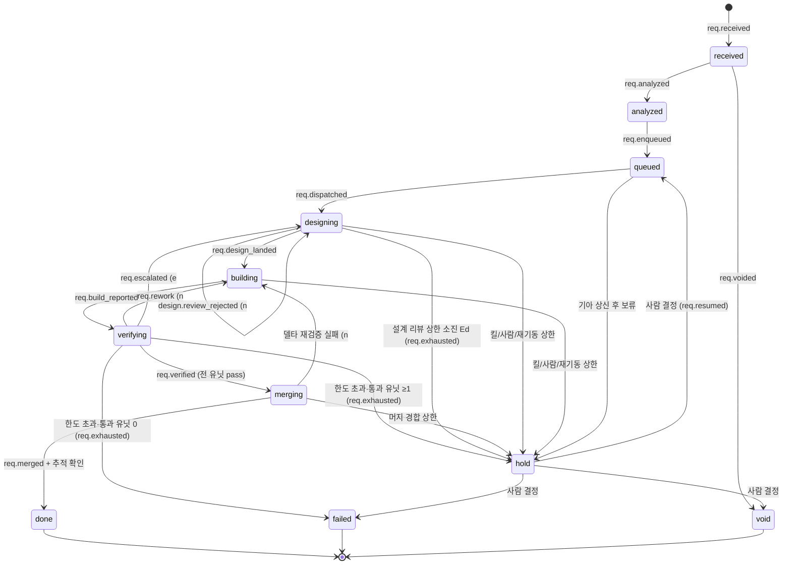
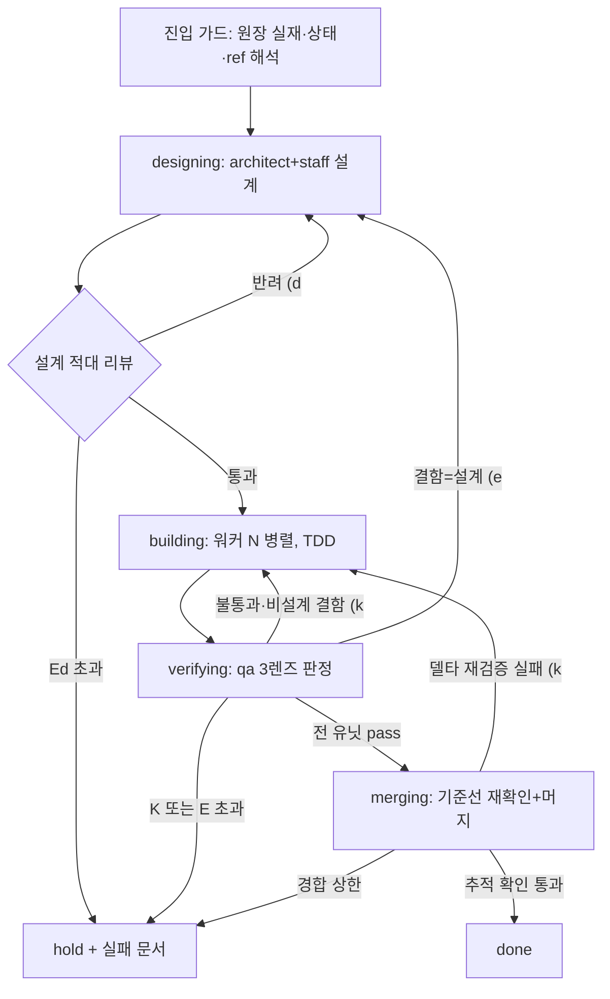
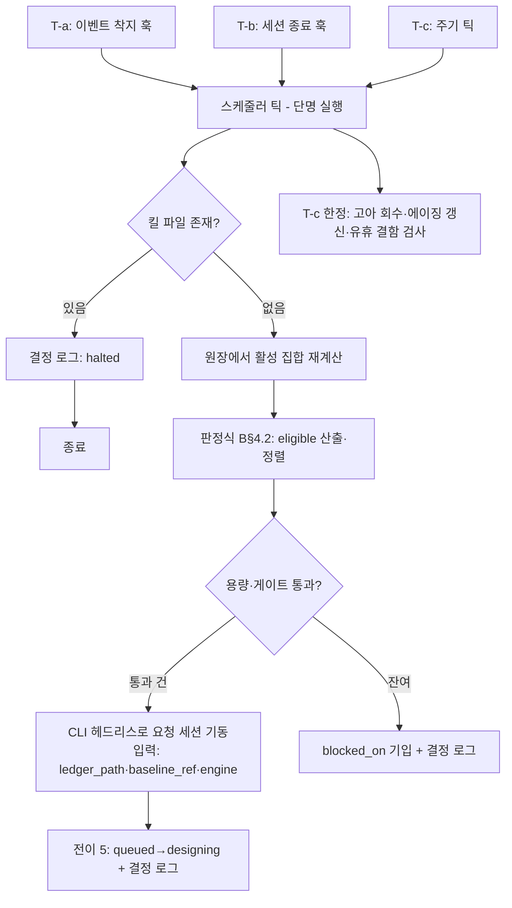
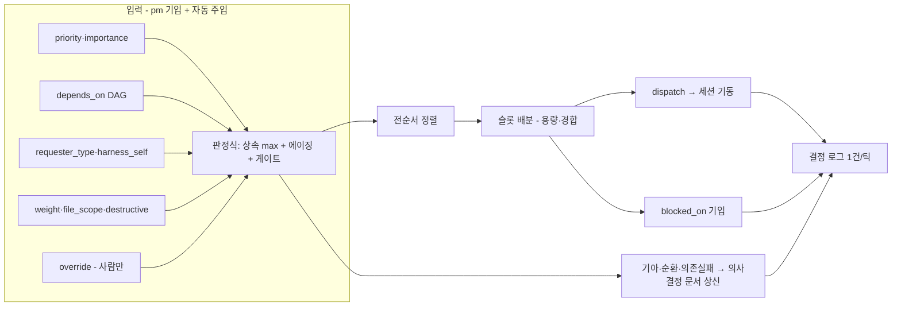
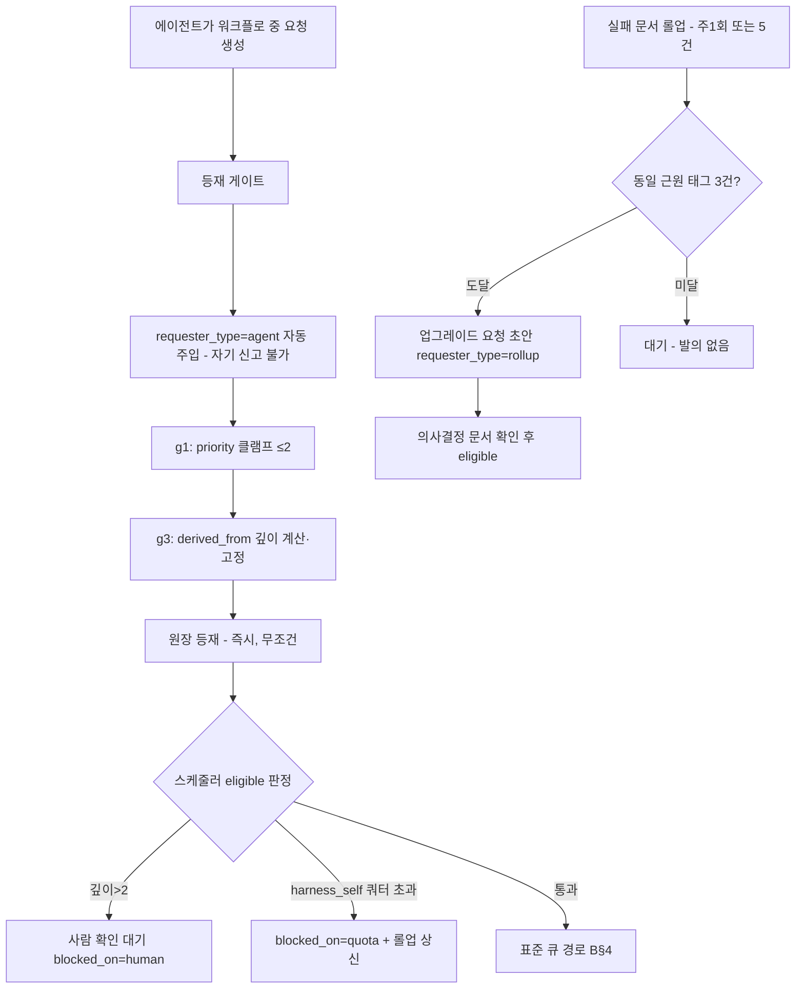
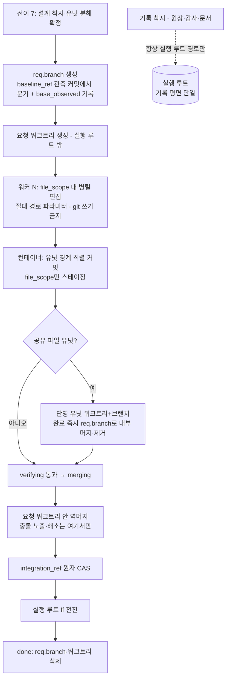
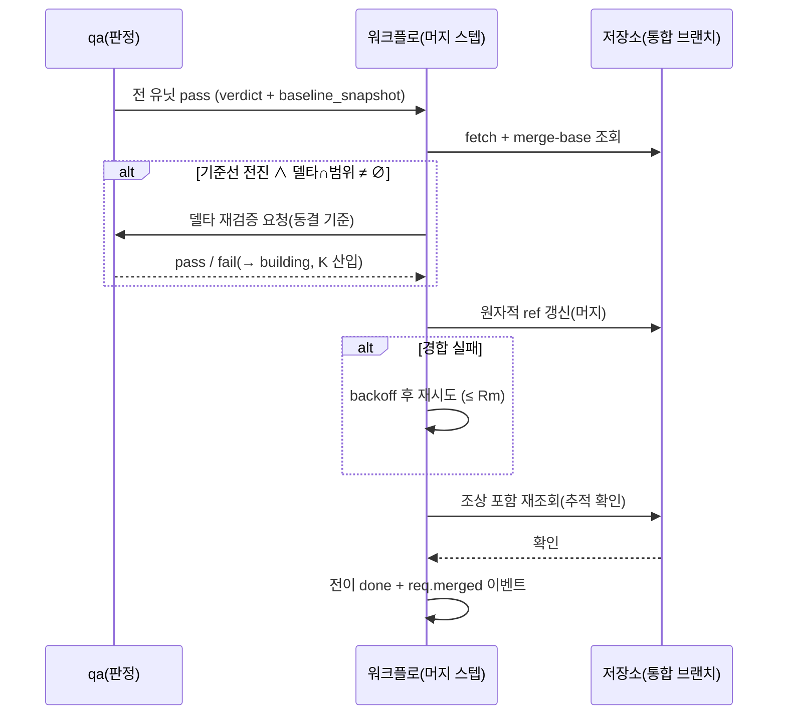
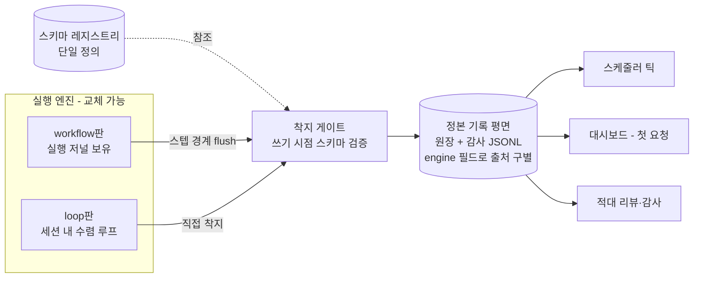
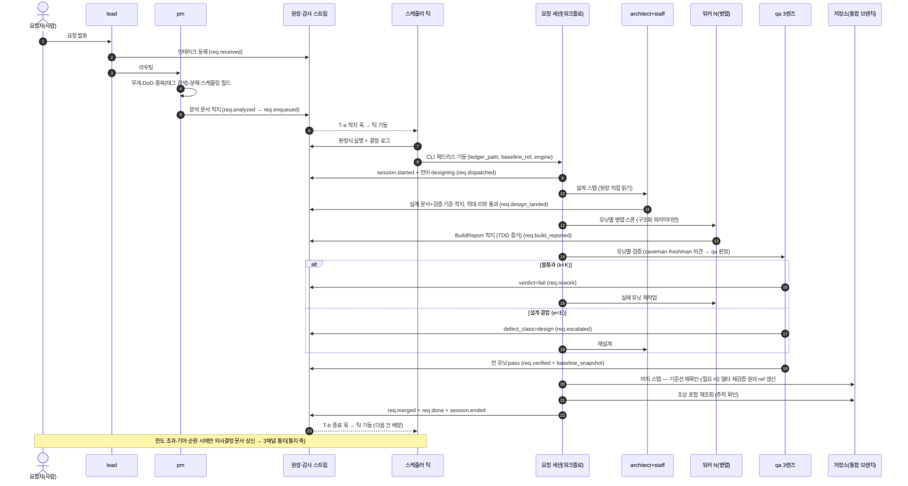

## 요약

**확정** — 아래가 본 축이 소유 정본으로 확정한 것이다. 계약 전문(필드 표·판정식·문법·전이표)은 각 계약 소절의 블록에 있고 이 절은 결론만 담는다.


- **범위**: S§4.1~4.2 · S§5.1~5.2 · S§5.5~5.6 · S§12 T10. 요청 상태기계 확정판, 요청당 세션 + 워크플로 실행 골격, 세션 기동 주체(트리거·보안 게이트·킬 스위치·동시성 상한), 큐·스케줄러 판정식, 에이전트 자발 요청 게이트, 검증 통과→반영 결합, 폴백판 평면 통합.
- **핵심 결정**:
  1. 상태 enum 11종 확정 — 진행형 상태(designing/building/verifying/merging)로 점유를 표현하고, S§5.2 초안의 완료형 명칭은 전이 이벤트로 흡수한다.
  2. 재작업 루프 상한 **K=3**, 설계 에스컬레이션 상한 **E=1**, 설계 리뷰 루프 상한 **Ed=2**, 사망 재기동 상한 **R=2** — 전부 정책 파일 소유의 제안값(B§9 총괄표).
  3. 세션 기동은 **상주 데몬 없이 단명 스케줄러 틱 3트리거**(이벤트 착지·세션 종료·주기 틱)로 한다. 킬 스위치는 파일 기반, 동시성 상한은 머신 설정 파일에서 읽는다. 고아 회수는 heartbeat 침묵을 점검 트리거로만 쓰고, 사망 판정은 **종료 실증 인터록**(수명주기 이벤트·프로세스 실재 측정)이 내리며, 이중 세션은 **lease fencing**(착지 게이트의 session_ref 대조)이 차단한다(B§3.6).
  4. 스케줄링은 **기계 판정식**(우선순위 정렬 + DAG 위상 + 병목 상위 스트림 우선순위 상속 + 용량·게이트)이 결정하고, pm은 입력 필드만 기입한다. 기아 에이징·사람 오버라이드·결정 로그 포함.
  5. 에이전트 자발 요청은 1급 유입으로 허용하되 **게이트 5종**(우선순위 상한·자기개선 WIP 쿼터·파생 깊이·중복 검사·발의 임계)으로 무한 자기증식을 차단한다.
  6. 검증 통과와 머지는 **같은 세션의 연속 워크플로 스텝**으로 묶고, 기준선 전진 시 델타 재검증을 가드로 둔다. 머지 직렬화는 커스텀 락 없이 git의 원자적 ref 갱신 + 유계 재시도로 한다. 요청 브랜치·요청 워크트리의 생성 주체·시점·이름 규약·워커 커밋 직렬화·공유 파일 격리·기록/코드 쓰기 분리는 B§6.1.1이 확정한다.
  7. 폴백(세션 내 수렴 루프)판은 **단일 스키마 레지스트리 + 엔진 무관 착지 게이트 + engine 필드 + 단계 경계 flush**로 기록 평면 동일성을 보장하고, 설치 시 두 엔진 계약 테스트로 실증한다.
- **타 축 위임**: 문서·이벤트의 파일 스키마 상세(문서 체계 축 — S§3.5·S§3.9·T9), 통지 3채널 실현(통지 축 — S§3.7·T5), 머신 편성·자원 프로브(실행 환경 축 — S§4.3~4.4·T1), 태그·검색 인덱스(태그 축 — S§3.6·T2), 채번·동시 쓰기 실측(무결성 축 — S§3.8·T6), 리드 게이트(리드 축 — S§5.4·T3).

**실측 대기** — 10건. 정본은 B§10, 전수 색인은 부속 PA. B§10 목록 — Workflow 도구의 입력 스키마 필수 강제·실행 저널 형식·캐시 재개, 헤드리스 기동 경로, 플랫폼 네이티브 주기 스케줄링의 존부, 스텝 내부 heartbeat·pid 관측 가능 여부.

**미결** — 원자료에 본 축의 별도 미결 절이 없다(빈 절을 만들지 않는다). 본 축에 걸린 미결의 정본은 부속 PB다.

## 1. 요청 상태기계 (S§5.2 확정판)

### 1.1 상태 enum (11종)

| 상태 | 의미 | 점유 중 행위 주체 | 분류 |
|---|---|---|---|
| `received` | 리드 인테이크로 원장 등재됨. pm 분석 대기 | pm | 활성(전처리) |
| `analyzed` | pm 분석 문서 착지, 스케줄링 필드 완비 | (자동 전이 대기) | 활성(전처리) |
| `queued` | 스케줄러의 대기 집합. 실행 자원 배정 대기 | 스케줄러 | 활성(대기) |
| `designing` | 요청 세션 기동됨. architect+staff engineer 설계 + 설계 적대 리뷰 진행 | architect | 활성(실행) |
| `building` | 워커 N 병렬 구현(TDD) 진행 | 워커들 | 활성(실행) |
| `verifying` | qa 3렌즈 검증 진행 | qa | 활성(실행) |
| `merging` | 전 유닛 통과. 기준선 재확인 + 반영(머지) 진행 | 실행 엔진 | 활성(실행) |
| `done` | 머지 실재 확인 완료. 정상 종결 | — | 종결 |
| `hold` | 상한 초과·킬 스위치·사람 개입으로 보류. 사람 결정 대기 | 사람 | 준종결(재개 가능) |
| `failed` | 실패 종결. 실패 문서 자동 착지 동반 | — | 종결 |
| `void` | 오등재 무효 종결. ID 영구 소각(S§3.3) | — | 종결 |

**S§5.2 초안과의 차이와 근거**: 초안의 `designed`류 완료형 명칭은 "그 단계가 끝났다"는 이정표라서, 진행 중 요청이 어느 상태에도 속하지 않는 구간이 생긴다(설계 진행 중은 `analyzed`도 `designed`도 아니다). 스케줄러·감사·대시보드가 답해야 하는 질문은 "지금 어디를 점유 중인가"이므로 진행형 상태로 확정하고, 이정표는 전이 이벤트(B§1.3)로 남긴다. 초안의 `rework(n)`·`escalated`는 별도 대기 의미가 없는 순간 통과 지점이라 상태가 아니라 **카운터 동반 전이**로 흡수한다.

### 1.2 요청 레코드의 상태 관련 기계 필드 [계약]

문서 파일 스키마 전체는 문서 체계 축 소유. 여기서는 실행 엔진이 소비·기입하는 필드만 확정한다.

| 필드 | 타입 | 필수 | 기입 주체 |
|---|---|---|---|
| `state` | enum(B§1.1) | 필수 | 실행 엔진·스케줄러(전이 함수만) |
| `rework_count` | int ≥0 | 필수(기본 0) | 실행 엔진 |
| `escalation_count` | int ≥0 | 필수(기본 0) | 실행 엔진 |
| `design_review_count` | int ≥0 | 필수(기본 0) | 실행 엔진 |
| `restart_count` | int ≥0 | 필수(기본 0) | 스케줄러(고아 회수) |
| `merge_retry_count` | int ≥0 | 필수(기본 0) | 실행 엔진 |
| `blocked_on` | enum{`capacity`,`dependency`,`dependency-failed`,`gate`,`file-conflict`,`quota`,`human`} \| null | 필수(기본 null) | 스케줄러 |
| `derived_from` | 요청 ID \| null | 필수(기본 null) | 등재 게이트 |
| `session_ref` | 세션 식별자 \| null | 필수(기본 null) | 스케줄러(dispatch·재디스패치 시 — 요청당 유일한 유효 lease, B§3.6) |
| `base_observed` | 커밋 식별자 \| null | 필수(기본 null) | 실행 엔진(전이 7 — 분기점 측정 기록, B§6.1.1) |

### 1.3 전이표

전이는 아래 표의 행으로만 가능하다. 표에 없는 (from,to) 조합은 착지 게이트가 거부한다. 모든 전이는 감사 이벤트 1건을 원자적으로 동반한다(이벤트 없는 상태 변경 금지).

| # | from | to | 트리거 | 가드(판정식) | 이벤트명 | payload 필수 필드(공통 7요소 외) |
|---|---|---|---|---|---|---|
| 1 | (등재) | `received` | 리드 인테이크→원장 등재 | 파일명·ID 정본형 검증(S§9.3-18) | `req.received` | requester_type, derived_from |
| 2 | `received` | `analyzed` | pm 분석 문서 착지 | DoD 존재 ∧ 스케줄링 필드 완비(B§4.1) ∧ 분석 문서 참조 무결성 | `req.analyzed` | analysis_doc_ref, weight |
| 3 | `received` | `void` | 오등재 정정 | 사람 확인 존재(HITL) | `req.voided` | reason, approved_by |
| 4 | `analyzed` | `queued` | 자동(2 직후) | 필드 완비 재검 | `req.enqueued` | 스케줄링 필드 스냅샷 전체 |
| 5 | `queued` | `designing` | 스케줄러 dispatch + 세션 기동 성공 | eligible(r)=true(B§4.2) ∧ 킬 스위치 off ∧ 세션 lifecycle start 수신 | `req.dispatched` + `session.started` | machine, session_ref, decision_ref(결정 로그 tick_id) |
| 6 | `designing` | `designing` | 설계 리뷰 반려 | design_review_count < Ed | `design.review_rejected` | review_verdict_ref, n=design_review_count |
| 7 | `designing` | `building` | 설계 문서+검증 기준 착지 + 적대 리뷰 통과 | 검증 기준 3요소(S§5.1) 스키마 검증 통과 | `req.design_landed` | design_doc_ref, criteria_ref, work_units[] |
| 8 | `building` | `verifying` | 전 유닛 BuildReport 착지 | 각 report의 `tdd_evidence` 필드 존재(정본: A§4.2) | `req.build_reported` | unit_report_refs[] |
| 9 | `verifying` | `building` | 판정 불통과(결함 클래스≠설계) | rework_count < K | `req.rework` | failed_units[], verdict_refs[], n=rework_count |
| 10 | `verifying` | `designing` | 판정 불통과(결함 클래스=설계) | escalation_count < E | `req.escalated` | verdict_refs[], e=escalation_count |
| 11 | `verifying` | `merging` | 전 유닛 verdict=pass | verdict 전건이 구조화 채널 레코드(산문 무효 — S§5.3) | `req.verified` | verdict_refs[], baseline_snapshot |
| 12 | `designing`·`verifying` | `hold` / `failed`(선택식 아래) | 루프 상한 소진(설계 리뷰·재작업·에스컬레이션) | (from=`designing` ∧ design_review_count ≥ Ed) ∨ (from=`verifying` ∧ (rework_count ≥ K ∨ escalation_count ≥ E)) | `req.exhausted` | failure_doc_ref, limit_kind∈{design_review, rework, escalation}, passed_units:int |
| 13 | `merging` | `building` | 델타 재검증 실패 | rework_count < K (재검증 실패는 K에 산입) | `req.merge_reverify_failed` | delta_paths_ref, verdict_ref |
| 14 | `merging` | `done` | 머지 + 추적 확인 통과 | 통합 브랜치가 요청 커밋을 조상으로 포함(B§6.3) | `req.merged` + `req.done` | merged_ref_name, merge_commit_observed |
| 15 | `merging` | `hold` | 머지 재시도 상한 초과 | merge_retry_count ≥ Rm | `req.merge_contention` | attempts, failure_doc_ref |
| 16 | 활성 전부 | `hold` | 킬 스위치 · 사람 개입 · restart_count ≥ R | — | `req.held` | reason∈{kill,human,restart-limit} |
| 17 | `hold` | `queued` | 사람 결정(의사결정 문서 응답) | 응답 착지 실재(메시지 아님 — S§9.5-29) | `req.resumed` | adjudication_ref |
| 18 | `hold` | `failed` | 사람 결정 | 상동 | `req.closed` | adjudication_ref, failure_doc_ref |
| 19 | `hold` | `void` | 사람 결정 | 상동 | `req.voided` | adjudication_ref, reason |
| 20 | `queued` | `hold` | 기아 하드 임계 도달 상신 후 사람이 보류 선택 | B§4.3 | `req.held` | reason=starvation-adjudication |

전이 12의 to 선택식(B§2.2 `terminal(hold_or_failed)`와 동일 규칙): from=`designing`이면 항상 `hold`(설계 리뷰 소진 = 요구 모호 판정 — 사람 상신 대상, B§2.3 Ed 근거). from=`verifying`이면 `passed_units > 0 → hold`(부분 유효 산출 — 사람이 재개·폐기 결정), `passed_units == 0 → failed`. Ed 소진은 designing 상태에서 일어나므로 from에 `designing`이 포함되어야 B§2.2 의사코드의 `return terminal(hold, limit_kind=design_review)`가 전이표상 합법이다 — from을 `verifying` 단독으로 두면 B-1 규율(표 밖 전이 거부)에 의해 게이트가 자기 의사코드를 차단한다.

재시도·재도전 규칙: `failed`·`void`·`done`은 종결이며 재개 전이가 없다. 같은 일을 다시 하려면 `derived_from`으로 연결된 **새 요청**을 등재한다(ID 영구 소각 — S§3.3).

세션 사망(B§3.6): 사망은 상태 전이가 아니다 — 상태는 유지되고 `session.died` 이벤트 + `restart_count` 증가 후 재디스패치(캐시 재개)되며, R 초과 시에만 전이 16으로 `hold`. 재디스패치의 전제(원 세션 종료 실증·lease 갱신)와 이중 세션 차단은 B§3.6의 인터록·fencing 규약이 정의한다 — 전이 5 가드는 fresh dispatch만 커버하므로 resume 경로의 안전은 이 규약에 의존한다.

### 1.4 상태도



### 1.5 규율 항목과 장치 슬롯

- **B-1. 전이는 전이표의 행으로만, 이벤트 동반 원자 수행.** [장치 — 상태 필드를 쓰는 유일 경로를 실행 엔진의 전이 함수(워크플로 스텝/수렴 루프 스텝)로 한정하고, 그 함수가 "이벤트 append → 상태 필드 갱신 → 추적 확인"을 한 단위로 수행. 착지 게이트(네이티브 훅: 문서 쓰기 도구 호출 전 검사)가 전이표 밖 (from,to)와 이벤트 미동반 상태 변경을 거부. 훅 이벤트: PreToolUse(Write/Edit 매처). | —]
- **B-2. 상태의 정본은 원장 문서이고 큐·대시보드·대기 집합은 전부 순수 파생이다(S§5.2·S§3.6).** [장치 — 스케줄러 틱이 매 실행 시 원장에서 대기 집합을 재계산(상주 상태 없음). 파생 캐시를 두는 경우에도 재생성 가능성만 허용(S§3.8 무오염). | —]
- **B-3. 종결 전이는 판정만이 만든다 — 작업자의 완료 주장은 전이 8(보고 착지)까지다(S§9.2-10).** [장치 — 전이 11의 가드가 qa 명의의 구조화 verdict 레코드 존재를 요구. verdict의 명의·신원은 세션 발급 신원(S§7)에서 오고, 산출 텍스트 속 판정 문구는 판정식이 아예 읽지 않는다(참칭 원천 차단 — S§5.3). | —]
- **B-4. 상한 초과 종결에는 실패 문서가 자동 착지한다(S§5.1).** [장치 — 전이 12·15의 전이 함수가 실패 문서 생성·참조 기입까지 한 단위로 수행. 실패 문서 스키마는 문서 체계 축 소유. | —]
- **B-5. 어떤 에이전트·통지 메시지도 사람의 승인이 아니다(S§9.5-29).** [장치 — 전이 17~19의 가드가 의사결정 문서의 응답 슬롯 착지 실재를 검사(응답 슬롯 스키마는 통지 축 소유). 응답 착지가 실제 사람에게서 왔는지의 최종 판별은 장치 불가 — 판정 근거: 파일 시스템 수준에서 기입 주체의 인간성은 검증 불능. 완화: 응답 착지 경로를 사람 전용 진입구(대화형 질문 도구 또는 사람 세션)로 한정하고 감사 이벤트로 대조. | 장치 불가(부분)]

---

## 2. 요청당 세션 + 워크플로 실행 (S§4.1·S§5.1)

### 2.1 워크플로 기동 입력 스키마 [계약]

원장 미등재 실행을 존재 차원에서 차단한다(S§5.1): 기동 입력의 필수 인자가 원장 문서 경로다.

| 필드 | 타입 | 필수 | 기입 주체 | 비고 |
|---|---|---|---|---|
| `ledger_path` | string(경로) | 필수 | 스케줄러 | DoD 정본 포인터. 실재·상태 검증이 첫 스텝 |
| `baseline_ref` | string(ref 이름) | 필수 | 스케줄러 | 브랜치·태그 이름만. 커밋 해시 리터럴 금지(S§5.1) |
| `engine` | enum{`workflow`,`loop`} | 필수 | 스케줄러 | B§7 판 선택 판정식의 결과 |
| `resume` | bool | 필수(기본 false) | 스케줄러 | 고아 회수 재디스패치 시 true |
| `machine_id` | string | 필수 | 스케줄러 | 신원 전파(S§7) |

### 2.2 워크플로 골격 (의사코드) [계약]

```
workflow request_pipeline(ledger_path, baseline_ref, engine, resume, machine_id):

  # ── 0. 진입 가드 ──────────────────────────────
  req = read_full(ledger_path)                       # 원장 전문 — DoD 정본(S§5.3)
  abort_unless req.exists and req.state in {queued, designing, building, verifying, merging}
  abort_unless req.session_ref == self.session_ref   # lease 인터록 — 자기 세션이 유효 점유자(B§3.6)
  abort_unless resolvable(baseline_ref)              # ref 이름을 저장소에 물어 해석
  emit event("session.started", req.id)              # 수명주기는 컨테이너가 직접 방출(S§10-19)

  # ── 1. 설계 (state: designing) ───────────────
  transition(req, designing) unless resume_past_design
  loop d in 1..Ed:                                   # Ed = 설계 리뷰 상한(제안 2)
    design = step(agents=[architect, staff_engineer],
                  input={ledger_path, baseline_ref},          # 파라미터만 — 기준 재기술 금지
                  output_schema=DesignDoc)                    # 심화 설계+테스트 시나리오+검증 기준 3요소
    review = step(agent=independent_design_reviewer,          # 설계 적대 검증(S§5.3)
                  input={ledger_path, design.ref},
                  output_schema=ReviewVerdict)
    break if review.verdict == pass
    emit event("design.review_rejected", n=d)
  if not passed: return terminal(hold, limit_kind=design_review)

  transition(req, building, event="req.design_landed")
  units = design.work_breakdown                      # 파일 소유권 서로소 1순위(S§5.1)

  # ── 2. 구현·검증 루프 (state: building ⇄ verifying) ──
  pending = units
  loop k in 1..K:                                    # K = 재작업 사이클 상한(제안 3)
    reports = parallel for u in pending:
        step(agent=role_of(u),                       # 스폰 입력은 구조화 필드만(B§2.4)
             input={ledger_path, design.ref, unit_id=u.id,
                    file_scope=u.file_scope, baseline_ref,
                    worktree_path=req.worktree_abs},  # 요청 워크트리 절대 경로(B§6.1.1-1)
             output_schema=BuildReport)              # TDD 증거 필드 필수 — tdd_evidence 계약
                                                     #  (정본: A§4.2 — failing_test_ref·failing_run_excerpt·
                                                     #   impl_ref·test_run_output_ref·deviation_disclosure)
    transition(req, verifying, event="req.build_reported")

    verdicts = parallel for u in pending:
        opinions = parallel [ step(caveman,  schema=Opinion),
                              step(freshman, schema=Opinion) ]   # 의견 제시만 — 판정 아님
        step(agent=qa,
             input={ledger_path, criteria=design.criteria_ref,
                    report=reports[u], opinions},
             output_schema=Verdict)                  # 기준 동결·엄격화만 허용(S§9.2-8)

    if all(v.verdict == pass): break                 # → 3. 반영으로
    if any(v.defect_class == design):
        e += 1
        if e > E: return terminal(hold, limit_kind=escalation)   # E = 제안 1
        transition(req, designing, event="req.escalated"); goto 설계 재진행
    pending = failed_units(verdicts)                 # 실패 유닛만 재작업
    transition(req, building, event="req.rework", n=k)
  if not all_passed: return terminal(hold_or_failed, limit_kind=rework)  # 실패 문서 자동 착지

  # ── 3. 반영 (state: merging) — 상세 B§6 ────────
  transition(req, merging, event="req.verified", baseline_snapshot=observe(baseline_ref))
  result = merge_step(req, verdicts)                 # B§6.2 의사코드
  if result == reverify_failed: goto 재작업 루프(k 산입)
  if result == contention_limit: return terminal(hold, limit_kind=merge)

  transition(req, done, event="req.merged"+"req.done")
  emit event("session.ended", req.id, outcome=done)
```

`terminal(hold|failed, …)`은 전이 12·15와 실패 문서 자동 착지, `session.ended` 방출까지 수행한다. hold와 failed의 선택은 전이 12의 to 선택식(B§1.3) 그대로다: 산출물이 부분적으로 유효(passed_units > 0)하면 `hold`(사람이 재개·폐기 결정), 전무하면 `failed`. 설계 리뷰 소진(from=designing)은 항상 `hold`. [장치 — 전이 함수의 판정식(전이 12 선택식과 같은 코드 지점) | —]

### 2.3 K·E·Ed 제안값과 근거

| 파라미터 | 제안값 | 근거 |
|---|---|---|
| K (재작업 사이클 상한) | **3** (최초 1 + 재작업 2) | 각 사이클마다 판정 피드백이라는 새 입력이 들어간다. 3회째 실패는 같은 기준·같은 팀·갱신된 피드백으로 세 번 시도해 실패한 것으로, 4회째에 새 정보 원천이 없다 — 새 증거 없는 반복은 S§5.4가 금지하는 번복과 동형이다. 무한·과대 루프의 비용은 S§5.1의 기록치(완료 작업 반복 재기동 평균 8.53회가 토큰 소비 최대 원인)가 상한 고정의 근거다. 값 자체는 미검증 제안 — 운영 실측(사이클별 수렴률)으로 보정한다. |
| E (설계 에스컬레이션 상한) | **1** | 에스컬레이션 1회는 "구현이 드러낸 설계 결함"이라는 새 증거로 정당하다. 2회째 설계 실패는 설계 역량이 아니라 요구·완료기준의 모호가 근원일 확률이 높고, 그것은 사람 사안이다(S§3.7). 또한 에스컬레이션 비용은 하류 전체(워커 N × 최대 K사이클)의 배수라 상한을 가장 낮게 건다. 미검증 제안. |
| Ed (설계 리뷰 반려 상한) | **2** | S§5.3의 실측(독립 리뷰 라운드마다 실질 결함 검출)에 따라 최소 1회 반려-수정은 정상 경로로 두되, 2회 반려 후에도 통과 못 하면 요구 모호로 판정해 상신한다. 미검증 제안. |

세 값 모두 **정책 파일 소유**(S§8 엔진 청결 — 코드 하드코딩 금지)이고, 변경은 결정 문서를 통해서만 한다. [장치 — 워크플로가 루프 상한을 정책 파일에서 읽고, 상한 검사와 루프는 같은 코드 경로의 같은 지점(S§10-11) | —]

### 2.4 스폰 파라미터 규율 (S§5.1·S§11-6)

- **B-6. 완료기준·기준선·실행 대상은 파라미터로만 전달한다.** 완료기준은 `ledger_path`(포인터), 기준선은 `baseline_ref`(ref 이름), 대상은 `unit_id`+`file_scope`(구조화 필드). 프롬프트 본문에 기준 재기술·커밋 해시 리터럴·요청 ID 산문 언급을 넣지 않는다. [장치 — ①스텝 입력 스키마에 자유 산문 기준 필드가 아예 없다(입력구 제거 — S§9.4-23의 역적용) ②스폰 프롬프트는 기계 생성 템플릿(S§10-6)이며 사람·리드가 손으로 쓰지 않는다 ③디스패치 린트(최소 커스텀: 40자리 16진 리터럴·기준 절 재기술 패턴 검사)가 기동 전 차단. 커스텀 근거: 프롬프트 문자열 내용 검사는 네이티브 스키마 강제 범위 밖. | 프롬프트에 섞인 의역·재서술의 완전 차단은 장치 불가 — 판정 근거: 자연어 동치 판정은 세계 지식 필요(S§9.4-19). 완화: 수신 측 규율(정본과 어긋나면 정본 우선 + 불일치 이벤트 보고)을 에이전트 정의에 내장.]
- **B-7. 각 에이전트는 원장을 직접 읽는다(S§5.3).** [장치 — 모든 스텝 입력 스키마에 `ledger_path` 필수 + 에이전트 정의(시스템 프롬프트)에 "착수 첫 행동 = 원장 전문 읽기" 내장. 실제 읽기 수행은 도구 호출 감사 이벤트로 사후 대조 가능(읽기 이벤트 부재 = 결함). | —]

### 2.5 실행 흐름도



---

## 3. 세션 기동 주체 (S§5.1 — 트리거·보안 게이트·킬 스위치·동시성 상한 한 묶음)

### 3.1 결정 — 상주 데몬 없는 단명 스케줄러 틱

**누가 세션을 여는가: 스케줄러 틱이 연다.** 틱은 상주 프로세스가 아니라 트리거 시점에 기동해 판정식(B§4.2)을 1회 실행하고 종료하는 단명 실행이다. 근거: 상주 감시 데몬은 "조용히 죽는 프로세스와 감시자의 감시자" 실패 모드로 기각됐다(S§11-19). 사람이 켠 세션의 생존에 큐 전진이 종속되는 구조(S§5.1의 정체 재현 경고)도 이것으로 끊는다 — 사람 온라인은 전제가 아니다(S§9.5-29).

틱의 세션 기동 수단: **CLI 헤드리스 모드로 새 요청 세션을 기동**하고 B§2.1 입력을 넘긴다. 세션 기본 설정(원격 제어·대기 무제한·병렬 상한)은 실행 환경 축 소유(S§4.4).

**네이티브 우선 판정**: 훅(이벤트 트리거)·CLI 헤드리스 기동은 플랫폼 기본 기능으로 가능 — 채택. 주기 트리거는 플랫폼 네이티브 스케줄링의 존부가 불확실(S§11-19도 미검증 추정으로 표기)하므로 **설치 전 실측 항목**으로 두고, 부재 시 OS 표준 스케줄러(cron류) 등록 1건을 최소 커스텀으로 허용한다(근거: 시간 기반 기동은 훅·에이전트 정의·Workflow 어느 네이티브 표면에도 없음).

### 3.2 기동 트리거 3종

| 트리거 | 발화 지점 | 장치 | 처리 |
|---|---|---|---|
| T-a 이벤트 착지 | `req.enqueued`·`req.resumed`·상태 전이 착지 직후 | 착지 경로의 네이티브 훅(PostToolUse 매처) → 틱 기동 | 신규 대기 건 즉시 판정 |
| T-b 세션 종료 | 요청 세션의 `session.ended`/`session.died` | 세션 수명주기 훅(SessionEnd — 헤드리스 발화 여부는 실측 항목 B§10) → 틱 기동 | 용량 반환 즉시 재판정 |
| T-c 주기 틱 | 고정 주기(제안 15분) | 플랫폼 네이티브 스케줄링(실측 항목) 또는 OS 스케줄러(최소 커스텀) | 기아 에이징 갱신·고아 회수·유휴 결함 검사 |

틱은 **멱등**이다: 동시 발화해도 같은 원장을 읽어 같은 결론에 도달하고, dispatch의 원자성은 상태 전이(전이 5)의 착지 게이트가 보장한다 — 같은 요청의 이중 dispatch는 두 번째 전이 시도가 가드(현재 상태 ≠ queued)에서 거부된다. 이 가드가 커버하는 것은 **fresh dispatch뿐**이다 — 활성 상태를 되살리는 resume 재디스패치의 이중화는 B§3.6의 종료 확인 인터록 + lease 규약이 막는다. 동시 쓰기 경합의 저수준 방식은 무결성 축 소유(S§3.8·T6). [장치 — 전이 가드 + 착지 게이트 + lease 대조(B§3.6) | —]

### 3.3 보안 게이트 (dispatch 전 판정식) [계약]

dispatch(r)는 아래 전부가 참일 때만 실행한다:

```
security_gate(r) :=
      r.state == queued
  ∧  r.dod_present                        # DoD 부재 건은 존재 차원에서 기동 불가(S§5.1)
  ∧  r.reference_integrity_ok             # 분석·참조 문서 실재(문서 체계 축의 착지 게이트 결과)
  ∧  r.requester_identity_valid           # 등재 시 자동 주입 신원(S§7)
  ∧  (r.destructive_class == false ∨ r.human_approval_ref != null)
                                          # 파괴적·비가역 클래스만 사람 확인(S§9.5-29)
  ∧  (r.requester_type != agent ∨ agent_gates_pass(r))   # B§5 게이트
```

`destructive_class`는 pm 분석의 안전 등급 필드(S§11-19의 등급 예: 파생 정정/비파괴·멱등/스폰 필요/파괴적)에서 온다. [장치 — 스케줄러 판정식(기계) + 등급 필드는 pm 분석 문서 스키마 필수 필드로 강제 | 등급 오분류 자체는 장치 불가 — 판정 근거: 파괴성 판정은 세계 지식 필요. 완화: 파괴적 동작의 실행 지점에 별도 HITL 훅(권한계) 이중화.]

### 3.4 킬 스위치

- 형태: 제어 디렉토리의 **킬 파일**(예: `<제어 경로>/dispatch-kill`). 존재하면 신규 dispatch 전면 정지.
- 판정 지점: 틱 시작 시 1회 + 각 dispatch 직전 1회(틱 실행 중 킬 반영).
- 범위: 신규 기동 정지가 기본. 진행 중 세션의 중단은 별도 행위(사람이 세션에 직접 개입 — 전이 16)로 분리한다. 이유: 일괄 강제 종료는 파괴적·비가역이라 사람 확인 대상이다.
- 조작 주체: 사람 전용. 에이전트의 킬 파일 생성·삭제는 금지. [장치 — 킬 파일 경로를 에이전트 쓰기 거부 목록에 등재(네이티브: 권한 설정의 도구 거부 규칙) + 킬 파일 생성·삭제를 감사 이벤트로 기록 | —]

### 3.5 동시성 상한

- 상한 값: 머신 설정 파일(실행 환경 축이 자원 프로브로 산출 — S§4.4·S§8)에서 읽는다. 고정값 하드코딩 금지.
- 검사 지점: dispatch 직전, 스폰과 같은 코드 경로의 같은 지점(S§10-11 — 상한을 경고로 두지 않는다. 초과 시 dispatch가 실행되지 않는 것이지 경고가 아니다).
- 이중 상한: ①머신별 동시 세션 수 ②전역 WIP 상한(활성 실행 상태 designing~merging 건 수 — S§11-17). [장치 — 스케줄러 판정식 + 설정은 머신 설정 파일과 한 몸 배포(S§10-11) | —]

### 3.6 생존 관측·고아 회수 — 종료 실증 인터록 + lease fencing [계약]

- 생존은 외부 관찰로 추정하지 않는다(S§10-19): 요청 세션이 `session.started`/`session.ended`/`session.died`를 직접 방출하고, 주기적 heartbeat 이벤트(제안 10분 간격)를 append한다. `session.started` payload에는 `machine_id`와 **세션 프로세스 식별자(OS pid)** 를 필수로 담는다 — 아래 인터록의 측정 대상이다(헤드리스에서의 pid 관측 가능 여부는 실측 항목 B§10-9).
- **heartbeat 침묵은 사망 판정이 아니라 점검 트리거다.** 응답 대기 무제한(S§4.4)·스텝 실행 시간 무상한 하에서는 "고아 창을 스텝 예상 시간보다 크게"라는 완화가 원리적으로 성립하지 않는다 — 스텝 예상 시간 자체를 정할 수 없다. 따라서 `state ∈ {designing,building,verifying,merging}` ∧ 마지막 heartbeat 경과 > 점검 창(제안 30분)은 **종료 확인 절차의 기동 조건일 뿐**이고, 창 값의 오설정은 점검 빈도를 바꿀 뿐 오판 재기동을 만들지 못한다 — 사망 판정은 아래 인터록만이 내린다.
- **종료 확인 인터록** — 재디스패치는 원 세션의 종료가 **실증**된 경우에만 한다:

```
orphan_check(r):                          # T-c 틱 · heartbeat 침묵 건 한정
  # r.machine_id·r.pid는 현재 r.session_ref의 session.started payload에서 읽는다
  if exists event(session.ended ∨ session.died, session_ref = r.session_ref):
      confirmed_dead                      # ① 수명주기 이벤트 실재
  else:
      alive = process_alive(r.machine_id, r.pid)   # ② 실물 측정 — 프로세스 실재 조회
                                          #    원격 머신은 실행 환경 축의 접속 경로 사용(S§4.3)
      if alive == false:   confirmed_dead
      if alive == true:    return no_action        # 장기 스텝은 정상 — 어떤 조치도 없음
      if alive == unknown: file_adjudication(kind=orphan-unverifiable, r)
                           return no_action        # 판정 불능 시 자동 재기동 금지 — 사람 상신으로 격하

  on confirmed_dead:
      emit event("session.died", proxy=true) unless 이미 실재
      restart_count += 1
      if restart_count ≤ R:
          session_ref ← 새 lease(스케줄러 기입 — 유일 기입 주체)
          resume=true 재디스패치(워크플로 캐시 재개 — S§4.1-③)
      else: 전이 16 (hold)
```

- **lease(세션 점유 토큰) — 이중 세션의 쓰기 차단(fencing).** 요청당 유효 세션은 원장의 `session_ref` 단 하나다(요청당 세션 1개 불변식 — S§4.1). `session_ref` 기입은 스케줄러 전용(dispatch·재디스패치 시 갱신)이고, **착지 게이트는 그 요청에 관한 모든 이벤트·문서·상태 전이의 발신 세션 신원(자동 주입 — S§7)을 원장의 현재 `session_ref`와 대조해 불일치를 거부**하고 `session.fenced` 결함 이벤트를 남긴다. 머지 스텝도 ref 갱신 직전 lease 보유를 재확인한다(B§6.2). 효과: 인터록을 뚫는 미지의 오판이 나더라도 구세션의 착지·커밋 반영·머지는 전부 게이트에서 거부된다 — 이중 커밋·이중 머지가 기록·반영 평면에 도달할 수 없다. resume 재디스패치는 활성 상태를 되살리므로 전이 5의 가드(현재 상태 ≠ queued 거부)가 커버하지 못하는데, 그 공백을 이 규약이 메운다. [장치 — 착지 게이트의 session_ref 대조(엔진 무관 — B§7.2-2와 같은 지점) + `session_ref` 쓰기 권한의 스케줄러 한정(착지 게이트가 기입 주체 신원 검사 — B§4.4 override와 동일 기법) | —]
- **오판된 생존 세션의 정지 경로**: lease를 상실한 세션은 첫 착지 거부의 사유 코드(lease-lost)를 받는 즉시 진행을 중단하고 `session.ended(outcome=fenced)`를 방출하며 자기 종료한다 — 재시도·우회 금지. 엔진 스텝과 에이전트 정의의 공통 처리로 내장한다. [장치 — 착지 게이트의 거부 사유 코드 + 엔진의 lease-lost 처리 경로 | 착지를 한 번도 시도하지 않는 세션의 외부 강제 종료는 장치 불가 — 판정 근거: 쓰기 없는 실행은 외부 부작용이 0이고, 진행 중 프로세스의 강제 종료는 파괴적·비가역이라 사람 확인 대상(B§3.4의 분리 원칙과 동일). 완화: 피해는 쓰기 시점에 전건 차단되므로 잔여는 자원 점유뿐 — 동시성 상한(B§3.5)이 그 상한을 걸고, 점유 세션은 다음 착지 시도에서 자기 종료한다.]
- **R=2 제안 근거**: 재기동 폭주(S§5.1 기록치 — 평균 8.53회 재기동이 토큰 소비 최대 원인)를 막는 상한. 2회 재개로 안 되는 사망은 환경 결함이 근원일 확률이 높아 사람 확인이 싸다. 미검증 제안.
- heartbeat의 발신 장치: 워크플로 스텝 경계 자동 방출(엔진 내장) + 세션 수명주기 훅 + **스텝 내부 주기 방출**(장시간 단일 스텝의 침묵 공백 제거 — 네이티브 가능 여부는 실측 항목 B§10-8). 스텝 내부 방출이 불가여도 안전성은 훼손되지 않는다 — 사망 판정이 heartbeat가 아니라 인터록(수명주기 이벤트·프로세스 실재)에 걸려 있기 때문이고, 영향은 점검 빈도(불필요한 orphan_check 실행 횟수)뿐이다. [장치 — 엔진 스텝 경계 방출 + 틱의 인터록 판정식 | 스텝 내부 무한 대기(행 걸림)와 정상 장기 사고의 구별은 장치 불가(대기 무제한이 정책 — S§4.4) — 판정 근거: 두 경우는 외부 관측이 동일. 완화: 기아 에이징(B§4.3)이 하류 대기를 표면화 + 프로세스 실재 확인으로 "죽었는데 방치"만은 배제.]

### 3.7 기동 흐름도



---

## 4. 큐·스케줄러 (S§5.6 · S§12 T10)

### 4.1 요청 레코드의 스케줄링 필드 [계약]

| 필드 | 타입 | 필수 | 기입 주체 | 의미 |
|---|---|---|---|---|
| `priority` | int 0~3 (3=최고) | 필수 | pm(분석 시) | 긴급도 — 정렬 1키의 원료 |
| `importance` | int 1~3 (3=최고) | 필수 | pm | 중요도 — 동률 2키 + 에이징 가속 계수 |
| `depends_on` | 요청 ID 배열(빈 배열 허용) | 필수 | pm·등재 주체(등재 시점 기계 필드 — 산문 유예 금지, S§9.5-27) | DAG 간선 |
| `requester_type` | enum{`human`,`agent`,`rollup`} | 필수 | 등재 게이트(자동 주입 — 자기 신고 불가) | B§5 게이트 분기 |
| `weight` | enum{`light`,`standard`,`heavy`} | 필수 | pm | 자원 클래스 — 머신 배정 입력 |
| `destructive_class` | bool | 필수 | pm | B§3.3 보안 게이트 입력 |
| `file_scope` | 경로 글롭 배열 | 필수(빈 배열 허용) | pm(개산) → architect(정밀화) | 공유 자원 경합 판정 키 |
| `eligible_after` | timestamp \| null | 선택 | pm·사람 | 예약 착수 |
| `override` | {priority:int, set_by, at} \| null | 선택 | **사람만** | B§4.4 |
| `harness_self` | bool | 필수 | 등재 게이트(태그에서 파생) | B§5 쿼터 입력 |
| `enqueued_at` | timestamp | 필수 | 등재 게이트(자동) | 에이징 기준점 |

`effective_priority`·`aging_bump`는 **저장하지 않는다** — 틱마다 순수 계산하는 파생값이다(정본·파생 분리, S§3.6). [장치 — 필드 완비는 전이 2·4의 착지 게이트가 검증(스키마 필수) | pm이 기입한 값의 타당성(우선순위가 정말 3인가)은 장치 불가 — 판정 근거: 가치 판단. 완화: B§4.4 사람 오버라이드 + 결정 로그의 사후 감사.]

### 4.2 기계 판정식 (의사코드) [계약]

pm은 위 입력 필드만 기입하고, 스케줄 결정은 아래 결정론적 판정식이 내린다(S§5.6-① — pm 오판의 폭발 반경을 필드 단위로 축소).

```
scheduler_tick(trigger):
  if kill_file_exists(): log_decision(halted); return

  reqs    = load_from_ledger(state ∈ 활성 전체)          # 정본에서 재계산 — 상주 상태 없음
  dag     = edges(r.depends_on for r in reqs)
  cycles  = detect_cycles(dag)
  for c in cycles:                                       # 순환 = 등재 결함
      mark blocked_on=dependency for all r∈c
      file_adjudication(cycle=c)                         # 사람 해소 — B§3.7 문서(통지 축)

  # ① 실효 우선순위 — 병목 상위 스트림 상속(S§5.6)
  #    own(r) = override.priority if set else r.priority
  #    Desc(r) = r에 (추이적으로) 의존하는 하류 요청 전체
  for r in topo_order_reverse(dag):                      # 하류부터
      r.eff_base = max( own(r), max(own(d) for d in Desc(r)) default own(r) )

  # ② 기아 에이징(B§4.3)
  for r in reqs where state==queued:
      wait_h = hours_since(r.enqueued_at)
      r.eff  = min(3, r.eff_base + floor(wait_h / aging_step[r.importance]))
      if wait_h ≥ STARVATION_H and not r.starvation_filed:
          file_adjudication(starvation, r)               # 나열 경고가 아니라 상신(S§5.6-②)

  # ③ 적격 집합
  running  = reqs where state ∈ {designing,building,verifying,merging}
  eligible = [ r for r in reqs where state==queued
               and all(dep.state==done for dep in r.depends_on)         # 의존 해소
               and not any(dep.state ∈ {failed,void} for dep in r.depends_on
                           or (mark blocked_on=dependency-failed; file_adjudication))
               and security_gate(r)                                     # B§3.3 (에이전트 게이트 B§5 포함)
               and (r.eligible_after is null or now ≥ r.eligible_after)
               and glob_intersect(r.file_scope, union(x.file_scope for x in running)) == ∅ ]
                                                                        # 경합 없음(S§5.6)

  # ④ 전순서 정렬 — 동률까지 결정론
  order = sort(eligible, key=(eff desc, importance desc, enqueued_at asc, req_id asc))

  # ⑤ 슬롯 배분 — "다음 하나"가 아니라 동시 실행 집합(S§5.6)
  dispatched = []
  for r in order:
      if global_wip(running + dispatched) ≥ WIP_CAP: mark(r, capacity); continue
      m = first(machines where free_slots(m) > 0 and fits(m, r.weight))
      if m is null: mark(r, capacity); continue
      dispatch(r, m)                                     # B§3.7 — 전이 5 + 세션 기동
      dispatched.append(r)
  for r in queued − eligible: record blocked_on          # 미착수 사유 필수(S§9.5-28)

  # ⑥ 큐 유휴 금지 검사(S§9.5-28)
  if any(free_slots(m) > 0 for m in machines) and eligible != ∅ and dispatched == []:
      emit event("sched.idle_defect")                    # 결함 상태 — 실패 레코드로 편입

  log_decision(...)                                      # B§4.5 — 매 틱 1건, dispatch 유무와 무관
```

**우선순위 상속 산식(확정)**: `eff_base(r) = max( own(r), max{ own(d) : d ∈ Desc(r) } )` — 많은 하류가 기다리는 상류 건은 하류 최고 우선순위를 실효값으로 상속한다(S§5.6). 하류 "수"는 산식에 넣지 않는다 — 수를 가중하면 파생 요청 양산으로 우선순위를 조작할 수 있어(B§5의 자기증식 게이트와 정면 충돌) max 상속만 채택한다. [장치 — 판정식 자체(결정론 코드) | —]

검증 시나리오(적대 리뷰·설치 검증용 최소 셋): ①선형 사슬(하류 P3 1건 → 상류 eff=3) ②다이아몬드 의존(합류점 상속) ③순환(상신 발생) ④동률 4건(전순서 결정론 — 두 번 돌려 같은 순서) ⑤에이징 승급 경계(임계 직전/직후) ⑥유휴 결함(용량 여유+적격 잔존 강제 재현).

### 4.3 기아 에이징 — 임계 제안값과 상신 경로

| importance | aging_step (대기 시간당 1레벨 승급) | 근거 |
|---|---|---|
| 3 | 4시간 | 중요도 최고 건이 저긴급으로 잘못 매겨져도 반나절 내 최고 실효 우선순위에 도달 |
| 2 | 12시간 | 1일 내 1~2레벨 승급 |
| 1 | 24시간 | 저중요 건도 상한(3)까지 최대 3일이면 도달 — 무한 대기 배제 |

- **하드 임계(STARVATION_H) = 48시간**: 대기 48시간 도달 시 에이징과 무관하게 **의사결정 문서 자동 상신**(S§5.6-② — 나열식 방치 알림은 소비되지 않는다는 실측에 따라, 경고 목록이 아니라 B§3.7 문서+3채널 통지로 표면화). 상신 문서에는 미착수 사유(blocked_on 이력)와 선택지(우선 지정/보류/폐기)를 담는다. 문서 스키마·통지는 통지 축 소유.
- 상신은 요청당 1회(중복 상신 금지 — `starvation_filed` 마킹). 재상신 정책(미응답 에스컬레이션)은 통지 축의 미응답 규칙을 따른다.
- 값 전부 정책 파일 소유·미검증 제안. 보정 신호: 상신 발생률(높으면 용량 부족 또는 임계 과민).

[장치 — 틱의 판정식이 계산·상신까지 자동 수행. 상신 소비(사람 응답)는 장치 불가 — 판정 근거: 사람 행동. 완화: 통지 축의 미응답 에스컬레이션 규칙.]

### 4.4 사람 오버라이드 (S§5.6-③)

- `override.priority`는 판정식에서 `own(r)`을 선점한다(B§4.2 ①). 기입 주체는 사람만.
- 추가 선점: 사람은 특정 요청의 **즉시 착수 지정**이 가능하다 — `override.priority=3` + `eligible` 게이트 중 용량·경합 외 게이트를 통과한 상태라면 다음 틱에서 최상단 정렬이 보장된다. 용량·파일 경합·파괴 클래스 승인 게이트는 오버라이드로도 건너뛸 수 없다(안전 게이트는 선점 대상이 아님).
- [장치 — override 필드 기입 경로를 사람 진입구로 한정(에이전트 도구 권한에서 해당 필드 쓰기 거부 — 착지 게이트가 기입 주체 신원을 검사) + 판정식이 필드를 기계적으로 선점 처리 | 사람 신원의 최종 판별은 B§1.5 B-5와 동일한 한계 — 완화 동일.]

### 4.5 스케줄 결정 로그 스키마 (S§5.6-④) [계약]

매 틱 1레코드, append-only JSONL, 감사 트리의 샤딩 규칙(S§3.2)을 따른다. 형식 수준 보장: 1레코드=1줄, 개행 이스케이프(S§3.6).

| 필드 | 타입 | 필수 | 기입 주체 |
|---|---|---|---|
| `ts` | timestamp | 필수 | 틱(자동) |
| `tick_id` | string(결정론 해시 — 무결성 축 ID 규약) | 필수 | 틱 |
| `trigger` | enum{`event`,`session-end`,`periodic`,`manual`} | 필수 | 틱 |
| `machine`·`session` | string | 필수 | 자동 주입(S§3.5) |
| `kill_switch` | bool | 필수 | 틱 |
| `capacity` | {machine_id: {cap:int, active:int}} | 필수 | 틱 |
| `inputs` | 배열: {req_id, state, own, override존부, importance, eff_base, eff, deps_unmet:int, blocked_on} | 필수 | 틱 |
| `decisions` | 배열: {req_id, action:enum{`dispatch`,`skip`}, machine\|null, reason:enum{`capacity`,`dependency`,`dependency-failed`,`gate`,`file-conflict`,`quota`,`scheduled-later`,`dispatched`}} | 필수 | 틱 |
| `adjudications_filed` | 배열: {req_id, kind:enum{`starvation`,`cycle`,`dependency-failed`,`quota-rollup`}} | 필수(빈 배열 허용) | 틱 |
| `idle_defect` | bool | 필수 | 틱 |
| `schema_ver` | string | 필수 | 틱 |

[장치 — 로그 방출은 틱 코드에 내장(로그 없는 결정 불가 — 같은 함수가 결정과 기록을 한 단위로). producer/consumer 계약(S§7): producer=틱, consumer=대시보드(첫 요청)+적대 리뷰·감사, transition=월 아카이브, 보존은 문서 체계 축 규약 | —]

### 4.6 스케줄러 흐름 요약



---

## 5. 에이전트 자발 요청 게이트 (S§5.5 · S§5.6 · S§10-12)

에이전트의 요청 생성은 1급 유입 경로다(허용이자 예정 — S§5.6). 게이트는 유입을 막는 것이 아니라 **무한 자기증식과 큐 점거**를 막는다.

### 5.1 게이트 5종

| # | 게이트 | 판정식 | 장치 슬롯 |
|---|---|---|---|
| g1 | **우선순위 상한** | `requester_type==agent → priority ≤ 2` 강제 클램프. 상향은 사람 오버라이드만 | [장치 — 등재 게이트가 기입 시 클램프(거부가 아니라 정규화 + 클램프 이벤트 기록) \| —] |
| g2 | **자기개선 WIP 쿼터** | `harness_self==true`인 활성 실행(designing~merging) 건수 ≤ ⌈WIP_CAP × 30%⌉. 초과 시 신규 harness_self 건은 등재는 되나 `blocked_on=quota`로 eligible 제외 | [장치 — 스케줄러 판정식 B§4.2-③에 쿼터 항 추가. 근거: 선행 운영에서 요청의 94%가 하네스 자신 수리(S§1 비목표) — 쿼터 없는 자기개선 허용은 S§10-12의 루프 재현 \| —] |
| g3 | **파생 깊이 상한 D=2** | `derived_from` 사슬 깊이(사람 발원=0) > 2 인 에이전트 요청은 등재는 허용(등재 즉시 원칙 — S§5.6), eligible은 사람 확인(의사결정 문서 응답) 전까지 차단 | [장치 — 등재 게이트가 부모 원장에서 깊이를 계산해 필드로 고정, 스케줄러가 게이트 판정. 근거: 재귀 스폰의 지수 증식을 깊이에서 절단 \| —] |
| g4 | **중복 검사 의무** | pm 분석 문서에 `dedup_check`(태그 검색 질의+결과 요약+판정) 필드 필수 — 기존 기능·기결 사항 재작업 차단(S§3.6 1차 소비처) | [장치 — 분석 문서 스키마 필수 필드 + 착지 게이트. 검색 상세는 태그 축 소유 \| 검색의 실질 수행 여부는 장치 불가 — 판정 근거: 필드 내용의 성실성은 세계 지식 판정. 완화: 검색 도구 호출의 감사 이벤트와 대조(호출 이벤트 부재 = 결함).] |
| g5 | **자기개선 발의 임계**(B§5.2) | 롤업·임계 요건 충족 전 자동 발의 금지 | 아래 B§5.2 |

### 5.2 자기 개선 루프의 운용 파라미터 (S§5.5 잔여 — 제안값)

- **롤업 주기**: 주 1회 정기 + 하네스 태그 실패 문서 누적 5건 도달 시 즉시 1회(둘 중 먼저). 롤업은 실패 문서를 근원 태그로 묶어 요약하고, 임계 도달 묶음만 업그레이드 요청 초안으로 만든다.
- **발의 임계**: 동일 근원 태그의 실패 **3건**(관측된 실패에서 출발하는 유계 개선 — S§1. 1건 발의는 S§10-12의 자기 급식 루프, 과대 임계는 개선 정지 — 스펙 T8의 양측 실패를 피하는 중간값. 미검증 제안 — 보정 신호: 발의된 요청의 기각률).
- **사람 확인 지점**: 자동 발의된 업그레이드 요청은 `requester_type=rollup`으로 등재되고 **의사결정 문서로 사람 확인을 받은 뒤에만 eligible**이 된다(등재≠착수). 예외: 결함 즉시 루프(S§9.5-30)의 **증상 수리**에 한해 즉시 eligible — 근원 규명·장치 페어링 요청은 표준 확인 경로를 탄다.
- 발의된 업그레이드 요청도 **동일 파이프라인을 탄다**(S§5.5 — 특별 취급 금지. 검증 생략 없음). [장치 — 별도 실행 경로 자체를 만들지 않음(경로 부재가 장치) | —]

### 5.2.1 게이트 흐름



---

## 6. 검증 통과 → 반영(머지) 결합 (S§5.2)

### 6.1 결정 — 통과와 반영을 같은 세션의 연속 스텝으로 묶는다

판정 후 머지 지연 동안 기준선이 전진해 판정이 썩는 사고(S§5.2 실측)를 구조로 제거한다: `verifying` 통과 즉시 같은 워크플로가 `merging` 스텝을 실행한다 — 사이에 사람 대기·큐 대기를 두지 않는다. 사람 확인이 필요한 클래스(파괴적 반영)는 머지 전이 아니라 **dispatch 전**에 이미 확인됐다(B§3.3 — 게이트를 앞단으로 이동).

### 6.1.1 브랜치·워크트리 모델 — 머지 스텝의 전제 정의

B§6.2가 참조하는 `integration_ref`·`req.branch`·`req.head_observed`의 생성 주체·시점·이름 규약·수명을 여기서 확정한다. 쓰기 프로토콜은 디렉토리 성격으로 가른다(S§11-21): **기록 트리(문서 카테고리 트리)는 append-only·무격리·실행 루트에서만, 코드 트리는 요청 브랜치·요청 워크트리에서만.**

| 이름 | 정의 | 생성 주체·시점 | 소멸 |
|---|---|---|---|
| `integration_ref` | 통합 브랜치의 ref 이름. 정책 파일 소유(기본: 저장소 기본 브랜치) — 이름 리터럴을 엔진 코드에 박지 않는다(S§8 엔진 청결) | 설치기(저장소 초기화 시 정책 파일에 기입) | 영구 |
| `baseline_ref` | 기동 입력(B§2.1)의 분기점 ref 이름. **기본값 = `integration_ref`와 동일 ref** — DAG 의존이 해소된 요청만 dispatch되므로(B§4.2-③ 상류 done = 이미 통합 반영) 별도 분기점이 필요한 경우가 구조적으로 없다. 다른 ref 지정은 사람 오버라이드 사안 | 스케줄러(dispatch 시 기입) | 요청 종결과 함께 의미 소멸 |
| `req.branch` | 요청 작업 브랜치. 이름은 요청 ID에서 계산 가능: `<브랜치 접두>/<요청 ID>`(접두는 정책 파일 소유 — 자리표시자) | 요청 세션의 **전이 7 스텝**(설계 착지 직후·워커 스폰 전). `baseline_ref`가 그 시점에 가리키는 커밋에서 분기하고, 그 커밋을 `req.base_observed`로 원장에 기록(측정 기록 — 지시 아님, B§6.2 주석과 동일 구분) | done: 머지 실재 확인 후 삭제(단명 — S§9.6-35). hold: 재개 대비 보존. failed·void: 실패·무효 문서에 tip 커밋을 측정 기록 후 삭제 |
| 요청 워크트리 | 요청당 1개의 전용 워크트리. 경로는 요청 ID에서 계산 가능(실행 루트 **밖**의 워크트리 베이스 — 경로 규약은 정책 파일 소유). `req.branch` 체크아웃 | `req.branch` 생성과 같은 스텝. resume 시 실재하면 검증 후 재사용(멱등 — tip이 `req.base_observed`의 자손인지 확인) | `req.branch` 소멸과 동시 제거 |
| `req.head_observed` | 머지 스텝 진입 시점에 관측한 `req.branch`의 tip 커밋(측정 기록) | 머지 스텝(B§6.2 첫 행) | — |

**워커 커밋 프로토콜 — 파일 소유권 서로소 분해(S§5.1) 하에서 워커 N이 같은 브랜치에 싣는 방법:**

1. 워커는 **요청 워크트리의 절대 경로를 스폰 파라미터로** 받아 자기 `file_scope` 안의 파일만 편집한다. 서브에이전트는 작업 디렉토리가 고정이라 워크트리 진입이 항상 실패한다 — 절대 경로 인자가 정본 절차다(S§9.6-34). 편집은 병렬로 안전하다(서로소라 파일 수준 무충돌).
2. **워커는 git 쓰기 명령을 직접 실행하지 않는다. 커밋은 컨테이너(워크플로)가 유닛 경계에서 직렬로** 수행한다: 유닛 BuildReport 착지마다 해당 유닛의 `file_scope` 경로만 스테이징해 `req.branch`에 커밋 1건. 근거: 동일 워킹트리에 대한 N 병렬 git 쓰기는 인덱스 락 경합으로 실패한다 — 편집만 병렬, 커밋은 직렬. 컨테이너 스텝은 본래 순차라 직렬화 장치가 추가로 필요 없다(네이티브 우선 — S§2-6). [장치 — 워커 에이전트 정의의 도구 권한에서 git 쓰기 명령 거부 + 커밋 스텝을 컨테이너 소유 스텝으로 정의 | —]
3. **공유 파일 유닛만 격리**(S§5.1): `file_scope`가 형제 유닛과 겹치는 분해는 설계 결함이라 원칙은 재분해다. architect가 불가피 판정을 명시한 유닛에 한해 **단명 유닛 워크트리 + 유닛 브랜치**(`req.branch`에서 분기, 이름은 유닛 ID에서 계산 가능)로 격리하고, 유닛 완료 즉시 컨테이너가 `req.branch`로 내부 머지 후 워크트리·브랜치를 제거한다(단명 + 즉시 반영 — 사본 발산 금지, S§9.6-35). 충돌 해소는 유닛 워크트리 안에서만 한다 — 공용 요청 워크트리에 충돌 마커를 노출하지 않는다(S§9.6-36). [장치 — 유닛 워크트리 생성·회수를 같은 컨테이너 스텝이 한 단위로 수행(생성만 하고 방치하는 경로 부재) | —]
4. **기록은 요청 워크트리에 쓰지 않는다**: 원장·감사·산출 문서의 착지는 항상 실행 루트의 문서 트리 경로다. 요청 워크트리 하위의 문서 트리 경로로의 쓰기는 착지 게이트가 거부한다. 효과: `req.branch`에는 코드 변경만 실리므로 B§6.2의 머지가 기록 트리와 충돌할 수 없고, 기록 평면은 엔진·브랜치와 무관하게 항상 하나다(평면 분열 금지 — S§10-8, B§7.2와 같은 원칙). [장치 — 착지 게이트의 경로 접두 검사(워크트리 베이스 하위 문서 경로 = 거부) | —]
5. **머지 계산 위치**: B§6.2의 `merge(req.branch)`는 요청 워크트리 안에서 `integration_ref`를 `req.branch`로 **역머지**해 만든다 — 충돌은 요청 워크트리에서만 노출·해소되고, `integration_ref` 갱신은 그 머지 커밋으로의 원자적 ref CAS(기대 구값 동반 갱신 — 구값이 다르면 실패·재시도, B§6.2 루프)다. 실행 루트 워킹트리(통합 브랜치 체크아웃·기록 평면)의 전진은 CAS 성공 후 fast-forward로만 한다(전환은 원자적 — S§9.6-36). [장치 — git 표준 기능(워크트리·ref CAS·ff) 조합, B-8과 동일 판정 | —]



### 6.2 머지 스텝 의사코드 [계약]

```
merge_step(req, verdicts):
  # verdict.baseline_snapshot: 판정 시점에 관측·기록된 기준선 커밋 식별자.
  #  ─ 스폰 입력의 해시 리터럴 금지(B§2.4)와 구분: 이것은 지시가 아니라 측정 기록이다.
  # req.branch·integration_ref·요청 워크트리의 정의·수명은 B§6.1.1.
  req.head_observed = observe_tip(req.branch)   # 머지 대상 tip 측정 기록(B§6.1.1)
  loop attempt in 1..Rm:                        # Rm = 머지 재시도 상한(제안 6)
      fetch(integration_ref)
      base = merge_base(integration_ref, req.branch)
      if base != verdict.baseline_snapshot:     # 기준선 전진 감지
          delta = changed_paths(verdict.baseline_snapshot, integration_ref)
          if delta ∩ (req.file_scope ∪ design.verify_scope) != ∅:
              rv = reverify(delta)              # qa가 동결된 기준으로 델타 관련 항목만 재판정 — 1회
              if rv != pass: return reverify_failed        # → building (K 산입 — 전이 13)
          # 교집합 공집합이면 통과 판정은 유효 — 그대로 진행
      assert lease_held(req, self.session_ref)  # fencing — 이중 세션의 머지 차단(B§3.6)
      result = atomic_ref_update(integration_ref, merge(req.branch))
                                                # 머지 커밋 생성은 요청 워크트리 안(B§6.1.1-5),
                                                # 갱신은 기대 구값 동반 CAS
      if result == ok:
          assert is_ancestor(req.head_observed, integration_ref)   # 추적 확인 게이트(B§6.3)
          return merged
      backoff(5s × 2^attempt)                   # ref 경합 — 재시도
      req.merge_retry_count += 1
  return contention_limit                       # → hold + 실패 문서(전이 15)
```

### 6.3 규율 항목과 장치 슬롯

- **B-8. 머지 직렬화는 커스텀 락이 아니라 git의 원자적 ref 갱신 + 유계 재시도로 한다.** 네이티브 우선 판정: 저장소 ref 갱신은 git 표준에서 이미 원자적이고, 경합 시 후발 갱신이 실패하는 성질이 곧 직렬화 장치다. 별도 머지 락 파일·락 서버는 "조용히 죽는 락 보유자" 실패 모드를 새로 들여오므로 기각. [장치 — git 표준 기능 | —]
- **B-9. `done`은 머지 실재 확인 후에만이다** — "썼다≠보존됐다"(S§3.8)의 머지판: ref 갱신 반환값이 아니라 **통합 브랜치가 요청 커밋을 조상으로 포함하는지**를 재조회로 확인하고 통과해야 전이 14가 성립한다. [장치 — 전이 14의 가드(git 조상 판정 — 표준 기능) | —]
- **B-10. 재검증은 동결 기준으로만 한다** — 델타 재검증에서 기준의 느슨화·임의 대체는 방식 부적합 반려다(S§9.2-8). [장치 — 재검증 스텝 입력이 원 판정과 동일한 `criteria_ref`를 받는다(다른 기준 주입 입력구 부재) | —]
- **B-11. 머지 커밋은 훅의 백스톱이 아니다(S§3.4)** — 자격증명·금지 문자열 재유입 검사는 머지 후 재검사 단계가 담당한다. 검사 장치 상세는 보안·경계 축 소유. [장치 — 머지 스텝 직후 재검사 스텝을 워크플로에 편입(호출만 — 검사기는 타 축) | —]

### 6.4 머지 결합 시퀀스



---

## 7. 폴백(수렴 루프)판과의 평면 통합 (S§4.2)

### 7.1 판 선택 판정식 [계약]

```
engine = workflow  if Workflow 도구 가용(설치 시 실측) ∧ 실행 저널 접근 가능
       = loop      otherwise
```

선택 기준은 S§4.2 그대로: ①실시간 모니터링 가용 우선 ②기록 평면 합류 우선. 아래 B§7.2에 의해 **기록 평면은 엔진과 무관하게 항상 하나**이므로, 실질 선택 기준은 ①만 남는다.

### 7.2 기록 스키마 동일성 보장 — 장치 4종

| # | 장치 | 내용 |
|---|---|---|
| 1 | **단일 스키마 레지스트리** | 이벤트·판정·보고·결정 로그의 스키마 정의 파일(기계 검증 가능 형식)은 저장소 내 한 곳에만 둔다(경로는 문서 체계 축 소유). 두 엔진 모두 이 파일을 참조한다 — 엔진별 스키마 사본 금지(사본 발산 — S§9.6-35). |
| 2 | **엔진 무관 착지 게이트** | 스키마 검증은 엔진이 아니라 **착지 게이트(쓰기 시점 훅)** 가 한다. 어느 엔진이 썼든 같은 훅이 같은 스키마로 검사·거부한다. 탐지의 유일하게 옳은 지점은 쓰기 전(S§9.3-18). |
| 3 | **`engine` 필드 필수** | 모든 이벤트·판정 레코드에 `engine ∈ {workflow, loop}`를 필수 필드로 둔다 — 평면은 하나, 출처는 구별(사후 비교·엔진 결함 귀속용). |
| 4 | **단계 경계 flush** | workflow판의 실행 저널은 엔진 내부 기록이며 **정본이 아니다**. 각 스텝 경계에서 저널 산출(에이전트 실반환값·구조화 출력)을 정본 감사 스트림으로 flush하는 스텝을 워크플로에 내장한다. 종료 시 일괄 export는 금지 — 중도 사망 시 저널만 남고 정본이 비는 평면 분열(S§10-8)이 재현된다. loop판은 애초에 정본 스트림에 직접 쓴다. |

[장치 — 1·3은 스키마 파일 자체, 2는 네이티브 훅 + 최소 검증 스크립트(커스텀 근거: 스키마 검증 로직은 훅이 실행할 스크립트가 필요 — 훅 표면은 네이티브, 검증기는 최소 커스텀), 4는 워크플로 스텝 정의 | —]

### 7.3 동일성의 실증 — 계약 테스트

설치 검증 단계에 편입: 합성 요청 1건을 두 엔진으로 각각 완주시키고, 정본 스트림의 ①이벤트 시퀀스(이벤트명 열) ②각 레코드의 필드 집합 ③상태 전이 열이 `engine` 필드를 제외하고 동일함을 기계 비교한다. diff ≠ ∅ 이면 설치 실패로 처리한다(경고 아님 — S§2-11). 검증 없는 동일성 주장은 무효(S§3.8과 같은 원칙). [장치 — 설치기의 검증 스텝(설치기 축과 접점 — 테스트 자체는 본 축 소유 정의) | —]

### 7.4 평면 통합 구조도



---

## 8. 요청 1건의 전체 흐름 (시퀀스)



---

## 9. 제안값 총괄표 (전부 정책 파일 소유 — 코드 하드코딩 금지)

| 파라미터 | 제안값 | 상태 |
|---|---|---|
| K (재작업 사이클 상한) | 3 | 미검증 제안 — 사이클별 수렴률로 보정 |
| E (설계 에스컬레이션 상한) | 1 | 미검증 제안 |
| Ed (설계 리뷰 반려 상한) | 2 | 미검증 제안 |
| R (사망 재기동 상한) | 2 | 미검증 제안 |
| Rm (머지 재시도 상한) | 6 (지수 backoff 초기 5초) | 미검증 제안 |
| 주기 틱 간격 | 15분 | 미검증 제안 |
| heartbeat 간격 / 종료 확인 점검 창 | 10분 / 30분 | 미검증 제안 — 창은 점검 트리거이지 사망 판정이 아니다. 판정은 인터록(B§3.6)이 내리므로 창 오설정은 점검 빈도만 바꾼다 |
| aging_step (importance 3/2/1) | 4h / 12h / 24h | 미검증 제안 — 상신 발생률로 보정 |
| STARVATION_H (하드 상신 임계) | 48h | 미검증 제안 |
| g1 에이전트 우선순위 상한 | 2 | 미검증 제안 |
| g2 자기개선 WIP 쿼터 | WIP 상한의 30% | 미검증 제안 |
| g3 파생 깊이 상한 D | 2 | 미검증 제안 |
| 롤업 주기 / 즉시 트리거 | 주 1회 / 실패 5건 | 미검증 제안 |
| 발의 임계 | 동일 근원 태그 실패 3건 | 미검증 제안 — 발의 기각률로 보정 |
| hold 재통지 주기 | 7일 | 미검증 제안 (통지 축과 접점) |
| WIP 상한·머신별 동시 세션 수 | 설치 시 자원 프로브 산출(실행 환경 축) | 값 없음 — 산출식만 |

## 10. 설치 전 실측 항목

플랫폼 기능의 존부를 단정하지 않는다(S§2-6). 아래는 설치 전 실측으로만 확정한다:

1. Workflow 도구의 **입력 스키마 필수 인자 강제** 여부(B§2.1의 존재 차원 차단이 성립하는가 — 안 되면 진입 가드(의사코드 0절)가 유일 차단이 된다).
2. Workflow **실행 저널의 형식·접근 경로**(B§7.2-4 flush 스텝의 구현 형태).
3. **캐시 재개**의 재개 단위·한계(B§3.6 고아 회수의 resume 경로).
4. **헤드리스 CLI에서 Workflow 도구 가용** 여부(불가 시 해당 머신은 loop판 — B§7.1 판정식 입력).
5. 세션 수명주기 훅(SessionStart/SessionEnd 계열)의 **헤드리스 모드 발화** 여부(B§3.2 T-b).
6. **플랫폼 네이티브 주기 스케줄링**의 존부(B§3.2 T-c — 부재 시 OS 스케줄러 최소 커스텀).
7. 훅에서의 **도구 매처 세분화**(문서 경로별 착지 게이트 B§7.2-2의 매처 해상도).
8. **스텝 내부 주기 heartbeat 방출**의 네이티브 가능 여부(B§3.6 — 불가여도 안전성은 인터록이 담보하며 점검 빈도만 영향).
9. 헤드리스 세션의 **OS 프로세스 식별자(pid) 관측·`session.started` payload 주입** 가능 여부(B§3.6 인터록의 측정 입력 — 불가 시 인터록 ②가 빠져 판정 불능 분기(사람 상신)로 폴백되는 빈도가 오른다).
10. **원격 머신 프로세스 생존 조회 경로**(B§3.6 인터록 ② — 실행 환경 축 접속 프로브와 접점. 도달 불가 시 상신 폴백은 확정이므로 존부가 안전성을 좌우하지는 않는다).

## 11. 범위와 소유 경계 — 타 축 위임 (중복 정의 금지)

| 계약 | 본 축이 정의 | 위임(스펙 기준) |
|---|---|---|
| 스케줄링 필드 | 필드명·타입·필수·기입 주체(B§4.1) | 문서 파일 스키마·frontmatter 전체 구조 — 문서 체계 축(S§3.5·T9) |
| 의사결정 상신 | 상신 트리거·payload 요건(B§4.3·B§5) | 문서 스키마·3채널 통지·미응답 에스컬레이션 — 통지 축(S§3.7·T5) |
| 동시성 상한·머신 편성 | 소비 지점·검사 위치(B§3.5) | 자원 프로브·머신 설정 파일 — 실행 환경 축(S§4.3~4.4·T1) |
| 중복 검사 | 의무·필드 요건(g4) | 통제 어휘·검색 인덱스 — 태그 축(S§3.6·T2) |
| ID·동시 쓰기 | 소비 요건(tick_id·이벤트 원자성) | 채번·경합 실측 — 무결성 축(S§3.8·T6) |
| 리드 인테이크 | 전이 1의 진입만 | 리드 게이트 장치 — 리드 축(S§5.4·T3) |
| 머지 후 재검사 | 워크플로 편입 지점(B-11) | 검사기 자체 — 보안·경계 축(S§3.4) |
| 고아 판정 | 인터록 판정식·lease 규약(B§3.6) | 원격 머신 프로세스 생존 조회 경로 — 실행 환경 축(S§4.3·T1) |
| 브랜치·워크트리 | 이름 규약·수명주기·커밋 프로토콜(B§6.1.1) | 워크트리 베이스 경로·브랜치 접두 값 — 정책 파일(설치기 축 기입) |

---

## 12. 참조

| 구분 | 주소 | 이 문서에서의 용도 |
|---|---|---|
| 재생성 준거 스펙 | S§요약 | 확정 제약 19항 · 목표 · 계승 원칙 · 설계 세션 과제 |
| 진입점 계약 색인 | IX§5 | 임의 계약명 → 정본 주소 |
| 실측 항목 색인 | PA§1 | B§10 이 소유한 실측 항목의 전수 색인 |
| 미결 · 이력 | PB§1 | 미해소 지적 · 조립 통일 내역 · 자기 일관성 기록 |
| 무손실 매핑 | PC§1 | 본 축 자산의 원자료 위치와 재생성본 주소의 대조 |
| 축 A 문서 | A§요약 | 타 축 계약은 값을 재기술하지 않고 주소로만 참조한다 |
| 축 C 문서 | C§요약 | 타 축 계약은 값을 재기술하지 않고 주소로만 참조한다 |
| 축 D 문서 | D§요약 | 타 축 계약은 값을 재기술하지 않고 주소로만 참조한다 |
| 축 E 문서 | E§요약 | 타 축 계약은 값을 재기술하지 않고 주소로만 참조한다 |
| 축 F 문서 | F§요약 | 타 축 계약은 값을 재기술하지 않고 주소로만 참조한다 |
