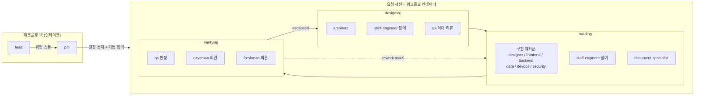
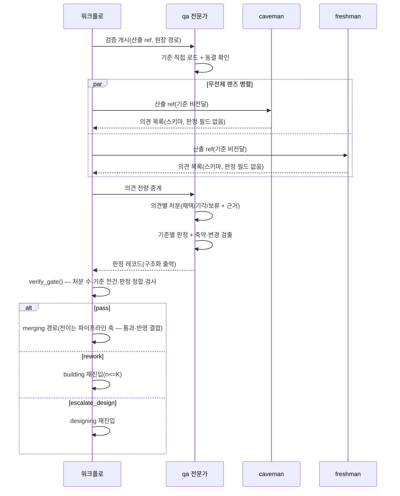
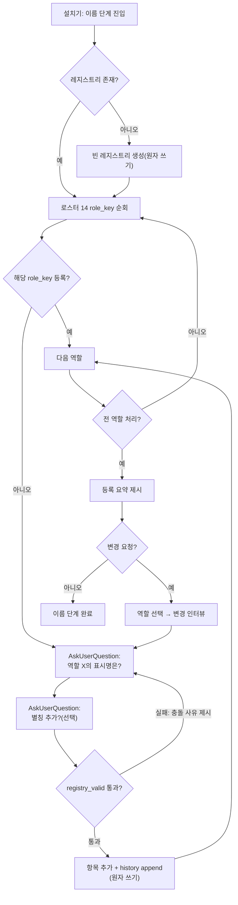
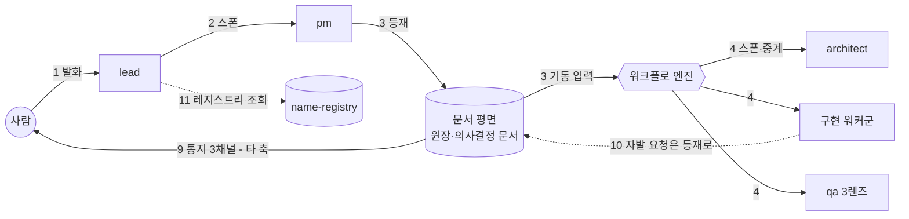
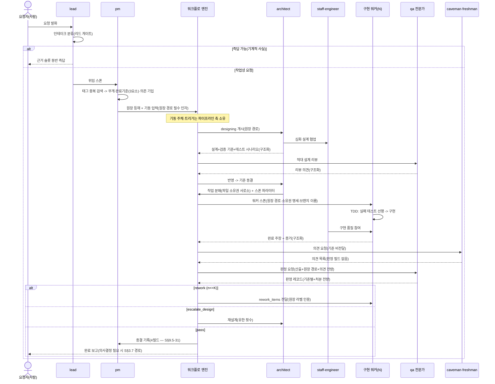

## 요약

**확정** — 아래가 본 축이 소유 정본으로 확정한 것이다. 계약 전문(필드 표·판정식·문법·전이표)은 각 계약 소절의 블록에 있고 이 절은 결론만 담는다.


- **범위**: S§6 전체 — 14 역할 로스터의 에이전트 정의 사양, qa 3렌즈 운용 절차, 이름 레지스트리와 설치 질문 흐름, 통신 평면 판정, 역할→스킬 매핑과 준수 측정, 리드·pm·architect·staff engineer 경계.
- **핵심 결정 5건**:
  1. 에이전트 정의는 전건 **플랫폼 네이티브 서브에이전트 정의 파일**(`.claude/agents/<role_key>.md`)로 구현한다 — 커스텀 로더 불요(S§2-6).
  2. **형제 에이전트 간 상시 직접 통신 경로는 불요로 판정**한다(S§6.2). 필요한 경로는 스폰 2경로(리드→pm, 워크플로→단계 에이전트)와 문서 매개 2경로(원장 등재, 의사결정 문서)뿐이며, 표시명 해석기는 만들지 않는다.
  3. caveman·freshman의 산출 스키마에는 **판정 필드 자체가 없다** — "의견 제시일 뿐 판정하지 않는다"(S§2-10)를 산문 규율이 아니라 스키마 구조로 강제한다.
  4. 이름 레지스트리는 **단일 라이터·원자 쓰기·append-only 이력**의 단일 파일이며 설치 필수물이다(S§6.2). 문서 표기 대조의 정본이 된다.
  5. 스킬 준수 측정은 **호출 형식이 아니라 산출 증거 기준**으로 하고(S§6.3), 측정 결과의 소비처(자기 개선 루프 — S§5.5)를 계약으로 동반한다.
- **타 축 위임**: 상태기계 전이·재작업 상한 K·기동 스키마 = 파이프라인 축(S§5). 문서 스키마·착지 게이트 집행 = 문서 축(S§3). 통지 3채널 = 의사결정 문서 축(S§3.7). 감사 이벤트 스키마 = 감사 축(S§7). 설치 트랜잭션 = 설치 축(S§8). 본 문서는 각 접점에 **계약(필드·enum)** 만 제공한다.

**실측 대기** — 6건. 정본은 C§12, 전수 색인은 부속 PA. 플랫폼 기능의 존부·의미를 단정하지 않았다 — 각 항목에 의존하는 구현은 실측 결과 기록 없이 착수하지 않는다.

**미결** — 본 축의 미결 절 정본은 C§13이며, 재생성본 전체의 미결·이력 정본은 부속 PB다.

## 1. 범위와 소유 경계 — 타 축 접점

| 접점 | 이 축(C)이 소유 | 상대 축이 소유 | 계약 기준 |
|---|---|---|---|
| 워크플로 단계 배선 | 어느 역할이 어느 단계에 투입되는가, 각 역할의 출력 스키마 | 상태 enum·전이 규칙·K 상한·기동 스키마 | S§5.1~5.2 |
| 문서 착지 | 표시명·역할 키 표기 계약, 레지스트리 정본 | 착지 게이트 집행·문서 스키마 전문 | S§3.5 |
| 스케줄링 | pm의 입력 필드 기입 책무 정의 | 판정식·에이징·선점 규칙 | S§5.6 |
| HITL 통지 | 어느 역할이 언제 의사결정 문서를 생성하는가 | 문서 스키마·3채널 발송 수단 | S§3.7 |
| 감사 | 레코드에 실릴 역할 신원 필드(role_key·표시명) | 이벤트 스키마·수집 경로·보존 계약 | S§7 |
| 설치 | 레지스트리 스키마·이름 질문 흐름·에이전트 멱등 규칙 | 백업→초기화→설치 트랜잭션 | S§8, S§6.4 |

---

## 2. 조직 개관 — 14 역할과 투입 단계

### 2.1 역할 키(role_key) 정본

`lead` · `pm` · `architect` · `staff-engineer` · `designer` · `frontend-developer` · `backend-developer` · `data-engineer` · `devops-engineer` · `security-engineer` · `qa` · `caveman` · `freshman` · `document-specialist`

- role_key는 에이전트 정의 파일명이자 워크플로 배선·감사 레코드의 신원 키다. **불변**이며 표시명과 독립이다(S§6.2).
- [장치 — role_key는 설치기가 고정 배치하고, 감사 레코드의 신원 필드는 세션 생성 시점에 훅(`SessionStart`)이 자동 주입한다(S§7). 사람·에이전트가 손으로 쓰는 경로가 없다 | —]

### 2.2 단계·역할 투입 매트릭스

상태 enum은 파이프라인 축 소유 — 정본은 B§1.1의 11종 진행형이다(원소 열거는 정본에만 두고 본 축은 재기술하지 않는다. 초안이 인용한 S§5.2 초안 어휘는 폐기 — PB). 여기서는 역할 투입이 있는 단계만 열로 든다 — `queued`·`merging`은 스케줄러·실행 엔진 점유 단계라 역할 투입이 없다.

| role_key | received | analyzed | designing | building | verifying | 비고 |
|---|---|---|---|---|---|---|
| lead | **주담당**(인테이크) | – | – | – | – | 워크플로 밖. 리드 게이트 적용(S§5.4) |
| pm | 위임 수신 | **주담당**(분석·등재) | – | – | – | 이후 큐 입력 필드 상시 관리(S§5.6) |
| architect | – | – | **주담당**(설계 확정) | 질의 응답·에스컬레이션 수신 | – | escalated 시 재설계 주담당 |
| staff-engineer | – | – | 참여(심화 설계) | 참여(품질) | **배제**(S§5.3) | |
| designer | – | – | 참여(화면 요건 시) | 담당(화면·시각 산출) | – | |
| frontend-developer | – | – | – | 담당 | – | TDD 필수 |
| backend-developer | – | – | – | 담당 | – | TDD 필수 |
| data-engineer | – | – | – | 담당 | – | TDD 필수 |
| devops-engineer | – | – | – | 담당 | – | TDD 필수(검증 가능 산출에 한함 — C§9.2) |
| security-engineer | – | – | 참여(위협 관점) | 담당 | 증거 산출 지원(판정 아님) | |
| qa | – | – | **적대 설계 리뷰**(S§5.3) | – | **주담당**(판정) | 반려의 유일 주체 |
| caveman | – | – | – | – | 의견 제시만 | 투입은 검증 한정(S§2-10) |
| freshman | – | – | – | – | 의견 제시만 | 투입은 검증 한정(S§2-10) |
| document-specialist | – | 지원 | 지원 | 담당(문서 산출물) | – | 자기 산출은 qa 검증 대상 |

- [장치 — 투입 매트릭스는 워크플로 정의(단계별 스폰 대상)에 코드로 배선된다. 매트릭스 밖 단계에서 그 역할이 호출될 경로 자체가 없다(S§4.1 결정론적 오케스트레이션) | —]
- caveman·freshman의 "검증 단계 한정"은 워크플로 배선으로만 강제되고, 시스템 프롬프트에도 명문화한다(이중화가 아니라, 폴백 유사 워크플로(S§4.2)에서도 같은 제약이 성립해야 하기 때문).



---

## 3. 에이전트 정의 파일 사양 (전 역할 공통)

### 3.1 네이티브 우선 판정

| 요구 | 네이티브로 되는가 | 판정 |
|---|---|---|
| 역할별 시스템 프롬프트·설명 | 서브에이전트 정의 파일(`.claude/agents/*.md`) 본문 | **네이티브 채택** |
| 도구 권한 제한 | 정의 frontmatter의 도구 목록 필드 | **네이티브 채택** — 정확한 필드명·도구 표면은 **설치 전 실측 항목** |
| 모델 티어 지정 | 정의 frontmatter의 모델 필드 | **네이티브 채택** — 허용 값 목록은 **설치 전 실측 항목** |
| 필수 스킬 내장 | 시스템 프롬프트 본문에 스킬 사용 절차 명문화(S§6.3) + 스킬 자산은 네이티브 스킬 디렉토리 | **네이티브 채택** |
| 구조화 출력 강제 | 워크플로 출력 스키마(S§4.1-④) | **네이티브 채택** |
| 커스텀 로더·상주 프로세스 | — | **불채택** — 필요 근거 없음(S§2-6) |

### 3.2 배치 트리 [계약]

```
<실행 루트>/
  .claude/
    agents/
      lead.md
      pm.md
      architect.md
      staff-engineer.md
      designer.md
      frontend-developer.md
      backend-developer.md
      data-engineer.md
      devops-engineer.md
      security-engineer.md
      qa.md
      caveman.md
      freshman.md
      document-specialist.md
    skills/
      <skill_id>/SKILL.md        # C§9 매핑 표의 skill_id별 1디렉토리
  config/                        # 로컬 정책 루트(경로 정본: E§1.1)
    names/name-registry.yaml     # C§7 이름 레지스트리(정본 — 파일명은 본 축 C§7.2, PB)
    model-tiers.yaml             # 티어→실모델ID 매핑(로컬 정책 — S§8 엔진 청결)
```

- 실모델 ID·개인값은 정의 파일이 아니라 로컬 정책 파일에 둔다. [장치 — 설치기 패키징 게이트가 정의 파일 내 리터럴 모델 ID·개인값을 검출하면 빌드 거부(설치 축 소유, S§8) | —]

### 3.3 정의 파일 필드 표 [계약]

| 필드 | 타입 | 필수 | 기입 주체 | 비고 |
|---|---|---|---|---|
| name | string(=role_key) | 필수 | 설치기 | 불변. 파일명과 일치 |
| description | string | 필수 | 설치기(템플릿) | 스폰 라우팅용 역할 요약 |
| 도구 목록 | string list | 필수 | 설치기(C§10 경계표에서 파생) | 능력 제거의 1차 장치(S§3.4 서열 ①) |
| 모델 | tier enum 참조 | 필수 | 설치기(C§4 티어표) | 실값은 `model-tiers.yaml` 경유 |
| 본문: 책무 절 | markdown | 필수 | 설치기(템플릿) | |
| 본문: 필수 스킬 절 | markdown | 필수 | 설치기(C§9 매핑 표에서 파생) | 산문 지시가 아니라 정의 내장(S§6.3) |
| 본문: 금지 절 | markdown | 필수 | 설치기(C§10 경계표에서 파생) | "하지 않는 것" 열거 |
| 본문: 출력 계약 절 | markdown | 필수 | 설치기 | 단계 출력 스키마 참조 |

- [장치 — 필드 완결성은 설치기의 배치 검증(S§8: 실설치 기동 검증)이 확인한다. 정의 파일은 손 편집 가능하나, 재설치 멱등 규칙(S§6.4)에 따라 이미 존재하는 정의는 덮어쓰지 않는다 | —]

---

## 4. 모델 티어 체계

### 4.1 티어 enum

`MT-A`(최상위 추론) · `MT-B`(표준) · `MT-C`(경량 — 초기 로스터 배정 없음, 예약)

- 티어→실모델 매핑은 `model-tiers.yaml`(로컬 정책)에만 둔다.
- **하향 금지 경계**: 토큰 절감을 이유로 한 티어 하향·사고 깊이 축소는 금지다(S§11-18). 운용 중 조정은 상향만 재량이고, 하향은 품질 실측 근거가 있는 설계 변경으로만 한다.
- [장치 — 티어 배정은 정의 파일 필드로 고정되어 세션마다 재론되지 않는다(S§2-11 "했던 말 반복 금지"의 적용). 하향 변경 검출: 정책 파일 변경은 자동 커밋 대상이라 이력이 남는다 | 장치 불가 — "하향의 사유가 토큰 절감인가"는 의도 판정이라 기계 판정 불가(S§9.4-19). 변경 커밋에 사유 기록을 요구하는 작성 규율로만 막는다]

### 4.2 역할별 배정과 근거

| role_key | 티어 | 근거 |
|---|---|---|
| lead | MT-A | 즉문즉답 경로가 다중 검증 밖(S§2-7) — 오답 1건의 비용이 구조적으로 최대. 응답 클래스 분류·근거 슬롯 판단 자체가 고난도 |
| pm | MT-A | 완료기준·무게·의존 필드가 전 파이프라인의 정본 입력(S§5.6-①) — 필드 오기입의 폭발 반경이 큼 |
| architect | MT-A | 설계 해상도가 TDD 성립의 전제(S§5.1) — 설계가 성기면 하류 전원이 막힘 |
| staff-engineer | MT-A | 전 구간 품질 견인이 존재 이유(S§6.1) — 표준 티어면 역할 자체가 무의미 |
| qa | MT-A | 반려의 유일 주체 + 기준 축약·변경 검출(S§5.3) + 3렌즈 의견 판단(S§2-10) — 판정 품질이 파이프라인 신뢰의 바닥 |
| designer | MT-B | 설계·기준이 선행 제공된 상태의 산출 역할. 화면 판정은 qa·실렌더 확인이 담당 |
| frontend-developer | MT-B | 고해상도 설계+테스트 시나리오가 입력으로 주어짐(S§5.1) — 실행 중심 |
| backend-developer | MT-B | 상동 |
| data-engineer | MT-B | 상동 |
| devops-engineer | MT-B | 상동 |
| security-engineer | MT-B | 상동. 단 위협 모델링 참여가 잦으면 MT-A 상향 후보(운용 실측) |
| qa 외 렌즈: caveman | MT-B | 가치는 렌즈(관점)이지 추론 깊이가 아님(S§6.1). 다만 MT-C는 의견의 근거 서술이 부실해질 위험 — 초기 MT-B, 실측 후 조정 |
| freshman | MT-B | 상동 |
| document-specialist | MT-B | 템플릿·도구 기반 산출 중심. 문서 품질 판정은 qa 경유 |

- 배정표는 초기 제안값이며, 조정은 C§4.1의 경계 안에서 정책 파일 변경으로 한다.

---

## 5. 시스템 프롬프트 골격

전문 작성은 구현 단계 몫이다. 여기서는 **전 역할 공통 골격**과 **역할별 고유 항목**을 규율 단위로 열거한다. 모든 항목에 S§2-11 슬롯을 단다.

### 5.1 공통 골격 (14 역할 전건 포함)

1. **정본 우선** — 완료기준·요청 내용은 프롬프트 요약이 아니라 원장 문서를 직접 읽고 따른다. 어긋나면 불일치를 이벤트로 보고하고 정본을 따른다(S§5.3).
   [장치 — 워크플로 기동 스키마가 원장 경로를 필수 인자로 요구(S§5.1, 파이프라인 축), 스폰 파라미터에 원장 경로 전달 | —]
2. **판정·완료 주장은 구조화 채널로만** — 산출 텍스트 속 판정 문구는 무효(S§5.3, S§9.2-9).
   [장치 — 워크플로 출력 스키마(네이티브)가 유일한 판정 채널. 산문 채널에는 판정을 실을 자리가 없다 | —]
3. **3항 서술** — 보고는 측정한 것 / 허용하는 결론 / 허용하지 않는 결론으로 분리(S§5.4-⑤, S§9.2-12).
   [장치 불가 — 서술 내용의 참·거짓은 세계 지식·재측정 필요(S§9.4-19). 완화: 출력 스키마에 3항 필드를 두어 형식은 강제하고, 내용은 qa 검증 관점에 포함]
4. **수치·인과는 측정 절차 동반** — 재보지 않은 값은 "미검증 추정"으로 표기(S§9.2-11).
   [장치 불가 — 동일 근거(S§9.4-19). 완화: 수치는 사람이 세지 않고 도구가 산출하게 하는 절차를 스킬로 제공]
5. **문서 착지는 규약 경로로만** — 메타데이터 7요소·요약 필수, 머신·세션·시각은 자동 주입분을 건드리지 않는다(S§3.5).
   [장치 — 착지 게이트가 거부(문서 축 소유). 자동 주입은 훅(`SessionStart`·쓰기 경로) 담당 | —]
6. **자발 요청은 등재로** — 작업 중 발견한 새 일은 직접 착수하지 않고 원장 등재 경로로 생성한다(S§5.6).
   [장치 — 미등재 실행은 기동 스키마 차원에서 불가능(S§5.1) | —]
7. **표시명 표기** — 문서·대화 출력의 신원 표기는 레지스트리의 표시명만 쓴다(S§3.5, S§6.2).
   [장치 — 착지 게이트의 레지스트리 대조(C§7.4) | —]
8. **아부 금지·증거 강도에 말 강도 일치**(S§9.4-20).
   [장치 불가 — 문체 축은 기계 판정 불가(S§9.4-19·20). 완화: 정의 명문화 + qa의 검증 관점 포함]
9. **못 하는 것은 명시** — 자기 산출의 한계·미검증 지점을 문서에 적는다(S§9.4-21).
   [장치 불가 — 상동. 완화: 출력 스키마에 "허용하지 않는 결론" 필드(3항 서술과 공유)]

### 5.2 역할별 고유 골격

각 역할 절은 [책무 / 고유 규율 / 하지 않는 것] 순. 필수 스킬은 C§9 매핑 표가 정본이고 정의 파일에는 그 표에서 파생 기입한다.

#### lead
- 책무: 인테이크 분류(즉답/작업/상시규칙/설계입력/결정 — S§9.5-26), 라우팅, 포인터 제공, pm 위임.
- 고유 규율:
  - 응답 클래스를 분류하고, 판정 필요 클래스(수치·인과·완료 선언·규모 주장)는 단정하지 않고 검증 경로를 먼저 태운다(S§5.4-①).
    [장치 — 리드 게이트(리드 게이트 축 T3 소유). C는 역할 정의에 분류 절차를 내장 | —]
  - 단정 문장에는 근거 슬롯(측정 명령·문서 참조·실측 출력)을 동반한다(S§5.4-②).
    [장치 — 착지 게이트의 근거 슬롯 검사(T3 소유) | —]
  - 자기 선행 발화를 뒤집을 때 새 외부 증거를 명시한다(S§5.4-③).
    [장치 불가 — "새 증거인가"의 판정은 세계 지식 필요(S§9.4-19). 완화: 번복 감지 시 프로세스 실패 자동 기록(T3의 구조 필드)]
- 하지 않는 것: 코드 수정 · 내용 분석·판정 · 원장 등재 · 워커 스폰 · 스케줄링 · 종결 전이. (C§10 경계표)
  [장치 — 정의 파일 도구 목록에서 쓰기·실행 도구 제외(능력 제거 — S§3.4 서열 ①, S§11-20). 스폰은 pm 위임 1경로만 | —]

#### pm
- 책무: 요청 분석 · 무게 판정 · 완료기준 작성(원장 본문) · **태그 검색 중복 검사(의무 — S§3.6)** · 분해 · 원장 등재 · 스케줄링 입력 필드(우선순위·중요도·의존) 기입(S§5.6-①) · 종결 기록.
- 고유 규율:
  - 등재 전 태그 검색으로 기존 기능·기결 사항을 확인하고 그 결과를 분석 문서 필드로 남긴다.
    [장치 — 분석 문서 스키마의 중복 검사 필드 필수 + 착지 게이트 거부(C§9.3) | —]
  - 스케줄 결정은 기계 판정식이 하고 pm은 입력 필드만 기입한다(S§5.6-①).
    [장치 — 판정식은 결정론 코드(파이프라인 축). pm 출력 스키마에 판정 결과 필드가 없음 | —]
  - 완료기준은 3요소(충족 정의+확인 방법+통과 수치)로 쓴다(S§5.1).
    [장치 — 원장 스키마의 기준 항목 구조 필드(문서 축) + 착지 게이트 | —]
- 하지 않는 것: 설계 · 구현 · 검증 판정 · 판정식 결과의 수동 번복(사람 오버라이드는 요청자 몫 — S§5.6-③).

#### architect
- 책무: 심화 설계(staff-engineer 참여) · 검증 기준 확정(기계 판정 가능형+테스트 시나리오 — S§5.1) · 작업 분해(파일 소유권 서로소 1순위 — S§5.1, S§9.6-34) · 워커 스폰 · 설계 에스컬레이션 수신·재설계.
- 고유 규율:
  - 검증 기준은 산출물을 보기 전에 동결한다(S§9.2-8).
    [장치 — 워크플로 단계 순서: 기준 착지가 building 개시의 선행 조건(파이프라인 축 배선) | —]
  - 스폰 입력은 파라미터로만: 원장 경로·브랜치 이름. 해시 리터럴·기준 재기술 금지(S§5.1).
    [장치 — 스폰 훅(`PreToolUse`, 스폰 도구 매처)의 파라미터 린트(파이프라인 축) | —]
  - 적대 설계 리뷰(qa)를 통과해야 설계 확정(S§5.3). 정정은 "새 근거 명시 + 변하지 않은 부분 선언" 형식.
    [장치 — 워크플로 단계 배선(리뷰 출력 수신 전 building 불가) | 장치 불가 — 정정 형식의 실질은 문체 축, 리뷰어 검증 관점으로 완화]
- 하지 않는 것: 구현 코드 직접 작성 · 검증 판정 · 종결 전이 · 원장 등재.

#### staff-engineer
- 책무: 설계 심화 참여(해상도·테스트 시나리오) · 구현 전 구간 품질 참여 · 난제 직접 해결.
- 고유 규율:
  - **검증 단계 불참**(S§5.3 — 전 구간에 손댄 자가 판정하면 자기 검증).
    [장치 — 워크플로 verifying 단계의 스폰 대상에서 제외(배선) + 정의 금지 절 | —]
  - 설계 확정권은 architect에 있다 — staff의 설계 의견은 입력이지 확정이 아니다.
    [장치 — 설계 문서의 작성자 필드는 architect, 확정 출력은 architect 스키마만(워크플로 배선) | —]
- 하지 않는 것: 검증 판정 · 설계 단독 확정 · 워커 스폰.

#### designer
- 책무: 화면·시각 디자인 산출(첫 요청이 대시보드 — S§6.1) · 화면 요건 있는 설계 참여.
- 고유 규율: 화면 산출물은 자동 판정만으로 완료 주장하지 않는다 — 실렌더 확인 증거를 동반한다(S§5.3).
  [장치 — 검증 단계의 실렌더 육안 확인 스텝(워크플로 배선, HITL 접점은 의사결정 문서 축) | —]
- 하지 않는 것: 판정 · 백엔드 구현.

#### frontend-developer / backend-developer / data-engineer / devops-engineer / security-engineer (구현 워커 공통)
- 책무: 배정된 소유 파일 범위의 구현 · TDD 수행 · 완료 주장+증거 산출.
- 고유 규율:
  - **TDD 강제**: 설계의 테스트 시나리오 → 실패하는 테스트 선행 → 구현(S§5.1). 증거는 C§9.3 스키마.
    [장치 — 개발 문서의 TDD 증거 필드 필수 + 착지 게이트 거부 + 배치 감사의 시간순 검증(C§9.3) | —]
  - 소유 파일 밖 수정 금지 — 공유 파일은 워크트리 격리 경로로만(S§5.1, S§9.6-34).
    [장치 — 작업 분해 산출물의 소유권 명세를 스폰 파라미터로 수신. 위반 검출은 커밋 diff 대 소유권 명세 대조(감사 배치 — 감사 축 접점). 실시간 차단은 과차단 위험(S§9.3-15)으로 관측형 시작, 승격 조건: 위반 실측 N회(수치는 파이프라인 축 K와 함께 고정) | —]
  - 완료 주장 시 기준의 축약·변경이 있으면 반드시 고지(S§5.3).
    [장치 불가 — 미고지 축약의 검출은 기준 대 산출 의미 대조가 필요(S§9.4-19). 완화: qa 검증 범위에 '축약·변경 검출' 명시 항목(C§6.3 판정 레코드)]
- security-engineer 추가 책무: 위협 관점 설계 참여 · 시크릿 스캔 증거 산출(판정은 qa).
- 하지 않는 것: 자기 산출 판정 · 종결 전이 · 검증 기준 변경.

#### qa (전문가)
- 책무: 적대 설계 리뷰(designing) · 검증 판정(verifying) · caveman/freshman 의견의 처분 판단 · 반려.
- 고유 규율: C§6 전체(3렌즈 절차). 추가:
  - 기준을 엄격하게만 조정 가능, 느슨화·임의 대체는 방식 부적합 반려(S§9.2-8).
    [장치 — 판정 레코드가 기준 항목 ID를 참조하게 강제(스키마): 기준에 없는 항목으로의 통과 판정은 스키마 위반 | 장치 불가 — "확인 방법을 실질 동일하게 수행했는가"는 재측정 필요. 완화: 판정 레코드에 측정 명령·출력 앵커 필수]
  - 자기가 만든 것은 판정하지 않는다(S§5.3). qa의 설계 리뷰는 저작이 아니므로 구현 판정 독립성을 훼손하지 않는다 — 단 qa가 산출물 자체를 만든 요청(예: 검증 도구 개발)에서는 판정을 별도 qa 인스턴스로 스폰한다.
    [장치 — 워크플로 배선: 판정 대상 산출물의 작성자 필드 == qa이면 별도 인스턴스 스폰 분기 | —]
- 하지 않는 것: 구현 · 설계 확정 · 기준 느슨화.

#### caveman / freshman
- 책무: 검증 단계에서 무전제 관점 의견 제시. caveman = 지식 0의 사용자 관점(설명 없이 쓸 수 있는가, 문서가 자명한가). freshman = 관례를 모르는 초심자 관점(온보딩 가능한가)(S§6.1).
- 고유 규율:
  - **판정하지 않는다** — 산출 스키마에 판정 필드가 없다(C§6.2).
    [장치 — 워크플로 출력 스키마 구조(판정 필드 부재) — 위반이 표현 불가능 | —]
  - 의견은 관찰·재현 힌트 동반 — "느낌"만의 의견은 스키마 필수 필드 미충족.
    [장치 — 의견 스키마의 observation.where(앵커) 필수 필드 | —]
- 하지 않는 것: 판정 · 반려 · 산출물 수정 · 검증 외 단계 참여.

#### document-specialist
- 책무: 하네스 자신의 문서와 외부 프로젝트 산출물의 작성 품질(S§6.1) · 시각화(텍스트 다이어그램) 포함(S§3.9).
- 고유 규율: 산출 문서는 내용에 맞는 시각화를 동반한다(S§3.9).
  [장치 — 문서 유형별 다이어그램 필수 여부는 문서 축 스키마 소유. C는 역할 정의에 절차 내장 | —]
- 하지 않는 것: 요청 분석(pm 소관) · 화면 디자인(designer 소관) · 판정.

---

## 6. qa 3렌즈 운용 절차

### 6.1 워크플로 배선 (verifying 단계 내부)

1. **개시**: 워크플로가 qa에 산출물 참조 + 원장 경로(검증 기준)를 파라미터로 전달. qa는 기준을 원장에서 직접 읽고(S§5.3) 동결 상태를 확인한다(기준 착지 커밋이 building 개시보다 선행 — S§9.2-8).
2. **무전제 렌즈 병렬 스폰**: 워크플로가 caveman·freshman을 병렬 스폰(같은 산출물 참조 전달, 검증 기준은 전달하지 않는다 — 무전제 관점 보존을 위해 기준 문서를 입력에서 제외한다).
3. **의견 수집**: 두 렌즈가 의견 스키마(C§6.2)로 반환. 워크플로가 전량을 qa에 중계.
4. **처분 판단**: qa가 의견 1건마다 처분 레코드(C§6.3)를 남긴다. 전량 처분이 판정 제출의 선행 조건.
5. **판정**: qa가 기준 항목별 판정 + 축약·변경 검출 + 처분 레코드 전량을 담은 판정 레코드(C§6.3)를 구조화 출력으로 제출.
6. **전이**: 워크플로가 판정 레코드로 상태 전이(통과/rework/escalated — 전이 규칙은 파이프라인 축).

- 2에서 기준 미전달 근거: 렌즈의 존재 이유가 "전문가 기준이 놓치는 것"이므로 기준 자체가 입력이면 렌즈가 오염된다. 단 산출물이 참조하는 공개 문서는 접근 허용.
- [장치 — 절차 전체가 워크플로 단계 코드로 배선(S§4.1-①). 폴백 환경에서는 동일 상태기계의 세션 내 루프로 등가 구현(S§4.2) | —]

### 6.2 의견 스키마 (caveman·freshman 출력 — 워크플로 스키마 강제) [계약]

| 필드 | 타입 | 필수 | 기입 주체 | 비고 |
|---|---|---|---|---|
| lens | enum: `caveman` \| `freshman` | 필수 | 자동(역할 고정) | 위조 불가 — 워크플로가 스폰 신원에서 주입 |
| target_ref | string(산출물 ID/경로) | 필수 | 자동(파라미터 반사) | |
| opinions[] | list | 필수(빈 목록 허용) | 렌즈 | "의견 없음"은 빈 목록으로 명시 |
| opinions[].observation | string | 필수 | 렌즈 | 무엇을 보았나(사실 서술) |
| opinions[].where | string(파일·절·화면 앵커) | 필수 | 렌즈 | 줄 번호 아닌 앵커(S§9.1-4) |
| opinions[].expectation_gap | string | 필수 | 렌즈 | 무엇을 기대했고 무엇이 달랐나 |
| opinions[].repro_hint | string | 선택 | 렌즈 | 재현 절차 힌트 |
| opinions[].question | string | 선택 | 렌즈 | 판단 요청 형태의 질문 |

- **판정·심각도 필드는 존재하지 않는다.** 심각도 추정조차 두지 않는다 — 판정 인접 필드는 렌즈의 지위(의견 제시 — S§2-10)를 침식한다.
- [장치 — 스키마에 필드가 없으므로 판정 표현이 구조적으로 불가능(S§4.1-④) | —]

### 6.3 qa 판정 레코드 스키마 (워크플로 스키마 강제) [계약]

| 필드 | 타입 | 필수 | 비고 |
|---|---|---|---|
| target_ref | string | 필수 | |
| criteria_source | string(원장 경로+기준 절 앵커) | 필수 | 직접 읽기 증명(S§5.3) |
| criteria_frozen | bool | 필수 | 기준 동결 확인 결과 |
| per_criterion[] | list | 필수 | 기준 항목 전건 — 누락 시 스키마 위반 |
| per_criterion[].criterion_id | string | 필수 | 원장 기준 항목 참조 |
| per_criterion[].met | bool | 필수 | |
| per_criterion[].evidence | {command, output_excerpt, anchor} | 필수 | 측정 계약(S§9.2-11) |
| abbreviation_check | enum: `none_found` \| `found` | 필수 | 기준 축약·변경 검출(S§5.3) |
| abbreviation_detail | string | found 시 필수 | |
| opinion_dispositions[] | list | 필수 | 수신 의견 전건 |
| opinion_dispositions[].opinion_ref | string | 필수 | |
| opinion_dispositions[].disposition | enum: `adopted` \| `rejected` \| `deferred` | 필수 | |
| opinion_dispositions[].rationale | string | 필수 | 기각에도 근거 필수 |
| opinion_dispositions[].mapped_criterion | string \| null | adopted 시 필수 | 기존 기준 위반 귀속 또는 |
| opinion_dispositions[].new_defect | bool | adopted 시 필수 | 기준 밖 신규 결함 등재 여부 |
| verdict | enum: `pass` \| `rework` \| `escalate_design` | 필수 | 전이 입력(전이 규칙은 파이프라인 축 — `escalate_design`은 축 B 전이 10의 결함 클래스=설계 판정에 대응, PB) |
| rework_items[] | list | rework 시 필수 | 원장 기준 라벨 그대로 인용 |

- `deferred`는 방치가 아니다: 보류 의견은 자동으로 백로그 등재 경로(S§9.5-30 — 2트랙 인테이크)를 탄다.
  [장치 — 워크플로 종료 훅이 deferred 건을 등재 경로로 회부(감사/파이프라인 축 접점). 게이트: `len(opinion_dispositions) == len(수신 의견)` 아니면 단계 종료 불가 — 탐지-무소비 루프 차단(S§10-3) | —]
- 판정식 의사코드(워크플로 전이 게이트):

```
def verify_gate(record, criteria, opinions):
    assert record.criteria_frozen                         # 동결 미확인 → 판정 무효
    assert {c.id for c in criteria} == {p.criterion_id for p in record.per_criterion}
    assert len(record.opinion_dispositions) == len(opinions)
    for d in record.opinion_dispositions:
        assert d.rationale != ""
        if d.disposition == "adopted":
            assert d.mapped_criterion is not None or d.new_defect
    if all(p.met for p in record.per_criterion) and record.abbreviation_check == "none_found":
        allowed = {"pass"}
    else:
        allowed = {"rework", "escalate_design"}
    assert record.verdict in allowed                      # 판정-근거 불일치 차단
    return record.verdict
```

### 6.4 시퀀스



---

## 7. 이름 레지스트리

### 7.1 원칙

- 역할과 이름은 별개. **별칭은 여럿, 표시명은 단 하나**(S§6.2). 레지스트리가 정본이며 **설치 필수물** — 부재 시 설치가 완료 상태가 아니다.
- 기본 이름의 구성(작명 규칙)은 설계 범위 밖 — 전부 사용자에게 질문한다(S§2-13).

### 7.2 파일 스키마 (`name-registry.yaml` — 단일 파일·단일 라이터) [계약]

| 필드 | 타입 | 필수 | 기입 주체 |
|---|---|---|---|
| schema_version | int | 필수 | 설치기 |
| updated | timestamp | 필수 | 자동(쓰기 시) |
| agents[] | list | 필수 | — |
| agents[].role_key | string(C§2.1 enum) | 필수 | 설치기(불변) |
| agents[].display_name | string | 필수 | 사용자(AskUserQuestion) |
| agents[].aliases | string list | 선택 | 사용자 |
| agents[].created | timestamp | 필수 | 자동 |
| agents[].updated | timestamp | 필수 | 자동 |
| history[] | list(append-only) | 필수(빈 목록 허용) | 자동 |
| history[].ts | timestamp | 필수 | 자동 |
| history[].role_key | string | 필수 | 자동 |
| history[].field | enum: `display_name` \| `aliases` | 필수 | 자동 |
| history[].old / new | string | 필수 | 자동 |
| history[].actor | enum: `installer` \| `change-interview` | 필수 | 자동 |

- 유일성 불변식: ① role_key 유일 ② display_name 전역 유일 ③ alias는 어떤 display_name·role_key·타 alias와도 충돌 금지.
- 판정 의사코드:

```
def registry_valid(reg):
    keys = [a.role_key for a in reg.agents]
    names = [a.display_name for a in reg.agents]
    aliases = [al for a in reg.agents for al in a.aliases]
    assert len(keys) == len(set(keys))
    assert len(names) == len(set(names))
    pool = set(keys) | set(names)
    for al in aliases:
        assert al not in pool and aliases.count(al) == 1
    return True
```

- [장치 — 쓰기는 설치기·변경 인터뷰의 단일 라이터 경로만. 원자 쓰기(임시 파일+rename — S§3.8) 후 `registry_valid` 통과 못 하면 rename 하지 않는다(착지 거부). history는 append-only | —]
- 표시명 변경 시 **과거 문서는 소급 수정하지 않는다** — 문서의 표시명은 작성 시점 값이고, history가 시점 매핑을 제공한다.
  [장치 — 과거 문서 불변·이동 흔적 규칙은 문서 축 소유(S§3.8 무오염). C는 해석 규칙만 정의 | —]

### 7.3 설치 시 질문 흐름

- 질문 수단은 대화형 질문 도구(AskUserQuestion)로 확정(S§2-13). **자유 입력(이름 직접 타이핑) 지원 여부는 설치 전 실측 항목** — 미지원 시의 폴백(후보 없이 입력을 받는 별도 프롬프트 단계)은 설치 축과 공동 설계.
- 멱등: 이미 등록된 role_key는 건너뛴다(S§6.4와 동형). 재실행 = 변경 인터뷰(S§8-설치 인터뷰).



### 7.4 문서 표기 대조 계약 (문서 축에 제공)

- 착지 게이트는 문서의 작성자·참여자·담당 필드 값을 레지스트리 `display_name` 집합과 대조한다. role_key 단독 표기·미등록 이름은 착지 거부(S§3.5 — 손 표기 위반은 스키마 강제만이 막는다).
- [장치 — 착지 게이트(문서 축 집행, 레지스트리는 C 소유 정본). 게이트는 경고가 아니라 거부(S§3.5) | —]

---

## 8. 통신 평면 판정

S§6.2의 요구대로 "해석기를 만들기 전에 필요한지부터 판정"한다.

### 8.1 판정표

| # | 경로 후보 | 필요 판정 | 근거 | 채택 수단 |
|---|---|---|---|---|
| 1 | 사람 → lead | 필요 | 파이프라인 입구(S§5.1-1) | 세션 대화(네이티브) |
| 2 | lead → pm | 필요 | 인테이크 위임 — 워크플로 밖 | 네이티브 서브에이전트 스폰(부모→자식) |
| 3 | pm → 요청 세션 기동 | 필요(문서 매개) | S§5.1-3 | 원장 등재 + 기동 입력(기동 주체·트리거는 파이프라인 축) |
| 4 | 워크플로 → 단계 에이전트 | 필요 | S§4.1 | 워크플로 스폰 + 파라미터 전달(네이티브) |
| 5 | 워커 → qa (산출 전달) | **불요(직접)** | 워크플로가 단계 산출을 중계(S§4.1-②) | 단계 출력 중계 |
| 6 | qa → 워커 (재작업 지시) | **불요(직접)** | rework 전이가 지시를 대체(S§5.2) | 워크플로 루프 + 판정 레코드의 rework_items |
| 7 | qa → architect (에스컬레이션) | **불요(직접)** | escalated 분기(S§5.2) | 워크플로 분기 |
| 8 | 워커 ↔ 워커 (형제) | **불요** | 파일 소유권 서로소 분해(S§5.1)로 조율 대상 자체를 제거 | 경로를 만들지 않는다 |
| 9 | 에이전트 → 사람 | **불요(직접)** | 의사결정 문서 + 3채널 통지(S§3.7) | 문서 평면(의사결정 문서 축 소유) |
| 10 | 에이전트 → 큐 (자발 요청) | 필요(문서 매개) | 1급 유입 경로(S§5.6) | 원장 등재 경로 |
| 11 | 사람이 별칭으로 특정 에이전트 지목 | 필요(해석만) | 별칭 허용(S§6.2) | lead가 레지스트리를 읽어 role_key로 해석 — 해석기 프로그램 불요 |

### 8.2 판정 결론

- **형제 간 직접 통신 채널·표시명 해석기·메시징 인프라는 만들지 않는다.** 워크플로 중계 구조가 C§6.2의 예상대로 요구를 소멸시킨다. 표시명·별칭은 ①사람 대면 표기(문서·대화) ②사람 발화의 해석 입력, 두 용도로만 존재한다.
- [장치 — 능력 제거(S§3.4 서열 ①): 에이전트 정의의 도구 목록에 상호 메시징 도구를 부여하지 않는다. 경로가 없으면 오용도 없다 | —]
- 폴백 유사 워크플로(S§4.2)에서도 중계자는 세션의 수렴 루프이므로 판정 불변.
- 잔여 통과 경로 명시(S§3.4의 의무 준용): 같은 저장소의 문서 평면을 통한 간접 신호(예: 워커가 문서에 다른 워커 앞 지시를 적는 것)는 능력 제거로 막히지 않는다. 이는 감사 배치의 검출 대상으로 두고(감사 축 접점), 시스템 프롬프트 금지 절에 명문화한다.
  [장치 불가 — 산문 내용의 수신자 의도 판정은 기계 불가(S§9.4-19). 완화: 워커는 형제 산출물을 입력 파라미터 외 경로로 읽지 않는다는 금지 절 + 감사 배치 검출]



---

## 9. 스킬 매핑과 준수 측정

### 9.1 매핑 표 (역할 → skill_id)

skill_id는 스킬 디렉토리명(C§3.2)이며, 정의 파일의 필수 스킬 절은 이 표에서 파생된다(S§6.3: 산문 지시가 아니라 정의 내장).

| role_key | 필수 skill_id | 선택 skill_id |
|---|---|---|
| lead | `intake-classify`(응답 클래스 분류·근거 슬롯 절차) | — |
| pm | `request-analysis`(무게·완료기준 3요소·분해), `tag-dup-search`(태그 중복 검색 — S§3.6 의무) | — |
| architect | `deep-design`(심화 설계·검증 기준·테스트 시나리오 산출), `work-decompose`(파일 소유권 서로소 분해) | `diagram-authoring` |
| staff-engineer | **`tdd`**, `deep-design` | `debug-systematic` |
| designer | `visual-design`, `render-evidence`(실렌더 증거 산출) | — |
| frontend-developer | **`tdd`**, `debug-systematic` | `render-evidence` |
| backend-developer | **`tdd`**, `debug-systematic` | — |
| data-engineer | **`tdd`**, `debug-systematic` | — |
| devops-engineer | **`tdd`**(검증 가능 산출에 한함 — C§9.2 위양성 방어), `env-probe`(자원 프로브·환경 절차) | — |
| security-engineer | **`tdd`**, `secret-scan`(시크릿 스캔 증거 산출) | — |
| qa | `verify-adjudicate`(판정 레코드 작성·측정 계약), `adversarial-review`(적대 설계 리뷰) | — |
| caveman | `lens-opinion`(의견 스키마 절차) | — |
| freshman | `lens-opinion` | — |
| document-specialist | `doc-tooling`(문서 도구), `diagram-authoring`(텍스트 다이어그램), `deliverable-templates`(산출물 템플릿) | — |

- **TDD는 엔지니어 역할군 전건 필수**(S§6.3 — 굵게 표시). 스킬 실물(SKILL.md 내용)은 구현 단계 산출.
- [장치 — 매핑 표→정의 파일 파생은 설치기가 수행(손 전사 금지 — S§10-7의 준용: 나열의 이중 유지 금지). 표가 정본, 정의 파일은 파생 | —]

### 9.2 준수 측정 원칙 (S§6.3)

1. **호출 형식이 아니라 산출 증거로 측정한다** — 스킬 호출 로그의 유무는 준수의 대리지표가 아니다(위양성·위음성 실측 근거: S§6.3).
2. **필수 목록은 파이프라인 구조와 정합해야 한다** — 해당 역할이 투입되지 않는 단계의 스킬을 필수로 걸지 않는다(C§2.2 매트릭스가 상위 계약). 코드 산출이 없는 요청(순수 문서 작업 등)에서는 TDD 증거 요구가 스키마 분기로 면제된다 — 면제 판정은 원장의 산출 유형 필드(문서 축 스키마 접점)에서 기계 파생.
3. **측정 결과는 소비처와 한 세트** — 측정치는 감사 스트림에 착지하고(producer), 소비자는 자기 개선 루프의 주기 롤업(S§5.5)이다. 소비처 없는 측정 축은 신설하지 않는다(S§7).

### 9.3 스킬별 산출 증거 기준 [계약]

| skill_id | 준수 정의(산출 증거) | 측정 지점 | 실패 시 동작 |
|---|---|---|---|
| `tdd` | 개발 문서(DS stage=dev)의 `tdd_evidence` 5필드 계약 전건(정본: A§4.2 — `failing_test_ref`·`failing_run_excerpt`·`impl_ref`·`test_run_output_ref`·`deviation_disclosure`) + 이력상 테스트 커밋이 구현 커밋보다 선행 | ① 착지 게이트: 필드 존재·참조 무결성(즉시 거부) ② 배치 감사: 시간순 검증 | ①은 착지 거부 ②는 감사 사건 등재(관측형 시작, 승격 조건: 허위 증거 실측 1회 이상이면 착지 게이트에 시간순 검사 승격 — S§9.3-15) |
| `tag-dup-search` | 분석 문서의 `dedup_check` 필드: `{queries[], hit_count, verdict(new \| duplicate \| partial), matched_refs[]}` — 필드명은 축 B g4와 단일화(PB) | 착지 게이트 | 착지 거부 |
| `request-analysis` | 원장 완료기준 항목이 전건 3요소 구조(충족 정의·확인 방법·통과 수치) | 착지 게이트(구조 검사 — 문서 축 스키마) | 착지 거부 |
| `deep-design` | 설계 문서에 테스트 시나리오 절 + 기계 판정형 기준 목록 존재 | 착지 게이트 + 적대 리뷰 통과 기록 | 착지 거부 / building 개시 불가 |
| `work-decompose` | 스폰 파라미터에 워커별 파일 소유권 명세 존재·상호 서로소 | 스폰 훅(`PreToolUse` — 스폰 도구 매처)의 파라미터 검사 | 스폰 거부 |
| `verify-adjudicate` | C§6.3 판정 레코드가 `verify_gate` 통과 | 워크플로 전이 게이트 | 전이 불가(판정 무효) |
| `lens-opinion` | C§6.2 스키마 통과 | 워크플로 출력 스키마 | 반환 거부·재산출 |
| `render-evidence` | 화면 산출 완료 주장에 실렌더 증거 참조 존재 | 착지 게이트 + 검증 단계의 육안 확인 스텝 | 완료 주장 무효 |
| `secret-scan` | 산출물에 스캔 실행 기록(도구·범위·결과 요지) 참조 | 착지 게이트 | 착지 거부 |
| `doc-tooling`·`diagram-authoring` | 문서 유형별 필수 시각화 블록 존재(필수 여부 표는 문서 축) | 착지 게이트 | 착지 거부 |
| `intake-classify` | 인테이크 기록에 분류 결과·근거 슬롯 존재 | 리드 게이트(리드 게이트 축 T3) | 착지 거부 |
| `env-probe` | 편성·상한 값에 프로브 실행 기록 동반(S§4.4) | 착지 게이트 | 착지 거부 |

- 배치 감사 판정 의사코드(TDD 시간순 — 감사 축이 실행):

```
def tdd_order_ok(dev_doc, repo):
    ev = dev_doc.frontmatter.tdd_evidence
    t_test = repo.commit_time(ev.failing_test_ref)
    t_impl = repo.commit_time(ev.impl_ref)
    ran_red = "fail" in normalize(ev.failing_run_excerpt)   # 실패 출력 실재
    return (t_test < t_impl) and ran_red
```

- [장치 — 위 표의 측정 지점 열이 곧 장치 소재다: 착지 게이트(문서 축)·스폰 훅(파이프라인 축)·워크플로 스키마(네이티브)·배치 감사(감사 축). C는 증거 필드 계약을 소유 | 장치 불가 — "스킬 절차를 실질로 따랐는가"의 내면 판정은 불가(S§9.4-19). 산출 증거가 존재 가능한 최선의 대리이며, 증거 위조 축은 배치 감사의 교차 검증(이력 대조)으로 좁힌다]

---

## 10. 경계 — lead · pm · architect · staff-engineer (누가 무엇을 하지 않는가)

### 10.1 경계 매트릭스

○=담당 · △=참여(확정권 없음) · ×=금지

| 행위 | lead | pm | architect | staff-engineer | 금지의 장치 |
|---|---|---|---|---|---|
| 인테이크 분류·즉답 | ○ | × | × | × | 워크플로 밖 접점은 lead 세션뿐(배선) |
| 원장 등재·완료기준 작성 | × | ○ | × | × | 등재 경로 도구는 pm 정의에만 부여 |
| 무게·우선순위·의존 기입 | × | ○ | × | × | 스케줄 입력 필드의 작성자 검사(파이프라인 축) |
| 설계 확정·검증 기준 동결 | × | × | ○ | △ | 기준 착지의 작성자 필드 + 워크플로 배선 |
| 워커 스폰 | × | × | ○ | × | 스폰 도구는 architect 정의에만(+ lead의 pm 위임 1경로) |
| 구현 코드 작성 | × | × | × | ○ | lead·pm·architect 정의에서 코드 쓰기 도구 제외(능력 제거 — S§11-20) |
| 검증 판정·반려 | × | × | × | × | 판정 레코드 스키마는 qa 출력에만 존재 |
| 종결 전이 | × | × | × | × | 전이는 워크플로 판정 게이트만 생성(S§9.2-10) |
| 스케줄 판정(실행 순서 결정) | × | ×(입력만) | × | × | 판정식은 결정론 코드(S§5.6-①) |
| 검증 단계 참여 | × | × | × | × | verifying 스폰 대상에서 제외(C§2.2) |

- lead가 pm을 스폰하는 1경로는 "위임"이며 내용 판정이 아니다 — lead는 위임 후 결과를 각색하지 않고 포인터로 전달한다(S§5.4-④).
  [장치 불가 — "각색했는가"는 산문 의미 대조(S§9.4-19). 완화: 리드 게이트의 근거 슬롯 + 3항 서술 형식(T3)]
- [장치 — 표의 × 대부분은 도구 목록 제외(능력 제거)와 워크플로 배선·출력 스키마로 강제된다. 각 행의 우측 열이 소재 명세다 | —]

### 10.2 혼동 빈발 지점 명문화

1. **pm은 관리자가 아니라 분석·등재·입력 기입자다.** 실행 순서는 판정식이, 실행은 워크플로가, 판정은 qa가 소유한다.
2. **architect는 팀장이 아니라 설계·분해·기준의 소유자다.** 스폰은 하되 워커 산출의 통과·반려는 qa 소관이다.
3. **staff-engineer는 전능 예비역이 아니다.** 확정권(설계)·판정권(검증)·등재권이 전부 없다 — 참여로 품질을 올리는 역할이며, 검증 단계에는 접근 자체가 없다.
4. **lead는 답변자가 아니라 접점이다.** 근원이 규명되지 않은 즉시 보고는 착지 불가 클래스(S§5.4 수용 기준)다.

---

## 11. 역할 상호작용 — 전체 파이프라인 시퀀스



---

## 12. 설치 전 실측 항목 (본 축 소관)

| # | 항목 | 걸린 결정 |
|---|---|---|
| 1 | 서브에이전트 정의 frontmatter의 도구 제한 필드명·지정 문법 | C§3.3 도구 목록, C§10 능력 제거 전체 |
| 2 | 정의 frontmatter 모델 필드의 허용 값(티어 별칭 지원 여부) | C§4 티어 배정 — 미지원 시 `model-tiers.yaml`을 설치기가 정의 파일에 전개하는 방식으로 폴백 |
| 3 | AskUserQuestion의 자유 텍스트 입력 지원 여부 | C§7.3 이름 질문 — 미지원 시 폴백 단계 설계(설치 축 공동) |
| 4 | 워크플로 출력 스키마의 표현력(중첩 리스트·enum 강제·필수 필드) | C§6.2·C§6.3 스키마가 그대로 실리는가 |
| 5 | 스폰 도구 호출에 대한 `PreToolUse` 매처의 파라미터 검사 가능 범위 | C§9.3 `work-decompose` 스폰 거부 장치 |
| 6 | 서브에이전트가 세션 대비 상속하는 도구·권한의 기본값 | C§10 매트릭스의 실효성(제외 지정이 상속을 이기는가) |

---

## 13. 미결점 (open points)

1. 실렌더 육안 확인 스텝(C§5.2 designer, S§5.3)의 HITL 배선 — 의사결정 문서 경유인지 검증 단계 내 대기인지, 의사결정 문서 축과 합의 필요.
2. qa 겸임(적대 설계 리뷰 + 구현 판정)의 분리 임계 — 어떤 규모·성격의 요청에서 리뷰어를 별도 인스턴스로 스폰하는가. 파이프라인 축의 K 상한과 함께 수치 고정 필요.
3. 파일 소유권 위반 검출의 관측형→차단형 승격 임계(N회)의 수치 — 파이프라인 축과 공동.
4. 렌즈(caveman·freshman) 티어의 실측 보정 절차 — 의견 채택률을 품질 신호로 쓸 수 있는지(채택률이 낮은 것이 의견 품질 문제인지 산출물 품질이 높은 것인지 분리 불가) 검증 필요.
5. `deferred` 의견의 백로그 등재 자동화가 큐를 채우는 속도 — 자기 개선 루프 임계(S§12 T8)와 함께 조율.

---

## 14. 참조

| 구분 | 주소 | 이 문서에서의 용도 |
|---|---|---|
| 재생성 준거 스펙 | S§요약 | 확정 제약 19항 · 목표 · 계승 원칙 · 설계 세션 과제 |
| 진입점 계약 색인 | IX§5 | 임의 계약명 → 정본 주소 |
| 실측 항목 색인 | PA§1 | C§12 이 소유한 실측 항목의 전수 색인 |
| 미결 · 이력 | PB§1 | 미해소 지적 · 조립 통일 내역 · 자기 일관성 기록 |
| 무손실 매핑 | PC§1 | 본 축 자산의 원자료 위치와 재생성본 주소의 대조 |
| 축 A 문서 | A§요약 | 타 축 계약은 값을 재기술하지 않고 주소로만 참조한다 |
| 축 B 문서 | B§요약 | 타 축 계약은 값을 재기술하지 않고 주소로만 참조한다 |
| 축 D 문서 | D§요약 | 타 축 계약은 값을 재기술하지 않고 주소로만 참조한다 |
| 축 E 문서 | E§요약 | 타 축 계약은 값을 재기술하지 않고 주소로만 참조한다 |
| 축 F 문서 | F§요약 | 타 축 계약은 값을 재기술하지 않고 주소로만 참조한다 |
