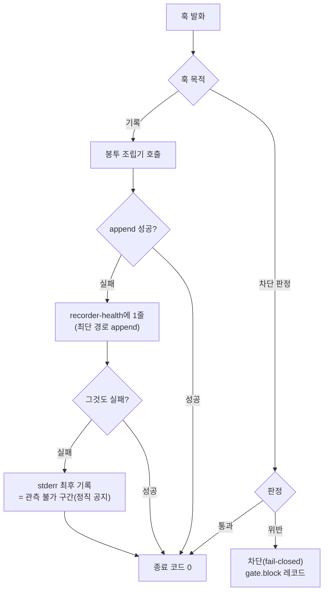
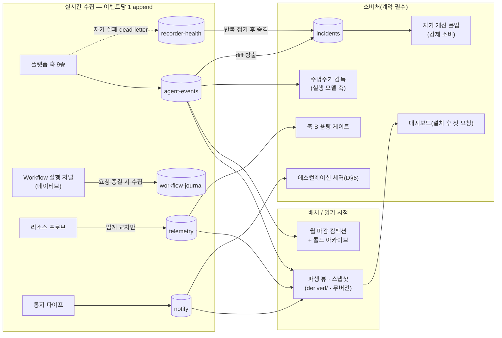
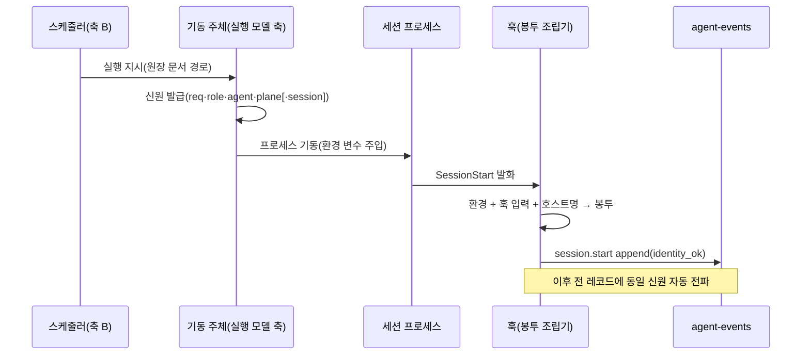
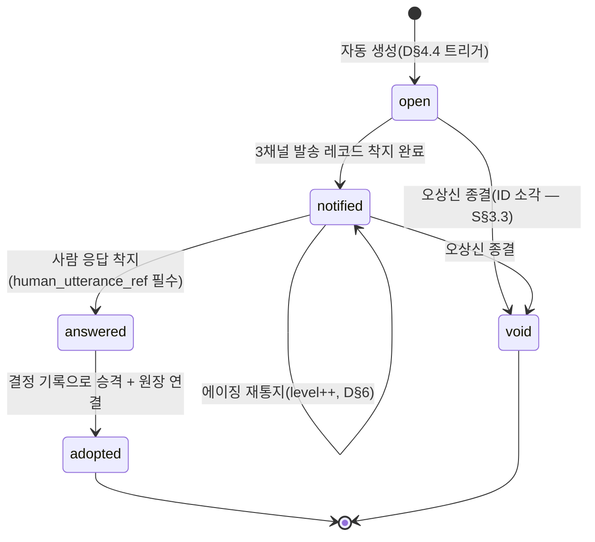
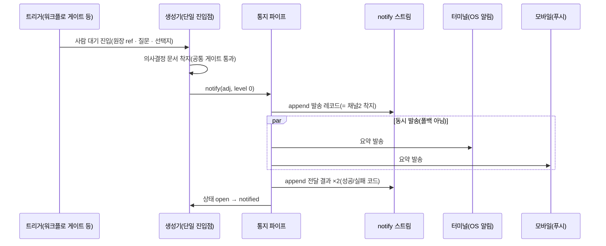
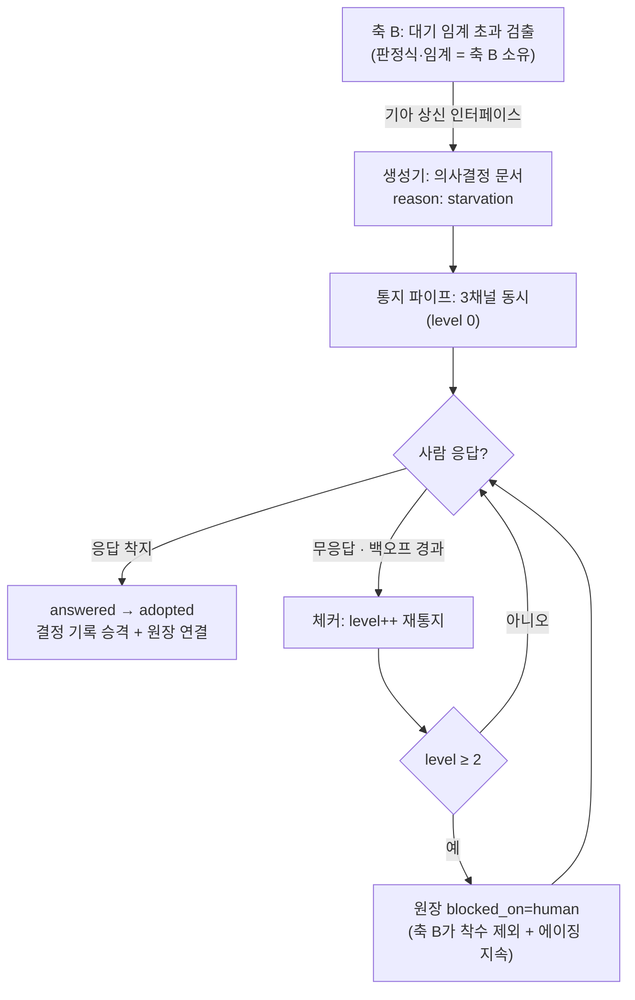
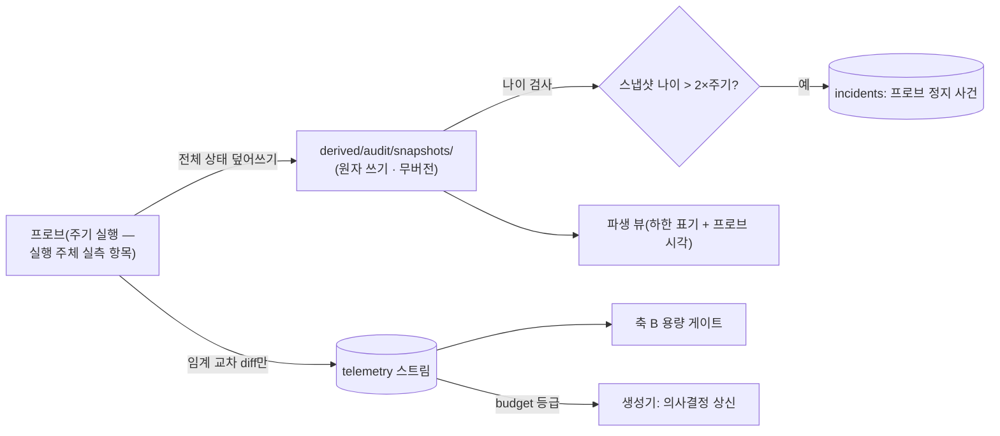

## 요약

**확정** — 아래가 본 축이 소유 정본으로 확정한 것이다. 계약 전문(필드 표·판정식·문법·전이표)은 각 계약 소절의 블록에 있고 이 절은 결론만 담는다.


- **범위**: S§7(감사)·S§3.7(의사결정 문서)·S§12 T5(모바일 푸시 실측 과제)의 구현 설계. 산출은 ①플랫폼 훅 설계 표 ②오딧 스트림 계약(producer/consumer/transition/보존) ③신원 전파 ④의사결정 문서 스키마·상태기계 ⑤3채널 동시 통지 ⑥기아 에이징·미응답 에스컬레이션 배선 ⑦기록 장치 자기 실패·리소스 텔레메트리.
- **핵심 결정**: 수집은 훅 기반 **이벤트당 1 append**의 소수 스트림으로, 파생·표출은 배치/읽기 시점으로 분리한다(S§7·S§11-1). 스트림 무오염은 세션당-자기파일 전제가 아니라 **레코드 원자 append 계약**(단일 write·크기 상한·초과 스필·`append_mode` 스위치 — R38)으로 성립시킨다: 서브에이전트가 부모 세션 파일에 동시 append해도 계약이 유지되며, writer 파일 분리는 감쇄 장치다. 상태형 관측은 스냅샷, 사건형 기록은 신규 발생 diff에서만 방출한다(S§7). 신원은 기동 주체가 세션 프로세스 환경에 발급·주입하고 훅이 모든 레코드에 전파한다(S§7·S§3.5). 의사결정 문서는 파이프라인의 사람 대기 진입 시 자동 생성되고 3채널로 **동시** 통지되며(폴백 아님 — S§3.7), 미응답 회수는 재시도가 아니라 에이징 에스컬레이션이 담당한다.
- **네이티브 판정 요지**(S§2-6): 수집 메커니즘은 플랫폼 훅(네이티브), 레코드 봉투 조립은 최소 커스텀(근거: 훅은 명령 실행만 제공하고 JSON 직렬화·해시 계산은 코드가 필요). 워크플로 실행 저널은 네이티브를 그대로 수집한다. 통지의 터미널 채널은 OS 표준 명령, 모바일 채널은 후보 비교 후 **설치 전 실측**으로 확정한다. 상주 데몬은 기각 상태를 계승한다(S§11-19).

**실측 대기** — 10건. 정본은 D§9, 전수 색인은 부속 PA. 훅 이벤트의 존부·입력 필드 상세, 워크플로 저널의 파일 위치·스키마, 모바일 푸시 수단, OS 알림 명령 가용성, 에스컬레이션 체커의 실행 주체(OS 스케줄러 대 플랫폼 스케줄링), 동시 append 원자성(S§12 T6 담당 축과 공용 시나리오 — 단 **무오염 논거는 이 실측 결과에 의존하지 않는다**: 레코드 원자 append 계약 R38과 부정 판정 시의 flock 모드 자동 전환이 설계상 고정이다, D§2.3).

**미결** — 본 축의 미결 절 정본은 D§10이며, 재생성본 전체의 미결·이력 정본은 부속 PB다.

## 0. 범위와 소유 경계 — 타 축 위임 표

중복 정의 금지 원칙에 따라, 아래 상세는 이 문서가 정의하지 않고 위임한다. 기준은 스펙 절 번호다.

| 계약 | 이 문서(축 D)가 소유 | 위임 |
|---|---|---|
| 문서 트리·파일명·public/private 판정 기준 | 오딧 스트림의 착지 경로 규약(트리 규약 위에서의 배치) | 문서 체계 담당 축(S§3.1~3.4) 소유 |
| 요청 원장 스키마·참조 무결성 게이트 | 의사결정 문서의 유형 고유 필드·상태기계 | 문서 체계 담당 축(S§3.5·S§3.9 T9) 소유 |
| 스케줄링 판정식·에이징 임계값·틱 주기 | 기아 상신 수신 계약(필드 정의)·통지·에스컬레이션 사다리 | 축 B(S§5.6 T10) 소유 |
| 세션 기동 주체·감독(급사 탐지)·재개 | 수명주기 이벤트의 방출·기록(세션·서브에이전트 시작/종료) | 실행 모델 담당 축(S§4·S§11-13) 소유 |
| 리드 게이트의 근거 슬롯·번복 감지 | 리드가 의사결정 문서를 생성할 때 쓰는 공용 생성기 | 리드 게이트 담당 축(S§5.4 T3) 소유 |
| 자기 개선 롤업의 주기·발의 임계 | 롤업이 소비할 incidents 스트림의 스키마·수명주기 | 자기 개선 담당 축(S§5.5 T8) 소유 |
| 설치기·백업(볼트·private 트리 포함) | 오딧 파생물의 무버전 선언(.gitignore 대상 경로 목록 제공) | 설치 담당 축(S§8) 소유 |
| 대시보드의 읽기 방식 | 기계 가독 착지 형태(파생 뷰 파일 규약)까지만 | 대시보드는 설치 후 첫 요청에서 문답으로 확정(S§3.7 — 선고정 금지) |

## 1. 훅 설계 표 (①)

### 1.1 전제 — 존부 실측 규약 [계약]

아래 표의 훅 이벤트는 플랫폼 문서화 범위에서 알려진 것이다. **네이티브 우선 원칙(S§2-6)에 따라 존부·입력 필드를 단정하지 않는다** — 전 행이 "설치 전 실측 항목"이며, 실측 절차는 다음과 같다.

```text
실측 절차(설치기 프리플라이트에 편입):
1. 전 이벤트에 에코 훅(수신 JSON을 그대로 파일에 append)을 등록한다.
2. 각 이벤트를 유발하는 스크립트 세션을 1회 돌린다
   (도구 호출·서브에이전트 스폰·압축 유발·정상 종료).
3. 발화 여부·입력 필드(session 식별자·작업 디렉토리·도구명·도구 입출력)를
   기록과 대조해 이 표를 확정판으로 갱신한다.
4. 미발화 이벤트는 표에서 "미지원" 표기 후 해당 기록 축을 대체 경로로 옮긴다
   (대체 경로는 각 행의 비고에 선기재).
```

### 1.2 훅 이벤트 표

공통: 모든 훅은 **봉투 조립기**(D§2.2)를 경유해 레코드를 만들고, 착지는 **이벤트당 정확히 1 append**다. 기록 목적 훅은 전부 fail-open(훅 내부 오류 시 종료 코드 0 + recorder-health에 1줄 — D§7), 차단 목적 판정만 fail-closed다(S§9.3-15: 미탐이 비가역인 축만 차단).

| 훅 이벤트 | 트리거 시점 | 매처 | 기록 레코드(event · data 필드) | 착지 스트림 | 실패 시 동작 |
|---|---|---|---|---|---|
| SessionStart | 세션 기동(신규·재개·클리어 — 매처 상세 실측) | startup / resume / clear | `session.start` {trigger, identity_ok(bool)} | agent-events | fail-open. 단 신원 결손 처리는 D§3.4 규칙 |
| UserPromptSubmit | 사람 발화 제출 직후 | — | `prompt.submit` {len, digest} (원문 미수록 — D§2.5) | agent-events | fail-open |
| PreToolUse | 도구 실행 직전 | Write / Edit / Bash 등 쓰기 도구 | 평시 무기록. 차단 발생 시만 `gate.block` {tool, rule, target_digest} | agent-events | **게이트 판정은 fail-closed(차단)**, 기록은 fail-open |
| PostToolUse | 도구 실행 완료 직후 | 전 도구 | `tool.done` {tool, ok, dur_ms, in_bytes, in_digest, out_bytes, out_digest} | agent-events | fail-open |
| Notification | 플랫폼이 통지를 낼 때(권한 대기·유휴 등 — 발화 조건 실측) | — | `platform.notify` {kind} · 터미널 채널의 보조 트리거(D§5.2) | agent-events | fail-open |
| Stop | 주 에이전트 턴 종료 | — | `agent.turn_end` {} | agent-events | fail-open |
| SubagentStop | 서브에이전트 종료 | — | `subagent.end` {sub_role?, result_digest} — 수명주기 직접 방출(S§10-19) | agent-events | fail-open |
| PreCompact | 컨텍스트 압축 직전 | manual / auto | `session.compact` {trigger} | agent-events | fail-open |
| SessionEnd | 세션 종료(존부 실측 — 미지원이면 Stop+감독 경로로 대체) | — | `session.end` {reason} | agent-events | fail-open |

- **PreToolUse를 평시 무기록으로 두는 근거**: 도구 호출당 pre+post 2회 append는 쓰기량을 2배로 만든다. 선행 운영의 동기 쓰기 IOPS 사고(S§7)의 재발 축이므로, 호출 사실·소요·결과는 PostToolUse 1회로 충분하다. Pre는 차단 판정 전용이고 기록은 차단이 실제로 난 경우에만 남긴다.
- **훅 내 금지 목록**: 파생물 재생성 금지·커밋 금지·네트워크 호출 금지(모바일 푸시 포함 — D§5.4). 근거: S§10-1(이벤트당 파생 전량 재생성이 세션 정지를 만든 실사고), S§10-2(이벤트 단위 커밋 금지).
- [R24] 훅은 이벤트당 정확히 1 append만 수행하고, 파생·커밋·네트워크를 하지 않는다. [장치 — 훅 표준 라이브러리(봉투 조립기)가 append 원어만 제공하며 네트워크·커밋 원어가 없다. 배치 감사가 훅 실행 소요시간 이상치(임계 초과)를 검출해 사건화한다 | 장치 불가(부분) — 훅 스크립트가 임의 코드를 추가로 담는 것 자체는 구조로 못 막는다. 판정에 코드 의미 해석이 필요하므로(S§9.4-19류) 코드 리뷰 규율 + 소요시간 감사로 보강한다]
- [R25] `docs/audit/` 하위에 대한 에이전트의 직접 쓰기(Write·Edit)는 금지한다 — 착지는 봉투 조립기 경유만. [장치 — PreToolUse 훅이 대상 경로를 정규화한 뒤 audit 트리 하위면 차단(fail-closed). **잔여 통과 경로 명시 의무(S§3.4)**: Bash 셸 리다이렉션은 문자열 판정이라 원리적으로 불완전하다(S§9.3-13 — 미탐 실측 근거). 이 잔여는 사후 배치 감사(전 레코드 파싱 + 봉투 필수 필드 검증 — D§2.4)가 검출해 사건화한다 | —]

### 1.3 훅 실패 처리 흐름



## 2. 오딧 스트림 계약 (②)

### 2.1 스트림 목록과 4계약 표 (S§7 — 같은 커밋에 선언)

| 스트림 | 성격 | producer | consumer(1차) | transition(원본 → 파생 → 처분) | 보존기간(제안치) |
|---|---|---|---|---|---|
| `agent-events` | 사건형 | 훅 9종(D§1.2) | 대시보드 파생 뷰 · 수명주기 감독(실행 모델 축) · 실패 롤업 | append → 배치 파생 뷰 → 월 마감 컴팩션·콜드 아카이브 | 활성 당월+2개월, 이후 압축 아카이브(삭제 금지 — S§2-12) |
| `workflow-journal` | 사건형(네이티브 산출 수집본) | Workflow 엔진(네이티브) → 수집기가 요청 종결 시 1회 복사 | 검증 감사 · 재개(실행 모델 축) | 네이티브 저널 → 요청 단위 수집 → 아카이브 | 요청 종결 후 아카이브, 무기한 |
| `incidents` | 사건형(수명주기 보유) | 봉투 조립기(동일 오류 접기 — D§7.2) · diff 방출기(D§2.6) · 에이전트(판단성 실패 — 실패 사슬 문서는 문서 체계 축 소유, S§9.1-5) | 자기 개선 롤업(S§5.5 — **강제 소비 배선**, S§11-5) | open → working → resolved 또는 false_positive(상태 전이도 append — 어휘 정본 A§6.2) | 무기한 |
| `notify` | 사건형 | 통지 파이프(D§5.4) | 에스컬레이션 체커(D§6) · 대시보드 | append → 파생 뷰(미응답 목록) → 아카이브 | 180일 후 아카이브 |
| `telemetry` | 사건형(임계 교차만) | 리소스 프로브(D§7.3) | 축 B 용량 게이트 · 대시보드 | 교차 사건 append(스냅샷은 별도 — D§2.6) | 90일 후 아카이브 |
| `recorder-health` | 사건형 | 전 훅의 dead-letter 경로(D§7.1) | 실패 롤업(강제 소비) | append → 반복분 접기 → incidents 승격 | 30일, 승격분 무기한 |
| `sched-decisions` | 사건형 | 스케줄러(**축 B 소유** — S§5.6-④) | 사후 감사 · 대시보드 | 축 B 소유 | 축 B 소유 |

- [R23] 스트림 신설은 위 4계약(producer/consumer/transition/보존기간)의 레지스트리 등재와 **같은 커밋**에서만 가능하다(S§7). [장치 — 스트림 레지스트리(정본: RF 문서 + 판정용 파생 `derived/policy/streams.json` — A§2.4-6)가 정본이고, PreToolUse 게이트와 봉투 조립기가 미등재 스트림 이름의 착지를 거부한다(fail-closed). 레지스트리 수정과 첫 착지가 다른 커밋이면 배치 감사가 검출 | —]
- [R35] 파생 뷰는 전부 순수 재생성 가능하며 버전관리 밖이고, 관측(파생 생성) 계층은 원본 스트림에 대해 읽기 전용이다(S§11-15 — 관측이 쓰기를 유발해 세션이 정지한 실측). [장치 — 파생은 루트 `derived/audit/`에만 두고(A§1.1 R3 — docs/ 하위 파생 금지) `derived/` 전체가 .gitignore 제외(A§8.1), 파생 생성기에는 원본 스트림 쓰기 원어가 없다 | —]

### 2.2 공통 레코드 봉투 (전 스트림 공통 — 필드/타입/필수/기입 주체) [계약]

착지 형식은 JSONL: **1레코드 = 1물리 줄**, 문자열 내 개행은 직렬화기가 이스케이프한다(S§3.6 — 형식 수준 보장. 줄 지향 인덱스가 다중행 값에 조용히 깨진 실측 근거).

| 필드 | 타입 | 필수 | 기입 주체 |
|---|---|---|---|
| `id` | string — 결정론적 해시: `hash(machine ∥ session ∥ writer_pid ∥ proc_nonce ∥ ts ∥ seq)` 앞 12자(S§3.8-①). `writer_pid`·`proc_nonce`(조립기 프로세스 기동 시 난수)는 같은 세션의 훅 프로세스가 동시에 떠도(서브에이전트 포함 — D§2.3) `ts`·`seq`가 겹쳐 id가 충돌하는 것을 막는 성분이다 | 필수 | 봉투 조립기(자동) |
| `ts` | string — ISO 8601, UTC 오프셋 포함, 초 단위 이상 | 필수 | 봉투 조립기 |
| `stream` | enum — D§2.1 레지스트리의 이름만 | 필수 | 봉투 조립기 |
| `event` | string — `<대상>.<동사>` 소문자 점 표기(D§1.2 열거) | 필수 | 호출부 |
| `plane` | enum — `workflow` \| `loop` \| `interactive` | 필수 | 환경 주입분(D§3) |
| `machine` | string — 머신 별칭(정본은 머신 설정 파일 — S§8) | 필수 | 봉투 조립기(호스트명 해석) |
| `session` | string — 세션 식별자 | 필수 | 훅 입력, 부재 시 대체 발급분(D§3.2) |
| `req` | string — 요청 원장 문서 ID | 조건부: plane ≠ interactive면 필수 | 환경 주입분 |
| `role` | string — 역할 키 | 조건부: 동상 | 환경 주입분 |
| `agent` | string — 표시명(발급 시점의 레지스트리 해석값) | 선택 | 환경 주입분 |
| `data` | object — 이벤트별 페이로드(빈 객체 허용) | 필수 | 호출부 |
| `why` | string — 자유 서술(요청 참조 외 보충) | 선택(사람 기입 필드는 전부 선택 — S§9.1-3) | 사람/에이전트 |

- [R26] 봉투 필수 필드가 결손된 레코드는 본류 스트림에 착지하지 않는다 — recorder-health로 우회 착지하고 사건 1건을 연다. 근거: 주체 미상 기록은 재발 방지에 쓸 수 없다(S§3.5 — 신원 조인 실패 실측). [장치 — 봉투 조립기가 착지 직전 필수 필드를 검증하고 결손분을 우회 경로로 돌린다 | —]

### 2.3 착지 경로와 샤딩·회전 상한 [계약]

트리 규약(카테고리·public/private·시간 파티션)은 문서 체계 축 소유(S§3.1~3.4)이며, 오딧은 그 규약 위에 다음과 같이 배치한다.

```text
docs/audit/                              # 파일 계약(샤드 직치·파일명·헤더 레코드·writer·회전 체인)의
├── public/YYYY/MM/                      #  단일 정본은 A§2.4 — 스트림 하위 디렉토리·part 파일명 없음
│   └── AU-<UTC시각>Z-<해시8>[-<스트림명>].jsonl
│                                        #  스트림 식별은 파일명 파싱이 아니라 헤더 레코드(stream 필드)
└── private/YYYY/MM/                     # 동일 구조 — 반출 불가 정보를 담는 스트림만
    └── ...                              #  (.gitignore — 백업 장치가 보존 책임, S§3.4)
derived/audit/                           # 파생(무버전 · 재생성 가능 · .gitignore) — A§1.1 R3:
├── snapshots/                           #  docs/ 하위 파생 디렉토리 금지, 루트 derived/audit/만
└── views/                               # 대시보드용 집계 뷰(배치 생성)
derived/policy/streams.json              # 스트림 레지스트리 판정용 파생 — 정본은 RF 문서(A§2.4-6)
```

- 사건 스트림 파일(`FS-….jsonl`)은 `docs/failures/` 샤드에 착지한다(A§1.4). 상한 초과 스필 전문(`spill/<id>.json` — R38-3)의 착지 위치는 A§2.4 파일 계약(추가 디렉토리 층 금지)과 **미합치 접점**이다 — PB 등재, 합치 전 본 절 원안(스트림 파일과 같은 샤드의 spill/ 하위) 잠정 유지.

- **무오염 논거의 위치 — 세션당-파일 전제에 의존하지 않는다(정정)**: 서브에이전트의 훅이 부모와 같은 세션 식별자로 발화하면 복수 프로세스가 한 파일에 동시 append하는 상황이 생길 수 있고, 서브에이전트가 없어도 세션 내 병렬 도구 호출로 같은 세션의 훅 프로세스는 동시에 뜰 수 있다. 즉 "한 파일 = 한 writer"는 실측 결과에 따라 깨질 수 있는 배치 희망이지 보장이 아니다. 따라서 '1레코드 = 1물리 줄'(D§2.2)의 성립 근거를 writer 유일성이 아니라 아래 **레코드 원자 append 계약(R38)** 에 둔다 — 계약은 동일 파일의 동시 writer 수와 무관하게 성립한다.
- [R38] (레코드 원자 append 계약) 무오염(S§3.8)·형식 수준 보장(S§3.6)은 다음 4항의 계약으로 성립하며, 서브에이전트가 부모 세션 파일에 동시 append하더라도 유지된다.
  1. **단일 write**: 봉투 조립기는 직렬화된 레코드(끝 개행 포함)를 O_APPEND로 연 파일에 **한 번의 write 호출**로 쓴다. 부분 쓰기(반환 길이 < 요청 길이)는 성공이 아니라 실패로 취급해 dead-letter 경로(D§7.1)로 돌린다.
  2. **크기 상한**: 직렬화 길이는 개행 포함 **4,096바이트 이하**로 고정한다(계약 상수). 이 값은 이식 가능한 원자성 하한(파이프의 PIPE_BUF 최소값)을 보수적으로 차용한 것이다 — 정밀화: 표준이 바이트 상한부 원자성을 명시하는 대상은 파이프이고, 일반 파일의 동시 append 원자성은 구현·파일시스템 정의다. 그래서 상한 준수 하나로 완결로 치지 않고 4항의 실측 판정·폴백까지가 한 계약이다.
  3. **초과분 스필**: 상한 초과 레코드는 본류 스트림에 싣지 않는다 — `data`를 `{oversize: true, size, digest, spill_ref}`로 치환해 상한 내 레코드로 착지시키고, 전문은 스필 파일 `spill/<id>.json`(착지 위치는 A§2.4와의 미합치 접점 — PB)에 **임시 파일 + rename**으로 쓴다(파일명이 레코드 id라 유일 — 경합 자체가 없고, rename은 원자적이다). D§2.5의 digest-only 규약 때문에 정상 경로에서 상한 초과는 예외 상황이다.
  4. **파일시스템 전제와 모드 스위치**: 1·2항은 로컬 파일시스템의 O_APPEND 직렬화를 전제한다(네트워크·가상 파일시스템은 이 전제가 깨지는 대표 사례). 설치기 프리플라이트가 **경합 해머 시험**(아래)으로 전제를 판정하고 머신 설정 파일(S§8)에 `append_mode: atomic | flock`을 기록한다 — 조립기는 이 값을 읽어 동작한다. 판정이 부정이면 **flock 모드로 자동 전환**한다(append write 1회를 OS 표준 advisory lock으로 감싼다 — 잠금 구간은 write 1회로 한정). flock마저 시험에 실패하는 파일시스템에는 설치기가 오딧 트리 배치를 **거부**하고 위치 변경 인터뷰로 전환한다(fail-closed).
  [장치 — 봉투 조립기가 유일한 착지 원어이고(R25) 그 안에서 직렬화 → 상한 검사 → 단일 write가 한 함수다(초과는 스필로 구조 분기 — 우회 원어 없음). 프리플라이트 해머 시험이 `append_mode`를 결정·기록하고, 배치 감사(D§2.4)가 파싱 불가 줄을 계약 위반 사건으로 검출한다 | —]

  ```text
  경합 해머 시험(프리플라이트 — 결정론 판정, S§12 T6 담당 축과 공용 시나리오):
    N개 프로세스 × 각 M회, 상한 크기(4,096B) 레코드를 같은 파일에 동시 append
    판정식: 물리 줄 수 == N×M  ∧  전 줄 JSON 파싱 가능  ∧  레코드 id 유실 0
    atomic 모드로 1회 → 실패 시 flock 모드로 1회 → 둘 다 실패면 배치 거부
  ```

- **기각한 대안(재론 방지 기록)**: 단일 큐 프로세스 경유 직렬 append — 다중 writer를 원천 제거하지만 상주 프로세스가 필요해 상주 데몬 기각(S§11-19 — 조용히 죽는 프로세스와 감시자의 감시자)과 충돌하고, 큐 프로세스 자신이 전 스트림의 단일 장애점·단일 병목이 된다.
- **writer 파일 분리(감쇄 장치 — 무오염 논거 아님)**: 한 writer가 자기 파일에만 append하는 배치는 기본으로 유지한다(S§9.1-1 — 세션 산 스트림은 세션당 1파일, 파일명·헤더 `writer` 필드는 A§2.4-3·4 정본) — 동시 writer 수를 줄여 파일 내 ts 정렬 안정성과 회전 판정을 단순화하는 효과다. `lane`(주/서브 발화 구별자)은 훅 입력에서 실측으로 확인되는 경우에만 writer 값과 ID 해시 입력에 포함해 파일을 분리한다(D§9-3). 구별자가 없어 부모·서브가 같은 파일을 공유하게 되어도 R38으로 무오염은 유지된다 — **이 실측의 결과는 무결성이 아니라 파일 배치 해상도만 바꾼다.**
- **회전 상한**: 파일당 크기 임계 또는 줄 수 임계(두 값의 정본은 A§2.4-5 — 본 축은 재기술하지 않는다) 중 먼저 도달하면 **새 ID로 새 파일**을 열고 새 파일 헤더 레코드의 `prev`가 직전 파일 ID를 가리킨다(part 접미 파일명 금지 — 회전 체인, A§2.4). 근거: 단일 로그 파일 비대가 저장소 메타데이터 폭증의 성분이었다(S§10-2·S§11-4).
- **블록 증폭 억제**(S§3.2-②): 소형 세션 파일 다수는 블록 증폭을 재현하므로, **월 마감 컴팩션 배치**가 지난달 스트림 파일들을 스트림당 1파일로 병합(ts 순 정렬)하고 해시 대조로 무유실을 검증한 뒤 원본을 압축 보관한다(삭제 아님 — 이동은 흔적을 남긴다, S§3.8).
- **public/private 배정 기준**(판정 기준 정본은 문서 체계 축 — S§3.4): 오딧 레코드는 원문 대신 **digest·크기·정규화 경로**만 담아 기본 public에 착지한다. 저장소 밖 절대 경로는 마지막 성분+해시로 축약하고, 원문(도구 입출력 전문·발화 전문)은 수집하지 않는다 — 필요 시 플랫폼 자체 기록(세션 기록 파일 — 위치는 실측 항목)을 세션 ID로 조인해 참조한다. 이 규약을 지키지 못하는 스트림만 private에 배치한다.
- **커밋**: 이벤트당 커밋 금지(S§10-2). 오딧 원본은 배치 커밋 대상이며, 자동 커밋 장치·주기는 문서 체계 축 소유(S§2-14)다. 계약: 오딧 트리는 "쓰기 = append 즉시, 커밋 = 배치"의 두 시점을 갖고, 무유실 판정(추적 확인 게이트 — S§3.8)은 배치 커밋 시점에 수행된다.

### 2.4 형식 감사(배치)

배치 감사기가 주기적으로(주기는 자기 개선 롤업과 동일 틱 — T8 담당 축과 합치) 전 스트림을 파싱해 다음을 검증한다: ①전 줄 JSON 파싱 가능 ②봉투 필수 필드 충족 ③스트림 이름의 레지스트리 등재 ④회전 상한 위반 ⑤훅 소요시간 이상치 ⑥레코드 직렬화 길이의 상한(R38-2) 초과 여부. 위반은 incidents에 사건으로 연다. 이 감사가 R25의 잔여 통과 경로(셸 리다이렉션 직접 쓰기)의 검출기이고, ①의 파싱 불가 줄은 **줄 찢김(R38 계약 위반) 후보**로 별도 사건 클래스를 부여해 `append_mode` 재판정(해머 시험 재실행)을 촉발한다.

### 2.5 발화·도구 원문의 비수록

`prompt.submit`·`tool.done`은 원문이 아니라 길이·digest만 담는다. 근거: ①원문 수록은 쓰기량을 지배해 IOPS 사고 축이 된다(S§7) ②원문에는 자격증명·실주소가 섞일 수 있어 public 착지가 불가능해진다(S§3.4) ③원문은 플랫폼 기록에 이미 존재하므로 중복이다(중복 저장은 S§10-2의 비대화 축).

### 2.6 상태형 스냅샷과 사건형 기록의 분리 (S§7) [계약]

선행 운영의 최대 왜곡은 **탐지-무소비 루프**였다 — 총 발생의 87.3%가 동일 사건의 주기적 재탐지였고 신규 작업 0에도 건수가 선형 증가했다(S§7). 구조적 차단:

- **상태형**: 프로브·탐지기는 "현재 상태 전체"를 `derived/audit/snapshots/<축>-<machine>.json`에 원자 쓰기(임시 파일 + rename)로 덮어쓴다. 스냅샷은 파생물이다 — 무버전·재생성 가능.
- **사건형**: 사건은 스냅샷 diff에서만 방출한다.

```text
# diff 방출기 표준 흐름(모든 탐지기·프로브가 이 흐름만 사용)
prev ← read(snapshot)                    # 없으면 빈 집합
cur  ← probe()                           # 현재 위반/상태 전체
for k in (cur − prev): append(incidents, incident.opened{key: k})
for k in (prev − cur): append(incidents, incident.state_change{key: k, to: resolved-candidate})
write_atomic(snapshot, cur)              # 임시 + rename
```

- [R27] 현재 상태는 스냅샷으로, 사건은 diff 신규분만 기록한다. [장치 — 탐지기 표준 라이브러리가 diff 방출 흐름만 제공한다(전량 재방출 원어 없음). 배치 감사가 동일 key의 open 중복을 검출해 사건화 | —]

### 2.7 오딧 이벤트 흐름도 (전체)



## 3. 신원 전파 (③)

### 3.1 신원 5요소와 발급

세션 생성 시점에 신원(요청 ID · 역할 · 실행 평면 · 머신 · 세션)을 발급해 모든 레코드에 전파한다(S§7). 발급 주체는 **세션 기동 주체**(워크플로 스포너 또는 리드의 세션 개시기 — 기동 주체 자체는 실행 모델 축 소유)다.

| 필드 | 발급 주체 | 주입 지점 | 검증 지점 |
|---|---|---|---|
| `req`(요청 ID) | 기동 주체 — 워크플로 기동 입력의 필수 인자인 원장 문서 경로에서 도출(S§5.1) | 세션 프로세스 환경 변수 `HARNESS_REQ` | SessionStart 훅이 원장 문서 실재를 확인, 결손 시 D§3.4 |
| `role`(역할 키) | 기동 주체 — 스폰 파라미터 | 환경 변수 `HARNESS_ROLE` | 봉투 조립기 필수 필드 검증(R26) |
| `agent`(표시명) | 기동 주체 — 이름 레지스트리(조직 축 소유, S§6.2) 해석값 | 환경 변수 `HARNESS_AGENT` | 선택 필드 — 결손 시 role만으로 성립 |
| `plane`(실행 평면) | 기동 주체 — `workflow` \| `loop` \| `interactive` | 환경 변수 `HARNESS_PLANE` | 봉투 조립기 필수 필드 검증 |
| `machine` | 봉투 조립기 — 호스트명을 머신 설정 파일(S§8)의 별칭으로 해석 | 주입 불요(런타임 해석) | 별칭 미등재 호스트는 사건화 |
| `session` | 플랫폼 — 훅 입력의 세션 식별자(**존부 실측 항목**) | 훅 입력 JSON | 부재 시 D§3.2 대체 |

### 3.2 세션 식별자 대체 경로

훅 입력에 세션 식별자가 없는 환경(실측으로 판명 시): 기동 주체가 기동 직전 UUID를 발급해 `HARNESS_SESSION`으로 주입하고, 봉투 조립기는 훅 입력값 우선 · 환경값 차선으로 읽는다. 둘 다 없으면 R26 결손 처리.

### 3.3 신원 주입 시퀀스



### 3.4 신원 결손·위조에 대한 정직 공지 (S§9.4-21)

- **결손**: plane ≠ interactive인 세션에서 `req`/`role` 결손이 SessionStart에서 감지되면 — `session.start{identity_ok: false}` + incidents 사건 1건. 세션 자체의 차단(fail-closed)이 SessionStart 훅으로 가능한지는 **설치 전 실측 항목**이며, 불가로 판명되면 차단 지점을 PreToolUse 게이트(첫 쓰기 도구 호출 차단)로 옮긴다.
- **위조 한계**: 환경 변수는 세션 내부 코드가 하위 프로세스에 대해 변조할 수 있다 — "위조 불가능"의 실구현 수준은 ①신원이 **세션 외부(기동 주체)에서 발급**되고 ②**에이전트 산출 텍스트는 신원·판정을 정하지 않으며**(S§5.3 — 명의 참칭 실사고 근거) ③기동 주체의 발급 대장과 레코드 신원의 사후 대조(배치 감사)가 있다는 것까지다. 완전한 변조 차단은 플랫폼 권한 모델 밖이다.
- [R29] 신원은 기동 주체가 발급하며, 에이전트의 산출 텍스트는 신원과 판정을 정하지 않는다. [장치 — 환경 주입 + 봉투 조립기 + 기동 대장 대조(배치) | 장치 불가(부분) — 세션 내부의 환경 변조 완전 차단은 플랫폼 권한 모델 밖 — 위 정직 공지로 한계를 명시하고 사후 대조로 보강]
- [R30] 두 실행 평면(workflow/loop)은 **같은 스트림·같은 경로**에 착지한다 — 평면은 디렉토리가 아니라 필드다. 근거: 평면 분열로 정확한 통과 판정이 영구 무효가 된 실사고(S§4.2·S§10-8). [장치 — 착지 경로 함수에 plane 인자가 없다(경로에 반영 불가능한 구조), plane은 봉투 필수 필드 | —]

## 4. 의사결정(HITL) 문서 (④)

### 4.1 지위와 트리 배치

의사결정 문서는 "의사결정 요청"(사람 응답 대기)이며 기결 "결정 기록"과 구별된다(S§3.7). 트리·파일명·메타데이터 7요소·요약 절 규칙은 문서 체계 축의 공통 규약(S§3.1~3.5)을 그대로 따르고, 아래는 **유형 고유 필드**만 정의한다. 파일은 `docs/adjudications/<public|private>/YYYY/MM/AJ-<YYYYMMDD>T<HHMMSS>Z-<해시8>[-<슬러그>].md`에 착지한다(ID·파일명 문법의 정본은 A§2.1 — 초안의 별도 접두 표기는 그 문법으로 단일화, PB).

### 4.2 스키마 — 필드 자리 정본은 A§4.2 (중복 정의 병합)

AJ 문서의 필드 자리(공통 메타 + `question`·`reason`·`options[]`·`deadline`·`escalation`·`notify[]`·`refs.request`·`response`·`responded_by`·`refs.decision`)·상태 enum·승격 규칙·파일명의 정본은 **A§4.2·A§6.2**다(조립 병합 — PB). 본 축이 소유하는 것은 통지 계열 필드의 **값 의미론과 갱신 장치**다:

| 필드(자리 정본: A§4.2) | 본 축 소유 의미론 |
|---|---|
| `deadline` | 값 계산 — 에이징 정책에서 도출(정책값 정본은 축 B 정책 파일 — D§6.1) |
| `escalation` {level, last_notified_at, next_check_at} | 갱신 장치 — 에스컬레이션 체커(D§6.2)만 기입. 에스컬레이션은 상태가 아니라 이 필드다 |
| `notify[]` | 기입 장치 — 통지 파이프(D§5.5). notify 스트림 레코드 ID 목록, 발송 후 필수 |
| `response`·`responded_by` | 기록 규율 — 실제 사람 발화 인용(`human_utterance_ref`) 필수(R32). 축 A의 전이 가드가 검증하는 대상 필드 |

초안의 `request_ref`·`decision_ref` 표기는 `refs.request`·`refs.decision`으로 단일화한다(PB).

### 4.3 상태기계 [계약]

상태 enum: `open` · `notified` · `answered` · `adopted` · `void`



전이 판정식(게이트 의사코드):

```text
transition(adj, to):
  case to == notified:  require adj.notify.length ≥ 1        # 채널2 착지가 발송의 증거
  case to == answered:  require adj.response.human_utterance_ref 실재
                        and adj.responded_by 비어 있지 않음
  case to == adopted:   require 결정 기록 문서 생성 완료
                        and 그 문서가 adj.id 를 역참조
                        and 원장(refs.request)의 참조 슬롯 갱신 완료
  case to == void:      require 사유 필드 + 감사 이벤트   # 소각 — 재사용 금지
  else: 착지 거부(exit ≠ 0)
```

- [R32] 어떤 에이전트·통지 메시지도 사람의 승인이 아니다(S§9.5-29). `answered` 전이는 실제 사람 발화의 참조(`human_utterance_ref` — 세션 기록 내 위치 앵커) 없이는 불가능하다. [장치 — 전이 게이트가 ref 필드 존재와 참조 대상 실재를 검증하고, 없으면 착지 거부(fail-closed) | 장치 불가(부분) — 그 발화가 정말 승인 의사인지의 **진위 판정**은 세계 지식이 필요해 장치 범위 밖(S§9.4-19) — 기록자 규율 + 사후 감사로 보강]
- **미응답 시 자동 집행 금지**: `deadline` 경과는 어떤 선택지도 자동 실행하지 않는다 — 에스컬레이션(D§6)만 촉발한다. `recommended` 표시는 권고이지 기본 집행값이 아니다. [장치 — 스키마에 "기본 집행" 필드 자체가 없다(존재 차원의 차단) | —]

### 4.4 생성 트리거 (자동)

| 트리거 | 호출부 | reason 값 |
|---|---|---|
| 워크플로가 사람 확인 게이트 스텝에 진입(파괴·비가역 조작 승인 등 — 게이트 목록은 파이프라인 축 소유) | 워크플로 스텝 → 생성기 | `hitl-gate` |
| 대기 임계 초과 건의 기아 상신(S§5.6-②) | 축 B 스케줄러 → 생성기 | `starvation` |
| 리드 게이트가 "사람 결정 필요" 클래스로 분류(S§5.4 — 상세는 리드 게이트 축 소유) | 리드 세션 → 생성기 | `lead-gate` |
| 자원·한도 임계(텔레메트리 교차가 사람 판단을 요구하는 등급일 때 — D§7.3) | 프로브 후속 배치 → 생성기 | `budget` |

**생성기는 단일 진입점**이다: 문서 착지(공통 게이트 통과) + 통지 파이프 호출 + 원장 참조 슬롯 갱신을 한 호출로 묶는다. 네이티브 판정(S§2-6): 세션 문맥(워크플로 스텝·리드)에서는 스킬로 충분하다(문서 생성과 도구 호출은 네이티브 범위). 비세션 문맥(스케줄러 틱·프로브 배치)에서는 세션이 없으므로 최소 CLI가 필요하다 — 커스텀 허용 근거: "세션 밖에서 문서를 생성·통지할 네이티브 실행 문맥이 없음". 두 진입점은 같은 라이브러리를 공유해 동작 차이를 없앤다.

## 5. 3채널 동시 통지 (⑤)

### 5.1 원칙

3채널(터미널 · 대시보드용 데이터 착지 · 모바일 푸시)은 **동시 발송이며 폴백이 아니다**(S§3.7 — 확정). 수신 단말 존부를 판정하지 않는다 — 항상 발송하고, 단말이 없으면 그 채널만 미전달로 남는다. 전달 결과는 채널별로 notify 스트림에 기록해 침묵과 미전달을 구별한다.

### 5.2 채널 1 — 터미널 통지 (후보 비교)

| 후보 | 실현 수단 | 장점 | 한계 | 판정 |
|---|---|---|---|---|
| (a) 통지 파이프가 OS 알림 명령 직접 호출 | 리눅스 notify-send · macOS osascript · Windows 토스트(파워셸) — WSL은 Windows 쪽 호출 | 세션과 독립 — 어느 문맥에서도 발송 가능 | OS별 명령 상이 — 환경 인터뷰(S§4.3)에서 가용성 확인 필요 | **기본 후보** — 설치 전 실측 항목 |
| (b) Notification 훅 연계 | 플랫폼 통지 이벤트에 훅 연결 | 네이티브 | 발화 조건이 플랫폼 소관(권한 대기·유휴)이라 의사결정 생성 시점과 불일치 | 보조(권한 대기 가시화 전용) — 설치 전 실측 항목 |
| (c) 터미널 벨·타이틀 변경 | 제어 시퀀스 출력 | 무의존 | 리드 세션 터미널에만 도달 | 보조 — 설치 전 실측 항목 |
| (d) 상태줄(statusline) 갱신 | 플랫폼 상태줄 기능 | 상시 노출 | 존부·갱신 경로 불확실 | 설치 전 실측 항목 |

### 5.3 채널 2 — 대시보드용 데이터 착지

이 채널의 "발송"은 **착지 그 자체**다: ①notify 스트림에 발송 레코드 append ②의사결정 문서 자체가 트리에 실재 ③`derived/audit/views/adjudications-open.json`(미응답 목록 파생 뷰 — 배치 재생성). 대시보드는 아직 없다(S§2-5) — 착지가 이미 되어 있으므로 대시보드 설치 즉시 소급 가시화되며, 대시보드가 이것을 **어떻게 읽을지는 선고정하지 않는다**(S§3.7).

### 5.4 채널 3 — 모바일 푸시 (S§12 T5 — 후보 비교, 전부 설치 전 실측 항목)

| 후보 | 도달 경로 | 필요 자격증명(볼트 D§3.4 보관) | 설치 복잡도 | 전달 관측 | 비고 |
|---|---|---|---|---|---|
| (1) 플랫폼 네이티브 모바일 연동 | 원격 제어/모바일 앱 알림(S§4.4 원격 제어 기본값과 접점) | 플랫폼 계정 | 최저(존재한다면) | 플랫폼 소관 | **존부 불확실 — 실측 최우선.** 존재가 확인되면 네이티브 우선(S§2-6)에 따라 1순위 채택 |
| (2) 셀프호스트형 토픽 푸시(예: ntfy 계열) | HTTP POST → 전용 앱 구독 | 토픽 식별자(사실상 비밀 — 볼트) | 낮음(HTTP 1콜) | 응답 코드 | 공개 릴레이 사용 시 토픽명 노출 위험 — 셀프호스트 여부 포함 실측 |
| (3) 상용 푸시 서비스(예: Pushover 계열) | API 호출 → 전용 앱 | API 키(볼트) | 낮음 | 응답 코드 | 유료 — 비용 확인 |
| (4) 메신저 봇(예: Telegram 계열) | 봇 API → 메신저 앱 | 봇 토큰·대화 식별자(볼트) | 중 | 응답 코드 | 메신저 설치 전제 |

선정 규칙: (1) 존재 실측 → 존재하면 채택. 부재하면 (2)를 기본 후보로 실측(자격증명 표면 최소·의존 최소 근거), 실패 시 (3)·(4) 순. 선정 결과는 결정 기록으로 착지한다.

### 5.5 통지 파이프 의사코드 [계약]

```text
# 입력: adj(의사결정 문서), level(에스컬레이션 단계, 초회 0)
# 불변식 1: 채널2(데이터 착지)는 notify 스트림 append 그 자체다 —
#           이것이 실패하면 발송 전체가 실패다(기록 없는 발송 금지).
# 불변식 2: 채널 간 폴백·순서 의존 없음 — 터미널·모바일은 병렬, 결과만 기록.
# 불변식 3: 재시도 루프 없음 — 미전달 회수는 에이징 재통지(D§6)가 담당.

notify(adj, level):
    rec ← envelope(stream: "notify", event: "adjudication.notify",
                   data: {adj_ref: adj.id, level: level,
                          channels: [terminal, dashboard, mobile]})
    append_jsonl(notify_path(now), rec)            # 채널2 — 실패 시 recorder-health 후 중단
    msg ← render_short(adj)                        # 제목·질문 1문장·선택지 라벨·마감·문서 경로
                                                   # 값·자격증명 미포함(R34)
    results ← parallel:
        send_terminal(msg)                         # D§5.2 채택 후보
        send_mobile(msg)                           # D§5.4 채택 후보, 자격증명은 볼트에서 로드
    for (ch, r) in results:
        append_jsonl(notify_path(now),
            envelope(event: "notify.delivery",
                     data: {adj_ref: adj.id, ch: ch, ok: r.ok, code: r.code}))
    if level == 0: transition(adj, notified)       # D§4.3 게이트 경유
    else:          adj.escalation 갱신(체커 소관 — D§6)
```



- [R31] 통지 발송은 fail-open이고 채널 내 재시도·채널 간 폴백이 없다 — 미전달 회수는 에이징이 담당한다. 근거: 경고 나열식 재발송은 소비되지 않았고(S§5.6-②), 재시도 루프는 훅·파이프에 네트워크 지연을 결합시킨다. [장치 — 파이프 코드에 재시도 분기가 없다(구조 부재) + 체커가 회수 전담 | —]
- [R33] 훅(PreToolUse·PostToolUse 등) 안에서 모바일 푸시를 발송하지 않는다 — 통지 파이프 호출 지점은 게이트 스텝·생성기·체커로 한정한다. 근거: 훅 지연은 전 도구 호출을 지연시킨다(S§7 IOPS 사고와 동류). [장치 — 훅 표준 라이브러리에 네트워크 원어가 없다(R24와 동일 장치) | —]
- [R34] 통지 본문에 값·자격증명·실주소를 싣지 않는다 — 볼트 경로 참조와 문서 경로만. [장치 — 렌더러는 문서의 요약 필드만 읽으며(본문 전문 접근 없음), 발송 경로에 자격증명 패턴 스캔을 겹친다(S§3.4 심층 방어) | 장치 불가(부분) — 산문 서술형 유출은 스캔이 원리적으로 불완전(S§9.3-13) — 작성 규율(S§9.3-17)로 보강]

## 6. 기아 에이징·미응답 에스컬레이션 배선 (⑥ — 축 B와 계약 일치)

### 6.1 계약 분할 [계약]

| 항목 | 소유 |
|---|---|
| 대기 임계·유효 우선순위·기아 판정식·틱 주기 | **축 B**(S§5.6 T10) |
| 기아 상신의 수신 인터페이스(아래 필드), 의사결정 문서 생성·통지·에스컬레이션 사다리 | **축 D**(이 문서) |
| 미응답 의사결정 문서의 재통지 백오프 값 | 축 D가 제안, 정본은 축 B 정책 파일(스케줄링 파라미터와 한 곳) |

**축 B → D 기아 상신 인터페이스**(생성기 호출 인자):

| 필드 | 타입 | 필수 |
|---|---|---|
| `request_ref` | string — 기아 상태인 요청 원장 ID | 필수 |
| `waiting_since` | ts | 필수 |
| `effective_priority` | 축 B 산식의 산출값(상속 포함) | 필수 |
| `blocking_count` | int — 이 건을 기다리는 하류 수 | 필수 |
| `stall_reason` | enum — 축 B의 정당 사유 어휘(용량·의존·게이트·경합, S§9.5-28) | 필수 |

**D → 축 B 역방향**: 의사결정 문서의 `status`·`escalation.level`은 원장 참조 슬롯을 통해 스케줄러 입력이 된다 — level ≥ 2에서 해당 요청의 `blocked_on`을 `human`으로 기입한다(B§1.2의 기존 필드·값 어휘로 단일화 — PB. 기입 주체 합치는 PB 접점). 스케줄러는 착수 대상에서 제외하되 에이징 계수는 계속 증가시킨다.

### 6.2 에스컬레이션 체커 판정식 [계약]

```text
# 실행 주체 후보(설치 전 실측 항목):
#   (a) 축 B 스케줄러 틱에 동승   (b) OS 스케줄러(cron·작업 스케줄러)
#   상주 데몬은 기각 계승(S§11-19 — "감시자의 감시자" 실패 모드).
# 백오프 제안 기본값(정본은 축 B 정책 파일): L1 +30분 · L2 +2시간 · L3 +8시간 ·
#   이후 24시간 간격 반복(상한 없음 — 사람 응답만이 종결).

check():
    for adj in adjudications where status in {open, notified}:
        if adj.status == open and age(adj) > T_notify_fail:
            incidents ← incident.opened{key: "notify-pipe-stall", adj_ref}
            # 생성은 됐는데 발송 기록이 없다 = 통지 파이프 자체 고장
        if now ≥ adj.escalation.next_check_at:
            adj.escalation.level += 1
            notify(adj, adj.escalation.level)          # D§5.5 — 3채널 재발송
            adj.escalation.next_check_at ← now + backoff(adj.escalation.level)
            if adj.escalation.level ≥ 2:
                원장(adj.refs.request)의 blocked_on ← human       # 축 B 소비(D§1.2 필드)
            if adj.escalation.level ≥ 3:
                일일 롤업 뷰 상단 고정(derived/audit/views — 대시보드 소비)
```



- [R28] (재통지의 성격) 재통지는 동일 문서의 level 상승 재발송이지 신규 사건의 나열이 아니다 — 미응답 1건 = 의사결정 문서 1건이며 재통지마다 새 문서·새 사건을 만들지 않는다. 근거: 나열식 방치 알림 무소비 실측(S§5.6-②), 재탐지 루프(S§7). [장치 — 체커는 기존 문서의 escalation 필드만 갱신하며 생성기 호출 경로가 없다 | —]

## 7. 기록 장치 자기 실패 편입·리소스 텔레메트리 (⑦)

### 7.1 기록 장치 자신의 실패 — 1급 사건 (S§7)

- **dead-letter 경로**: 모든 훅 래퍼는 내부 오류 시 `recorder-health` 스트림에 1줄을 남긴다. 이 경로는 의존이 0인 최단 코드(단일 append, 봉투 축약형: ts·machine·session·error_class·msg 앞 200자)여야 한다 — 기록기가 기록기를 부르는 재귀를 금지한다. 그것마저 실패하면 stderr — 이 구간은 **관측 불가**이며 그 사실을 이 문서와 운영 문서에 명시한다(정직 공지 — S§9.4-21).
- **동일 오류 접기**: 같은 (machine, error_class, 문맥 digest)의 반복은 사건 1건 + 발생 카운트 델타로 접는다(S§7 — 동일 메시지 2,000줄 무소비 실사고, S§9.1-4). 회전 상한은 D§2.3과 동일.
- **강제 소비 배선**: recorder-health의 미해소 사건은 자기 개선 롤업의 필수 입력이다(S§11-5) — 롤업은 이 스트림을 읽지 않고는 완료로 판정될 수 없다(롤업 산출 스키마에 recorder-health 소화 필드 필수 — 스키마 상세는 T8 담당 축과 합치).
- [R37] 기록 장치의 실패는 침묵이 아니라 사건이다. [장치 — 래퍼 dead-letter + 접기 + 롤업 강제 소비 배선 | 장치 불가(부분) — dead-letter조차 실패하는 구간(디스크 전면 불능 등)은 원리적으로 기록 불가 — 텔레메트리의 디스크 축(D§7.3)이 선행 경보로 이 구간의 진입 확률을 낮춘다]

### 7.2 incidents 수명주기

레코드의 필드 자리 정본은 A§4.2의 FS 레코드 스키마다 — event enum `opened`(신규)·`recount`(발생 델타 `count_delta`)·`state_change`(상태 전이). 상태 enum: `open → working → resolved | false_positive`(A§6.2 FI와 동일 어휘 — 초안의 `acked`·`false-positive` 표기는 단일화, PB). **개설 레코드에 종결 책임 주체 필드(`owner_role`) 필수**(S§7 — write-only 실패 원장 실사고: 해소 0건. 종결 레코드의 `closer`는 A§4.2 정본 — 두 필드는 병존한다: owner_role=닫을 책임 주체, closer=실제 닫은 주체. PB 접점). 오탐은 삭제가 아니라 `false_positive` 상태로 남긴다(S§9.1-4).

### 7.3 리소스 텔레메트리 (S§7 — 자동 발신원으로 처음부터 편입)

| 축 | 수집 항목 | 수집 방식 후보 | 주기(제안) | 임계·게이트 |
|---|---|---|---|---|
| memory | 가용 메모리 | OS 표준 명령 | 5분 | 게이트값은 머신 설정 파일(S§8 — 자원 프로브 산출값, 하드코딩 금지) |
| disk | 여유 공간 · 저장소 메타데이터 크기(S§10-2 폭증 사고 축) | OS 표준 명령 + 저장소 크기 조회 | 5분 / 1시간 | 동상 |
| usage-limit | 계정 사용 한도 프리플라이트(S§11-12 — 한도 소진은 급사 위협 1급) | 플랫폼 사용량 조회 존부 **설치 전 실측 항목** — 부재 시 응답 코드 통계로 대체(대체임을 표기) | 세션 기동 시 + 1시간 | 임계 교차 시 reason `budget`의 의사결정 상신 후보 |
| sessions | 활성 세션 수 | 프로세스 계수 | 5분 | 상한은 자원 프로브 산출(S§4.4) — 축 B 용량 게이트 입력 |
| audit-volume | 오딧 트리 크기·파일 수·최대 파일 | 파일시스템 조회 | 1일 | 회전 상한(D§2.3) 위반 검출 |

- **방출 규약**: 프로브는 스냅샷 덮어쓰기(상태형 — D§2.6) + 임계 교차 시에만 `telemetry.cross` 사건 1건. 프로브 실행 주체는 에스컬레이션 체커와 동일 후보(OS 스케줄러 대 플랫폼 스케줄링 — **설치 전 실측 항목**, 상주 데몬 기각 계승).
- [R36] 텔레메트리 커버리지는 전수가 아니라 **하한**으로 표기하고, 프로브 정지(스냅샷 나이 > 2×주기)는 그 자체가 사건이다 — 침묵과 무위반을 구별한다(S§7). [장치 — 파생 뷰 생성기가 각 스냅샷에 프로브 시각 스탬프를 의무 포함하고 나이 초과를 incident.opened로 방출. 화면 문구는 대시보드 축 소유 | —]



## 8. 규율 총괄 — 장치 슬롯 색인

| ID | 규율 요지 | 장치/불가 판정 위치 |
|---|---|---|
| R23 | 스트림 신설 = 4계약 등재와 동일 커밋 | D§2.1 |
| R24 | 이벤트당 1 append, 훅 내 파생·커밋·네트워크 금지 | D§1.2 |
| R25 | 오딧 트리 직접 쓰기 금지(조립기 경유) + 잔여 경로 명시 | D§1.2 |
| R26 | 신원 결손 레코드 본류 착지 금지 | D§2.2 |
| R27 | 상태는 스냅샷, 사건은 diff만 | D§2.6 |
| R28 | 재통지는 level 상승이지 신규 나열이 아님 | D§6.2 |
| R29 | 신원은 기동 주체 발급, 산출 텍스트는 신원·판정 불성립 | D§3.4 |
| R30 | 실행 평면은 필드, 경로 분열 금지 | D§3.4 |
| R31 | 통지 fail-open·무폴백, 회수는 에이징 | D§5.5 |
| R32 | 통지·메시지는 승인 아님 — 사람 발화 근거 필수 | D§4.3 |
| R33 | 훅 내 모바일 푸시 금지 | D§5.5 |
| R34 | 통지 본문에 값·자격증명 금지 | D§5.5 |
| R35 | 파생은 무버전·재생성 가능, 관측 계층 읽기 전용 | D§2.1 |
| R36 | 커버리지는 하한 표기, 프로브 정지도 사건 | D§7.3 |
| R37 | 기록 장치 실패는 1급 사건 | D§7.1 |
| R38 | 무오염은 레코드 원자 append 계약(단일 write·크기 상한·스필·모드 스위치)로 성립 — writer 유일성 비의존 | D§2.3 |

## 9. 설치 전 실측 항목 총괄

| # | 항목 | 실측 방법 | 미충족 시 대체 |
|---|---|---|---|
| 1 | 훅 이벤트 9종의 존부·매처·입력 필드(세션 식별자 포함) | D§1.1 에코 훅 절차 | 미발화 이벤트는 대체 경로(표 비고) |
| 2 | SessionStart의 차단(fail-closed) 능력 | 종료 코드로 세션 진행이 막히는지 시험 | 차단 지점을 PreToolUse로 이동(D§3.4) |
| 3 | 서브에이전트 도구 호출이 부모 세션 훅·같은 세션 ID로 발화되는지, 구별 가능한 lane 식별자가 훅 입력에 있는지 | 스폰 시험 + 레코드 대조 | 결과는 writer 키의 lane 확장 여부(파일 배치 해상도)만 결정 — 무오염은 R38 계약이라 결과 비의존(D§2.3) |
| 4 | Workflow 실행 저널의 파일 위치·스키마 | 시험 워크플로 1회 실행 후 산출물 탐색 | 수집기 없이 세션 종결 보고로 대체(감사 해상도 저하를 명시) |
| 5 | 플랫폼 네이티브 모바일 연동 존부(D§5.4-1) | 플랫폼 문서·설정 확인 + 실단말 수신 시험 | 후보 (2)→(3)→(4) 순 실측 |
| 6 | OS 알림 명령 가용성(플랫폼 4종 — S§4.3) | 환경 인터뷰에서 명령 실행 시험 | 벨·타이틀 보조 채널만으로 축소(미전달 채널로 기록) |
| 7 | 상태줄 존부·갱신 경로 | 플랫폼 설정 확인 | 후보 제외 |
| 8 | 플랫폼 사용량 조회 경로(usage-limit 프로브) | 조회 시도 | 응답 코드 통계 대체(대체임을 하한 표기) |
| 9 | 프로브·체커의 실행 주체(OS 스케줄러 대 플랫폼 스케줄링 — S§11-19 미검증 추정) | 두 방식 모두 1일 시험 가동 후 발화 정확도 비교 | 축 B 틱 동승으로 통합 |
| 10 | 동일 파일 동시 append의 원자성(줄 찢김 여부) — `append_mode` 판정 | 경합 해머 시험(D§2.3 — N프로세스×M회 상한 크기 append, 판정식 결정론) | atomic 부정 → **flock 모드 자동 전환**(머신 설정 `append_mode`), flock도 부정 → 해당 파일시스템에 오딧 트리 배치 거부(설치기 위치 변경 인터뷰 — fail-closed). 무오염 논거는 이 실측 결과에 의존하지 않는다(R38) |

## 10. 열린 접점 (타 축 합치 필요)

1. 에스컬레이션 백오프 값·기아 임계의 정본 파일 위치 — 축 B 정책 파일과 한 곳(D§6.1).
2. 자기 개선 롤업의 산출 스키마에 recorder-health·incidents 소화 필드 필수화 — T8 담당 축(D§7.1).
3. 오딧 배치 커밋의 주기·추적 확인 게이트 시점 — 문서 체계 축의 자동 커밋 장치와 합치(D§2.3).
4. 의사결정 문서의 공통 메타데이터(7요소)·채번·참조 무결성 게이트 — 조립에서 A§4.2 참조로 단일화 완료(PB).
5. blocked-on-human 표지의 원장 필드명 — 조립에서 B§1.2 `blocked_on=human`으로 단일화(PB). 잔여: 기입 주체(에스컬레이션 체커 대 스케줄러) 합치(PB).
6. 세션 기동 대장(신원 발급 기록)의 착지 위치 — 실행 모델 축과 합치(D§3.4의 사후 대조 전제).

---

## 11. 참조

| 구분 | 주소 | 이 문서에서의 용도 |
|---|---|---|
| 재생성 준거 스펙 | S§요약 | 확정 제약 19항 · 목표 · 계승 원칙 · 설계 세션 과제 |
| 진입점 계약 색인 | IX§5 | 임의 계약명 → 정본 주소 |
| 실측 항목 색인 | PA§1 | D§9 이 소유한 실측 항목의 전수 색인 |
| 미결 · 이력 | PB§1 | 미해소 지적 · 조립 통일 내역 · 자기 일관성 기록 |
| 무손실 매핑 | PC§1 | 본 축 자산의 원자료 위치와 재생성본 주소의 대조 |
| 축 A 문서 | A§요약 | 타 축 계약은 값을 재기술하지 않고 주소로만 참조한다 |
| 축 B 문서 | B§요약 | 타 축 계약은 값을 재기술하지 않고 주소로만 참조한다 |
| 축 C 문서 | C§요약 | 타 축 계약은 값을 재기술하지 않고 주소로만 참조한다 |
| 축 E 문서 | E§요약 | 타 축 계약은 값을 재기술하지 않고 주소로만 참조한다 |
| 축 F 문서 | F§요약 | 타 축 계약은 값을 재기술하지 않고 주소로만 참조한다 |
