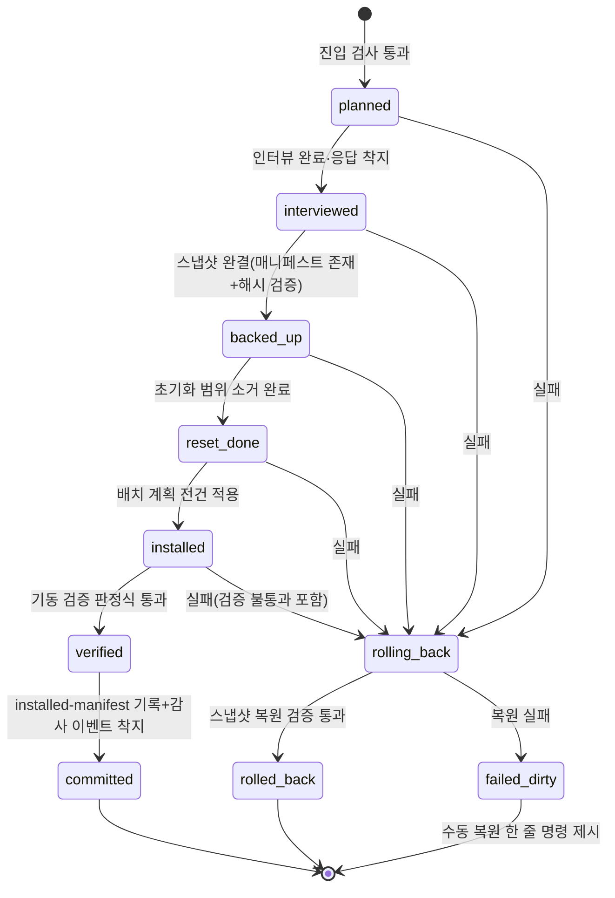
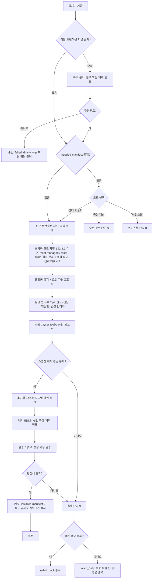
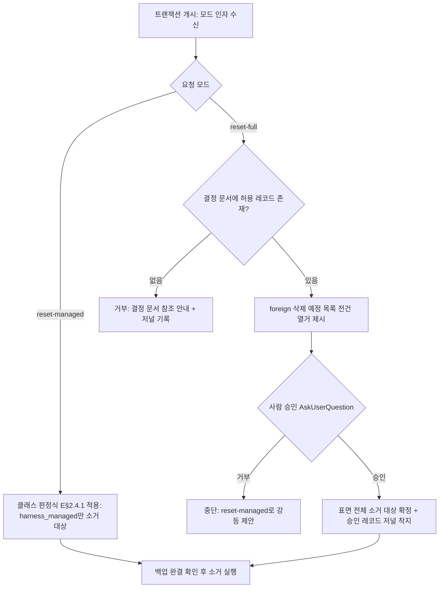
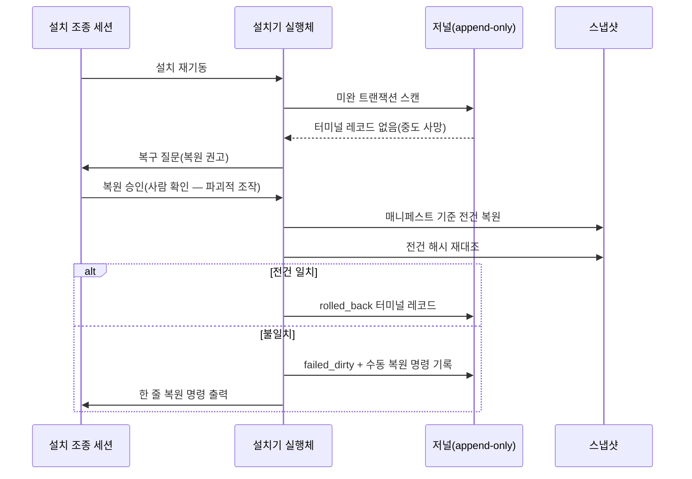
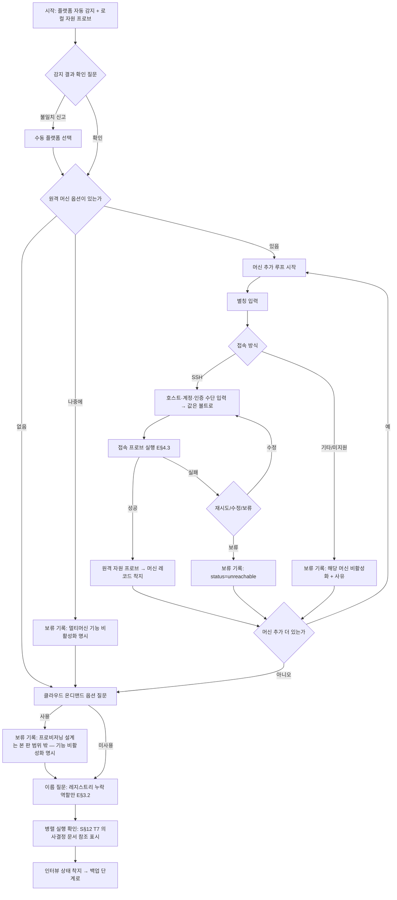
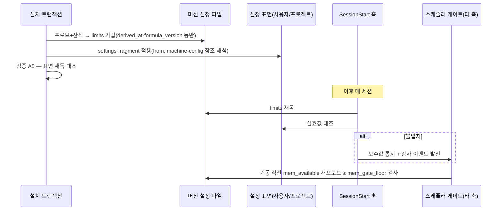

## 요약

**확정** — 아래가 본 축이 소유 정본으로 확정한 것이다. 계약 전문(필드 표·판정식·문법·전이표)은 각 계약 소절의 블록에 있고 이 절은 결론만 담는다.


- **범위**: S§8(설치·초기화·백업)·S§4.3(멀티머신 자가 구성)·S§4.4(세션 기본 설정)·S§12 T1(환경 인터뷰)·S§12 T4(커스텀 최소화 판정)를 구현 재량이 남지 않는 해상도로 설계한다.
- **핵심 결정 8건**:
  1. 설치는 `준비 → 인터뷰 → 백업 → 초기화 → 배치 → 검증 → 커밋`의 **단일 트랜잭션**이다. 각 단계는 append-only 저널에 기록되고, 터미널 레코드(`committed`/`rolled_back`/`failed_dirty`) 없는 트랜잭션이 발견되면 설치기는 다른 어떤 일도 하기 전에 복구 분기부터 태운다(E§2).
  2. **배치 목록은 어디에도 손으로 쓰지 않는다.** 훅·에이전트·스킬·설정 단편 파일이 자기 안에 선언 블록(스키마 E§2.5.1)을 갖고, 설치기는 디렉토리 글롭 열거 + 선언 파싱만으로 배치 계획을 파생한다(S§8·S§11-9).
  3. **멱등 = 재초기화 + 신규 설치**이되, 인터뷰 응답·이름 레지스트리·머신 편성은 초기화 불가침 목록에 있어 재설치가 같은 질문을 반복하지 않는다(S§2-11 절대 금지 ①, S§6.4, S§8-4·5).
  4. 환경 인터뷰는 **감지 가능한 것은 묻지 않고 실측**하며(S§3.5의 "사람이 쓰지 않는다"와 같은 원칙), 물어야 하는 것만 AskUserQuestion으로 묻는다(S§2-13). 접속 정보 값은 볼트에만 쓰고 레코드에는 참조 문자열만 남는다(S§3.4).
  5. 동시성 상한·메모리 게이트는 **설치 시점 실측 + 명시 산식**으로 도출해 머신 설정 파일에 쓰고, 게이트는 그 파일만 읽는다. 산식 파라미터의 초깃값은 전부 "보정 절차 동반 잠정값"으로 표기한다 — 상수 단정 금지(S§8, S§4.4).
  6. 플랫폼 차이(macOS · Windows 네이티브 · WSL · Windows 셸 환경)는 **선언은 중립, 실행은 플랫폼 프로파일**로 흡수한다. 존부가 불확실한 플랫폼 기능은 단정하지 않고 E§9의 "설치 전 실측 항목"으로 등재했다(총 13건).
  7. 버전은 3층(자산 semver · 릴리스 버전 · 설치 인스턴스 매니페스트)으로 관리하고, 하네스 자기 개선(S§5.5)의 업그레이드 판정식은 이 3층 대조로 기계화한다(E§8).
  8. **초기화는 2모드로 분리한다** — `reset-managed`(하네스 관리물만 소거 — 잠정 기본) / `reset-full`(Claude 설정 표면 전체 소거 — 의사결정 승인 + 삭제 목록 열람 확인 전제). S§8-2("처음 설치 상태")와 S§8 불가침 원칙(하네스가 만들지 않은 것 절대 불가촉·제3자 훅 공존 허용)의 내부 충돌은 설계 재량으로 봉합하지 않고 **S§3.7 의사결정 문서로 상신**하며, 결정 착지 전에는 보수 모드만 실행 가능하다(E§2.4).
- **타 축 경계**: 문서 착지 게이트·채번의 본체(S§3.8), 통지 채널 실현(S§3.7·S§12 T5), 큐·스케줄링 판정식(S§5.6), 이름 레지스트리 스키마(S§6.2)는 각 소유 축에 위임하고, 본 축은 그 장치들의 **설치·배선·자원 상한 입력**만 소유한다(E§1).

**실측 대기** — 14건. 정본은 E§9, 전수 색인은 부속 PA. 플랫폼 기능의 존부·의미를 단정하지 않았다 — 각 항목에 의존하는 구현은 실측 결과 기록 없이 착수하지 않는다.

**미결** — 본 축의 미결 절 정본은 E§10이며, 재생성본 전체의 미결·이력 정본은 부속 PB다.

## 1. 범위와 소유 경계 — 타 축 경계

| 계약 | 본 축(E) 소유 | 타 축 소유(위임 기준) |
|---|---|---|
| 설치 트랜잭션·언인스톨·롤백 | 전체 | — |
| 자산 선언 스키마·배치 파생 | 전체 | — |
| 환경 인터뷰·접속/자원 프로브·머신 편성 레코드 | 전체 | — |
| 민감정보 볼트 | 디렉토리 생성·.gitignore 등재·백업 편입·참조 문자열 형식 | 값 기입 금지의 착지 게이트 본체 — S§3.4 소유 축 |
| 문서 골격(docs/ 스캐폴드) | 골격 배치 행위 | 카테고리·스키마 정의 — S§3.1~3.5 소유 축 |
| 채번·ID | 커스텀 최소화 판정표의 행(E§7) | 방식 확정·경합 실측 — S§3.8·S§12 T6 소유 축 |
| 통지 3채널 | 발송 도구의 설치·자격증명 볼트 슬롯 배선 | 발송 정책·문서 스키마·수단 실측 — S§3.7·S§12 T5 소유 축 |
| 스케줄링 | 동시성 상한·메모리 게이트의 산출과 설정 표면 기입 | 판정식·에이징·큐 — S§5.6·S§12 T10 소유 축 |
| 이름 | 질문 시점(설치 플로 내 위치)·저장 위치·재질문 금지 장치 | 레지스트리 스키마·표시명 규약 — S§6.2 소유 축 |
| 감사 | 설치 저널(감사와 별개 파일) + 설치 종료 시 감사 스트림에 요약 이벤트 1건 착지 | 감사 스트림 스키마·계약 — S§7 소유 축 |

**중복 정의 금지 규율**: 위 표의 "타 축 소유" 칸에 있는 상세를 본 문서가 다시 정의하면 결함이다.
[장치 — 조립기의 축간 대조 검토(같은 필드가 두 축에서 정의되면 병합 거부) | 장치 불가 — 해당 없음]

### 1.1 디렉토리 트리 (실행 루트 = 저장소 루트, S§2-3) [계약]

```
<실행루트>/
├── docs/                                # 문서 체계 — S§3 소유 축. 설치기는 골격만 배치
├── harness/                             # 하네스 자산 원본(배치의 유일한 소스)
│   ├── assets/
│   │   ├── agents/<역할키>.md           # 에이전트 정의 + 선언 블록(E§2.5.1)
│   │   ├── skills/<스킬ID>/SKILL.md     # 스킬 + 선언 블록
│   │   ├── hooks/<훅ID>/
│   │   │   ├── hook.json                # 훅 선언 블록(이벤트·매처·등급)
│   │   │   └── run.<확장자>             # 훅 실행체
│   │   ├── settings/<단편ID>.json       # 설정 단편(target_surface·merge_strategy)
│   │   └── scaffold/docs/…              # 문서 골격 원본
│   ├── installer/
│   │   ├── install.<확장자>             # 트랜잭션 실행체(단일 진입점)
│   │   ├── profiles/<플랫폼키>.json     # 플랫폼 프로파일(E§5)
│   │   └── formulas.json                # 자원 산식 파라미터 기본값(E§4.3)
│   ├── VERSION                          # 릴리스 버전(E§8)
│   └── CHANGELOG.md                     # 변경 로그(E§8)
├── config/                              # 로컬 정책·상태 — private 클래스(.gitignore, 백업 필수)
│   ├── machines/<machine_id>.json       # 머신 편성 레코드(E§4.4)
│   ├── names/name-registry.yaml              # 이름 레지스트리 — 스키마·파일명은 조직 축 C§7.2 정본(PB)
│   └── install/
│       ├── installed-manifest.json      # 설치 인스턴스 매니페스트(E§2.7.1)
│       ├── interview-state.json         # 인터뷰 응답 상태(E§4.5)
│       └── journal/<트랜잭션ID>.jsonl   # 설치 저널(append-only)
├── vault/                               # 민감정보 볼트 — .gitignore(S§2-8)
└── .gitignore                           # 확정판 정본: A§8.1 — private 트리·vault/·derived/·config/·착지 임시 파일
```

- **백업 루트는 실행 루트 밖이다**: `<사용자 홈>/<백업디렉토리>/`(플랫폼 프로파일이 실제 경로 결정). 근거: 저장소 자체가 초기화·재설치의 대상이 될 수 있으므로 백업이 초기화 범위와 같은 트리에 있으면 자기 파괴 경로가 생긴다.
[장치 — 설치기 경로 검사: 백업 루트가 실행 루트의 하위이면 트랜잭션 시작을 거부(exit 비0) | 장치 불가 — 해당 없음]

## 2. 설치 트랜잭션 (필수 산출 ①)

### 2.1 트랜잭션 상태기계

상태 enum: `planned → interviewed → backed_up → reset_done → installed → verified → committed`
실패 분기: 임의 단계 실패 → `rolling_back → rolled_back` · 롤백 자체 실패 → `failed_dirty`.



### 2.2 설치 플로차트 (전체)



**규율 — 원자성**: 백업 → 초기화 → 배치 → 검증은 하나의 트랜잭션이며, 중간 상태로 방치되지 않는다(S§8).
[장치 — 저널의 터미널 레코드 검사: 설치기 기동 시 `journal/` 전건을 스캔해 터미널 레코드 없는 트랜잭션이 있으면 다른 모든 동작을 차단하고 복구 분기만 허용(코드 경로가 하나뿐이라 우회 불가) | 장치 불가 — 해당 없음]

**규율 — 실패 시 수동 복원 명령은 복사·붙여넣기 가능한 한 줄**(절대 경로·확인 방법 동반, S§9.5-33).
[장치 — `failed_dirty` 전이 코드가 명령 문자열을 스냅샷 경로에서 템플릿 생성해 출력·저널 기록(사람 작문 개입 없음) | 장치 불가 — 해당 없음]

### 2.3 백업 단계 [계약]

**스냅샷 형식**: 디렉토리 미러(파일 단위 복사) + 매니페스트. 아카이브 포맷(tar 등)을 쓰지 않는 근거: 부분 복원이 파일 복사 한 줄이 되고, 열람에 도구 의존이 없다.
쓰기 절차(원자성): `<백업루트>/snapshots/<타임스탬프UTC>-<트랜잭션ID>.partial/`에 전량 복사 → 전 파일 해시 검증 → `manifest.json`을 마지막에 기록 → 디렉토리를 `.partial` 제거명으로 rename. **매니페스트 존재 = 스냅샷 완결**이 판정 규약이다.

**백업 매니페스트 스키마** (`manifest.json`):

| 필드 | 타입 | 필수 | 기입 주체 |
|---|---|---|---|
| snapshot_id | string (`<타임스탬프UTC>-<트랜잭션ID>`) | 필수 | 설치기(자동) |
| created_at | string (ISO8601, 오프셋 포함) | 필수 | 설치기(자동) |
| machine_id | string | 필수 | 설치기(자동) |
| trigger | enum: `install` \| `reinstall` \| `uninstall` \| `manual` | 필수 | 설치기(자동) |
| installer_version | string (semver) | 필수 | 설치기(자동) |
| coverage[] | enum 배열: `user_claude_config` \| `project_claude_config` \| `docs_private` \| `vault` \| `local_config` | 필수 | 설치기(자동) |
| entries[] | 객체 배열(하위 표) | 필수 | 설치기(자동) |
| excluded[] | 객체 배열: `{path, reason}` | 필수(빈 배열 허용) | 설치기(자동) |
| verify | 객체: `{entries_total:int, hash_verified:int, verified_at:ISO8601}` | 필수 | 설치기(자동) |

`entries[]` 원소:

| 필드 | 타입 | 필수 | 기입 주체 |
|---|---|---|---|
| source_path | string(절대 경로) | 필수 | 설치기(자동) |
| archived_path | string(스냅샷 내 상대 경로) | 필수 | 설치기(자동) |
| kind | enum: `file` \| `dir` \| `symlink` | 필수 | 설치기(자동) |
| sha256 | string(64 hex, kind=file일 때) | 조건부 필수 | 설치기(자동) |
| size_bytes | int | 필수 | 설치기(자동) |
| mtime | string(ISO8601) | 필수 | 설치기(자동) |

**백업 범위(coverage)의 정의** — S§8-1의 "특히 버전관리 밖 자산" 요구를 그대로 옮긴다:
- `user_claude_config`: 사용자 스코프 Claude 설정 디렉토리 전체(설정 파일·에이전트·스킬·훅·memory).
- `project_claude_config`: 실행 루트의 프로젝트 스코프 설정 디렉토리.
- `docs_private`: `docs/` 아래 private 트리(.gitignore 대상 — 백업이 유일 안전망).
- `vault`: 민감정보 볼트 전체(필수 편입 — S§3.4).
- `local_config`: `config/` 전체(머신 편성·이름 레지스트리·인터뷰 상태).

**접점(A§9 — 조립 반영)**: 버전관리 밖 자산의 전수 목록·운영 중 보존 경로(private 착지 동기 미러 + 백업 대장 append, vault/·config/ 증분 미러)는 A§9가 정본이다. 본 축은 백업 루트·백업 대장 실경로 프로파일과 스냅샷·순환·복구 리허설을 소유한다 — **백업 대장(백업 루트 상주 append-only 표면)과 미러 루트 프로파일을 설치 산출물에 신설**한다(PB).

**규율 — 백업 없는 초기화 금지.**
[장치 — 상태기계 전이 조건: `backed_up` 진입은 `매니페스트 존재 ∧ verify.hash_verified == verify.entries_total` 판정식 통과가 유일 경로. 초기화 코드는 `backed_up` 상태 레코드가 저널에 있을 때만 실행된다 | 장치 불가 — 해당 없음]

**규율 — 백업 보존·순환**: 스냅샷은 최소 보존 개수(설정값, 기본 잠정 3개)와 보존 기간을 프로파일에 두고, 순환 삭제는 커밋된 트랜잭션의 스냅샷만 대상으로 한다. `failed_dirty`에 연루된 스냅샷은 자동 삭제 금지.
[장치 — 순환 삭제 코드의 대상 필터가 저널 터미널 레코드를 조인해 판정 | 장치 불가 — 해당 없음]

**규율 — 증거 바이너리로 백업 비용이 지배되지 않게**(S§10-15): 백업 매니페스트는 크기 상위 N건과 총량을 기록하고, 임계 초과 시 경고가 아니라 요약 이벤트로 착지시켜 소비 경로(자기 개선 롤업 — S§5.5)에 태운다.
[장치 — 매니페스트 생성 코드가 총량 필드를 계산·기록, 임계 초과 시 감사 이벤트 발신(발신만 본 축, 소비는 S§5.5 소유 축) | 장치 불가 — 임계값 자체의 적정성은 운용 실측 후 보정 대상]

### 2.4 초기화 단계 — 범위 정의와 불가침 목록 [계약]

**초기화 정의와 스펙 내부 충돌의 해소 구조**: S§8-2는 "처음 설치한 것과 같은 상태"를, 같은 E§8의 불가침 원칙은 "하네스가 만들지 않은 것(개인 데이터 포함)을 절대 만지지 않는다 · 하네스가 설치하지 않은 훅·설정이 공존할 수 있다"를 요구한다. 두 문언은 **사용자 원본(memory·규칙 파일·제3자 훅·수기 설정)에서 정면 충돌**하며, 사용자 전역 memory·규칙의 삭제는 폭발 반경이 큰 파괴적 결정이므로 이 충돌을 설계 재량으로 해소하지 않는다. 본 설계의 해소 구조는 셋이다:
1. 소거 대상을 **기계 판정식으로 2클래스 분류**한다(E§2.4.1) — "무엇이 하네스 것인가"에 재량이 없어야 어느 모드든 구현 가능하다.
2. 초기화를 **2모드로 분리해 양쪽 다 완전 설계**한다(E§2.4.2) — 어느 결정이 나와도 구현 변경이 정책 필드 1개(기본 모드)로 국한된다.
3. 기본 모드와 `reset-full` 허용 조건은 **S§3.7 의사결정 문서로 상신**한다(E§2.4.3). 이것은 S§2 확정 제약의 재론이 아니라 E§8 내부 두 문언의 충돌 해소이며, S§12 T7(병렬 on/off)과 동일한 상신 패턴이다. 결정 착지 전 기본값은 보수 모드다 — 파괴적 조작의 기본값은 보존(E§2.8-4와 동일 원칙, S§9.5-29).

초기화 범위는 아래 표에 열거된 대상만이며, 목록에 없는 경로는 존재 자체를 모르는 것처럼 동작한다(S§8 불가침 원칙).

#### 2.4.1 소거 클래스 판정식

```
class(item) :=
    harness_managed  if managed_mark(item)                                # 파일 자산: 고정 표식 파싱(E§2.5.1)
                     ∨ item.path ∈ installed-manifest.assets[].dest_path  # 매니페스트 조인
                     ∨ (설정 키 단위: item.key ∈ settings_keys[] ∧ managed == true)
    foreign          otherwise    # 사용자 원본 설정·memory·규칙 파일·제3자 훅 — 하네스가 만들지 않은 전부
```

- 매니페스트가 없는 최초 설치에서는 managed_mark 파싱만으로 판정한다 — 하네스 자산은 전부 표식을 갖고 배치되므로(E§2.5.1 `managed_mark` 필수), 표식 없는 것은 전부 `foreign`이다. 추측 분류 금지: 판정 근거는 표식·매니페스트 조인 2종뿐이다(E§3.3의 managed_mark 판정과 동일 원리).

#### 2.4.2 초기화 2모드

| 모드 | 소거 대상 | 스펙 근거 | 실행 전제 |
|---|---|---|---|
| `reset-managed` (잠정 기본) | `harness_managed` 클래스 전건(파일 삭제·`managed: true` 키 제거) | S§8 불가침 원칙 · S§9.5-29(파괴 최소) | 백업 완결(E§2.3) |
| `reset-full` | user_claude_config·project_claude_config 표면 전체(`foreign` 포함) | S§8-2 문언("처음 설치 상태") | 백업 완결 + `foreign` 삭제 예정 목록 전건 열람 + 사람 승인(AskUserQuestion) + E§2.4.3 결정 문서의 허용 레코드 |
| (참고) 증분 갱신 | 소거 없음 — E§3.3 | S§6.4 | — |

- 두 모드 모두 **백업(E§2.3)은 설정 표면 전체를 뜬다** — 복원 가능성은 모드에 종속되지 않는다.
- `reset-full`의 사람 확인은 일반 확인이 아니다: 설치기가 `foreign` 클래스 삭제 예정 목록을 **전건 열거해 제시**하고, 사용자가 그 목록을 본 상태에서 승인해야 진행한다. 에이전트·통지 메시지는 승인이 아니다(S§9.5-29).
- `reset-managed`의 정직 공지(S§9.4-21): 이 모드는 "처음 설치 상태"를 만들지 않는다 — 잔존한 사용자 원본 훅·설정이 하네스 동작과 간섭할 수 있다. 검증 A3~A5가 하네스 자산의 등록·실효를 확인하므로 간섭에 의한 미적용은 검증 단계에서 검출되며, 검출 시 해소는 사람 결정 사안으로 상신한다(설치기가 임의로 `foreign`을 덮지 않는다 — E§3.3 `record_conflict`와 동일 규약).

#### 2.4.3 의사결정 상신 — 기본 모드와 reset-full 허용 조건

- **상신 형식**: S§3.7 의사결정 요청 문서(스키마·통지는 해당 소유 축). 질문: "초기화의 기본 모드와 `reset-full`의 허용 조건".
- **선택지 3안**(장단 명시 동반):
  - ①**전체 초기화 기본** — S§8-2 문언 충실. 대가: 사용자 memory·규칙·제3자 훅이 매 재설치마다 소거된다(백업 복원은 가능하나 사용자 신뢰 손상은 비가역 — S§5.4가 지적하는 기피 요인).
  - ②**하네스 관리물만 소거(전체 초기화 폐지)** — 불가침 원칙 충실. 대가: S§8-2의 "처음 설치 상태" 문언이 영구히 미충족이고, 사용자 원본과의 간섭 잔존 위험을 상시 안는다.
  - ③**모드 분리(본 설계 권고안)** — 기본 `reset-managed` + `reset-full`은 목록 열람 승인 전제의 명시 선택. 근거: 두 스펙 문언 중 어느 한쪽의 폐기는 설계 재량 밖이고, 모드 분리는 어느 후속 결정에도 구현 변경이 정책 필드 1개로 국한된다.
- **결정 착지 전 동작**: `reset-managed`만 실행 가능. `reset-full` 요청은 거부하고 결정 문서 참조를 안내한다(E§4.2 Q7의 병렬 확인과 동일 패턴 — 설치기는 답을 만들지 않고 결정 결과를 적용만 한다).



#### 2.4.4 불가침 목록과 제3자 공존물

**불가침 목록(모드 불문 — 초기화·배치가 절대 접촉하지 않는 것)**:
1. 백업 루트(자기 파괴 방지 — E§1.1)
2. `vault/`(백업은 하되 소거·수정 금지)
3. `docs/` 트리 전체(원장·감사 — 하네스의 데이터이지 설정이 아니다)
4. `.git/` 및 저장소 버전관리 메타데이터
5. `config/names/`·`config/machines/`·`config/install/interview-state.json`(재질문 금지의 물적 기반 — E§3.2)
6. 하네스가 만들지 않은 저장소·수동 관리 런타임(가상환경 등)·개인 데이터 일체(S§8: 의존성 동기화가 수동 관리 환경을 파괴한 사고)

**제3자 공존물 처리**: Claude 설정 표면 안에 하네스가 설치하지 않은 훅·설정이 있을 수 있다(S§8). 처리 규약: ①모드 불문 전량 백업에 포함된다(E§2.3) ②소거 여부는 모드가 결정한다 — `reset-managed`(잠정 기본)에서는 `foreign` 클래스로 판정되어 **불가촉**, `reset-full`에서는 삭제 예정 목록 전건 열람 + 사람 승인 후에만 소거(E§2.4.2) ③`reset-full`로 소거된 경우에도 언인스톨의 설치 전 스냅샷 복원으로 되돌아온다(E§2.8-3) ④증분 갱신 모드(E§3.3)에서는 접촉하지 않는다.

**규율 — 초기화 모드 규율**: `foreign` 클래스의 소거는 `reset-full` 모드 + 결정 문서 허용 + 열람 승인의 3전제가 전부 충족될 때만 가능하다.
[장치 — ①모드는 저널 트랜잭션 개시 레코드의 필수 필드(E§2.10 `mode`)이고 소거 실행 함수가 클래스 판정식(E§2.4.1) 결과와 모드를 대조해 `reset-managed`에서 `foreign` 삭제 시도는 실행 거부 + `scope_violation` 레코드 ②`reset-full` 분기 진입 코드는 결정 문서 허용 레코드 참조와 열람 승인 레코드(저널) 둘 다를 전제 조건으로 요구 — 부재 시 분기 진입 불가(코드 경로가 하나뿐) ③IV1 리허설이 청정 홈에 **합성 foreign 자산**(표식 없는 훅·설정·memory 파일)을 사전 배치한 뒤 `reset-managed`를 실행해 "foreign 접촉 0건 ∧ 합성 자산 전건 잔존"을 판정식에 포함 — 음성 사례 없는 검증은 공허하다(S§9.3-14의 양성 사례 구성 원칙) | 장치 불가 — 승인이 "사람의 실제 발화인가"의 최종 판별은 권한 계층 소관(E§2.9와 동일)]

**규율 — 범위 밖 접촉 금지.**
[장치 — 설치기의 파일 조작이 단일 함수 경유로 강제되고, 그 함수가 모든 경로를 초기화 범위·배치 계획·백업 루트 화이트리스트와 대조해 범위 밖이면 실행 거부 + 저널에 `scope_violation` 레코드. 리허설(E§2.6)에서 범위 밖 접촉 0건을 판정식에 포함 | 장치 불가 — 해당 없음]

### 2.5 배치 단계 — 선언에서 파생되는 배치 목록 [계약]

**원칙**: 손으로 유지하는 파일 나열은 존재 자체가 금지다(S§8 최악 사고·S§10-7). 배치 목록은 `harness/assets/**` 글롭 열거 + 각 파일의 선언 블록 파싱으로만 만들어진다.

#### 2.5.1 자산 선언 블록 스키마

**공통 필드**(모든 자산 종류):

| 필드 | 타입 | 필수 | 기입 주체 |
|---|---|---|---|
| asset_id | string(`<종류>.<이름>`, 소문자·하이픈) | 필수 | 자산 작성자(개발 시점) |
| asset_kind | enum: `agent` \| `skill` \| `hook` \| `settings-fragment` \| `scaffold` | 필수 | 자산 작성자 |
| version | string(semver) | 필수 | 자산 작성자 |
| platforms[] | enum 배열: `macos` \| `windows-native` \| `windows-wsl` \| `windows-shell` \| `linux` \| `all` | 필수 | 자산 작성자 |
| scope | enum: `user` \| `project` | 필수 | 자산 작성자 |
| managed_mark | 고정 문자열(하네스 관리 표식) | 필수 | 자산 작성자 |
| requires[] | asset_id 배열(참조 그래프의 간선) | 선택 | 자산 작성자 |

**종류별 추가 필드**:

| asset_kind | 추가 필드 | 타입/enum | 필수 |
|---|---|---|---|
| `hook` | hook_event | enum: `SessionStart` \| `SessionEnd` \| `PreToolUse` \| `PostToolUse` \| `UserPromptSubmit` \| `Stop` \| `SubagentStop` \| `PreCompact` \| `Notification` | 필수 |
| `hook` | matcher | string(도구명 매처 — 이벤트가 매처를 지원할 때) | 조건부 |
| `hook` | enforcement | enum: `blocking`(차단형) \| `observing`(관측형) | 필수 |
| `hook` | graduation | string(관측형일 때 승격 조건 — S§9.3-15) | observing이면 필수 |
| `hook` | timeout_s | int(0=무제한) | 필수 |
| `agent` | role_key | string(로스터 역할 키 — S§6.1) | 필수 |
| `agent` | skills_required[] | asset_id 배열(역할 필수 스킬 — S§6.3) | 필수(빈 배열 허용) |
| `agent` | display_name_slot | 고정값 `from-name-registry`(설치 시 레지스트리에서 해석 — S§6.2 소유 축) | 필수 |
| `settings-fragment` | target_surface | enum: `user-settings` \| `project-settings` \| `local-settings` | 필수 |
| `settings-fragment` | merge_strategy | enum: `set-if-absent` \| `overwrite-managed` \| `append-array` | 필수 |
| `settings-fragment` | keys | 객체(기입할 키·값 — 값은 리터럴 또는 `{from: "machine-config:<필드경로>"}` 참조) | 필수 |
| `scaffold` | target_root | string(실행 루트 기준 상대 경로 — `docs/` 하위만 허용) | 필수 |

선언 블록의 물리 형식: 마크다운 자산은 frontmatter, JSON 자산은 최상위 `declaration` 키, 스크립트 실행체는 동반 `hook.json`. **실행체 안에 주석으로 쓰는 형식은 금지**(파서가 언어별로 갈라지고 S§9.3-13 "주석은 썩는다").

#### 2.5.2 배치 계획 파생 의사코드

```
plan = []
for file in glob("harness/assets/**"):
    decl = parse_declaration(file)          # 실패 → 빌드 게이트에서 이미 차단(E§8.3)
    if current_platform not in decl.platforms and "all" not in decl.platforms:
        continue                            # 플랫폼 불일치 자산은 배치 대상 아님
    dest = profile.dest_for(decl.asset_kind, decl.scope, decl.asset_id)  # 프로파일이 경로 결정(E§5)
    plan.append({asset_id, kind: decl.asset_kind, src: file, dest, src_hash: sha256(file)})
# 참조 그래프 검증: requires·skills_required의 모든 asset_id가 plan에 존재해야 한다
assert resolve_all(plan)                    # 미해결 참조 1건이라도 있으면 배치 시작 전 실패
apply_order = [scaffold, skill, agent, hook, settings-fragment]   # 의존 역순 배치
```

- 설정 단편 적용: `set-if-absent`는 기존 키 보존, `overwrite-managed`는 managed_mark가 있는 값만 교체(사용자 수기 값 보존), `append-array`는 중복 원소 제거 후 추가. 훅 등록은 settings-fragment로 표현한다(훅 실행체 배치 + 설정 표면 등록이 같은 트랜잭션 — S§10-11 "설정은 코드와 한 몸").
- **본문·인자는 셸 비경유로 전달한다**(S§3.8): 배치·기입은 파일 복사와 구조화 쓰기 API로만 하고, 값을 셸 문자열에 보간하는 경로를 두지 않는다.
[장치 — 설치기에 셸 실행 헬퍼가 없고 파일/JSON 조작 함수만 노출(코드 리뷰 게이트: 셸 호출 심볼 존재 시 빌드 실패) | 장치 불가 — 해당 없음]

**규율 — 수기 배치 목록 금지.**
[장치 — 저장소에 배치 목록 파일이 존재하면 빌드 게이트가 실패 처리(파일명 패턴 검사) + 배치 계획은 런타임 파생만 존재(직렬화된 계획 파일을 읽는 코드 경로 자체가 없음) | 장치 불가 — 해당 없음]

### 2.6 검증 단계 — 청정 디렉토리 기동 검증 [계약]

두 겹으로 실행한다(S§8 "빈 홈 디렉토리에서의 실설치 기동 검증"):

- **IV1 — 릴리스 게이트(패키징 시점)**: 임시 청정 홈 디렉토리를 만들고 거기에 전체 트랜잭션을 실행한 뒤 기동 프로브를 돌린다. 릴리스마다 1회, 실패 시 릴리스 불가.
- **IV2 — 설치 현장(트랜잭션의 verify 단계)**: 실제 대상 환경에서 배치 직후 같은 프로브를 돌린다. 실패 시 자동 롤백.

**기동 프로브 판정식**:

```
verify_pass :=
      A1: 헤드리스 프로브 세션이 정상 종료(플랫폼 CLI 비대화 실행 — 실측 항목 M2)
    ∧ A2: 로스터 기대 집합 ⊆ 등록된 에이전트 집합       # 배치 계획에서 기대 집합 파생
    ∧ A3: 훅 기대 집합 ⊆ 설정 표면의 등록 집합           # settings 표면 파싱으로 확인
    ∧ A4: SessionStart 센티널 이벤트가 감사 경로에 착지    # 훅이 실제로 '실행'됨의 증거
    ∧ A5: 설정 단편의 keys 전건이 유효값으로 관측됨        # 기입≠적용이므로 재독 대조
    ∧ A6: 저널에 scope_violation 레코드 0건
    ∧ A7: (IV1 한정) 청정 홈 기준 — 설치 전 존재하지 않던 경로 외 변경 0건
```

- A4가 핵심이다: 등록(설정에 존재)과 실행(이벤트 발생 시 실제 구동)은 다른 사실이다(S§9.4-21 "훅이 검출할 능력이 있다는 것과 실제로 걸렸다는 것은 다른 사실"). 센티널 훅은 SessionStart에서 고정 스키마 이벤트 1건을 착지시키는 최소 훅으로, 자산 로스터에 상시 포함된다.
- 프로브가 확인 불가한 축(예: 헤드리스 실행 자체가 불가한 플랫폼)은 그 축을 "검증 불가"로 매니페스트에 명시하고 통과로 계산하지 않는다 — 침묵과 무위반을 구별한다(S§7).

**규율 — 검증 없는 커밋 금지.**
[장치 — 상태기계: `verified` 진입은 verify_pass 판정식 결과 레코드(저널)의 존재가 전제이고, `committed` 전이 코드가 그 레코드를 재확인한다 | 장치 불가 — 해당 없음]

### 2.7 커밋 단계 [계약]

#### 2.7.1 설치 인스턴스 매니페스트 (`config/install/installed-manifest.json`)

| 필드 | 타입 | 필수 | 기입 주체 |
|---|---|---|---|
| release_version | string(harness/VERSION 값) | 필수 | 설치기(자동) |
| installer_version | string(semver) | 필수 | 설치기(자동) |
| transaction_id | string | 필수 | 설치기(자동) |
| installed_at | string(ISO8601) | 필수 | 설치기(자동) |
| machine_id | string | 필수 | 설치기(자동) |
| platform | enum(E§2.5.1 platforms와 동일) | 필수 | 설치기(자동) |
| snapshot_id | string(직전 백업 스냅샷) | 필수 | 설치기(자동) |
| reset_mode | enum: `reset-managed` \| `reset-full` \| `incremental`(E§2.4.2 — 이 인스턴스를 만든 초기화 모드) | 필수 | 설치기(자동) |
| assets[] | 배열: `{asset_id, kind, version, src_hash, dest_path, dest_hash}` | 필수 | 설치기(자동) |
| settings_keys[] | 배열: `{surface, key, managed}` | 필수 | 설치기(자동) |
| verify_result | 객체: 판정식 축별 결과 + `unverifiable[]` | 필수 | 설치기(자동) |
| pending[] | 배열: 보류 항목 `{item, reason, disabled_features[]}` | 필수(빈 배열 허용) | 설치기(자동) |

커밋의 마지막 동작: 감사 스트림에 설치 요약 이벤트 1건 착지(스키마는 S§7 소유 축, 본 축은 발신 사실만 규정) + 저널 터미널 레코드 `committed`.

### 2.8 언인스톨

절차(자체가 하나의 트랜잭션이며 저널을 남긴다):
1. 현재 상태를 `trigger: uninstall` 스냅샷으로 백업(E§2.3과 동일 형식).
2. installed-manifest의 `assets[].dest_path`·`settings_keys[]`만 제거한다 — **매니페스트에 없는 것은 건드리지 않는다**. 설정 키 제거는 `managed: true`인 키만.
3. 선택 분기(질문): "설치 전 스냅샷으로 복원할 것인가?" — 예이면 `snapshot_id` 스냅샷을 복원(제3자 공존물 복귀 경로).
4. `docs/`·`vault/`·`config/`는 사용자 데이터이므로 제거하지 않는다. 질문으로도 묻지 않는다(파괴적 조작의 기본값은 보존 — 삭제를 원하면 사람이 별도로 한다).
5. 매니페스트를 `uninstalled-<타임스탬프>.json`으로 개명 보존(이력 — ID 소각 원칙과 동형).

[장치 — 제거 대상이 매니페스트 조인으로만 산출되는 단일 코드 경로. 매니페스트 부재 시 언인스톨 거부(추측 제거 금지) | 장치 불가 — 해당 없음]

### 2.9 롤백

- **트리거**: 트랜잭션 내 임의 단계 실패, 검증 불통과, 사용자 중단.
- **절차**: 저널을 역순 재생하지 않는다 — **스냅샷 전체 복원**이 유일한 롤백 수단이다(부분 역재생은 상태 조합이 폭발하고, 스냅샷 복원은 멱등이다).
- **복원 검증**: 복원 후 매니페스트 `entries[]` 전건 해시 재대조 → 전건 일치 시 `rolled_back`, 아니면 `failed_dirty` + 수동 복원 한 줄 명령 출력.
- **중도 사망 복구**: 다음 설치기 기동 시 저널 스캔이 미완 트랜잭션을 발견 → 진행 단계와 무관하게 "스냅샷 복원" 분기를 기본 제안(재개보다 복원이 항상 안전 — 배치 단계는 멱등이라 복원 후 재실행에 비용만 든다).



**규율 — 파괴적·비가역 조작(초기화·복원·언인스톨 실행)은 사람 확인 후 실행**(S§9.5-29). 에이전트·통지 메시지는 승인이 아니다.
[장치 — 해당 단계 진입 코드가 대화형 확인 응답 레코드(저널)를 전제 조건으로 요구. 비대화 모드(IV1 릴리스 게이트)는 청정 임시 홈에서만 허용되며 실환경 경로에서는 비대화 플래그가 무시된다 | 장치 불가 — "사람의 실제 발화인가"의 최종 판별은 권한 계층 소관(S§9.5-29) — 설치기는 대화 채널 응답을 신뢰하는 것까지만 가능]

### 2.10 설치 저널 레코드 스키마 (`journal/<트랜잭션ID>.jsonl`, 1레코드 1줄) [계약]

| 필드 | 타입 | 필수 | 기입 주체 |
|---|---|---|---|
| ts | string(ISO8601) | 필수 | 설치기(자동) |
| txn_id | string | 필수 | 설치기(자동) |
| mode | enum: `reset-managed` \| `reset-full` \| `incremental` \| `uninstall` | 트랜잭션 개시 레코드에 필수 | 설치기(자동 — E§2.4.2 확정 결과) |
| phase | enum(E§2.1 상태) | 필수 | 설치기(자동) |
| step | string(단계 내 세부 스텝명) | 필수 | 설치기(자동) |
| action | enum: `probe` \| `ask` \| `copy` \| `hash` \| `delete` \| `write` \| `verify` \| `scope_violation` \| `terminal` | 필수 | 설치기(자동) |
| target | string(절대 경로 또는 질문 키) | 조건부 | 설치기(자동) |
| outcome | enum: `ok` \| `fail` \| `skipped` | 필수 | 설치기(자동) |
| detail | string(값 리터럴 금지 — 볼트 참조·해시만) | 선택 | 설치기(자동) |

개행 이스케이프 강제(1레코드 1줄 계약 — S§3.6), 원자 append. 저널은 감사 스트림이 아니라 설치기 전용 파일이며, 감사 편입은 커밋 시 요약 이벤트 1건뿐(E§7 소유 축 계약에 따름 — producer/consumer 선언 동반).

## 3. 멱등·재설치 규칙 (필수 산출 ②)

### 3.1 기본 규칙

- **재설치 = 재초기화 + 신규 설치**(S§8-4). 같은 릴리스로 몇 번을 다시 설치해도 결과 상태(배치 파일 집합·설정 키 집합·매니페스트의 assets 해시)는 동일하다.
- 멱등 판정식: `state_after(install(release, mode, env)) == state_after(install(release, mode, install(release, mode, env)))` — IV1 릴리스 게이트에서 2회 연속 설치로 실측 검증한다(해시 집합 비교). **모드는 멱등 비교의 고정 인자다**: 비교 대상은 하네스 관리물 집합(매니페스트 `assets[]`·`settings_keys[]`)이며, `foreign` 클래스(E§2.4.1)는 `reset-managed`에서 불가촉이므로 비교 밖이다(불변이 곧 요구사항 — E§2.4.4 불가침).

### 3.2 재질문 금지 (S§2-11 절대 금지 ①) [계약]

- 인터뷰 응답(`interview-state.json`)·이름 레지스트리·머신 편성 레코드는 초기화 불가침 목록(E§2.4.4)에 있으므로 재설치를 건너 생존한다.
- 재실행 인터뷰는 **변경 인터뷰**다(S§8): 기존 응답을 기본값으로 제시하고 변경 여부만 묻는다. 신규 질문은 (a)이전 실행에서 보류된 항목 (b)릴리스가 새로 도입한 질문 키에 한정된다.
- 이름 질문은 레지스트리에 **없는 역할만** AskUserQuestion으로 묻는다(S§6.4의 에이전트 생략 논리와 동형).

판정 의사코드:
```
for role in roster_expected:                 # 로스터는 에이전트 자산 선언에서 파생
    if registry.has(role): continue          # 재질문 금지
    ask_user_question(role)                  # AskUserQuestion — S§2-13
```
[장치 — 질문 발화 코드가 레지스트리 조회를 통과한 역할 키만 인자로 받는 구조(전 역할 나열을 받는 시그니처 자체가 없음) | 장치 불가 — 해당 없음]

### 3.3 에이전트 존재 시 생략 로직 (S§6.4) — 증분 갱신 모드 [계약]

전체 재설치 외에 **증분 갱신 모드**를 둔다(초기화 없이 자산 차분만 적용). 판정식:

```
for item in plan:                                  # E§2.5.2의 파생 계획
    existing = read(item.dest)
    if not exists(existing):
        place(item)                                # 없는 것만 추가 — S§6.4
    elif not has_managed_mark(existing):
        record_conflict(item)                      # 사용자 커스텀 — 보존 + 충돌 레코드, 덮어쓰기 금지
    elif hash(existing) == item.src_hash:
        skip(item)                                 # 동일 — 생략(멱등)
    else:
        place(item)                                # 하네스 관리물의 구판 — 갱신
```

- `record_conflict`는 매니페스트 `pending[]`에 남고, 해소는 사람 결정 사안으로 의사결정 문서 경로(S§3.7 소유 축)에 태운다. 설치기가 임의로 덮지 않는다.
- 증분 모드에서도 저널·검증(E§2.6 IV2)·매니페스트 갱신은 동일하게 수행한다.

[장치 — 4분기 판정이 단일 함수이며 분기별 저널 레코드가 남아 사후 감사 가능. managed_mark 유무 판정은 파일 내 고정 표식 파싱(추측 금지) | 장치 불가 — 사용자 커스텀 자산과 하네스 자산의 "의미상 동일" 판정은 불가 — 해시·표식만으로 판정하고 의미 판정은 사람에게 상신]

## 4. 환경 인터뷰 설계 (필수 산출 ③ · S§4.3 · S§12 T1)

### 4.1 원칙

1. **감지 가능한 것은 묻지 않는다** — 플랫폼·자원은 프로브가 실측하고, 사람에게는 확인만 받는다(S§3.5 "머신·세션·시각은 사람이 쓰지 않는다"와 동일 원칙의 확장).
2. **어떤 값도 가정하지 않는다**(S§8) — 묻지 않은 값을 기본값으로 채우지 않는다. 미응답은 보류로 기록하고 의존 기능을 명시적으로 비활성화한다.
3. 질문 수단은 AskUserQuestion(S§2-13). 설치 조종은 Claude 세션 내 설치 스킬이 담당하고, 파괴 구간 실행은 설치기 실행체가 담당한다(실측 항목 M12: 스킬 실행 중 AskUserQuestion 가용성).
4. 접속 정보 **값**은 볼트에만 쓴다. 인터뷰 기록·머신 레코드·저널에는 `vault:<상대경로>#<키이름>` 형식의 참조 문자열만 남는다(S§3.4).
[장치 — 인터뷰 기록기의 쓰기 API가 비밀 클래스 응답을 볼트 쓰기 + 참조 반환으로만 처리(레코드에 값을 넣는 인자 경로가 없음) | 장치 불가 — 사용자가 비밀이 아닌 질문 답변에 비밀값을 섞어 적는 경우 — 완화: 비밀 클래스 질문의 명시 + 착지 게이트의 자격증명 스캔(S§3.4 소유 축)]

### 4.2 질문 트리



- Q7 주기: 병렬 on/off는 의사결정권자 확인 사안(S§12 T7)이므로 설치기는 답을 만들지 않고, 의사결정 문서(S§3.7 소유 축)의 결정 결과를 참조해 적용만 한다. 결정 미착지 상태면 보류 + 보수 기본(동시성 상한 산식은 산출하되 적용 표면 기입은 결정 대기).
- 클라우드 온디맨드 프로비저닝(그때그때 생성 — S§4.3)은 본 판에서 **질문·보류 기록까지만** 설계한다. 생성 자동화는 후속 요청으로 파이프라인에 태운다(범위 명시 — S§9.4-21 정직 공지).

### 4.3 접속 프로브 [계약]

절차(머신당, 모두 저널 기록):
```
P1 도달성: 비대화 접속 시험 — SSH이면 BatchMode·짧은 ConnectTimeout으로 원격에서 true 실행
P2 신원: 원격 호스트명·플랫폼 식별 명령 실행(프로파일이 명령 결정 — E§5)
P3 자원: 원격 자원 프로브(E§4.4의 probe 필드 전건 실측)
P4 쓰기: 원격 작업 루트 후보에 쓰기·삭제 시험(1바이트 파일)
판정: P1∧P2∧P3∧P4 → status=active / 그 외 → unreachable + 실패 단계 기록
```
- 프로브는 항상 **측정 계약**(무엇을 · 어떤 명령으로 · 언제)을 레코드에 동반한다(S§9.2-11).
- 접속 수단이 대화형 암호를 요구하면 실패로 처리하고 "비대화 인증 수단 필요"를 사유로 남긴다(무인 재접속이 불가능한 머신은 편성 불가).

### 4.4 자원 프로브 산식 — 동시성 상한·메모리 게이트 [계약]

**입력(머신당 실측)**: `mem_total_mb` · `mem_available_mb` · `cpu_logical` · `disk_free_mb`(실행 루트 기준). 실측 명령은 플랫폼 프로파일이 소유한다(E§5).

**산식**(파라미터는 전부 `harness/installer/formulas.json`에 — 코드 하드코딩 금지, S§8):

```
concurrency_cap = clamp(
    min(
        floor( (mem_available_mb − mem_reserve_floor_mb) / per_session_mem_budget_mb ),
        cpu_logical × cpu_factor
    ),
    1, hard_ceiling
)
mem_gate_floor_mb = mem_reserve_floor_mb + per_session_mem_budget_mb
     # 세션 기동 직전 재프로브 값이 이 밑이면 기동 보류(집행은 스케줄러 — S§5.6 소유 축)
```

**파라미터 표** — 수치를 단정하지 않는다. 초깃값은 전부 "잠정 + 보정 절차"다(S§9.2-11 측정 계약, 선행 운영의 추정치 정면 모순 사례):

| 파라미터 | 의미 | 초깃값 지위 | 보정 절차 |
|---|---|---|---|
| per_session_mem_budget_mb | 세션 1개 메모리 예산 | 잠정(보수값) — 리터럴은 formulas.json에만 | IV2 검증 프로브 세션의 실측 RSS × 안전계수로 교체, `measured_at` 동반 기입(실측 항목 M11) |
| mem_reserve_floor_mb | OS·상주 프로세스 여유분 | 잠정 | 유휴 상태 실측 `mem_total − mem_available`에 여유율 가산 |
| cpu_factor | 논리 코어당 세션 계수 | 잠정 | 운용 실측(세션 CPU 점유) 후 보정 — 자기 개선 루프 대상 |
| hard_ceiling | 절대 상한 | 잠정 | 플랫폼·계정 한도 실측 후 보정 |

**규율 — 상한은 산식·설정 파일 경유로만, 문서 산문의 사양 수치는 입력이 아니다**(S§4.4·S§8).
[장치 — 게이트(세션 기동 경로)가 머신 설정 파일의 `limits` 블록만 읽으며, 파일 부재·파싱 실패 시 fail-closed로 상한 1을 적용하고 감사 이벤트 발신 | 장치 불가 — 해당 없음]

**규율 — 산출값에는 도출 시각·산식 버전을 동반한다**(재현 가능성).
[장치 — 산식 함수가 `derived_at`·`formula_version`을 반환값에 포함하고 스키마가 필수로 요구(착지 시 검증) | 장치 불가 — 해당 없음]

### 4.5 레코드 스키마 [계약]

#### 머신 편성 레코드 (`config/machines/<machine_id>.json`)

| 필드 | 타입 | 필수 | 기입 주체 |
|---|---|---|---|
| machine_id | string(호스트명+하드웨어 식별자의 해시 — 결정론) | 필수 | 설치기(자동) |
| display_alias | string | 필수 | 사람(인터뷰) |
| platform | enum: `macos` \| `windows-native` \| `windows-wsl` \| `windows-shell` \| `linux` | 필수 | 설치기(감지) + 사람(확인) |
| role | enum: `primary`(설치 본체) \| `worker` \| `standby` | 필수 | 사람(인터뷰) |
| transport | enum: `local` \| `ssh` | 필수 | 사람(인터뷰) |
| credential_ref | string(`vault:` 참조 — 값 금지) | transport≠local이면 필수 | 설치기(자동 — 볼트 쓰기 후 참조 생성) |
| work_root | string(그 머신의 실행 루트 절대 경로) | 필수 | 사람(인터뷰) + 프로브(P4 검증) |
| probe | 객체: `{probed_at, method[], mem_total_mb, mem_available_mb, cpu_logical, disk_free_mb}` | 필수 | 프로브(자동) |
| limits | 객체: `{concurrency_cap, mem_gate_floor_mb, per_session_mem_budget_mb, derived_at, formula_version}` | 필수 | 산식(자동) |
| status | enum: `active` \| `unreachable` \| `held` | 필수 | 설치기(자동 — 프로브 판정) |
| pending[] | 배열: `{item, reason}` | 필수(빈 배열 허용) | 설치기(자동) |
| created / updated | string(ISO8601) | 필수 | 설치기(자동) |

- 저장 위치는 `config/`(private 클래스 — push 제외·백업 필수). 별칭·경로도 외부 비공개 정보로 취급한다.
- 편성 레코드의 **소비자**: 스케줄러(동시성 상한·게이트 — S§5.6 소유 축)·세션 기동 경로(E§6). 소비자 없는 필드는 두지 않는다(S§7 producer/consumer 계약).

#### 인터뷰 상태 (`config/install/interview-state.json`)

| 필드 | 타입 | 필수 | 기입 주체 |
|---|---|---|---|
| schema_version | string | 필수 | 설치기(자동) |
| answers | 객체: 질문 키 → `{value 또는 vault_ref, answered_at, source: enum(asked \| confirmed-detection \| carried-over)}` | 필수 | 설치기(자동 — 응답 착지) |
| pending[] | 배열: `{question_key, reason, disabled_features[]}` | 필수(빈 배열 허용) | 설치기(자동) |
| last_interview_at | string(ISO8601) | 필수 | 설치기(자동) |

## 5. 플랫폼별 차이 흡수 (필수 산출 ④)

**전략**: 자산 선언·산식·스키마는 전부 플랫폼 중립으로 두고, 차이는 `harness/installer/profiles/<플랫폼키>.json` 프로파일 한 곳에 몰아넣는다(정책과 메커니즘 분리 — S§9.3-16). 실행체는 기동 시 플랫폼을 감지해 프로파일 하나를 로드한다. 프로파일 밖에서 플랫폼 분기를 만드는 코드는 금지.
[장치 — 빌드 게이트: 설치기 코드에서 플랫폼 감지 심볼이 프로파일 로더 외부에 나타나면 실패 | 장치 불가 — 해당 없음]

**프로파일 필드**: 설정 표면 경로(사용자/프로젝트 스코프) · 자산 종류별 배치 경로 사전 · 자원 프로브 명령 사전 · 원격 접속 명령 템플릿 · 백업 루트 기본 경로 · 경로 정규화 규칙 · 훅 실행체 호출 형식.

**차이 축 × 플랫폼 표** (⚠ = 설치 전 실측 항목, E§9에 등재):

| 차이 축 | macOS | Windows 네이티브 | WSL | Windows 셸 환경(경량 유닉스 계열) |
|---|---|---|---|---|
| 홈·설정 경로 | 유닉스 홈 | 사용자 프로필 디렉토리(구분자·환경변수 상이) | 유닉스 홈(단 윈도 쪽 파일 접근은 번역 경로) | 유닉스형 홈(실체는 윈도 파일계) |
| 셸·훅 실행 | POSIX 셸 | ⚠ M4: 훅 명령의 실행 셸 실측 | POSIX 셸 | ⚠ M4와 동일 실측 |
| 경로 표기 | POSIX | 드라이브 문자·역슬래시 | ⚠ M5: 윈도↔리눅스 경로 번역 실측 | 혼종(도구별 상이) ⚠ M5 |
| 자원 프로브 | vm_stat·sysctl 계열 | CIM/WMI 질의 계열 | /proc/meminfo(⚠ 호스트 총량과의 관계 실측 M5) | ⚠ 실측 |
| 파일 시스템 의미론 | 대소문자 비구분(기본) | 대소문자 비구분·잠금 엄격 | 리눅스 의미론(윈도 쪽 마운트는 상이) | 윈도 의미론 |
| rename 원자성 | 보장(동일 볼륨) | ⚠ M9a: 열린 파일 잠금과 rename 실측 | 보장(리눅스 파일계 내) | ⚠ 실측 |

**흡수 규칙**:
1. 훅 실행체는 단일 크로스플랫폼 런타임으로 작성하는 것을 1안으로 한다(셸 차이를 통째로 우회). 그 런타임의 공통 존부는 실측 항목 M13 — 확인 전에는 2안(플랫폼별 실행체 변형을 `platforms[]` 선언으로 분리 배치)을 병행 설계로 유지한다.
2. 경로는 항상 절대 경로로 다루고, 프로파일의 정규화 함수를 경유해서만 문자열화한다.
3. 대소문자 비구분 파일계에서의 ID 충돌(대소문자만 다른 asset_id)은 빌드 게이트에서 차단한다(전 플랫폼 배치 가능성 보장).
[장치 — 빌드 게이트: asset_id 소문자 정규화 후 중복 검사 | 장치 불가 — 해당 없음]

## 6. 세션 기본값 배선 (필수 산출 ⑤ · S§4.4 · S§2-16)

세 기본값을 **설정 단편 자산**(E§2.5.1 `settings-fragment`)으로 배선한다. 어느 설정 표면에 어떤 키가 존재하는지는 플랫폼·판 의존이므로, 각각 후보 표면을 명시하고 존부를 실측 항목으로 둔다 — 단정 금지.

| 기본값 | 요구(스펙) | 후보 표면(우선순위 순) | 실측 항목 |
|---|---|---|---|
| 원격 제어 자동 활성화 | S§2-16 | ①사용자 스코프 설정 파일의 해당 키 ②SessionStart 훅에서 활성화 명령 실행 ③기동 래퍼(최후 수단 — 커스텀 최소화 원칙상 기피) | M6: 키 존부·의미 |
| 응답 대기 무제한 | S§2-16 (긴 사고·긴 실행이 정상) | ①타임아웃 관련 환경변수(설정 파일 env 블록으로 주입) ②설정 키 ③에이전트 정의의 도구 타임아웃 지시 | M7: 어느 표면이 서브에이전트 대기에 실효인지 |
| 병렬 상한 = limits.concurrency_cap | E§4.4 (무상한 병렬 금지) | ①동시 서브에이전트 수 관련 환경변수/설정 키 ②워크플로 기동 인자 ③스케줄러 게이트(S§5.6 소유 축)만으로 집행 | M8: 플랫폼 상한 키의 존부·실효 |

**배선 방식**:
- 값의 원천은 머신 설정 파일(`limits.concurrency_cap`)이고, settings-fragment의 `keys`가 `{from: "machine-config:limits.concurrency_cap"}` 참조로 그 값을 표면에 기입한다(E§2.5.1). 설치 트랜잭션이 기입하고, 검증 A5가 유효값을 재독 대조한다.
- **드리프트 감지**: SessionStart 훅(자산 로스터 상시 포함)이 세션마다 설정 표면 실효값과 머신 설정 파일을 대조하고, 불일치 시 세션을 죽이지 않되 감사 이벤트를 발신하고 스케줄러 게이트에 보수값(둘 중 작은 쪽)을 쓰게 한다(fail-safe 방향 고정).
- 플랫폼 표면이 상한 키를 제공하지 않는 것으로 실측되면(M8 부정 결과), 상한 집행은 스케줄러 게이트 단독이 되고 그 사실을 매니페스트 `verify_result.unverifiable[]`에 명시한다(정직 공지 — S§9.4-21).



**규율 — 기본값은 산문 지시가 아니라 설정 표면·훅으로만 성립한다**(S§9.5-25 "산문 규칙은 회귀한다").
[장치 — 세 기본값 모두 자산(settings-fragment·SessionStart 훅)으로 존재하므로 배치 누락은 검증 A3·A5에서 검출 | 장치 불가 — 해당 없음]

## 7. 커스텀 최소화 판정표 (필수 산출 ⑥ · S§12 T4 · S§2-6)

판정 어휘: **네이티브로 충분** / **네이티브 골격 + 소형 커스텀**(훅이 호출하는 판정 스크립트 수준) / **커스텀 필요**(근거 필수) / **실측 후 판정**. "상주 프로세스"는 어떤 행에서도 채택하지 않는다(S§11-19 기각 근거 승계).

| 후보 기능 | 네이티브 후보 | 커스텀 필요 판정 | 실측 계획 |
|---|---|---|---|
| 채번(문서 ID) | 결정론적 해시 ID — 파일명·내용 기반이면 채번기라는 장치 자체가 불요(S§11-7). 생성은 훅/워크플로 단계 내 한 줄 | 네이티브로 충분 추정. 순번 ID 채택 시에만 원자 할당기(커스텀) 필연 | 방식 확정·경합 실측은 S§3.8·S§12 T6 소유 축. 본 축은 그 결과물의 배치만 |
| 인덱스 파생(태그·검색) | PostToolUse/Stop 훅이 파생 스크립트를 배치 실행. 파생물은 순수 재생성 가능(S§3.6) | 네이티브 골격 + 소형 커스텀(파생 로직 스크립트). 상주 인덱서 불요 | 훅 1회 실행당 파생 소요 실측 — 이벤트당 전량 재생성 금지(S§10-1)를 배치 주기로 지키는지 검증 |
| 착지 게이트(문서 스키마·참조 무결성) | PreToolUse 훅(Write·Edit 매처)이 판정 스크립트를 호출해 차단 반환 | 네이티브 골격 + 소형 커스텀(스키마 판정식 — 정의는 S§3.5·S§3.9 소유 축) | M3: 훅 차단 반환이 해당 도구 호출을 실제 차단하는지 + 우회 쓰기 경로(셸 리다이렉트 등) 전수 목록화 — 잔여 통과 경로 명시 의무(S§3.4) |
| 반출 차단(private·볼트) | ①.gitignore(확정 — S§2-4) ②git 표준 pre-push 훅 ③PreToolUse 훅(push 명령 매처) | 능력 제거 계층(①)은 네이티브로 충분. 심층 방어의 자격증명 스캔은 소형 커스텀(S§3.4 확정) | 잔여 통과 경로 실증·문서화(원격 URL 직접 지정 등 — S§3.4 의무). 머지 커밋 미실행 특성의 재확인(S§3.4) |
| 통지(3채널) | 터미널: Notification 훅·터미널 벨. 대시보드 노티: 감사 스트림 파생(첫 요청 범위). 모바일 푸시: 네이티브 부재 추정 | 모바일 푸시만 소형 커스텀(외부 푸시 게이트웨이 호출 한 줄) 추정 | 수단 비교·실측은 S§12 T5 소유 축. 본 축 실측분: 발송 도구 자격증명의 볼트 슬롯 배선과 설치 검증 |
| 스케줄러(큐 전진) | 플랫폼 네이티브 스케줄링(운영체제 스케줄러·플랫폼 제공 예약 실행)의 대체 가능성은 미검증 추정(S§11-19) | 실측 후 판정. 상주 데몬은 기각 확정 | M10: 예약 실행 표면의 존부·최소 주기·실패 시 동작 실측. 판정식 자체는 S§5.6 소유 축 |
| 백업 | 파일 복사+해시는 셸 표준 도구/실행체 표준 라이브러리 수준 | 소형 커스텀 필요 확정 — 트랜잭션 결합(매니페스트·검증·복원)은 네이티브 표면이 없음. E§2.3이 그 최소 설계 | IV1 게이트에서 스냅샷 → 복원 → 해시 전건 대조 리허설을 릴리스마다 실행 |
| 설치기 자체 | 플러그인 패키징(에이전트·스킬·훅·명령 동봉 배포)이 배치 축의 네이티브 후보 | 실측 후 판정: 플러그인 경로가 백업·초기화·트랜잭션을 제공하지 않으면 그 부분만 커스텀 잔존 | M1: 플러그인 설치·제거·멱등 의미론 실측 → 배치 축을 플러그인으로 이관 가능한지 판정 |

**규율 — 커스텀 도입은 "네이티브로 불가"의 근거 기록과 함께만**(S§2-6).
[장치 — 자산 선언에 커스텀 실행체가 포함되면 빌드 게이트가 이 표(본 문서)의 대응 행 참조를 요구(선언 필드 `custom_rationale_ref`) — 참조 부재 시 패키징 실패 | 장치 불가 — 근거의 "타당성" 판정은 적대 리뷰(사람·검증 세션) 소관]

## 8. 하네스 자기 개선 루프의 버전 관리 (필수 산출 ⑦ · S§5.5)

### 8.1 3층 버전 체계

| 층 | 대상 | 표기 | 정본 위치 | 올리는 주체·시점 |
|---|---|---|---|---|
| L1 자산 | 개별 훅·에이전트·스킬·설정 단편·프롬프트·설계 문서 | semver(`major.minor.patch`) + 파일 해시 | 각 파일의 선언 블록/frontmatter `version` | 그 자산을 변경한 요청의 워크플로(검증 통과 커밋에서) |
| L2 릴리스 | 하네스 전체 스냅샷 | semver — `harness/VERSION` + 변경 로그 + git 태그 | 저장소(단일 — S§2-1) | 업그레이드 요청의 종결 단계에서만. 태그는 검증 통과 후 |
| L3 설치 인스턴스 | 특정 머신에 깔린 실체 | installed-manifest(release_version + assets[] 해시) | `config/install/` (머신별) | 설치기 커밋 단계(자동) |

- **git이 이력의 정본이다**(네이티브 우선 — 별도 버전 DB 없음). L1·L2는 커밋·태그로, L3는 매니페스트 파일로 존재하고, "무엇이 언제 왜 바뀌었는지"는 커밋 메시지 + 변경 로그 항목이 답한다.
- 변경 로그 항목 스키마(줄 단위 기계 파싱 가능): `version / date / 변경 자산 목록(asset_id와 그 신규 version의 쌍) / 요약 1줄 / 근거 참조(요청 문서 ID — 원장 형식은 S§3 소유 축)`.

### 8.2 업그레이드 판정식과 흐름 [계약]

```
upgrade_needed(machine) :=
       installed.release_version != repo.VERSION
    ∨ ∃ a ∈ derived_plan: a.src_hash != installed.assets[a.asset_id].src_hash
```

- 판정 실행 지점: SessionStart 훅이 세션마다 경량 비교(버전 문자열만) → 불일치 시 감사 이벤트 발신. 전체 해시 대조는 설치기 증분 모드에서만(비용 통제 — S§10-1).
- **업그레이드도 동일 파이프라인**(S§5.5): 실패 태그 롤업이 만든 업그레이드 요청 → 분석·설계·구현·검증 → 검증 통과 시 L1 버전 올림 커밋 → 릴리스 요청이 L2 올림 + 태그 → 각 머신에서 설치기 증분/전체 모드 실행이 L3를 따라잡게 한다. 롤업 주기·발의 임계는 S§12 T8 소유 축.
- **호환성 게이트**: 선언 스키마에 `schema_version`을 두고, 설치기는 자기가 아는 major와 다른 선언을 만나면 배치를 거부한다(구설치기 × 신자산의 조용한 오배치 방지).
[장치 — 배치 계획 파생 단계의 major 대조, 불일치는 실패(경고 아님) | 장치 불가 — 해당 없음]

**규율 — 버전 올림 없는 자산 변경 금지**(추적 가능성의 최소 단위).
[장치 — 빌드 게이트: 직전 릴리스 태그 대비 내용 해시가 변한 자산의 `version` 필드가 동일하면 패키징 실패 | 장치 불가 — 변경의 "의미 등급"(major/minor/patch 선택)의 적정성은 리뷰 소관]

**규율 — 프롬프트·설계 문서도 같은 저장소·같은 버전 규율을 따른다**(S§5.5 — 초기 프롬프트·설계 프롬프트·설치 파일 전부).
[장치 — 설계 문서는 frontmatter `version` 필수(문서 착지 게이트 — S§3.5 소유 축과 공유), 이력은 git | 장치 불가 — 해당 없음]

### 8.3 패키징(릴리스) 게이트

릴리스는 다음 전건 통과 시에만 성립한다(순서 고정):
1. 선언 파싱 전건 성공(글롭 열거 — 수기 목록 부재 검사 포함, E§2.5)
2. 참조 그래프 해석 전건 성공(requires·skills_required·custom_rationale_ref)
3. asset_id 정규화 중복 0건(E§5)
4. 버전 올림 검사(E§8.2)
5. IV1 청정 홈 실설치 + 기동 검증(E§2.6) + 멱등 검증(2회 설치 동일 해시 — E§3.1) + 스냅샷 복원 리허설(E§7 백업 행)

[장치 — 게이트 실행체가 릴리스 태그 생성의 유일한 경로(게이트 통과 산출물에만 태그 서명 기록) | 장치 불가 — 해당 없음]

## 9. 설치 전 실측 항목 총목록

플랫폼 기능의 존부·의미를 본 문서는 단정하지 않는다. 아래는 구현 착수 전 실측으로 확정할 항목의 전량이다(각 항목: 실측 방법 1줄). 결과는 판정표(E§7)·프로파일(E§5)·배선(E§6)에 반영한다.

| ID | 항목 | 실측 방법 |
|---|---|---|
| M1 | 플러그인 패키징의 설치·제거·멱등 의미론 | 시험 플러그인으로 설치→재설치→제거 후 설정 표면·파일계 차분 관측 |
| M2 | 헤드리스(비대화) 세션 실행의 존부·종료 코드·출력 형식 | 청정 홈에서 비대화 플래그 실행, 종료 코드·산출 스키마 기록 |
| M3 | PreToolUse 차단 반환의 실효 범위와 우회 쓰기 경로 | 차단 훅 설치 후 도구별·셸 리다이렉트별 쓰기 시도 전수, 통과 경로 목록화 |
| M4 | Windows 네이티브·셸 환경에서 훅 명령의 실행 셸 | 셸 식별 명령을 훅으로 걸어 이벤트별 실행 결과 관측 |
| M5 | WSL의 경로 번역·자원 프로브가 호스트 총량과 갖는 관계 | 동일 머신에서 WSL 내부/호스트 측정치 대조 |
| M6 | 원격 제어 자동 활성화의 설정 표면(키 존부) | 후보 키 기입 후 세션 기동, 기능 상태 관측 |
| M7 | 응답 대기 무제한의 실효 표면(환경변수/설정 키/에이전트 정의) | 장시간 지연 서브에이전트로 표면별 타임아웃 발생 여부 실측 |
| M8 | 병렬 동시성 상한 키의 존부·실효 | 상한값 기입 후 다수 서브에이전트 동시 기동, 실제 동시 수 계측 |
| M9 | 실행 중 세션이 자기 설정 표면을 재작성할 때의 안전성(설치 조종 세션의 자기 초기화) | 시험 세션에서 설정 재작성→계속 동작·재시작 필요 여부 관측 |
| M9a | Windows에서 열린 파일 잠금 하의 rename 원자성 | 열림 상태 파일 대상 rename 시도 실측 |
| M10 | 플랫폼 예약 실행 표면(네이티브 스케줄링)의 존부·최소 주기·실패 동작 | 예약 항목 등록 후 발화 시각·미발화 조건 관측(S§11-19의 미검증 추정 해소) |
| M11 | 세션 1개의 실측 메모리(예산 보정 입력) | IV2 프로브 세션 RSS 시계열 계측, 안전계수 적용 전 원값 기록 |
| M12 | 스킬 실행 중 AskUserQuestion 가용성 | 시험 스킬에서 질문 호출, 도달·응답 왕복 확인 |
| M13 | 훅 실행체용 크로스플랫폼 런타임의 공통 존부(플랫폼 CLI 동봉 여부 포함) | 4개 플랫폼 청정 환경에서 런타임 기동 시험 |

**규율 — 실측 항목은 구현 착수 게이트다**: 위 항목에 의존하는 구현은 해당 실측 결과 기록 없이 시작하지 않는다.
[장치 — 각 항목을 요청 파이프라인의 선행 의존 요청으로 등재(DAG 의존 — S§5.6 소유 축의 기계 필드)해 미해소 시 하류 착수가 스케줄링되지 않게 한다 | 장치 불가 — 실측 결과의 해석 오류는 검증 단계(적대 리뷰) 소관]

## 10. 미결점(적대 리뷰 대상)

1. E§2.4 초기화 모드의 기본값 확정 — 1라운드 지적("초기화와 불가침의 충돌 미해소·백업 후 삭제")은 E§2.4.1~2.4.4의 2모드 분리 + 의사결정 상신으로 해소했다. 미결로 남는 것은 의사결정 문서에 대한 사람의 응답(기본 모드·`reset-full` 허용 조건)뿐이며, 어느 선택이든 구현 변경은 정책 필드 1개다. 결정 착지 전에는 `reset-managed`만 실행 가능하다(설계 확정 — 파괴적 기본값 금지).
2. E§4.2 클라우드 온디맨드 프로비저닝의 범위 제외(보류 기록까지만) — S§4.3의 "그때그때 생성" 사용자를 다음 판 요청으로 미루는 결정의 수용 여부.
3. E§7 설치기 자체 행 — M1 결과에 따라 배치 축의 플러그인 이관 여부가 갈린다. 트랜잭션 축(백업·초기화·롤백)은 어느 경우에도 커스텀 잔존이 예상되므로, 잔존 최소 면적의 재검토.
4. formulas.json 잠정 초깃값의 구체 리터럴 — 본 문서는 값을 적지 않았다(측정 계약 없는 수치 금지). 구현 시점에 M11 실측과 함께 최초 기입.

---

## 11. 참조

| 구분 | 주소 | 이 문서에서의 용도 |
|---|---|---|
| 재생성 준거 스펙 | S§요약 | 확정 제약 19항 · 목표 · 계승 원칙 · 설계 세션 과제 |
| 진입점 계약 색인 | IX§5 | 임의 계약명 → 정본 주소 |
| 실측 항목 색인 | PA§1 | E§9 이 소유한 실측 항목의 전수 색인 |
| 미결 · 이력 | PB§1 | 미해소 지적 · 조립 통일 내역 · 자기 일관성 기록 |
| 무손실 매핑 | PC§1 | 본 축 자산의 원자료 위치와 재생성본 주소의 대조 |
| 축 A 문서 | A§요약 | 타 축 계약은 값을 재기술하지 않고 주소로만 참조한다 |
| 축 B 문서 | B§요약 | 타 축 계약은 값을 재기술하지 않고 주소로만 참조한다 |
| 축 C 문서 | C§요약 | 타 축 계약은 값을 재기술하지 않고 주소로만 참조한다 |
| 축 D 문서 | D§요약 | 타 축 계약은 값을 재기술하지 않고 주소로만 참조한다 |
| 축 F 문서 | F§요약 | 타 축 계약은 값을 재기술하지 않고 주소로만 참조한다 |
