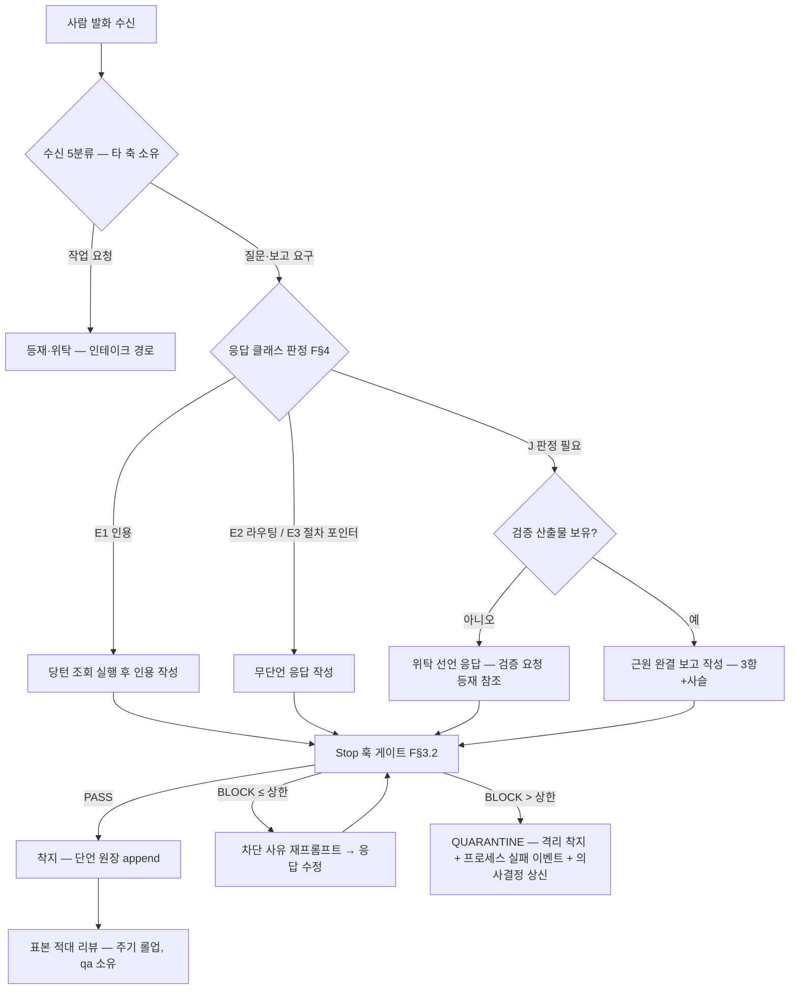
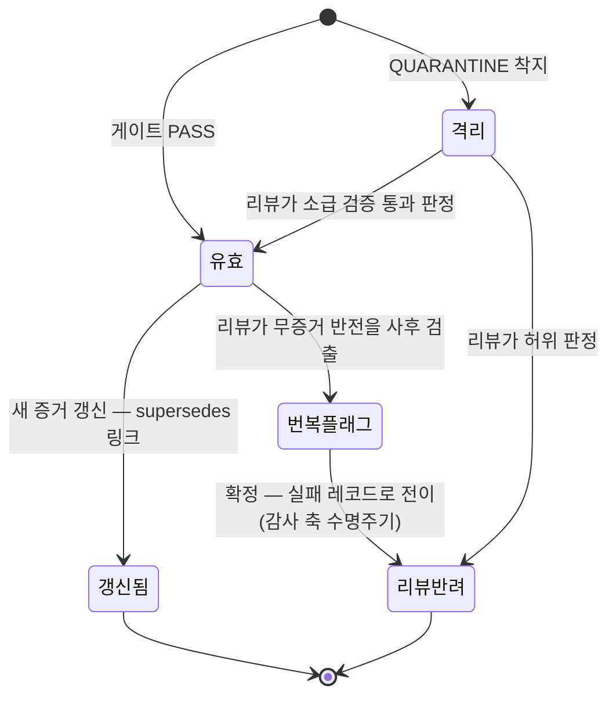
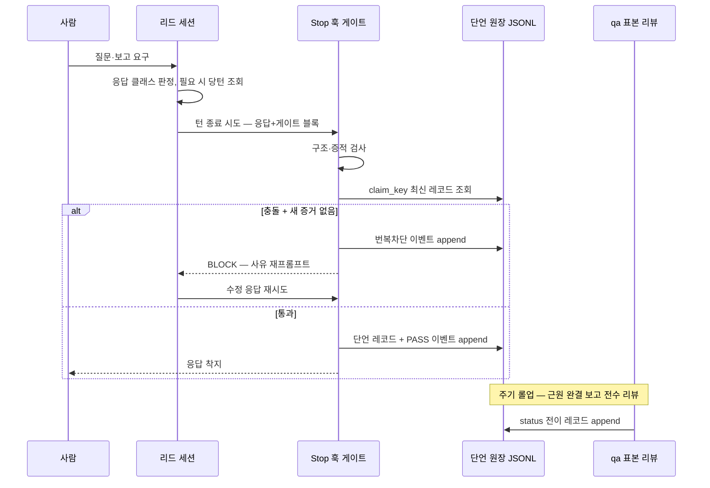
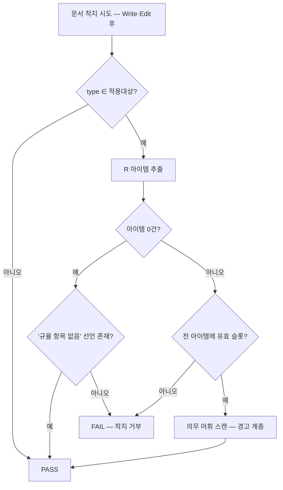

## 요약

**확정** — 아래가 본 축이 소유 정본으로 확정한 것이다. 계약 전문(필드 표·판정식·문법·전이표)은 각 계약 소절의 블록에 있고 이 절은 결론만 담는다.


리드는 사람의 첫 접점이라 워크플로의 다중 검증 밖에서 즉문즉답한다. S§5.4의 확정 수용 기준은 "근원 완결 보고만 착지"이며, 금지 대상은 빠른 응답이 아니라 **근원이 규명되지 않은 응답**이다. 본 문서는 그 기준을 강제하는 장치를 다음 4층으로 설계한다.

1. **능력 협착(1층)** — 리드 세션의 도구 권한을 읽기·위임·질문으로 제한한다. 차단 서열 최상위(능력 제거, S§3.4)라 회피가 원리적으로 불가능하다.
2. **구조 강제(2층)** — 리드의 모든 세계 단언은 응답 말미의 기계 판독 게이트 블록(고정 스키마 JSON) 안에만 존재하며, 산문은 단언 운반체가 아니다.
3. **착지 게이트(3층)** — Stop 훅이 게이트 블록의 구조·당턴 조회 증적·번복 충돌을 검사해 미달 응답의 착지를 차단(경고 아님)한다.
4. **진실 축 위임(4층)** — 분류의 진위·근원 규명의 충분성·수치의 참·거짓은 장치 불가 축(S§9.4-19)임을 명시하고, 표본 적대 리뷰(qa)와 규율로만 다룬다. 장치 목록을 커버리지로 오독하지 않도록 잔여 통과 경로를 F§12에 전수 명시한다.

추가 산출: 응답 클래스 판별 규칙(즉답/판정의 경계, 기본값은 판정 필요), 3항 서술 스키마(측정한 것/허용 결론/불허 결론 + 인과 사슬), 클레임 키 기반 번복 감지 판정식, 설계·규범 문서의 [장치|장치 불가] 슬롯 존재를 검사하는 착지 린트(본 문서 자신에게 적용), 아부 금지 착지 차단 장치(F§7.9 — S§2-19의 "어기지 못하는 구조화 장치" 요구에 대한 산출: 자리 제거 + 닫힌 어휘 차단), 과공학 경계 판정표(S§2-11 대 S§9.4-22 긴장 해소)다. 플랫폼 기능의 존부가 불확실한 지점은 전부 F§13 "설치 전 실측 항목"으로 분리했다.

**실측 대기** — 7건. 정본은 F§13, 전수 색인은 부속 PA. 플랫폼 기능의 존부·의미를 단정하지 않았다 — 각 항목에 의존하는 구현은 실측 결과 기록 없이 착수하지 않는다.

**미결** — 본 축의 미결 절 정본은 F§12이며, 재생성본 전체의 미결·이력 정본은 부속 PB다.

## 1. 범위와 소유 경계 — 타 축 위임

본 축이 소유하는 것:

- 리드 응답의 착지 가능/불가 판정 기준과 판정식(F§3~F§6)
- 리드 게이트 검증기(Stop 훅용)와 그 정책 파일·단언 원장 **스키마**(F§5~F§7, F§11)
- 설계·규범 문서의 [장치|장치 불가] 슬롯 린트 **규칙**(F§9)
- 과공학 경계 판정표(F§10)

타 축 소유로 위임(스펙 절 번호가 경계의 정본):

| 계약 | 소유 축 | 본 축이 정의하는 것 | 위임하는 것 |
|---|---|---|---|
| 문서 착지 게이트 호스트·템플릿·frontmatter 스키마 | S§3.5·S§12 T9 소유 축 | 린트 규칙 1건의 입출력 계약(F§9) | 게이트 호스트 구현·실행 지점 배선 |
| 감사 트리 샤딩·신원 주입·보존 집행 | S§7 소유 축 | 단언 원장·게이트 이벤트의 레코드 스키마와 스트림 계약(F§11) | 파일 배치·샤딩·신원 원천 |
| 수신 발화 5분류와 등재 경로 | S§9.5-26·S§5.1 소유 축 | "위탁 선언" 클레임이 요구하는 등재 참조의 존재 검사(F§3) | 등재 절차 자체 |
| 의사결정 문서·3채널 통지 | S§3.7 소유 축 | 격리 착지 시 상신 트리거 조건(F§3.5) | 문서 스키마·발송 |
| qa 3렌즈 적대 리뷰 실행 | S§5.3·S§6.1 소유 축 | 리뷰 표본 추출 규칙과 소비 계약(F§7.6, F§11.3) | 리뷰 파이프라인 |
| 설치·훅 등록·자동 커밋 배치 | S§8 소유 축 | 훅 이벤트명·스크립트 자기 선언 메타데이터(F§11) | 배치·등록·번들 |

- [R16] 본 축 산출물은 위 표의 위임 항목을 재정의하지 않는다 — 겹치면 스펙 절 번호가 이긴다. [장치 — 조립기 단계의 축 간 중복 정의 검출은 조립 축 소유 게이트에 위임 | 장치 불가 — 본 문서 단독으로는 검출 불가: 축 간 대조는 조립 시점에만 가능하다는 판정 근거]

---

## 2. 판정 대상의 정의

| 용어 | 정의 |
|---|---|
| 리드 응답 | 리드 세션이 사람 발화가 만든 턴을 종료하며 내는 최종 어시스턴트 텍스트 |
| 착지 | 응답이 사람에게 노출되고, 동시에 단언 원장에 레코드가 기록되는 것 — S§2-14의 "쓰기+추적 확인" 단위와 동형 |
| 단언 | 세계 상태에 대한 참·거짓 판정이 가능한 문장. 라우팅·접수 통지·질문은 단언이 아니다 |
| 게이트 블록 | 응답 말미의 고정 스키마 펜스 블록(정보 문자열 `lead-gate`). 기계가 판독하는 단언의 유일한 운반체 |
| 클레임 | 게이트 블록 안의 단언 1건(스키마 F§5.2) |
| 당턴 조회 증적 | 현재 턴의 도구 호출 기록(전사) 안에, 클레임이 인용하는 원천 경로에 대한 읽기 계열 호출(Read·Grep·Glob)이 존재하는 것 |
| 근원 완결 보고 | 3항 서술 + 인과 사슬(근원→표면) + 근원 종료 근거를 갖춘 보고(F§5.3) |

- [R17] 리드의 모든 단언은 게이트 블록 안에만 적는다. 블록 밖 산문에는 단언을 두지 않는다. [장치 — 블록 부재·스키마 위반은 Stop 훅이 착지 차단(F§3.4); 산문 속 단언의 **식별**은 장치 불가 — 자연어에서 단정 문장을 참·거짓 판정하는 것은 S§9.4-19의 관측·수치·인과 축이라 훅으로 다룰 수 없다는 판정 근거. 완화: 어휘 휴리스틱 관측 계층(F§9.3)과 표본 적대 리뷰(F§7.6)]

---

## 3. 수용 기준의 조작적 정의 (산출 ①)

### 3.1 확정 기준의 번역

S§5.4 확정: "근원 파악을 충분히 마친 뒤 문제의 뿌리부터 표면까지 전부 보고하는 응답만 착지"·"단면적 현상과 1차 원인만 짚은 즉시 보고는 착지 불가 클래스". 이것을 기계 판정 가능한 형태로 번역하면:

> 응답 R이 착지 가능 ⇔ R의 게이트 블록이 유효하고, R 안의 모든 클레임이 {인용, 위탁, 근원완결보고} 중 하나의 형식 요건을 완전히 충족하며, 번복 충돌이 해소되어 있다.

"근원 규명의 **충분성**"(진실 축)은 기계 판정 불가이므로, 게이트는 **충분성의 구조적 필요조건**(사슬 완결성·종료 근거·증거 참조 실재)을 검사하고, 충분성 자체는 표본 적대 리뷰가 판정한다. 이 분리가 본 설계 전체의 뼈대다.

### 3.2 착지 판정식 (의사코드) [계약]

```text
함수 게이트판정(응답텍스트 R, 당턴전사 T, 단언원장 L, 정책 P) -> {PASS | BLOCK(code) | QUARANTINE}:

  B := 마지막_펜스블록(R, "lead-gate")
  if B 없음:                       return BLOCK(블록부재)
  G := JSON파싱(B);  실패 시        return BLOCK(파싱실패)
  if G.schema != "lead-gate/1":    return BLOCK(파싱실패)
  if G.class ∉ 응답클래스enum:      return BLOCK(클래스무효)
  if G.class ∈ {E2, E3} ∧ G.claims ≠ []:  return BLOCK(클래스무효)   # 무단언 클래스에 클레임 금지
  if G.class ∉ {E2, E3} ∧ G.claims = []:  return BLOCK(클래스무효)   # 단언 클래스에 빈 클레임 금지

  for c in G.claims:
    if 키형식위반(c.claim_key):    return BLOCK(키형식위반)          # F§6.2 파생 규칙
    case c.kind:
      "cite":
        if c.source 부재:                          return BLOCK(증적부재)
        if not 당턴조회증적(T, c.source):           return BLOCK(증적부재)
        if not 결정론파생범위(c):                    return BLOCK(클래스무효)  # F§4.3 닫힌 목록
      "delegate":
        if c.request_ref 부재:                     return BLOCK(위탁참조부재)
        if not 경로계산_존재검사(c.request_ref):     return BLOCK(위탁참조부재)  # S§3.2 경로 계산성 이용
      "report":
        r := c.report
        if r.measured·allowed·disallowed 중 공백:   return BLOCK(삼항미비)
        if len(r.disallowed) < 1:                  return BLOCK(불허공백)
        if not 사슬유효(r):                         return BLOCK(사슬미달)
        if r.root_termination 부재:                return BLOCK(종료근거부재)
      기타:                                        return BLOCK(파싱실패)

    if 상찬어휘적중(c, P):                        return BLOCK(상찬어휘)   # F§7.9 — 닫힌 목록 × 닫힌 대상 필드

    prior := L.최신유효(c.claim_key)
    if prior ≠ null ∧ 충돌(prior, c, P.numeric_tolerance):
      if c.reversal_of = prior.aid
         ∧ c.new_evidence ≠ null
         ∧ c.new_evidence.acquired_at > prior.ts:
            c.표식 := "갱신"                        # 번복 아님 — S§5.3 정정 형식
      else:  원장append(L, 번복차단이벤트(c, prior)); return BLOCK(번복무증거)

  원장append(L, 단언레코드들(G), 게이트이벤트(PASS))
  return PASS

함수 사슬유효(r):
  return len(r.chain) ≥ 2
     ∧ r.chain[0].layer = "근원" ∧ r.chain[끝].layer = "표면"
     ∧ ∀링크: 링크.evidence가 r.measured의 mid를 참조하거나 존재하는 산출물 경로임

함수 상찬어휘적중(c, P):                           # F§7.9 — 의미 판정 없음. 목록·대상 둘 다 닫힘
  대상 := c 에서 P.praise_target_fields 가 지시하는 필드만 수집(그 밖은 읽지 않는다)
          # 기본 집합: claims[].statement · report.allowed[].statement
          #            · report.disallowed[] · report.chain[].statement
  return ∃w ∈ P.praise_lexicon, ∃s ∈ 대상: w 가 s 의 부분문자열
```

재시도 상한: 같은 턴에서 BLOCK이 `P.retry_ceiling`(기본 2)회를 넘으면 3회째는 `QUARANTINE` — 응답은 노출되되 모든 클레임이 `status: 격리`로 원장에 기록되고 프로세스 실패 이벤트가 자동 착지하며, S§3.7 소유 축의 의사결정 문서 상신 트리거가 발화한다. 무한 차단 루프(턴이 끝나지 못하는 상태)를 막으면서도 조용한 통과를 만들지 않기 위한 균형점이다(S§9.3-15의 오차단 고려).

### 3.3 착지 가능/불가 기준표

| # | 응답 특성 | 판정 | 판정 주체·방법 |
|---|---|---|---|
| 1 | 분류·라우팅·접수 통지만(클레임 0건, 클래스 E2) | 착지 | 게이트 — 구조 검사 |
| 2 | 규범·절차 문서의 경로 안내(E3, 내용 재기술 없음) | 착지 | 게이트 — 구조 검사 |
| 3 | 당턴 조회 증적이 있는 원문 인용·결정론 파생(E1) | 착지 | 게이트 — 증적 대조(F§4.3) |
| 4 | 판정 필요 사안 + 위탁 선언(등재 참조 실재) | 착지 | 게이트 — 참조 존재 검사 |
| 5 | 판정 필요 사안 + 3항·사슬·종료근거 완비 보고 | 착지 + 표본 리뷰 대상 | 게이트(구조) + qa(진실) |
| 6 | 수치·인과·완료 단언인데 게이트 블록 없음/증거 슬롯 공백 | **차단** | 게이트 — 블록부재·삼항미비 |
| 7 | 현상과 1차 원인만 짚은 즉시 보고(사슬 링크 1개·종료근거 없음) | **차단** | 게이트 — 사슬미달·종료근거부재 |
| 8 | 불허 결론 절이 공백인 보고 | **차단** | 게이트 — 불허공백 |
| 9 | 선행 단언과 극성·수치 충돌 + 새 증거 슬롯 공백 | **차단** + 프로세스 실패 기록 | 게이트 — 원장 대조(F§6) |
| 10 | 기억 기반 단언(당턴 증적 없는 E1 위장) | **차단** | 게이트 — 전사에 조회 기록 부재 |
| 11 | 평가·판정 산출의 구조화 서술 필드에 상찬 어휘(닫힌 목록 적중) | **차단** | 게이트 — 상찬어휘 대조(F§7.9, S§2-19) |
| 12 | 게이트 블록 밖 산문에 숨긴 단언 | 게이트 통과(구조상) — **장치 불가** | 표본 적대 리뷰 + 규율(F§12 잔여 경로 1) |
| 13 | 형식은 완비했으나 사슬 내용이 허위·불허 결론이 공허 | 게이트 통과(구조상) — **장치 불가** | 표본 적대 리뷰(F§7.6) |
| 14 | 구조화 필드 밖 자유 산문의 상찬·검증 없는 동의 | 게이트 통과(대상 집합 밖) — **장치 불가** | 자리 제거(F§7.9 ⑥-b) + 관측형 어휘 경고(F§9.4) + 표본 적대 리뷰(F§12 잔여 경로 7) |

행 12~14가 존재한다는 사실 자체를 문서에 명시하는 것이 S§9.4-21(정직 공지)의 요구다. 게이트가 잡는 것은 1~11행까지다.

### 3.4 집행 지점

| 지점 | 훅 이벤트 | 하는 일 |
|---|---|---|
| 응답 착지 직전 | `Stop` | F§3.2 판정식 실행. BLOCK 시 차단 사유를 재프롬프트로 반환(수정 유도), PASS 시 원장 append |
| 사람 발화 수신 | `UserPromptSubmit` | 게이트 계약 리마인더 1줄 주입(응답 클래스·블록 의무). 발화 자체의 분류·착지는 S§9.5-26 소유 축 |
| 세션 시작 | `SessionStart` | 신원(역할=lead·세션·머신) 주입 — S§7 소유 축의 원천을 소비만 한다 |
| 문서 쓰기 직후 | `PostToolUse` (Write·Edit 매처) | F§9의 슬롯 린트 — 단, 게이트 호스트는 문서 축 소유이고 본 축은 규칙만 공급 |

`Stop` 훅의 정확한 발화 시점·차단 의미론·전사 접근 방식은 F§13의 설치 전 실측 항목 1~3이다. 실측 결과가 다르면 집행 지점을 `Stop`에서 대안(응답 생성 도구 경유)으로 옮기되 판정식은 불변이다.

### 3.5 리드 응답 경로 플로차트



---

## 4. 응답 클래스 분류 (산출 ③)

### 4.1 클래스 enum [계약]

```text
응답클래스 := { E1, E2, E3, J1, J2, J3, J4, J5, J6 }
E계열(즉답 가능):  E1 인용·결정론파생 / E2 라우팅·접수 / E3 절차 포인터
J계열(판정 필요):  J1 수치 / J2 인과 / J3 완료·성공·실패 선언 / J4 규모·빈도·경향 / J5 무증적 상태 단언 / J6 예측·보증
```

블록의 `class`는 응답의 **최고 위험 클레임** 기준으로 하나만 적는다(E1 인용과 J2 인과가 섞이면 J2).

### 4.2 판별 규칙 (경계의 조작적 정의)

| 규칙 | 내용 |
|---|---|
| 기본값 | **판정 필요(J)** 다. E로 분류하려면 아래 E 요건을 전부 충족해야 한다. 오분류 비대칭이 근거다: J를 E로 잘못 분류하면 F§5.4가 막으려는 바로 그 사고이고, E를 J로 잘못 분류하면 응답이 한 박자 느려질 뿐이다 |
| E1 요건 | ①원천이 저장소 안의 파일·원장 문서다 ②현재 턴에 그 원천을 읽기 계열 도구로 조회했다 ③클레임이 원문 인용이거나 F§4.3의 결정론 파생 닫힌 목록 안이다. 셋 중 하나라도 미충족이면 J |
| E2 요건 | 세계 단언이 0건 — 분류 결과 통지·담당 라우팅·접수 확인·되묻기만 |
| E3 요건 | 규범·절차 문서의 **경로**만 안내하고 내용을 재기술하지 않는다(재기술하는 순간 E1 요건 적용) |
| J 강제 트리거 | 다음 중 하나라도 응답에 포함되면 J: 측정 없이 적는 수치 · "때문에"형 인과 · 완료/성공/실패/해결 선언 · 만성/반복/다수/대부분 등 규모 어휘 · 미래 보증 · 당턴 증적 없는 현재 상태 서술 |

### 4.3 결정론 파생 닫힌 목록 (이 목록 밖은 전부 J)

1. 존재 여부(파일·문서·필드가 있다/없다 — 당턴 조회 결과 그대로)
2. 개수(도구가 산출한 카운트 값을 **그대로** 인용 — 리드가 세지 않는다. S§9.4-19의 완화책 "수치는 도구가 산출" 적용)
3. 경로·ID·enum 필드 값의 인용
4. 타임스탬프 두 값의 대소 비교
5. 원문 문자열 인용(축약·의역 없이)

- [R18] 리드는 닫힌 목록 밖의 파생(집계·비율·경향·해석)을 E1로 분류하지 않는다. [장치 — cite 클레임의 value가 도구 출력 앵커를 참조하지 않으면 게이트가 증적부재로 차단; 파생의 **의미적** 월경(예: 카운트 두 개를 인용하며 산문으로 비율을 말함)은 장치 불가 — 산문 의미 판정은 S§9.4-19 축이라는 근거. 완화: 표본 적대 리뷰의 점검 항목에 명시 포함(F§7.6)]

### 4.4 분류 판별 의사코드 (리드 에이전트 정의에 내장되는 절차) [계약]

```text
함수 분류(작성할 응답 초안):
  if 단언 0건: return E2 또는 E3
  for 각 단언:
    if J 강제 트리거 매치: return 해당 J코드
    if E1 요건 3종 모두 충족 못함: return J5
  return E1
```

분류 행위 자체는 LLM(리드)이 한다 — 별도 자연어 분류기 프로그램은 두지 않는다(S§9.4-22: 재량을 제거하지 못하고 옮길 뿐). 대신 분류 **결과**가 게이트 블록의 필수 필드이고, E1 선언은 당턴 증적 검사로 기계 반증이 가능하다. 즉 "분류기"는 프로그램이 아니라 **출력 필드 + 반증 가능 구조**로 구현된다.

---

## 5. 3항 서술 형식 (산출 ④)

### 5.1 게이트 블록 — 최상위 스키마 [계약]

응답 말미, 정보 문자열 `lead-gate`의 펜스 블록. 1응답 1블록.

| 필드 | 타입 | 필수 | 기입 주체 |
|---|---|---|---|
| `schema` | string, 고정값 `"lead-gate/1"` | 필수 | 리드(템플릿 자동) |
| `class` | 응답클래스 enum | 필수 | 리드 |
| `request_ref` | string(원장 문서 ID) 또는 null | 필수(null 허용) | 리드 |
| `claims` | array\<클레임\> | 필수(E2·E3만 빈 배열) | 리드 |

### 5.2 클레임 스키마 [계약]

| 필드 | 타입 | 필수 | 기입 주체 |
|---|---|---|---|
| `kind` | enum `{cite, delegate, report}` | 필수 | 리드 |
| `claim_key` | string — F§6.2 파생 규칙 준수 | 필수 | 리드(규칙 적용) |
| `statement` | string, 1문장 | 필수 | 리드 |
| `polarity` | enum `{성립, 불성립, 수치, 미정}` | 필수 | 리드 |
| `value` | string | polarity=수치일 때 필수 | 리드(도구 산출 인용만) |
| `source` | string(경로 또는 원장 ID) | kind=cite일 때 필수 | 리드 |
| `request_ref` | string(원장 ID) | kind=delegate일 때 필수 | 리드(등재 산출 인용) |
| `report` | 3항보고 객체(F§5.3) | kind=report일 때 필수 | 리드 |
| `reversal_of` | string(선행 단언 aid) | 충돌 시 필수 | 리드 |
| `new_evidence` | 새증거 객체(F§6.4) | reversal_of 존재 시 필수 | 리드 |

### 5.3 3항보고 객체 스키마 [계약]

| 필드 | 타입 | 필수 | 제약 |
|---|---|---|---|
| `measured` | array\<측정항목\> | ≥1 | 측정항목 = `{mid, target, method, at, output_ref}` — method는 실행한 명령·도구 호출을 축약 없이, output_ref는 전사 앵커 또는 산출물 경로 |
| `allowed` | array\<`{statement, measured_refs[]}`\> | ≥1 | 각 허용 결론은 measured의 mid를 1개 이상 참조 |
| `disallowed` | array\<string\> | **≥1, 공백 불가** | 이 측정이 지지하지 **않는** 결론 — 최소 1건은 허용 결론의 자연 증폭형(다음 단계 추론)이어야 한다는 것이 작성 규율 |
| `chain` | array\<사슬링크\> | ≥2 | 사슬링크 = `{statement, evidence, layer}`; layer enum `{근원, 중간, 표면}`; index 0=근원, 마지막=표면; evidence는 measured.mid 또는 실재 산출물 경로 |
| `root_termination` | `{type, statement}` | 필수 | type enum `{재현한계, 외부시스템경계, 설계결정}` — "왜 여기서 더 파고들지 않는가"의 종료 근거 |

`disallowed`의 존재 이유는 S§5.4-⑤의 실사고(측정 "그래프에 커밋 존재"가 "원격 도달"→"이 머신에서 전송"으로 증폭, 전송 증거 0건)다. 읽는 쪽이 빈칸을 자기 가정으로 채우는 것을 막는 자리이므로 **공백이 가장 위험**하고, 그래서 게이트가 공백을 차단한다.

### 5.4 강제 지점

| 지점 | 강제 내용 |
|---|---|
| 리드 에이전트 정의(시스템 프롬프트) | 응답 템플릿에 게이트 블록 골격을 내장 — S§10-6 "기계가 만들 수 있는 것을 사람의 기억에 맡기지 마라"의 적용. 템플릿이 기계 생성이면 블록 누락 위반 자체가 어렵다 |
| `Stop` 훅 | F§3.2 판정식 — kind=report이면 5.3의 전 제약을 구조 검사 |
| 표본 적대 리뷰(qa) | disallowed의 실질성·chain의 진실성 — 구조 검사가 못 보는 진실 축 |

- [R19] 근원 완결 보고의 모든 결론 문장은 allowed 배열 안에 있어야 하며, allowed 밖 산문 결론은 무효로 취급한다. [장치 — 게이트가 report 클레임의 statement·allowed만 원장에 단언으로 기록한다(산문은 원장에 안 실림 — 원장 기준으로는 존재하지 않는 결론) | 장치 불가 — 사람이 산문 결론을 읽고 믿는 것 자체는 막을 수 없다는 근거. 완화: 리드 템플릿이 "결론은 블록에만" 문구를 산문 영역 머리에 고정 출력]

---

## 6. 번복 감지 설계 (산출 ⑤)

### 6.1 단언 원장 [계약]

append-only JSONL. 물리 배치·샤딩·보존 집행은 S§7 소유 축에 위임하고, 본 축은 레코드 스키마와 판정식을 소유한다. 1레코드 1줄, 개행 이스케이프 강제(S§3.6의 형식 수준 보장).

| 필드 | 타입 | 필수 | 기입 주체 |
|---|---|---|---|
| `aid` | string — 결정론 해시(세션ID·턴번호·claim_key·statement의 해시 접두 16자) | 필수 | 게이트(자동) |
| `ts` | ISO8601 | 필수 | 게이트(자동) |
| `session` / `machine` / `role` | string | 필수 | 게이트(자동 — 신원 원천은 S§7 소유 축) |
| `request_ref` | string 또는 null | 필수 | 블록 복사 |
| `class` / `kind` / `claim_key` / `statement` / `polarity` / `value` | F§5.2와 동일 | 필수 | 블록 복사 |
| `evidence_refs` | array\<string\> | 선택 | 블록 복사 |
| `status` | enum `{유효, 갱신됨, 번복플래그, 격리, 리뷰반려}` | 필수 | 게이트·리뷰 |
| `supersedes` / `superseded_by` | aid | 선택 | 게이트(갱신 링크) |
| `unchanged_scope` | string — "변하지 않은 부분 선언"(S§5.3 정정 형식) | 갱신 시 필수 | 리드 |

ID가 결정론 해시인 이유는 S§3.8·S§11-7과 동일하다 — 채번 장치 자체가 불요해진다.

### 6.2 클레임 키 파생 규칙 [계약]

번복 감지를 의미 비교(장치 불가)가 아니라 **키 공간의 기계 대조**로 만들기 위한 규칙이다.

```text
claim_key := <대상유형> ":" <대상참조> "#" <속성>
대상유형 ∈ { 요청, 문서, 파일, 지표, 상태 }          # 닫힌 enum
대상참조 := 원장 문서 ID | 저장소 상대경로              # 실재 검사 가능한 값만
속성     := 통제 어휘 항목                            # 어휘 정본은 S§3.6·T2 소유 축
자유 단언(위 형식으로 못 적는 것) := "자유:" + 해시(정규화(statement))
```

키 형식 위반(대상유형이 enum 밖, 대상참조가 실재 불가 형식)은 게이트가 `키형식위반`으로 차단한다. `자유:` 키는 동일 문구 반복만 잡는다 — 이 약화는 F§12 잔여 경로 3으로 공지한다.

### 6.3 번복 판정식 [계약]

```text
함수 충돌(prior, c, tol):
  if prior.polarity ≠ c.polarity ∧ {prior.polarity, c.polarity} = {성립, 불성립}: return 참
  if prior.polarity = c.polarity = 수치 ∧ |비교(prior.value, c.value)| > tol:     return 참   # tol 기본 0
  return 거짓

충돌 시:
  갱신 요건 = (c.reversal_of = prior.aid) ∧ (c.new_evidence ≠ null)
             ∧ (c.new_evidence.acquired_at > prior.ts) ∧ (c.unchanged_scope ≠ 공백)
  갱신 요건 충족 → 착지: c.status=유효, prior.status=갱신됨, supersedes/superseded_by 링크
  미충족       → 차단(번복무증거) + 번복차단 이벤트 append(프로세스 실패 — 소비 계약 F§11.3)
```

새 증거의 `acquired_at > prior.ts` 검사가 핵심이다 — "원래 알던 것을 새 증거라 재포장"하는 회피를 시각 비교(결정론)로 걸러낸다. 시각 위조는 진실 축이라 장치 불가 — 표본 리뷰가 output_ref 실재를 대조한다.

### 6.4 새증거 객체 스키마 [계약]

| 필드 | 타입 | 필수 | 제약 |
|---|---|---|---|
| `evidence_type` | enum `{실측출력, 문서참조, 재현절차}` | 필수 | |
| `ref` | string(전사 앵커·산출물 경로·원장 ID) | 필수 | 존재 검사 대상 |
| `acquired_at` | ISO8601 | 필수 | 선행 단언 ts보다 이후 |
| `delta` | string 1문장 | 필수 | "무엇이 새로 확인됐는가" — 갱신과 번복을 가르는 서술 |

### 6.5 단언 수명주기 상태도



- [R20] 격리·번복플래그 레코드는 삭제하지 않는다 — 상태 전이로만 닫는다. [장치 — 원장이 append-only이고 상태 변경도 새 레코드 append + 파생 뷰 재계산으로만 가능(S§3.8 무오염과 동형); 파생 뷰 생성은 S§7 소유 축 | 장치 불가 — 해당 없음]

---

## 7. 장치 후보 ①~⑥ 평가와 채택 조합 (산출 ②)

### 7.1 후보 ① 응답 클래스 분류기

| 평가 축 | 판정 |
|---|---|
| 네이티브 구현 | **가능(변형)** — 분류 절차는 리드 에이전트 정의(시스템 프롬프트)에, 분류 결과는 게이트 블록 필수 필드에, 검증은 `Stop` 훅 구조 검사에. 별도 분류 프로그램은 만들지 않는다 |
| 비용 | 낮음 — 응답당 필드 1개 + E1일 때 증적 대조 1회 |
| 회피 가능성 | J를 E1로 위장 → 당턴 증적 검사가 기계 반증(인용할 원문이 없으면 차단). E2로 위장(단언을 산문에 숨김) → 장치 불가, F§12 잔여 경로 1 |
| 판정 | **변형 채택** — "분류기 = 별도 장치"안은 기각(S§9.4-22: 자연어 분류기는 재량을 옮길 뿐). "분류 = 필수 출력 필드 + 반증 가능 구조"로 채택 |

### 7.2 후보 ② 근거 슬롯 강제

| 평가 축 | 판정 |
|---|---|
| 네이티브 구현 | **가능(구조 역전 전제)** — 산문에서 단정 문장을 찾아 근거를 요구하는 방향은 장치 불가(S§9.4-19). 방향을 뒤집어 "단언은 슬롯 있는 구조 블록에만 존재"로 만들면 슬롯 검사가 순수 구조 검사가 된다. 템플릿은 에이전트 정의, 검사는 `Stop` 훅 |
| 비용 | E계열 응답은 사실상 0(빈 클레임·인용 1건), J계열 보고에만 스키마 작성 비용 |
| 회피 가능성 | 슬롯에 공허한 값 기입 → 구조 검사는 통과, 진실 축은 표본 리뷰. 참조 실재 검사(존재하는 경로·앵커인가)가 최소한의 반증선 |
| 판정 | **채택** — 단 "거부는 경고가 아니라 차단"(S§5.4-②)을 `Stop` 훅 BLOCK으로 구현 |

### 7.3 후보 ③ 번복 감지·자동 기록

| 평가 축 | 판정 |
|---|---|
| 네이티브 구현 | **부분 가능** — 원장은 append JSONL(네이티브 훅이 쓰기), 대조는 훅이 부르는 소형 검증기(커스텀 최소분 — F§7.7 근거). 자기 선언 필드("이번 발화는 번복임") 단독안은 기각 — S§9.4-25가 자기 선언 필드를 대리지표로 무효 판정한 실측과 동형 |
| 비용 | 클레임당 원장 조회 1회(경로 계산 + 해당 샤드만 — S§3.2 성질 이용) |
| 회피 가능성 | 키 공간 밖 우회(같은 주장을 다른 키로) — F§12 잔여 경로 3. 완화: 키 파생 규칙의 닫힌 enum + 표본 리뷰의 키 중복 점검 |
| 판정 | **채택** — 의미 비교가 아니라 키+극성+시각의 결정론 대조로 한정하고, 한계를 공지 |

### 7.4 후보 ④ 즉답 범위 축소

| 평가 축 | 판정 |
|---|---|
| 네이티브 구현 | **완전 가능** — 리드 세션 권한 설정(도구 거부 목록)과 에이전트 정의. 커스텀 코드 0 |
| 비용 | 리드가 직접 수정·실행을 못 한다 — S§5.4-④가 이 방향을 이미 3단계로 좁혀왔고(직접 수정 금지→분석 금지→프록시), S§11-20이 "권한 협착이 사후 금지 훅보다 싸다"를 실측 근거로 확정 |
| 회피 가능성 | 능력 부재라 직접 회피 불가. 잔여: 위임 도구로 서브에이전트에게 대필시키는 간접 경로 — F§12 잔여 경로 2 |
| 판정 | **채택(1층 기반)** — 구체 권한: 허용 = 읽기 계열(Read·Grep·Glob) + 위임(에이전트 스폰) + 대화형 질문 + 워크플로 기동. 거부 = 쓰기 계열(Write·Edit·NotebookEdit) 전부 + 셸 실행 전부(문자열 필터 셸 허용안은 기각 — S§3.4 미탐 실측 근거, 부분 허용은 원리적으로 불완전). 개수 산출은 Grep 도구의 카운트 모드로 대체(존부는 F§13 실측 4) |

### 7.5 후보 ⑤ 서술 형식 강제(3항)

| 평가 축 | 판정 |
|---|---|
| 네이티브 구현 | **가능** — 템플릿(에이전트 정의) + `Stop` 훅 구조 검사(F§5.3 제약 전부) |
| 비용 | 근원 완결 보고에만 발생. 즉답 턴에는 부과하지 않는다(F§10 과공학 경계) |
| 회피 가능성 | 형식 충족·내용 공허 — 진실 축, 표본 리뷰. 불허 결론 최소 1건 강제가 최소 반증선 |
| 판정 | **채택** — 적용 범위는 kind=report 클레임. 전 응답 강제안은 기각(F§10: 즉답 턴 절차화 금지) |

### 7.6 채택 조합과 근거

**조합: ④(능력 협착) ⊃ ①′(분류 필드) ⊃ ②′+⑤+⑥′(구조 블록·3항·상찬 어휘 차단) ⊃ ③′(원장 대조) + 표본 적대 리뷰(진실 축 소비자)**

- 배열 근거: S§3.4의 차단 수단 서열(①능력 제거 ②경로 판정 ③사후 검사) 순서 그대로다. 능력 협착이 바닥이고, 구조 검사가 중간이고, 표본 리뷰가 사후다.
- ⑥′(아부 금지 착지 차단 — F§7.9)은 S§2-19 확정의 후속 반영이며 ②′와 **같은 층**(구조 검사)에 붙는다: 같은 `Stop` 훅·같은 판정식(F§3.2)의 추가 분기이고 별도 실행 경로·별도 프로세스를 만들지 않는다. 층 수는 F§요약의 4층 그대로다.
- 각 층은 자기 커버 범위만 선언하고 다른 층을 백스톱으로 인용하지 않는다(S§9.3-13). 층별 커버리지는 F§3.3 기준표의 판정 주체 열이 정본이다.
- 표본 적대 리뷰 규칙: 근원 완결 보고는 주기 롤업마다 **전수** 리뷰 대상(주기당 상한 10건, 초과 시 무작위 10건 — 정책값). 실행 주체는 qa(3렌즈 — S§6.1 소유 축), 리뷰 미달 판정은 해당 단언 status를 `리뷰반려`로 전이시키고 실패 레코드를 만든다.
- 적대 리뷰 통과(S§12 T3의 완료 조건)는 이 조합 문서 자체에 대해 수행한다 — 본 문서 status가 그 대기 상태를 표기한다.

### 7.7 커스텀 최소분의 명시 (S§2-6 의무 기록)

| 커스텀 | 네이티브로 안 되는 이유 | 최소성 |
|---|---|---|
| 게이트 검증기 스크립트(훅이 호출) | 훅 이벤트·차단 의미론은 네이티브지만, JSON 스키마 검사·전사 증적 대조·원장 조회 판정 로직은 설정만으로 표현 불가 | 상주 프로세스 없음·훅 수명 내 단명 실행·상태는 append 원장뿐. 자기 파일 안에 이벤트·매처 메타데이터를 선언해 배치가 선언에서 파생(S§11-9) |
| 슬롯 린트 규칙(F§9) | 동일 — 정규식+frontmatter 파싱 필요 | 문서 축 게이트 호스트에 규칙 1건으로 기생. 독립 실행 경로 없음 |

### 7.8 게이트 동작 시퀀스



### 7.9 후보 ⑥ 아부 금지 착지 차단 (S§2-19 — 확정 후속 반영)

S§2-19가 아부성 발언 절대 금지를 핵심 규율로 신설하고 **"이 규율 또한 어기지 못하는 구조화 장치"** 를 필수 산출로 요구했다. 같은 정정이 S§9.4-20의 '규율로만 막히는 축' 분류를 이 항목에 한해 기각했으므로 본 절은 관측형이 아니라 **착지 차단형**을 설계한다. 차단형이어야 하는 근거는 S§10-5의 실측이다 — 경고 249건을 전수 파싱했을 때 핵심 두 축의 검출은 0건이었고, 같은 잘못된 지시가 문서·탐지·집계가 모두 갖춰진 뒤에도 글자 그대로 3회 재송신됐다. 경고 전용 장치는 소비자가 없으면 행동을 바꾸지 못한다는 것이 그 실측의 내용이며, 이 축을 관측형으로 두는 선택은 S§2-19의 문면과 양립하지 않는다.

| 후보 | 평가 | 판정 |
|---|---|---|
| ⑥-a 자유 산문 전체를 대상으로 한 상찬 어휘·구문 판정(차단형) | 판정이 결정론이 아니다 — 품질 평가 자체가 산출인 리뷰·적대 리뷰 보고의 정당한 문장을 오차단한다. F§10.2가 어휘 휴리스틱을 관측형으로 묶은 근거와 같은 축 | **기각(원안 그대로는)** — 적용 범위를 닫으면 결정론이 된다(⑥-b′) |
| ⑥-b 판정·리뷰 산출을 구조화 필드로 한정 — 상찬이 들어갈 자유 산문 자리 자체를 제거 | 차단 서열 최상위(자리·능력 제거 — S§3.4)이고 오탐이 원리적으로 0이다. C§6.2가 caveman·freshman 산출 스키마에서 판정 필드를 제거한 것과 동형 구조 | **채택(기반층)** |
| ⑥-c 에이전트 정의 내장 + 준수는 산출 증거로 측정 | 규율 계층이라 단독으로는 "어기지 못하는" 요건에 미달한다 — 경고 전용 장치 무소비 실측(S§10-5)이 그 한계의 실증이다 | **보조 채택(단독으로는 불가)** |
| ⑥-b′ 닫힌 상찬 어휘 목록 × 닫힌 대상 필드 집합의 문자열 대조(차단형) | 어휘 목록과 대상 필드가 **둘 다 닫혀 있어** 판정이 결정론이다. 의미 판정이 아니라 구조·문자열 축이므로 [R22]가 금지한 진실 축 차단이 아니다. 비용은 필드당 O(1) | **채택(차단층)** |

**채택 조합: ⑥-b(자리 제거) ⊃ ⑥-b′(닫힌 어휘 차단) ⊃ ⑥-c(정의 내장·증거 측정)**

- **대상 필드(닫힌 집합)**: 게이트 블록의 `claims[].statement` · `report.allowed[].statement` · `report.disallowed[]` · `report.chain[].statement`. 타 축이 소유하는 판정·리뷰 레코드(qa 의견·판정 스키마 — S§6.1 소유 축)는 같은 계약을 인용해 자기 서술 필드에 적용한다. **이 목록 밖은 차단 대상이 아니다** — 대상 집합을 열면 ⑥-a의 오차단으로 되돌아간다.
- **어휘 정본**: 정책 파일의 `praise_lexicon`(F§11.2). 코드 하드코딩 금지(S§9.3-16)이며 목록 개정은 자기 개선 루프의 요청을 탄다(S§5.5).
- **판정 결과**: `BLOCK(상찬어휘)` — 재프롬프트로 수정 유도, `retry_ceiling` 초과 시 QUARANTINE. F§3.2 판정식의 추가 분기이지 별도 검사 경로가 아니다.
- **잔여**: 구조화 필드 **밖** 자유 산문의 상찬은 차단 대상이 아니다. 판정·리뷰 결론은 구조화 필드만 원장에 실리므로([R19]와 동형) 산문 상찬은 원장 기준으로 존재하지 않는 발언이고, 산문 영역은 F§9.4 관측형 어휘 경고 계층과 표본 적대 리뷰가 맡는다 — F§12 잔여 경로 7에 전수 명시했다.

- [R39] 평가·판정·리뷰 산출의 구조화 서술 필드에 상찬 어휘가 있으면 착지시키지 않는다 — 경고가 아니라 차단이다(S§2-19). 자유 산문은 판정·리뷰 결론의 운반체가 아니며, 상찬이 들어갈 자리를 스키마에서 제거하는 것이 1차 장치다. [장치 — ①자리 제거: 판정·리뷰 결론은 구조화 필드에만 실리고 산문은 원장에 실리지 않는다(F§5.1~F§5.3 스키마 + [R19] 동형 배선) ②차단: `Stop` 훅 판정식(F§3.2)이 정책 파일 `praise_lexicon`(닫힌 목록)을 위 닫힌 대상 필드 집합에만 대조해 적중 시 `BLOCK(상찬어휘)` — 어휘와 대상이 둘 다 닫혀 있어 판정이 결정론이고 F§10.2 즉시 장치 조건(결정론+저비용)을 충족한다. 경고 모드 값을 두지 않는다(S§10-5) ③측정: 준수는 자기 선언 필드가 아니라 게이트 이벤트의 `BLOCK(상찬어휘)` 계수로만 집계한다(자기 선언 대리지표 금지 — S§9.4-25와 동형) | 장치 불가 — 구조화 필드 밖 자유 산문의 상찬과, 어휘 목록을 우회한 의미 수준의 아부(상찬 어휘 없이 검증을 생략한 동의)는 의미 판정이라 차단 밖이다(S§9.4-19 · [R22]의 금지 범위). 완화: 자리 제거로 원장 반영을 원천 차단 + F§9.4 관측형 어휘 경고 + 표본 적대 리뷰의 점검 항목에 명시 포함(F§7.6). 잔여는 F§12-7에 정직 공지]

---

## 8. 리드 권한 협착 명세 (조합 1층의 구현 좌표)

| 항목 | 값 |
|---|---|
| 강제 위치 | 실행 루트 설정 파일의 권한 절(리드 세션용) + 리드 에이전트 정의의 도구 목록 |
| 허용 도구 | Read · Grep · Glob · 에이전트 스폰(위임) · 대화형 질문 · 워크플로 기동 |
| 거부 도구 | Write · Edit · NotebookEdit · 셸 실행 전부 |
| 리드의 기록 착지 | 리드는 직접 쓰지 않는다 — 단언 원장·이벤트는 훅이 쓴다(자동 주입 원칙, S§3.5) |

- [R21] 리드 세션에 쓰기·실행 권한을 재부여하는 설정 변경은 그 자체가 판정 필요 사안이며 의사결정 문서를 경유한다. [장치 — 설정 파일이 저장소 관리 대상이므로 변경이 커밋으로 노출되고, 설정 경로 변경을 감시하는 검사는 S§8 소유 축의 배치본 대조 감사에 편입 | 장치 불가 — 사람이 로컬에서 즉석 재부여하는 것 자체는 막을 수 없다는 근거(사람 권한은 게이트 위에 있다 — S§5.6-③과 동형). 완화: 변경 이력이 커밋에 남는다]

메인 세션(리드) 권한 거부의 정확한 문법·강제력 범위는 F§13 실측 3이다.

---

## 9. 규율=장치 집행 게이트 — [장치|장치 불가] 슬롯 린트 (산출 ⑥)

### 9.1 목적과 적용 범위

S§2-11: 모든 규율 항목은 [장치 — 무엇이 어디서 강제 | 장치 불가 — 판정 근거] 슬롯을 의무로 갖고, "장치 불가" 판정도 근거 없이는 쓸 수 없다. 이를 문서 착지 시점에 검사한다.

적용 대상: frontmatter `type` ∈ `{design, decision, norm, charter}` 인 문서. 본 문서(type: design)도 대상이다 — 자기 적용.

### 9.2 규율 항목의 기계 식별 규약

산문에서 "규율 항목"을 의미로 식별하는 것은 장치 불가(자연어 의미 판정)다. 따라서 **표기 규약으로 역전**한다:

- 규율 항목은 `- [R<번호>]` 접두의 리스트 아이템으로 적는다(번호는 문서 내 유일).
- 해당 아이템(들여쓰기 연속 줄 포함)은 `[장치 — `와 `장치 불가 — ` 중 하나 이상을 포함해야 하며, 각 브랜치는 대시 뒤에 공백 아닌 서술을 가져야 한다.
- 규율 항목이 하나도 없는 문서는 본문에 `규율 항목 없음` 선언 줄을 포함해야 한다(무표기 회피의 최소 봉쇄).

### 9.3 판정식 (린트 규칙 — 문서 축 게이트 호스트에 공급) [계약]

```text
입력: {path, frontmatter, 본문}
if frontmatter.type ∉ 적용대상: return PASS

items := 본문에서 정규식 /^\s*-\s\[R\d+\]/ 로 시작하는 리스트 아이템(연속 들여쓰기 줄 병합)
if items = [] ∧ 본문에 "규율 항목 없음" 부재:  return FAIL(슬롯대상부재선언없음)

for it in items:
  if "[장치 — " ∉ it ∧ "장치 불가 — " ∉ it:   return FAIL(슬롯부재, R번호)
  if "장치 불가 — " ∈ it ∧ 그 브랜치 서술이 공백: return FAIL(불가근거공백, R번호)
  if "[장치 — " ∈ it ∧ 그 브랜치 서술이 공백:    return FAIL(장치서술공백, R번호)

경고계층(차단 아님, 기본 observe):
  의무 어휘 스캔 — "금지"·"필수"·"해야 한다"·"반드시"를 포함한 문장이 [R] 아이템 밖에 있으면 경고 카운트
return PASS(경고 카운트 동봉)
```

FAIL은 착지 거부다(경고 아님) — 문서 축 게이트 호스트의 차단 의미론에 매핑한다(호스트 계약: 판정 JSON `{verdict, code, anchor}` 반환, 종료 코드 매핑은 호스트 소유).

### 9.4 경고 계층의 졸업 조건 (S§9.3-15 의무)

의무 어휘 스캔은 오탐이 구조적으로 있으므로(정당한 산문 서술도 걸린다) 관측형으로 시작한다. **승격 조건(도입 시점 명문화)**: 누적 검사 문서 30건 이상에서 경고의 오탐률이 10% 미만으로 실측되면 차단으로 승격, 30건 이상에서 오탐률 50% 초과면 규칙 삭제(S§9.3-14: 적용량 0 규칙은 삭제). 판정 데이터는 게이트 이벤트 스트림(F§11.3)의 경고 레코드 + 표본 리뷰의 오탐 표기다.

### 9.5 자기 적용 선언

본 문서는 조립본 전체의 규율 항목 **R1~R39**(39건 — 1장 R1~R15 · 6장 R16~R22·R39 · 4장 R23~R38) 전부에 슬롯을 부착했으며, F§9.3의 판정식은 본 문서를 입력으로 PASS해야 한다(frontmatter `type: design` 기준 손 적용 판정 기록은 PB). 조립기·문서 축 게이트가 이 문서를 착지시킬 때 그 검사가 실행되는 것이 자기 적용의 집행형이다.

### 9.6 문서 슬롯 린트 플로차트



---

## 10. 과공학 경계 (산출 ⑦ — S§2-11 대 S§9.4-22 긴장 해소)

### 10.1 긴장의 구조

- S§2-11: 규율은 최대한 장치로. "당연히 지켜질 규율"에 대한 신뢰 금지.
- S§9.4-22: 장치화의 방아쇠는 취향이 아니라 실측 신호. 즉답 턴까지 절차로 만들면 비용 때문에 사람이 시스템을 버린다.

해소 원리: S§9.4-22 스스로가 답을 명시한다 — "장치화를 미루는 근거로 쓰지 말고, 장치의 **형태** 선택 기준으로만 쓴다". 즉 질문은 "장치화할까 말까"가 아니라 **"어느 형태의 장치인가"**다: 결정론 검사는 즉시 장치(비용이 0에 수렴), 비결정론 검사는 관측형+졸업 조건 또는 규율+표본 리뷰(오탐 비용이 실재).

### 10.2 판정표

| 검사 축 | 판정 결정론? | 매 턴 비용 | 오차단 피해 | 처분 |
|---|---|---|---|---|
| 구조 존재(블록·필드·절·슬롯·마커) | 예 | 낮음 | 재작성 1회 | **즉시 장치·차단** — 실측 신호 불요(S§2-11 직접 적용, 비용 근거는 결정론+저비용) |
| 능력(도구 권한) | 예 | 0 | 없음(위임 경로 존재) | **즉시 장치·능력 제거** |
| 존재·시각 대조(당턴 증적·참조 실재·acquired_at 비교) | 예 | 낮음 | 재조회 1회 | **즉시 장치·차단** |
| 키+극성 충돌(번복) | 예(키 공간 내) | 낮음 | 정당 갱신이 형식 요건을 다시 갖추는 비용 | **즉시 장치·차단** + 키 공간 밖은 공지 |
| 닫힌 어휘 대조(상찬 어휘 목록 × 닫힌 대상 필드 — F§7.9) | 예(목록·대상이 둘 다 닫힘) | 낮음 | 재작성 1회 | **즉시 장치·차단** — S§2-19가 이 축을 명령(S§9.4-20 재분류). 대상 집합을 열면 아래 행으로 강등된다 |
| 어휘 휴리스틱(의무 어휘·단정 어투 스캔 — 자유 산문 대상) | 아니오(오탐 有) | 낮음 | 정당 문장 차단 | **관측형 장치 + 졸업 조건**(F§9.4) — 차단 승격은 실측 후 |
| 의미 판정(분류 진위·근원 충분성·불허 결론 실질·사슬 진실) | 아니오 | 높음 | 신뢰 붕괴·시스템 기피 | **장치 불가 명시 + 규율 + 표본 적대 리뷰** — S§9.4-19 |
| 즉답 턴 전체의 절차화(E계열에 3항 강제 등) | — | 사람 체감 비용 | 시스템 기피(S§9.4-22 명시 위험) | **금지** — E계열은 O(1) 구조 검사만 |

### 10.3 신규 장치 도입 방아쇠

- 새 휴리스틱 장치(어휘 스캔류)의 도입 조건: **동일 실수의 실측 3회 이상**(실패 레코드 태그로 계수 — 계수 원천은 S§7 소유 축) 또는 실제 불일치 검출 1회 이상. 도입은 자기 개선 루프(S§5.5)의 요청으로만 — 즉 도입 자체가 파이프라인 검증을 탄다.
- 결정론·저비용 장치(F§10.2 상위 4행)는 방아쇠 불요 — S§2-11이 직접 명령하고 S§9.4-22의 비용 논거가 성립하지 않는다.

- [R22] 진실 축(의미 판정)에 차단형 장치를 세우지 않는다 — 오탐이 정당한 작업을 삼키고(S§9.3-14), 억지 장치는 전부 오탐이 된다(S§9.4-19). [장치 — 해당 없음(이 항목 자체가 장치 금지 규정) | 장치 불가 — 판정 근거: 세계 지식·재측정이 필요한 판정은 훅의 입력(텍스트·파일)만으로 결정 불가하다는 S§9.4-19의 실측 분류. 집행 대체: 본 문서 F§12의 정직 공지 + 표본 적대 리뷰 배선]

---

## 11. 산출 자산·정책·스트림 계약

### 11.1 자산 트리 (본 축 기여분 — 배치는 설치 축 소유) [계약]

```text
<실행루트>/
├── <에이전트정의디렉토리>/
│   └── lead 정의 파일            # 응답 템플릿·분류 절차·도구 목록 — 게이트 관련 절만 본 축 소유
├── <훅디렉토리>/
│   ├── lead-gate 검증기          # Stop 훅 — F§3.2 판정식. 자기 선언 메타데이터(이벤트=Stop) 내장
│   └── rule-slot-lint 규칙       # F§9.3 — 문서 축 게이트 호스트가 로드
├── <정책디렉토리>/
│   └── lead-gate-policy 파일     # F§11.2 — 값은 전부 여기, 코드에 하드코딩 금지(S§9.3-16)
└── docs/audit/<public|private>/YYYY/MM/   # 샤딩·파일 계약 정본: A§1.2·A§2.4
    └── AU-<UTC시각>Z-<해시8>[-lead-assertions].jsonl 등
                                  # 단언 원장·게이트 이벤트 — 레코드 스키마만 본 축 소유(파일명 단일화: PB)
```

### 11.2 정책 파일 필드

| 필드 | 타입 | 기본값 | 의미 |
|---|---|---|---|
| `retry_ceiling` | int | 2 | 턴 내 BLOCK 상한 — 초과 시 QUARANTINE |
| `numeric_tolerance` | number | 0 | 수치 충돌 판정 허용 오차 |
| `review_cap_per_rollup` | int | 10 | 롤업당 전수 리뷰 상한(초과 시 무작위 추출) |
| `modal_scan` | enum `{off, observe, block}` | observe | F§9.3 경고 계층 모드 |
| `modal_promote_min_docs` | int | 30 | 승격 판정 최소 표본 |
| `modal_promote_max_fp` | percent | 10 | 승격 허용 오탐률 상한 |
| `modal_delete_min_fp` | percent | 50 | 규칙 삭제 오탐률 하한 |
| `new_device_min_observations` | int | 3 | F§10.3 신규 휴리스틱 도입 방아쇠 |
| `praise_lexicon` | array\<string\> | 정책 파일 초기 목록(개정은 자기 개선 루프 경유) | F§7.9 상찬 어휘 닫힌 목록 — 코드 하드코딩 금지(S§9.3-16) |
| `praise_target_fields` | array\<string\> | F§7.9의 닫힌 대상 필드 집합 | 대조 범위. 이 값을 넓히는 변경은 F§10.2의 결정론 전제를 깨므로 의사결정 문서 경유 |
| `retention_days` | int | 감사 축 계약값 승계 | 스트림 보존 기간 |

### 11.3 스트림 계약 (S§7: producer/consumer/transition/보존을 같은 커밋에 선언)

| 스트림 | producer | consumer | transition | 보존 |
|---|---|---|---|---|
| 단언 원장 | lead-gate 훅 | ①번복 대조(게이트 자신) ②표본 적대 리뷰(qa) ③대시보드(후속 요청) | 리뷰반려·번복플래그 → 실패 레코드(수명주기는 감사 축 소유) | `retention_days` |
| 게이트 이벤트(PASS·BLOCK·QUARANTINE·경고) | lead-gate 훅 | ①자기 개선 루프 롤업(S§5.5 — 태그 축 2차 소비처) ②F§9.4 졸업 판정 | QUARANTINE → 의사결정 상신(S§3.7 소유 축) | `retention_days` |

쓰기 규율: 게이트는 턴당 append 최대 2계열(단언·이벤트)만 쓴다. 파생물 재생성·이벤트 단위 커밋은 하지 않는다(S§10-1·S§10-2 — 커밋 배치는 설치·문서 축의 자동 커밋 경로 소유).

---

## 12. 잔여 통과 경로 — 정직 공지 (S§3.4·S§9.4-21 의무)

게이트가 있어도 통과하는 경로를 전수 명시한다. 이 목록의 존재가 "장치 목록 ≠ 커버리지" 오독을 막는다.

| # | 잔여 경로 | 왜 못 막나 | 배선된 완화 |
|---|---|---|---|
| 1 | 게이트 블록 밖 산문에 숨긴 단언 | 자연어 단정 식별은 진실 축(S§9.4-19) | 템플릿의 산문 영역 고정 안내문 + 표본 적대 리뷰 + 어휘 스캔(관측형) |
| 2 | 위임 도구로 서브에이전트에게 즉답을 대필시키는 간접 경로 | 위임은 정당 기능(검증 경로의 입구)이라 능력 제거 불가 | 대필 산출도 리드 턴 종료 시 같은 게이트를 통과해야 함(구조 검사는 걸림) — 의미 우회만 잔존, 표본 리뷰 |
| 3 | 같은 주장을 다른 claim_key로 적는 번복 은폐 | 의미 동치 판정은 진실 축 | 키 파생 규칙의 닫힌 enum(자유 키 최소화) + 리뷰의 키 중복 점검 항목 |
| 4 | 형식 완비·내용 허위의 근원 완결 보고 | 사슬 진실성은 세계 지식 필요 | 전수(상한부) 적대 리뷰 + 증거 참조 실재 검사 |
| 5 | 사람이 게이트 정책·권한을 로컬에서 완화 | 사람 권한은 게이트 위 | 변경이 커밋으로 노출 + [R21] |
| 6 | `Stop` 훅 자체의 미발화·오배치 | 장치 실패는 장치가 못 잡는 클래스 | 기록 장치 자신의 실패를 1급 사건으로 편입(S§7) — 훅 헬스 검사는 감사 축 소유 |
| 7 | 구조화 필드 밖 자유 산문의 상찬·검증 없는 동의(어휘 목록 우회 포함) | 대상 집합을 자유 산문으로 넓히면 판정이 의미 축이 되어 정당한 리뷰 문장을 오차단한다(S§9.4-19 · [R22]) | 판정·리뷰 결론의 원장 반영을 구조화 필드로 한정(자리 제거 — F§7.9 ⑥-b) + F§9.4 관측형 어휘 경고 + 표본 적대 리뷰 점검 항목 |

- 규율 항목 없음 선언은 본 문서에 해당하지 않는다 — R1~R39(39건)이 존재한다.

---

## 13. 설치 전 실측 항목 (플랫폼 기능 존부 — 단정 금지 대상)

| # | 실측할 것 | 걸린 설계 결정 |
|---|---|---|
| 1 | `Stop` 훅이 매 어시스턴트 턴 종료마다 발화하는지(세션 종료 시점만이 아니라), 입력에 전사 파일 경로가 포함되는지 | F§3.4 집행 지점 — 불충족 시 게이트를 응답 생성 경로의 대안 지점으로 이설 |
| 2 | `Stop` 훅의 차단 반환이 사유와 함께 에이전트 재프롬프트로 이어지는지, 재진입 플래그로 무한 루프가 방지되는지 | F§3.2 재시도 상한 구현 |
| 3 | 메인 세션(리드) 대상 도구 거부 설정의 문법과 강제력 범위(쓰기·셸 전면 거부가 설정만으로 성립하는지) | F§8 권한 협착 |
| 4 | Grep 도구의 카운트 산출 모드 존부 | F§4.3 결정론 파생 목록 2항(개수) |
| 5 | 전사 파일에서 당턴 도구 호출(도구명·인자 경로)을 안정적으로 파싱할 수 있는 형식 보장 | 당턴 증적 검사(F§3.2) |
| 6 | `PostToolUse`의 Write·Edit 매처 문법과 차단 의미론(F§9 린트의 호스트 — 문서 축과 공동 실측) | F§9.3 FAIL 매핑 |
| 7 | 훅 스크립트가 세션·역할 식별자를 받는 경로(감사 축과 공동 실측) | F§6.1 레코드 자동 필드 |

실측 전에는 위 7건 어느 것도 "된다"로 단정하지 않는다. 실측 결과가 부정이면 F§3.4의 대안 지점 설계가 활성화되며, 판정식(F§3.2)·스키마(F§5)·원장(F§6)은 집행 지점과 독립이라 불변이다.

---

## 14. 참조

| 구분 | 주소 | 이 문서에서의 용도 |
|---|---|---|
| 재생성 준거 스펙 | S§요약 | 확정 제약 19항 · 목표 · 계승 원칙 · 설계 세션 과제 |
| 진입점 계약 색인 | IX§5 | 임의 계약명 → 정본 주소 |
| 실측 항목 색인 | PA§1 | F§13 이 소유한 실측 항목의 전수 색인 |
| 미결 · 이력 | PB§1 | 미해소 지적 · 조립 통일 내역 · 자기 일관성 기록 |
| 무손실 매핑 | PC§1 | 본 축 자산의 원자료 위치와 재생성본 주소의 대조 |
| 축 A 문서 | A§요약 | 타 축 계약은 값을 재기술하지 않고 주소로만 참조한다 |
| 축 B 문서 | B§요약 | 타 축 계약은 값을 재기술하지 않고 주소로만 참조한다 |
| 축 C 문서 | C§요약 | 타 축 계약은 값을 재기술하지 않고 주소로만 참조한다 |
| 축 D 문서 | D§요약 | 타 축 계약은 값을 재기술하지 않고 주소로만 참조한다 |
| 축 E 문서 | E§요약 | 타 축 계약은 값을 재기술하지 않고 주소로만 참조한다 |
