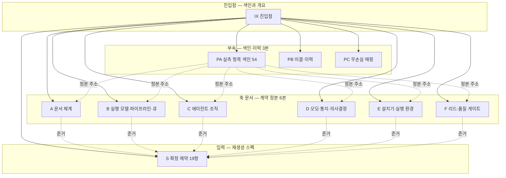
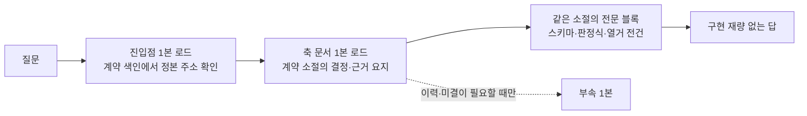

## 요약

**확정** — 하네스 설계는 **6개 축**으로 나뉘어 각 축 문서가 자기 계약의 정본을 소유한다(IX§4). 계약 정의는 소유 축 문서 한 곳에만 있고 다른 축은 주소로만 참조한다. 임의 계약의 정본 주소는 IX§5 계약 색인이 **61건 전건**을 담는다. 재생성은 형태만 바꿨다 — 원자료의 확정 사항은 부속 PC 의 매핑표가 전건 대조로 보인다.

**실측 대기** — **54건**. 플랫폼 기능의 존부·의미를 설계가 단정하지 않은 지점들이다. 축별 분포와 정본 절은 IX§7, 전수 색인은 부속 PA다.

**미결** — **36항**. 완료 조건 미충족 보류 2건 · 사람 결정 대기 2건 · 미합치 접점 5건 · 각 축 미결 15건 · 미검증 제안값 1건 · 재생성 라운드 신규 11건. 분류와 정본은 IX§8, 전수는 부속 PB다.

## 1. 이 문서군의 지위와 사용법

- 이 문서군은 **설계 산출**이다. 설치·구현·마이그레이션을 승인하지 않는다.
- 준거는 재생성 스펙(S)의 확정 제약 19항이다. 이 문서군과 S§2 가 어긋나면 S§2 가 이긴다.
- **진입점은 계약을 정의하지 않는다.** 여기 있는 것은 색인·개요·읽기 경로뿐이다. 값(필드명·열거 원소·임계 수치·경로 리터럴)은 축 문서의 계약 소절에만 있다.
- 완료 판정의 정본은 요청 원장의 완료 기준이며, 이 문서군은 그 판정의 대상이지 기준이 아니다.
- 각 문서는 **단독으로 읽을 수 있는 요약 절**을 갖는다 — 확정 / 실측 대기 / 미결 3항. 깊이 1 읽기는 요약 절까지다.

## 2. 읽기 경로

역할별로 어디서 출발해 어디로 가는지를 고정한다. 전문 검색으로 정본을 찾는 것은 **미도달**로 친다 — 검색으로 찾을 수 있다는 것은 색인이 없어도 된다는 뜻이 아니다.

| 누가 · 무엇을 물을 때 | 진입 순서 | 유의 |
|---|---|---|
| 구현자 — 이 계약을 어떻게 구현하나 | IX§5 계약 색인에서 계약명으로 정본 주소를 얻고 → 해당 축 문서 1본만 로드 | 계약 소절의 결정 1문과 근거 요지를 읽고, 같은 소절의 전문 블록에서 값을 얻는다 |
| 검증자 — 무엇을 무엇으로 판정하나 | IX§6 문서 목록 → 각 축 문서의 요약 절 → PC§5 대조 결과 | 판정 기준의 정본은 요청 원장의 완료 기준이고, 그 조작화는 설계 단계 산출이다. 이 문서군은 판정 대상이지 판정 기준이 아니다 |
| 설치자 — 무엇을 먼저 재야 하나 | IX§7 실측 대기 총계 → PA§1 색인 → 각 축의 실측 항목 절 | 실측 결과 기록 없이 착수하지 않는다 — 실측 항목은 구현 착수 게이트다 |
| 의사결정자 — 무엇이 사람 판단 대기인가 | IX§8 미결 총계 → PB§2 미해소 지적 | 완료 조건 미충족 보류 2건과 사람 결정 대기 2건이 구분돼 있다 |
| 설계 검토자 — 무엇이 왜 이렇게 정해졌나 | IX§4 축별 확정 결론 → 해당 축 문서의 계약 소절 근거 요지 | 대안 비교와 기각 근거는 계약 소절 안에 있다. 이 문서에는 결론만 있다 |

## 3. 구조 지도

소비자의 로드 경로는 아래 세 단계이고, 문서 경계를 넘는 횟수가 최대 2회다.

**축 별칭 해석표** — 본문이 축을 이름으로 부를 때의 대응이다.

| 별칭 | 문서 |
|---|---|
| 문서 체계 축 · 문서 축 · 무결성 축 · 태그 축 · 보안·경계 축 | A |
| 파이프라인 축 · 스케줄링 축 · 실행 모델 축 | B |
| 조직 축 | C |
| 감사 축 · 통지 축 · 의사결정 문서 축 | D |
| 설치 축 · 설치기 축 · 실행 환경 축 | E |
| 리드 게이트 축 · 리드 축 | F |

## 4. 축별 확정 결론

각 축이 무엇을 확정했는지의 **결론만** 적는다. 근거와 대안 비교는 해당 축 문서의 계약 소절에 있고, 값은 그 소절의 전문 블록에만 있다.

### 4.1 축 A — 문서 체계 (A§요약)

문서는 카테고리를 바깥 축, 가시성을 안쪽 축으로 하는 동형 트리에 놓이고, 식별자는 시각 접두와 결정론적 해시로 만들어 채번 조정 장치 자체를 없앴다. 착지는 검증·원자 쓰기·추적 등재를 한 단위로 묶은 게이트가 소유하며 판정은 전부 거부형이다 — 경고형 항목을 두지 않았다. 가시성은 기본값을 두지 않고 미지정을 거부한다.

소유 범위: 문서 트리 · 파일명·ID 문법 · 채번 · frontmatter 스키마 · 착지 게이트와 오류 코드 · 문서 수명주기 · 태그 통제 어휘와 인덱스 · push 차단 · 백업 대상 · 기계 스트림 파일 계약

### 4.2 축 B — 실행 모델·파이프라인·큐 (B§요약)

요청의 진행은 진행형 상태 열거와 전이표로 닫혀 있고, 전이마다 가드가 붙어 단계를 건너뛴 이동이 성립하지 않는다. 세션 기동은 상주 데몬 없이 단명 스케줄러 틱으로 하고, 사망 판정은 침묵이 아니라 종료 실증 인터록이 내리며 이중 세션은 착지 게이트의 대조가 막는다. 스케줄링은 기계 판정식이 결정하고 역할은 입력 필드만 기입한다.

소유 범위: 요청 상태기계와 전이표 · 요청당 세션과 워크플로 실행 · 세션 기동 주체와 보안 게이트 · 킬 스위치 · 동시성 상한 · 고아 회수 · 큐와 스케줄러 판정식 · 기아 에이징 입력 · 에이전트 자발 요청 게이트 · 검증 통과와 반영(머지)의 결합 · 요청 브랜치와 요청 워크트리 모델 · 워커 커밋 직렬화 · 공유 파일 격리 · 폴백판 평면 통합

### 4.3 축 C — 에이전트 조직 (C§요약)

에이전트 정의는 전건 플랫폼 네이티브 정의 파일로 구현해 커스텀 로더를 두지 않았다. 형제 에이전트 간 상시 직접 통신 경로는 불요로 판정했다. 무전제 관점 2인의 산출 스키마에서 판정 필드 자체를 제거해 "의견일 뿐 판정하지 않는다"를 산문이 아니라 구조로 강제했다. 스킬 준수는 호출 형식이 아니라 산출 증거로 측정한다.

소유 범위: 역할 로스터와 투입 단계 · 에이전트 정의 파일 사양 · 모델 티어 · 시스템 프롬프트 골격 · 3렌즈 운용 절차 · 이름 레지스트리 · 통신 평면 판정 · 스킬 매핑과 준수 측정 · 역할 경계

### 4.4 축 D — 오딧·통지·의사결정 문서 (D§요약)

수집은 훅 기반 이벤트당 1회 append 로 하고 파생·표출은 배치와 읽기 시점으로 분리했다. 스트림 무오염은 파일 분리 전제가 아니라 레코드 원자 append 계약으로 성립시켰다 — 동시 append 원자성의 실측 결과에 논거가 의존하지 않는다. 의사결정 문서는 사람 대기 진입 시 자동 생성되고 3채널로 동시에 나가며(폴백이 아니다) 미응답은 재시도가 아니라 에이징이 회수한다.

소유 범위: 훅 설계표 · 오딧 스트림 계약과 레코드 봉투 · 신원 전파 · 의사결정 문서 운용과 상태기계 · 3채널 동시 통지 · 기아 에이징과 에스컬레이션 · 기록 장치 자기 실패와 텔레메트리

### 4.5 축 E — 설치기·실행 환경 (E§요약)

설치는 준비부터 커밋까지가 하나의 트랜잭션이고 각 단계가 append-only 저널에 남는다 — 터미널 레코드 없는 트랜잭션을 발견하면 설치기는 다른 일을 하기 전에 복구부터 태운다. 배치 목록은 어디에도 손으로 쓰지 않고 선언 파싱으로 파생한다. 초기화는 두 모드로 분리했고, 스펙 내부 문언 충돌은 설계 재량으로 봉합하지 않고 의사결정 문서로 상신한다.

소유 범위: 설치 트랜잭션과 저널 · 멱등·재설치 규칙 · 환경 인터뷰 · 플랫폼 차이 흡수 · 세션 기본값 배선 · 커스텀 최소화 판정 · 3층 버전 체계

### 4.6 축 F — 리드 게이트·품질 게이트 (F§요약)

리드의 수용 기준은 능력 협착·구조 강제·착지 게이트·진실 축 위임의 4층으로 강제한다. 리드의 세계 단언은 기계 판독 블록 안에만 존재하고 산문은 단언 운반체가 아니다. 번복은 클레임 키 기반 판정식이 감지한다. 아부 금지는 자리 제거와 닫힌 어휘 대조의 2층 착지 차단으로 설계했다. 장치 목록을 커버리지로 오독하지 않도록 잔여 통과 경로를 전수 공지한다.

소유 범위: 판정 대상 정의 · 수용 기준의 조작적 정의 · 응답 클래스 · 3항 서술 형식 · 번복 감지 · 장치 조합과 권한 협착 · 규율 슬롯 린트 · 아부 금지 착지 차단 · 과공학 경계

## 5. 계약 색인

계약을 정의하는 소절은 제목 끝에 계약 표지를 단다. 이 색인은 그 표지를 **수집해 생성**한 것이고 손으로 유지하지 않는다. 행 수 61건은 표지 수와 같아야 한다 — 다르면 색인 결함이 아니라 대조 실패다.

| 계약명 | 정본 주소 | 소유 축 |
|---|---|---|
| 전체 트리 | A§1.1 | A |
| 경로 문법 (확정) | A§1.2 | A |
| ID 문법 (확정) | A§2.1 | A |
| 파일명과 슬러그 | A§2.2 | A |
| 예시 (전부 자리표시자) | A§2.3 | A |
| 해시 생성식 (확정) | A§3.2 | A |
| 공통 필드 (전 유형) | A§4.1 | A |
| 유형별 추가 필드 | A§4.2 | A |
| 문서 본문 구조 | A§5.1 | A |
| 착지 게이트 판정식 (의사코드 — 확정) | A§5.2 | A |
| 어휘 축과 초기 어휘 (초안 — 개정은 DN 경유) | A§7.1 | A |
| 규칙 (확정) | A§8.1 | A |
| 요청 레코드의 상태 관련 기계 필드 | B§1.2 | B |
| 워크플로 기동 입력 스키마 | B§2.1 | B |
| 워크플로 골격 (의사코드) | B§2.2 | B |
| 보안 게이트 (dispatch 전 판정식) | B§3.3 | B |
| 생존 관측·고아 회수 — 종료 실증 인터록 + lease fencing | B§3.6 | B |
| 요청 레코드의 스케줄링 필드 | B§4.1 | B |
| 기계 판정식 (의사코드) | B§4.2 | B |
| 스케줄 결정 로그 스키마 (S§5.6-④) | B§4.5 | B |
| 머지 스텝 의사코드 | B§6.2 | B |
| 판 선택 판정식 | B§7.1 | B |
| 배치 트리 | C§3.2 | C |
| 정의 파일 필드 표 | C§3.3 | C |
| 의견 스키마 (caveman·freshman 출력 — 워크플로 스키마 강제) | C§6.2 | C |
| qa 판정 레코드 스키마 (워크플로 스키마 강제) | C§6.3 | C |
| 파일 스키마 (`name-registry.yaml` — 단일 파일·단일 라이터) | C§7.2 | C |
| 스킬별 산출 증거 기준 | C§9.3 | C |
| 전제 — 존부 실측 규약 | D§1.1 | D |
| 공통 레코드 봉투 (전 스트림 공통 — 필드/타입/필수/기입 주체) | D§2.2 | D |
| 착지 경로와 샤딩·회전 상한 | D§2.3 | D |
| 상태형 스냅샷과 사건형 기록의 분리 (S§7) | D§2.6 | D |
| 상태기계 | D§4.3 | D |
| 통지 파이프 의사코드 | D§5.5 | D |
| 계약 분할 | D§6.1 | D |
| 에스컬레이션 체커 판정식 | D§6.2 | D |
| 디렉토리 트리 (실행 루트 = 저장소 루트, S§2-3) | E§1.1 | E |
| 백업 단계 | E§2.3 | E |
| 초기화 단계 — 범위 정의와 불가침 목록 | E§2.4 | E |
| 배치 단계 — 선언에서 파생되는 배치 목록 | E§2.5 | E |
| 검증 단계 — 청정 디렉토리 기동 검증 | E§2.6 | E |
| 커밋 단계 | E§2.7 | E |
| 설치 저널 레코드 스키마 (`journal/<트랜잭션ID>.jsonl`, 1레코드 1줄) | E§2.10 | E |
| 재질문 금지 (S§2-11 절대 금지 ①) | E§3.2 | E |
| 에이전트 존재 시 생략 로직 (S§6.4) — 증분 갱신 모드 | E§3.3 | E |
| 접속 프로브 | E§4.3 | E |
| 자원 프로브 산식 — 동시성 상한·메모리 게이트 | E§4.4 | E |
| 레코드 스키마 | E§4.5 | E |
| 업그레이드 판정식과 흐름 | E§8.2 | E |
| 착지 판정식 (의사코드) | F§3.2 | F |
| 클래스 enum | F§4.1 | F |
| 분류 판별 의사코드 (리드 에이전트 정의에 내장되는 절차) | F§4.4 | F |
| 게이트 블록 — 최상위 스키마 | F§5.1 | F |
| 클레임 스키마 | F§5.2 | F |
| 3항보고 객체 스키마 | F§5.3 | F |
| 단언 원장 | F§6.1 | F |
| 클레임 키 파생 규칙 | F§6.2 | F |
| 번복 판정식 | F§6.3 | F |
| 새증거 객체 스키마 | F§6.4 | F |
| 판정식 (린트 규칙 — 문서 축 게이트 호스트에 공급) | F§9.3 | F |
| 자산 트리 (본 축 기여분 — 배치는 설치 축 소유) | F§11.1 | F |

## 6. 문서 목록

| 접두 | 문서 | 유형 | 소유 범위 |
|---|---|---|---|
| IX | 하네스 설계 — 진입점 (개요·읽기 경로·계약 색인) | DS | 소유 없음 — 색인과 개요만 |
| A | 하네스 설계 — 축 A 문서 체계 | DS | 문서 트리 · 파일명·ID 문법 · 채번 · frontmatter 스키마 · 착지 게이트와 오류 코드 · 문서 수명주기 · 태그 통제 어휘와 인덱스 · push 차단 · 백업 대상 · 기계 스트림 파일 계약 |
| B | 하네스 설계 — 축 B 실행 모델·파이프라인·큐 | DS | 요청 상태기계와 전이표 · 요청당 세션과 워크플로 실행 · 세션 기동 주체와 보안 게이트 · 킬 스위치 · 동시성 상한 · 고아 회수 · 큐와 스케줄러 판정식 · 기아 에이징 입력 · 에이전트 자발 요청 게이트 · 검증 통과와 반영(머지)의 결합 · 요청 브랜치와 요청 워크트리 모델 · 워커 커밋 직렬화 · 공유 파일 격리 · 폴백판 평면 통합 |
| C | 하네스 설계 — 축 C 에이전트 조직 | DS | 역할 로스터와 투입 단계 · 에이전트 정의 파일 사양 · 모델 티어 · 시스템 프롬프트 골격 · 3렌즈 운용 절차 · 이름 레지스트리 · 통신 평면 판정 · 스킬 매핑과 준수 측정 · 역할 경계 |
| D | 하네스 설계 — 축 D 오딧·통지·의사결정 문서 | DS | 훅 설계표 · 오딧 스트림 계약과 레코드 봉투 · 신원 전파 · 의사결정 문서 운용과 상태기계 · 3채널 동시 통지 · 기아 에이징과 에스컬레이션 · 기록 장치 자기 실패와 텔레메트리 |
| E | 하네스 설계 — 축 E 설치기·실행 환경 | DS | 설치 트랜잭션과 저널 · 멱등·재설치 규칙 · 환경 인터뷰 · 플랫폼 차이 흡수 · 세션 기본값 배선 · 커스텀 최소화 판정 · 3층 버전 체계 |
| F | 하네스 설계 — 축 F 리드 게이트·품질 게이트 | DS | 판정 대상 정의 · 수용 기준의 조작적 정의 · 응답 클래스 · 3항 서술 형식 · 번복 감지 · 장치 조합과 권한 협착 · 규율 슬롯 린트 · 아부 금지 착지 차단 · 과공학 경계 |
| PA | 하네스 설계 — 부속 PA 설치 전 실측 항목 색인 | DS | 소유 없음 — 실측 항목의 정본 주소 색인 |
| PB | 하네스 설계 — 부속 PB 미결·이력 | DS | 미해소 지적 · 조립 통일 내역 · 자기 일관성 기록 · 재생성 라운드 신규 미결 |
| PC | 하네스 설계 — 부속 PC 무손실 매핑 | DS | 원자료 자산과 재생성본 주소의 매핑 · 신규 산출 목록 · 대조 결과 |
| S | 하네스 설계 스펙 — 확정 제약 19항 (재생성 규격판) | RF | 확정 제약 19항 · 목표 · 계승 원칙 · 반복 금지 · 최적화 지점 · 설계 세션 과제 |

문서 간 관계는 경로 문자열이 아니라 frontmatter 참조 슬롯으로 맺는다. 이 문서의 참조 슬롯이 구성 문서 10본 전건을 가리킨다 — 역방향 슬롯은 두지 않는다(상호 참조가 되면 착지 시점에 어느 쪽도 상대 실재를 만족시키지 못한다).

## 7. 설치 전 실측 대기 총계

플랫폼 기능의 존부·의미는 설계가 단정하지 않았다. 각 항목에 의존하는 구현은 실측 결과 기록 없이 착수하지 않는다.

| 축 | 건수 | 정본 절 |
|---|---|---|
| A | 7 | A§11 |
| B | 10 | B§10 |
| C | 6 | C§12 |
| D | 10 | D§9 |
| E | 14 | E§9 |
| F | 7 | F§13 |
| 합계 | 54 | 전수 색인은 PA§1 |

## 8. 미결 총계

| 분류 | 건수 | 정본 | 성격 |
|---|---|---|---|
| 완료 조건 미충족으로 보류 | 2 | PB§2.1 | 설계 세션이 스스로 완화할 수 없는 것 — 채번 경합 실측 미실행 · 리드 게이트 조합의 적대 리뷰 통과 대기 |
| 사람 결정 대기 | 2 | PB§2.2 | 초기화 기본 모드와 전체 소거 허용 조건 · 병렬 실행 사용 여부 |
| 조립에서 발견·확정한 미합치 접점 | 5 | PB§2.3 | 축 간 계약이 어긋나 잠정 처리로 남은 것 |
| 각 축의 미결점 | 15 | PB§2.4 | 정본은 각 축의 미결 절 — 여기는 전수 목록 |
| 미검증 제안값 | 1 | PB§2.5 | 정책 파일 소유의 제안 수치 전건 — 운용 실측으로 보정 |
| 재생성 라운드의 신규 미결 | 11 | PB§5 | 재구조화·재작업에서 새로 확인됐고 이번 범위에서 처리하지 않은 것 |
| 합계 | 36 | PB§1 | — |

## 9. 주소·참조 표기 규약

주소는 **문서 접두 + 절 기호 + 문서 안의 절 번호** 세 조각이다. 문서 접두가 유일하고 절 번호가 문서 안에서 유일하므로 주소는 재생성본 전역에서 유일하다.

| 조각 | 값 | 읽는 법 |
|---|---|---|
| 문서 접두 | IX · S · PA · PB · PC · A ~ F | 두 글자 접두를 한 글자 접두보다 먼저 읽는다. 접두 집합이 서로의 앞부분이 아니라 모호가 없다 |
| 절 번호 | 문서 안의 절·소절 번호 | 예 — A§4.2 는 축 A 문서의 4.2 소절 |
| 명명 주소 | 절 기호 + 절 이름 (현재 `요약` 하나) | 예 — A§요약 는 축 A 문서의 요약 절. 요약은 11본 전건이 갖는 고정 절이라 번호를 쓰지 않는다 — 번호를 쓰면 0번을 다른 절이 쓰는 문서에서 충돌하고, 충돌을 피하려 번호를 비우면 주소 유일 검사가 그 헤딩을 세지 않아 충돌이 보이지 않는다 |
| 항목 번호 | 절 번호 뒤의 붙임표와 숫자 | 예 — A§8.2-5 는 그 소절 안의 5번 항목 |
| 부속 항목 | 부속 접두 + 항목 태그 + 번호 | 예 — PB-B7 은 부속 PB 의 미해소 지적 7번 |
| 규율 항목 | R + 번호 | 재생성본 전역에서 유일. 번호는 재부여하지 않는다 |

- 접두 없는 절 참조는 **미해소**다. 문서 안에서만 통하는 번호는 문서를 나누는 순간 해석 불가능해지기 때문이다.
- 스펙 참조는 S 접두를 쓴다. 본문 참조와 frontmatter 참조는 층이 다르다 — 본문은 사람과 모델이 읽는 주소, frontmatter 는 게이트가 검사하는 문서 식별자다.

## 10. 참조

| 구분 | 주소 | 용도 |
|---|---|---|
| 재생성 준거 스펙 | S§요약 | 확정 제약 19항과 그 지위 |
| 무손실 매핑 | PC§1 | 원자료 자산의 전건 대조 |
| 미결 · 이력 | PB§1 | 미결 전수와 이력 |
| 실측 항목 색인 | PA§1 | 실측 대기 54건 |
