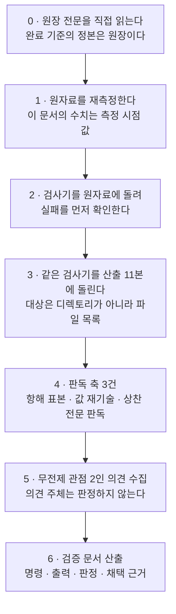
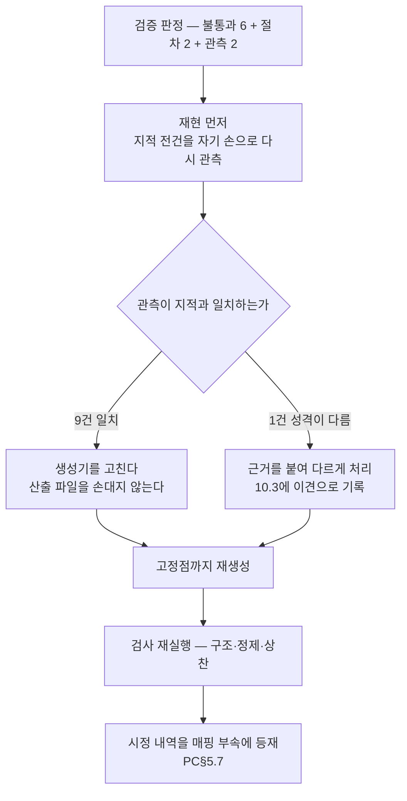

# 설계 프롬프트·설계 문서 재생성 — 문서작성 단계 산출

## 요약

**무엇을 만들었나.** 설계 단계가 확정한 11본 분권 구조대로 재생성본을 산출해 규격 경로에 착지시켰다 — 진입점 1본 · 축 문서 6본 · 부속 3본 · 재생성 스펙 1본. 원자료(설계 문서 4,404줄 + 입력 스펙 666줄)의 자산은 **손으로 옮기지 않고 기계 변환으로 이관**했다. 변환은 재현 가능한 스크립트로 수행했고 스크립트를 트리 안(`tools/`)에 남겼다 — 검증 단계가 같은 코드로 좌우변을 다시 추출할 수 있어야 대조가 성립하기 때문이다.

**무엇이 대조로 확인됐나.** 자산 좌변 654건 전건이 매핑표에 등재됐고(누락 0), 우변 총량은 좌변 − 자리 소멸 선언 + 신규 등재와 **전 종류에서 정확히 일치**한다(차이 0). 규율 39건은 번호를 유지한 채 전건이 장치 슬롯을 동반 이관했다. 삭제 연산 0건 · 분량 사유 축약 고지 0건.

**무엇을 실행해 확인했나.** 기계 판정 가능한 검증 기준 4항목(개요·상세 분리 / 이중 정의 / 주소 유일·참조 해소 / 요약 계층)을 구조 검사기로 실행해 **재생성본 PASS · 원자료 FAIL 5항목**을 함께 기록했다. 통과만 하는 검사는 검사가 아니므로 원자료 실패 확인을 같은 라운드에서 냈다. 정제 스캔은 산출 11본 전건에 대해 검출 0건이다.

**재작업 라운드 1(10절).** 검증 단계가 **불통과** 판정을 냈다 — 원장 완료 기준 9항 중 3항, 설계 검증 기준 9항 중 4항. 불통과 6건과 절차 결함 2건·관측 2건을 전건 처리했다. **전건이 표기·기록 층이고 계약 내용을 바꾼 것은 없다.** 처리 후 재실행에서 구조 검사 PASS · 정제 스캔 0건 · 상찬 스캔 0건이다. 1절~9절의 수치는 **라운드 1 착지 시점의 값**이며 현재 값은 10절이 정본이다.

**무엇을 보고하는가 — 6절에 8항, 10절에 3항.** 디스패치 지시의 착지 디렉토리가 원장 완료 기준·설계 결정과 어긋나 정본을 따랐다 · 설계에 실린 구조 검사기의 무자격 참조 판정식이 한 글자 문서 접두를 오검출해 고쳤다 · 부속의 기계 판독 블록을 코드 블록이 아니라 표로 적었다(검사기와 기준 문면의 갈림) · 상찬 어휘 스캔이 4건을 검출했고 전건이 금지 규율 자신의 정의 문면이다 · 축약 고지 스캔의 오탐 1건 · 절 참조 개별 판독 13건 · 자산 식별자 산식의 취약점 · 장 제목 6건의 헤딩 자리 소멸.

## 1. 산출 — 재생성본 11본

### 1.1 착지 목록

경로는 재생성 대상 트리의 루트 상대 경로다. 문서 간 관계는 경로 문자열이 아니라 frontmatter 참조 슬롯으로 맺었다.

> **줄 수·헤딩·표지 열은 라운드 1 착지 시점의 값이다.** 재작업 이후의 값은 10.4절에 있다. 착지 경로·주소·유형은 재작업에서 바뀌지 않았다.

| 순서 | 주소 | 문서 | 유형 | 착지 경로 | 줄 수 | 헤딩 | 계약 표지 |
|---:|---|---|---|---|---:|---:|---:|
| 1 | `S` | 재생성 스펙 — 확정 제약 19항 | RF | `docs/reference/public/2026/07/RF-20260728T184000Z-a66b37aa-harness-design-spec-regenerated.md` | 737 | 46 | 0 |
| 2 | `A` | 문서 체계 | DS | `docs/design/public/2026/07/DS-20260728T184100Z-25404613-harness-axis-a-document-system.md` | 839 | 44 | 12 |
| 3 | `B` | 실행 모델·파이프라인·큐 | DS | `docs/design/public/2026/07/DS-20260728T184200Z-9e90fda0-harness-axis-b-execution-pipeline.md` | 838 | 48 | 10 |
| 4 | `C` | 에이전트 조직 | DS | `docs/design/public/2026/07/DS-20260728T184300Z-a7d03731-harness-axis-c-agent-organization.md` | 756 | 48 | 6 |
| 5 | `D` | 오딧·통지·의사결정 문서 | DS | `docs/design/public/2026/07/DS-20260728T184400Z-33b4ec69-harness-axis-d-audit-notify.md` | 604 | 41 | 8 |
| 6 | `E` | 설치기·실행 환경 | DS | `docs/design/public/2026/07/DS-20260728T184500Z-0a98825c-harness-axis-e-installer-environment.md` | 793 | 43 | 13 |
| 7 | `F` | 리드 게이트·품질 게이트 | DS | `docs/design/public/2026/07/DS-20260728T184600Z-34f8da59-harness-axis-f-lead-quality-gate.md` | 714 | 54 | 12 |
| 8 | `PA` | 실측 항목 색인 | DS | `docs/design/public/2026/07/DS-20260728T184700Z-14c7d0d7-harness-annex-measure-index.md` | 125 | 4 | 0 |
| 9 | `PB` | 미결·이력 | DS | `docs/design/public/2026/07/DS-20260728T184800Z-2610da2f-harness-annex-open-issues-history.md` | 155 | 12 | 0 |
| 10 | `PC` | 무손실 매핑 | DS | `docs/design/public/2026/07/DS-20260728T184900Z-bc424b30-harness-annex-lossless-mapping.md` | 997 | 25 | 0 |
| 11 | `IX` | 진입점 | DS | `docs/design/public/2026/07/DS-20260728T185000Z-77801729-harness-design-entry-point.md` | 292 | 17 | 0 |

착지 순서는 참조 슬롯의 대상 실재 요구에서 나온다 — 스펙이 먼저, 축 문서가 그 다음, 부속, 마지막이 구성 문서 10본 전건을 가리키는 진입점이다.

### 1.2 1회 로드 단위의 변화 (관측 — 판정 기준 아님)

줄 수는 판정에 쓰지 않는다. 분량 상한을 두지 않았고 총량 축소는 성과 지표가 아니다. 아래는 "한 번에 읽어야 하는 단위가 얼마나 작아졌는가"의 관측이다.

| 구분 | 원자료 | 재생성본 |
|---|---:|---|
| 설계 내용의 최대 로드 단위 | 4,404줄 (단일 파일 1본) | 997줄 (최대 문서 1본) |
| 개요만 읽을 때의 로드 단위 | 없음 — 개요와 상세가 같은 파일·같은 깊이 | 292줄 (진입점 1본) |
| 문서 수 | 2본 (설계 문서 + 입력 스펙) | 11본 |
| 총 줄 수 | 5,070 | 6,850 |

총 줄 수가 늘어난 것은 문서당 frontmatter·요약·참조 절이 붙고 진입점과 매핑 부속이 신설됐기 때문이다. 내용을 줄여 항해 가능성을 얻는 경로는 배제돼 있었다.

## 2. 착수 전 정본 대조

프롬프트 요약이 아니라 실물에 대해 대조했다.

| 대조 축 | 디스패치 프롬프트의 지시 | 정본 | 처리 |
|---|---|---|---|
| 산출 착지 위치 | 평면 디렉토리 하위에 개요 본문과 부속 문서 | 원장 완료 기준 2(경로·파일명 문법 위반 0건) + 설계 결정 6(규격 경로 착지) | **정본을 따랐다** — 규격 경로에 착지. 보고 6-1 |
| 산출 구성 | 개요 본문 1본 + 부속 다수 | 설계 4절(진입점 1 + 축 6 + 부속 3 + 스펙 1 = 11본) | 설계를 따랐다 — 프롬프트의 "설계의 분할 규칙대로"가 이 해석을 지시한다 |
| 개요/상세 분리 | 본문은 결정·근거 요지, 부속은 스키마·의사코드 전문 | 설계 5.4의 층위 계약 L0~L3 — 전문은 **같은 소절 안의 블록**이고 부속 문서로 내리지 않는다 | 설계를 따랐다. 계약 전문을 부속으로 내리면 소유가 이동해 배치 규칙 P1·P3과 충돌한다 |
| 원자료 줄 수 | 4,369줄 | 실측 4,404줄 | 실측값 사용 |
| 코드 블록 수 대조 기준 | — | 설계 6.7의 재측정값 81(다이어그램 38 + 기타 43) | 착수 시 재측정해 동일 확인 |

## 3. 이관 방법 — 기계 변환과 개별 판독

### 3.1 무엇을 기계가 했나

| 변환 | 대상 건수 | 규칙 | 자동화 |
|---|---:|---|---|
| 스펙 참조 표기 통일 | 756 | `스펙` 자격 → 스펙 문서 접두 | 기계 |
| 무자격 참조에 자기 축 접두 부여 | 586 | 장 내부의 절 번호는 그 장 자신의 것이라는 기존 해석 규약을 그대로 변환식으로 | 기계 |
| 장 한정 참조 정규화 | 107 | 장 번호 → 축 접두 | 기계 |
| 축 한정 참조 정규화 | 32 | 축 문자 → 접두 | 기계 |
| 오딧 축 절 표기 단일화 | 156 | 점 표기 → 접두 + 절 기호 표기. 헤딩도 함께 재표기 | 기계 |
| 부속 단위 언급 | 34 | 부속 문서 접두로 치환 | 기계 |
| 부속 항목 지정 | 2 | 항목 식별자로 치환(표기 축 분리) | 기계 |
| 계약 표지 부여 | 61 | 비 다이어그램 코드 블록·필드 표를 소유한 소절에 표지 | 기계(후보 산출) |
| 요약 3항 고정 라벨 | 7 | 각 문서 요약 절에 확정·실측 대기·미결 라벨 | 기계 + 신설 서술 |

축 별칭(문서 체계 축·파이프라인 축 등)이 앞에 붙은 참조는 별칭 해석표로 해당 축에 배정했고, 별칭 뒤에 여는 괄호가 오는 형태(축을 규정한 스펙 절을 가리키는 표기)는 스펙으로 배정했다. 두 형태는 문면에서 구분된다.

### 3.2 무엇을 사람이 판독했나

기계 규칙만으로 갈리지 않는 참조 13건을 문면 대조로 개별 확정했다. 전건이 "형태상 자기 축으로 보이나 실제로는 다른 문서를 가리키는" 부류다.

| 원 표기 위치 | 기계 배정 | 판독 결과 | 근거 |
|---|---|---|---|
| 축 B 본문 2건 | 자기 축 §10-12 | 스펙 §10-12 | 축 B 의 해당 절은 항목이 10개뿐이라 12번이 없다. 문면도 선행 운영의 실패 패턴을 가리킨다 |
| 축 C 본문 1건 | 자기 축 §3.7 | 스펙 §3.7 | 축 C 에 해당 절이 없다. 문면은 의사결정 문서 경로를 가리킨다 |
| 축 E 본문 3건 | 자기 축 §8-2 · §9.3-13 | 스펙 동번 | 축 E 의 해당 절은 하위 절 구조가 달라 그 형태의 항목이 없다 |
| 축 F 본문 8건 | 자기 축 §9.4-20 · §9.4-22 | 스펙 동번 | 문면이 스펙의 "규율로만 막히는 축" 분류를 인용한다 |
| 축 A 본문 1건 | 자기 축 §9.3 | 축 C 의 동번 절 | 문맥이 조직 축에 반영한 내용을 서술한다 |
| 부속 PB 본문 4건 | 부속 자기 절 | 축 A · 축 F 의 각 절 | 원 부속 B·D 는 자기 절 번호가 없어 소속 판독이 필요했다 |

판독 후 **재생성본 전건에 대해 주소 실재를 전수 대조**했다 — 존재하지 않는 절을 가리키는 참조 0건. 이 대조는 형태 검사(접두 유무)가 잡지 못하는 오배정을 잡는 유일한 층이다.

### 3.3 무엇을 하지 않았나

- **절 번호를 다시 매기지 않았다.** 문서 안에서 이미 유일하므로 접두만 붙이면 전역 유일이 된다. 재번호는 자기 축 참조 586건을 전부 재매핑 대상으로 만들면서 얻는 것이 없다.
- **내용을 고치지 않았다.** 설계가 결정한 문서 유형 어휘 시정은 재생성본에 반영하지 않고 미결로 이관했다 — 재생성본과 원자료의 차이가 곧 형태 변경분이어야 무손실 대조가 성립한다.
- **검사를 통과시키려고 없던 내용을 만들지 않았다.** 규율 39건 중 장치 슬롯 브랜치가 한쪽뿐인 항목은 그대로 옮기고 상태를 매핑표의 브랜치 열에 기록했다.
- **빈 절을 만들지 않았다.** 축 B 에는 원자료에 미결 절이 없어 신설하지 않고, 요약의 미결 항에서 부속을 가리켰다.

## 4. 자체 검사 실행 기록

### 4.1 검사 대상과 도구

- **검사 대상**: 1절 표의 11본. 같은 디렉토리에 선행 단계 산출(분석·설계·본 문서)이 함께 있으므로 **대상은 디렉토리가 아니라 파일 목록**이다. 디렉토리를 통째로 넘기면 문서 접두가 없는 단계 산출이 축 문서로 오분류된다.
- **도구**: 트리의 `tools/` 하위. 표준 라이브러리만 쓰며 외부 패키지를 요구하지 않는다.

| 파일 | 하는 일 |
|---|---|
| `tools/lib.py` | 자산 추출기 + 주소 변환기. 좌변·우변에 같은 코드로 돌린다 |
| `tools/checks.py` | 구조 검사기 — 기준 1·3·4·6 판정 |
| `tools/scan.py` | 정제 스캔 — 목록의 각 정규식을 대소문자 구분으로 적용 |
| `tools/praise.txt` | 상찬 어휘 목록(정책 파일). 문서 본문에 싣지 않는다 — 실으면 그 문서가 자기 스캔에 걸린다 |
| `tools/build_*.py` · `tools/compute_new.py` | 재생성 실행체. 같은 입력에서 같은 산출이 나온다 |

### 4.2 기준별 실행 결과

| 기준 | 실행 | 결과 | 판정 |
|---|---|---|---|
| 1 개요·상세 분리 | 구조 검사기 | 진입점·부속의 계약 단위 0 · 관할 결손 0 · 표지 61 = 색인 61 · 표지와 색인의 양방향 차집합 0 | 통과 |
| 2 무손실 양방향 | 자산 추출기 좌·우변 + 매핑 대조 | 좌변 누락 0 · 우변 차이 0 · 규율 39/39 · 슬롯 실재 39/39 | 통과 |
| 3 이중 정의 | 구조 검사기 | 계약명 중복 0 (61종 전부 유일) | 통과 |
| 4 주소 유일·참조 해소 | 구조 검사기 + 주소 실재 대조 | 주소 중복 0종 · 무자격 참조 0 · 미존재 주소 0 | 통과 |
| 5 항해 2홉 | 표본 15건 판독 | 15건 전부 진입점에서 목적 문서 도출 가능 | 통과 |
| 6 요약 계층 | 구조 검사기 | 요약 절 부재 0 · 3항 라벨 결손 0 | 통과 |
| 7 정제 스캔 | 스캔 스크립트 | 패턴 18종 × 11본 → 검출 0 | 통과 |
| 8 아부 금지 | 어휘 스캔 + 판독 | 스캔 4건 검출 — 전건이 금지 규율 자신의 정의 문면(보고 6-4). 상찬 행위 0건 | 판독 필요 — 검증 단계로 |
| 9 규격 착지·축약 금지 | 필수 필드·절 대조 + 축약 고지 스캔 | 필수 필드 결손 0 · 요약 절 결손 0 · 삭제 행 0 · 축약 고지 스캔 1건(오탐 — 보고 6-5) | 통과(오탐 판독 첨부) |

기준 5는 판독형이라 명령 출력이 아니라 표본 기록이 증거다. 표본 15건 중 초기 실행에서 1건(요청 브랜치·워크트리 모델)이 진입점에서 도출되지 않아, 진입점의 축 소유 범위 서술에 해당 주제를 추가한 뒤 재실행해 15/15가 됐다. 소유 범위 서술은 계약이 아니라 색인이므로 이 보완은 계약 단위를 진입점에 넣는 것이 아니다.

### 4.3 검출력 확인 — 원자료 선행 실패

통과만 하는 검사는 검사가 아니다. 같은 검사기를 원자료에 돌린 결과를 함께 낸다.

| 대상 | 표지 | 색인 행 | 관할 결손 | 주소 중복 | 무자격 참조 | 요약 결손 | 판정 |
|---|---:|---:|---:|---:|---:|---:|---|
| 원자료(단일 파일) | 0 | 0 | 72 | 53종 | 1,503 | 7 | **FAIL 5항목** |
| 재생성본 11본 | 61 | 61 | 0 | 0종 | 0 | 0 | **PASS** |

기준 3은 원자료에서 "계약 표지 0건이라 수집 대상이 없다"는 이유로 판정 불능 처리돼 FAIL이다 — 표지가 없으면 "중복 0건"이 공허 통과가 되기 때문이다. 정제 스캔은 합성 탐침 문자열에 대해 검출 1건을 확인했다(양방향 검출력).

### 4.4 무손실 대조 수치

> **이 표는 라운드 1 값이며, 절 헤딩 행은 재작업에서 정정됐다.** 좌변 328은 입력 스펙의 문서 제목 1건을 빠뜨린 값이고, 그 누락과 자리 소멸 미선언이 같은 항목이라 총량 산식에서 서로 상쇄돼 차이 0으로 통과했다. 정정판은 10.4절.

| 종류 | 원자료 + 스펙 | 자리 소멸(선언) | 신규 등재 | 기대 합 | 재생성본 실측 | 차이 |
|---|---:|---:|---:|---:|---:|---:|
| 절 헤딩 | 328 | 6 | 60 | 382 | 382 | 0 |
| 다이어그램 | 51 | 0 | 2 | 53 | 53 | 0 |
| 코드 블록 | 43 | 0 | 0 | 43 | 43 | 0 |
| 표 | 106 | 0 | 39 | 145 | 145 | 0 |
| 규율 항목 | 39 | 0 | 0 | 39 | 39 | 0 |

집합 대조로 판정한 축은 별도다 — 실측 항목 54 · 미해소 지적 25 · 조립 통일 내역 17 · 자기 일관성 기록 1 · 확정 제약 19 · 설계 세션 과제 10, 전건 누락 0.

본문 조각 수준의 이관도 확인했다: 축 문서 6본의 원자료 비공백 줄 3,035줄 중 재생성본에 그대로 나타나지 않는 것은 2줄이며, 둘 다 원 요약의 "미확정" 항목이 요약의 **실측 대기** 항으로 옮겨간 것이다(내용은 보존, 위치만 이동). 부속 4종의 본문 조각은 미확인 0건이다.

## 5. 검증 단계 인계

### 5.1 그대로 실행할 것

### 5.2 판독이 남는 축

| 축 | 왜 기계가 못 하나 | 무엇을 봐야 하나 |
|---|---|---|
| 값 재기술(기준 3의 판독분) | 같은 계약명이 두 곳에 없어도 값이 산문으로 복사될 수 있다 | 축 문서 요지에 필드명·열거 원소·임계 수치·경로 리터럴이 등장하는지 |
| 상찬 판독(기준 8) | 어휘 목록 밖의 표현은 스캔이 잡지 못한다 | 산출 전문. 스캔 4건의 성격 판정(보고 6-4)도 포함 |
| 항해(기준 5) | 도달 여부는 세계 지식이 필요하다 | 표본을 다시 뽑아 진입점 1본만으로 목적 문서가 도출되는지 |
| 표지 누락(기준 1의 후보 스캔) | 표지는 저자 선언이라 안 붙이면 색인에도 안 잡힌다 | 계약처럼 보이는데 표지가 없는 소절 — 관할 검사가 통과해도 남는 하한 |

### 5.3 검증 단계가 쓸 값

| 값 | 이 라운드 실측 | 유의 |
|---|---|---|
| 검사 대상 파일 | 11본(1절 표) | 같은 디렉토리의 단계 산출 3본은 대상이 아니다 |
| 계약 표지 = 색인 행 | 61 = 61 | 다르면 색인 결함이 아니라 대조 실패다 |
| 규율 | 39건 · 결번 0 · 슬롯 실재 39/39 · 양 브랜치 보유 22 | 브랜치 22는 원자료 상태 그대로다. 통과 조건이 아니다 |
| 실측 항목 | 54건 (7·10·6·10·14·7) | 색인 행 수 = 축 문서 추출 수 |
| 미결 | 34항 (기존 25 + 재생성 라운드 신규 9) | 신규 9항은 이번 범위 밖 처리 |

## 6. 관측 — 보고 항목

### 6-1. 디스패치 지시의 착지 디렉토리가 정본과 어긋난다

디스패치 프롬프트는 본문과 부속을 평면 디렉토리 하위에 두라고 지시했다. 원장 완료 기준 2는 산출 파일의 경로·파일명이 문서 체계 축 스키마를 만족할 것과 문법 위반 0건을 요구하고, 설계 결정 6은 같은 근거로 규격 경로 착지를 확정했다. **정본을 따라 규격 경로에 착지**시켰다. 프롬프트가 지정한 디렉토리명 자체가 정제 목록 패턴에 걸린다는 점도 같은 방향의 근거다. 이 보고는 설계 단계가 이미 낸 것과 같은 사안이며, 문서작성 단계에서도 같은 판정을 유지했다.

### 6-2. 설계에 실린 구조 검사기의 무자격 참조 판정식이 한 글자 문서 접두를 오검출한다

설계 8.3의 검사기는 절 기호 앞 14자를 잘라 마지막 3자를 보관하고, 그 문자열을 다시 뒤 2자로 잘라 접두를 판정한다. 이 방식에서 여는 괄호나 세로줄 바로 뒤에 오는 **한 글자 접두**는 접두가 없는 것으로 계수된다 — 두 글자 접두는 영향이 없다. 재생성본에서 참조의 상당수가 괄호 안에 있으므로 이 결함을 두면 정상 산출이 상시 FAIL이 된다.

**처리**: 판정식을 "절 기호 직전 토큰이 유효한 문서 접두이고 그 앞이 문자·숫자가 아닐 것"의 경계 일치로 고쳐 실행했다. 고친 판정식으로도 원자료는 FAIL(무자격 참조 1,503건)이고 재생성본은 통과다 — 느슨하게 만든 것이 아니라 자리를 바로잡은 것이다. 설계 문서 쪽 판정식의 갱신은 부속 PB 의 신규 미결에 등재했다.

### 6-3. 부속의 기계 판독 블록을 코드 블록이 아니라 표로 적었다

설계는 매핑표·신규 목록·규율 대조를 부속 문서의 코드 블록으로 두라고 했다. 그런데 같은 설계의 검사기는 부속 문서의 **모든 비 다이어그램 코드 블록**을 계약 단위로 계수한다. 매핑 데이터는 판정식·문법·스키마가 아니므로 검증 기준 1의 문면(그 세 종류의 코드 블록 0건)에는 걸리지 않지만, 검사기 구현은 그 구분을 하지 못한다.

**처리**: 기준 문면과 검사기 구현을 동시에 만족시키는 표 표기를 택했다. 표는 산문이 아니므로 "손 나열 목록은 좌변으로 인정하지 않는다"는 요건을 깨지 않는다. 어느 쪽을 정본으로 삼을지의 판정은 미결로 남겼다.

### 6-4. 상찬 어휘 스캔 4건 — 전건이 금지 규율 자신의 정의 문면

닫힌 어휘 스캔이 4건을 검출했고 전건이 재생성 스펙(`S`) 안에 있다. 내역: 확정 제약 19항의 문면이 금지 대상 표현을 예시로 인용한 부분 2건, 같은 항에서 동의 표명이 검증을 대체한다고 규정한 서술 1건, 계승 원칙 절의 같은 취지 서술 1건. **네 건 모두 상찬 행위가 아니라 상찬을 금지하는 규정 자신의 문면**이다.

이 자기 참조는 설계가 이미 예견한 형태다 — 어휘 목록을 본문에 나열하면 그 문서가 자기 스캔에 걸린다. 스펙의 문면은 무손실 전사 대상이라 표현을 바꿀 수 없다. 판정은 검증 단계의 전문가 판독에 넘긴다. 다만 **판독 없이 "스캔 검출 0건"으로 적을 수는 없으므로** 검출 사실과 성격을 여기 명시한다.

### 6-5. 축약 고지 스캔의 오탐 1건

축약 고지 스캔이 축 A 에서 1건을 검출했다. 문면은 파일명 슬러그 생성 규칙("유의미 문자가 3자 미만이면 슬러그를 생략한다")이며 **분량·지면을 이유로 내용을 줄인 고지가 아니다.** 스캔 패턴에 일반 동사가 들어 있어 발생하는 오탐이다. 매핑표의 삭제 행이 0건이므로 교차 확인에서도 대응 행이 없다.

### 6-6. 절 참조의 개별 판독 13건 — 기계 규칙만으로는 갈리지 않는다

설계는 진입부·부속의 22건을 개별 판독 대상으로 예상했다. 실제로 판독이 필요했던 것은 **다른 부류 13건**이다(3.2 표) — 축 문서 본문에서 자기 축 형태를 띠지만 스펙이나 다른 축을 가리키는 참조다. 형태 검사(접두 유무)는 이 오배정을 원리적으로 잡지 못한다. 이를 잡은 것은 **주소 실재 대조**(그 절이 그 문서에 있는가)이며, 재생성본이 전역 유일 주소를 갖게 되면서 비로소 가능해진 검사다. 검증 단계는 형태 검사와 실재 대조를 둘 다 돌려야 한다.

### 6-7. 자산 식별자 산식이 삽입에 취약하다

설계는 헤딩·다이어그램·코드 블록·표의 식별자를 등장 순서로 정했다. 재생성에서 절이 하나만 삽입돼도 이후 일련번호가 전부 밀려 좌우변 대조가 무력해진다. 이번 라운드는 **좌변 일련번호를 원자료 등장 순서로 고정하고 우변은 주소로 대조**해 회피했고, 총량 축은 선언 증감량과 실측 증감량의 차이로 판정했다. 산식 자체의 개정은 미결이다.

### 6-8. 장 제목 6건의 헤딩 자리가 소멸했다

원자료의 장 제목 6건은 재생성본에서 본문 헤딩이 아니라 **문서 제목(frontmatter)** 이 됐다. 문서 1본이 축 1개이므로 장 헤딩이 중복 층이 되기 때문이다. 매핑표에 이동 연산과 사유로 기록했고, 우변 총량 대조의 "자리 소멸(선언)" 열이 이 6건이다. 선언되지 않은 감소는 소실로 판정되므로 선언 자체가 대조의 일부다.

## 7. 이 단계가 만든 위험

| 위험 | 근거 | 완화 | 잔여 |
|---|---|---|---|
| 기계 변환이 형태는 맞고 대상은 틀린 참조를 만든다 | 자기 축 접두 부여는 문면 의미를 보지 않는다 | 주소 실재 전수 대조 + 개별 판독 13건 | 실재하지만 잘못된 절을 가리키는 참조는 남을 수 있다. 실재 대조는 그것을 잡지 못한다 |
| 계약 표지가 후보 산출에 의존한다 | 표지는 비 다이어그램 코드 블록·필드 표 보유를 기준으로 부여했다 | 관할 검사(모든 전문 블록이 표지 소절 관할 안) | 블록도 필드 표도 없이 계약을 정의하는 소절이 있으면 표지가 안 붙는다. 검증 단계의 후보 판독이 하한 |
| 검사기를 이 단계가 고쳤다 | 6-2 | 고친 뒤에도 원자료 FAIL·픽스처 PASS 양방향을 확인 | 산출을 만든 쪽이 검사기도 고쳤다는 구조적 취약. 검증 단계가 검사기 자체를 재검토해야 한다 |
| 요약 절이 대조의 사각이다 | 요약은 라벨 부여로 재구성됐다 | 원 요약 본문을 그대로 유지하고 라벨과 두 항만 신설 | 라벨을 붙이는 과정에서 원 요지가 재작성될 여지 |
| 도구가 트리 안에 있다 | 재현성을 위해 남겼다 | 문서 트리 밖(`tools/`)에 두어 문서 규격 검사 대상에서 분리 | 도구가 낡으면 문서와 갈린다 |

## 8. 참조

| 구분 | 식별 | 이 문서에서의 용도 |
|---|---|---|
| 요청 원장(완료 판정 정본) | `RQ-20260728T170616Z-d0bc4127` | 완료 기준 · 착지 경로 판정 |
| 분석 단계 산출 | `DS-20260728T171936Z-85146dc7` | 근원 5건 · 보존 자산 11종 |
| 설계 단계 산출 | `DS-20260728T174022Z-41b9cace` | 산출 형태 · 배치 판정 기준 · 무손실 규칙 · 검증 기준 · 테스트 시나리오 |
| 재생성본 진입점 | `DS-20260728T185000Z-77801729` | 산출물의 읽기 시작점 |
| 재생성본 무손실 매핑 | `DS-20260728T184900Z-bc424b30` | 자산 대조의 전건 기록 |
| 재생성본 미결·이력 | `DS-20260728T184800Z-2610da2f` | 이 단계가 남긴 신규 미결 9항 |
| 원자료 | 재생성 대상 트리 밖의 설계 문서·설계 프롬프트 | 좌변 추출 대상 |
| 정제 목록 | 재생성 대상 트리 루트의 스캔 목록 파일 | 기준 7 |

## 9. 표기 고지

- 작성자 필드 값은 역할 기반 자리표시자다. 공유 전제의 정제 지시에 따라 개인·에이전트 고유 이름을 산출물에 싣지 않으며, 실 표시명의 정본은 이름 레지스트리(조직 축 소유)다.
- 저장소 경로는 재생성 대상 트리의 루트 상대 경로로만 적었다. 정제 목록에 걸리는 절대 경로 리터럴은 본문에 싣지 않는다.
- 선행 판에 대한 지시어는 "선행 운영"으로 풀어 적었다.
- 규율 항목 없음 — 본 문서는 한 단계의 수행 기록이며 하네스 운영 규율을 정의하지 않는다. 운영 규율의 정본은 재생성본의 축 문서다.
- 1~9절의 수치는 측정 시각 2026-07-29 03:37~03:53 KST, 10절의 수치는 2026-07-29 05:05~05:20 KST 의 실측값이다. 다음 라운드는 재측정한다.
- 금지 어휘를 논하는 절에서 어휘 자체를 인용하지 않았다 — 인용하면 본 문서가 자기 판정 기준에 걸린다. 10.2절이 처방한 표기 규율을 본 문서가 먼저 적용했다.

---

## 10. 재작업 라운드 1 — 검증 불통과 처리

### 10.1 무엇이 들어왔나

검증 단계의 판정은 **불통과**다. 원장 완료 기준 9항 중 3항(무손실 매핑 · 중복 제거 · 아부 금지), 설계 검증 기준 9항 중 4항(무손실 양방향 · 이중 정의 · 주소 유일·참조 해소 · 아부 금지)이 통과 조건을 채우지 못했다. 여기에 절차 결함 2건과 관측 2건이 붙었다.

**불통과 전건이 0건 조건에 대한 소수 잔여이고, 내용 소실은 어느 축에서도 검출되지 않았다.** 그래서 이 라운드의 작업은 계약을 다시 쓰는 것이 아니라 기록·표기·주소를 고치는 것이다.

**산출 파일을 직접 고치지 않고 생성기를 고쳤다.** 손으로 고친 문서는 다음 재생성에서 조용히 되돌아가고, 그때는 아무도 그 사실을 모른다. 재생성이 **고정점에 도달할 때까지 반복**하는 실행체도 이 라운드에서 만들었다 — 부속이 자기 자신의 계수를 본문에 싣기 때문에 한 번만 돌리면 직전 판의 수를 인용한 채로 남는다.

### 10.2 처리 내역 — 불통과 6건

| # | 지적 | 근원 | 처리 | 확인 |
|---:|---|---|---|---|
| D1 | 매핑 좌변 누락 1건 — 입력 스펙의 문서 제목이 매핑표에도 자리 소멸 선언에도 없다 | 좌변 추출기가 문서 제목 헤딩을 버렸다. 축 문서 6본의 장 제목은 이동 행을 받았는데 스펙만 빠졌다 | 추출기가 제목을 좌변 자산으로 등재하고, 매핑표에 이동·자리 소멸 행을 낸다. 자리 소멸 선언 6 → 7 | 좌변 누락 0 · 자리 소멸 7 |
| D2 | 신규 헤딩 선언 건수 오기(선언 58 · 실제 60) | 건수를 손으로 적었다 | 표 행 수에서 계산하도록 바꿨다. 같은 오기가 날 자리를 없앤다 | 선언 63 = 행 63 |
| D3 | 매핑표 행 파손 1건 — 셀 값의 세로줄이 이스케이프되지 않아 열이 밀렸다 | 표기 규약이 기계 판독 지위를 보호하지 않았다 | 전 셀에 이스케이프를 걸고, **생성한 표를 되파싱해 열 수 균일성을 검사**한다. 불균일이면 착지시키지 않는다 | 열 불균일 0행 |
| D4 | 미해소 참조 1건 — 축 B 본문이 입력 스펙의 존재하지 않는 소절을 지시 | 주소 변환기의 연쇄 자격 상속. 10.3 참조 | 개별 판독으로 자기 축 주소 확정 + **주소 실재 검사를 상시 실행에 편입** | 미해소 참조 0 |
| D5 | 값 재기술 4건 — 상태 열거 11원소가 소유 축 밖 3자리, 회전 임계 2값이 1자리 | 원자료에서 승계. 정본 주소를 병기해 갈림은 없었으나 동기화 의무가 어디에도 없다 | 4자리 전건을 정본 주소 참조로 치환. 값의 **사본**만 지웠고 값은 정본에 그대로 있다 | 소유 축 밖 전문 열거 0자리 |
| D6 | 금지 어휘 스캔 4건 — 전건이 아부 금지 규율 자신의 정의 문면 | 규율이 금지 대상을 리터럴 예시로 적었다 | 리터럴 예시를 빼고 닫힌 목록의 정본 주소만 남겼다. **금지의 범위·강도는 불변** | 상찬 스캔 0건 |

**D6의 처리 근거를 따로 적는다.** 상찬 행위 자체는 0건이었고 걸린 것은 규정 문면뿐이므로, 예외를 하나 두면 통과시킬 수 있었다. 그렇게 하지 않은 이유는 검증 단계가 적은 것과 같다 — **자기 정책 문서가 상시로 걸리는 스캔은 예외 처리를 부르고, 예외가 생긴 스캔은 다음부터 아무도 보지 않는다.** 같은 저장소의 시크릿 금지 규율이 이미 같은 문제를 같은 방식(리터럴 인접을 끊는 표기)으로 처리하고 있어 새 장치도 필요하지 않았다. 문면 변경분은 재생성 스펙의 요약 절에 표기 이탈로 고지했다 — 스펙은 무손실 전사 대상이므로 변경은 고지 없이 지나갈 수 없다.

### 10.3 지적과 다르게 처리한 것 1건 — 근거

| 축 | 검증 단계의 서술 | 재현 결과 | 처리 |
|---|---|---|---|
| D4 의 성격 | "원자료에 이미 있던 **승계 결함**이며 접두 부여 변환이 그대로 옮겼다" · 처방은 "승계 결함으로 표시하고 미결 등재" | **승계가 아니라 변환 오적용으로 판독했다.** 원자료의 해당 참조는 접두 없이 적혀 있었고, 원자료 규약에서 접두 없는 참조는 자기 장의 절을 뜻한다. 자기 장에는 그 번호의 절이 실재하고 문면이 가리키는 개념과 일치한다. 같은 원자료가 다른 자리에서 같은 개념을 자기 장 지시로 부른 용례도 있다. 스펙 자격이 붙은 것은 **쉼표 연쇄에서 직전 참조의 자격을 물려주는 변환 규칙** 때문이다 | 미결로 남기지 않고 **정정**했다. 승계 표시만 하면 이 라운드도 미해소 참조 1건을 안고 끝난다. 대신 ①정정 근거를 매핑 부속의 승계 항목 절에 기록 ②산식 개정 여부를 신규 미결로 등재 ③형태 검사가 잡지 못하는 층이라 **주소 실재 검사**를 상시 실행에 넣었다 |

이견은 여기까지다. 나머지 9건은 재현에서 지적과 일치했고 처방도 그대로 따랐다.

### 10.4 처리 내역 — 절차 결함 2건과 관측 2건

| 축 | 지적 | 처리 |
|---|---|---|
| 절차 | 정제 스캔의 명령형 실행이 부정 전방탐색 패턴에서 오류로 끝나는데, 표준 오류를 버리고 줄 수만 세는 형태에서 **오류와 검출 0건이 구별되지 않는다** — 그 패턴은 명령형 실행에서 한 번도 적용된 적이 없다 | 고정 스크립트로 옮기고 종료 코드를 셋으로 나눴다(0 정상 · 1 검출 · 2 실행 오류). 적용 전에 **패턴의 갈래마다 탐침을 합성해 검출력을 먼저 확인**하고, 합성할 수 없는 문법이 하나라도 있으면 스캔 자체를 오류로 끝낸다. 첫 갈래만 시험하면 뒤쪽 갈래의 문법 실패를 못 보므로 최상위 선택지를 전부 쪼개 시험한다 — 실제로 걸렸던 것이 목록 뒤쪽 갈래의 부정 전방탐색이었다 |
| 절차 | 심볼릭 링크 디렉토리를 대상으로 쓰면 재귀 검색이 링크를 따르지 않아 **거짓 0건**이 난다 | 대상에 링크가 있으면 오류로 끝낸다. 구조 검사는 디렉토리 자체를 거부하고 고정 파일 목록만 받는다. 목록 파일을 트리에 두고 안내 파일이 그것을 가리킨다 |
| 관측 | 요약 절 주소 부여가 축마다 불일치 — 5본은 0번, 1본은 무번호이고 그 축의 0번은 다른 절이 쓴다. 주소 유일 검사가 무번호 헤딩을 세지 않아 충돌이 보이지 않았다 | 요약 절을 **무번호 명명 주소**로 11본 통일했다. 절 번호를 쓰는 한 0번을 다른 절이 쓰는 문서에서는 충돌을 피할 수 없다. 명명 주소는 절 번호 공간과 겹치지 않는다. 함께 ①명명 주소를 주소 유일 검사 대상에 넣고 ②헤딩 자산의 우변 주소 중복 검사를 매핑 생성기에 붙였다 |
| 관측 | 지시문이 지정한 산출 경로가 실재하지 않는다 — 세 라운드 연속 보고인데 지시하는 쪽에 반영되지 않았다 | **보고의 위치가 보고의 도달 가능성을 결정한다**는 것이 이 관측의 내용이다. 산출물 안쪽에만 쌓으면 지시문만 가진 사람에게 닿지 않는다. 그래서 ①트리 루트에 안내 파일을 두어 트리에 처음 온 사람이 어느 파일부터 여는지 알 수 있게 하고 ②재생성 이전 스냅샷 폴더에 지위 표시 파일을 두고 ③**이 어긋남을 단계 반환 텍스트의 첫머리로 올렸다** — 문서 안쪽이 아니라 지시하는 쪽이 읽는 자리다 |

세 번째 관측의 처리는 검증 단계가 채택한 무전제 관점 의견 4건(안내 파일 부재 · 스냅샷 지위 미표시 · 유사 이름 디렉토리 구분 불가 · 개요 파일 식별 곤란)을 함께 덮는다.

### 10.5 재작업 후 실측

측정 방법은 **추출기의 줄 분할 계수**이며 1절 표와 같은 방법이다(줄 수 계수 명령은 파일당 1씩 작게 나온다 — 마지막 개행 뒤 빈 조각을 세지 않기 때문이고, 두 방법을 섞으면 증감이 측정 방법 차이인지 내용 차이인지 구분되지 않는다). 라운드 1 대비 증감의 사유를 함께 적는다.

| 문서 | 라운드 1 | 재작업 후 | 증감 사유 |
|---|---:|---:|---|
| S 재생성 스펙 | 737 | 739 | 표기 이탈 고지 1항 추가 |
| A 문서 체계 | 839 | 839 | 값 재기술 2자리 치환(줄 수 불변) |
| B 파이프라인 | 838 | 838 | 참조 1건 주소 정정 |
| C 조직 | 756 | 756 | 값 재기술 1자리 치환 |
| D 오딧·통지 | 604 | 604 | 값 재기술 1자리 치환 |
| E 설치 | 793 | 793 | 변경 없음 |
| F 리드 게이트 | 714 | 714 | 요약 주소 참조 1건 정정 |
| PA 실측 색인 | 125 | 125 | 변경 없음 |
| PB 미결·이력 | 155 | 157 | 신규 미결 2항 |
| PC 무손실 매핑 | 997 | 1,043 | 좌변 1행 + 시정 내역 3절(집합 축 대조 · 승계 항목 · 시정 내역) |
| IX 진입점 | 292 | 293 | 명명 주소 규약 1행 |
| **합계** | **6,850** | **6,901** | |

| 대조 축 | 라운드 1 | 재작업 후 | 성격 |
|---|---:|---:|---|
| 좌변 절 헤딩 | 328 | 329 | 입력 스펙 문서 제목 1건 등재 |
| 자리 소멸 선언 | 6 | 7 | 같은 1건 |
| 신규 헤딩 | 60 | 63 | 매핑 부속의 신설 절 3개 |
| 우변 절 헤딩 실측 | 382 | 385 | 기대 합과 차이 0 |
| 매핑표 행 | 654 | 655 | 좌변 1행 |
| 미결 총계 | 34 | 36 | 신규 미결 2항 |
| 계약 표지 = 색인 행 | 61 = 61 | 61 = 61 | 계약은 손대지 않았다 |

### 10.6 재실행 결과

| 검사 | 명령 | 결과 | 종료 코드 |
|---|---|---|---|
| 구조 검사 | 구조 검사기에 고정 목록을 넘겨 실행 | 대상 11본 · 표지 61 · 색인 행 61 · 관할 결손 0 · 주소 중복 0종 · 무자격 참조 0 · **미해소 참조 0** · 요약 결손 0 → PASS | 0 |
| 정제 스캔 | 스캔 스크립트에 고정 목록을 넘겨 실행 | 자기 시험 패턴 18종·갈래 30개 실패 0건 → 검출 0건 | 0 |
| 상찬 스캔 | 같은 스크립트에 상찬 어휘 목록을 넘겨 실행 | 자기 시험 패턴 10종·갈래 32개 실패 0건 → 검출 0건 | 0 |
| 재생성 고정점 | 실행체를 반복 실행 | 2회 반복에서 산출 불변 — 고정점 도달 | 0 |

**자기 시험이 실제로 잡은 것이 있다.** 탐침 합성기를 처음 붙였을 때 수량자를 붙인 이스케이프 문자를 처리하지 못해 패턴 1종의 자기 시험이 실패했고, 스캔은 그 상태에서 실행을 거부했다. 합성기를 고친 뒤 18종 전건이 통과했다. 이 실패가 조용히 넘어갔다면 그 패턴은 이번에도 적용되지 않은 채 "검출 0건"을 보고했을 것이다 — 그것이 이 라운드가 고치라고 받은 결함의 정확한 형태다.

### 10.7 이 라운드가 남긴 것

| 항목 | 상태 |
|---|---|
| 신규 미결 2항 | 연쇄 자격 상속 산식의 개정 여부 · 승계 축을 매핑 스키마 열로 승격할지. 둘 다 **시정은 마쳤고 산식·스키마 결정만 남았다** |
| 승계 결번 1건 | 착지 게이트 오류 코드의 결번. 원자료에도 사유 기록이 없다. 번호를 메우는 것은 형태 변경이 아니라 내용 생성이라 그대로 두고 매핑 부속의 승계 항목 절에 표시했다 |
| 검사기를 만든 쪽과 산출을 만든 쪽이 같다 | 라운드 1과 같은 구조적 취약이 남는다. 이번 라운드가 추가한 주소 실재 검사·표 열 균일성 검사·탐침 자기 시험도 같은 손이 만들었다. 다음 검증은 검사기 자신을 먼저 의심하는 순서를 그대로 반복해야 한다 |
| 지시문 경로 어긋남 | **처방이 이 트리 밖에 있다.** 안내 파일과 단계 반환 보고까지가 산출 쪽이 할 수 있는 전부이고, 지시문 자체의 정정은 지시하는 쪽의 일이다 |
