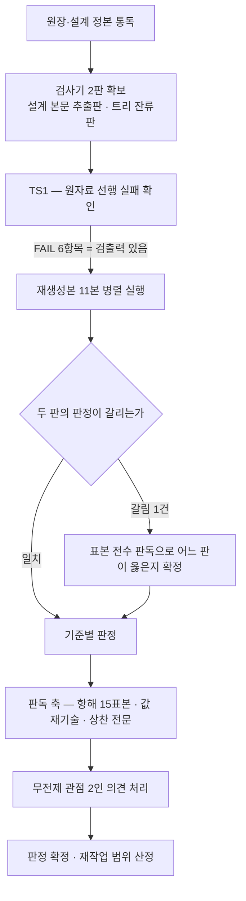

# 설계 프롬프트·설계 문서 재생성 — 검증 단계 판정(라운드 1)

## 요약

**확정** — 판정은 **불통과**다. 원장 완료 기준 9항 중 3항, 설계 검증 기준 9항 중 4항이 통과 조건을 충족하지 못했다. 불통과 항목은 전부 **0건 조건에 대한 소수 잔여**이며 내용 소실은 확인되지 않았다 — 원자료 본문 자산의 소실은 어느 축에서도 검출되지 않았고, 잔여는 매핑 기록·주소 해소·값 배치·표기 규율 네 자리에 있다. 재작업 범위는 6건으로 특정된다(IX§ 해당 없음 — 본 문서 6절).

**실측 대기** — 없음. 본 라운드의 모든 판정은 명령 출력으로 확정했고, 인용한 선행 수치는 전건 재측정했다. 재측정에서 작성 단계 보고와 어긋난 값 3건은 5절에 대조표로 남겼다.

**미결** — 3항. ①금지 어휘를 정의하는 문면이 자기 스캔에 걸리는 구조는 표기 규율로만 회피 가능하고 장치가 없다 ②정제 스캔의 명령형 실행이 어휘 목록의 한 패턴에서 조용히 실패한다 ③원자료에서 승계된 결번·미해소 참조를 "승계"로 표시할 자리가 매핑 스키마에 없다.

## 1. 이 문서의 지위와 판정 원칙

- 완료 판정의 정본은 **요청 원장의 완료 기준**이다. 설계 단계의 검증 기준은 그 조작화이며, 둘이 어긋나면 원장이 이긴다. 본 문서는 양쪽을 각각 판정하고 어긋남을 5절에 남긴다.
- **디스패치 지시문으로 판정하지 않았다.** 지시문이 지정한 산출 디렉토리는 실재하지 않으며(6절 관측 1), 판정 대상은 작성 단계 산출 문서가 착지 목록으로 선언한 11본이다.
- **검사기를 신뢰하지 않는다.** 작성 단계가 트리에 남긴 검사기는 설계 본문에 실린 판을 두 곳에서 고쳤다고 스스로 고지했다. 그 고지를 승인하지 않고 **설계 본문에서 원판을 다시 추출해 병렬 실행**한 뒤, 두 판이 갈리는 지점을 개별 판독했다(4절).
- 통과 조건은 문면대로 읽는다. "0건"은 0건이다. 잔여를 사소함으로 판정 자체를 바꾸지 않고, 사소함은 재작업 범위 산정에만 쓴다.

## 2. 검출력 확인 — 판정에 앞선 선행 실패

통과만 하는 검사는 검사가 아니다. 판정 대상에 돌리기 전에 **원자료에 돌려 실패하는 것**을 먼저 확인했다.

| 대상 | 검사기 | 결과 | 의미 |
|---|---|---|---|
| 원자료 단일 파일 | 설계 본문 추출판 | **FAIL 6항목** — 표지 0 · 색인 0행 · 관할 결손 72 · 주소 중복 53종 · 무자격 참조 1,471 · 요약 라벨 결손 7 | 기준 1·3·4·6이 대상을 실제로 본다 |
| 정제 어휘 목록 | 합성 탐침 파일 | 18패턴 중 6패턴 검출 | 스캔 명령이 동작한다 |
| 상찬 어휘 목록 | 합성 탐침 파일 | 3건 검출 | 어휘 스캔이 동작한다 |
| 매핑 좌변 대조 | 스펙 헤딩 집합 주입 | 누락 1건 검출(3절 기준 2) | 대조가 누락을 실제로 잡는다 |

설계 §8.6이 기록한 원자료 실패는 5항목, 본 라운드 재실행은 6항목이다. 차이는 기준 1이 비공허 조건과 분리·관할 조건 두 행으로 각각 계상되기 때문이며 실질 항목은 같다.

## 3. 기준별 판정

### 3.1 원장 완료 기준 9항

| # | 기준 요지 | 실행 | 실측 | 판정 |
|---:|---|---|---|:---:|
| 1 | 4단계 실수행 · refs.request 일치 | frontmatter 전수 파싱 | analysis 1 · design 1 · dev 11 · verification 1(본 문서) · refs.request 일치 14/14 · 단계 건너뜀 0 | 통과 |
| 2 | 새 문서 규격 착지 | 경로·파일명 문법 · 공통 15필드 · 유형별 필드 · 필수 절 대조 | 파일명 위반 0 · 경로 위반 0 · 필수 필드 결손 0 · 필수 절 결손 0 · 표시명 결손 0 | 통과 |
| 3 | 원자료 무손실 매핑 | 좌변 기계 추출 ↔ 매핑표 집합 대조 | **좌변 누락 1건** — 입력 스펙 h1 문서 제목이 매핑표에 없고 자리 소멸 선언에도 없다 | **불통과** |
| 4 | 항해 — 진입점 · 절 번호 중복 · 표본 2홉 | 검사기 + 표본 15건 추적 | 진입점 1본 · 절 주소 중복 0종 · 표본 15/15 도달(전건 1홉) | 통과 |
| 5 | 중복 제거 — 같은 계약 이중 정의 금지 | 계약명 집계 + 값 재기술 판독 | 계약명 중복 0(61종 유일) · **값 재기술 2류 4건** | **불통과** |
| 6 | 분량 축약 없음 | 축약 고지 스캔 + 매핑표 삭제 행 | 삭제 연산 0행 · 축약 고지 실검출 0(스캔 2건 전건 오탐) | 통과 |
| 7 | 아부 금지 | 어휘 스캔 + 전문 판독 | **스캔 4건** · 판독 지적 0 | **불통과** |
| 8 | 3렌즈 검증 | 본 문서 구성 | 전문가 판정 1건 · 무전제 관점 의견 9건(2인) · 전건 처리 결과와 근거 기재 · 의견 주체의 판정 0건 | 통과 |
| 9 | 정제 스캔 | 18패턴 × 15본 | 검출 0건 | 통과 |

### 3.2 설계 단계 검증 기준 9항

| # | 기준 요지 | 실측 | 판정 |
|---:|---|---|:---:|
| 1 | 개요/상세 분리 · 관할 · 비공허 | 진입점·부속의 계약 단위 0 · 관할 결손 0 · 표지 61 = 색인 61 · 양방향 차집합 0 | 통과 |
| 2 | 무손실 양방향 | 우변 출처 불명 0 · 사유 공백 0 · 규율 39행 번호 집합 완전 · **좌변 누락 1** · **선언 건수 오기 2건** | **불통과** |
| 3 | 이중 정의 | 계약명 중복 0 · **값 재기술 판독 4건** | **불통과** |
| 4 | 주소 유일 · 참조 해소 | 주소 중복 0 · 무자격 참조 0 · **미해소 참조 1건** · 옛 절 표기 잔존 0 | **불통과** |
| 5 | 항해 2홉 | 표본 15/15 | 통과 |
| 6 | 요약 계층 | 요약 절 부재 0 · 3항 라벨 결손 0 | 통과 |
| 7 | 정제 스캔 | 검출 0 | 통과 |
| 8 | 아부 금지 | **스캔 4건** · 판독 지적 0 | **불통과** |
| 9 | 규격 착지 · 축약 금지 | 결손 0 · 축약 고지 실검출 0 | 통과 |

### 3.3 불통과 6건의 실체

| # | 항목 | 무엇이 어긋났나 | 내용 소실 |
|---:|---|---|:---:|
| D1 | 매핑 좌변 누락 | 입력 스펙의 h1 문서 제목이 매핑표 절 헤딩 축에 없다. 축 문서 6본의 장 제목은 전건 "이동 · 자리 소멸" 행을 받았는데 스펙 제목만 행이 없다. 총량이 맞는 이유는 **누락과 미선언이 같은 항목이라 서로를 상쇄**하기 때문이다 | 없음 — 제목은 재생성 스펙의 frontmatter 제목 필드에 보존 |
| D2 | 선언 건수 오기 | 신규 헤딩 절이 58건으로 선언됐으나 실제 행은 60이다. 대조 산식은 60을 쓰므로 총량은 맞고 **선언 문구만 틀렸다** | 없음 |
| D3 | 표 행 파손 | 규율 집행 게이트 절의 매핑 행이 제목에 든 세로줄 문자를 이스케이프하지 않아 열이 밀렸다. 그 결과 이 행의 재생성본 주소 칸에 제목 잔여가 들어가 **기계 대조에서 이 자산만 주소를 잃는다** | 없음 — 해당 절은 재생성본에 실재 |
| D4 | 미해소 참조 1건 | 축 B 본문이 스펙의 존재하지 않는 소절을 가리킨다. **원자료에 이미 있던 결함**이며 접두 부여 변환이 그대로 옮겼다. 원자료에서는 접두가 없어 대상이 불특정이었고, 재생성으로 오히려 검출 가능해졌다 | 없음 — 승계 결함 |
| D5 | 값 재기술 | 상태 열거값 11원소가 소유 축 밖 두 문서에 전문 나열되고, 회전 상한 두 값이 소유 축 밖 한 문서에 재기술된다. 전건이 정본 주소를 함께 인용하므로 갈림은 아직 없으나, 설계가 "이중 정의의 최다 발생 경로"로 지목해 금지한 형태 그대로다 | 없음 — 현재 값은 정본과 일치 |
| D6 | 금지 어휘 자기 검출 | 금지 규율을 정의하는 문면이 금지 어휘를 그대로 적어 자기 스캔에 걸린다. 상찬 행위는 0건이다 | 없음 |

**D5의 근거 문면 위치** — 소유 축 밖 재기술은 다음 세 자리다: 문서 체계 축의 유형별 필드 표 1행과 상태 어휘 정정 서술 1행(상태 열거값 전문), 조직 축의 투입 매트릭스 머리말 1행(같은 열거값 전문), 감사 축의 스트림 계약 1행(회전 상한 두 값). 정본은 각각 파이프라인 축과 문서 체계 축이며, 네 자리 모두 정본 주소를 병기하고 있다.

## 4. 검사기 대조 — 두 판이 갈린 지점

작성 단계는 설계 본문의 검사기를 고쳤다고 고지했다. 고지를 근거로 삼지 않고 두 판을 같은 대상에 돌렸다.

| 판 | 무자격 참조 판정 | 재생성본 실행 결과 |
|---|---|---|
| 설계 본문 추출판 | 절 기호 직전 3자를 잘라 뒤 2자로 접두를 본다 | **963건 검출 → FAIL** |
| 트리 잔류판 | 절 기호 직전 토큰의 경계 일치로 본다 | **0건 → PASS** |

**판독 — 잔류판이 옳다.** 963건 전수의 직전 2자를 집계한 결과 전건이 유효 접두를 갖되 그 앞에 여는 괄호·가운뎃점·별표·물결이 붙은 형태였다(여는 괄호 850 · 가운뎃점 96 · 그 외 17). 원판은 두 글자 접두는 이 상황에서 살아남고 한 글자 접두만 죽는 **비대칭 결함**을 갖는다. 잔류판의 부정 후방탐색이 영숫자 접두를 배제하므로 과다 수용도 발생하지 않는다 — 접두 없는 절 기호를 합성해 주입하면 잔류판이 검출한다.

이 대조를 하지 않았다면 결론이 정반대가 됐다. **검사기 결함은 통과 방향과 불통과 방향 양쪽으로 나타나며, 고지를 승인으로 취급하면 어느 쪽인지 알 수 없다.**

한편 잔류판이 통과시킨 축은 **참조가 가리키는 대상의 실재를 보지 않는다.** 접두 유무만 보는 형태 검사이기 때문이다. 그래서 주소 집합을 별도로 구성해 전 참조를 해소 판정했고, 그 층에서만 D4가 드러났다.

| 층 | 무엇을 보나 | 검출 |
|---|---|---|
| 형태 검사(검사기) | 접두가 붙어 있는가 | 무자격 0 |
| 해소 검사(본 라운드 신설) | 그 주소가 실재하는가 | **미해소 1** |

## 5. 선행 보고와의 대조

작성 단계 보고를 재측정으로 대조했다. 어긋난 값만 싣는다.

| 축 | 작성 단계 보고 | 본 라운드 재측정 | 성격 |
|---|---|---|---|
| 원자료 무자격 참조 | 1,503 | 1,471 | 1,503은 절 기호 총 출현수, 1,471은 무자격 판정수. 서로 다른 지표가 같은 이름으로 보고됐다 |
| 존재하지 않는 절을 가리키는 참조 | 0건(전수 대조 완료) | **1건** | 전수 대조 주장이 실측과 어긋난다 |
| 축약 고지 스캔 오탐 | 1건 | 2건 | 둘 다 오탐. 하나는 총량 상한을 두지 않았다는 서술 자체(스캔 어휘와 충돌하는 표기), 하나는 파일명 슬러그 축약 규칙 |

- 첫 행은 명명 문제이지 계산 오류가 아니다. 다만 같은 라벨로 두 지표를 부르면 다음 라운드가 기준값을 잘못 승계한다.
- **둘째 행이 판정에 영향을 준다.** "전수 대조했고 0건"이라는 서술은 대조 자체가 수행됐음을 뜻하나, 재현하면 1건이 나온다. 대조 절차가 접두 형태만 보고 대상 실재를 보지 않았을 가능성이 높다(4절 표).

원장과 설계 기준의 어긋남 1건도 기록한다 — 원장 완료 기준 4는 절 번호 중복과 표본 도달만 요구하고 **미해소 참조를 요구하지 않는다.** 설계 기준 4는 요구한다. 그래서 D4는 설계 기준에서만 불통과다. 원장이 정본이므로 원장 기준 4는 통과로 판정했고, 설계 기준이 더 엄격한 것은 조작화의 정당한 강화로 보아 완화하지 않았다.

## 6. 판독 축의 기록

### 6.1 항해 표본 15건 (기준 5)

진입점 1본만 로드한 상태에서 정본 주소를 도출하고, 그 문서 1본만 열어 답을 확인했다. 문서 내 이동은 홉으로 세지 않는다.

| # | 표본 주제 | 진입점에서의 도출 경로 | 정본 주소 | 홉 | 판정 |
|---:|---|---|---|---:|:---:|
| 1 | 파일명 문법 | 계약 색인 | A§2.2 | 1 | 통과 |
| 2 | 착지 게이트 오류 코드 | 계약 색인 · 축 소유 범위 | A§5.2 | 1 | 통과 |
| 3 | 큐와 스케줄러 | 계약 색인 | B§4.2 | 1 | 통과 |
| 4 | 아부 금지 장치 | 축별 결론 · 소유 범위 | F§7.9 | 1 | 통과 |
| 5 | 테스트 선행 증거 필드 계약 | 축 소유 범위 | A§4.2 | 1 | 통과 |
| 6 | 이름 레지스트리 | 계약 색인 | C§7.2 | 1 | 통과 |
| 7 | 백업 대상 목록 | 축 소유 범위 | A§9 | 1 | 통과 |
| 8 | 설치 전 실측 항목 전수 | 실측 대기 총계의 색인 지시 | PA§1 | 1 | 통과 |
| 9 | 3채널 동시 통지 | 계약 색인 | D§5.5 | 1 | 통과 |
| 10 | 요청 브랜치·워크트리 모델 | 축 소유 범위 | B§6.1.1 | 1 | 통과 |
| 11 | 전체 트리 | 계약 색인 | A§1.1 | 1 | 통과 |
| 12 | 해시 생성식 | 계약 색인 | A§3.2 | 1 | 통과 |
| 13 | 배치 트리 | 계약 색인 | C§3.2 | 1 | 통과 |
| 14 | 접속 프로브 | 계약 색인 | E§4.3 | 1 | 통과 |
| 15 | 클래스 열거 | 계약 색인 | F§4.1 | 1 | 통과 |

10번은 계약 색인에 표지가 없어 축 소유 범위 서술로만 도출된다. 작성 단계가 소유 범위에 이 주제를 추가해 도달로 전환시킨 항목이며, 재현 결과 도달을 확인했다. **다만 색인 경유가 아닌 도달은 색인이 계약 전수를 담지 못한다는 뜻이므로**, 표지 부여 하한(설계 §10의 잔여 위험)이 실제로 남아 있음을 보인다.

### 6.2 부분 읽기 (TS3)

축 문서 1본만 로드해 그 축 소유 계약을 값 수준으로 답할 수 있고, 타 축 계약에는 주소만 있는지 확인했다. 6본 전건에서 **타 축 위임 표**가 값 없이 주소만 담고 있음을 확인했다. 예외는 6.3의 재기술 4건이며, 이들은 위임 표가 아니라 본문 서술에 있다.

### 6.3 값 재기술 판독 (기준 3)

기계는 계약명 중복만 본다. 이름이 겹치지 않아도 값이 산문으로 복사될 수 있어 전문을 판독했다.

| 재기술된 값 | 정본 축 | 재기술 위치 | 정본 주소 병기 | 판정 |
|---|---|---|:---:|:---:|
| 상태 열거 11원소 | 파이프라인 축 | 문서 체계 축 2자리 | 있음 | 위반 |
| 상태 열거 11원소 | 파이프라인 축 | 조직 축 1자리 | 있음 | 위반 |
| 스트림 회전 상한 2값 | 문서 체계 축 | 감사 축 1자리 | 있음 | 위반 |

정본 주소를 병기했다는 점에서 **갈림은 아직 발생하지 않았다.** 그러나 정본이 바뀌면 세 자리를 함께 고쳐야 하고, 그 동기화 의무가 어디에도 기록돼 있지 않다. 설계가 이 형태를 명시적으로 금지했으므로 완화하지 않는다.

### 6.4 상찬 전문 판독 (기준 8)

닫힌 어휘 스캔은 4건을 검출했다. **전건이 금지 규율 자신의 정의 문면**이다 — 확정 제약의 아부 금지 항이 금지 대상 표현을 예시로 적었고, 계승 원칙 절이 같은 규율을 재진술하면서 같은 어휘를 담았다.

닫힌 어휘 밖의 평가 표현도 별도 휴리스틱으로 훑었다. 검출 2건은 모두 "탐지의 유일하게 옳은 지점" 형태의 규범 서술이며 상대의 입력·산출에 대한 품질 평가가 아니다. **상찬 행위 0건**이다.

그럼에도 통과로 판정하지 않는다. 통과 조건은 스캔 검출 0건과 판독 지적 0건의 **연언**이고 스캔은 4건이다. 이 결론은 형식주의가 아니라 운용 판단이다 — **자기 정책 문서가 상시로 걸리는 스캔은 예외 처리를 부르고, 예외 처리가 생기면 그 스캔은 다음부터 아무도 보지 않는다.** 어기지 못하는 장치를 만들라는 것이 이 규율의 요구인데, 첫 실행에서 이미 예외를 요구하는 상태다.

**처방은 내용 변경이 아니라 표기 규율이다.** 금지 어휘를 정의할 때 리터럴 인접을 끊어 적으면 규율은 그대로 서술되고 스캔은 통과한다. 이는 같은 저장소의 시크릿 금지 규율이 이미 쓰고 있는 방식이며, 새 장치를 요구하지 않는다.

## 7. 무전제 관점 2인의 의견 처리

의견 주체는 판정하지 않는다. 아래 처리 결과와 근거는 전문가 판정자의 것이다.

### 7.1 배경지식 0 관점 (5건)

| # | 의견 요지 | 실측 확인 | 처리 | 근거 |
|---:|---|---|:---:|---|
| 1 | 지시받은 산출 경로가 존재하지 않아 파일을 열지 못했다 | 확인 — 해당 이름의 디렉토리는 트리에 없다 | 채택 | 지시문과 정본의 어긋남이며 작성 단계도 같은 사안을 보고했다. 다만 그 보고는 산출물 안쪽에 있어 지시문만 가진 사람에게는 닿지 않는다 |
| 2 | 이름이 비슷한 디렉토리 2개 중 어느 쪽이 대상인지 이름만으로 구분되지 않는다 | 확인 — 두 디렉토리 실재 | 채택 | 하나는 재생성 전 스냅샷, 하나는 파이프라인 산출 트리다. 이름에 그 지위가 드러나지 않는다 |
| 3 | 스냅샷 디렉토리에 축별 파일 6개뿐이고 개요에 해당하는 파일이 없다 | 확인 — 파일 6개, 개요 없음 | 채택 | 사실이며, 그 디렉토리가 정본이 아니라는 것이 답이다. 판정 대상 밖이지만 오독 위험으로 실재한다 |
| 4 | 산출 트리가 도구와 문서가 섞인 구조라 무엇을 읽어야 할지 판단되지 않는다 | 확인 — 루트에 안내 파일 없음 | 채택 | 도구는 대조 재현에 필요해 트리 안에 있어야 하나, 그 사실을 알리는 자리가 없다 |
| 5 | 개요라는 단어가 든 파일명이 하나도 없어 통독 시작 문서를 끝내 찾지 못했다 | 확인 — 해당 단어의 파일명 0건. **단 진입점 파일은 진입점을 뜻하는 슬러그를 달고 실재한다** | **기각** | 전반부 사실은 맞으나 결론이 틀렸다. 진입 문서는 존재하며 파일명이 스스로를 알린다. 실제 결손은 "진입 문서 부재"가 아니라 **루트 색인 부재**이고 그것은 4번과 7.2-3번이 이미 지적한다. 없는 결손을 세우면 처방이 엉뚱한 곳으로 간다 |

### 7.2 신입 관점 (4건)

| # | 의견 요지 | 실측 확인 | 처리 | 근거 |
|---:|---|---|:---:|---|
| 1 | 지시 경로가 실재하지 않고, 그 어긋남을 보고한 문면은 산출물 안쪽에 있어 먼저 길을 잃는다 | 확인 | 채택 | 보고의 위치가 보고의 도달 가능성을 결정한다는 지적이 정확하다. 관측 1의 처방을 지시문 쪽으로 돌리는 근거가 된다 |
| 2 | 스냅샷 디렉토리가 낡은 판인데 어떤 표시도 없고, 폐기 판정은 4단계 깊이 문서 안에만 있다 | 확인 — 스냅샷의 규율 항목은 R7까지이고 아부 금지 관련 절이 없다. 최종본은 R39까지 있고 전용 계약 절을 갖는다. 디렉토리에 상태 표시 없음 | 채택 | 규율 32건 차이는 오독 시 실질 피해가 되는 크기다. 판정 대상 밖이나 처방은 값싸다 |
| 3 | 트리에 안내 파일이 없고 산출 11본이 동형 파일명으로 나열돼 진입점을 알리는 외부 신호가 없다 | 확인 — 안내 파일 0건. 진입점은 파일명 슬러그와 frontmatter 주소 필드로만 식별된다 | 채택 | 문서 내부의 항해 설계는 진입점을 **찾은 뒤에만** 작동한다. 이 지적이 원장 완료 기준 4가 측정하지 않는 구간을 짚는다 |
| 4 | 착지 게이트 오류 코드가 한 번호를 건너뛰는데 결번 사유가 없다 | 확인 — 코드 집합에 해당 번호 없음. **원자료에도 같은 결번**이며 매핑표에 그 번호에 대한 기록 0건 | 채택 | 승계된 결번이라 무손실 관점에서는 정상이나, 승계임을 표시할 자리가 매핑 스키마에 없다. 미결 3으로 등재 |

**채택 8건 · 기각 1건.** 채택 의견 중 판정을 뒤집은 것은 없다 — 전부 트리·지시문 층의 결손이고 판정 대상 11본의 내부 결함이 아니다. 기각 1건은 사실 인용은 맞으나 결론이 실물과 어긋났다.

## 8. 관측 — 보고 항목

### 8-1. 지시문이 지정한 산출 경로가 실재하지 않는다

지시문은 특정 디렉토리 하위의 개요 파일을 판정 대상으로 지목했으나 그 디렉토리는 없다. 정본(원장 완료 기준의 경로 문법 요구)에 따라 규격 경로에 착지한 11본을 대상으로 판정했다. 같은 사안이 설계·작성 두 단계에서 이미 보고됐고 본 라운드가 세 번째다. **세 번 보고된 어긋남이 지시문에 반영되지 않았다는 사실 자체가 처방 부재의 증거다** — 보고가 산출물 안쪽에만 쌓이면 지시하는 쪽에 닿지 않는다.

### 8-2. 정제 스캔의 명령형 실행이 한 패턴에서 조용히 실패한다

어휘 목록의 한 패턴이 부정 전방탐색을 쓴다. 확장 정규식 명령은 이 문법을 해석하지 못해 오류로 종료하는데, 표준 오류를 버리고 줄 수만 세는 실행 형태에서는 **오류가 검출 0건과 구별되지 않는다.** 즉 그 패턴은 명령형 실행에서 한 번도 적용된 적이 없다.

본 라운드는 후방탐색을 지원하는 처리계로 같은 목록을 다시 돌려 **해당 패턴이 실제로 검출력을 가짐을 탐침으로 확인한 뒤 대상 15본에 적용해 0건**을 확정했다. 작성 단계가 쓴 처리계도 같은 계열이라 그 실행은 유효했다. 결함은 설계 문서가 제시한 명령형 절차 쪽에 있다.

처방: 스캔을 고정 스크립트로 두고 종료 코드를 검사한다. 어휘 목록과 실행기의 문법 계약이 맞는지 검사하는 자기 시험을 스캔 자신에 붙인다.

### 8-3. 총량 대조가 맞는다는 것이 자산 대조가 맞는다는 뜻은 아니다

D1은 좌변 누락과 자리 소멸 미선언이 **같은 항목**이라 총량 산식에서 서로 상쇄됐다. 총량만 보면 차이 0으로 통과한다. 설계가 경고한 "대조 기준이 틀리면 소실이 정상 판정을 받는다"의 실례가 자기 라운드에서 발생한 형태다.

처방: 총량 축과 집합 축을 함께 판정하고, **총량 일치를 집합 일치의 근거로 쓰지 않는다.**

### 8-4. 표 셀의 이스케이프되지 않은 세로줄이 기계 판독 자산을 파괴한다

D3은 제목에 든 세로줄이 표 열을 밀어 그 행의 주소 칸을 파괴한 것이다. 매핑표는 사람이 읽는 표이자 기계가 읽는 대조 원장인데, 후자의 지위가 표기 규약으로 보호되지 않는다.

처방: 매핑표 생성기가 셀 값의 세로줄을 이스케이프한다. 생성기가 만든 표를 다시 파싱해 열 수가 균일한지 검사한다.

### 8-5. 요약 절의 주소 부여가 축마다 다르다

축 5본은 요약 절에 절 번호 0을 주고, 1본은 번호 없이 둔다. 그 축의 0번은 다른 절이 쓰고 있어, 매핑표에서 요약과 범위 경계 두 자산이 **같은 주소로 매핑된다.** 주소 유일 검사는 번호 없는 헤딩을 주소로 세지 않으므로 이 충돌을 보지 못한다.

처방: 요약 절 번호 부여를 6본에서 통일하고, 매핑 우변에 같은 주소가 두 번 나오면 대조기가 경고한다.

## 9. 재작업 범위

판정을 뒤집는 데 필요한 작업만 적는다. 전건이 표기·기록 층이고 내용 변경을 요구하지 않는다.

| # | 대상 | 작업 | 근거 기준 |
|---:|---|---|---|
| 1 | 무손실 매핑 부속 | 입력 스펙 h1 자산 1행 추가, 자리 소멸 선언 6 → 7 | 원장 3 · 설계 2 |
| 2 | 무손실 매핑 부속 | 신규 헤딩 선언 건수 58 → 60 정정 | 설계 2 |
| 3 | 무손실 매핑 부속 | 규율 집행 게이트 행의 세로줄 이스케이프, 열 균일성 재검사 | 설계 2 |
| 4 | 문서 체계 축 · 조직 축 · 감사 축 | 재기술된 열거값·임계값을 정본 주소 참조로 치환 | 원장 5 · 설계 3 |
| 5 | 재생성 스펙 · 축 F | 금지 어휘 정의 문면을 리터럴 인접을 끊는 표기로 전환 | 원장 7 · 설계 8 |
| 6 | 축 B · 미결 부속 | 승계된 미해소 참조 1건을 승계 결함으로 표시하고 미결 등재 | 설계 4 |

트리 층 권고 3건은 판정 조건이 아니므로 별도로 둔다 — 트리 루트 안내 파일 신설, 재생성 전 스냅샷 디렉토리에 지위 표시, 지시문 경로 정정.

## 10. 관측 지표 (판정 기준 아님)

줄 수는 판정에 쓰지 않는다. 1회 로드 단위의 변화를 남긴다.

| 문서 | 줄 수 | 계약 표지 |
|---|---:|---:|
| 진입점 | 291 | 0 |
| 문서 체계 축 | 838 | 12 |
| 파이프라인 축 | 837 | 10 |
| 조직 축 | 755 | 6 |
| 감사 축 | 603 | 8 |
| 설치 축 | 792 | 13 |
| 리드 게이트 축 | 713 | 12 |
| 실측 색인 부속 | 124 | 0 |
| 미결 부속 | 154 | 0 |
| 매핑 부속 | 996 | 0 |
| 재생성 스펙 | 736 | 0 |
| 합계 | 6,839 | 61 |

측정 방법은 줄 수 계수 명령이고, 계약 표지는 추출기의 표지 집계다. 원자료 단일 파일 4,404줄 대비 최대 로드 단위는 996줄, 개요만 읽을 때는 291줄이다.

## 11. 재현 절차

판정을 재현하려면 아래 순서를 그대로 밟는다. 선행 실패 확인을 건너뛴 실행은 증거로 인정하지 않는다.

- **대상은 디렉토리가 아니라 파일 목록이다.** 같은 트리에 단계 산출 문서가 함께 있어 디렉토리를 넘기면 접두 없는 문서가 축 문서로 오분류된다.
- **심볼릭 링크 디렉토리를 대상으로 쓰지 않는다.** 재귀 검색 명령이 순회 중 만난 링크를 따르지 않아 **검출 0건이 거짓으로 나온다.** 본 라운드 초기 실행에서 실제로 발생했고 실파일 복사로 재실행해 정정했다.
- 스캔은 대소문자를 구분해 실행한다. 무시 옵션은 판정 라벨을 오탐시킨다.

## 12. 표기 고지

- 작성자 필드는 역할 기반 자리표시자다. 공유 전제의 정제 지시에 따라 개인·에이전트 고유 이름을 산출물에 싣지 않는다.
- 저장소 경로 리터럴은 본문에 싣지 않는다 — 정제 목록에 걸리는 성분을 포함하기 때문이다. 대상은 문서 지위와 주소로 지시했다.
- 금지 어휘를 논하는 절에서 어휘 자체를 인용하지 않았다. 인용하면 본 문서가 자기 판정 기준에 걸린다 — 6.4가 처방으로 제시한 표기 규율을 본 문서가 먼저 적용했다.
- 본 문서는 판정 문서이므로 규율 항목을 정의하지 않는다. 운영 규율의 정본은 재생성본 축 문서다.

## 13. 참조

| 구분 | 식별 | 용도 |
|---|---|---|
| 요청 원장(완료 판정 정본) | `RQ-20260728T170616Z-d0bc4127` | 완료 기준 9항 |
| 분석 단계 산출 | `DS-20260728T171936Z-85146dc7` | 근원·표본 출처 |
| 설계 단계 산출 | `DS-20260728T174022Z-41b9cace` | 검증 기준 9항 · 테스트 시나리오 · 검사기 원판 |
| 문서작성 단계 산출 | `DS-20260728T185500Z-52fb1ab2` | 착지 목록 · 자체 검사 기록 · 대조 대상 |
| 판정 대상 | 진입점 · 축 문서 6본 · 부속 3본 · 재생성 스펙 | 본문 3절 |
