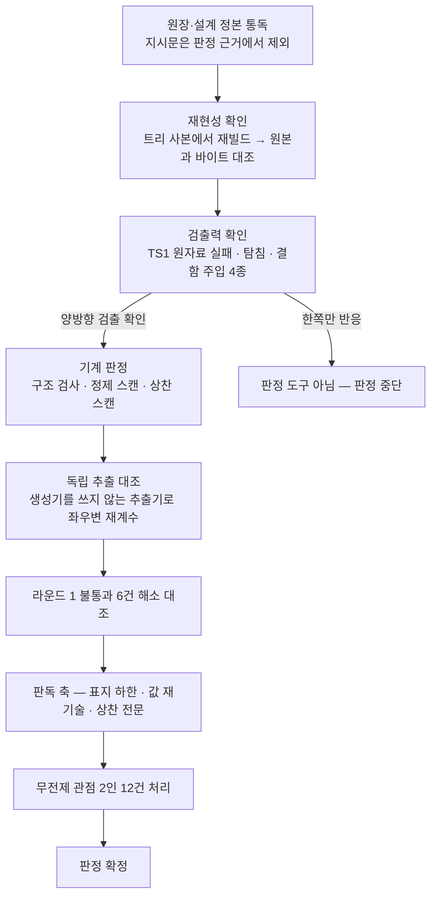

# 설계 프롬프트·설계 문서 재생성 — 검증 단계 판정(라운드 2)

## 요약

**확정** — 판정은 **통과**다. 요청 원장 완료 기준 9항 전건과 설계 단계 검증 기준 9항 전건이 통과 조건을 충족한다. 라운드 1의 불통과 6건은 전건 해소를 실측으로 확인했고, 해소 확인은 재작업 보고를 근거로 하지 않고 **생성기를 쓰지 않는 독립 추출기**로 좌우변을 다시 세어 수행했다. 산출은 빌드 고정점과 일치하며 재실행이 같은 바이트를 만든다.

**실측 대기** — 없다. 본 라운드의 모든 판정은 명령 출력으로 확정했다. 인용한 선행 수치는 전건 재측정했고, 재측정에서 갈린 값은 5절에 남겼다.

**미결** — 8항. ①매핑표 좌변이 원문 축자 전사가 아니라 참조 변환본이라는 사실이 문면에 없다 ②우변 주소 중복 검사의 실제 적용 범위가 문면보다 좁다 ③한 문서 안에서 같은 열 이름이 두 집계 범위를 가리킨다 ④계약 표지 부여의 하한이 실물로 재현된다 ⑤투입 매트릭스의 열 선정 사유가 전수를 덮지 않는다 ⑥입력 스펙에서 승계된 측정 없는 품질 단정 1건 ⑦지시문 경로 어긋남이 네 번째로 반복됐다 ⑧규격 착지 기준을 재현하는 도구가 트리에 없다. 전건이 표기·절차 층이고 계약 내용의 결함이 아니다.

## 1. 이 문서의 지위와 판정 원칙

- 완료 판정의 정본은 **요청 원장의 완료 기준**이다. 설계 단계의 검증 기준은 그 조작화이며 둘이 어긋나면 원장이 이긴다. 본 문서는 양쪽을 각각 판정한다.
- **지시문으로 판정하지 않았다.** 본 라운드 지시문이 지목한 산출 경로는 실재하지 않는다(7절 관측 7). 판정 대상은 작성 단계가 착지 목록으로 고정한 11본이며 목록 파일이 정본이다.
- **재작업 보고를 승인으로 취급하지 않았다.** 라운드 1의 불통과 6건은 각각 "무엇이 어떻게 바뀌었는지"를 실물에서 재측정해 대조했다(4절).
- **생성기를 대조기로 쓰지 않았다.** 매핑표를 만드는 코드가 그 매핑표를 검사하면 대조는 자기참조다. 좌우변 자산은 판정자가 따로 작성한 추출기로 다시 세었고, 그 결과가 문서의 선언값과 일치하는지를 판정했다(5절).
- 통과 조건은 문면대로 읽는다. "0건"은 0건이다. 다만 통과 조건이 **조작적 정의를 동반할 때는 그 정의까지 읽고** 판정한다 — 정의를 무시한 엄격함은 엄격함이 아니라 기준의 대체다(6.1).

## 2. 검출력 확인 — 판정에 앞선 선행 실패

통과만 하는 검사는 검사가 아니다. 대상에 돌리기 전에 **실패하는 것**을 먼저 확인했다. 라운드 1은 한 방향(원자료 실패)만 확인했으므로, 본 라운드는 **적합 산출에 결함을 주입해 반대 방향**도 확인했다.

| # | 대상 | 주입한 것 | 기대 | 실측 |
|---:|---|---|---|---|
| 1 | 원자료 단일 파일 | — (TS1) | 전 기준 실패 | **FAIL 6항목** — 표지 0 · 색인 0행 · 관할 결손 72 · 주소 중복 53종 · 무자격 참조 1,503 · 요약 라벨 결손 7 |
| 2 | 정제 어휘 목록 | 18패턴 각각의 합성 탐침 | 18건 검출 | **18건 검출** — 부정 전방탐색 패턴 포함 전건 적중 |
| 3 | 상찬 어휘 목록 | 3종 합성 탐침 | 3건 검출 | **3건 검출** |
| 4 | 적합 산출(축 A) | 같은 문서 안 계약 표지 중복(TS12) | 기준 3 검출 | **검출** — 계약명 중복 1종 · 주소 중복 1종 |
| 5 | 적합 산출(축 B) | 접두 없는 절 참조(TS6) | 기준 4 검출 | **검출** — 무자격 참조 1 |
| 6 | 적합 산출(축 B) | 실재하지 않는 주소로의 유자격 참조 | 기준 4 해소 층 검출 | **검출** — 미해소 참조 1 |
| 7 | 적합 산출(진입점) | 계약 표지 + 필드 표(TS7) | 기준 1 검출 | **검출** — 진입점 계약 단위 2 · 표지↔색인 차집합 1 |

**종료 코드가 세 값으로 갈리는지도 확인했다.** 대상 통과 0 · 검출 1 · 실행 오류 2가 각각 실측됐고, 존재하지 않는 대상을 넘겼을 때 2로 끝난다. 라운드 1이 관측한 "오류가 검출 0건과 구별되지 않는다"는 절차 결함은 재현되지 않는다.

## 3. 기준별 판정

### 3.1 요청 원장 완료 기준 9항

| # | 기준 요지 | 실행 | 실측 | 판정 |
|---:|---|---|---|:---:|
| 1 | 4단계 실수행 · 참조 슬롯 일치 | 문서 16본 frontmatter 전수 파싱 | analysis 1 · design 1 · dev 11 · verification 1(라운드 1) · 요청 참조 일치 15/15 · 단계 건너뜀 0 | 통과 |
| 2 | 새 문서 규격 착지 | 판정자 작성 검사로 경로 5층·파일명 문법·공통 16필드·유형별 필드·필수 절 대조 | 파일명 위반 0 · 경로 위반 0 · 가시성 불일치 0 · 유형↔ID 접두 불일치 0 · 필수 필드 결손 0 · 필수 절 결손 0 · 표시명 공백 0 | 통과 |
| 3 | 원자료 무손실 매핑 | 독립 추출기로 좌변 재계수 후 매핑표와 집합 대조 | 좌변 헤딩 329 = 매핑 329 · 다이어그램 51 = 51 · 코드 블록 43 = 43 · 규율 39 = 39 · 누락 0 · 삭제 연산 0행 | 통과 |
| 4 | 항해 — 진입점 · 절 번호 중복 · 표본 2홉 | 구조 검사 + 색인 61행 전건 해소 판정 | 진입점 1본 · 주소 중복 0종 · 색인 주소 미해소 0 · 색인↔표지 양방향 차집합 0 | 통과 |
| 5 | 중복 제거 — 같은 계약 이중 정의 금지 | 계약명 집계 + 소유 축 밖 값 재기술 전문 판독 | 계약명 중복 0(61종 유일) · 상태 열거 전문의 소유 축 밖 출현 0 · 회전 임계 리터럴의 소유 축 밖 출현 0 | 통과 |
| 6 | 분량 축약 없음 | 축약 고지 스캔 + 매핑표 삭제 행 | 삭제 연산 0행 · 축약 고지 실검출 0(스캔 2건 전건 오탐 — 6.3) | 통과 |
| 7 | 아부 금지 | 닫힌 어휘 스캔 + 확장 휴리스틱 + 전문 판독 | 닫힌 어휘 스캔 0건 · 확장 휴리스틱 1건(승계 문면 — 6.4) · 상대 산출 상찬 0건 | 통과 |
| 8 | 3렌즈 검증 | 본 문서 구성 | 전문가 판정 1건 · 무전제 관점 의견 12건(2인) · 전건 처리 결과와 근거 기재 · 의견 주체의 판정 0건 | 통과 |
| 9 | 정제 스캔 | 18패턴 × 11본(자기 시험 선행) | 자기 시험 실패 0 · 검출 0건 | 통과 |

### 3.2 설계 단계 검증 기준 9항

| # | 기준 요지 | 실측 | 판정 |
|---:|---|---|:---:|
| 1 | 개요/상세 분리 · 관할 · 비공허 | 진입점·부속의 계약 단위 0 · 관할 결손 0 · 표지 61 = 색인 61 · 양방향 차집합 0 · 표지 누락 후보 0(따라서 판독 대상 0) · 비공허 충족 | 통과 |
| 2 | 무손실 양방향 | 좌변 누락 0 · 우변 미등재 0 · 사유 공백 0 · 규율 39행 번호 집합 {1..39} 완전 · 총량 축 차이 0 · 실측 항목 색인 54 = 축 문서 추출 54 | 통과 |
| 3 | 이중 정의 | 계약명 중복 0 · 값 재기술 판독 0 | 통과 |
| 4 | 주소 유일 · 참조 해소 | 주소 중복 0 · 무자격 참조 0 · 미해소 참조 0 | 통과 |
| 5 | 항해 2홉 | 색인 61행 전건이 실재 주소로 해소 · 표지 없는 계약 1건은 소유 범위 서술로 1홉 도달 | 통과 |
| 6 | 요약 계층 | 요약 절 부재 0 · 3항 라벨 결손 0 | 통과 |
| 7 | 정제 스캔 | 자기 시험 통과 후 검출 0 | 통과 |
| 8 | 아부 금지 | 스캔 0건 · 판독 지적 0건 | 통과 |
| 9 | 규격 착지 · 축약 금지 | 결손 0 · 축약 고지 실검출 0 · 삭제 행 사유 중 분량 0 | 통과 |

## 4. 라운드 1 불통과 6건의 해소 대조

재작업 보고의 서술을 근거로 삼지 않고 실물에서 재측정했다.

| # | 라운드 1 지적 | 무엇을 재측정했나 | 실측 | 해소 |
|---:|---|---|---|:---:|
| D1 | 매핑 좌변 누락 — 입력 스펙의 문서 제목이 매핑표에도 자리 소멸 선언에도 없다 | 좌변 절 헤딩 행 수와 자리 소멸 선언 행 수 | 매핑표 좌변 329행 = 독립 추출 329(설계 문서 286 + 스펙 43) · 자리 소멸 선언 **7건**(축 6 + 스펙 1) · 스펙 문서 제목 행 실재 | 해소 |
| D2 | 선언 건수 오기 — 신규 헤딩 58 선언, 실제 60 | 신규 헤딩 절의 선언 문구와 실제 표 행 수 | 선언 **63건** = 실제 데이터 행 **63** | 해소 |
| D3 | 표 행 파손 — 셀의 세로줄이 이스케이프되지 않아 열이 밀렸다 | 매핑 12개 절 전건의 행별 열 수 분포 | 12개 절 전건이 **단일 열 수 변종** — 불균일 행 0 | 해소 |
| D4 | 미해소 참조 1건 — 존재하지 않는 소절 지시 | 문서군 전체 주소 집합 구성 후 전 참조 해소 판정 | 미해소 참조 **0** (주입 시험에서 이 검사가 검출력을 가짐을 먼저 확인) | 해소 |
| D5 | 값 재기술 4건 — 상태 열거 11원소 3자리, 회전 임계 2값 1자리 | 소유 축 밖 문서에서 열거값·임계값 리터럴 전수 검색 | 상태 열거 원소의 소유 축 밖 전문 출현 **0** · 회전 임계 리터럴의 소유 축 밖 출현 **0**(감사 축은 정본 주소만 인용) | 해소 |
| D6 | 금지 어휘 자기 검출 4건 — 규율 자신의 정의 문면 | 닫힌 어휘 스캔 재실행 + 규율의 범위·강도 대조 | 스캔 **0건** · 규율 항목과 차단 장치의 대상 필드·판정 결과·차단 서열 불변 | 해소 |

**D6의 해소가 규율 약화가 아님을 별도로 확인했다.** 리터럴 예시가 빠진 자리에 닫힌 목록의 정본 주소가 들어갔고, 차단 장치는 대상 필드 집합·판정 결과·재시도 상한 처리를 그대로 유지한다. 규율 항목의 문면도 "경고가 아니라 차단"을 유지한다. 바뀐 것은 예시의 소재이며 금지의 범위·강도가 아니다.

절차 지적 2건도 해소를 확인했다 — 부정 전방탐색 패턴이 명령형 실행에서 조용히 실패하던 문제는 자기 시험 선행으로 대체됐고(2절 #2), 대상을 디렉토리가 아니라 고정 목록으로 받으며 링크 대상은 실행 오류로 끝난다.

## 5. 독립 추출 대조 — 생성기를 쓰지 않은 재계수

매핑표를 만드는 코드가 그 매핑표를 대조하면 대조는 자기참조다. 판정자가 따로 작성한 추출기로 좌우변을 다시 세었다.

| 자산 종류 | 좌변 독립 실측 | 문서 선언 | 우변 독립 실측 | 문서 선언 | 차이 |
|---|---:|---:|---:|---:|:---:|
| 절 헤딩 | 329 | 329 | 385 | 385 | 0 |
| 다이어그램 | 51 | 51 | 53 | 53 | 0 |
| 코드 블록 | 43 | 43 | 43 | 43 | 0 |
| 규율 항목 | 39 (번호 집합 {1..39}) | 39 | 39 (번호 집합 {1..39}, 중복 0) | 39 | 0 |
| 표 | 106 | 106 | — | 148 | — |
| 설치 전 실측 항목 | — | 54 | 54 (축별 A 7·B 10·C 6·D 10·E 14·F 7) | 54 | 0 |

**재현성도 함께 확인했다.** 트리를 사본으로 복제해 빌드를 다시 돌린 결과 **반복 2회에 고정점 도달**했고, 재빌드 산출 11본이 착지본과 **바이트 동일**했다. 산출이 빌드의 고정점에 있다는 뜻이며, 문서만 손으로 고친 흔적이 없다는 증거이기도 하다.

**재측정에서 선행 서술과 갈린 값 1건**

| 축 | 선행 서술 | 본 라운드 재측정 | 성격 |
|---|---|---|---|
| 원자료 무자격 참조 | 1,471(라운드 1) | 1,503 | 판정식이 바뀌어서다. 라운드 1은 접두 형태 판정으로 1,471을 얻었고, 재작업이 고친 판은 절 기호 총 출현 중 유자격 0건이므로 1,503 전건을 무자격으로 계수한다. 원자료 실패를 보이는 목적에는 둘 다 성립하나, **같은 라벨이 두 판정식을 가리키므로 다음 라운드가 기준값을 승계하면 안 된다** |

## 6. 판독 축의 기록

기계는 이름과 형태만 본다. 이름이 겹치지 않아도 값이 산문으로 복사될 수 있고, 표지가 없는 계약은 집계에 아예 오르지 않는다.

### 6.1 계약 표지 부여의 하한 — 실물 재현

설계 §10이 잔여 위험으로 선언한 "휴리스틱이 놓치는 형태의 계약"이 실물로 재현된다. 후보 생성기를 정의성 표 헤더까지 넓혀 다시 훑은 결과 후보 9건이 나왔고, 그중 **1건은 판독상 계약이 맞는데 표지가 없다.**

| 판단 근거 | 실측 |
|---|---|
| 진입점이 소유 계약으로 열거하는가 | 그렇다 — 축별 결론의 소유 범위와 문서 목록 두 자리에 계약명으로 실려 있다 |
| 본문이 정본을 선언하는가 | 그렇다 — "…의 생성 주체·시점·이름 규약·수명을 여기서 확정한다" |
| 다른 절이 정본으로 인용하는가 | 그렇다 — 상위 절과 필드 표 주석이 이 주소를 확정 소재로 지시한다 |
| 정의 표와 장치 슬롯을 갖는가 | 그렇다 — 5행 정의 표 + 장치 슬롯 |
| 계약 표지가 있는가 | **없다** — 따라서 계약 색인 61행에 없고, 구현자 경로(색인에서 주소를 얻는다)로는 도달하지 않는다 |

**그럼에도 검증 기준 1은 통과로 판정한다.** 기준 1의 통과 조건은 "표지 누락 후보 판독 결과 미표지 계약 0건"이고, 그 **후보의 생성 방법이 기준 본문에 조작적으로 정의돼 있다** — 관할 결손 목록이다. 관할 검사는 비 다이어그램 코드펜스와 필드 표(헤더에 타입과 기입 주체가 함께 있는 표)의 상위 절만 본다. 위 절의 표는 그 헤더 어휘를 갖지 않아 후보에 오르지 않는다. 설계 §10은 바로 이 한계를 "판독 하한이 남는다"로 미리 선언했다. 기준을 문면대로 읽으면 후보 0건에 대한 판독 결과는 0건이고, 조작적 정의를 무시하고 다른 후보 집합으로 판정하는 것은 엄격함이 아니라 **판정자가 기준을 바꾸는 것**이다.

동시에 이 통과가 공허하다는 사실을 감춘다면 그것은 판정의 실패다. **후보 목록이 비었기 때문에 판독이 통과한 것이지, 미표지 계약이 없어서 통과한 것이 아니다.** 처방은 완화가 아니라 후보 생성기의 확장이다 — 필드 표의 인식 어휘에 정의·생성 주체·수명 계열을 더하면 이 절이 후보로 올라온다. 미결 4로 등재한다.

라운드 1도 같은 사실을 같은 위치에서 기록하고 기준 1을 통과로 판정했다. 본 라운드는 **새 증거 없이 선행 판정을 뒤집지 않는다** — 실물이 바뀌지 않았고 기준도 바뀌지 않았다. 달라진 것은 하한의 크기를 후보 확장으로 재어 본 것뿐이다.

### 6.2 값 재기술 판독

라운드 1이 위반으로 판정한 4자리를 전수 재판독했다.

| 재기술된 값 | 정본 축 | 라운드 1 상태 | 본 라운드 실측 | 판정 |
|---|---|---|---|:---:|
| 상태 열거 11원소 | 파이프라인 축 | 문서 체계 축 2자리에 전문 나열 | 해당 축에서 열거 원소 출현 **0** | 해소 |
| 상태 열거 11원소 | 파이프라인 축 | 조직 축 1자리에 전문 나열 | 투입 매트릭스가 **5개 열의 부분집합**으로 축소되고 머리말이 "원소 열거는 정본에만 두고 본 축은 재기술하지 않는다"를 명시 | 해소 |
| 회전 임계 2값 | 문서 체계 축 | 감사 축 1자리에 재기술 | 리터럴이 빠지고 "두 값의 정본은 (주소) — 본 축은 재기술하지 않는다"만 남음 | 해소 |

부분 읽기도 재확인했다. 축 문서 1본만 로드해 그 축 소유 계약을 값 수준으로 답할 수 있고, 타 축 계약에는 주소만 있다.

### 6.3 축약 고지 판독

스캔 검출 2건은 전건 오탐이다. 하나는 **분량 상한을 두지 않았다는 서술 자체**(스캔 어휘와 문자열이 겹칠 뿐 의미가 반대다), 하나는 유의미 문자가 3자 미만일 때 파일명 조각을 방출하지 않는다는 **파일명 규칙**이다. 내용을 줄였다는 고지는 0건이고, 매핑표의 삭제 연산도 0행이다.

### 6.4 상찬 전문 판독

닫힌 어휘 스캔은 0건이다. 닫힌 목록 밖의 평가 표현을 별도 휴리스틱으로 훑어 **1건**을 얻었다 — 플랫폼이 제공하는 실행 도구에 대한 품질 단정이다. 판정은 다음과 같다.

- **아부 축에는 해당하지 않는다.** 금지 대상은 상대의 입력·산출에 대한 동의·상찬이고, 이 문면의 대상은 사람도 에이전트 산출도 아니다.
- **다만 측정 없는 품질 단정이다.** 무엇을 어떻게 재서 그렇게 판단했는지가 없다.
- **본 라운드의 결함은 아니다.** 입력 스펙에 있던 문면이 무손실로 승계된 것이며, 이 재생성의 범위는 형태이지 내용이 아니다. 지우는 것은 자산 삭제이고 고쳐 쓰는 것은 내용 변경이라 둘 다 범위 밖이다. 미결 6으로 등재해 내용 축 요청으로 넘긴다.

## 7. 무전제 관점 2인의 의견 처리

의견 주체는 판정하지 않는다. 아래 실측 확인과 처리 근거는 판정자의 것이다. 제출된 12건 전건이 **판정이 아니라 관찰 서술**이며, 의견 주체가 통과·불통과를 선언한 항목은 0건이다.

### 7.1 배경지식 0 관점 (8건)

| # | 의견 요지 | 실측 확인 | 처리 | 근거 |
|---:|---|---|:---:|---|
| 1 | 지시받은 산출 경로에 파일도 폴더도 없어 열지 못했다 | 확인 — 해당 이름의 디렉토리가 트리에 없다 | 채택 | 지시문과 정본의 어긋남이다. 네 라운드 연속 재현이며 처방을 지시하는 쪽으로 돌려야 한다(관측 7) |
| 2 | 이름이 비슷한 폴더 여럿 중 어느 쪽인지 구분되지 않고, 안내 파일을 열고서야 실제 대상 경로를 알았다 | 확인 — 상위 계층에 유사명 트리 3종 실재. 안내 파일이 대상 경로를 지시하는 것도 확인 | 채택 | 진입 전 안내가 진입 후에만 있다는 순서 문제다. 트리 안쪽 안내는 트리를 고른 뒤에만 작동한다 |
| 3 | 첫 화면 메타 항목이 테스트 실패 기록처럼 보여 설계 문서인지 로그인지 헷갈렸다 | 확인 — 해당 메타 항목이 실재하고 실패 발췌 문자열을 담는다 | 채택 | 증거 계약이 문서 상단을 점유하는 배치의 부작용이다. 설계 단계도 같은 축의 부정합을 이미 관측으로 남겼다 |
| 4 | 요약 첫 문단의 세 라벨이 뜻 설명 없이 나오고 숫자가 무엇을 세는지 모른 채 읽어야 했다 | 확인 — 세 라벨이 정의 없이 등장하고 축 수·건수·항수가 이어진다 | 채택 | 라벨은 문서군 공통 규약인데 그 규약의 정의가 진입점에 없다. 숫자는 각각 지시 주소를 달고 있으나 라벨 자체는 그렇지 않다 |
| 5 | 읽기 경로 표의 주소 코드가 앞부분에 계속 나오는데 표기 규약은 뒤쪽 절에 가서야 나온다 | 확인 — 읽기 경로는 2절, 주소·참조 표기 규약은 9절 | 채택 | 규약 소비가 규약 정의보다 앞선다. 판정 조건은 아니나 진입점의 목적이 첫 로드에서 항해를 세우는 것이므로 배치가 목적과 어긋난다 |
| 6 | 한 축에 이름이 다섯 개나 붙어 있는 이유를 알 수 없었다 | 확인 — 별칭 해석표에 한 축이 5개 별칭을 갖는 행이 실재 | 기각 | 사실 인용은 실측과 일치하나 결론이 성립하지 않는다. 별칭표는 **원자료가 이미 다섯 이름으로 부르던 것을 무손실로 승계하면서** 해석을 한 자리에 모은 장치다. 이름을 하나로 줄이는 것은 내용 변경이고, 표를 없애면 승계된 이름이 미해소 어휘가 된다. 요구되는 것은 표의 제거가 아니라 표의 존재이며 그것이 이미 있다 |
| 7 | 축 결론 문단의 압축 표현에서 막혔다 | 확인 — 지적된 표현이 해당 문단에 실재 | 채택 | 결론 문단은 압축이 목적이라 용어 밀도가 높은 것 자체는 설계대로다. 다만 각 용어의 정본 주소가 문단에 병기돼 있지 않아, 막힌 독자가 다음 홉을 고를 수 없다 |
| 8 | 계약 색인에 이름과 주소만 있고 뜻 설명이 없어 이름만으로는 내용을 짐작할 수 없다 | 확인 — 색인은 계약명·정본 주소·소유 축 3열이고 요지 열이 없다 | 채택 | 색인의 계약명은 절 제목을 수집한 것이라 주제어와 어긋나는 행이 있다. 실제로 소유 범위의 주제어로 색인을 찾으면 어휘가 겹치지 않아 못 찾는 행이 나온다 |

### 7.2 신입 관점 (4건)

| # | 의견 요지 | 실측 확인 | 처리 | 근거 |
|---:|---|---|:---:|---|
| 1 | 지시 경로가 실재하지 않고, 같은 어긋남이 선행 판정문과 부속에 이미 기록됐는데 같은 문자열로 다시 왔다 | 확인 — 선행 판정문의 관측 절과 부속의 시정 내역에 기록 실재. 본 라운드 지시문에 같은 경로 문자열 재출현 | 채택 | 보고의 위치가 보고의 도달 가능성을 결정한다는 관찰이 실측과 일치한다. 부속이 처방으로 적은 "단계 반환 텍스트로 올린다"가 실행되지 않았음이 이번 재발로 드러난다 |
| 2 | 상위 계층에 후보 4종이 나란히 있는데 그 계층에는 정본을 알리는 안내가 없고, 안내는 정답을 고른 뒤에만 열린다 | 확인 — 해당 계층에 안내 파일 0건. 후보 트리들 실재 | 채택 | 7.1-2와 같은 근원의 다른 표면이다. 대상 트리 안쪽 안내는 라운드 1 처방으로 신설됐으나 그 **바깥 계층**은 처방 범위에 없었다 |
| 3 | 소유 범위에만 있고 계약 색인에는 없는 계약이 있어 구현자 경로로는 도달하지 않는다 | 확인 — 판정자가 독립으로 재현. 해당 절은 정의 표·장치 슬롯·정본 선언을 갖는데 표지가 없다 | 채택 | 6.1의 판독과 같은 항목을 같은 결론으로 짚는다. 새 결함은 아니고 설계가 선언한 잔여의 실례이며, 후보 생성기 확장이 처방이다. 미결 4 |
| 4 | 신규 미결이 다음 라운드 결정 대상으로 열려 있어 자기 자신을 참조하며 순환하는 인상을 준다 | 확인 — 해당 부속에 신규 미결 11항 실재 | 채택(참고로) | 관찰은 실측과 일치하고 도달도 막히지 않는다. 다만 "미결이 열려 있음"은 결함이 아니라 미결을 감추지 않은 결과다 — 판정 대상은 미결의 존재가 아니라 미결이 **기록·주소·사유를 갖는가**이고 그것은 충족된다. 처방 없음 |

**채택 11건 · 기각 1건.** 채택 의견 중 판정을 뒤집은 것은 0건이다 — 7.2-3은 판정 대상 안쪽을 짚으나 6.1에서 기준의 조작적 정의로 통과가 확정됐고, 나머지는 트리·지시문·배치 층이다. 기각 1건은 사실 인용이 실측과 일치하나 처방의 방향이 무손실 요건과 충돌한다.

## 8. 관측 — 보고 항목

### 8-1. 매핑표 좌변은 원문 축자 전사가 아니라 변환본이다

좌변의 위치 열은 원자료 제목을 그대로 옮긴 것이 아니라 **참조 접두 변환이 적용된 문자열**이다. 원자료가 다른 문서를 부르던 표기와 옛 절 표기, 부록 이름이 전부 새 주소 표기로 바뀌어 있다.

그래서 검증 기준 2의 how를 문면대로 — 원자료에서 기계 추출한 결과와 좌변을 집합 대조 — 실행하면 **129건이 양쪽에 하나씩 나뉘어 나온다.** 실제 누락은 0이고 전건이 같은 자산의 표기 차이다. 대조가 성립하는 이유는 매핑의 식별자가 제목이 아니라 등장 순서 산식이기 때문이고 그 사실은 문서에 있으나, **좌변 열 자체가 변환본이라는 사실은 없다.**

처방: 좌변 위치 열의 표기 규약을 문서에 1줄로 명시하고, 대조를 재현하는 쪽이 축자 비교로 129건을 만나 오판하지 않게 한다.

### 8-2. 우변 주소 중복 검사의 적용 범위가 문면보다 좁다

집합 축 대조표는 "헤딩 자산의 우변 주소가 겹치는 주소 0종"으로 적고, 제외 대상으로 **블록 자산만** 밝힌다. 실제 집계는 **주소를 스스로 소유하는 헤딩**으로 한정돼 있어 번호 없는 하위 소제목이 빠진다. 문면대로 재현하면 2종이 나온다(둘 다 하위 소제목이 상위 절 주소를 물려받은 정상 형태다).

값은 옳고 정의도 코드 주석에 있다. 어긋난 것은 **문서에 적힌 검사 범위**다. 처방: 제외 대상에 무번호 하위 헤딩을 명시한다.

### 8-3. 같은 열 이름이 한 문서 안에서 두 집계 범위를 가리킨다

식별자 산식 표의 "원자료 건수" 열은 설계 문서 단독 집계(절 헤딩 286 · 표 104 · 다이어그램 38)이고, 대조 결과 절의 같은 이름 열은 입력 스펙 합산(329 · 106 · 51)이다. 두 값 다 실측과 일치하므로 계산 오류는 아니다. 문제는 **같은 라벨이 두 범위를 가리켜 인용하는 쪽이 어느 쪽을 승계할지 알 수 없다**는 것이다. 라운드 1이 "같은 라벨로 두 지표를 부르면 다음 라운드가 기준값을 잘못 승계한다"고 적은 것과 같은 형태가 다른 자리에서 재현된다.

처방: 열 이름에 범위를 넣는다.

### 8-4. 투입 매트릭스의 열 선정 사유가 전수를 덮지 않는다

머리말은 "역할 투입이 있는 단계만 열로 든다"고 하고 제외 사유를 두 상태에 대해서만 적는다. 상태는 11종이고 열은 5개이므로 실제 제외는 6종이다. 나머지 4종은 종결·준종결이라 투입이 없다는 것이 자명하나, **문면은 제외가 두 건인 것처럼 읽힌다.** 값은 옳고 서술의 전수성만 모자란다.

### 8-5. 규격 착지 기준을 재현하는 도구가 트리에 없다

트리의 구조 검사기는 검증 기준 1·3·4·6을, 스캔은 7·8을 다룬다. **기준 2·9(경로·파일명 문법 · 공통/유형별 필수 필드 · 필수 절 · 참조 대상 실재)를 재현하는 도구는 없다.** 라운드 1도 본 라운드도 그때그때 임시 코드를 써서 판정했고, 두 라운드의 코드가 같은 정의를 쓰는지 보장하는 것이 없다.

이것이 판정을 무효화하지는 않는다 — 본 라운드는 스키마 정본을 직접 읽고 검사를 작성했으며 결손 0을 실측했다. 다만 **재현 절차가 트리에 없는 기준은 다음 라운드에서 다시 짜야 하고, 다시 짜는 순간 정의가 갈릴 수 있다.** 처방: 스키마 검사기를 도구로 고정한다.

### 8-6. 지시문이 지정한 산출 경로가 실재하지 않는다 — 네 번째

설계·작성·검증 라운드 1이 각각 보고했고 부속의 시정 내역이 "보고를 단계 반환 텍스트로 올린다"를 처방으로 적었다. 본 라운드 지시문에 **같은 경로 문자열이 다시 실렸다.** 처방이 실행되지 않았거나, 실행됐으나 지시문을 쓰는 자리에 닿지 않았다.

산출물 안쪽에 쌓인 보고는 산출물을 여는 사람에게만 닿는다. 지시문을 쓰는 쪽은 산출물을 열기 전에 지시문을 쓴다. **보고의 위치가 보고의 도달 가능성을 결정한다**는 것이 네 라운드에 걸친 실측이며, 이번 판정의 반환 텍스트에 이 항목을 싣는 것이 현재 가진 유일한 도달 경로다.

### 8-7. 통과 판정이 공허 통과인지 판정자가 매번 확인해야 한다

기준 1의 "판독 결과 0건"은 후보가 0건이라 나온 값이다(6.1). 구조 검사기 자신은 대상 파일이 0개일 때 이를 결과가 아니라 대상 부재로 보아 오류로 끝내는 규율을 갖고 있으면서, **후보 목록이 비었을 때는 같은 규율을 적용하지 않는다.** 같은 문서군 안에서 공허 통과에 대한 처리가 두 가지다.

처방: 판독형 조건에도 비공허 조건을 붙이거나, 후보 0건을 통과가 아니라 "판독 미수행"으로 표시한다.

## 9. 재작업 범위

판정이 통과이므로 판정을 뒤집기 위한 재작업은 없다. 아래는 다음 라운드로 넘기는 개선 항목이며 **완료 판정의 조건이 아니다.**

| # | 대상 | 작업 | 출처 |
|---:|---|---|---|
| 1 | 무손실 매핑 부속 | 좌변 위치 열이 참조 변환본임을 표기 규약으로 1줄 명시 | 관측 8-1 |
| 2 | 무손실 매핑 부속 | 우변 주소 중복 검사의 제외 대상에 무번호 하위 헤딩 명시 | 관측 8-2 |
| 3 | 무손실 매핑 부속 | 두 "원자료 건수" 열에 집계 범위를 넣어 라벨 분리 | 관측 8-3 |
| 4 | 검사 도구 · 축 B | 표지 누락 후보 생성기를 정의성 표 헤더까지 확장하고, 그 결과 후보로 오르는 절에 계약 표지 부여 | 6.1 · 관측 8-7 · 신입 3 |
| 5 | 조직 축 | 투입 매트릭스 열 선정 사유를 제외 6종 전수로 서술 | 관측 8-4 |
| 6 | 검사 도구 | 규격 착지(경로·파일명·필수 필드·필수 절·참조 실재) 검사기를 트리에 고정 | 관측 8-5 |
| 7 | 진입점 | 요약 3항 라벨의 정의와 주소 표기 규약을 첫 로드 지점으로 이동 · 계약 색인에 요지 열 또는 주제어 별칭 추가 | 배경지식 0 관점 4·5·8 |
| 8 | 트리 상위 계층 | 유사명 트리들이 놓인 계층에 정본 지시 안내 배치 | 배경지식 0 관점 2 · 신입 2 |
| 9 | 지시 경로 | 산출 경로 문자열 정정 — 처방을 산출물 안쪽이 아니라 지시하는 쪽에 둔다 | 관측 8-6 |
| 10 | 내용 축(별건) | 승계된 측정 없는 품질 단정 1건의 처리 | 6.4 |

## 10. 관측 지표 (판정 기준 아님)

줄 수는 판정에 쓰지 않는다. 총량 축소는 성과 지표가 아니며 분량 상한도 두지 않았다. 1회 로드 단위의 크기만 남긴다.

| 문서 | 줄 수 | 계약 표지 |
|---|---:|---:|
| 진입점 | 293 | 0 |
| 재생성 스펙 | 739 | 0 |
| 문서 체계 축 | 839 | 12 |
| 파이프라인 축 | 838 | 10 |
| 조직 축 | 756 | 6 |
| 감사 축 | 604 | 8 |
| 설치 축 | 793 | 13 |
| 리드 게이트 축 | 714 | 12 |
| 실측 색인 부속 | 125 | 0 |
| 미결 부속 | 157 | 0 |
| 매핑 부속 | 1,043 | 0 |
| 합계 | 6,901 | 61 |

원자료 단일 파일 4,404줄 대비 최대 로드 단위는 1,043줄, 개요만 읽을 때는 293줄이다. 매핑 부속이 가장 큰 것은 그것이 서술이 아니라 655행의 대조 원장이기 때문이다.

## 11. 재현 절차

선행 실패 확인을 건너뛴 실행은 증거로 인정하지 않는다.

- **대상은 디렉토리가 아니라 고정 파일 목록이다.** 같은 트리에 단계 산출 문서가 함께 있어 디렉토리를 넘기면 접두 없는 문서가 축 문서로 오분류된다.
- **심볼릭 링크를 대상으로 쓰지 않는다.** 재귀 검색이 링크를 따르지 않아 검출 0건이 거짓으로 나온다.
- **종료 코드를 세 값으로 읽는다.** 0은 정상, 1은 검출·불통과, 2는 실행 오류다. 파이프로 이어 붙인 명령의 종료 코드는 마지막 명령의 것이므로, 검사기의 코드를 읽으려면 파이프를 끊거나 배열로 읽는다 — 본 라운드 초기 측정에서 실제로 파이프 끝 명령의 코드를 검사기 코드로 잘못 읽었고, 다시 재어 정정했다.
- 스캔은 대소문자를 구분해 실행한다.

## 12. 표기 고지

- 작성자 필드는 역할 기반 자리표시자다. 정제 지시에 따라 개인·에이전트 고유 이름을 산출물에 싣지 않는다.
- 저장소 경로 리터럴은 본문에 싣지 않는다 — 정제 목록에 걸리는 성분을 포함하기 때문이다. 대상은 문서 지위와 주소로 지시했다.
- 금지 어휘를 논하는 절에서 어휘 자체를 인용하지 않았다. 인용하면 본 문서가 자기 판정 기준에 걸린다.
- 본 문서는 판정 문서이므로 규율 항목을 정의하지 않는다. 운영 규율의 정본은 재생성본 축 문서다.
- 본 문서는 선행 라운드 판정문을 대체하지 않는다. 선행 판정문은 그 시점 산출에 대한 판정으로 유효하며, 본 문서는 재작업 이후 산출에 대한 판정이다.

## 13. 참조

| 구분 | 식별 | 용도 |
|---|---|---|
| 요청 원장(완료 판정 정본) | `RQ-20260728T170616Z-d0bc4127` | 완료 기준 9항 |
| 분석 단계 산출 | `DS-20260728T171936Z-85146dc7` | 근원·표본 출처 |
| 설계 단계 산출 | `DS-20260728T174022Z-41b9cace` | 검증 기준 9항 · 테스트 시나리오 · 잔여 위험 선언 |
| 문서작성 단계 산출 | `DS-20260728T185500Z-52fb1ab2` | 착지 목록 · 대조 대상 |
| 검증 라운드 1 판정 | `DS-20260728T193000Z-c9c3260f` | 불통과 6건 · 절차 지적 2건 · 관측 5건의 해소 대조 기준 |
| 판정 대상 | 진입점 · 축 문서 6본 · 부속 3본 · 재생성 스펙 | 본문 3절 |
