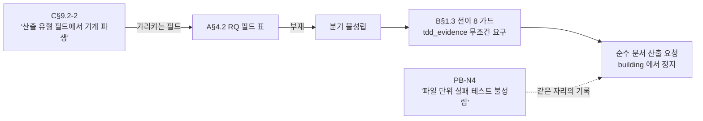
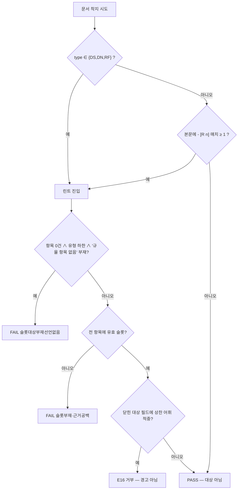
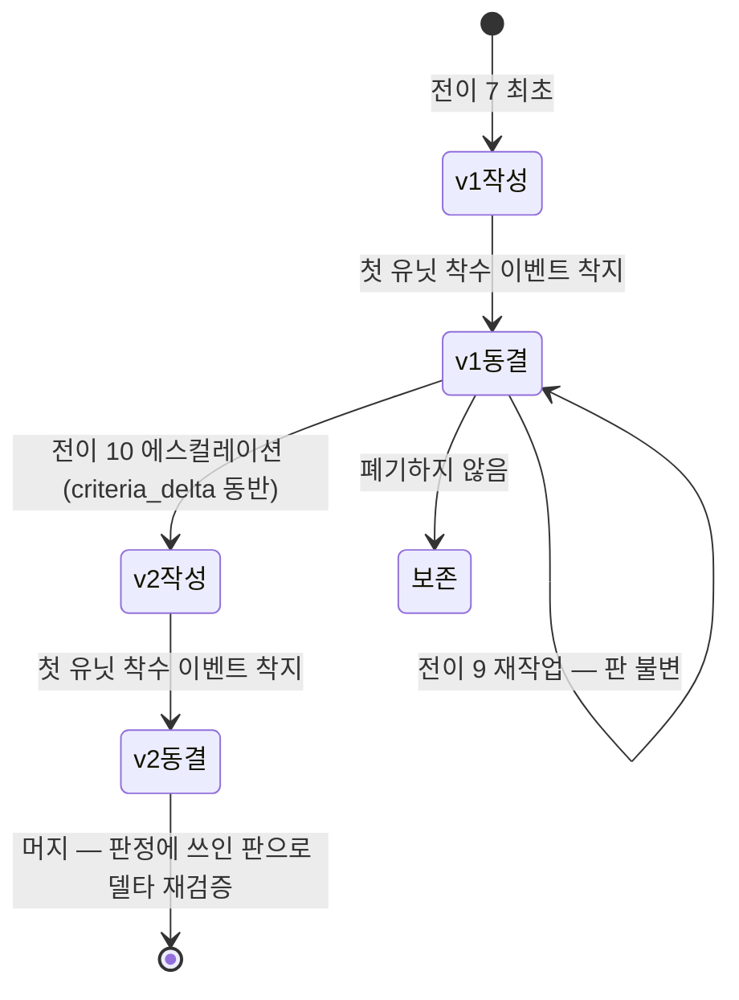
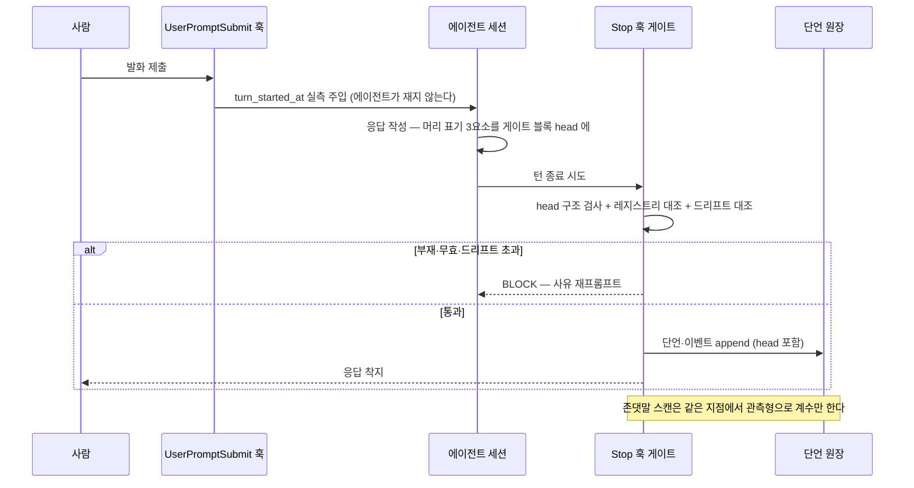

## 요약

**확정** — 시정 8건의 내용과 반영 지점을 확정합니다. 봉쇄 2건(X1·X2)은 구현 착수 전 필수이고, 병행 6건(X3~X8)은 구현과 함께 반영합니다. X8은 이 배치 착수 후 의사결정권자가 추가 지시한 신규 확정 제약(S§2-20)의 설계 반영분입니다.

| # | 시정 | 성격 | 정본 반영 지점 | 근원 |
|---|---|---|---|---|
| X1 | `output_kind` 필드 신설과 증거 계약 분기 | **봉쇄** | A§4.2 · B§1.3 전이 8 · C§9.2~9.3 | 대시보드 요청 F4 · PB-N4 |
| X2 | 규율 슬롯 린트의 적용 대상 재선언 | **봉쇄** | F§9.1 · A§4.4 · A§5.2 오류 코드표 | PB-N1 · 대시보드 요청 F5 |
| X3 | 검증 기준 판(version) 동결 재정의 | 병행 | B§1.3 전이 7·9·10 · C§6.3 · B§6.2 | 리허설 규칙 잔여 ① |
| X4 | 독립 검증 산출 스키마와 합산 규칙 | 병행 | C§6 신설 소절 · B§2.2 | 리허설 규칙 잔여 ② |
| X5 | 실행 루트 선언 필드 `root` | 병행 | A§4.1 · A§5.2 | 리허설 규칙 잔여 ③ |
| X6 | `frontend-design` 스킬 매핑 등재와 증거 계약 | 병행 | C§9.1 · C§9.3 · A§4.2 | 대시보드 요청 F1·F2·F7 |
| X7 | `status`/`state` 이중 표기 단일화 | 병행 | A§4.1 · A§6.2 | 리허설 검출 |
| X8 | 응답 머리 표기·시각 실측·존댓말 | 병행 | S§2-20 신설 · C§5.1 · C§3.3 · F§5.1 · F§3.2 · D§1.2 | 의사결정권자 지시 |

**실측 대기** — 본 배치는 실측 항목을 신설하지 않습니다. X8의 집행 지점은 기존 실측 항목 F§13-1(`Stop` 훅의 매 턴 발화)·F§13-5(전사 파싱)·D§9-1(훅 입력 필드)에 의존하며, 그 결과가 부정이면 X8의 집행 지점만 대안으로 이설하고 판정식은 불변입니다.

**미결** — X2가 신설하는 오류 코드는 E16이고 E09는 결번으로 남습니다(PB-N11의 승계 항목 — 원자료에도 같은 결번이며 사유 기록이 없습니다). 결번을 메우지 않는 근거는 아래 X2에 적었습니다.

---

## 1. X1 — `output_kind` 필드 신설과 증거 계약 분기 (봉쇄)

### 1.1 근원

C§9.2-2는 "코드 산출이 없는 요청에서는 TDD 증거 요구가 스키마 분기로 면제되며, 면제 판정은 원장의 산출 유형 필드에서 기계 파생"이라고 적었습니다. 그런데 그 필드는 A§4.2 RQ 표에 없습니다. 한편 B§1.3 전이 8의 가드는 "각 report의 `tdd_evidence` 필드 존재"를 조건 없이 요구합니다.

두 문면을 합치면 **순수 문서 산출 요청은 `building → verifying` 전이를 통과할 수 없습니다.** 참조하는 필드가 없으므로 분기가 성립하지 않고, 분기가 없으므로 가드가 무조건 발화합니다.

이것은 가설이 아닙니다 — 이 설계 문서군 자신이 그 사례였고, PB-N4가 "재생성본은 코드가 아니라 문서라 파일 단위 실패 테스트가 성립하지 않는다"로 그 상태를 기록했습니다. 각 축 문서 frontmatter의 `tdd_evidence.deviation_disclosure`가 그 이탈 고지입니다.



### 1.2 시정 내용

**(a) RQ 추가 필드** — A§4.2에 등재합니다.

| 필드 | 타입 | 필수 | 기입 주체 |
|---|---|---|---|
| `output_kind` | enum `code` \| `document` \| `mixed` | 필수 | pm(분석 시) |

자동 파생 규칙을 두지 않습니다 — 산출의 성격은 요청 내용의 해석이라 파생 불가능한 축이고, S§3.6의 "사람은 파생 불가능한 축만 입력"에 정확히 해당합니다.

**(b) 작업 유닛 필드** — `mixed`는 요청 단위 판정으로 닫히지 않으므로 유닛 단위 판정이 필요합니다. B§1.3 전이 7의 `work_units[]` 원소에 등재합니다.

| 필드 | 타입 | 필수 | 기입 주체 |
|---|---|---|---|
| `produces_code` | bool | `output_kind == mixed` 일 때 필수 | architect(작업 분해 산출) |

**(c) 전이 8 가드 개정** — 조건 없는 요구를 판정식으로 바꿉니다.

```text
evidence_required(req, unit) :=
    "tdd"  if req.output_kind == "code"
    "tdd"  if req.output_kind == "mixed" ∧ unit.produces_code
    "doc"  otherwise

전이 8 가드 := ∀ unit ∈ units:
      (evidence_required(req, unit) == "tdd" → unit.report.tdd_evidence 전건 존재·비공백)
    ∧ (evidence_required(req, unit) == "doc" → unit.report.doc_evidence 전건 존재·비공백)
```

**(d) `doc_evidence` 계약 신설** — A§4.2에 `tdd_evidence`와 동형으로 등재합니다.

| 필드(`doc_evidence.*`) | 타입 | 필수 | 기입 주체 |
|---|---|---|---|
| `criteria_ref` | string(검증 기준 항목 참조 — X3의 판 표기 포함) | 필수 | 자동(구현 스텝) |
| `pre_check_ref` | string(산출 **전** 실행한 구조 검사의 실행 기록 앵커) | 필수 | 자동 |
| `pre_check_excerpt` | string(그 검사의 **불통과** 출력 발췌 + 앵커) | 필수 | 자동 |
| `impl_ref` | string(산출 커밋·경로 참조) | 필수 | 자동 |
| `post_check_output_ref` | string(산출 후 같은 검사의 통과 출력 참조) | 필수 | 자동 |
| `deviation_disclosure` | string(기준의 축약·변경 고지 — 없으면 명시값 `none`) | 필수 | 구현 역할 |

착지 게이트 검사(E03·E06·E07 확장): 필드 전건 존재·비공백 + 참조 실재 + **선행성 대조**(`pre_check_ref` 시점 < `impl_ref` 시점).

**설계 판단과 그 근거** — `doc_evidence`를 "TDD 면제"가 아니라 **동형 증거 계약**으로 둡니다. 면제로 두면 문서 산출에 증거 요구가 0이 되고, 그것은 선행 운영에서 "결정 절이 빈 채 배경 절에 전문이 뭉쳐 적힌" 상태(S§3.5 — 전반부 42건 중 30건)를 만든 구조와 같습니다. 문서에도 실패 선행이 성립합니다: **검사기를 산출 전 원자료에 먼저 돌려 불통과를 확보하는 것**이 그 형태이고, 이 문서군의 재생성이 실제로 그 절차를 밟았습니다(원자료 적용 FAIL 5항목). 즉 신설이 아니라 이미 수행된 절차의 정식 계약화입니다.

**(e) C§9.3 갱신** — `tdd` 행의 준수 정의에 적용 조건(`evidence_required == "tdd"`)을 명시하고, `doc-tooling`·`diagram-authoring` 행의 측정 지점에 `doc_evidence` 착지 게이트 검사를 추가합니다.

- [R40] **증거 요구는 산출 유형으로 분기하되, 어느 분기에도 증거 0 은 없다.** 면제는 증거의 부재가 아니라 증거 형태의 교체다.
  [장치 — 전이 8 가드가 `evidence_required()` 판정식의 두 분기 각각에 대해 전건 검사를 수행하며, 두 분기 모두 필수 필드 집합이 비지 않는다(빈 집합을 반환하는 분기가 코드에 존재하지 않는다). 착지 게이트 E03·E06·E07이 필드 부재·참조 부재를 거부한다 | 장치 불가 — `pre_check_ref`가 가리키는 검사가 그 산출에 **유의미한** 검사인가의 판정은 세계 지식이 필요하다(S§9.4-19). 완화: X4의 독립 검증 산출 스키마가 `scope_not_covered`를 공백 불가로 요구해 리뷰가 그 축을 명시하게 한다.]
- [R41] **`output_kind`는 pm 이 기입하고 어느 장치도 추정하지 않는다.**
  [장치 — pm 분석 문서 스키마의 필수 필드이고 부재는 착지 게이트가 E03으로 거부한다. 기본값을 두지 않는다(A§1.5 visibility 와 같은 구조 — silent default 금지) | 장치 불가 — 해당 없음]

---

## 2. X2 — 규율 슬롯 린트의 적용 대상 재선언 (봉쇄)

### 2.1 근원

F§9.1은 린트 적용 대상을 `frontmatter type ∈ {design, decision, norm, charter}`로 선언했습니다. 그런데 A§4.1의 `type`은 A§1.4의 유형 코드 enum이고, 그 값은 `RQ`·`AU`·`MN`·`FL`·`FS`·`FI`·`DN`·`AJ`·`DS`·`HO`·`RF` 입니다.

**두 집합의 교집합은 공집합입니다.** 규격대로 착지한 문서는 어느 것도 린트 대상이 되지 않습니다.

폭발 반경이 여기서 끝나지 않습니다. S§2-19가 필수 산출로 지정한 아부 금지의 **착지 차단형 장치**는 문서 축에서 이 린트를 집행 호스트로 삼습니다(A§4.4: "집행 호스트는 본 축 착지 게이트"). 호스트가 발화하지 않으므로 문서 축의 아부 금지 집행 경로가 통째로 비어 있습니다.

A§4.4가 "설계 문서의 `type` 값은 `design` 하나로 통일한다"고 적은 것도 같은 오해에 서 있습니다 — `design`은 `type` 값이 아니라 카테고리 이름입니다. PB-B8이 이 항목을 "해소"로 표기했으나, 그 해소는 존재하지 않는 값으로의 정규화를 지시하는 것이어서 성립하지 않습니다.

### 2.2 시정 내용

**(a) F§9.1 적용 대상 재선언** — 유형 기반 하한과 내용 기반 트리거를 OR 로 겹칩니다.

```text
린트_적용대상(doc) :=
     doc.type ∈ {DS, DN, RF}                        # ① 유형 기반 하한
  ∨  ∃ 매치( /^\s*-\s\[R\d+\]/, doc.본문 )           # ② 내용 기반 트리거(유형 불문)
```

두 축을 겹치는 근거입니다. **내용 기반 단독**(PB-N1이 기록한 원안)이면 "규율 항목을 아예 쓰지 않으면 린트를 벗어난다"는 회피가 열립니다 — 규범을 산문으로만 적으면 검사가 발화하지 않고, 그것이 S§9.4-25가 "산문 규칙은 회귀한다"로 실측한 바로 그 상태입니다. **유형 기반 단독**이면 RQ·MN·HO에 적힌 규율이 새어 나갑니다. 둘을 겹치면 어느 쪽 회피도 닫힙니다.

**(b) `규율 항목 없음` 선언 요건의 적용 범위 축소** — ①에 걸린 문서에만 적용합니다. ②는 항목이 1건 이상 있을 때만 발화하므로 "항목이 0건일 때 선언을 요구한다"가 자기모순이 됩니다.

```text
if 적용대상 아님:                              return PASS
items := 본문에서 /^\s*-\s\[R\d+\]/ 매치(연속 들여쓰기 줄 병합)
if items == [] ∧ doc.type ∈ {DS, DN, RF} ∧ "규율 항목 없음" 부재:
                                               return FAIL(슬롯대상부재선언없음)
for it in items:
    if "[장치 — " ∉ it ∧ "장치 불가 — " ∉ it:   return FAIL(슬롯부재, R번호)
    if 브랜치 서술이 공백:                       return FAIL(불가근거공백 | 장치서술공백, R번호)
return PASS
```

**(c) A§4.4 개정** — "설계 문서의 `type` 값은 `design` 하나로 통일한다 — 유사 이형 값으로 린트 적용 대상을 우회하는 것을 금지한다" 문단을 **삭제**합니다. `type`은 A§1.4 유형 코드만 갖습니다. 표기 문법(`- [R<n>]`)·슬롯 의무·선언 요건은 그대로 유지합니다.

**(d) 아부 금지의 문서 축 집행 — 오류 코드 E16 신설** — A§5.2 오류 코드표에 등재합니다.

| 코드 | 클래스 | 판정 |
|---|---|---|
| E16 | 상찬 어휘 검출(닫힌 어휘 × 닫힌 대상 필드) | 거부 (경고 모드 없음) |

대상 필드는 **닫힌 집합**입니다 — 이 목록 밖은 검사하지 않습니다.

| 문서 유형 | 대상 필드 |
|---|---|
| DS(stage=design) | `## 검증 기준` 블록의 `what` · `pass` |
| DS(stage=verification) | qa 판정 레코드의 `abbreviation_detail` · `opinion_dispositions[].rationale` |
| 전 유형 | `## 요약` 절 중 `**확정**`·`**미결**` 라벨 뒤의 판정 문장 |
| 렌즈 의견(C§6.2) | `observation` · `expectation_gap` |
| 리뷰 산출(X4) | `findings[].claim` |

어휘 정본은 `config/local/lead-gate-policy.json`의 `praise_lexicon`이고 코드 하드코딩을 금지합니다(S§9.3-16 — 가드 자신이 유출물이 된 사고). 대상 집합을 자유 산문으로 넓히지 않습니다 — 넓히면 F§7.9가 ⑥-a를 기각한 이유(품질 평가 자체가 산출인 리뷰 보고의 정당한 문장을 오차단)로 되돌아갑니다.

**(e) E09 결번** — 메우지 않습니다. A§5.2 원표에 E09가 없고 원자료에도 같은 결번이며 사유 기록이 없습니다(PB-N11). 번호를 재사용하면 과거 판정 기록의 코드 해석이 판별 불가능해집니다 — ID 영구 소각(S§3.3)과 같은 뿌리입니다. 결번 사실을 오류 코드표 각주로 명시합니다.



- [R42] **린트 적용 대상은 유형 하한과 내용 트리거의 합집합이며, 어느 한쪽만으로 좁히지 않는다.**
  [장치 — 판정식이 두 조건을 OR 로 평가하고, 그 코드 경로가 하나뿐이라 한쪽만 평가하는 실행이 존재하지 않는다. 자기 적용: 이 문서(type=DS, R40~R47 보유)는 두 조건 모두에 걸린다 | 장치 불가 — 해당 없음]
- [R43] **아부 금지의 문서 축 집행은 경고 모드 값을 갖지 않는다.**
  [장치 — E16 은 A§5.2 오류 코드표의 거부 클래스이고, 게이트 판정 함수에 경고 반환 분기가 존재하지 않는다. 대상 필드·어휘가 둘 다 닫혀 있어 판정이 결정론이므로 F§10.2 의 '즉시 장치·차단' 행에 해당한다 | 장치 불가 — 닫힌 어휘를 우회한 의미 수준의 아부(상찬 어휘 없이 검증을 생략한 동의)와 대상 필드 밖 자유 산문은 차단 범위 밖이다. 완화: F§7.9 ⑥-b 자리 제거 + 표본 적대 리뷰. 잔여는 F§12-7 에 이미 공지돼 있다]

---

## 3. X3 — 검증 기준 판(version) 동결 재정의

### 3.1 근원

S§9.2-8과 B-10은 "기준은 산출물을 보기 전에 동결"이며 검증자는 엄격화만 가능하다고 규정합니다. 그런데 B§1.3 전이 10(`verifying → designing` 설계 에스컬레이션)은 설계를 다시 만들고, 그 산출에는 새 검증 기준이 들어갑니다.

재진입 후 `building`이 참조할 기준이 구판인지 신판인지를 정하는 규칙이 없습니다. 시각 축으로 보면 **산출물을 본 뒤에 만들어진 기준이 존재**하게 되어 동결 규율과 정면으로 역전됩니다. 리허설에서 설계 시정 후 building 재개 시점에 이 규칙 부재가 관측됐습니다.

### 3.2 시정 내용

**(a) 기준에 판 번호를 준다** — `criteria_ref` 형식을 `<설계문서 ID>#criteria@v<N>`로 확정합니다. N은 그 요청 안에서 단조 증가하며 되돌아가지 않습니다.

**(b) 동결의 정의를 시점이 아니라 판 단위로 재정의합니다.**

> 판 `v<N>`은 그 판으로 스폰된 **첫 구현 유닛의 착수 이벤트가 착지하는 순간** 동결되고, 이후 `v<N>`은 어떤 방향으로도 수정되지 않는다. 엄격화도 `v<N+1>` 신설로만 한다.

**(c) 판이 오르는 유일한 경로는 전이 10이다.**

| 전이 | 판 | 근거 |
|---|---|---|
| 7 (`designing → building`) 최초 | v1 | 최초 동결 |
| 9 (`verifying → building`, 재작업) | **불변** | 결함 클래스가 설계가 아니므로 기준은 유효하다. 같은 판으로 다시 판정한다 |
| 10 (`verifying → designing`, 에스컬레이션) → 7 재진입 | v(N+1) | 설계 결함이 확정됐으므로 기준도 산출이다 |
| 13 (`merging → building`, 델타 재검증 실패) | **불변** | B-10 — 재검증은 동결 기준으로만 |

**(d) 구판은 폐기하지 않습니다.** 판별로 `criteria_delta`를 남깁니다 — S§5.3의 정정 형식 그대로 "새 근거 명시 + 변하지 않은 부분 선언"입니다.

| 필드 | 타입 | 필수 |
|---|---|---|
| `criteria_delta.from_version` | int | v≥2 일 때 필수 |
| `criteria_delta.trigger_verdict_ref` | 판정 레코드 참조(에스컬레이션 근거) | 필수 |
| `criteria_delta.changed[]` | `{criterion_id, change: enum(added\|removed\|tightened\|reworded), rationale}` | 필수 |
| `criteria_delta.unchanged_scope` | string(변하지 않은 부분 선언) | **필수·공백 불가** |

**(e) 접점 갱신** — C§6.3 qa 판정 레코드에 `criteria_version`(int, 필수)를 추가하고, `criteria_frozen`의 의미를 "이 판이 동결 상태인가"로 명확화합니다. B§6.2 델타 재검증은 **판정에 쓰인 그 판**을 씁니다 — 머지 시점에 더 높은 판이 존재해도 쓰지 않습니다.



- [R44] **동결된 판은 어떤 방향으로도 수정되지 않는다 — 엄격화도 새 판으로만 한다.**
  [장치 — 착지 게이트가 동결 표식이 붙은 판의 내용 해시 변경을 E06 확장으로 거부한다. 전이 7 가드가 `criteria_version == max(기존 판) + 1` 또는 `1` 임을 검사하고, 전이 9·13 가드가 `criteria_version` 불변을 검사한다 | 장치 불가 — 해당 없음]
- [R45] **판이 오르는 경로는 설계 에스컬레이션 하나뿐이다.**
  [장치 — 판 증가를 쓰는 코드 지점이 전이 10 의 전이 함수 하나이고, 다른 전이 함수에는 그 필드를 쓰는 원어가 없다(경로 부재가 장치) | 장치 불가 — 해당 없음]

---

## 4. X4 — 독립 검증 산출 스키마와 합산 규칙

### 4.1 근원

적대 리뷰의 산출 스키마가 정의돼 있지 않습니다. B§2.2 의사코드가 `output_schema=ReviewVerdict`를 참조하지만 그 스키마의 정의가 어느 축에도 없고, F§7.6의 표본 적대 리뷰도 마찬가지입니다. 결과는 둘입니다 — ①리뷰 결과가 판정 가능형이 아니고 ②여러 독립 검증의 결과를 합산해 통과·불통과를 내는 규칙이 없습니다. 리허설에서 독립 검증 T9가 절단된 원인이 이것입니다.

### 4.2 시정 내용 — `ReviewVerdict` 스키마 (C 축 소유, B§2.2·F§7.6 이 참조)

| 필드 | 타입 | 필수 | 기입 주체 |
|---|---|---|---|
| `target_ref` | string(리뷰 대상 문서 ID) | 필수 | 자동(파라미터 반사) |
| `reviewer_role` | role_key | 필수 | 자동(스폰 신원 — 위조 불가) |
| `lens` | enum `design-adversarial` \| `assertion-sample` \| `criteria-quality` | 필수 | 자동(스폰 파라미터) |
| `criteria_version` | int | 필수 | 자동(X3) |
| `scope_declared[]` | string[](대상 문서 내 절 주소) | 필수 | 리뷰어 |
| `scope_not_covered[]` | string[] | **필수·공백 불가** | 리뷰어 |
| `findings[]` | list | 필수(빈 목록 허용) | 리뷰어 |
| `findings[].anchor` | string(줄 번호 아닌 앵커 — S§9.1-4) | 필수 | 리뷰어 |
| `findings[].claim` | string 1문장 | 필수 | 리뷰어 |
| `findings[].evidence` | `{command \| doc_ref, output_excerpt}` | 필수 | 리뷰어 |
| `findings[].severity` | enum `must-fix` \| `should-fix` \| `note` | 필수 | 리뷰어 |
| `verdict` | enum `pass` \| `reject` | 필수 | 리뷰어 |

**`scope_not_covered` 공백 불가가 이 스키마의 핵심입니다.** 커버리지를 선언하지 않은 리뷰는 "검출 0건"과 "보지 않았다"를 구별할 수 없고, 그 구별 불가가 S§9.4-21이 금지한 오독의 원천입니다. 선행 운영 실측이 그 형태를 보여줍니다 — 경고 로그 181건 중 핵심 두 축의 검출이 0건이었는데, 그것은 검출 능력의 증명이 아니라 그 축을 보지 않았다는 사실이었습니다.

### 4.3 합산 규칙 — 다수결이 아니라 must-fix 1건 차단

```text
review_gate(verdicts[], policy):
    if len(verdicts) < policy.required_reviewers:        return INVALID(리뷰어 부족)
    if ∃ v: v.scope_not_covered == []:                   return INVALID(커버리지 미선언)
    must_fix := [ f for v in verdicts for f in v.findings if f.severity == "must-fix" ]
    if must_fix != []:                                   return reject(must_fix)
    if ∃ v: v.verdict == "reject" ∧ 그 v 에 must-fix 없음:
                                                         return INVALID(판정-근거 불일치)
    return pass
```

**다수결을 기각한 근거**는 S§9.2-11의 실측입니다 — 3인 검토를 일률 강제한 규칙이 스스로 결함 판정을 받았고, 같은 오류를 3명이 독립적으로 냈으며, 결함을 실제로 잡은 것은 합의가 아니라 관점이 다른 단독 재측정이었습니다. 다수결은 단독 정답을 삼킵니다.

**severity 가중 점수 합산도 기각합니다** — 임계값이 재량이라 판정이 결정론이 아니게 되고(F§10.2의 즉시 장치 조건을 벗어납니다), 점수는 must-fix를 note로 낮추려는 압력을 만듭니다.

`INVALID`는 `reject`와 다릅니다 — 리뷰 자체가 성립하지 않은 상태이므로 재리뷰이지 재설계가 아닙니다. 이 구별이 없으면 리뷰 결손이 설계 결함으로 오귀속됩니다.

- [R46] **독립 검증은 무엇을 보지 않았는지를 선언하지 않으면 성립하지 않는다.**
  [장치 — 워크플로 출력 스키마가 `scope_not_covered` 를 필수·비공백으로 강제하고, `review_gate` 가 공백을 `INVALID` 로 반환해 전이를 만들지 않는다 | 장치 불가 — 선언된 미커버 범위가 **정직한가**의 판정은 세계 지식이 필요하다(S§9.4-19). 완화: 표본 적대 리뷰의 점검 항목에 "미커버 선언과 실제 검토 흔적의 대조"를 명시 포함한다]

---

## 5. X5 — 실행 루트 선언 필드 `root`

### 5.1 근원

문서는 `docs/<카테고리>/<vis>/YYYY/MM/` 상대 경로로만 자기 위치를 압니다. 어느 실행 루트에 속하는지를 문서 자신이 선언하지 않으므로, 리허설·샌드박스 트리의 문서와 본 트리의 문서가 섞였을 때 참조 무결성 검사(E07)가 **어느 루트에서 경로를 계산할지** 정할 수 없습니다. 파일 복사 한 번으로 두 트리가 섞이고, 섞인 뒤에는 게이트가 그 사실을 볼 수 없습니다.

### 5.2 시정 내용

**(a) 공통 필드 `root` 추가** — A§4.1에 등재합니다.

| 필드 | 타입 | 필수 | 기입 주체 |
|---|---|---|---|
| `root` | string(루트 식별자) | 필수 | 자동(생성 도구) |

**(b) 값은 경로 리터럴이 아니라 안정 식별자입니다.**

```text
root := hex( SHA-256( 저장소 최초 커밋 해시 ) )[0:12]
        | "bootstrap"     # 저장소가 있기 전(설치 트랜잭션 중) 착지분
```

경로 리터럴을 쓰지 않는 근거는 둘입니다. S§8 엔진 청결 — 사람·경로 값이 문서에 박히면 다른 사람의 설치와 초기화 후 자신의 설치가 깨집니다. 그리고 홈 디렉토리 경로는 그 자체가 비공개 정보라 public 트리에 남길 수 없습니다.

`bootstrap` 값은 첫 커밋 후 배치 잡이 1회 치환합니다. 치환은 정본 수정이므로 감사 이벤트를 남기고, 치환 대상은 `root == "bootstrap"` 인 문서로 한정됩니다.

**(c) 게이트 — 오류 코드 E17 신설**

| 코드 | 클래스 | 판정 |
|---|---|---|
| E17 | 루트 불일치(`fm.root ≠ 현재 루트 식별자`) | 거부 |

참조 무결성(E07)의 경로 계산은 `fm.root`가 아니라 **항상 현재 루트**에서 합니다. 다른 루트의 문서를 참조하는 것은 표현 자체가 불가능합니다 — 이것이 "게이트가 다른 루트를 해석할 수 있게 만든다"보다 좁고 안전한 선택입니다.

- [R47] **문서는 자기가 속한 실행 루트를 선언하고, 다른 루트의 문서는 참조 대상이 될 수 없다.**
  [장치 — 생성 도구가 `root` 를 자동 주입하고(사람 기입 경로 부재), 착지 게이트가 E17 로 불일치를 거부하며, E07 의 경로 계산 함수에 루트 인자가 존재하지 않는다(다른 루트를 가리키는 표현이 불가능) | 장치 불가 — 해당 없음]

---

## 6. X6 — `frontend-design` 스킬 매핑 등재와 증거 계약

### 6.1 실측

| 대상 | 관측 | 재는 법 |
|---|---|---|
| `frontend-design` | 설치된 플러그인 스킬로 실재 | 스킬 디렉토리 검색(2026-07-29 04:02 KST, 대시보드 요청 §6.4에 전사) |
| `visual-design` | 파일시스템 부재 | 동상 |

C§9.1 매핑 표는 `designer`의 필수 스킬로 `visual-design`을 적었고, `frontend-developer` 행에는 시각 축 스킬이 필수·선택 어디에도 없습니다.

### 6.2 시정 내용

**(a) 개명을 택합니다** — `visual-design` → `frontend-design`. 별건 병기를 기각한 근거: 같은 축의 스킬 2개를 만들고 C§9.3에 행 2개를 요구하며, 무엇보다 **실재하지 않는 이름을 필수 스킬로 유지하면 E§2.5.2의 참조 그래프 해석(`assert resolve_all(plan)`)이 실패해 배치 자체가 안 됩니다.**

**(b) C§9.1 매핑 표 갱신**

| role_key | 필수 skill_id (변경 후) |
|---|---|
| designer | `frontend-design` · `render-evidence` |
| frontend-developer | `tdd` · `debug-systematic` · `frontend-design` |

**(c) C§9.3 산출 증거 기준 행 신설**

| skill_id | 준수 정의(산출 증거) | 측정 지점 | 실패 시 동작 |
|---|---|---|---|
| `frontend-design` | 화면 산출물에 레이아웃 원칙·타이포그래피·색 체계 각각의 선택 근거 기록 + 실렌더 증거 참조 동반 | 착지 게이트의 `design_evidence` 필드 검사 | 착지 거부. 완료 주장 무효 |

**(d) A§4.2에 `design_evidence` 계약 신설** — `tdd_evidence`와 동형입니다.

| 필드(`design_evidence.*`) | 타입 | 필수 |
|---|---|---|
| `layout_rationale` | string | 필수 |
| `typography_rationale` | string | 필수 |
| `color_rationale` | string | 필수 |
| `render_evidence_ref` | string(증거 보관소 경로 — 문서 트리 밖, S§10-15) | 필수 |
| `deviation_disclosure` | string(없으면 `none`) | 필수 |

이로써 대시보드 요청 §6.2가 고지한 "측정 지점의 계약 미착지" 상태가 해소되고, 수기 대조 대체 구간이 사라집니다.

---

## 7. X7 — `status` / `state` 이중 표기 단일화

### 7.1 근원

A§4.1 공통 필드에 `status`(유형별 enum, A§6.2)가 있고, A§4.2 RQ 필드에 `state`(11종 진행형)가 있습니다. RQ 문서는 두 필드를 모두 갖고, 종결 사실이 `status: closed_done`과 `state: done` **두 자리**에 존재합니다.

A§4.2 자신이 `closed_as` 필드를 폐기하며 적은 근거 — "같은 사실을 두 필드에 두면 갈림 표면이 된다" — 에 정면으로 걸립니다.

근원을 더 파고들면 `status` 쪽입니다. 공통 골격 enum(`active` → `superseded` | `closed_done` | `closed_void`)이 `closed_done`을 가진 것이 문제입니다. 회의록·설계 문서·참조 문서에는 "정상 종결"이라는 의미가 없습니다 — 그것들은 종결되는 것이 아니라 대체되거나(`superseded`) 무효화됩니다(`closed_void`). 공통 골격이 RQ 의미론을 흉내 내려다 두 번째 자리를 만든 것입니다.

### 7.2 시정 내용

**(a) `status`를 폐기하고 `state`로 단일화합니다.** `state`의 enum은 유형별로 다릅니다.

| 유형 | `state` enum | 정본 |
|---|---|---|
| RQ | 11종 진행형 | B§1.1 |
| AJ | `open`·`notified`·`answered`·`adopted`·`void` | A§4.2 |
| FI | `open`·`working`·`resolved`·`false_positive` | A§6.2 |
| DN | `active`·`superseded` | A§6.2 |
| MN·DS·HO·RF | `active`·`superseded`·`closed_void` | A§6.2 공통 골격 |

**(b) 공통 골격에서 `closed_done`을 삭제합니다.**

**(c) 스키마 판 상승** — 이 변경은 frontmatter 필드 구성을 바꾸므로 `schema: 2`입니다. X5의 `root`, X1의 `output_kind`·`doc_evidence`, X6의 `design_evidence`, X3의 `criteria_delta`를 같은 판에 묶습니다.

**(d) 구판 문서는 재작성하지 않습니다**(정본 불변 — A§4.3). 게이트가 `schema: 1` 문서에 한해 `status`를 `state`로 읽는 판별 분기를 갖습니다. 이 문서를 포함한 기존 착지분 16본이 그 대상입니다.

**(e) PB-N2·PB-N3 동시 해소** — `refs`는 슬롯 맵이라 선택 슬롯(`refs.spec`·`refs.parts`) 추가는 판 상승을 요구하지 않습니다. `addr`는 구조 검사기가 파일에서 문서 접두를 얻는 유일한 경로이므로(부재 시 손 목록을 요구하게 되어 손 나열 금지 규율이 깨집니다) **선택 필드로 `schema: 2`에 정식 등재**합니다.

---

## 8. X8 — 응답 머리 표기 · 시각 실측 · 존댓말 (신규 확정 제약)

### 8.1 지시 원문과 지위

의사결정권자 지시(2026-07-29 09:22 KST): 반드시 존댓말을 하고, 리드 포함 모든 에이전트는 응답 시 추정하지 말고 현재 시간을 초 단위까지 **측정**해서 `[시간, 에이전트 보여지는 이름, 역할]`을 반드시 출력하며, 시간의 흐름을 인지하도록 설정할 것. 전 설계 문서에 반영할 것.

이것은 **S§2 확정 제약 20항 신설**입니다. 재론 대상이 아닙니다.

### 8.2 근원 — 이 축은 이미 한 번 실패했습니다

S§10-6 실측: 규율 위반 529건 중 상위 3종이 481건(91%)이고, 그중 **응답 머리 표기 누락이 134건**입니다. S§9.5-25는 같은 사고를 이렇게 정리했습니다 — "응답 머리 표기 규칙이 문서로만 존재하던 기간에 동일 위반이 재발했고, 장치화 여부를 스스로 선언하게 한 필드는 대리지표에 불과해 무효 판정됐다."

따라서 에이전트 정의에 문장을 넣는 것은 시정이 아닙니다. 이미 그렇게 해서 134건이 났습니다.

### 8.3 축 분리 — 무엇이 결정론이고 무엇이 아닌가

| 축 | 판정 결정론? | 처분 | 근거 |
|---|---|---|---|
| 머리 표기의 **구조 존재**(3요소 필드) | 예 | **즉시 장치·차단** | F§10.2 1행 — 구조 존재 검사 |
| 시각의 **실측성**(훅 주입값과의 대조) | 예 | **즉시 장치·차단** | F§10.2 3행 — 존재·시각 대조 |
| **존댓말** 준수 | 아니오 | **관측형 + 졸업 조건** | F§10.2 6행 — 어휘 휴리스틱. 인용·코드 펜스·표에서 오탐 |
| **시간 흐름 인지**의 실질 | 아니오 | 규율 + 표본 적대 리뷰 | F§10.2 7행 — 의미 판정 |

존댓말을 차단형으로 걸지 않는 것은 요구를 약화시키는 것이 아니라 [R22](진실 축에 차단형 장치를 세우지 않는다)를 지키는 것입니다. 오탐이 정당한 산출을 삼키면 시정 경로가 봉쇄되고(S§9.3-14의 최악형), 그 비용은 규율 미준수보다 큽니다.

### 8.4 시정 내용

**(a) S§2 확정 제약 20항 신설**

> **20. 응답 머리 표기와 시각 실측 · 존댓말** — 리드를 포함한 전 에이전트는 응답 시 `[측정 시각, 표시명, 역할]` 3요소를 응답 머리에 출력한다. 시각은 추정하지 않고 **초 단위까지 실측**한다. 전 에이전트의 사람 대면 발화는 존댓말로 한다. 이 규율 또한 어기지 못하는 구조화 장치로 설계되어야 하며, 결정론 축(구조 존재·시각 실측성)은 차단형으로, 비결정론 축(존댓말·시간 인지)은 관측형 + 졸업 조건으로 집행한다.

**(b) F§5.1 게이트 블록에 `head` 객체 필수 추가**

| 필드 | 타입 | 필수 | 기입 주체 |
|---|---|---|---|
| `head.at` | ISO 8601(초 단위 이상, 오프셋 포함) | 필수 | 리드(실측 출력 인용) |
| `head.at_source` | enum `hook-injected` \| `tool-measured` | 필수 | 리드 |
| `head.display_name` | 표시명(이름 레지스트리 등재값) | 필수 | 리드 |
| `head.role_key` | role_key(C§2.1 enum) | 필수 | 리드 |

**(c) F§3.2 착지 판정식에 분기 추가**

```text
  H := G.head
  if H 부재:                                        return BLOCK(머리표기부재)
  if H.role_key ∉ role_key enum:                    return BLOCK(머리표기무효)
  if H.display_name ∉ 이름 레지스트리:               return BLOCK(머리표기무효)
  if H.at 이 ISO8601(초 단위 이상) 아님:             return BLOCK(머리표기무효)
  if |H.at − T.turn_started_at| > P.head_time_drift_s:
                                                    return BLOCK(시각추정의심)
        # 훅이 턴 시작 시 주입한 실측 시각과의 드리프트.
        # 추정한 시각은 실측 시각과 초 단위로 일치할 이유가 없다.
```

`head_time_drift_s`는 정책값이고 초깃값은 **잠정 900초**입니다(긴 사고·긴 실행이 정상이므로 — S§4.4 응답 대기 무제한과의 정합). 보정 신호는 정당 응답의 차단율입니다. 이 값은 미검증 제안입니다.

**(d) D§1.2 훅 표 갱신** — `SessionStart`·`UserPromptSubmit` 훅이 실측 시각을 세션에 주입합니다. 에이전트가 재지 않게 하는 것이 요점입니다 — S§3.5의 "머신·세션·시각은 사람이 쓰지 않는다"를 응답 축으로 확장한 것입니다.

**(e) C§3.3 정의 파일 필드 표** — 본문 필수 절에 **응답 머리 표기 골격**을 추가합니다. 템플릿이 기계 생성이므로 누락 자체가 어려워집니다(S§10-6 — 기계가 만들 수 있는 것을 사람의 기억에 맡기지 않는다).

**(f) C§5.1 공통 골격에 규율 항목 2건 추가** — 14 역할 전건에 배포됩니다.

**(g) 존댓말 관측 계층의 졸업 조건**(도입 시점 명문화 — S§9.3-15 의무): 누적 검사 응답 30건 이상에서 오탐률 10% 미만이면 차단 승격, 30건 이상에서 오탐률 50% 초과면 규칙 삭제. 판정 데이터는 게이트 이벤트 스트림의 경고 레코드입니다. F§9.4의 의무 어휘 스캔과 같은 기제를 씁니다.



- [R48] **응답 머리의 시각은 실측값이며 에이전트가 추정하지 않는다.**
  [장치 — 훅이 턴 시작 시각을 주입하고(에이전트가 재는 경로가 아니다), `Stop` 훅 게이트가 `head.at` 과 주입값의 드리프트를 대조해 임계 초과를 차단한다. `head.at_source` 는 닫힌 enum 이라 "어림잡았다"를 표현할 자리가 없다 | 장치 불가 — 주입값을 그대로 베껴 쓰면서 실제로는 시간 흐름을 인지하지 않는 상태는 구별할 수 없다(의미 판정 — S§9.4-19). 완화: 장기 실행 구간에서 훅이 주입값을 갱신하므로 드리프트가 누적되면 차단에 걸린다]
- [R49] **머리 표기 3요소는 응답의 구조이며 산문 관례가 아니다.**
  [장치 — 에이전트 정의 템플릿이 골격을 기계 생성으로 방출하고(S§10-6), 게이트 블록 스키마의 `head` 가 필수 객체이며, `Stop` 훅이 부재·무효를 차단한다. 표시명은 이름 레지스트리 대조를 거치므로 역할 키 단독 표기가 성립하지 않는다(S§3.5 — 손 표기 위반 19건의 원천 차단) | 장치 불가 — 해당 없음]
- [R50] **존댓말 축은 관측형으로 시작하고 졸업 조건을 도입 시점에 명문화한다.**
  [장치 — 게이트 이벤트 스트림에 경고 레코드를 계수하고 승격·삭제 임계를 정책 파일에 둔다. 관측형을 졸업 조건 없이 방치하는 것은 S§2-11 위반이므로 임계를 이 문서에 함께 확정했다(8.4-g) | 장치 불가 — 한국어 종결어미 판정은 인용·코드 펜스·표에서 오탐이 구조적으로 발생하고, 차단형으로 걸면 [R22] 가 금지한 진실 축 차단이 된다는 것이 판정 근거다. 완화: 자리 제거는 불가능하므로(모든 산문이 대상) 표본 적대 리뷰의 점검 항목에 명시 포함한다]

---

## 검증 기준

```yaml
criteria:
  - what: "규격대로 착지한 문서 중 규율 항목을 가진 것이 전건 린트 대상이 된다(X2)"
    how: "린트 판정식에 합성 입력 6종(type=DS 항목보유 / type=DS 항목0 / type=RQ 항목보유 / type=RQ 항목0 / type=MN 항목보유 / type=AU)을 넣어 적용 여부와 FAIL 코드를 대조한다"
    pass: "적용 대상 판정이 기대와 불일치한 입력 0건. type=RQ 항목보유 입력이 PASS 로 빠져나가는 경우 0건"
  - what: "순수 문서 산출 요청이 building→verifying 전이를 통과한다(X1)"
    how: "output_kind=document 인 합성 요청으로 전이 8 가드를 실행하고, tdd_evidence 부재·doc_evidence 완비 상태에서의 판정을 확인한다"
    pass: "통과 1건. 같은 입력에서 doc_evidence 를 결손시키면 차단 1건 — 두 방향 모두 성립"
  - what: "아부 금지의 문서 축 집행이 착지를 실제로 차단한다(X2-d)"
    how: "닫힌 대상 필드에 praise_lexicon 원소를 넣은 합성 문서와 넣지 않은 문서를 각각 착지시킨다"
    pass: "적중 문서 착지 0건(E16 거부). 미적중 문서 거부 0건. 대상 필드 밖 산문에 같은 어휘가 있는 문서의 거부 0건"
  - what: "동결된 검증 기준 판이 수정되지 않는다(X3)"
    how: "v1 동결 후 v1 내용 변경을 시도하고, 별도로 전이 9·13 에서 판 증가를 시도한다"
    pass: "v1 변경 착지 0건. 전이 9·13 에서의 판 증가 0건. 전이 10 경유 v2 신설은 성공 1건"
  - what: "커버리지를 선언하지 않은 독립 검증이 판정을 만들지 못한다(X4)"
    how: "scope_not_covered 가 빈 ReviewVerdict 로 review_gate 를 호출한다"
    pass: "INVALID 반환 1건. pass·reject 반환 0건"
  - what: "다른 루트의 문서가 참조 대상이 되지 못한다(X5)"
    how: "root 값이 다른 문서를 같은 샤드에 배치하고 착지·참조를 시도한다"
    pass: "E17 거부 1건. 참조 해소 성공 0건"
  - what: "필수 스킬 참조 그래프가 전건 해소된다(X6)"
    how: "매핑 표에서 파생한 skills_required 전건에 대해 설치 배치 계획의 resolve_all 을 실행한다"
    pass: "미해결 참조 0건"
  - what: "종결 사실이 두 필드에 존재하지 않는다(X7)"
    how: "schema:2 로 착지한 문서의 frontmatter 키 집합에서 status 를 검색한다"
    pass: "status 키 보유 schema:2 문서 0건. schema:1 문서의 판별 분기 실패 0건"
  - what: "머리 표기 3요소가 없는 응답이 착지하지 않는다(X8)"
    how: "head 결손·role_key 무효·표시명 미등재·드리프트 초과 4종 합성 응답으로 게이트 판정식을 실행한다"
    pass: "4종 전건 BLOCK. 정상 head 를 가진 응답의 BLOCK 0건"
```

## 테스트 시나리오

| # | 시나리오 | 선행 실패 확보 방법 | 통과 판정 |
|---|---|---|---|
| TS1 | 린트 적용 대상 6종 판별 | 시정 전 판정식으로 실행 — type 이 유형 코드인 입력 전건이 "대상 아님"으로 빠지는 것을 기록 | 시정 후 기대표와 전건 일치 |
| TS2 | 문서 산출 전이 통과 | 시정 전 전이 8 가드로 실행 — `output_kind` 참조가 `KeyError` 로 실패하는 것을 기록 | 양방향(완비 통과·결손 차단) 성립 |
| TS3 | E16 차단 양성·음성 | 시정 전에는 E16 코드가 없으므로 적중 문서가 착지하는 것을 기록 | 양성 차단·음성 통과·범위 밖 무간섭 |
| TS4 | 기준 판 동결 | 시정 전에는 판 개념이 없어 재설계 후 기준이 조용히 교체되는 것을 기록 | 전이별 판 규칙 전건 일치 |
| TS5 | 리뷰 합산 | 시정 전에는 `ReviewVerdict` 스키마가 없어 합산 자체가 불가능함을 기록 | INVALID·reject·pass 3분기 성립 |
| TS6 | 루트 격리 | 시정 전에는 `root` 필드가 없어 타 루트 문서가 그대로 착지하는 것을 기록 | E17 거부 성립 |
| TS7 | 스킬 참조 해소 | 시정 전 매핑 표로 `resolve_all` 실행 — `visual-design` 미해결 1건 기록 | 미해결 0건 |
| TS8 | status/state 단일화 | 시정 전 schema:1 문서에서 두 필드 병존을 기록 | schema:2 에서 `status` 0건 |
| TS9 | 머리 표기 게이트 | 시정 전에는 `head` 필드가 없어 4종 전건이 통과하는 것을 기록 | 4종 전건 차단 |

## 반영 대상 문서와 개정 방식

정본 불변 원칙(A§4.3 — 구판 문서는 재작성하지 않는다)과 이 배치의 성격이 충돌합니다. 이 배치는 **정본의 내용 개정**이므로 구판을 그대로 두면 두 정본이 생깁니다.

해소: 각 축 문서에 `supersedes` 관계로 개정본을 착지시키지 않고, **본 문서를 각 축의 해당 절에 대한 개정 정본으로 선언**하고 각 축 문서의 미결 절에 본 문서 ID를 참조로 추가합니다. 근거 — 축 문서 6본 전체를 재착지시키면 변경분이 형태 변경에 섞여 무손실 대조가 무효화됩니다(PB§5의 규율: 내용 변경을 형태 변경에 섞지 않는다). 개정 범위가 절 단위로 좁으므로 절 단위 개정 정본이 더 정확합니다.

| 축 | 개정되는 절 | 개정 정본 |
|---|---|---|
| A | §4.1(공통 필드) · §4.2(RQ·DS 추가 필드) · §4.4(규율 표기) · §5.2(오류 코드표) · §6.2(상태 enum) | 본 문서 §1·§2·§5·§7 |
| B | §1.3(전이 7·8·9·10·13 가드) · §2.2(골격) · §6.2(델타 재검증) | 본 문서 §1·§3 |
| C | §3.3(정의 파일 필드) · §5.1(공통 골격) · §6(리뷰 스키마 신설) · §9.1·§9.3(매핑·증거) | 본 문서 §1·§4·§6·§8 |
| D | §1.2(훅 표) | 본 문서 §8 |
| F | §3.2(판정식) · §5.1(게이트 블록) · §9.1(적용 대상) | 본 문서 §2·§8 |
| S | §2(확정 제약 20항 신설) | 본 문서 §8 |

## 참조

| 구분 | 주소 | 용도 |
|---|---|---|
| 재생성 준거 스펙 | S§요약 | 확정 제약 · 계승 원칙 |
| 진입점 계약 색인 | IX§5 | 개정 대상 계약의 정본 주소 |
| 미결 · 이력 | PB§5 | PB-N1~PB-N4 의 원기록 |
| 축 A 문서 | A§요약 | 개정 대상 |
| 축 B 문서 | B§요약 | 개정 대상 |
| 축 C 문서 | C§요약 | 개정 대상 |
| 축 D 문서 | D§요약 | 개정 대상 |
| 축 F 문서 | F§요약 | 개정 대상 |
