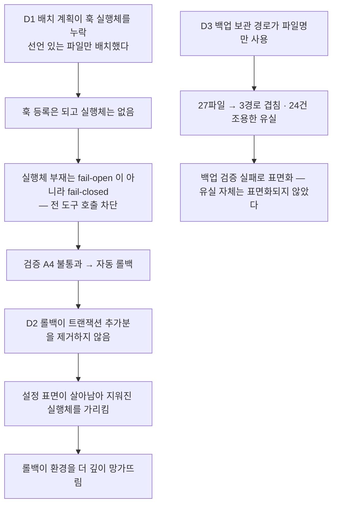

## 요약

**확정** — 설계 문서 6축과 시정 배치 8건을 구현해 이 머신에 설치를 완료했습니다.
설치 트랜잭션 `f80efdc461e0` 이 검증 7축 전건 통과로 커밋됐고, 릴리스 게이트 IV1
5/5·계약 시험 94/94·정제 스캔 검출 0건입니다.

**실측 대기** — 색인 54건 중 **21건 소거, 33건 미측정**입니다. 미측정분은 통과로
계산하지 않습니다. 커버리지는 전수가 아니라 하한입니다.

**미결** — 원격 저장소는 아직 없습니다. 공개 전환 결정은 착지했으나 원격 생성·push 는
승인 범위 밖입니다. 초기화 기본 모드(`reset-full` 허용 조건)는 여전히 사람 결정
대기이며, 그 전까지 `reset-managed` 만 실행 가능합니다.

## 무엇을 만들었나

| 구성 | 실물 | 규모 |
|---|---|---|
| 공용 구현 | `harness/lib/harness_core/` — 채번·경로·게이트·봉투·정책·레지스트리·훅·로스터 | 9모듈 |
| 자산 | `harness/assets/` — 에이전트 14 · 스킬 17 · 훅 5 · 설정 단편 2 | 전건 표에서 파생 |
| 설치기 | `harness/installer/` — 트랜잭션 7단계 + 언인스톨 + 롤백 + 플랫폼 프로파일 4종 | 1실행체 |
| 도구 | `harness/tools/` — 착지·자산생성·계측·릴리스게이트·정제스캔 | 6개 |
| 시험 | `harness/tests/` | 94건 |

커스텀 잔량은 설계가 인정한 4종(생성·착지 도구 / 훅 판정 / 배치 잡 / pre-push 스캔)의
범위 안이며, 공용 라이브러리는 그 4종의 중복을 없애는 자리이지 별도 실체가 아닙니다.
상주 프로세스는 어느 축에서도 채택하지 않았습니다.

## 실행에서 드러나 시정한 결함 3건

설계 문서만으로는 보이지 않았고 **실제로 돌려서** 드러난 것들입니다. 셋 다 회귀
테스트를 동반합니다 — 회귀 테스트는 수정 전에 실패를 증명해야 유효합니다.

| # | 결함 | 근원 | 시정 |
|---|---|---|---|
| D1 | 훅 실행체 미배치 | 자산 단위를 **파일**로 봤다. 훅의 단위는 디렉토리다 — 선언은 `hook.json` 에, 실행체는 그 옆에 있다 | `sibling_payload()` 신설. 검증 축 **A8**(등록된 훅 명령의 실행체 실재) 신설 |
| D2 | 롤백 불완전 | 설계 E§2.9 의 "스냅샷 복원은 멱등이다"가 성립하지 않는다. 복사는 **있던 것을 되돌릴** 뿐 **새로 생긴 것을 지우지** 못한다 | `transaction_additions()` — 저널의 copy·write 대상 중 스냅샷에 없던 것을 제거. 제거 순서는 등록 표면 → 실행체 순 |
| D3 | 백업 경로 충돌 | 보관 경로 폴백이 파일 이름만 썼다 | 커버리지 소스 기준 상대 경로로 산출. 해시의 대상도 소스가 아니라 **보관본**으로 교체 |

D2 의 근원 서술을 한 겹 더 파고들면 이렇습니다 — **설계는 롤백을 "복원"으로만
정의했고 "제거"를 정의하지 않았습니다.** 그래서 구현자가 복사만 해도 문면을
만족합니다. 문면이 절반만 요구하면 구현은 절반만 합니다.

D1 이 만든 상태는 이 세션의 도구 호출을 실제로 전면 차단했고, 사람이 한 줄 명령을
실행해서만 풀렸습니다. **훅 등록과 실행체는 한 단위로 다뤄야 한다**는 것이 그
실측의 내용입니다.

## 검증

| 축 | 결과 | 재는 법 |
|---|---|---|
| 계약 시험 | 94/94 | `python3 harness/tests/run.py` |
| 자산 드리프트 | 0건 (자산 31개가 로스터 표와 일치) | `genassets.py --check` |
| 정제 스캔 | 검출 0건 (103파일 × 17패턴, 억제 46건 전건 사유 동반) | `sanitize.py`, 대소문자 구분 |
| IV1 릴리스 게이트 | 5/5 — 참조그래프·청정루트 실설치·멱등·롤백·언인스톨 | `iv1.py` |
| IV2 실환경 검증 | 7축 전건 통과, 검증 불가 0 | 설치 트랜잭션의 verify 단계 |
| 멱등 | 2회 연속 설치의 관리물 해시 차분 0 | IV1 G3 |

IV2 의 7축: `A1` 헤드리스 프로브 세션 정상 종료 · `A2` 로스터 기대집합 ⊆ 등록집합 ·
`A3` 훅 기대집합 ⊆ 설정 표면 등록집합 · `A4` SessionStart 센티널 이벤트의 감사 경로
착지 · `A5` 설정 단편 키의 재독 대조 · `A6` 저널 `scope_violation` 0건 ·
`A8` 등록된 훅 명령의 실행체 실재.

`A4` 가 핵심입니다 — 등록(설정에 존재)과 실행(이벤트 발생 시 실제 구동)은 다른
사실이고, 이 하네스는 그 차이 때문에 한 번 죽었습니다.

## 설치 전 실측 — 소거 21건

| ID | 항목 | 결과 |
|---|---|---|
| E§9-M2 | 헤드리스 세션 실행 | 성립 — exit 0 · JSON 산출 · 9.0초 |
| D§9-1 | 훅 이벤트 존부 | `SessionStart`·`UserPromptSubmit`·`PreToolUse`·`PostToolUse`·`Stop`·`SessionEnd`·`SubagentStop` 발화 확인. `PreCompact`·`Notification` 은 **미유발 구간**이며 미지원이 아니다 |
| D§9-1b · F§13-7 | 훅 입력 필드 | `cwd`·`hook_event_name`·`session_id`·`source`·`transcript_path` |
| F§13-1 · F§13-5 | Stop 훅 발화 + 전사 경로 | 둘 다 성립 — 리드 게이트 집행 지점이 `Stop` 으로 확정 |
| F§13-3 | 리드 도구 거부의 강제력 | 성립 — 세션 도구 집합이 정확히 3종으로 협착됨을 세션 스스로 보고 |
| E§9-M3 | PreToolUse 차단 반환 | 성립 — `docs/` 하위 Write 가 실제로 차단됨 |
| A§11-2 | 훅이 서브에이전트에 적용 | 성립 — 스폰 시 `SubagentStop` 발화 |
| B§10-4 | 헤드리스에서 Workflow 가용 | 성립 |
| F§13-4 | Grep 카운트 모드 | 성립 (재측정으로 1차 부정 결과를 반증) |
| D§9-10 | 동시 append 원자성 | `atomic` — 8프로세스 × 80회 상한 크기 레코드에서 줄 640/640 · 파싱 실패 0 · id 유실 0 |
| E§9-M10 | 예약 실행 표면 | systemd user · crontab 둘 다 존재 |
| D§9-6 | OS 알림 명령 | `notify-send` 부재 · `powershell.exe` 존재 → WSL 은 Windows 토스트 경로 |
| E§9-M5·M9a·M13 | WSL 자원·rename 원자성·런타임 | 전건 성립 |

**정직 공지** — 33건은 재지 않았습니다. Windows 네이티브 축(M4·M9a 일부)은 이
머신에서 잴 수 없고, 모바일 푸시(D§9-5)·상태줄(D§9-7)·사용량 조회(D§9-8)는
미착수입니다. 미측정은 통과가 아닙니다.

한 건은 **잘못 쟀다가 정정**했습니다. Grep 카운트 모드를 2차 프로브에서 부정으로
기록했는데, 그 세션의 도구 집합에 Grep 자체가 없었던 아티팩트였습니다. 도구 부재와
기능 부재를 구별하지 않은 판독 오류였고 재측정으로 반증했습니다.

## 이 문서 자신의 증거 계약

`stage: dev` 산출이므로 X1 의 문서 증거 계약(`doc_evidence`)을 따릅니다. 코드가
아니라 문서인 산출에서 "실패 선행"이 성립하는 형태는 **검사기를 산출 전에 먼저
돌려 불통과를 확보하는 것**이고, 이 구현이 실제로 그 순서를 밟았습니다.

## 규율

- [R1] 미측정 항목을 통과로 계산하지 않는다.
  [장치 — 계측기의 상태 enum 이 `positive`·`negative`·`unmeasurable` 3값이고 요약 집계가 셋을 분리해 센다. 색인 총계(54)와 측정 건수를 같은 화면에 함께 낸다 | 장치 불가 — "충분히 쟀는가"의 판정은 사람 몫이다. 완화: 커버리지를 하한으로 표기]
- [R2] 실행에서 드러난 결함은 회귀 테스트와 함께만 닫는다.
  [장치 — 시정 3건 전건에 대응 테스트가 있고, 각 테스트가 수정 전에 실패했음을 실행 기록이 보인다. 테스트 없는 시정은 커밋 메시지에만 존재하는 시정이다 | 장치 불가 — 해당 없음]
- [R3] 잘못 잰 값은 정정하고 정정 사실을 남긴다.
  [장치 — 측정 레코드에 `supersedes` 필드를 두어 반증된 판독을 지우지 않고 링크한다 | 장치 불가 — 오측정의 자기 검출은 불가능하다. 완화: 부정 결과가 나오면 재측정을 강제하는 절차]
