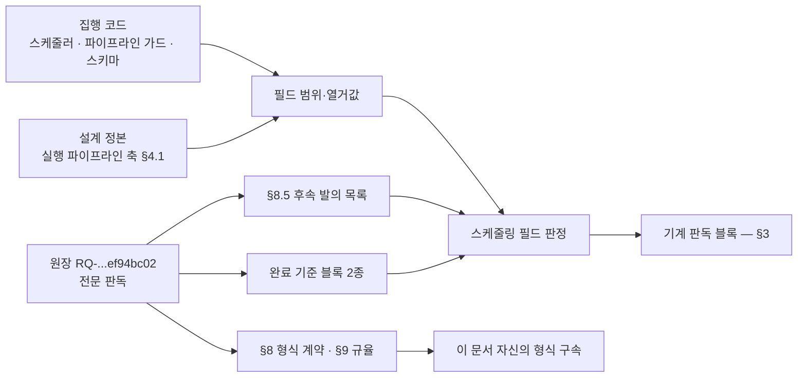
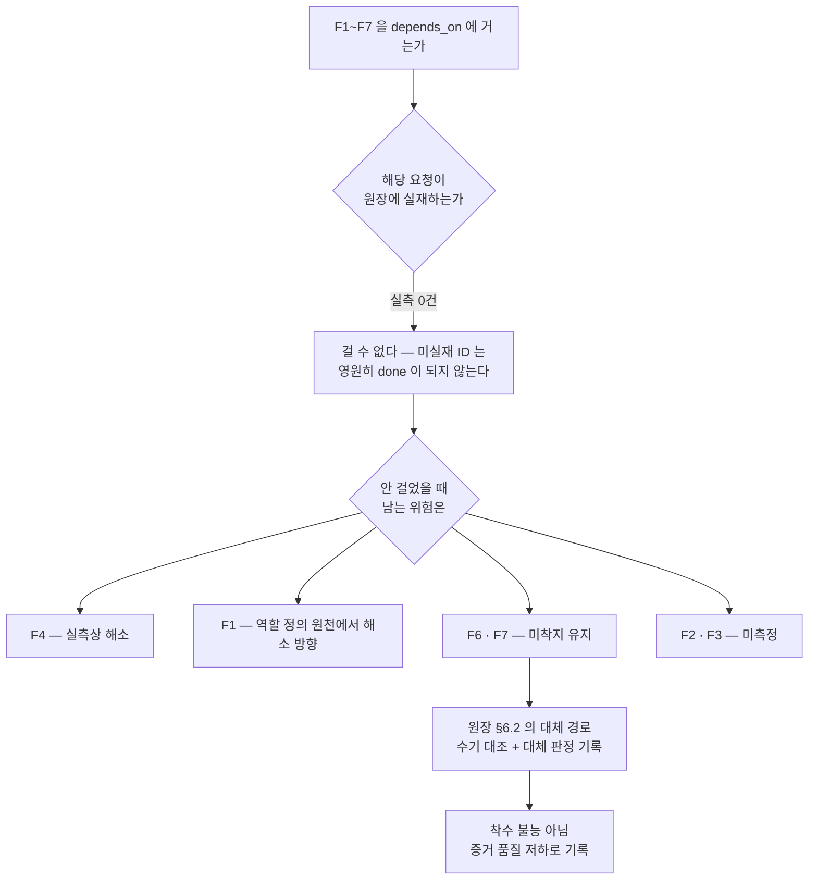

## 요약

요청 `RQ-20260728T180616Z-ef94bc02`(하네스 운영 대시보드)의 분석 단계 산출이다. 원장 전문을 직접 읽고
중복 검색을 실행했으며, 스케줄링 입력 필드 다섯 종의 값과 그 판정 근거를 기입했다. 판정식이 읽는 값은
아래 §3 의 기계 판독 블록이고, 이 산문은 그 값의 근거다.

이 문서는 **설계하지 않는다.** 화면 축·데이터 계약·기술 스택은 원장 §1.1 과 §5 가 설계 단계로 그어 둔
경계 안에 있고, 여기서 선점하지 않았다. 원장 §4 승계 판정도 재부여하지 않았다 — 판정 정본은 분석 문서
`DS-20260728T171325Z-d48b6682` 이며, 그 문서의 실재 여부는 §2 에 관측으로 남겼다.

**확정** — 스케줄링 필드 다섯 종. `priority` 유지, `importance` 신규 기입, `weight` 는 heavy,
`output_kind` 는 mixed, `depends_on` 은 빈 목록. 각 값의 근거와 재는 법은 §3 에 있다.

**미결** — 원장 §6.4 스킬 이름 축과 §6.2 측정 지점 계약은 이 분석이 결정하지 않았다. 관측만 §5 에
기록했고, 결정은 설계 단계와 사람 확답 계층 소관이다.

**실측 대기** — 원장이 참조로 지목한 문서 두 건이 트리에서 열리지 않는다(§2.4). 이 분석은 그 부재를
관측했을 뿐 사유를 판정하지 않았다.

**수량 표기 고지(원장 §8.6 적용)** — 이 문서에서 아라비아 숫자로 적은 수량은 전부 잰 값이고, 재는 법이
같은 행 또는 같은 문단 안에 있다. 재지 않은 수량은 한글 수사로 적었다. 필드 값(`priority`·`importance`)과
문서 좌표(`§4.2` 같은 절 번호), 식별자(`R1`·`F4`·`Q7`)는 수량이 아니므로 이 규약의 대상 밖이다 —
원장 §9 R6 이 정책 입력값을 측정값과 구별하라고 한 것과 같은 구분이다.

---

## 1. 원장 정본 대조 — 무엇을 읽었나

착수 첫 행동으로 원장 전문을 읽었다. 프롬프트에 실린 요약은 근거로 삼지 않았다(원장 §9 R1, 역할 규율 R1).

| 축 | 값 | 재는 법 |
|---|---|---|
| 원장 규모 | 831줄 · 81,344바이트 | `wc -l -c` 1회, 2026-07-29 15:09 KST |
| 레벨2 헤딩 | 13개 | `grep -cE '^## '` 1회, 2026-07-29 15:09 KST |
| 읽은 범위 | 전문. `### 등재 후 추가` 절(문서 말미)을 포함한다 | Read 도구 3회로 1행부터 832행까지 연속 판독, 2026-07-29 15:05~15:06 KST |

**완료 기준의 정본 좌표** — 원장의 `## 완료 기준` 블록과, 말미 `### 등재 후 추가` 절의
`criteria_amendment` 블록이다. 후자는 등재 후 의사결정권자 발화로 추가된 판정 항목이며, 원장 자신이
"`criteria` 목록에 더한 것으로 읽는다"고 적었다. 이 분석은 두 블록을 합쳐 하나의 완료 기준으로 취급했다.

| 축 | 값 | 재는 법 |
|---|---|---|
| `criteria` 항목 | 10건 | `frontmatter.yaml_blocks()` 파싱 후 블록 길이 판독 1회, 2026-07-29 15:09 KST |
| `criteria_amendment` 항목 | 2건 | 같은 실행 |
| 합계 | 12건 | 같은 실행 |

**프롬프트와 정본의 불일치 한 건(이벤트로 보고)** — 기동 프롬프트는 `priority`·`importance` 의 범위를
`1–5` 로 적었다. 정본은 다른 값을 정한다.

| 필드 | 정본 범위 | 정본 좌표와 재는 법 |
|---|---|---|
| `priority` | int 0~3 (3=최고) | `docs/design/public/2026/07/DS-20260728T184200Z-9e90fda0-harness-axis-b-execution-pipeline.md` §4.1 필드 표 판독 1회, 2026-07-29 15:09 KST |
| `importance` | int 1~3 (3=최고) | 같은 표, 같은 실행 |

이 불일치는 표기 차이가 아니라 실행 결과가 갈리는 자리다. 에이징 보 폭 표는 키가 `"1"`·`"2"`·`"3"`
셋뿐이라, `importance` 에 4 또는 5 를 넣으면 판정식이 그 키를 찾지 못하고 예외로 죽는다
(`policy.DEFAULTS["aging_step_hours"]` 출력 1회로 키 집합 확인, 2026-07-29 15:07 KST). 정본을 따랐다.



---

## 2. 중복 검색 — 실행 명령과 결과

원장 §8.1 이 분석 단계의 필수 항목으로 지목한 항이고, 판정식 쪽에서도 `dedup_check` 필드가 없으면 분석
완료가 성립하지 않는다(`scheduler.analysis_complete` 판독 1회, 2026-07-29 15:08 KST).

### 2.1 전 문서 요약 인덱스

| 조회 | 명령 | 결과 |
|---|---|---|
| 인덱스 규모 | `wc -l derived/index/docs.jsonl` 1회, 2026-07-29 15:05 KST | 4행 |
| 대시보드 어간 | `grep -c dashboard derived/index/docs.jsonl` 1회, 같은 시각 | 0건(종료 코드 1) |
| 이 요청 자신의 등재 | `grep -c RQ-20260728T180616Z-ef94bc02 derived/index/docs.jsonl` 1회, 2026-07-29 15:06 KST | 0건 |
| 등재 문서의 유형 분포 | `grep -oE '"id": "[A-Z]{2}-'` 후 계수 1회, 같은 시각 | DS 유형 4건. 그 외 유형 0건 |

### 2.2 태그 축 샤드

| 조회 | 명령 | 결과 |
|---|---|---|
| 실재 축 | `ls -1 derived/index/tags/` 1회, 2026-07-29 15:05 KST | 네 종 — domain · kind · origin · stage |
| domain 샤드 | `ls -1 derived/index/tags/domain/` 1회, 같은 시각 | `harness-self.jsonl` 하나. `dashboard.jsonl` 은 **파일이 없다** |
| 전 샤드 행수 | `wc -l derived/index/tags/*/*.jsonl` 1회, 2026-07-29 15:06 KST | 네 샤드 각 4행, 합계 16행 |
| 샤드 내용 | 각 샤드 전문 판독 1회, 같은 시각 | 네 샤드가 같은 문서 4건을 담는다. 전건 `stage/design`·`origin/agent`·`kind/improvement`·`domain/harness-self` |

`domain/dashboard` 는 통제 어휘에 실재하는 값이다(`schema.TAG_VOCAB` 출력 1회, 2026-07-29 15:13 KST).
따라서 샤드 부재는 어휘 밖 태그라서가 아니라 **그 태그를 단 문서가 한 건도 착지하지 않았기 때문**이다.
이 축의 조회 결과는 0건이 아니라 **조회 대상 미실재**로 기록한다 — 둘을 같은 표기로 접으면 검사하지 않은
것이 검사 통과로 읽힌다.

### 2.3 원장 트리 직접 조회

인덱스가 원장 전건을 덮지 못하므로(§2.5) 트리를 직접 걸었다.

| 조회 | 명령 | 결과 |
|---|---|---|
| 요청 문서 전건 | `find docs/requests -name '*.md' -type f` 1회, 2026-07-29 15:06 KST | 3건 |
| 각 요청의 핵심 메타 | 위 3건의 frontmatter 판독 1회, 같은 시각 | 설계 프롬프트 재생성 요청 · 이 요청 · 문자열 정규화 요청 |
| 문서 트리 전건 | `find docs -name '*.md' -type f \| wc -l` 1회, 같은 시각 | 26건 |
| 비공개 트리 | `find docs -type d -name private \| wc -l` 1회, 2026-07-29 15:12 KST | 0개. 비공개 샤드 자체가 없다 |
| 대시보드 어간 전 트리 | `grep -ric "dashboard\|대시보드" docs --include='*.md'` 1회, 2026-07-29 15:07 KST | 언급 최다가 이 요청 자신(31행). 요청 유형 중 다음이 설계 프롬프트 재생성 요청(8행) |
| 이 요청을 가리키는 문서 | `grep -rl RQ-20260728T180616Z-ef94bc02 docs` 1회, 2026-07-29 15:07 KST | 1건 — 이 요청 자신뿐. **이 요청을 참조하는 기존 분석 문서 0건** |
| 분석 단계 태그 보유 | `grep -rl "stage/analysis" docs` 1회, 같은 시각 | 1건 — 설계 프롬프트 재생성 축의 분석 문서. 대시보드 축이 아니다 |

**인접 사례 한 건과 중복 아님의 근거** — 설계 프롬프트 재생성 요청(`RQ-20260728T170616Z-d0bc4127`)이
대시보드를 여덟 행에서 언급한다(위 표의 어간 조회와 같은 실행). 그 요청의 `what` 은 하네스 설계
프롬프트·설계 문서를 파이프라인으로 재생성하는 것이고, 대시보드는 그 문서들이 다루는 소재 중 하나로
등장한다. 산출물의 축이 다르므로 중복으로 세지 않는다.

### 2.4 참조 대상 실재 — 관측 두 건

중복 검색과 같은 실행에서 원장이 지목한 참조 대상의 실재를 확인했다.

| 대상 | 원장에서의 자리 | 조회 결과 | 재는 법 |
|---|---|---|---|
| `DS-20260728T171325Z-d48b6682` | §4·§10 이 지목한 승계 판정 **정본** | 트리에 없음. 저장소 전체에서 이 식별자를 언급한 파일은 원장 자신 1건 | `find docs -name "*<id>*"` 와 `grep -rl` 각 1회, 2026-07-29 15:07 KST |
| `RQ-20260728T165829Z-f3ccf365` | frontmatter `refs.request` | 트리에 없음. 언급 파일 4건은 전부 그 ID 를 가리키기만 한다 | 같은 실행 |

이것은 판정이 아니라 관측이다. 원장 §4 가 "갈리면 분석 문서가 이긴다"고 정한 정본이 현재 이 트리에서
열리지 않는다는 사실만 기록한다. 사유(리허설 구간의 미이관인지, 다른 루트에 있는지, 소실인지)는
판정하지 않았다 — 이 분석의 조회 범위 밖이다.

원장 §4.2 기재 집계는 원장 자신의 절차로 재현된다. 원장 §4.3 스코프를 297행부터 433행까지로 고정해
판정 행을 추출하고 §4.2 가 정한 3단계 정규화(강조 표기 제거 → 괄호 부연 제거 → 열거값 대조)를 적용한
결과가 승계 52 · 조건부 승계 12 · 제외 5, 합계 69다(`sed` + `grep` + `awk` 파이프 1회,
2026-07-29 15:10 KST). 원장 기재값과 일치한다. **이 재현은 전사표의 자기정합만 보이며, 행 속성의 진위는
보이지 않는다** — 원장 §4.1 자신이 진위 판정은 실물에서만 가능하다고 적었고, 이 분석은 실물을 열지 않았다.

### 2.5 인덱스 커버리지 하한

| 축 | 값 | 재는 법 |
|---|---|---|
| 인덱스 등재 문서 | 4건 | `wc -l derived/index/docs.jsonl` 1회, 2026-07-29 15:05 KST |
| 문서 트리 실재 | 26건 | `find docs -name '*.md' -type f \| wc -l` 1회, 2026-07-29 15:06 KST |
| 커버리지 하한 | 26건 중 4건 | 위 두 값의 대조 1회, 같은 시각 |
| 요청 유형 커버리지 | 3건 중 0건 | 요청 트리 계수와 인덱스 유형 분포 대조 1회, 같은 시각 |
| 이 요청 자신의 등재 | 미등재 | `grep -c` 1회, 2026-07-29 15:06 KST |

**인덱스만으로 중복을 판정할 수 없다.** 인덱스는 착지 시점 append 로 자라는 파생물이라(도구 소스의
`append_index` 판독 1회, 2026-07-29 15:07 KST) 도구를 경유하지 않고 놓인 문서는 들어오지 않는다.
이 요청 자신이 그 사례다. 따라서 §2.3 의 트리 직접 조회가 이 판정의 실효 근거이고, 인덱스 조회는
보조다. 중복 없음이라는 결론의 커버리지는 **문서 트리 26건 전건 + 요청 트리 3건 전건**이며, 트리 밖
(외부 저장소·이슈 트래커·플랫폼 기록)은 **조회하지 않았다**.

---

## 3. 스케줄링 필드 판정

원장 §11 이 아니라 실행 파이프라인 축 §4.1 이 이 필드들의 정본이다. 값의 타당성 판정은 여기서 하고,
**스케줄 결정은 하지 않는다** — 결정은 결정론 판정식 소관이다.

```yaml
scheduling_input:
  priority: 2
  importance: 2
  weight: heavy
  output_kind: mixed
  depends_on: []
dedup_check:
  queries:
    - "wc -l derived/index/docs.jsonl"
    - "grep -c dashboard derived/index/docs.jsonl"
    - "grep -c RQ-20260728T180616Z-ef94bc02 derived/index/docs.jsonl"
    - "ls -1 derived/index/tags/ ; ls -1 derived/index/tags/domain/"
    - "wc -l derived/index/tags/*/*.jsonl"
    - "find docs/requests -name '*.md' -type f"
    - "find docs -name '*.md' -type f | wc -l"
    - "grep -ric 'dashboard|대시보드' docs --include='*.md'"
    - "grep -rl RQ-20260728T180616Z-ef94bc02 docs --include='*.md'"
    - "grep -rl 'stage/analysis' docs --include='*.md'"
  hit_count: 0
  verdict: no-duplicate
  matched_refs: []
  adjacent_not_duplicate:
    - id: RQ-20260728T170616Z-d0bc4127
      reason: "산출 축이 설계 프롬프트·설계 문서의 재생성이고 대시보드는 그 문서들의 소재로만 등장한다"
  coverage_floor:
    docs_tree_scanned: 26
    requests_tree_scanned: 3
    index_covered: 4
    index_covers_this_request: false
    not_scanned:
      - "저장소 밖 원천(외부 저장소·이슈 트래커·플랫폼 기록)"
      - "domain/dashboard 태그 샤드 — 파일 미실재로 조회 대상 자체가 성립하지 않음"
    measured_at: "2026-07-29T15:06:00+09:00"
```

### 3.1 `priority` = 2 (유지)

원장 frontmatter 의 기존 값이 2이고(frontmatter 판독 1회, 2026-07-29 15:08 KST) 이 분석은 유지를 택했다.

| 근거 | 내용 |
|---|---|
| 차단성 없음 | 원장 §1 이 대시보드를 하네스 초기 범위 밖·설치 완료 후 첫 요청 대상으로 적었다. 하네스 자신의 가동을 막는 축이 아니다 |
| 에이징 여지 보존 | 에이징 승급은 상한이 3이다(`scheduler.aged_priority` 의 `min(3, ...)` 판독 1회, 2026-07-29 15:08 KST). 등재 시점에 3을 주면 대기가 길어져도 우선순위 축에 아무 변화가 나타나지 않아 기아 신호가 소멸한다 |
| 인상 사유 부재 | 원장 말미 `### 등재 후 추가` 절의 발화는 완료 기준을 두 항목 늘렸고(§1 의 항목 계수와 같은 실행), 요건의 **질**을 좁혔다. 긴급도를 올리는 문면은 그 절에 없다 |

### 3.2 `importance` = 2

원장 frontmatter 에 이 필드가 없다(같은 판독). 신규 기입이다.

| 근거 | 내용 |
|---|---|
| 대기 구간이 구조적이다 | 원장 §1.2 가 "`hold` 경유가 이 요청에서 실제로 발생한다"고 적었고, §5 사람 확답 계층 문항이 여섯 건이다(`^\| Q[0-9]+ \|` 계수와 계층 열 판독 1회, 2026-07-29 15:09 KST — 문항 전체는 14건) |
| 1은 낮다 | 보 폭이 24시간이 되어(`policy.DEFAULTS["aging_step_hours"]` 출력 1회, 2026-07-29 15:07 KST) 기아 임계 48시간(같은 출력의 `starvation_hours`)에 승급보다 먼저 도달한다 |
| 3은 높다 | 보 폭이 4시간이 되어(같은 출력) 등재 직후 상한 3에 도달하고 큐 선두를 사실상 고정한다. 우선순위 선점은 사람 오버라이드 필드가 담당하도록 정본이 정해 뒀다 — 에이징 채널로 그것을 대체하지 않는다 |
| 범위 준수 | 정본 범위가 1~3 이므로 이 값은 범위 안이다(§1 의 필드 표 판독과 같은 실행) |

### 3.3 `weight` = heavy

열거값은 light · standard · heavy 셋이다(실행 파이프라인 축 §4.1 필드 표 판독 1회, 2026-07-29 15:09 KST).

| 측정 축 | 값 | 재는 법 |
|---|---|---|
| 완료 기준 항목 | 12건 | `yaml_blocks()` 파싱 1회, 2026-07-29 15:09 KST |
| 승계 판정 행 | 69건. 그중 화면 착지가 요구되는 승계 52건, 판정 확정이 요구되는 조건부 12건 | §4.3 스코프 고정 파싱 + 3단계 정규화 1회, 2026-07-29 15:10 KST |
| 설계 문답 | 14건 | `grep -cE '^\| Q[0-9]+ \|'` 1회, 2026-07-29 15:09 KST |
| 투입 역할 키 | 9종 | 원장 §1.2 다이어그램 스코프(150~163행)에서 역할 키 추출 후 유일화 1회, 2026-07-29 15:12 KST |
| 원장 규모 | 831줄 · 81,344바이트 | `wc -l -c` 1회, 2026-07-29 15:09 KST |

light 는 단일 세션·단일 산출 단위를 뜻하는 자리다. 이 요청은 설계·구현·검증 세 단계에 걸쳐 아홉 종의
역할이 투입되고 완료 기준 12건 중 화면 실렌더로만 확인되는 항목이 다수다(§3.4 의 분류 참조). standard 로
접으면 자원 배정 입력이 실제 소요를 과소 표현한다. heavy 를 택했다.

### 3.4 `output_kind` = mixed

**이 판정이 building→verifying 전이의 증거 요구를 가른다.** 판정식은 `output_kind` 로 유닛별 증거
종류를 분기하고, 어느 분기에도 증거 0은 없다(`schema.evidence_required` 와 `pipeline.g_build_reported`
판독 1회, 2026-07-29 15:08 KST).

먼저 경계를 바로 잡는다. 원장 §1.1 의 "하지 않는 일" 목록은 **프롬프트 문서 자신**이 하지 않는 일이지,
요청의 산출 유형이 아니다. 요청의 산출은 §1.2 파이프라인의 building 이 낳는 것이고, 그 담당은
designer·frontend-developer·document-specialist 다(§1.2 판독, §3.3 의 역할 추출과 같은 실행).

완료 기준 12건을 확인 표면으로 분류했다(원장 `## 완료 기준` 블록과 `criteria_amendment` 블록의 `how`
필드를 실렌더 화면 대조 / 문서 실재 대조 / 양쪽 중 하나로 배정, 판독 1회 2026-07-29 15:14 KST).

| 확인 표면 | 해당 항목 | 이 표면이 요구하는 증거 |
|---|---|---|
| 실렌더 화면에서만 확인 | 승계 52건 화면 착지 · 실렌더 증거 참조 · 횡단 승계 축(접근성·삽입 공격 하드닝·화이트리스트 기본 거부·민감 필드 억제) · 미계측과 0의 구별 표기 · 화면 문구 아부 검사 · 패널의 판단 근거 적재 · 파생 지표의 원천 표기 | 코드 산출의 증거 |
| 문서 실재로만 확인 | 조건부 승계 12행의 판정 종결 · §5 문항 전건의 응답 문서 착지 · 산출본 위치 규약 · 새니타이즈 검사 | 문서 산출의 증거 |
| 양쪽 | 스킬 산출 증거 동반 | 둘 다 |

두 표면이 함께 있으므로 `code` 도 `document` 도 아니다.

| 대안 | 접었을 때 생기는 결과 |
|---|---|
| `code` | 결정 기록·문답 응답 같은 순수 문서 유닛에도 테스트 증거를 요구하게 된다. 그 유닛에는 실패 시험이 존재할 수 없어 전이가 정지한다 |
| `document` | 화면 유닛에 문서 증거만 요구해, 완료 기준의 실렌더 증거 요구가 증거 계약에서 빠진다. 원장 §6.5 실렌더 구속과 어긋난다 |
| `mixed` | 유닛마다 산출 종류를 선언해야 한다(아래 파생 의무) |

**mixed 선택이 낳는 파생 의무(측정)** — `output_kind` 가 mixed 일 때 판정식은 유닛의 `produces_code`
값이 없으면 판정 불능으로 거부한다(`pipeline.g_build_reported` 의 mixed 분기 판독 1회,
2026-07-29 15:08 KST). 따라서 설계 단계의 작업 분해는 유닛마다 이 값을 기입해야 한다. **분해 자체는
설계 소관이므로 이 분석은 수행하지 않았고**, 의무의 존재만 여기 남긴다.

### 3.5 `depends_on` = 빈 목록

원장 §8.5 의 후속 발의 F1~F7 을 의존으로 걸지 않았다.

**판단** — F1~F7 은 원장이 "별도 요청으로 발의한다"고 적은 **미발의** 항목이다. 요청 트리 3건 전건의
frontmatter 를 읽었고 F1~F7 에 대응하는 요청 ID 는 0건이다(§2.3 의 요청 트리 조회와 같은 실행).

**미실재 ID 를 걸면 착수가 영구 불능이 된다** — 판정식은 의존 대상의 상태를 조회해 `done` 이 아니면
`dependency` 사유로 정지시키고, 원장에 없는 ID 는 상태가 비어 있어 영원히 `done` 이 되지 않는다
(`scheduler` 의 eligible 판정 내 의존 루프 판독 1회, 2026-07-29 15:08 KST).

**감수하는 위험과 그 크기(측정)** — 원장은 F4 미해소 시 "순수 문서 산출 요청이 구현과 검증 사이에서
정지한다"고 적었다. 그 위험이 지금도 유효한지 실측했다.

| 발의 | 원장이 적은 미해소 결과 | 실측 상태 | 재는 법 |
|---|---|---|---|
| F1 스킬 매핑 등재 | 배포 시 요건 소멸 | 역할 정의 원천의 designer·frontend-developer 필수 스킬에 `frontend-design` 이 실재 | `roster.py` 의 두 역할 블록 판독 1회, 2026-07-29 15:11 KST |
| F4 산출 유형 필드 | 순수 문서 산출이 전이에서 정지 | 요청 유형 필수 필드에 `output_kind` 실재. 전이 가드가 그 값으로 분기 | `schema.TYPE_REQUIRED["RQ"]` 와 `pipeline.g_build_reported` 판독 1회, 2026-07-29 15:08 KST |
| F5 아부 금지 차단 장치 | 필수 산출 장치 부재 | 착지 게이트에 전용 오류 코드 실재. 어휘 13개 | 게이트 오류 코드표 판독 + `policy.load()` 의 어휘 길이 출력 각 1회, 2026-07-29 15:07 KST |
| F6 시각화 블록 계약 | 시각화 요구가 어떤 게이트로도 성립 안 함 | 착지 게이트 전문에 시각화 검사 어휘 검출 0건 | `grep -c "시각화\|mermaid\|%% target" gate.py` 1회, 2026-07-29 15:11 KST |
| F7 시각 산출 증거 필드 | 증거 기준의 측정 지점이 가리킬 필드가 없음 | 착지 게이트 전문에 `design_evidence` 검출 0건. 증거 계약 표의 분기는 tdd·doc 두 종뿐 | `grep -c design_evidence gate.py` 와 `schema.EVIDENCE_FIELDS` 출력 각 1회, 2026-07-29 15:11 KST |
| F2 · F3 | 측정 지점·구속 부재 | 이 분석에서 **측정하지 않았다** | — |

F4 의 차단 위험은 실측 기준으로 해소돼 있다. F1 도 역할 정의 원천 쪽에서 해소 방향으로 움직였다.
남는 것은 F6·F7 이고, 그 구간의 처리는 원장 §6.2 자신이 이미 정해 뒀다 — 검증 단계의 수기 대조로
대체하고 **대체 판정임을 기록한다**. 즉 남는 위험은 착수 불능이 아니라 **증거 품질의 저하**다.

**따라서 감수하는 위험을 명시한다**: F6·F7 미착지 구간에서 스킬 준수 측정과 시각화 요구는 자동 게이트가
아니라 사람의 수기 대조에 의존한다. 이 상태로 building 이 진행되면, 대체 판정 기록이 빠진 산출은
증거가 없는 것과 구별되지 않는다. 이 위험을 의존 간선으로 옮기지 않고 여기 기록으로 남기는 이유는,
간선으로 옮기는 순간 착수 자체가 불능이 되어 위험을 줄이는 대신 요청을 정지시키기 때문이다.

F2·F3 은 측정하지 않았다 — 조회 결과 0건이 아니라 **미측정**이다.



---

## 4. 요청 무게와 분해 관점

**판정: 단일 단위로 착수하지 않는다. 분해가 필요하다.**

| 분해 필요를 가리키는 축 | 측정값 | 재는 법 |
|---|---|---|
| 완료 기준 항목 | 12건 | `yaml_blocks()` 파싱 1회, 2026-07-29 15:09 KST |
| 화면 착지가 요구되는 승계 행 | 52건 | §4.3 스코프 파싱 1회, 2026-07-29 15:10 KST |
| 착수 전 종결이 필요한 조건부 행 | 12건 | 같은 실행 |
| 응답 문서 착지가 필요한 문항 | 14건. 그중 사람 확답 계층 여섯 건 | `grep -cE '^\| Q[0-9]+ \|'` 와 계층 열 판독 1회, 2026-07-29 15:09 KST |
| 산출 종류 | 혼합(§3.4) — 유닛마다 산출 종류 선언이 필수 | `pipeline.g_build_reported` 의 mixed 분기 판독 1회, 2026-07-29 15:08 KST |

단일 단위로 두면 두 가지가 동시에 깨진다. 첫째, 판정식이 mixed 요청의 유닛별 산출 종류를 요구하는데
유닛이 하나뿐이면 화면과 문서가 한 유닛에 섞여 어느 증거 종류도 옳지 않다. 둘째, 사람 확답 대기 구간이
전체를 멈춘다 — 원장 §1.2 가 `hold` 경유를 예고했고, 문항에 종속되지 않는 승계 행까지 함께 멈춘다.

**분해 축만 제시한다. 실제 분해는 설계 단계 소관이므로 수행하지 않았다.**

| 분해 축 후보 | 이 축이 가르는 것 |
|---|---|
| 문답 종속 여부 | §4 조건부 승계 행과 그 밖의 승계 행. 전자는 응답 착지가 선행 조건이고 후자는 아니다 |
| 산출 종류 | 화면 유닛과 문서 유닛. `produces_code` 선언이 유닛 단위로 갈리는 자리와 같다 |
| 응답 계층 | 사람 확답 축과 에이전트 결정 축. 원장 §5.1 이 이미 계층을 갈라 뒀다 |
| 횡단 대 화면축 | 접근성·하드닝·화이트리스트·민감 필드 억제는 화면 축과 직교한다(원장 §4 K 군) |

어느 축을 택할지, 몇 개의 유닛으로 자를지는 이 분석이 정하지 않았다.

---

## 5. 분석 단계에서 관측된 위험·미결

**결정하지 않는다.** 아래는 전부 관측이고, 결정은 설계 단계와 사람 확답 계층 소관이다.

### 5.1 스킬 이름 축 (원장 §6.4)

| 축 | 원장 §6.4 기재 | 이 분석의 실측 | 재는 법 |
|---|---|---|---|
| designer 필수 스킬 | 매핑 표는 `visual-design`·`render-evidence` | 역할 정의 원천은 `frontend-design`·`render-evidence` | `roster.py` 의 designer 블록 판독 1회, 2026-07-29 15:11 KST |
| frontend-developer 필수 스킬 | 시각 축 스킬이 필수·선택 어디에도 없음 | 역할 정의 원천에 `tdd`·`debug-systematic`·`frontend-design` | 같은 파일의 frontend-developer 블록 판독 1회, 같은 시각 |
| `frontend-design` 실물 | 설치된 플러그인 스킬로 실재 | 스킬 디렉토리 3개소에서 실재 확인 | `find -type d -name frontend-design` 1회, 2026-07-29 15:11 KST |
| `visual-design` 실물 | 파일시스템 부재 | 같은 실행에서 검출 0건 | 같은 실행 |

원장이 기록한 시점과 현재 사이에 역할 정의 원천 쪽이 움직였다. **이 관측은 F1 이 종결됐다는 판정이
아니다** — 원장 §6.4 는 확정 주체를 결정 기록으로 지목했고, 결정 기록의 실재는 이 분석이 확인하지 않았다.
미판정을 통과로 접지 않는다(원장 §9 R8).

### 5.2 측정 지점 계약 (원장 §6.2)

원장 §6.2 는 스킬 준수의 측정 지점을 "`design_evidence` 계열 필드에 대한 착지 게이트 검사"로 두고,
그 계약이 미착지라고 고지했다. 실측으로 그 고지는 여전히 유효하다.

| 축 | 실측 | 재는 법 |
|---|---|---|
| 착지 게이트 내 `design_evidence` 검사 | 검출 0건 | `grep -c design_evidence gate.py` 1회, 2026-07-29 15:11 KST |
| 증거 계약 표의 분기 | tdd · doc 두 종. design 계열 없음 | `schema.EVIDENCE_FIELDS` 키 출력 1회, 같은 시각 |
| 역할 정의 원천의 장치 서술 | designer 규율이 "착지 게이트가 `design_evidence.render_evidence_ref` 실재를 검사한다"고 적음 | `roster.py` 의 designer 규율 슬롯 판독 1회, 같은 시각 |

**장치 서술과 실측이 어긋나 있다.** 역할 정의 원천은 게이트가 검사한다고 적었고, 게이트에는 그 검사가
없다. 이 어긋남을 이벤트로 보고하며, 어느 쪽을 고칠지는 판정하지 않았다.

같은 형태의 어긋남이 문서 전문가 역할의 시각화 규율에도 있다 — 규율은 "문서 유형별 필수 시각화 블록
계약을 착지 게이트가 검사한다"고 적었고, 게이트 전문에 그 검사 어휘가 검출되지 않는다
(`grep -c "시각화\|mermaid\|%% target" gate.py` 1회, 2026-07-29 15:11 KST). 원장 §8.5 F6 이 지목한 자리와
같다.

### 5.3 원장 참조 대상 부재 (§2.4)

승계 판정 정본과 상위 요청이 트리에서 열리지 않는다. building 착수 전에 걸릴 자리로 기록한다 —
원장 §4 는 판정을 바꿔야 하면 정본인 분석 문서를 먼저 갱신하라고 정했는데, 그 문서에 도달할 좌표가 없다.
판정하지 않았다.

### 5.4 원장 자신의 필수 필드 결손

| 축 | 실측 | 재는 법 |
|---|---|---|
| 원장 frontmatter 의 결손 필수 필드 | `weight` · `output_kind` 두 종 | `schema.required_fields()` 로 필수 목록을 얻어 원장 frontmatter 와 대조 1회, 2026-07-29 15:08 KST |
| `importance` | 값 없음(필수 목록 밖이나 전이 가드의 입력) | 같은 실행 |
| `depends_on` | 빈 배열로 실재 | 같은 실행 |

이 분석이 §3 에 확정한 값이 원장 frontmatter 에 기입되어야 전이 2 가드가 통과한다(가드가 검사하는
필드 집합 판독 1회, 2026-07-29 15:08 KST). 기입은 상태 전이 경로 소관이므로 이 분석이 수행하지 않았다.

---

## 6. 이 분석이 판정하지 않은 것

- **화면 축 구성·데이터 계약·기술 스택·갱신 주기·전달 모드** — 원장 §1.1·§5 가 설계 단계와 사람 확답
  계층에 둔 축이다. 선점하지 않았다.
- **승계 판정 69행의 개별 진위** — 전사표의 자기정합만 재현했고 실물을 열지 않았다(§2.4).
- **조건부 승계 12행의 종결 방향** — 문항 응답에 종속된다.
- **§8.5 F2·F3 의 현재 착지 상태** — 측정하지 않았다. 0건이 아니라 미측정이다.
- **스킬 이름 축의 확정**(F1) — 결정 기록의 실재를 확인하지 않았다.
- **`design_evidence` 계약을 누가 어떻게 착지시킬지**(F7) — 부재만 측정했다.
- **참조 대상 두 건이 왜 트리에 없는지** — 부재만 관측했다.
- **작업 유닛의 실제 분해** — 축만 제시했다(§4).
- **`file_scope`·`destructive_class` 등 나머지 스케줄링 필드** — 이 분석의 기입 범위는 프롬프트가 지정한
  다섯 종이다. 나머지 필드는 기입하지 않았고, 그 값이 무엇이어야 하는지도 판정하지 않았다.
- **원장 §4 승계 판정의 재부여** — 원장 §9 R3 이 금지한 행위이고, 하지 않았다.

---

## 7. 착지 전 사전 검사 (원장 §8.4)

원장 §8.4 가 수록한 사전 두 종과 화이트리스트를 이 본문에 직접 걸었다.

| 검사 | 대상 | 검출 | 재는 법 |
|---|---|---|---|
| 아부·품질 상찬 어간 | 본문 전문 | 0건 | 원장 §8.4 `sycophancy_stems` 열한 개 어간을 `grep -oE` 로 전문에 적용 1회, 2026-07-29 15:16 KST |
| 완충어 어간 | 역할 구속 문장. 원장 §8.4 가 전문 적용을 금지한 사전이다 | 전문에서도 0건 | `grep -nE` 로 일곱 어간을 전문에 적용 1회, 같은 시각 |
| 착지 게이트 상찬 어휘 | 닫힌 대상 필드 | 어휘 13개 중 0개 적중 | 게이트 정책의 어휘를 본문에 적용 1회, 같은 시각 |
| 새니타이즈 금지 토큰 | 본문 전문 | 패턴 17건 중 0건 검출 | 로컬 스캔 목록의 정규식 전건을 전문에 적용 1회, 2026-07-29 15:16 KST |
| 경로형 문자열 화이트리스트 | 본문의 슬래시 포함 토큰 전건 | 후보 12건 중 실경로형 6건, 화이트리스트 밖 0건 | 정규식 추출 후 태그 축 표기와 분리하고 접두 대조 1회, 2026-07-29 15:16 KST |

경로형 검사의 후보 12건 중 여섯 건은 `축/값` 꼴 태그 표기이고 경로가 아니다(같은 실행의 분리 출력).
남은 여섯 건이 실경로형이며 전부 `docs/`·`derived/` 접두 안에 있다. 이 분리를 하지 않으면 태그 표기가
화이트리스트 위반으로 잘못 계수된다.

검사 결과 수치는 착지 명령의 종료 코드와 함께 상위 보고에 싣는다.

---

## 규율 항목

- [R1] **정본을 좌표로 가리키고 재기술하지 않는다.** 원장 §4 승계 판정 표와 §5 문항 목록은 이 문서에
  옮기지 않고 절 좌표로만 지목했다.
  [장치 — 이 문서의 §1·§2 가 판독한 원천마다 좌표와 재는 법을 같은 행에 실어, 검증 단계가 인용 없이
  재기술한 자리를 문자열 대조로 찾을 수 있다 | 장치 불가 — 의역과 재구성은 문자열 일치로 잡히지 않는다.
  완화: 원장의 값을 다시 적은 자리는 재현 명령을 함께 실어 출처를 추적 가능하게 했다]
- [R2] **판정과 완료 주장은 기계 판독 블록으로만 낸다.** 산문 속 값은 근거이고 판정 채널이 아니다.
  [장치 — §3 의 `scheduling_input`·`dedup_check` 블록이 유일한 값 채널이고, 상위 보고가 그 블록을
  그대로 옮긴다 | 장치 불가 — 해당 없음]
- [R3] **측정한 것 / 허용하는 결론 / 허용하지 않는 결론을 분리한다.** 마지막이 §6 이다.
  [장치 — §6 이 독립 절로 실재하고 공백이 아니다 | 장치 불가 — 그 목록이 실제로 미판정 전건을 덮는지는
  세계 지식이 필요하다. 완화: 측정하지 않은 축을 "0건"이 아니라 "미측정"으로 표기해 구별했다]
- [R4] **수치는 재는 법과 함께 적는다.** 재지 않은 수량은 한글 수사로 적었다.
  [장치 — 원장 §8.6 이 정한 같은 행·같은 문단 규약을 이 문서의 모든 표에 적용했고, 검증 단계가
  재는 법 없는 아라비아 숫자를 0건으로 검사할 수 있다 | 장치 불가 — "실제로 쟀는가"의 내면 판정은
  불가. 완화: 명령과 측정 시각을 그대로 적어 재실행 가능하게 했다]
- [R5] **미판정을 통과로 접지 않는다.** §5.1 의 스킬 이름 축과 §3.5 의 F2·F3 이 그 자리다.
  [장치 — 미측정 축을 "0건"과 다른 표기로 쓰도록 §2.2·§3.5·§6 에서 일관 적용했고, `dedup_check` 블록의
  `not_scanned` 배열이 미조회 축을 기계 필드로 보존한다 | 장치 불가 — 해당 없음]
- [R6] **설계·검증 판정을 선점하지 않는다.** 분해 축만 제시하고 실제 분해는 하지 않았다.
  [장치 — 이 세션의 도구 목록에 설계·구현 능력이 없고, 검증 기준 블록은 이 문서 유형·단계의 필수 절이
  아니므로 실을 자리가 없다 | 장치 불가 — 해당 없음]
- [R7] **작업 중 발견한 새 일은 직접 착수하지 않는다.** §5.2 의 장치 서술 어긋남과 §5.3 의 참조 부재는
  관측으로만 남겼다.
  [장치 — 이 세션에는 원장 등재 경로가 없고 문서 착지만 가능하다 | 장치 불가 — 해당 없음]
