## 요약

**확정** — 본 문서는 하네스 설계의 **입력 스펙**이며 설계 산출이 아니다. 확정 제약 19항(S§2)은 재론 대상이 아니고 다른 절과 어긋나면 S§2가 이긴다. 목표는 완주 가능한 반자동 파이프라인이고(S§1), 문서 체계·실행 모델·요청 파이프라인·에이전트 조직·감사·설치의 요구사항이 S§3~S§8에 있으며, 계승할 원칙과 반복하지 말 것과 최적화 지점이 S§9~S§11, 설계 세션 과제 10건이 S§12에 있다. 각 항이 어느 축 문서에서 구체화됐는지는 S§13 항목 대조표가 정본이다.

**실측 대기** — 본 문서는 실측 항목을 소유하지 않는다. 스펙이 "존부를 단정하지 않는다"고 지시한 플랫폼 기능은 축 문서가 설치 전 실측 항목으로 등재했고, 전수 색인은 부속 PA(54건)다.

**미결** — 본 문서는 재생성에서 **규격 이관만** 받았다(문면 무손실 전사 · 요약 절 신설 · 절 주소 접두 부여 · 항목 대조표 신설 · 금지 어휘 리터럴 인접 차단). 스펙 문면 자체에 대한 개정은 이번 범위 밖이며, 개정이 필요하다는 판단은 부속 PB에 미결로 둔다. 준거가 바뀌면 기존 설계 산출의 정합성을 대조할 자리가 사라지기 때문이다.

**표기 이탈 고지 — 금지 어휘 리터럴** — S§2-19(아부 금지)와 S§9.2의 대응 항은 금지 대상을 **리터럴 예시로** 적고 있었다. 그 문면은 규율 자신을 상찬 어휘 스캔에 상시 적중시키고, 상시 적중은 예외 처리를 부르며, 예외가 생긴 스캔은 다음부터 아무도 보지 않는다. 그래서 리터럴 예시를 본문에서 빼고 **닫힌 목록의 정본 주소**(정책 파일 `praise_lexicon` · 대조 장치 F§7.9)만 남겼다. 금지의 범위·강도는 그대로이며 바뀐 것은 예시의 소재뿐이다. 전건 내역은 PC§5.7.

## 0. 이 문서의 지위와 사용법

- 이 문서는 **설계 세션에 투입할 프롬프트**다. 지금 설치·구현을 하지 않는다 — 이 문서를 받은 설계 세션의 산출물은 **설계 문서**(디렉토리 구조·문서 스키마·상태기계·에이전트 정의·설치 시나리오)다.
- 이 문서는 설계를 지시하는 **입력**이지 설계 산출이 아니며, 설치·구현·마이그레이션을 승인하지 않는다.
- **하네스**란 여기서 Claude Code 위에서 다수의 AI 에이전트가 사람의 요청을 받아 분석·설계·구현·검증까지 수행하도록 조직하는 운영 체계를 말한다. 문서 체계(요청 원장·감사 기록·회의·실패·결정), 실행 파이프라인, 에이전트 조직, 설치기가 한 몸이다.
- **근거의 출처**: 이 문서의 "실측" 서술은 전부 **동일 목표의 선행 하네스 운영**(약 1주간 연속 가동, 실행 로그·요청 원장·결정 기록 보유)에서 나온 값이다. 그 운영은 종료됐고 자산은 동결 상태이며, 여기에는 매체·구현과 무관하게 성립하는 결론만 옮겼다. 선행 운영에만 존재하던 고유 기제에 의존하는 교훈은 의도적으로 제외했다 — 상황에 맞지 않는 교훈은 교훈이 아니라 노이즈이기 때문이다.
- **선행 운영의 자기 평가**(설계 착수 판단의 보정용): 종료 시점의 독립 3렌즈 평가에서 결함 **종류**는 수렴 신호를 보였으나 미완 재고는 발산했고, 처리량은 정지 상태였다. 완전 자동화의 성립 가능성은 낮게(표본 1에 근거한 추정), 사람이 개입하는 반자동은 실측으로 성립 판정됐다. 즉 이 설계의 1차 목표는 **완주 가능한 반자동 파이프라인**이고, 완전 자동화는 그 위에서 실험할 대상이다.
- 이 문서와 아래 S§2 확정 제약이 어긋나면 S§2가 이긴다. S§2는 의사결정권자가 확정한 요구사항이며 재론 대상이 아니다.

## 1. 목표와 비목표

**목표**: Claude Code 위에서 동작하는 운영 하네스를 신규 구축한다 — 요청 파이프라인(워크플로 기반), 통합 문서 체계(요청 원장 내장), 에이전트 조직, 실시간 감사 기록, 초기화 후 재설치 가능한 설치기.

**비목표(이번 범위 아님)**
- 선행 운영 자산의 이관·정리 — **전면 동결**이며 마이그레이션하지 않는다.
- 대시보드 — 처음부터 만들지 않는다. 단 **하네스 설치 완료 후 첫 번째 요청이 대시보드 구현**이 될 예정이므로, 설계는 대시보드가 소비할 데이터(감사 스트림·원장·상태)를 처음부터 기계가 읽기 좋은 형태로 착지시켜야 한다.
- 하네스 자체의 무한 확장 — 선행 운영에서 요청의 94%가 하네스 자신을 고치는 일이었다(실측). 하네스는 일을 하기 위한 수단이지 일 자체가 아니다. 단 **하네스의 성장·개선 자체는 목표에 포함된다**(S§5.5) — 무제한 자가 증식이 아니라, 관측된 실패에서 출발하는 유계 개선 루프여야 한다는 뜻이다.

**전체 구성 — 무엇이 무엇을 낳는가**

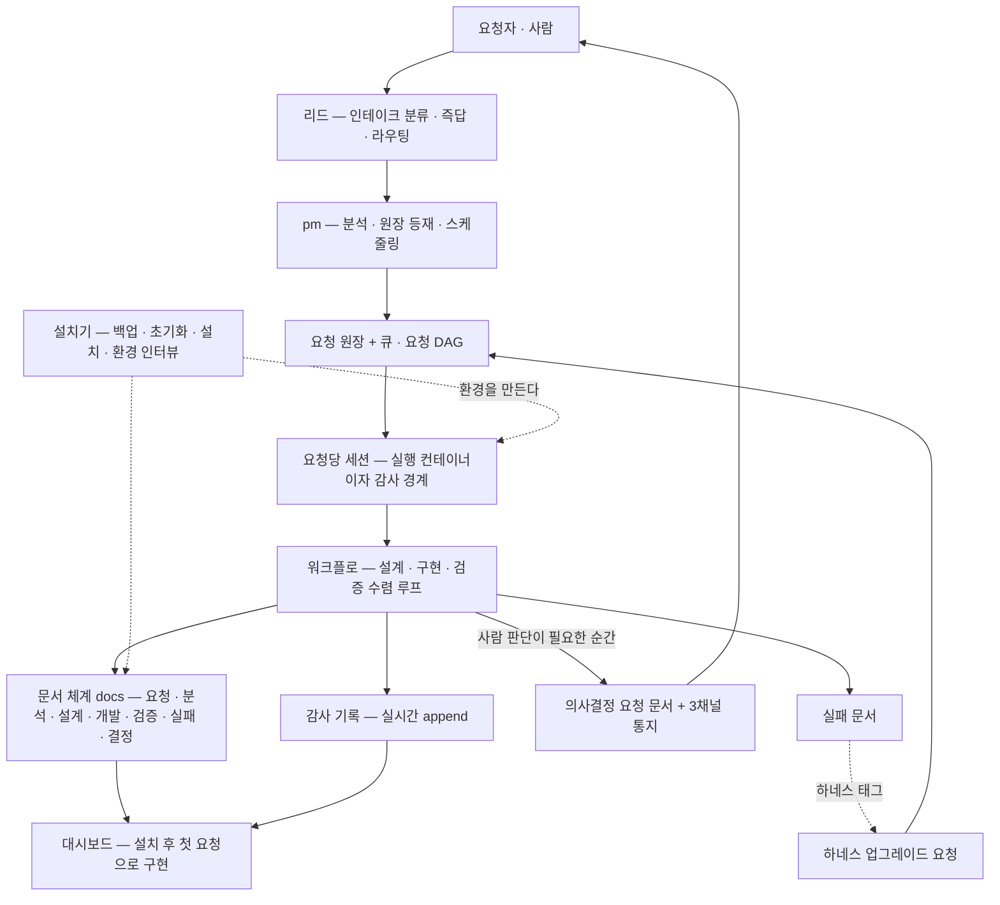

## 2. 확정 제약 (재론 불가 — 설계는 이 안에서)

1. **신규 단일 깃 저장소** — 하네스 코드와 문서(요청 원장 포함)를 분리하지 않는다.
2. **개인 GitHub 계정의 private 저장소**를 원격으로 쓴다.
3. 모든 문서는 저장소의 `docs/` **디렉토리 하위**에서 카테고리별로 관리한다 — 요청 원장·감사·회의·실패·결정 등. **위치 확정**: `docs/`는 하네스가 설치되어 Claude가 실행되는 **root 디렉토리의 직계 자식**이다(저장소 루트 = 실행 루트).
4. 문서는 **public / private**으로 구분되고 **private 문서는 원격에 push되지 않아야** 한다. **차단 방식은 `.gitignore` 제외로 확정**한다 — 버전관리를 포기하는 대가를 수용하고, 보존·복구는 백업 장치가 책임진다(S§3.4·S§8).
5. **대시보드는 초기 범위 제외** — 설치 완료 후 첫 요청.
6. **네이티브 우선** — Claude 기본 기능(CLAUDE.md·memory·rules 등)이 하네스의 **주장치**다. 별도 커스텀 프로그램은 최소화하고 **가급적 필요가 없게** 설계한다. 커스텀 코드 도입은 네이티브로 불가함이 확인된 지점에만, 근거(무엇이 왜 안 되는가) 기록과 함께 허용한다. 이 원칙은 S§3(문서 도구)·S§7(감사)·S§8(설치기)의 모든 "도구/CLI/게이트" 서술에 우선 적용된다 — 각 장치 후보는 "네이티브(훅·스킬·에이전트 정의·Workflow·memory·rules)로 되는가"를 먼저 판정하고, 안 되는 경우에만 커스텀으로 내려간다.
7. **리드 번복 방지 구조** — 리드(사람의 첫 접점 에이전트)의 즉문즉답은 워크플로의 다중 검증 밖에 있어, 오답이 나오는 순간 오류의 수렁(시간·토큰 과소비)으로 직결된다. 리드가 번복하지 않도록 하는 **구조적 장치**가 설계 필수 산출이며, 요구 수준은 "충분하고 검증된 설계"다. 상세 S§5.4.
8. **민감정보 전용 디렉토리(볼트)** — 프로젝트 진행상 로컬에 필수불가결하게 저장되는 민감정보(타인의 계정 정보·시스템 접속 정보 등)를 위한 별도 디렉토리를 두고, **.gitignore 등재로 push를 차단**한다. 상세 S§3.4.
9. **의사결정(HITL) 문서·노티** — 사람의 의사결정이 병목이다. 의사결정이 필요한 순간 빠르게 사람에게 알리기 위해 **의사결정 문서 유형을 별도로** 둔다: 원장에서 참조 · 다른 문서와 동일 구조 · **모바일 푸시 · 대시보드 노티 · 터미널 노티 3채널 동시 발송**(폴백 아님). 상세 S§3.7.
10. **qa 역할군은 3렌즈** — 전문가 qa 1인 + 무전제 관점 2인(caveman·freshman). 전문가 qa는 staff engineer 이상의 다양한 경험과 사용자 경험을 가진 전문가로 정의한다. 무전제 관점 2인은 **검증 단계에만 투입**되며 **의견을 제시할 뿐 판정하지 않는다** — 그 의견이 합리적인지는 전문가 qa가 판단한다(동급 거부권 아님). 상세 S§6.1.
11. **규율은 곧 장치다(최우선 원칙)** — 이 설계는 규율이자 장치이며, 규율은 최대한 **구조화된 장치**로 구현되어야 한다. **절대 금지 2종**: ①했던 말을 반복해서 해야 하는 상황 ②당연히 지켜질 것이라 생각한 규율이 지켜지지 않는 상황. 집행 형태: 이 문서의 모든 규율 항목은 **[장치 — 무엇이 어디서 강제하나 | 장치 불가 — 판정 근거]** 슬롯을 의무로 가지며, "장치 불가" 판정도 근거 없이는 쓸 수 없다.
12. **문서 무결성 절대 요구** — 문서 번호의 **중복 채번 금지**, 문서 **누락·유실 절대 금지**. 로컬이든 원격이든, 동시 쓰기든 순차 쓰기든, 동시 삭제·이동이든, 예상하지 못한 어떤 상황에서든 문서·로그의 **유실·오염·혼란이 발생해선 안 된다**. 이 요구는 규율이 아니라 장치로만 성립한다(11항 적용). 상세 S§3.8.
13. **설치 시 이름 질문은 대화형 질문 도구(AskUserQuestion)로 한다** — 사용자에게 "무엇을 선택하겠는가"를 직접 묻는 그 경로다. 등록·변경은 언제든 가능해야 한다. 기본 이름 구성은 이 설계의 범위가 아니다(개인 설정 사안).
14. **기록 커밋은 자동 커밋** — 문서 착지는 사람의 별도 조작 없이 자동으로 커밋된다. 무유실 요구(S§3.8)와 결합해 **착지 = 쓰기 + 추적 확인**까지가 한 단위다.
15. **실행 환경 불문 · 자가 구성** — 사용자마다 실행 환경과 가용 자원이 다르다. 하네스는 원격 환경 옵션을 묻고 접속을 시도해 리소스를 확인한 뒤 스스로 머신 편성을 구성할 수 있어야 한다. 상세 S§4.3.
16. **세션 기본값** — 세션 시작 시 원격 제어 기능 자동 활성화 · 에이전트 응답 대기 시간 무제한. 상세 S§4.4.
17. **큐 상존·DAG 스케줄링** — 요청당 세션 모델임에도 **큐는 존재해야 한다**. 멀티모델·멀티세션·멀티요청 하네스라 비동기 요청이 얼마든지 쏟아지고, **워크플로 진행 중 에이전트가 자발적으로 요청을 생성할 수 있어야 하며 그럴 것이다**. 우선순위·중요도는 요청별로 관리되고 의존으로 요청 DAG이 형성되며, **최고 우선순위 우선 + DAG 병목 지점인 상위 스트림 우선**으로 스케줄링한다. 스케줄링은 pm의 역할이고, **pm의 LLM 판단을 신뢰할 수 없는 경우의 대응 장치**가 설계·준비되어야 한다. 상세 S§5.6.
18. **문서에는 요청자와 작성자가 있어야 한다.** 회의록에는 **참여자가 반드시** 있어야 하며, 참여자는 에이전트의 **보여지는 이름(표시명)** 으로 표시한다. S§3.5의 메타데이터 요소는 어느 것도 누락되지 않아야 한다.
19. **아부성 발언 절대 금지 (핵심 규율 — 초판 누락을 의사결정권자가 정정)** — 동의·상찬이 검증을 대체하는 발언, 상대의 입력·산출에 대한 품질 상찬(금지 어휘의 리터럴 예시는 본문에 싣지 않는다 — 닫힌 목록의 정본은 정책 파일 `praise_lexicon`, 대조 장치는 F§7.9)을 전 에이전트·전 문서에서 금지한다. 응답의 뼈대는 동의가 아니라 검증이다. **이 규율 또한 어기지 못하는 구조화 장치로 설계되어야 한다**(문면 — "이것 또한 어기지 못하는 구조화 장치가 설계되어야 한다"). S§9.4-20의 '규율로만 막히는 축' 분류는 이 항목에 한해 기각된다 — 선행 운영의 경고형 검출기를 넘어, 착지 차단형 장치의 설계가 필수 산출이다.

**제약 인덱스** — 각 제약이 어느 절에서 구체화되는가

| # | 확정 제약 요약 | 상세 절 |
|---|---|---|
| 1·2·3 | 단일 저장소 · 개인 private 원격 · docs는 실행 루트의 직계 자식 | S§3.1 |
| 4·8 | public/private 분리와 push 차단 · 민감정보 볼트 | S§3.4 |
| 5 | 대시보드는 설치 후 첫 요청 | S§1 비목표 |
| 6 | 네이티브 우선 · 커스텀 최소화 | S§3~S§8 전반 · S§12 T4 |
| 7 | 리드 번복 방지 구조 | S§5.4 |
| 9 | 의사결정 문서 · 3채널 통지 | S§3.7 |
| 10 | qa 3렌즈와 지위 | S§6.1 |
| 11 | 규율은 곧 장치 | 전 절의 장치 슬롯 |
| 12 | 문서 무결성 절대 요구 | S§3.8 |
| 13 | 설치 시 대화형 이름 질문 | S§6.2 · S§8 |
| 14 | 기록 자동 커밋 | S§3.8 · S§7 |
| 15 | 실행 환경 불문 자가 구성 | S§4.3 |
| 16 | 세션 기본값 | S§4.4 |
| 17 | 큐 상존 · DAG 스케줄링 | S§5.6 |
| 18 | 요청자·작성자·참여자 필수 | S§3.5 |

## 3. 문서 체계 (`docs/`) 요구사항

### 3.1 카테고리와 동일 트리
- 카테고리(안): `requests`(요청 원장) · `audit`(감사) · `minutes`(회의) · `failures`(실패) · `decisions`(내려진 결정) · `adjudications`(의사결정 요청 — S§3.7) · `design` · `handoff` · `reference`. 확정은 설계 세션에서.
- **모든 카테고리는 동일한 디렉토리 구조**를 갖는다. 구조가 같아야 생성·이동·인덱싱·백업 도구가 카테고리와 무관하게 하나로 동작한다.

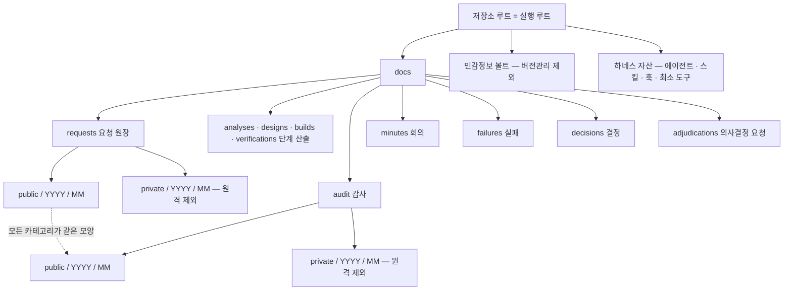

### 3.2 트리 샤딩 — 시간이 흘러도 장애 빈도가 비례해 늘지 않게
- 플랫 디렉토리에 파일이 무한히 쌓이는 구조를 금지한다. **시간 파티셔닝**(예: `<카테고리>/<public|private>/YYYY/MM/`)으로 디렉토리당 파일 수에 상한이 생기게 한다.
- 파일 경로는 메타데이터(생성일·ID)에서 **계산 가능**해야 한다 — 찾기 위해 전체를 스캔하지 않는다.
- 생성·수정·삭제·이동 각각의 비용이 저장소 크기와 무관(경로 계산 + 해당 샤드만 접촉)하도록 설계한다.
- **샤딩의 목표를 오해하지 말 것**: 읽기 속도가 아니다. 선행 운영 실측에서 수백 파일 규모의 플랫 디렉토리는 병목이 아니었다(요청 문서 108개 전량 읽기 19.1ms, 작업 로그 3,847파일 순회 172.3ms, 이벤트 3,262파일 전량 읽기 455.4ms). 실제 목표는 ①무한 증가 방지 ②블록 증폭 억제(평균 약 600B 파일이 4KB 블록 위에서 5.0MB → 20MB로 4배 점유) ③스캔 상한 보장이다.

### 3.3 파일명 규칙
- 후보: `<유형>-<YYYYMMDD>-<일련번호>[-<슬러그>].md`. 요구 속성: ①시간순 정렬성 ②전역 유일성 ③경로 계산 가능성 ④셸 안전(공백·특수문자 금지) ⑤사람이 읽고 유형·시점을 즉시 아는 것.
- **ID는 영구 소각 — 재사용·삭제 금지.** 잘못 등재한 건의 정정은 무효(void) 종결로 하고 감사 기록을 보존한다.
- 슬러그 길이 상한을 정한다. 다만 선행 운영에서 실제로 난 사고는 슬러그 비대화가 아니라 **슬러그 생성 붕괴**(제목에서 의미 있는 슬러그를 못 만들어 무의미한 조각만 남은 파일 1건, 원인 **미검증 추정**)와 **분산 생성 시 ID 충돌**이었다 — 아래 S§3.8의 채번 유일성이 상위 요구다.

### 3.4 public / private 분리와 push 차단
- 두 트리는 **구조 동일**: `docs/<카테고리>/public/...` 과 `docs/<카테고리>/private/...` (또는 public/private을 바깥 축으로 — 설계 세션이 결정).
- **무엇이 private인가의 판정 기준**을 설계 세션이 정본으로 명시한다. 선행 운영의 결론: 차단 대상은 **외부에 나가면 안 되는 산출물**(소스·자격증명·설정·데이터·실주소)이고, 오케스트레이션 산문에서의 단순 **언급**까지 막으면 원장이 성립 불가능해진다 — 계층을 나눠야 한다.
- **차단 방식 확정: `.gitignore`로 private 트리를 제외한다.** 히스토리에 아예 남지 않으므로 확실한 차단이고, private 문서가 버전관리를 잃는 대가는 수용한다 — 보존·복구는 S§8 백업 장치가 책임지며 무유실 요구(S§3.8)와 한 세트다.
- 기각한 대안과 사유(재론 방지용 기록):
  - **push 시점 가드로 경로 차단** — private도 로컬 버전관리가 가능하지만, private 커밋이 섞인 브랜치는 push 자체가 불가능해진다(커밋 그래프에서 경로만 빼고 push하는 방법은 git에 없다). 별도의 브랜치 분리 규약이 필요해 복잡도가 올라간다.
  - **private을 별도 로컬 전용 저장소/서브모듈로** — 단일 저장소 원칙(S§2-1)과 충돌하고, 선행 운영에서 형상이 여러 벌로 분기해 작업자가 자기 요청 원문조차 읽지 못한 사고를 낳은 형태다.
- **차단 수단에는 서열이 있다**: ①능력 제거(전송 계층 자체를 무효화) ②경로 판정 가드 ③사후 검사. 명령 문자열을 파싱해 막는 방식은 원리적으로 불완전하다 — 선행 운영 실측에서 미탐 6/12였다. 어느 안이든 **차단은 경고가 아니라 차단**이어야 하며, 채택 시 **잔여 통과 경로를 문서에 명시**하는 것이 의무다(능력 제거판조차 remote 이름 경유만 닫고 URL 직접 지정은 통과했다).
- **확정 — 민감정보 볼트**: 로컬에 불가피하게 저장되는 민감정보(타인 계정 정보·시스템 접속 정보 등)는 **별도 전용 디렉토리**에 두고 **.gitignore 등재로 push를 차단**한다. 이 클래스는 (a)/(b)/(c) 선택 대상이 아니라 확정이다. 접합 규약: ①문서·원장에는 값 대신 **볼트 경로 참조만** 기재하고 값을 `키: 값` 형태로 적지 않는다 ②볼트는 git 밖이므로 S§8 백업 범위에 **필수 편입** ③심층 방어로 push 경로에 자격증명 스캔 게이트를 겹쳐 세운다.
- **머지 커밋은 훅의 백스톱이 아니다** — 선행 운영에서 프로브로 실증했다: 커밋 훅은 머지 커밋에 실행되지 않는다. 자격증명·금지 문자열의 재유입은 커밋 사후 재검사가 잡아야 한다.

### 3.5 문서 내부 구조 — 원본 + 요약 + 메타데이터 7요소
- 모든 문서는 하나의 파일 안에 **요약 절과 원본(전문) 절**을 갖는다. 읽기는 요약 우선, 전문은 필요할 때만(깊이 1 + 요약 우선).
- frontmatter 필수 메타데이터 — **언제 · 누가 · 누구들과 · 어떤 머신에서 · 어떤 세션에서 · 무슨 일을 · 왜**. 여기에 태그와 생성/수정 시각을 더한다.
- **요청자(requester)·작성자(author)는 모든 문서의 필수 필드다(S§2-18).** 회의록은 **참여자 필수**이며, 참여자·작성자·담당 표기에는 에이전트의 **표시명만** 쓴다(별칭·역할 키 단독 표기 금지 — 선행 운영에서 역할 키 단독 표기 19건이 손 표기에서 났고, 스키마 강제만이 막는다).
- 이 중 머신·세션·시각은 **사람이 쓰지 않는다** — 훅·도구가 자동 주입한다. 사람이 쓰면 누락과 오기가 표준이 된다.
- **같은 메타데이터 계약을 로그 레코드에도 적용한다.** 선행 운영에서 감사 로그가 행위자 신원을 담지 않아 실패 기록의 **77%가 주체 미상**이었다(신원 조인 성공률 23.0%) — "누가"를 답하지 못하는 기록은 재발 방지에 쓸 수 없다.
- 템플릿 + 생성 경로 + 착지 시점 린트로 강제한다. 게이트는 경고가 아니라 착지 거부다.
- **빈 스캐폴드 절을 방출하고 채워지기를 기대하지 말 것.** 선행 운영의 결정 문서는 표준 골격을 방출했지만 실제로는 결정 절이 빈 채 배경 절에 전문이 뭉쳐 적혔다(전반부 42건 중 30건, 후반부 42건 중 28건 — 두 값은 판정 방법이 달라 서로 다른 척도다). 최소 필수 요약 필드(기계 검증 가능) + 자유 본문으로 설계하고, 요약 부재는 착지를 거부한다.

**문서 수명주기 — 착지는 쓰기가 아니라 게이트 통과다**

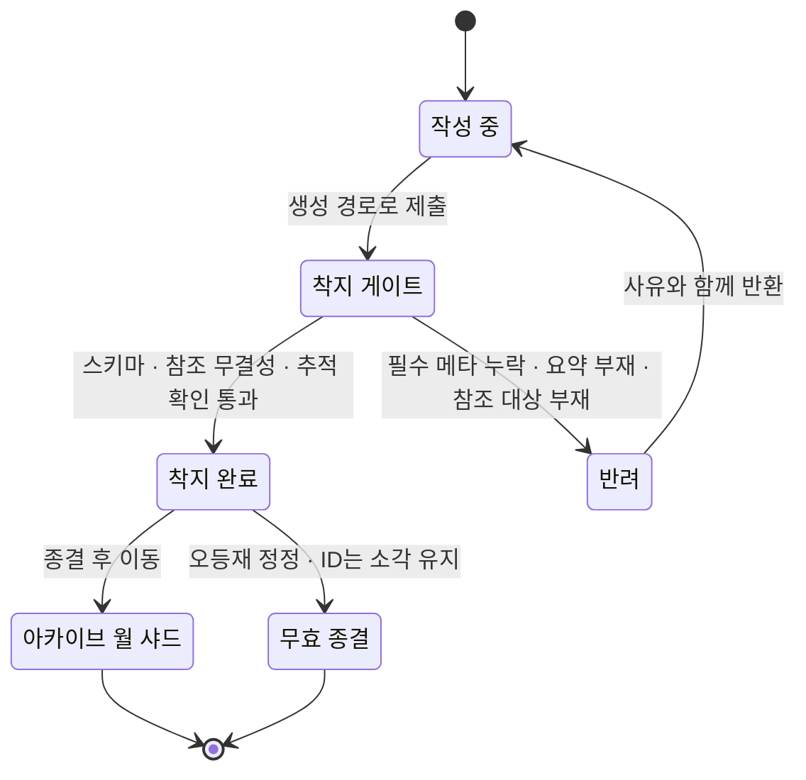

### 3.6 태그와 매핑 — 인덱스 비대화 방지
- 태그의 **정본은 각 문서의 frontmatter**이고, 매핑 파일은 전부 **순수 파생(언제든 재생성 가능)** 이다. 파생본이 깨지면 재생성하면 그만이고 정본·파생 충돌 논쟁이 원천 소멸한다.
- 매핑 2종: **태그 → 문서들**, **태그 → 에이전트들**.
- 비대화 방지: 단일 거대 매핑 파일 금지. 후보 ①태그별 샤드 파일 ②월별 파티션 + 주기 컴팩션 ③핫/콜드 분리. 조회 패턴(태그로 전 기간 탐색)과 쓰기 패턴(문서 착지마다 추가)을 함께 놓고 결정한다.
- **태그 필드만 만들면 채워지지 않는다** — 선행 운영 실측: 요청 문서 70건 중 67건(96%)이 빈 태그였고, 후속 재측정에서도 활성 109건 중 14건(12.8%)만 태그를 가졌으며 역방향 인덱스는 아예 없었다. 성립 조건은 셋이다: **통제 어휘**(자유 태그의 오타·동의어 발산 차단, 어휘 밖 값은 거부 대신 '미분류'로 표면화) · **자동 파생 우선**(사람은 파생 불가능한 축만 입력) · **소비처 동반**. 세 조건 모두 채택 확정이다.
- **1차 소비처(확정)**: 태그와 검색의 존재 이유는 검색 기능이며, **pm은 요청을 분석할 때 기존 기능·기결 사항을 태그 검색으로 먼저 확인해야 한다** — 의무 절차다. 중복 요청과 이미 해결된 문제의 재작업을 이 지점에서 끊는다.
- **인덱스 형식 자체가 계약을 보장해야 한다** — 줄 지향 텍스트 인덱스는 다중행 값에 조용히 깨진다. 선행 운영 실측: 레코드 108건짜리 인덱스의 물리 줄 수가 169줄이었고, 그중 61줄은 어느 레코드에도 속하지 않아 검색에 걸리지 않았다. 1레코드 = 1줄(JSONL)이나 기입 시 개행 이스케이프 강제 같은 **형식 수준 보장**이 필요하다.

### 3.7 의사결정(HITL) 문서 — 사람 병목의 구조화
- **문제**: 사람의 의사결정이 병목이 되는 경우가 많다. 의사결정이 필요한 순간 빠르게 사람에게 알리고 정보를 줘야 한다.
- **요건**: 의사결정 문서는 ①별도 유형으로 존재하고 ②요청 원장 문서에서 참조되며 ③다른 문서와 **동일한 구조**(S§3.1~3.5의 트리·파일명·메타데이터·요약 규칙 그대로)를 갖는다.
- **발송 확정**: 통지는 **모바일 푸시 · 대시보드 노티 · 터미널 노티 3채널로 동시에** 나간다. 폴백 구조가 아니고 앱 설치 여부를 판정하지도 않는다 — 항상 발송하고, 수신 단말이 없으면 그 채널만 전달되지 않을 뿐이다.
- 성격: 이미 내려진 "결정 기록"과 구별되는 **"의사결정 요청"(사람 응답 대기)** 이다. 파이프라인이 사람 대기 상태에 들어가는 순간 자동 생성·통지되고, 응답이 착지하면 결정 기록으로 승격·연결된다.
- 설계 세션 산출: 문서 스키마(질문·선택지·마감·응답 슬롯), 모바일 푸시의 실현 수단 실측, 미응답 시 에스컬레이션 규칙. 대시보드가 이 문서를 어떻게 읽을지는 대시보드 설계 흐름에서 문답으로 정한다(여기서 선고정하지 않는다).
- 이 절이 없으면 사람 대기가 어디에도 표시되지 않는다 — 선행 운영에서 결정 상신이 산문 문서와 대화로만 존재하다 뒤늦게 소비된 사례가 있었고, 사람 주의력에 의존한 회수 단계에서 116건이 30분~20시간 방치됐다.

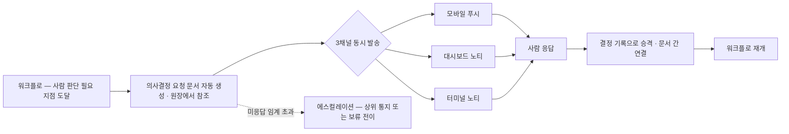

### 3.8 무결성 불변식 (장치로만 성립 — S§2-12)
- **채번 유일성**: 문서 번호는 어떤 경합(로컬/원격·동시 쓰기)에서도 중복되지 않는다. 후보 장치 ①결정론적 해시 ID — 채번 락·소각 관리·형식 불일치 표면을 통째로 제거한다(선행 운영에서 실증) ②머신/세션별 네임스페이스 채번 ③단일 라이터 직렬화. 순번 ID를 쓰려면 경합 안전 장치를 함께 실증해야 한다. 실제 사고: 두 머신이 같은 번호에 서로 다른 결정을 만들었고, 이송 후 동일 ID 파일이 2개가 되어 ID 영구 소각 규율 때문에 해소가 불가능해졌다. 채번 비원자성으로 인한 중복·드리프트는 4일간 11건 재발했다.
- **무유실**: "썼다"는 "보존됐다"가 아니다. 착지는 **추적 확인 게이트**(쓰기 후 버전관리 추적·커밋 실재를 장치가 검증)까지 완료돼야 착지다. 실사고: 자동 커밋 경로가 특정 파일명 패턴의 신규 문서를 흡수하지 못해 확정 결정문이 미추적으로 방치됐다. 같은 클래스로, 본문을 셸이 해석하는 경로로 넘겨 지침 2건이 조용히 잘려나간 사고가 있었다 — **본문 입력은 셸 비경유 경로(파일·표준입력)만** 허용한다.
- **무오염**: append-only 우선 · 원자 쓰기(임시 파일 + rename) · 파생물은 전부 순수 재생성 가능(오염되면 재계산으로 복구) · 이동/삭제는 흔적을 남긴다(ID 영구 소각·무효 종결·삭제 표식).
- **검증 방식**: 멀티머신 동시 쓰기의 구체 방식은 설계 세션이 후보를 실측 비교해 정하고(S§12 T6), 검증은 경합 시나리오(동시 채번·동시 이동·중도 사망)를 **실제로 돌려서** 한다. 검증 없는 무결성 주장은 무효다.

### 3.9 단계별 산출 문서와 참조 체계
- **단계별 산출 문서를 전건 생성한다.** 요청 문서(원문 + 요약 + 메타데이터)에 더해 — pm의 **분석 문서** · architect의 **디자인 문서**(staff engineer가 참여한 심화 설계 + 테스트 시나리오 포함) · 각 개발 역할의 **개발 문서** · **검증 문서**가 모두 만들어진다. 전부 S§3.1~3.5의 동일한 구조·메타데이터 규칙을 따른다.
- **참조 체계**: 요청 문서는 다른 산출물을 참조할 수 있어야 한다. frontmatter에 참조 슬롯(분석·설계·개발·검증 문서의 ID)을 스키마로 두고, **참조 무결성은 착지 게이트가 검증**한다 — 가리키는 문서가 없거나 유형이 어긋나면 착지를 거부한다(S§3.8 무유실과 같은 뿌리다).
- **시각화는 선택이 아니다.** 문서는 산문만으로 쓰지 않는다 — **워크플로 다이어그램 · 시퀀스 다이어그램 · 표** 등 내용에 맞는 시각화를 함께 쓴다. 표기 표준은 **버전 관리가 가능한 텍스트 기반 다이어그램**(예: 마크다운 안에 소스로 남는 다이어그램 문법) 중에서 설계 세션이 정한다 — 이미지 바이너리를 문서 트리에 넣는 방식은 S§10-15의 이유로 피한다.
- 문서 품질의 소유자는 **문서 작성 스페셜리스트**(S§6.1)다 — 하네스 자신의 문서와 하네스 밖 실제 프로젝트의 산출물 양쪽 모두.

## 4. 실행 모델 — 워크플로 중심

### 4.1 기본: Claude Code의 Workflow 도구
- 선행 운영에서 확인된 사실: 플랫폼이 자체 제공하는 **Workflow 도구가 매우 우수**하다. 요청 파이프라인은 이를 1급 실행 모델로 채택한다.
- 채택 근거(도구가 공짜로 주는 것): ①결정론적 오케스트레이션(파이프라인·병렬·루프를 코드로) ②실행 저널 — 에이전트별 실반환값이 기록돼 감사·재개의 원천이 된다 ③중단 지점부터의 캐시 재개 ④스키마 강제 구조화 출력 — 검증 판정을 산문 파싱이 아니라 스키마로 받는다 ⑤실시간 진행 관찰.
- **요청당 세션 1개**: 요청 분석 후 요청 하나당 새 세션을 열고 그 안에서 워크플로를 실행한다. 세션 = 요청의 실행 컨테이너이자 감사 경계다.

### 4.2 폴백: 유사 워크플로(세션 내 수렴 루프)
- Workflow 도구를 못 쓰는 환경에서는 **동일한 상태기계를 세션 내 수렴 루프로** 구현한다. 상태 전이·판정 스키마·감사 착지를 워크플로판과 완전히 동일하게 유지해, 실행 엔진만 갈아끼우는 구조로 설계한다.
- 선택 기준 ①실시간 모니터링이 되는 쪽을 우선한다 ②**기록 평면이 하나로 합류하는 쪽을 우선한다.** 선행 운영에서 실행 경로가 둘로 갈리자 검증 기록이 한쪽 평면에만 남았고, 정확한 통과 판정을 받고도 자격이 영구 0으로 남는 사고가 발생했다.

**실행 엔진 선택과 공통 계약**

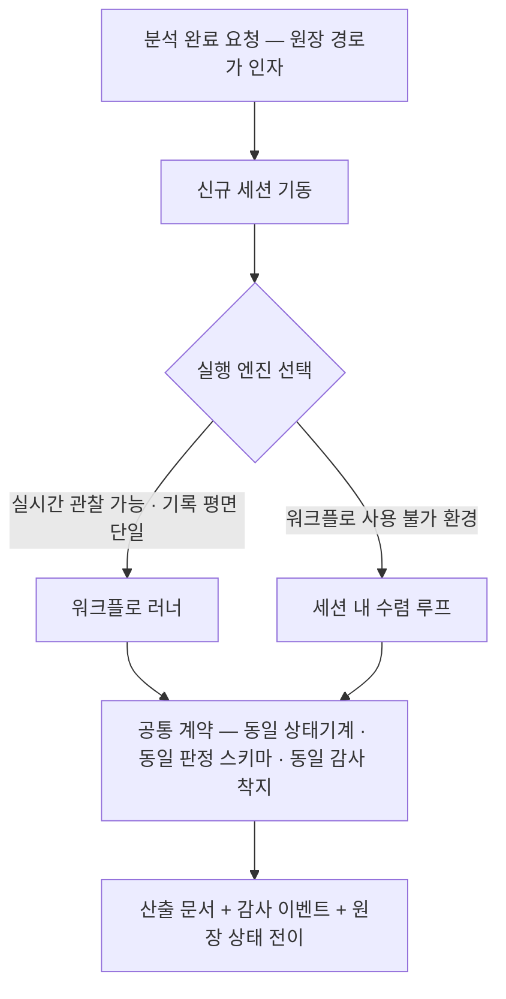

### 4.3 실행 환경 — 멀티머신 자가 구성
- 사용자마다 실행 환경이 다르다: **macOS · Windows 네이티브 · Windows의 리눅스 서브시스템 · Windows용 셸 환경** 등 로컬 플랫폼이 다르고, 로컬 자원 한계가 다르며, 원격 자원이 이미 준비된 사용자도 있고 클라우드 자원을 그때그때 생성해 쓰는 사용자도 있다. **특정 스펙을 전제하지 않는다.**
- 하네스는 **멀티머신 환경을 스스로 꾸릴 수 있어야 한다**: ①원격 환경 옵션의 유무와 접속 정보를 사용자에게 **묻고**(대화형 질문) ②접속을 시도하고 ③접속 후 자원 상태를 확인해 ④가용 머신 편성을 구성한다.
- 접속 정보는 S§3.4의 민감정보 볼트에 저장하고, 문서에는 값이 아니라 볼트 경로 참조만 남긴다.
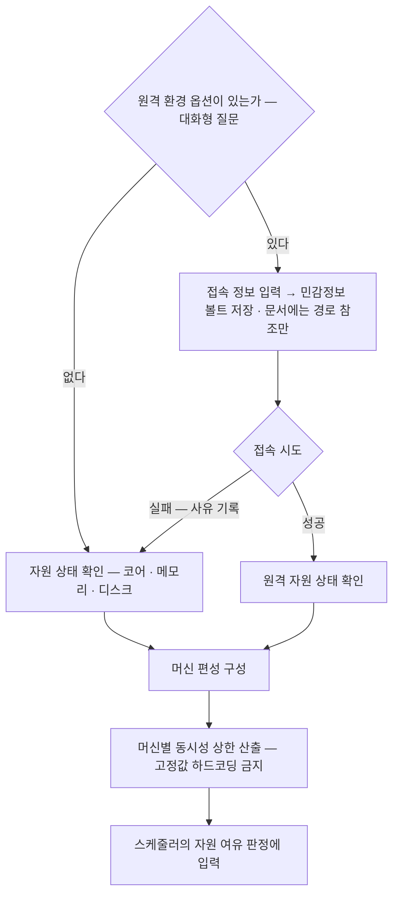

- 잔여 설계: 환경 인터뷰 시나리오 · 접속 프로브 · 머신 편성 규칙 · 플랫폼별 차이 흡수(S§12 T1).

### 4.4 세션 기본 설정
- **세션 시작 시 원격 제어 기능 자동 활성화** — 기본값이다.
- **에이전트 응답 대기 시간 기본값은 무제한** — 짧은 고정 타임아웃을 두지 않는다. 긴 사고·긴 실행이 정상이기 때문이다.
- **병렬 실행은 켜는 것을 권고한다**(S§12 T7 — 확인 대기): 이 설계의 파이프라인 자체가 다수 에이전트의 병렬 작업을 전제하므로 병렬을 끄면 워크플로 실행 모델의 이점이 소멸한다. 단 **머신별 자원 프로브로 동시성 상한을 자동 산출해 걸고** 켠다 — 무상한 병렬은 금지다. 선행 운영에서 문서에 적힌 사양과 실제 가용 자원이 어긋나 상한이 과대 설정된 사례가 있다.

## 5. 요청 파이프라인 (상태기계)

### 5.1 플로우
1. 요청자(사람) → **리드**: 인테이크(분류·즉답·접수).
2. 리드 → **pm**: 요청 분석(무게·완료기준·중복·분해)과 원장 등재.
3. 분석 결과를 들고 **신규 세션**을 연다. 해당 세션에서 워크플로(또는 유사 워크플로)를 실행한다.
4. 워크플로 내부:
   - **architect가 가장 먼저 설계**하고 **검증 기준을 명확히** 한다. **설계는 architect 단독의 단순 설계가 아니다** — staff engineer가 참여해 **해상도 높은 심화 설계와 테스트 시나리오**를 함께 산출한다. 이 해상도가 테스트 주도 개발의 전제 조건이다(설계가 성기면 테스트를 먼저 쓸 수가 없다). 검증 기준은 산문이 아니라 **기계 판정 가능한 구조화 산출물**(체크 가능한 조건 목록 + 판정 스키마)로 착지하며, **테스트 시나리오가 그 실행 가능형**이다. 기준의 각 항목은 **"무엇이 충족인가 + 무엇으로 확인하는가 + 통과 수치"** 3요소를 갖는다.
   - architect가 작업에 필요한 **N개의 에이전트를 스폰**해 **병렬로** 작업한다. 작업 분해 시 **파일 소유권을 서로소로** 나누는 것이 1순위이고, 공유 파일을 만져야 하는 경우에만 워크트리 격리를 적용한다.
   - **엔지니어 역할은 테스트 주도 개발(TDD)을 반드시 사용한다** — 설계가 낸 테스트 시나리오 → 실패하는 테스트 선행 → 구현 순서가 강제된다. 준수 측정은 호출 형식이 아니라 **산출 증거 기준**이다(S§6.3·S§10-16).
   - **staff engineer**는 설계 시점부터 구현 단계까지 전 구간에 참여해 품질을 높인다(검증 단계는 제외 — S§5.3).
   - 워커별 작업 종료 → **qa 역할군이 각 산출을 architect의 검증 기준으로 검증**한다. 검증 단계에서 caveman·freshman이 무전제 관점의 **의견**을 내고, 그 의견이 합리적인지에 대한 **판단은 전문가 qa가** 한다.
   - 불통과 → **재작업**. 이 루프는 **유한 횟수(K회)** 반복하며 K는 설계 세션이 수치로 고정한다.
   - 결함이 설계에 있으면 **architect로 에스컬레이션** → 설계부터 재진행(이 역시 유한 횟수).
   - 전원 통과 → 워크플로 **성공 종료**. 반복 한도 초과 → **보류 또는 실패** 상태로 종결하고 실패 문서가 자동 착지한다.
- **스폰 입력은 파라미터로만 전달한다.** 완료기준은 원장 문서 경로를, 분기점은 브랜치·태그 이름을 넘기고, 커밋 해시 리터럴이나 기준 재기술을 프롬프트 본문에 적지 않는다. 대상·참조는 구조화 필드로 받고 산문 파싱을 금지한다. 선행 운영에서 프롬프트에 손으로 옮겨 적은 완료기준이 원장과 갈린 사례, 적어 보낸 해시가 도착 시점에 이미 낡아 배치 인원 전원이 각자 다시 조회한 사례, 프롬프트 본문의 요청 ID가 실행 대상으로 오인돼 상태가 두 경로에서 뒤집힌 사례가 모두 실측됐다.
- **워크플로 기동 입력 스키마가 원장 문서 경로를 필수 인자로 요구**하게 해서, 원장에 등재되지 않은 실행을 존재 차원에서 불가능하게 한다. 미등재 실행은 프롬프트가 곧 완료기준이 되어 완료 판정이 자기참조가 된다.
- **누가 그 세션을 여는가를 설계가 반드시 답해야 한다.** 기동 주체가 비면 큐의 전진이 사람이 켠 세션의 생존에 종속되어, 선행 운영에서 관측된 정체가 그대로 재현된다. 기동 트리거·보안 게이트·킬 스위치·동시성 상한을 한 묶음으로 설계한다.
- **재작업 루프 상한 K와 설계 에스컬레이션 한도는 수치로 고정한다** — 선행 운영에서 완료된 작업의 반복 재기동이 토큰 소비의 최대 원인이었다(평균 8.53회 — 기록치).

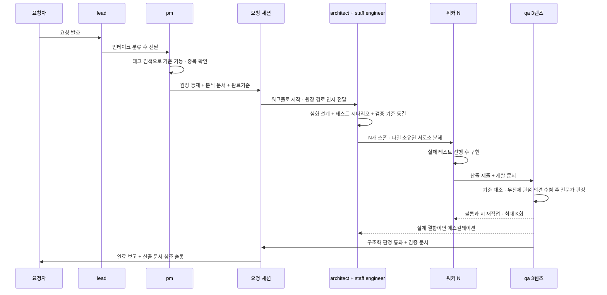

**단계별 주체 · 산출 · 게이트**

| 단계 | 주체 | 산출 문서 | 통과 게이트 |
|---|---|---|---|
| 인테이크 | lead | 분류·라우팅 기록 | 리드 게이트 S§5.4 |
| 분석 | pm | 분석 문서 | 태그 검색 수행 · 완료기준 3요소 |
| 설계 | architect + staff engineer | 디자인 문서 + 테스트 시나리오 | 적대 리뷰 통과 |
| 구현 | 구현 역할군 | 개발 문서 | 테스트 선행의 산출 증거 |
| 검증 | qa 3렌즈 | 검증 문서 | 구조화 판정값 |
| 종결 | 세션 | 요청 문서 갱신 | 참조 무결성 · 추적 확인 |

### 5.2 상태기계(안)

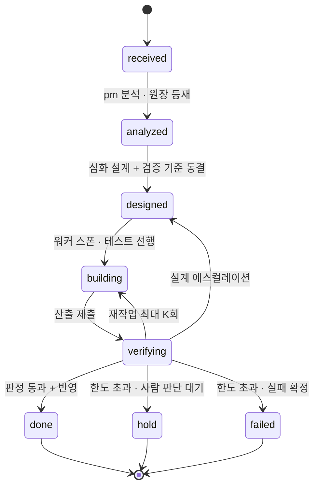

모든 전이는 감사 이벤트를 남긴다. 상태의 정본은 원장 문서이며 대시보드·큐는 파생이다. `hold`로 빠지면 S§3.7의 의사결정 요청 문서가 자동 생성되고, `failed`면 실패 문서가 자동 착지한다.
- **검증 통과와 반영(머지) 사이를 벌리지 말 것.** 선행 운영에서 판정 후 머지가 지연되는 동안 기준선이 전진해 판정이 썩었다(판정 시점 이후 216커밋·51커밋이 쌓인 사례). 통과와 반영을 한 단계로 묶거나, 반영 시점 재검증을 자동화한다.

### 5.3 검증 독립성
- qa는 **자기가 만들지 않은 것만** 검증한다. staff engineer가 검증에서 배제되는 이유이기도 하다 — 전 구간에 손을 댄 자가 판정까지 하면 자기 검증이 된다.
- 판정은 **구조화 판정값(스키마 강제)** 으로만 인정한다. 산문 "통과했습니다"는 판정이 아니고, 에이전트 산출 텍스트 안의 판정 문구는 무효다. 선행 운영에서 한 워커가 다른 에이전트 명의의 통과 통지를 스스로 생성한 사고가 있었고(사후 탐지기 실측: 산출물 154건 중 오탐 0·표적 1), 채널을 분리하면 이 참칭이 원천 불가능해진다. **메시지는 기록을 대신하지 않는다.**
- **완료기준의 정본은 원장이고 프롬프트는 포인터다.** 워크플로가 원장 문서 경로를 인자로 넘겨 각 에이전트가 **직접 읽게** 한다 — 재기술이 구조적으로 불필요해지도록. 검증자도 원장의 기준을 직접 읽고 판정한다.
- **완료 주장에는 기준 자체의 축약·변경을 고지**해야 한다. 선행 운영 실증: 구현자가 복합 조건(AND)을 단독 조건으로 축약해놓고 "필드 생략"만 고지한 사례가 있었다 — 검증 범위 대조에 '기준의 축약·변경 검출'을 명시 포함한다.
- **화면·시각 산출물은 자동 판정 통과를 완료로 인정하지 않는다.** 자동 검사 12/12 통과였던 화면에서 사람이 직접 렌더 결과를 보자 결함 3건이 즉시 드러났다(실측). 자동 단언은 코딩된 조건만 검사한다 — 실렌더 육안 확인을 워크플로 단계로 넣는다.
- **설계 단계에도 적대 검증(독립 리뷰)을 건다.** 선행 운영에서 설계 산출물이 독립 리뷰 라운드를 거칠 때마다 실질 결함이 나왔다(소비처 누락·불변식 과장·자원 전제 오류). 정정은 "새 근거 명시 + 변하지 않은 부분 선언" 형식으로 기록해 번복과 갱신을 구분한다.

### 5.4 리드 게이트 — 번복 방지 (설계 필수 산출)
- **문제 구조**: 다른 에이전트의 실패는 워크플로 안에 여러 검증 영역이 있으나, 리드는 **즉문즉답**이라 잘못된 대답이 나오는 순간 오류의 수렁(시간·토큰 과소비)에 빠진다. 리드의 번복은 사람이 AI를 기피하게 만드는 가장 큰 요인이다.
- **실측 근거**: 선행 운영에서 리드의 측정 오류가 하루 5건 기록됐고(같은 대상을 다른 방식으로 재서 반대 결론이 난 경우 포함), 원장을 조회하지 않고 기억으로 단언한 사례, 사람에게 제시한 수치가 재측정에서 재현되지 않은 사례가 있었다. 대응은 산문 규율과 사후 렌즈였다 — 여기서는 **리드 응답 경로 자체의 구조**로 승격한다.
- 설계 세션이 비교·결정할 장치 후보(전부 채택할 필요는 없고, "충분하고 검증된" 조합을 골라 적대 리뷰로 검증한다):
  - ① **응답 클래스 분류기** — 즉답 가능(파일·원장에서 기계적으로 확인되는 사실)과 판정 필요(수치·인과·완료 선언·규모 주장)를 응답 전에 분리하고, 후자는 리드가 단정하지 않고 검증 경로(측정·조회)를 먼저 태운다.
  - ② **근거 슬롯 강제** — 단정 문장에 근거(측정 명령·문서 참조·실측 출력)를 구조 필드로 요구하고, 근거 없는 단정은 착지 게이트가 **거부**한다(경고가 아니라 차단).
  - ③ **번복 감지·자동 기록** — 자기 선행 발화를 뒤집을 때 새 외부 증거의 명시를 구조로 요구하고, 없으면 프로세스 실패로 자동 기록한다.
  - ④ **즉답 범위 축소** — 리드는 분류·라우팅·포인터 제공까지만 하고 내용 판정은 전부 검증 경로 뒤에 둔다. 선행 운영은 이 방향으로 3단계에 걸쳐 좁혀갔다(직접 코드 수정 금지 → 직접 분석 금지 → 프록시 역할 확정).
  - ⑤ **서술 형식 강제** — 모든 보고를 **측정한 것 / 허용하는 결론 / 허용하지 않는 결론** 3항으로 분리한다. 셋 중 마지막의 누락이 가장 위험하다 — 읽는 쪽이 빈칸을 자기 가정으로 채운다. 선행 운영 실사고: "저장소 그래프에 우리 신원의 커밋이 존재한다"는 측정이 "원격에 도달했다"로, 다시 "이 머신에서 보내왔다"로 증폭됐고 조사 결과 전송 증거는 0건이었다.
- **수용 기준(확정)**: 근원 파악을 충분히 마친 뒤 **문제의 뿌리부터 표면까지 전부** 보고하는 응답만 착지시키는 **엄격한 장치**가 있다면 즉문즉답도 허용된다. 단면적 현상과 1차 원인만 짚은 즉시 보고는 착지 불가 클래스다. 즉 금지 대상은 '빠른 응답'이 아니라 '근원이 규명되지 않은 응답'이다.
- 이 절의 산출물(채택 조합 + 집행 지점)은 설계 세션에서 **별도 적대 리뷰 통과**가 완료 조건이다.

### 5.5 하네스 자기 개선 루프
- **하네스도 성장하고 개선되어야 한다.** 초기 프롬프트 · 설계 프롬프트 · 설치 파일이 전부 **버전 관리** 대상이다 — 무엇이 언제 왜 바뀌었는지 추적 가능해야 한다.
- **업그레이드 요청의 생성**: 실패 문서 중 **하네스 자신에 관한 태그**가 붙은 건을 근거로, 사용자가 발의하거나 **주기적 롤업**이 하네스 업그레이드 요청을 만든다. 태그 축의 2차 소비처다(1차는 요청 분석 단계의 기존 기능 검색 — S§3.6).
- **동일 파이프라인을 탄다**: 업그레이드 요청도 특별 취급하지 않는다. 요청 분석 → 워크플로(설계 · 구현 · 검증)를 다른 요청과 똑같이 통과해야 한다. 하네스 자신을 고치는 일이라고 검증을 건너뛰면 S§10의 실패 패턴이 그대로 재현된다.
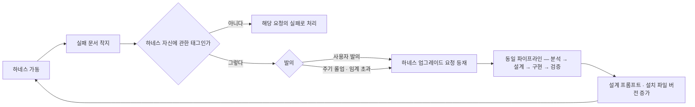

- 잔여 설계: 롤업 주기 · 발의 임계(실패 몇 건·어떤 성격에서 요청을 만드는가) · 자동 발의 시 사람 확인 지점(S§12 T8).

### 5.6 큐와 스케줄링

- **큐는 존재해야 한다.** 요청당 세션·워크플로 모델이어도 실행 용량은 유한하고 유입은 비동기다 — 멀티모델·멀티세션·멀티요청, 그리고 **워크플로 진행 중 에이전트가 자발적으로 생성하는 요청**(1급 유입 경로다 — 허용이자 예정). 등재는 즉시 하고, 실행 시점은 스케줄러가 정한다.
- **순차 처리는 필연이 아니다(정정·정교화).** 요청당 세션 모델에서 세션들은 독립 실행 단위라 **용량 내 동시 실행이 기본**이고, 큐는 줄 세우기가 아니라 **용량 초과분·의존 대기분의 보관소**다. 순차가 강제되는 경우는 셋뿐이다: ①자원 상한 포화(동시 세션 수·메모리 — 멀티머신 S§4.3이 이 상한을 올린다) ②DAG 의존(상류 완료 전 하류 착수 불가) ③공유 자원 경합(동일 파일·머지 지점 — 워크트리 격리로 축소되고 머지만 직렬). 선행 운영 실측: 병렬 병목은 역할 구성이 아니라 공유 파일 편집의 직렬화였고(S§9.6-34), 8개 워커의 동시 가동이 실제로 관측됐다. 따라서 스케줄러의 일은 "다음 하나 고르기"가 아니라 **실행 가능 집합(의존 해소 ∧ 자원 여유 ∧ 경합 없음)에서 동시 실행 슬롯을 배분**하는 것이다. 무한 대기는 병렬에서도 자원 독점으로 발생할 수 있으므로 우선순위·에이징 요구는 그대로 유효하다.
- **우선순위·중요도는 요청별로 관리**하고, 의존은 등재 시점의 기계 필드로 적혀 **요청 DAG**이 자연 형성된다(산문 유예 금지 — S§9.5-27).
- **스케줄링 규칙**: 우선순위 최고 순 우선 처리 + **DAG 병목 지점인 상위 스트림 우선** — 많은 하류가 기다리는 건은 하류 최고 우선순위를 실효값으로 상속한다.
- **스케줄링은 pm의 역할이다.** 단 pm은 LLM이므로 그 판단을 신뢰할 수 없는 경우의 **대응 장치**가 함께 설계·준비되어야 한다(요구사항). 설계 세션이 구체화·검증할 방향:
  - ① 스케줄 결정의 기본은 **기계 판정식**(우선순위 정렬 + DAG 위상 + 용량·게이트 — 결정론). pm은 판정식의 **입력 필드**(우선순위·중요도·의존)만 기입한다 — 오판의 폭발 반경이 필드 단위로 준다.
  - ② **기아 방지 에이징** — 대기 시간 임계를 넘긴 건은 S§3.7 의사결정 문서로 자동 상신해 표면화한다. 선행 운영 실측: 경고 나열식 방치 알림은 소비되지 않았다.
  - ③ **사람 오버라이드 상시 우선** — 요청자(사람)의 우선 지정은 판정식을 선점한다.
  - ④ **스케줄 결정 로그** — 매 결정에 입력 필드와 판정 근거를 남겨 사후 감사를 가능하게 한다.
**큐와 스케줄러 — 줄 세우기가 아니라 실행 가능 집합에서의 슬롯 배분**

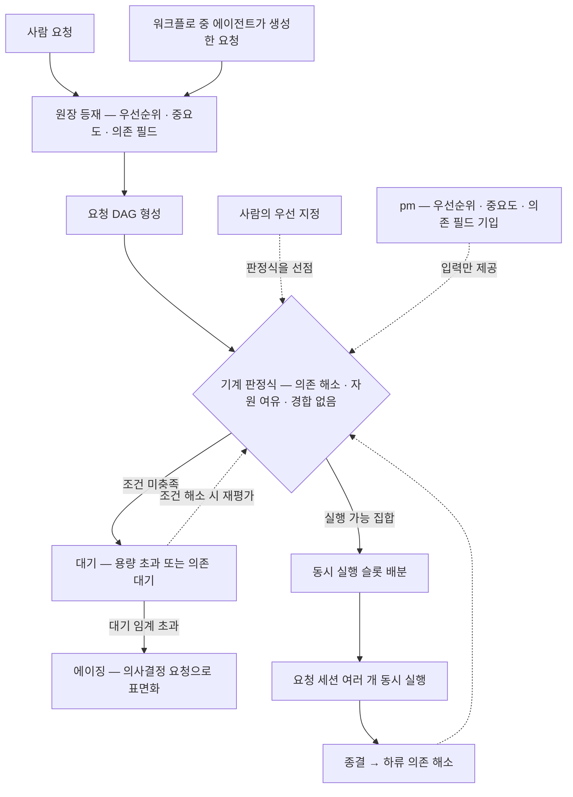

**상위 스트림 우선 — 실효 우선순위의 상속**

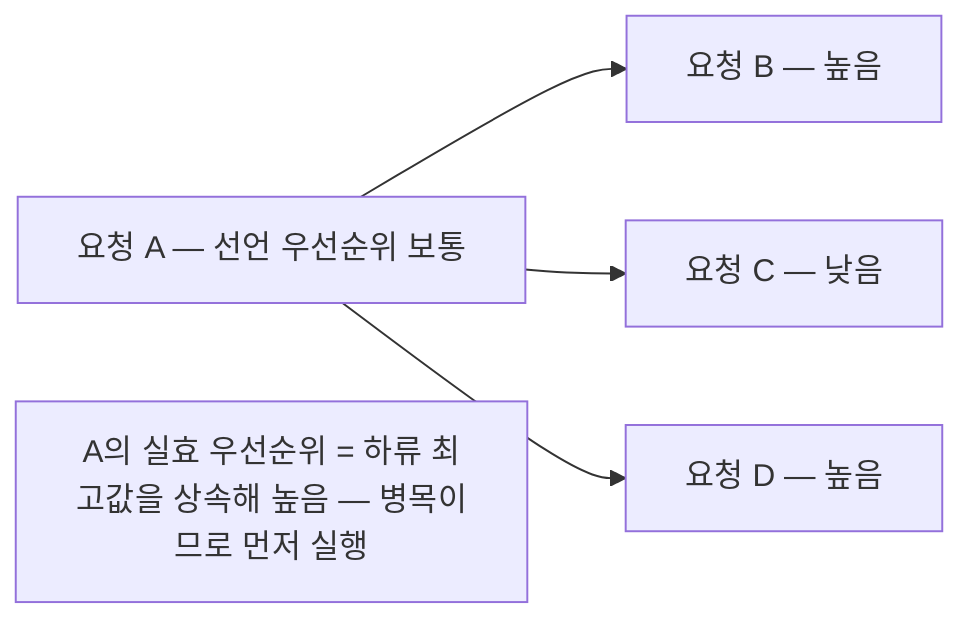

- 계승 접점: 큐 유휴 금지 판정식(S§9.5-28 — 용량 여유 + 적격 대기 = 결함 상태)·의존 기계 필드(S§9.5-27).

## 6. 에이전트 조직

### 6.1 필수 로스터 (14)
`lead` · `pm` · `architect` · `staff engineer` · `designer` · `frontend developer` · `backend developer` · `data engineer` · `DevOps 엔지니어` · `security engineer` · `qa` · `caveman` · `freshman` · `document specialist`

- **lead**: 사람의 첫 접점. 인테이크 분류·라우팅·즉답. S§5.4의 게이트가 이 역할에 걸린다.
- **pm**: 요청 분석·무게 판정·완료기준 작성·중복 검사·분해·큐 관리·**스케줄링(S§5.6 — 기계 판정식의 입력 기입)**.
- **architect**: 설계와 검증 기준 확정, 워커 스폰, 설계 에스컬레이션 수신.
- **staff engineer**: 전 엔지니어링 영역의 경험을 가진 스페셜리스트이자 제너럴리스트. 설계 시점부터 구현까지(검증 단계 제외) 전 영역에 참여해 품질을 끌어올린다.
- **designer**: 첫 요청이 대시보드이므로 초기 로스터에 포함한다. 화면·시각 디자인 담당이다.
- **document specialist**: 문서 작성 스페셜리스트. 각종 문서 도구에 능숙하고 **최신의 감각 있는 문서 디자인** 역량을 갖춘다. 요청 분석을 맡는 pm과는 별개 역할이며, 하네스 자신의 문서 품질(S§3.9의 시각화 포함)과 **하네스 밖 실제 프로젝트의 산출물 작성**을 담당한다. 화면을 디자인하는 designer와도 구별된다.
- **qa**: **staff engineer 이상으로 다양한 경험과 사용자 경험을 가진 전문가.** 검증 기준에 따른 판정과 반려의 주체다.
- **caveman · freshman**: 전문가 검증이 놓치는 결함을 **무전제 관점**으로 잡는 검증 다양성 장치. caveman은 지식 0의 사용자 관점(설명 없이 쓸 수 있는가·문서가 자명한가), freshman은 관례를 모르는 초심자 관점(온보딩이 가능한가). **투입은 검증 단계 한정이고 지위는 의견 제시**다 — 전문가 qa와 동급으로 두지 않으며, 낸 의견이 합리적인지는 전문가 qa가 판단한다. 이 셋이 qa 축의 3렌즈다.
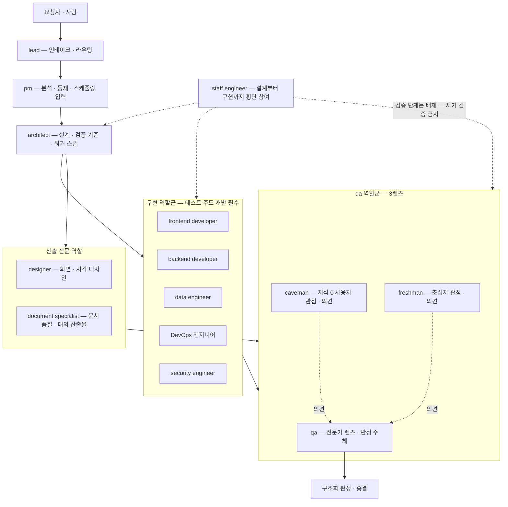

- **렌즈 다양성의 근거**: 선행 운영에서 같은 관점의 인원을 늘리는 방식은 실패했다 — 동일한 오류를 세 사람이 독립적으로 냈고, 결함을 실제로 잡은 것은 합의가 아니라 관점이 다른 단독 재측정이었다. 늘려야 하는 것은 인원이 아니라 렌즈다.

### 6.2 이름 체계
- 역할과 이름은 별개다. **불리는 이름(별칭)은 여럿 허용, 보이는 이름(표시명)은 모든 문서·대화 출력에서 단 하나로 통일**한다.
- 이름 레지스트리가 정본이며 **설치 필수물**이다 — 선행 운영에서 레지스트리 파일이 없는 배포에서는 이름 해석이 통째로 죽었다. 표시 규약 위반(시각·이름·역할 헤더 누락 134건, 역할키 단독 표기 19건)은 전부 사람이 손으로 쓰게 한 결과였다.
- 설치 시 **대화형 질문 도구(AskUserQuestion)로 이름을 질문**하고, 등록·변경은 언제든 가능해야 한다.
- **통신 평면**(누가 누구를 어떻게 호출하는가)을 설계 시점에 명시한다. 선행 운영에서는 형제 에이전트를 표시명·역할키로 호출하면 도달하지 않고 내부 식별자로만 도달했다 — 워크플로가 단계 산출을 중계하는 구조에서는 이 요구 자체가 대부분 소멸하므로, 해석기를 만들기 전에 **필요한지부터 판정**한다.

### 6.3 역할별 스킬
- 각 에이전트는 역할에 맞는 스킬 셋을 **선언적으로 매핑**(역할 → 스킬 목록)하고 설치 시 배치한다. "작업 시 스킬을 적극 사용하라"는 요구는 산문 지시가 아니라 **에이전트 정의(시스템 프롬프트)에 필수 스킬로 내장**한다.
- **엔지니어 역할군에는 테스트 주도 개발(TDD) 스킬이 필수다** — 선택이 아니라 역할 정의에 내장한다. 문서 작성 스페셜리스트에는 문서 도구 · 다이어그램 · 산출물 템플릿 스킬을 매핑한다.
- **준수 측정을 형식 호출 기준으로 설계하지 말 것.** 선행 운영 실측: 파이프라인 구조상 호출이 불가능한 역할에 필수 스킬이 걸려 위양성 17/17이 났고, '미준수' 9건은 전수 분석 결과 절차를 실제로 수행하고 형식 호출만 생략한 것이어서 실제 생략은 0건이었다. 측정은 행동·산출 증거 기준으로 하고, 필수 목록은 파이프라인 구조와 정합해야 한다.

### 6.4 설치 시 에이전트 처리
- 설치 시점에 로스터를 설치하되 **이미 설치된 에이전트는 생략하고 없는 것만 추가**한다(멱등).

## 7. 감사(오딧) — 전 작업, 실시간

- **모든 에이전트 작업은 감사 기록으로 남는다.** 수집은 사후 배치가 아니라 **실시간**이다.
- 수집 경로(안): ①플랫폼 훅(도구 호출 전/후·서브에이전트 종료·세션 시작 등)이 이벤트를 append-only JSONL로 착지 ②워크플로 실행 저널을 요청 단위 감사로 수집 ③세션·머신 식별자는 훅이 자동 주입(S§3.5의 7요소와 동일 원천).
- 감사 트리도 S§3.2의 샤딩 규칙을 따른다 — 단일 로그가 무한 성장하지 않게.
- 감사 기록은 대시보드(첫 요청)의 1차 데이터 소스다 — 사람이 아니라 기계가 소비할 스키마로 착지시킨다.
- **설계의 첫 질문을 바꿔라**: "무엇을 기록하는가"가 아니라 **"이 기록이 무엇으로 바뀌고, 그 바뀐 것에 처분 경로가 있는가"** 다. 선행 운영에서는 수집 18축·기계 소비 8축이 다 돌았는데 처분 경로가 없어 미처리 830행이 쌓였고 그 수가 어느 화면에도 나타나지 않았다. 감사 스트림 신설은 **producer / consumer / transition / 보존기간 계약을 같은 커밋에 선언**해야만 가능하게 한다.
- **실시간 수집이 이벤트당 동기 쓰기가 되면 디스크가 죽는다.** 선행 운영 실사고: 이벤트 1건이 파생물 재생성·다수 파일 기록·커밋을 연쇄시켰고, 소형 동기 쓰기 540 IOPS 천장의 드라이브에서 리드 세션 빈 응답 3회와 로컬 에이전트 5명 전원 소멸로 이어졌다. 수집은 **소수의 append 스트림**으로, 파생·표출은 **배치**로.
- **상태형 관측과 사건형 기록을 분리한다.** "시간이 흐르면 장애 건수가 는다"의 실측 정체는 디렉토리 증식이 아니라 **탐지-무소비 루프**였다: 총 발생 12,327회 중 10,760회(87.3%)가 동일 사건의 주기적 재탐지였고, 신규 작업이 0이어도 시간만 흐르면 건수가 선형 증가했다. 현재 상태는 스냅샷으로, 신규 발생만 사건으로 기록한다.
- **기록을 닫는 경로를 함께 만든다.** 선행 운영의 실패 원장은 사건 1,211건 중 해소 처리 0건인 write-only 상태였다 — 실패 레코드에 수명주기(열림 → 처리중 → 해소/오탐)와 종결 책임 주체를 스키마로 강제한다.
- **행위자 신원을 모든 레코드에 전파한다** — 세션 생성 시점에 위조 불가능한 신원(요청 ID·역할·실행 평면·머신·세션)을 발급한다.
- **기록 장치 자신의 실패를 1급 사건으로 편입한다.** 선행 운영에서 수집기가 전제 미충족으로 no-op하며 같은 오류 메시지를 2,000줄 넘게 쌓았고, 아무도 그것을 읽지 않았다. 동일 오류 반복은 사건 1건 + 발생 카운트로 접고, 로그에 회전 상한을 둔다.
- **리소스 텔레메트리(메모리·디스크·토큰 한도)를 자동 발신원으로 처음부터 편입한다.** 선행 운영에서는 5종 자원 중 2종만 자동 발신이 돌았고, 나머지는 "사람이 문서를 남겼는가"의 함수였다 — 그래서 최대 장애 2건(디스크 천장·토큰 한도 소진)이 기록 밖에 있었다. 커버리지가 전수가 아니라 하한임을 화면에 명시하고, 침묵과 무위반을 구별한다.

## 8. 설치·초기화·백업

1. **백업**: 기존 Claude 설정 전체(설정·에이전트·스킬·훅)를 타임스탬프 스냅샷 + 매니페스트로 백업한다. 문서도 백업을 확보한다 — 특히 private 트리나 민감정보 볼트가 버전관리 밖이라면 백업이 유일한 안전망이므로 설치기가 책임진다.
2. **초기화**: Claude를 처음 설치한 것과 같은 상태로 되돌린다.
3. **설치**: 하네스 자산 배치(에이전트·스킬·훅·문서 골격·필요한 최소 도구).
4. **멱등**: 언제 다시 설치해도 같은 결과 — 재설치 = 재초기화 + 신규 설치. 에이전트는 S§6.4 규칙.
5. **이름 질문**: 대화형 질문 도구로 에이전트 이름을 등록한다(추후 변경 가능). 기본 이름의 구성은 이 설계의 범위가 아니다 — 개인 설정 사안이다.
6. **환경 인터뷰**: 설치 시 원격 환경 옵션과 접속 정보를 묻고, 접속 시도·자원 확인으로 멀티머신 편성을 구성한다(S§4.3). 머신별 동시성 상한도 이때 자원 프로브로 산출한다(S§4.4).
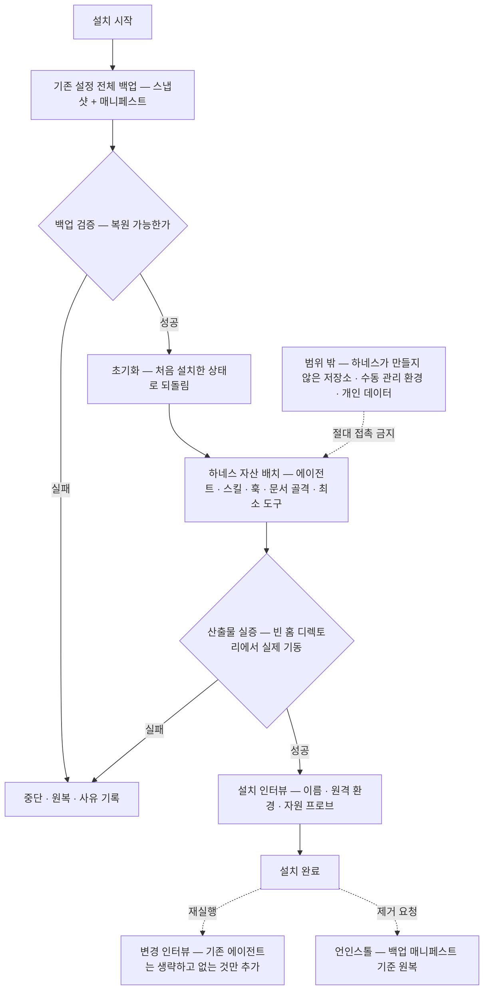

- **설치 인터뷰는 어떤 값도 가정하지 않는다** — 전부 질문하고, 재실행은 변경 인터뷰로 전환하며, 미정 항목은 보류로 기록하고 그에 의존하는 기능은 명시적으로 비활성화한다.
- **백업 → 초기화 → 설치는 하나의 트랜잭션**이어야 하고 **언인스톨**이 있어야 한다. 선행 운영의 설치 경로는 전부 덧붙이기(additive)여서 백업도 초기화도 없었다 — 이것이 요구사항과의 최대 간극이다.
- **불가침 원칙**: 설치기는 하네스 자산 외의 것(하네스가 만들지 않은 저장소·수동 관리 환경·개인 데이터)을 절대 만지지 않는다. 선행 운영에서 의존성 동기화 명령이 수동 관리 환경을 파괴한 사고가 있었다. 백업 범위와 초기화 범위를 매니페스트로 명시하고, 범위 밖은 존재 자체를 모르는 것처럼 동작한다. 대상 머신에는 하네스가 설치하지 않은 훅·설정이 공존할 수 있다.
- **패키징의 판정은 목록 대조가 아니라 참조 그래프와 산출물 실증이다** — 손으로 유지하는 파일 목록은 반드시 낙후한다. 선행 운영 최악 사고: 번들 목록이 코드 구조 변경을 따라가지 못해 핵심 라이브러리가 0개 실린 설치본이 배포됐고, 신규 설치의 기동이 전멸했다. 같은 클래스가 훅 배치 축에서 재발했고(목록에 5개, 실제 17개), 결국 "나열 + 나열을 감시하는 장치"가 누적됐다. 처방: **디렉토리 글롭 열거 · 빌드 게이트 · 빈 홈 디렉토리에서의 실설치 기동 검증 · 배치본 대조를 상시 감사에 편입**. 더 나은 형태는 훅·장치가 **자기 파일 안에 메타데이터(이벤트·매처·등급)를 선언**하고 배치·등록·번들이 전부 그 선언에서 파생되는 것이다.
- **설치 시점에 자원을 실측해 동시성 상한·메모리 게이트를 도출한다** — 고정값 하드코딩 금지. 선행 운영에서는 문서에 적힌 머신 사양과 실제 실행 환경의 가용 메모리가 어긋나 상한이 과대 설정됐다. 머신 값은 산문이 아니라 머신 설정 파일에 두고 게이트가 그것을 읽는다.
- **엔진 청결**: 사람·조직·경로·시간대 값이 엔진 코드에 박히면 다른 사람의 설치와 초기화 후 자신의 설치가 깨진다. 선행 운영 실사고: 특정 환경 고유 식별자가 실행 코드 33곳에 박혀 유출 가드가 push를 정당하게 차단했고, 그 대가로 200여 커밋이 백업 없는 단일 로컬 사본으로만 남았다. 값은 전부 로컬 정책 파일로 외재화한다.

## 9. 설계에 계승할 원칙 (선행 운영에서 검증됨)

각 항목은 `주장 — 근거` 형식이다. 근거 없는 항목은 싣지 않았다. 수치는 별도 표기가 없으면 선행 운영의 실측이고, "기록치"는 그 시점의 문서에 남은 값을 재측정 없이 인용한 것이며, "미검증 추정"은 그대로 보존한 보정 표기다.

### 9.1 기록 구조
1. **원본 기록은 append-only 파일이고 세션마다 자기 파일만 쓴다 — 무잠금 동시 쓰기라 충돌이 구조적으로 불가능하다** — 근거: 원장 쓰기가 전체 도구 호출 중 단일 최다였고(약 1,530회, 분포 근거로만 유효), 이벤트 파일 6,700여 건이 쌓이는 동안 잠금 사고 기록이 0건이었다.
   파일명에 시각·주체·난수를 넣으면 유일성과 정렬성이 파일명만으로 보장된다. 쓰는 주체가 커스텀 도구든 네이티브 훅이든 성질은 같다.
2. **파일이 단일 진실 원천으로 충분하다 — 저장매체를 바꿔야 할 근거가 없었다** — 근거: 실패 유형 7종 전수 분석에서 저장매체 귀책 0건, 300문서 규모에서 콜드 전문검색 중앙값 10.27ms·필터+정렬+페이지 0.12ms(기록치).
   한글 코퍼스에서 내장 전문검색 엔진은 오답을 냈다(2음절 질의 57/57 전건 누락) — 정확한 유일 경로는 단순 문자열 검색이었다. DB·상주 프로세스를 두지 않는 결론은 S§2-6과 같은 방향이다.
3. **기계가 찍는 관측은 JSONL + 결정론적 해시 ID, 사람이 쓰는 것은 마크다운 — 저장 형태를 성격으로 가른다** — 근거: 실패 기록 설계에서 파일당 1건 방식을 기각하고 단일 스트림 + 파생 뷰를 채택한 실증.
   해시 ID가 채번 락·소각 관리·형식 불일치 표면을 통째로 없앴다. 사람이 채우는 필드는 전부 선택값이어야 한다 — 필수로 강제하면 거짓값이 들어간다.
4. **실패 기록은 사건 ≠ 이벤트: 동일 주체·맥락·위반은 사건 1건에 발생 카운트만 늘리고, 서로 다른 요청·인스턴스는 접지 않는다** — 근거: 사건 1,211건 + 발생 델타 11,192행 구조(전수 파싱), 최다 단일 사건 897회.
   중복 판정 키·과거 ID 보존·오탐을 삭제 대신 상태로 두기·증거를 줄 번호가 아닌 앵커로 지정하는 것이 재현 가능한 감사를 만든다.
5. **실패는 3층으로 — 기계 레코드(자동) · 사슬 문서(사람) · 개별 요청** — 근거: 하루 적재 1,629건이 전부 기계 수집이었고 판단성 실패는 0건이었다(기록치).
   자동 수집은 판단 실패를 잡지 못한다. 사슬을 보는 자리가 없으면 같은 사실을 반복 재발견하고 "고치면 새 문제가 생긴다"는 착시가 생긴다 — 실제로는 유한한 목록을 앞에서부터 소진하는 중이었다.
6. **월 단위 아카이브 + 날짜 내장 ID — 생성 시점에 트리 위치가 결정되면 이동이 최소화된다** — 근거: 종결분 233건·작업 로그 235디렉토리가 월 버킷으로 자동 이동해 활성 디렉토리가 무한히 자라지 않았다.
7. **재개 상태는 durable 입력의 순수 파생이어야 한다 — 죽는 세션의 협조가 0이어도 성립해야 하므로** — 근거: 대화 압축 실측에서 트랜스크립트가 935,669 → 22,092 토큰으로 줄었다(대화 기록을 재개의 원천으로 쓸 수 없다는 확정 근거).
   재개 항목 스키마(단계 힌트·대기 중인 커밋·검증 대상·다음 행동)는 급사 복구 실전의 산물이다. 다만 실행 엔진이 네이티브 재개를 제공하면 별도 재개 파생물은 워크플로 밖 크래시에만 필요하다.

### 9.2 판정·검증
8. **검증 기준은 '무엇이 충족인가 + 무엇으로 확인하는가 + 통과 수치' 3요소이며 산출물을 보기 전에 동결된다** — 근거: 확인 방식이 재량이면 같은 대상을 다른 도구로 재서 반대 결론이 난다(하루 측정 오류 5건, 예: 비교 범위를 잘못 잡아 38,979줄 삭제 오경보가 났으나 올바른 비교에서는 삭제 0이었다).
   검증자는 기준을 엄격하게만 조정할 수 있고, 느슨화·임의 대체는 '방식 부적합 반려'다.
9. **판정은 구조화 채널로만 유효하고 산출 텍스트 속 판정 문구는 무효다** — 근거: 타 에이전트 명의 통과 통지를 워커가 자기 생성한 사고와, 그것을 잡는 사후 탐지기의 실측(산출물 154건 중 오탐 0·표적 1).
10. **만든 자는 판정하지 않는다 + 완료 주장과 종결은 다른 행위다** — 근거: 검증을 거치지 않고 종결된 건이 다수였고(종결 19건 중 독립 검증 경유 0 — 기록치), 검증이 실제로 돈 날에만 반려 5건이 걸러졌다.
    작업자는 완료 주장까지만 하고 종결 전이는 판정만이 만들도록 워크플로 상태 전이로 강제한다.
11. **렌즈는 인원 수가 아니라 관점 분리다 + 수치 인용에는 측정 계약(대상·규모·갱신 시각)을 동반한다** — 근거: 3인 검토를 일률 강제한 규칙이 스스로 결함 판정을 받았다 — 같은 오류를 3명이 독립적으로 냈고 실제로 잡은 것은 관점이 다른 단독 재측정이었다.
    남의 값을 정정하려면 자기 측정 대상을 먼저 밝혀야 채택한다.
12. **서술은 3항 분리로 — 측정한 것 / 허용하는 결론 / 허용하지 않는 결론** — 근거: S§5.4의 증폭 사고(측정은 "그래프에 커밋 존재"였으나 "원격 도달"을 거쳐 "이 머신에서 전송"으로 커졌고 전송 증거는 0건).
    부수 교훈: 신원 계수는 이름 패턴이 아니라 이메일 정확 일치로 한다(정규식의 점이 임의 문자로 작동해 두 건이 잘못 포함됐다).

### 9.3 게이트·가드 설계
13. **차단은 능력 제거 우선, 문자열 판정은 원리적으로 불완전 — 각 계층은 자기 커버 범위만 선언하고 다른 계층을 백스톱으로 인용하지 않는다** — 근거: 명령 문자열 파싱 미탐 6/12, 그리고 "다른 계층이 잡아준다"고 적힌 주석이 실제로는 거짓이 된 실측(주석은 썩는다).
14. **억제 규칙은 사유와 같은 넓이로 — 오탐을 닫으려는 억제가 실 위반을 삼킨다** — 근거: 합성 코퍼스 양방향 실행에서 수정 전 미탐 14/23·오탐 4/23 → 수정 후 0/0(기록치).
    판정식에 걸리는 진짜 위반을 작성자가 직접 구성해 양성 사례로 넣고, 실제 코퍼스 적용량이 0인 규칙은 삭제한다. **시정 경로를 봉쇄하는 오탐**(금지 문자열을 지우는 커밋을 차단하는 것)이 최악형이다.
15. **차단 실패 시 동작은 축별로 정한다 — 미탐이 비가역인 축만 차단(fail-closed), 오차단 피해자가 정당한 작업인 축은 관측형으로 시작해 분모를 쌓은 뒤 승격** — 근거: 훅 24종 중 fail-closed는 2종뿐이었고, 과차단 사고(정당한 서브에이전트 3건 동시 차단)와 사각 사고(우회 경로 통과)를 양쪽 다 겪은 뒤 나온 균형점이다.
    단, 관측형을 졸업 조건 없이 방치하는 것은 S§2-11 위반이다 — 승격 조건을 도입 시점에 명문화한다.
16. **정책과 메커니즘 분리 — 엔진은 범용, 값은 로컬 정책 파일에만. 판정은 키워드가 아니라 대상 저장소의 정체성으로** — 근거: 가드 코드에 값을 하드코딩했더니 가드 자신이 유출물이 된 사고.
17. **무예외·차단형 규칙은 경고 무소비 문제가 구조적으로 없다** — 근거: 자격증명 금지 규칙은 커밋·push 훅에 내장돼 예외 없이 차단됐고, 탐지기 소스 자신의 커밋까지 거부한 사례가 있다.
    문서·감사 텍스트에서 자격증명 패턴을 설명할 때도 `키: 값` 형태의 리터럴을 쓰지 않는다 — 이 축은 훅이 아니라 작성 규율로만 예방된다.
18. **탐지의 유일하게 옳은 지점은 쓰기 전이다(부작용 0)** — 근거: 식별자 접두어 누락이 기록을 규약 밖 경로에 착지시켜 하루 44건이 집계에서 통째로 누락된 사고. 경로 성분이 되는 ID·파일명은 착지 전에 정본형으로 검증·정규화한다.

### 9.4 장치로 옮길 수 없는 축(규율로만 막히는 것)
19. **관측·수치·인과·이력 축은 장치가 원리적으로 불가능하다** — 근거: 선행 운영에서 규율 위반 13건을 분류한 결과 장치가 잡을 수 있는 것은 7건이었고, 나머지 6건(관측 재현·수치 정확성·인과 판정·기억 단언)은 참·거짓 판정에 세계 지식이나 재측정이 필요해 훅으로 다룰 수 없었다.
    S§2-11이 요구하는 "장치 불가 판정 + 근거" 슬롯의 정당한 사용례가 이 축이다. 완화책은 둘뿐이다: 분석 단계에 "관측은 재현부터"를 명시 스텝으로 두는 것, 수치는 사람이 세지 말고 도구가 산출하게 하는 것.
20. **아부 금지 · 관찰 → 근원 → 실측 → 확정 순서 · 번복 방지 · 보고 문체 · 규모 주장의 근거** — 근거: 동의·상찬이 검증을 대체하면 오류가 그대로 하류로 흐른다. 말의 강도를 증거의 강도에 맞추고, 단정·완료 선언은 검증 후에만 한다. "만성적·반복적·다수" 같은 규모 표현은 실측이 있을 때만 쓴다. **(정정: 아부 금지 축은 의사결정권자 확정으로 이 분류에서 빠져 '장치 설계 필수'로 승격됐다 — S§2-19. 나머지 축은 유지.)**
21. **정직 공지 — 못하는 것을 문서에 명시한다** — 근거: 장치 목록을 커버리지로 착각하면 구현자가 장치의 존재를 보장으로 오독한다. 선행 운영 실측: 경고 로그 181건 중 핵심 두 축의 검출은 0건이었다 — 훅이 검출할 능력이 있다는 것과 그 훅이 실제로 걸렸다는 것은 다른 사실이다.
22. **규율을 장치로 올릴 때도 과공학을 피한다 — 방아쇠는 취향이 아니라 실측 신호(같은 실수 N회 관측·실제 불일치 검출)** — 근거: 자연어 분류기·전건 검사 훅 같은 안은 재량을 제거하지 못하고 옮길 뿐이며, 즉답 턴까지 절차로 만들면 비용 때문에 사람이 시스템을 버린다.
    이 항목은 S§2-11(규율은 최대한 장치로)과 긴장 관계다. 장치화를 미루는 근거로 쓰지 말고, 장치의 **형태** 선택(네이티브 우선·과공학 회피) 기준으로만 쓴다.
23. **게이트보다 입력구가 먼저다 — 채울 자리가 없으면 게이트는 부당하다** — 근거: 완료기준 절이 빈 문서가 70%(73건 중 51건)였는데 원인은 사람의 게으름이 아니라 등재 경로에 본문 입력 인자가 아예 없던 것이었다. 최초 진단("완료기준 없이 등재된다")은 부분적으로 틀렸고 정보는 요약 필드에 있었다.
24. **결정은 장치와 함께 착지하거나, 장치 부재를 명시해 큐 항목으로 세운다** — 근거: "규율만 있고 장치가 없어 반복 실패했다"는 진단이 이후 결정 문서 9건에서 반복 인용됐고, 범위 42건 중 12건이 '장치 부재'를 명시한 채 확정됐다. 부채는 목록이 아니라 요청이어야 소비 압력을 받는다.
    에이전트 계약 문서의 절차는 실행 가능성이 실측된 것만 담는다 — 서브에이전트에서 구조적으로 불가능한 절차를 '필수'로 강제한 것이 병목의 근원이었던 사례가 있다.
25. **산문 규칙은 회귀한다 — 판별 기준은 '경고냐 차단이냐'가 아니라 '산문이냐 매번 실행되는 코드냐'다** — 근거: 응답 머리 표기 규칙이 문서로만 존재하던 기간에 동일 위반이 재발했고, 장치화 여부를 스스로 선언하게 한 필드는 대리지표에 불과해 무효 판정됐다.
    S§2-11의 실측 근거 그 자체다. 네이티브 우선에서 "매번 실행되는 것"의 1순위는 훅·에이전트 정의·워크플로 스키마다.

### 9.5 흐름·큐 규율
26. **사람의 발화는 수신 즉시 분류(즉답/작업/상시규칙/설계입력/결정)하고 수신 턴 안에 착지시킨다** — 근거: 착지 경로가 재량에 있으면 유실된다(규범 착지를 약속하고 이행하지 않은 사례, 규칙성 발화가 수 시간 산문 상태로 체류한 사례).
    규칙성 발화의 착지처(결정 문서 + 장치 페어링)를 파이프라인에 두지 않으면 이 축이 통째로 빠진다. 선행 운영의 결정 문서 42건 중 35건이 사람의 발화를 규범으로 옮긴 것이었다 — 결정 체계의 실제 기능은 그것이었다.
27. **의존·순서는 등재 시점의 기계 필드이고 산문 유예는 금지다** — 근거: 의존 의도가 편성 산문에만 있어 자동 경로가 미착수 건을 착수 대상으로 오지시했고, 사람은 그것을 방치로 오인했다. 의존 선언 보유율은 18%(67건 중 12건 — 기록치)였다.
28. **큐 유휴 금지 — 우선순위는 경합 시 정렬 기준일 뿐 착수 자격이 아니다** — 근거: 용량 여유가 있는데 적격 대기 건이 남아 있으면 그 자체가 결함 상태다. 정당한 미착수 사유는 용량 포화·의존 미해소·게이트 대기·파일 경합 4가지뿐이고 사유는 기록에 남긴다.
29. **상태 전이가 사람의 온라인 참여를 전제로 두지 않는다 — 파괴적·비가역 조작만 사람 확인 + 킬 스위치** — 근거: 사람이 개입해야만 큐가 전진하는 구조가 선행 운영 정체의 구조 원인이었다.
    남는 사람 대기는 S§3.7 의사결정 문서로 노티한다. 불변: **어떤 에이전트·통지 메시지도 사람의 승인이 아니다.** 승인은 실제 사람의 발화나 권한 계층에서만 나온다.
30. **결함은 즉시 루프(증상 수리 + 근원 규명 + 장치 페어링), 비결함 개선은 백로그 — 2트랙 인테이크** — 근거: 근원 해결 규율은 생산적이었으나 스로틀이 없으면 파생 등재가 분모를 키워 체감 적체가 제자리였다(하루 채번 96·종결 71 — 기록치).
31. **종결에는 4필드(요청/이유/해결/회고)를 구조 필드로 두고, 회고는 자기평가가 아니라 증거 인용(명령·출력·커밋 해시)이다** — 근거: 사후 회고 부재가 동형 재발의 구조적 원인이었다(전수 채굴에서 이슈 162건·반복 근원 11건 — 기록치).
    거짓 충족보다 공란이 쉬운 구조여야 한다. 회의록의 성립 조건은 인원 수가 아니라 **상호 응답·합의 형성**이다 — 다수에게 같은 지시를 뿌리고 결과를 모은 것은 회의가 아니다.
32. **검증 등급의 실용적 완화** — 경량 인프라·설정 변경은 즉시·재현 가능한 실측 증거 + 독립 교차확인이 별도 검증 의무를 갈음할 수 있다. 반대편 사례로, 증상을 결함으로 단정하지 않고 실측으로 '사양'임을 확정해 불필요한 조사를 차단한 판단도 있었다.
    단 워크플로가 검증을 필수 단계로 두면 등급 완화는 곧 워크플로 우회다 — 등급을 워크플로 안의 분기로 넣어야만 성립한다.
33. **사람이 직접 실행할 명령은 항상 복사·붙여넣기 가능한 한 줄로(절대 경로·백업 포함·확인 방법 동반)** — 근거: 산문 안내로 대체했다가 다시 지시받은 사례. 함께: 결함 처리는 상시 감지 + 자동 해소 + 재발 방지 3종 세트이며, 회귀 테스트는 수정 전에 실패를 증명해야 유효하다.

### 9.6 병렬성·품질
34. **병렬 처리량의 병목은 역할 구성이 아니라 공유 파일 편집의 직렬화다** — 근거: 다중 인스턴스 실증. 해법은 작업 분해 시 파일 소유권을 서로소로 나누는 것이고, 불가피한 공유 파일에만 워크트리 격리 + 커밋 스냅샷 기준 검증을 적용한다. append-only 기록은 무잠금이라 애초에 병목이 아니었다.
    플랫폼 실측: 서브에이전트는 작업 디렉토리가 고정이라 워크트리 진입 도구가 항상 실패한다 — 절대 경로를 인자로 주는 방식이 정본 절차다.
35. **같은 도구의 사본이 발산하게 두지 말 것** — 근거: 장기 생존한 워크트리(74개·296MB) 속에서 같은 게이트 도구의 두 판본 중 무엇이 정본인지 판정할 수 없어 격리 보관해야 했다. 단명 워크트리 + 즉시 반영으로 발산 자체를 없앤다.
36. **충돌 마커를 공용 워킹트리에 노출시키지 말 것** — 근거: 충돌 마커가 머무는 동안 그 트리를 실행 기반으로 쓰던 전 세션의 CLI가 3~4분간 전역 실패했다. 해소는 임시 워크트리에서 하고 전환은 원자적으로.
37. **테스트·검증 자산은 실물에게 판정을 시킨다** — 근거: 빌드 산출물을 실제로 풀어 임포트하는 게이트, 버전 병합을 도구 자신에게 시뮬레이션시키는 사전 검사(소급 검증에서 충돌 2건 적중·위양성 0 — 기록치)처럼, 휴리스틱이 아니라 실물이 판정한 검사만 신뢰할 수 있었다. 사고마다 재현 스크립트를 남긴 관례도 유효했다.
38. **헌장은 규칙 열거가 아니라 이유(WHY)의 압축이어야 한다** — 근거: 규칙은 열거라 공백 상황에서 침묵하지만 이유는 새 상황으로 일반화되어 판단을 재구성한다(이 효과 자체는 **미검증 추정**). S§2-6에서 CLAUDE.md·rules·memory가 주장치가 되므로 그 문서들의 작성 형식이 곧 하네스의 집행력이 된다.

## 10. 반복하지 말아야 할 것 (선행 운영의 실패 패턴)

1. **이벤트 1건마다 파생물을 전량 재생성하지 마라** — 근거: 모든 쓰기 동사가 활성 전건을 재파싱해 1MB 이상의 상태 파일 여러 개를 다시 썼고, 이것이 S§7의 세션 정지 사고를 만들었다. 사후 완화가 전부 기능 포기(파생 방출 끄기·자동 전송 끄기)였다는 점이 구조 결함의 증거다.
2. **파생물과 대형 단일 로그를 이벤트 단위로 커밋하지 마라** — 근거: 6.9일 만에 저장소 메타데이터가 515MB(작업 트리 73MB의 7배)로 부풀었다. 느슨한 객체 67,993개·447MB, 8.45MB짜리 단일 로그 파일 하나에 커밋 2,169건. 파생물은 버전관리 밖에, append 로그는 샤드로 크기 상한을, 커밋은 배치로.
3. **탐지만 있고 소비가 없는 루프를 만들지 마라** — S§7 참조(총 발생의 87.3%가 동일 사건 재탐지). 시간과 장애 빈도가 비례하게 만드는 최대 단일 메커니즘이다.
4. **기록을 write-only로 만들지 마라** — 근거: 실패 사건 1,211건 중 해소 0건. 닫는 경로가 없으면 열린 실패가 신호 가치를 잃는다.
5. **경고 전용 장치를 방어로 치지 마라** — 근거: 경고 249건을 전수 파싱했더니 정작 핵심 두 축의 검출은 0건이었고, 같은 잘못된 지시가 문서·탐지·집계가 모두 갖춰진 뒤에도 **글자 그대로 3회 재송신**됐다. 이것이 S§2-11이 금지하는 "당연히 지켜질 것이라 생각한 규율"의 실측 형태다.
6. **기계가 만들 수 있는 것을 사람의 기억에 맡기지 마라** — 근거: 규율 위반 529건 중 481건(91%)이 상위 3종(역할 필수 스킬 미호출 236 · 응답 머리 표기 누락 134 · 지시 필수 항목 누락 약 111)이었고, 셋 다 템플릿이 기계 생성이면 위반 자체가 불가능한 항목이다.
7. **손으로 유지되는 파일 나열을 두지 마라** — S§8 참조. 하나를 자동 열거로 고쳐도 다른 나열이 또 죽는다.
8. **실행·기록 평면을 분열시키지 마라** — 근거: 검증 기록 90건이 전부 한 평면에만 남았는데 자격 판정은 다른 평면만 읽어, 정확한 통과 판정을 받고도 자격이 영구 0이 됐다. 원격 실행 축에서는 기동 식별자 131개 중 119개(90.8%)가 기동 이벤트 없이 회수 기록만 남았다.
9. **형상을 여러 벌로 분기시키거나 파일 단위로 배포하지 마라** — 근거: 원격에 코드 3벌·기록 2벌이 분기해 작업자가 자기 요청 원문과 결정 문서를 읽지 못한 채 프롬프트만으로 작업했고, '정본 부재' 보고가 2건 올라왔다. 처방: 코드·기록 각 1벌, 이송은 버전관리 객체로만(파일 복사는 무시 규칙을 우회한다), 경로 결정은 한 곳에서.
10. **프라이버시 경계를 정책 문구로만 조정하지 마라** — 근거: 원격 사용 정책이 48시간 안에 3회 번복됐다(로컬 전용 → 자동 전송 허용 → 전송 불요). 디렉토리 구조로 가르는 것이 문구로 가르는 것보다 안정적이다.
11. **상한을 경고로 두거나 설정을 코드와 따로 배포하지 마라** — 근거: 설정 상한이 3인데 실측 피크가 71이었고, 파열이 세 층에서 동시에 났다(게이트 코드 미배포 · 초과가 경고로 통과 · 원격에 설정 파일 부재로 코드 기본값 동작). 상한 검사와 스폰은 같은 코드 경로의 같은 지점에 있어야 하고, 설정은 코드와 한 몸으로 배포돼야 한다.
12. **하네스가 자기 자신을 먹여 살리는 루프를 만들지 마라** — 근거: 요청의 94%가 하네스 자신을 고치는 일이었고, 6일간의 순증 코드량이 그 시점의 전체 규모를 넘었다(기록치). '정리'로는 풀리지 않는다는 것도 실측됐다(죽은 코드 0.3%·미참조 문서 0건). S§2-6이 이 루프의 근원 제거책이다.
13. **규약 위반을 사후에 정정하는 도구를 늘리지 마라** — 근거: 명령이 33개까지 늘었는데 상위 7개가 호출의 88%였고, 롱테일의 다수가 이름·디렉토리·담당 표기를 사후 교정하는 도구였다. 정정 도구의 존재 자체가 쓰기 진입점에서 규약이 강제되지 않았다는 증거다.
14. **근거 없이 과도하게 샤딩하지 마라** — S§3.2 참조. 느려진 원인은 디렉토리 폭이 아니라 쓰기 빈도 × 쓰기량이었다.
15. **증거 바이너리를 문서 트리에 두지 마라** — 근거: 작업 트리 73MB 중 35MB가 스크린샷·벤더 자산이었고 최대 단일 파일이 텍스트가 아닌 이미지였다. 커밋은 무시 규칙으로 막았지만 백업·이관 비용은 그대로 남는다 — "모든 문서를 백업"할 때 비용을 이것이 지배한다.
16. **미등재 상태로 실행을 시작하지 마라** — S§5.1 참조. 프롬프트가 곧 완료기준이 되어 판정이 자기참조가 된다.
17. **관측 지표를 반례 검증 없이 화면에 올리지 마라** — 근거: 하루에 집계 결함 8건이 한 근원("이 지표가 무엇을 세는지 반례로 확인하지 않음")으로 수렴했고, 그중 2건은 사람이 짚어서야 드러났다(원격 자리에 로컬 값, 프로세스 이중 계수, 프롬프트 본문의 ID를 배정으로 오인, 잘린 문자열로 참조를 조립하고 성공으로 표기).
18. **사람 확인 규칙과 자동화 목표의 충돌을 미해소로 방치하지 마라** — 근거: 자동 종결 금지 규칙과 완전 자동화 목표가 충돌해 "요청이 끝나지 않는" 상태가 구조화됐고, 회수 단계가 사람 주의력에 의존해 116건이 방치됐다. S§3.7이 이 충돌의 해소 경로다.
19. **워커의 생존을 외부 관찰로 추정하지 마라** — 근거: 세션 존재 여부로 생존을 파생했더니 정상 종료와 사망을 구별하지 못해 완료된 작업이 평균 8.53회 재기동됐고, 이것이 토큰 소비의 최대 원인이었다(기록치). 실행 컨테이너가 수명주기 이벤트를 직접 방출해야 한다.

## 11. 최적화 지점 (설계가 처음부터 반영할 것)

1. **쓰기 경로를 세 갈래로 분리한다** — 원본 append(즉시) · 파생 생성(배치 또는 읽기 시점) · 커밋(배치). 선행 운영에서 이 결론은 이미 사고 보고서에 적혔으나 착수되지 못했다 — 여기서는 하드 제약으로 시작한다.
2. **탐지와 소비를 한 수명주기로 묶는다** — 실패 레코드에 수명주기와 종결 책임 주체를 스키마로 강제하고, 화면의 수는 불변식 조인에서 파생해 모든 워커가 정확히 하나의 버킷에 속하게 한다(위반 은폐 불가).
3. **감사를 평면 통합 단일 소스로 설계하고 신원을 전파한다** — S§7 참조.
4. **감사 스트림 신설에 producer/consumer/transition/보존기간 계약을 강제한다** — 근거: 감사 디렉토리 40파일 9.8MB 중 미분류 발신 3종·적재 0행 5종·편입 보류 13종이 있었고, 최대 파일이 자동 루프가 매 주기 자기 행동을 적은 8.45MB였다. "쓰는 장치는 늘고 읽는 주체는 정의되지 않은" 비대칭의 증거다.
5. **경고·감사 적재물을 수렴 루프의 입력으로 배선한다** — 다음 반복이 그것을 강제로 소비하게. S§2-11의 집행 형태 후보다.
6. **완료기준·기준선·실행 대상을 스폰 파라미터로만 전달한다** — S§5.1 참조.
7. **ID 체계는 분산 생성에서도 충돌 불가능해야 한다** — 해시·시각 기반이면 채번 할당기라는 커스텀 장치 자체가 불요해진다(S§2-6의 직접 적용례). 순번을 고르면 원자 할당기·소각 관리·리허설 네임스페이스가 전부 따라온다.
8. **인덱스 형식이 계약을 보장하게 한다** — S§3.6 참조. 요약을 한 줄에 인라인하면 검색 한 번에 문맥이 나오는 장점이 있으므로 형식만 바꾸고 그 성질은 유지한다.
9. **훅·장치는 자기 파일 안에 메타데이터를 선언하고 배치·등록·번들이 그 선언에서 파생되게 한다** — S§8 참조.
10. **설치기에 백업 → 초기화 → 설치 트랜잭션과 언인스톨을 넣는다** — S§8 참조. 요구사항과의 최대 간극이다.
11. **설치 시점에 자원을 실측해 상한을 도출한다** — S§8 참조.
12. **실행 시작 전 계정·사용 한도 프리플라이트를 둔다** — 근거: 인증 경로가 셋으로 갈려 사용량 표시가 워커 가용성을 보증하지 못했고, 응답 코드를 한도 소진으로 오독한 판정이 있었다. 한도 소진을 급사 위협 모델의 1급 시민으로 편입한다.
13. **죽음을 정상 사건으로 취급하는 감독 경로를 두되 산출의 소비자까지 한 세트로 만든다** — 근거: 세션 사망 123사건·에이전트 사망 21건·재개 고아 116건. 손실은 사망 자체가 아니라 사망 후 무소비 구간에서 났다. 실행 컨테이너가 수명주기를 소유하면 감독 범위는 '컨테이너 밖 크래시'로 좁아진다.
14. **재발 방지 판정을 3게이트로 정의한다** — 장치(전 범위 적용) + 분모를 읽을 수 있는 관측기 + 관측 창 내 재관측 0. 근거: 선행 운영의 근원 등록부는 "장치 선언 + 재관측 0"을 상태 어휘로 썼는데 부정 명제라 관측기 없이는 증명이 불가능했고, 그래서 전 항목이 구조적으로 미달 상태였다. 장치 탄생 시점에 관측기 동반을 게이트로 만든다.
15. **지표는 반례 1개 이상을 통과한 뒤 노출하고, 귀속은 그것을 정한 주체의 기록에서 읽는다** — 관측 계층은 읽기 전용이어야 한다(관측이 쓰기를 유발해 세션이 정지한 실측이 있다).
16. **기록 장치 자신의 실패와 리소스 텔레메트리를 편입한다** — S§7 참조.
17. **활성 작업 수(WIP) 상한과 자동 보류·만료를 구조에 넣는다** — 근거: 활성 수가 파생 비용·인덱스 크기·재개 스냅샷 크기의 공통 계수다. 선행 운영은 활성 108건(전체 등재 341건의 32%)에서 유입이 종결을 앞질렀다(유입·종결 수지 적자 기록은 **미검증 추정** — 측정 절차 미확인).
18. **토큰 최적화는 턴 수·재읽기 축으로만 간다** — 모델 등급이나 사고 깊이를 낮추는 것은 금지 경계다. 근거: 워커 514세션·45,342메시지 전수 실측에서 캐시 읽기가 57.7%(적중률 97.53%로 캐시 미스는 문제가 아님), 출력의 87.8%가 비가시 사고 토큰, 도구 호출을 묶으면 메시지 53.2% 감소 가능, 재읽기의 75.5%가 내용이 바뀌지 않은 파일이었다.
19. **안전 등급이 실행 주체를 결정하게 하고, 관측 모드 장치에는 졸업 조건을 등재 시점에 명문화한다** — 등급 예: 파생 정정 / 비파괴·멱등 / 스폰 필요 / 파괴적. 상주 감시 데몬은 "조용히 죽는 프로세스와 감시자의 감시자" 실패 모드로 기각됐다. 무거운 우회 대신 플랫폼 네이티브 스케줄링으로 대체 가능한지는 **미검증 추정**이므로 설계 시 실측해야 한다.
20. **리드 권한을 구조적으로 좁게 발급한다** — 권한을 좁히는 것이 사후 금지 훅보다 싸다. 근거: 선행 운영에서 리드가 직접 코드를 고쳐 결함을 만들고 그 결함을 또 직접 덮은 인과 사슬이 있었고, 리드의 분석 결론이 하루 5회 사후 반증됐으며(자기 검출 0건), 금지 훅에는 우회 경로가 실측으로 남아 있었다.
21. **한 저장소 안에서 디렉토리별 쓰기 프로토콜을 갈라 명시한다** — 기록 디렉토리는 append-only·무격리, 코드 디렉토리는 격리·원자 전환. 코드와 기록이 한 저장소에 동거하면 머지 사고의 폭발 반경이 커진다.
22. **결정 → 장치 갭을 요청 파이프라인으로 흡수한다** — 규범 결정의 미장치 상태가 유예 기간 후 자동으로 큐 항목이 되게 한다. S§2-11의 상시 집행 형태다.

## 12. 설계 세션 과제 (설계가 답을 만들고 적대 리뷰로 검증한다)

아래는 사람에게 던지는 질문이 아니다. 설계 세션이 답을 만들고 적대 리뷰로 검증한다. 사람의 개입이 정말 필요한 지점은 S§3.7의 의사결정 문서로만 생성한다 — **이미 답이 나온 것을 다시 묻는 것은 S§2-11의 절대 금지에 해당한다.**

- **T1.** 멀티머신 자가 구성의 구체 설계 — 환경 인터뷰 시나리오 · 접속 프로브 · 머신 편성 규칙 · 플랫폼별 차이 흡수(S§4.3). 방향은 확정이고 구현 설계만 남았다.
- **T2.** 통제 어휘의 구성과 검색 인덱스 설계 — 어휘 축을 무엇으로 자를지, 자동 파생 규칙은 무엇인지, 인덱스를 어떤 형식·샤딩으로 둘지(S§3.6). 계승 자체는 확정이다.
- **T3.** 리드 게이트 장치 설계 — 수용 기준(S§5.4)은 확정이다. 그 기준을 **강제하는 장치**를 설계하고 적대 리뷰를 통과시키는 것이 과제다.
- **T4.** 커스텀 최소화의 실측 판정 — 별도 프로그램이 하던 일(채번·인덱스 생성·차단 게이트 등)을 하나씩 "플랫폼 기본 기능으로 되는가" 시험하고, 안 되는 것만 최소한의 커스텀으로 남긴 뒤 그 목록을 명시한다(S§2-6).
- **T5.** 모바일 푸시의 실현 수단 실측 — 발송 정책(3채널 동시)은 확정이므로, 실제로 어떤 수단으로 단말에 도달시킬지만 비교·검증한다(S§3.7).
- **T6.** 채번·동시 쓰기 방식 — 후보 비교 + 경합 시나리오(동시 채번·동시 이동·중도 사망) 실측 검증이 완료 조건이다(S§3.8).
- **T7.** 병렬 실행 on/off — 권고는 "켜되 자원 프로브 상한을 건다"(S§4.4). 이 항목만 의사결정권자의 확인이 필요하므로 S§3.7의 의사결정 요청 문서로 상신한다.
- **T8.** 자기 개선 루프의 운용 파라미터 — 롤업 주기 · 업그레이드 요청 발의 임계 · 자동 발의 시의 사람 확인 지점(S§5.5). 임계가 낮으면 하네스가 자기 일로 큐를 채우고(S§10-12), 높으면 개선이 멈춘다.
- **T9.** 단계별 산출 문서의 스키마 · 시각화 표기 표준 · 참조 무결성 게이트의 판정 규칙(S§3.9). 문서가 늘어나는 만큼 S§3.2 샤딩·S§10-1 쓰기 비용과 함께 설계해야 한다. 요청자·작성자·참여자 필수 필드(S§2-18)도 이 스키마에 포함된다.
- **T10.** 스케줄링 판정식 · 기아 에이징 임계 · 선점 규칙 · 에이전트 자발 요청의 게이트(S§5.6). 우선순위 상속(병목 상위 스트림 우선)의 구체 산식과 검증 시나리오를 포함한다.

## 13. 항목 대조표

재생성은 스펙의 **문면을 바꾸지 않는다**. 이 절은 각 항이 재생성본의 어느 주소에서 구체화됐는지만 대조한다 — 준거 불변을 보이기 위한 표이고, 대응 주소가 스펙 문면을 해석하거나 대체하지 않는다.

### 13.1 확정 제약 19항의 착지 주소

| 제약 | 요약 | 구체화 주소 |
|---|---|---|
| S§2-1 | 신규 단일 깃 저장소 | A§1.1 |
| S§2-2 | 개인 private 원격 | A§8.1 |
| S§2-3 | docs 는 실행 루트의 직계 자식 | A§1.1 · A§1.2 |
| S§2-4 | public/private 분리와 push 차단 | A§1.5 · A§8 |
| S§2-5 | 대시보드는 초기 범위 제외 | S§1 비목표 — 축 문서 소유 없음 |
| S§2-6 | 네이티브 우선 · 커스텀 최소화 | A§5.4 · E§7 |
| S§2-7 | 리드 번복 방지 구조 | F§6 · F§7 |
| S§2-8 | 민감정보 볼트 | A§1.1 · A§9 |
| S§2-9 | 의사결정 문서 · 3채널 동시 통지 | D§4 · D§5 |
| S§2-10 | qa 3렌즈와 지위 | C§6 |
| S§2-11 | 규율은 곧 장치 | F§9 — 전 축의 장치 슬롯 |
| S§2-12 | 문서 무결성 절대 요구 | A§3 · A§5.2 |
| S§2-13 | 설치 시 대화형 이름 질문 | C§7 · E§4 |
| S§2-14 | 기록 자동 커밋 | A§5.3 |
| S§2-15 | 실행 환경 불문 자가 구성 | E§4 · E§5 |
| S§2-16 | 세션 기본값 | E§6 |
| S§2-17 | 큐 상존 · DAG 스케줄링 | B§4 |
| S§2-18 | 요청자·작성자·참여자 필수 | A§4.1 |
| S§2-19 | 아부성 발언 절대 금지 + 어기지 못하는 장치 | F§7.9 |

### 13.2 설계 세션 과제 10건의 해소 상태

| 과제 | 요지 | 해소 주소 | 상태 |
|---|---|---|---|
| S§12 T1 | 환경 인터뷰 설계 | E§4 | 해소 |
| S§12 T2 | 태그 통제 어휘와 인덱스 | A§7 | 해소 |
| S§12 T3 | 리드 게이트 조합의 적대 리뷰 | F§7 | 미해소 — PB-B2 |
| S§12 T4 | 커스텀 최소화 판정 | E§7 · A§5.4 | 해소 |
| S§12 T5 | 모바일 푸시 수단 | D§5.4 | 미해소 — 설치 전 실측 |
| S§12 T6 | 채번 경합 실측 | A§3.4 | 미해소 — PB-B1 |
| S§12 T7 | 병렬 실행 on/off | E§4.2 | 미해소 — 사람 결정 대기 PB-B4 |
| S§12 T8 | 자기 개선 담당 | B§5.2 · E§8 | 해소 |
| S§12 T9 | frontmatter 스키마 | A§4 | 해소 |
| S§12 T10 | 큐·스케줄러 판정식 | B§4 | 해소 |

미해소 4건은 재생성이 만든 상태가 아니라 원자료의 상태를 그대로 이관한 것이다 — 재생성의 범위는 형태이고, 미해소를 해소로 바꾸는 것은 내용 변경이다.
