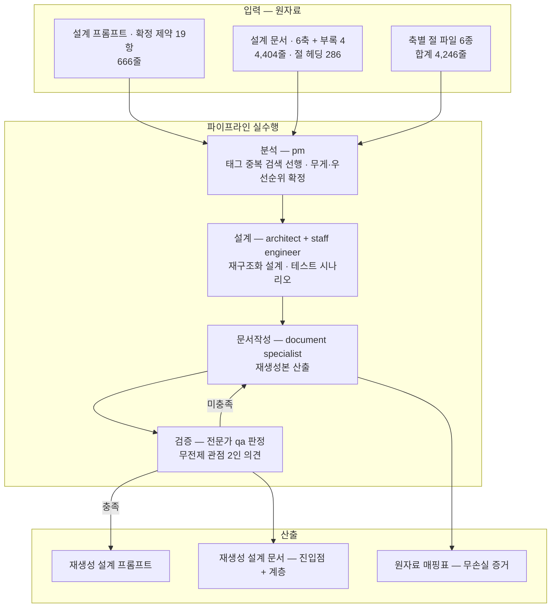
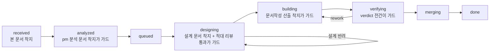

# 하네스 설계 프롬프트·설계 문서의 파이프라인 재생성

## 요약

기 산출된 **설계 프롬프트**(확정 제약 19항을 담은 스펙)와 **설계 문서**(그 스펙의 산출)를, 사람의 손으로 고쳐 쓰는 것이 아니라 **분석 → 설계 → 문서작성 → 검증 파이프라인을 실제로 돌려** 새 문서 규격으로 다시 만들라는 요청이다.

요청의 발단은 형태에 대한 평가다 — 문면 그대로 "너무 많아서 말 그대로 인간적으로 쉽지 않네". 여기서 **무엇이 문제가 아닌지**를 먼저 고정한다: 기존 설계 문서의 내용은 적대 리뷰 1라운드와 자기 일관성 정정을 통과했으므로 폐기 대상이 아니라 **원자료**다. 문제는 내용이 아니라 형태이며, 형태 문제의 해소 수단도 문면으로 확정돼 있다 — "분량 상한 250줄은 필요없다. 사람이 볼게 아니라 클로드가 분석할 프롬프트 문서이기 때문에". 즉 **줄 수 축소는 해법에서 배제되고**, 남는 수단은 구조화·중복 제거·항해 가능성이다.

| 축 | 확정된 것 | 근거 문면 |
|---|---|---|
| 수행 방식 | 사람이 문서를 고쳐 쓰는 것이 아니라 파이프라인 실수행 | §14 "실제로 해봐" |
| 대상 범위 | 대시보드 요청 프롬프트 + **설계 프롬프트** | §16 정정 |
| 분량 | 상한 없음 · 완전성 우선 | §17 |
| 소비자 | 사람이 아니라 분석 주체(모델) | §17 |
| 원자료 취급 | 기존 설계 문서는 폐기가 아니라 입력 | 요청 접수 시 확인(본문 '판독' 절) |
| 전 문서 공통 제약 | 아부성 발언 금지 — 어기지 못하는 구조화 장치 동반 | §15 · 스펙 §2-19 |

완료 판정의 정본은 아래 `## 완료 기준`의 기계 판독 블록이다. 본 요약이나 뒤따르는 해설은 판정 근거가 아니다.

## 원문

의사결정권자 발화 원문의 해당 문면을 무수정 전사한다. 전사 시 적용한 정제는 이 절 말미의 정책 표에 전건 명시한다 — 정제 외의 표현·오탈자·문장부호는 손대지 않았다.

### 원문 A — 재생성 지시 (§14, 2026-07-29 01:48:11 KST)

> 대체로 나쁘지 않다. 그런데 너무 많아서 말 그대로 인간적으로 쉽지 않네. 그래서 다시 요청한다. 원래의 프롬프트 디자인 문서를 [pm 역할]이 분석하고 나머지 에이전트들이 설계부터 문서 작성, 검증 워크플로를 실제로 해봐. qa 에이전트 신규와 문서전문가까지 에이전트까지 설치하고서 필요한 스킬들도 다 설치하고, 대시보드도 실제 구현이 될때 디자이너와 프론트엔드 개발자가 프론트엔드디자인 스킬을 쓸거라고 기대하지만 혹시 모르니 명시화도 하고, [선행 운영]의 대시보드에서 제공되는 기능들 중 필요하다고 판단되는 기능들은 승계되면 좋겠네. 마찬가지로 대시보드 설계 프롬프트 문서를 작성해달라는 요청을 새 하네스 스펙으로 작성해줘

### 원문 B — 재생성 범위 정정 (§16, 2026-07-29 01:57:42 KST)

> 대시보드 요청 프롬프트만 다시 하는게 아니라 설계.프롬프트도 같은 방식으로 재 생성이다

### 원문 C — 분량 상한 철회 (§17, 2026-07-29 02:00 무렵)

> 분량 상한 250줄은 필요없다. 사람이 볼게 아니라 클로드가 분석할 프롬프트 문서이기 때문에

### 원문 D — 아부 금지 규율 (§15, 2026-07-29 01:55 무렵 · 본 요청의 산출 전건에 걸리는 제약)

> 아 핵심적인 규율이 원래 디자인 문서에서 누락됐다. 절대로 아부성 발언은 금지다!!!!

> 이것 떠한 어기지 못하는 구조화 장치가 설계되어야한다

### 전사·정제 정책

| 원 표현 자리 | 전사 표기 | 근거 |
|---|---|---|
| 에이전트 고유 이름 1건 | `[pm 역할]` | 이름은 개인 설정 사안이며 언급 불요라는 확답(§8 해당 항) + 공유 전제 정제 지시(§7) |
| 선행 하네스 판 표기 1건 | `[선행 운영]` | 공유 전제이므로 선행 판의 존재·흔적·함의를 제거하고 필요하면 풀어 설명하라는 지시(§7 요지 인용) |
| 개인 호칭 | `의사결정권자` | 〃 |

- 정제는 **치환과 그 사실의 명시**로만 수행했다 — 문면 삭제·요약·의역은 하지 않았다.
- 원문 A는 본 요청 범위 밖의 지시(에이전트·스킬 설치, 대시보드 관련 3건)를 함께 담고 있다. 원문은 자르지 않고 전문 전사하되, 어느 문면이 어느 요청으로 가는지는 '범위 분할' 절의 표가 정본이다.

## 완료 기준

```yaml
criteria:
  - what: "분석·설계·개발(문서작성)·검증 4단계가 실제로 수행되고 각 단계 산출 문서가 착지한다 — 사람이 문서를 직접 고쳐 쓰는 경로는 불가"
    how: "산출 트리에서 stage 필드가 analysis·design·dev·verification 인 DS 문서를 각각 조회하고, 각 문서의 refs.request 값을 본 요청 ID와 대조"
    pass: "4단계 각 1건 이상 착지 · refs.request 일치율 4/4 · 단계를 건너뛴 상태 전이 0건"
  - what: "재생성된 설계 프롬프트와 설계 문서가 새 문서 규격을 만족한다"
    how: "각 산출 파일의 경로·파일명·frontmatter·필수 절을 문서 체계 축 스키마(§1.2 경로 · §2 파일명 · §4 frontmatter · §5 원본+요약 구조)와 대조"
    pass: "필수 필드 결손 0건 · 필수 절 결손 0건 · 경로/파일명 문법 위반 0건 · 요청자·작성자·표시명 표기 누락 0건"
  - what: "원자료 무손실 — 기존 설계 문서의 확정 사항이 재생성본에서 소실되지 않는다"
    how: "기존 설계 문서의 규율 항목 39건(R1~R39)·코드펜스 밖 절 헤딩 286건·부록 4종의 각 항목이 재생성본의 어느 위치로 갔는지 1:1 매핑표를 산출물에 포함시키고, 매핑 대상 실재를 대조"
    pass: "매핑표에 누락 항목 0건 — 통합·이동·삭제는 허용하되 삭제 행은 삭제 근거가 비공백이어야 한다"
  - what: "항해 가능성 — 임의의 주제를 진입점에서 2홉 이내에 찾을 수 있다"
    how: "①진입점 문서(목차·역할별 읽기 경로) 실재 확인 ②재생성본 전체에서 절 번호 중복 집계 ③표본 주제 10건을 진입점에서 추적해 도달까지 연 문서 수를 센다"
    pass: "진입점 문서 1건 이상 · 동일 문서 내 절 번호 중복 0건 · 표본 10건 전부 2홉 이내 도달"
  - what: "중복 제거 — 같은 계약이 두 곳에서 정의되지 않는다"
    how: "재생성본에서 동일 계약(필드·상태 enum·판정식·파일 계약)의 정의 위치를 전수 수집해 정본 1곳 원칙과 대조"
    pass: "이중 정의 0건 — 또는 전건이 '정본 위치 + 참조만' 형태로 표기"
  - what: "분량 상한이 적용되지 않았음 — 인위적 축약으로 인한 내용 소실이 없다"
    how: "산출물 전문에서 지면·분량 사유의 축약 고지 표현을 스캔하고, 기준 3의 매핑표와 교차 확인"
    pass: "분량 사유 축약 고지 0건 · 매핑표의 삭제 행 중 사유가 '분량'인 행 0건"
  - what: "아부성 발언 금지가 산출 전건에서 지켜진다"
    how: "산출 문서 전문에 대해 품질 상찬·동의 대체 표현 스캔을 돌리고, 검증 단계에서 전문가 qa가 판독"
    pass: "스캔 검출 0건 · qa 판독에서 해당 지적 0건"
  - what: "검증 단계가 3렌즈로 수행된다 — 전문가 qa 판정 + 무전제 관점 2인 의견"
    how: "검증 단계 산출 문서에서 판정 주체와 의견 제시 주체를 표시명으로 확인하고, 각 의견의 채택/기각과 그 근거 기재를 확인"
    pass: "전문가 qa 판정 1건 · 무전제 관점 의견 2건 이상 · 전 의견에 처리 결과와 근거 비공백 · 의견 주체가 판정한 항목 0건"
  - what: "최종 산출 전건이 정제 스캔을 통과한다"
    how: "정제 목록의 각 패턴을 산출 파일 전건에 대해 grep"
    pass: "패턴별 검출 0건 — 정제 불가 항목이 있으면 그 사유와 대체 표기가 문서에 명시"
```

## 원문 요건 ↔ 완료 기준 대응

| 원문 문면 | 완료 기준 항목 |
|---|---|
| §14 "[pm 역할]이 분석하고 나머지 에이전트들이 설계부터 문서 작성, 검증 워크플로를 실제로 해봐" | 1 (4단계 실수행) · 8 (검증 3렌즈) |
| §16 "설계.프롬프트도 같은 방식으로 재 생성이다" | 1 · 2 (대상에 설계 프롬프트 포함) |
| §14 "너무 많아서 말 그대로 인간적으로 쉽지 않네" | 4 (항해 가능성) · 5 (중복 제거) |
| §17 "분량 상한 250줄은 필요없다 … 클로드가 분석할 프롬프트 문서" | 3 (무손실) · 6 (축약 금지) |
| §15 "절대로 아부성 발언은 금지다" + "어기지 못하는 구조화 장치" | 7 (아부 금지 준수) |
| 공유 전제 정제 지시(§7) | 9 (정제 스캔 0건) |
| §14 "새 하네스 스펙으로" | 2 (새 문서 규격 착지) |

## 판독 — §14와 §17의 문면 긴장

두 문면은 표면적으로 반대 방향을 가리킨다. 이 요청을 수행하는 쪽이 임의로 한쪽을 고르면 산출이 갈리므로, 판독을 여기서 고정한다.

| | §14 | §17 |
|---|---|---|
| 문면 | "너무 많아서 말 그대로 인간적으로 쉽지 않네" | "사람이 볼게 아니라 클로드가 분석할 프롬프트 문서" |
| 함의 | 사람이 읽기 어렵다 = 형태 불만 | 사람 가독성은 판정 기준이 아니다 |
| 시각 | 01:48:11 KST | 약 12분 뒤 |

**판독(요청 접수 시 확인된 해석)**: §17은 §14의 형태 불만을 취소한 것이 아니라 **해소 수단에서 분량 축소를 제거**한 것이다. 불만은 유효하고, 남은 수단은 구조화·중복 제거·항해 가능성 세 가지다. 이 판독의 근거는 §17 문면 자체다 — "상한은 필요없다"는 분량 축소의 철회이고, "클로드가 분석할"은 소비자 지정이지 형태 무관심 선언이 아니다.

〔이 절은 판독이며 pm 분석 단계의 확정 대상이다. 분석에서 다른 판독이 나오면 그 판독이 이 절을 대체하고, 대체 사실을 분석 문서에 기재한다.〕

## 재생성 대상의 현 상태 실측

재생성의 입력이 되는 두 문서를 착지 시점에 실측했다. 재생성 착수 시 재측정한다 — 아래 값은 측정 시점 값이다.

**측정 방법**: 줄·바이트·문자 = `wc -l/-c/-m`. 헤딩 = 코드펜스 토글 후 `^#{1,4} ` 집계(코드 주석의 `#`을 제외하기 위함). 절 길이 = 코드펜스 밖 `## ` 경계 간 줄 수. 참조 = `§` 및 `§N.M` 패턴 grep. 규율 항목 = `[R숫자]` 패턴 grep 후 유일값 집계.

| 지표 | 설계 문서 | 설계 프롬프트(스펙) |
|---|---|---|
| 줄 수 | 4,404 | 666 |
| 바이트 / 문자 | 408,113 / 232,829 | 97,655 / 46,593 |
| 헤딩 수(코드펜스 밖) | 286 — h1 11 · h2 79 · h3 178 · h4 18 | 43 — h1 1 · h2 13 · h3 29 |
| mermaid 블록 | 38 | 13 |
| 표 행 수 | 1,041 | 25 |
| 절 참조 `§` | 1,503건 (이 중 `§N.M` 형태 1,027건) | 121건 |
| 규율 항목 | 39건 (R1~R39, 번호 중복 0) | — |
| `## ` 절 길이 | 최소 6 · 중앙값 42 · p90 119 · 최대 351줄 | — |
| 최장 절 | 5장 "설치 트랜잭션" 351줄 | — |

**형태 문제의 실측 근거 3건**

1. **절 번호가 장마다 재시작한다.** `## 0.`~`## 10.` 각 번호가 문서 안에서 5회씩 등장한다. `§4.2` 같은 참조 1,027건이 "어느 장의 §4.2인가"를 문면 맥락에 의존해 해석해야 한다.
2. **개요와 상세가 한 층에 있다.** 최장 절 351줄과 최단 절 6줄이 같은 헤딩 깊이에 놓여 있어, 훑기와 파고들기가 분리되지 않는다.
3. **원천은 이미 분리돼 있고 조립본만 단일 파일이다.** 축별 절 파일 6개(합계 4,246줄)가 별도로 존재한다. 즉 재구조화의 출발점은 백지가 아니다.

**수치 불일치 1건(보고)**: 본 요청을 지시한 디스패치 프롬프트는 설계 문서를 4,369줄로 기재했으나 착지 시점 실측은 4,404줄이다(차이 35줄, 파일 mtime 2026-07-29 02:01:46 KST). 원인은 미확인이며 측정 시점차 가능성이 있다 — 정본은 파일이므로 착수 시 재측정한다.

## 범위 분할 — 본 요청 · 형제 요청

원문 A는 서로 다른 산출을 낳는 지시 4건을 한 발화에 담고 있다. 본 요청이 무엇을 완료 판정 대상으로 삼는지 고정한다.

| 원문 A의 문면 | 귀속 | 원장 상태 |
|---|---|---|
| "설계.프롬프트도 같은 방식으로 재 생성"(§16) + "실제로 해봐" | **본 요청** | 본 문서 |
| "대시보드 설계 프롬프트 문서를 작성해달라는 요청을 새 하네스 스펙으로 작성해줘" | 형제 요청 | `RQ-20260728T165829Z-f3ccf365` 등재됨 |
| "프론트엔드디자인 스킬을 쓸거라고 기대하지만 혹시 모르니 명시화" · "[선행 운영]의 대시보드 기능 승계" | 형제 요청(위와 동일 건) | 〃 |
| "qa 에이전트 신규와 문서전문가까지 에이전트까지 설치하고서 필요한 스킬들도 다 설치" | 선행 요건 | **원장 미등재 — 등재 필요** |

- 에이전트·스킬 설치는 본 요청의 완료 기준 1·8(4단계 실수행, 3렌즈 검증)이 성립하기 위한 **선행 요건**이다. 등재되지 않은 일은 완료 기준을 갖지 못하므로, pm 분석 단계에서 별도 요청으로 등재하고 `depends_on`에 반영한다.
- 위 표에 없는 문면(§14 첫 문장의 평가)은 요청의 동기이지 산출 대상이 아니다.

## 처리 경로



상태 전이는 파이프라인 축의 전이표만 따른다. 아래는 본 요청이 밟을 경로다.



## 스케줄링 입력

- `priority: 80`(잠정) — 근거: §16은 §14의 범위를 넓힌 **정정 발화**이고, 본 요청의 산출(재생성 설계 프롬프트)은 형제 요청인 대시보드 프롬프트가 준거로 삼는 규격을 바꿀 수 있다. 즉 요청 DAG에서 상위 스트림이다. 수치 자체는 측정값이 아니라 정책 입력이며 pm 분석에서 확정한다.
- `weight: null` — pm 기입 필드. 무게 분류는 체크리스트 판정이고 재량은 상향만.
- `depends_on: []` — 착지 시점 등재된 선행 요청 0건. 단 '범위 분할' 절의 선행 요건(에이전트·스킬 설치)이 등재되면 그 ID가 여기 들어온다.

## 관측 — 스키마 축에 보고할 항목 1건

frontmatter의 `status`(공통 필드)와 `state`(RQ 전용 필드)가 RQ에서 동일 enum을 가리켜 같은 값이 두 자리에 적힌다. 같은 사실이 두 필드에 있으면 갈림 표면이 되므로, 문서 체계 축의 미해소 지점으로 분석 단계에 보고한다. 본 문서는 두 필드를 같은 값으로 채워 두었다 — 임의로 한쪽을 생략하면 게이트 대조가 불가능해지기 때문이다.

## 참조

새 문서 체계의 ID를 아직 보유하지 않은 원천은 식별 정보로 기재한다. 저장소 경로 리터럴 중 정제 목록에 걸리는 것은 본문에 싣지 않는다 — 로컬 인덱스에서 제목으로 해석한다.

| 구분 | 식별 | 해당 절 |
|---|---|---|
| 발화 원문 전사 | 인테이크 카테고리 · 2026-07-28 등재 · 신규 하네스 추가 지시 전사 문서 | §14 · §15 · §16 · §17 (원문) · §7 · §8 (정제·확답 근거) |
| 확정 제약 스펙 | `docs/design/harness-design-prompt-shared.md` | §2 확정 제약 19항(§2-19 아부 금지 포함) · §3.5 메타데이터 · §3.9 단계 산출 |
| 설계 문서(원자료·문서 규격 정본) | `docs/design/harness-design.md` | 1장 §1.2 · §2 · §4 · §5 · §6.2 · §7 (트리·파일명·스키마·착지·상태·태그) |
| 형제 요청 | `RQ-20260728T165829Z-f3ccf365` | 대시보드 설계 프롬프트 작성 |

frontmatter `refs` 슬롯(analysis·design·dev·verification·adjudications)은 각 단계 산출 착지 시 자동 기입된다 — 착지 시점의 공집합은 미완성 표시가 아니라 `received` 상태의 정상값이다.
