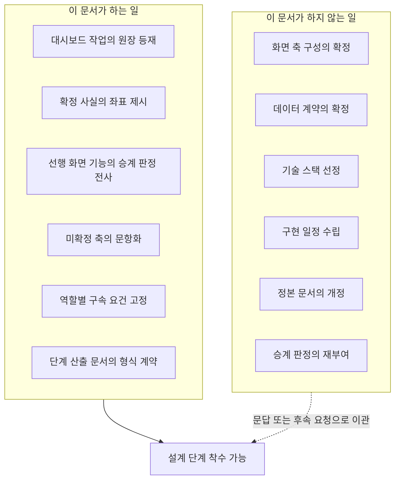
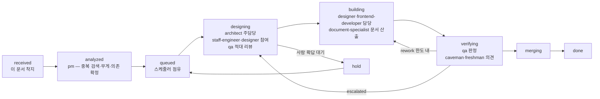
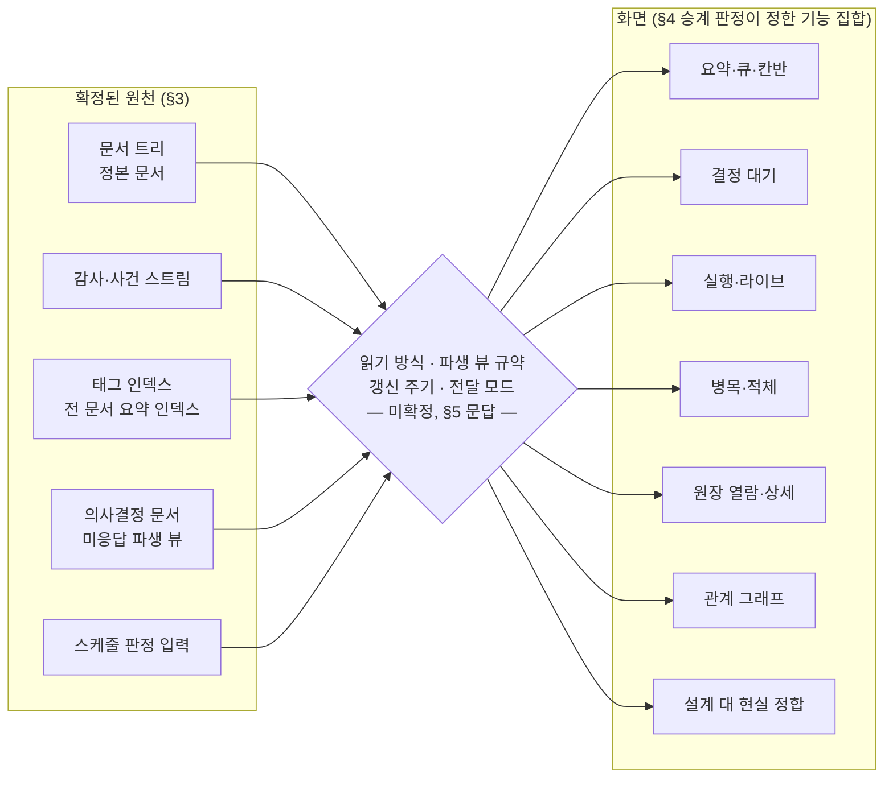
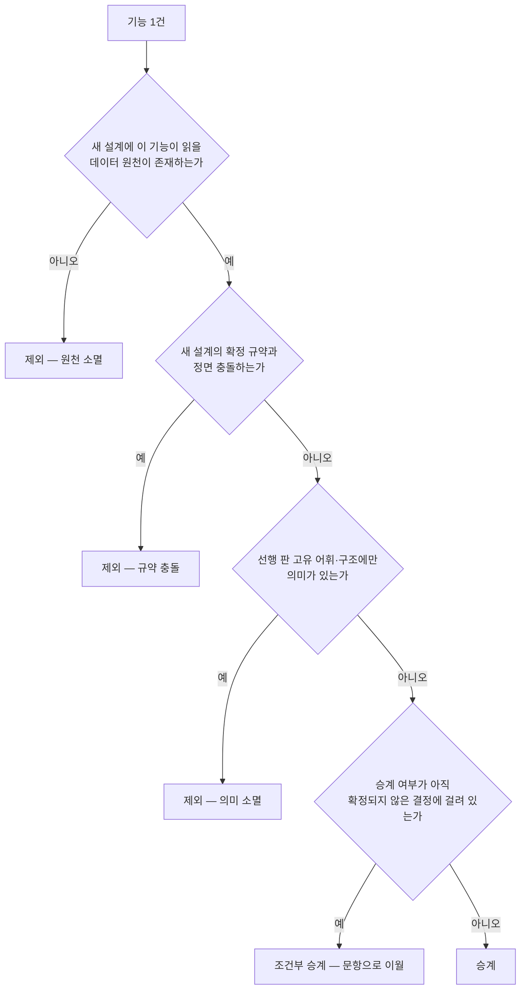
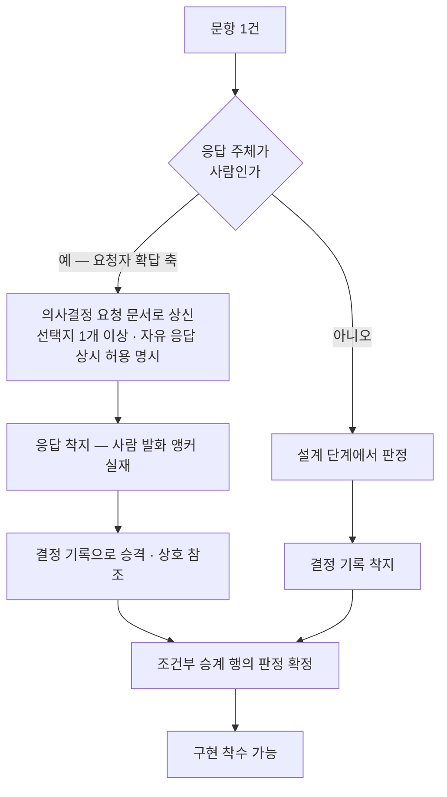
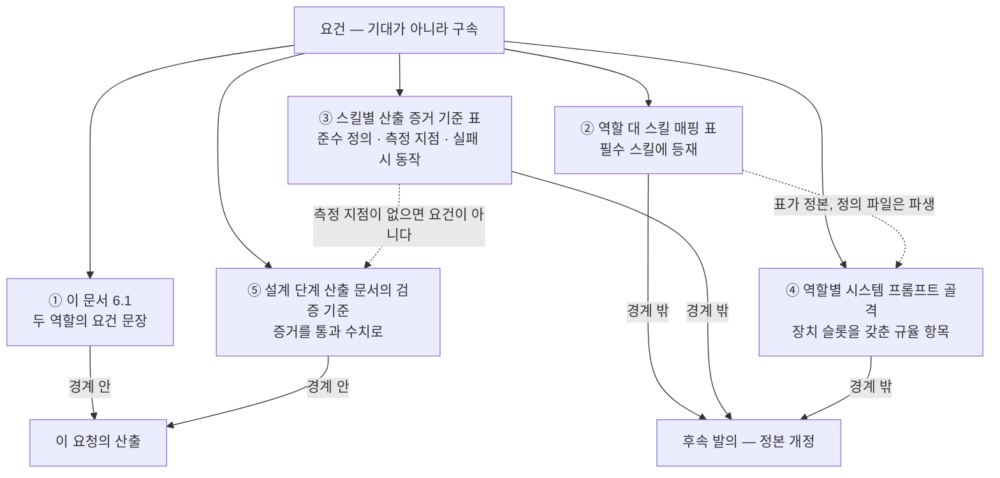
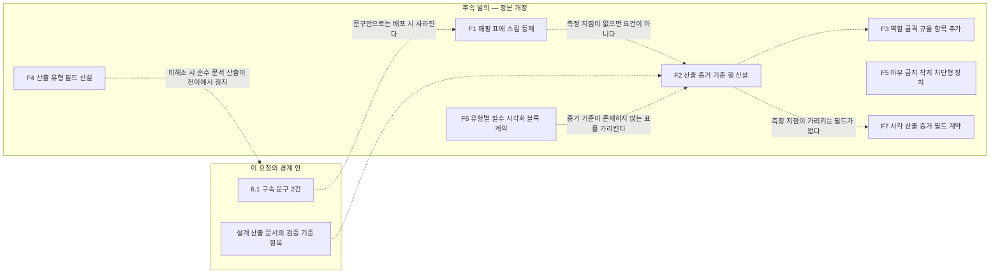

## 요약

소비자: `pm`@`analyzed`, `architect`@`designing`

**범례 — 절 머리의 `소비자:` 행.** 그 절을 실제로 읽어야 하는 역할과 그때의 단계를 `역할키`@`상태` 꼴로 적은 것이다. 누가 이 절을 펼쳐야 하는지 고르는 안내이며, 착지 게이트가 조회하는 필드가 아니다. `all`@`*` 는 전 단계가 함께 보는 절을 뜻한다. 감싸기 표기의 사유는 §10.2에 있다.

하네스 운영 대시보드를 만드는 작업의 요청 원장이자, 그 설계 플로우가 소비할 프롬프트다. 이 문서는 세 가지를 동시에 만족시키려고 쓰였다.

| 성립 조건 | 이 문서에서의 자리 | 만족하지 못하면 |
|---|---|---|
| **원장 등재** — 대시보드 작업이 요청 문서로 실재한다 | 이 문서 자신(유형 `RQ`) | 완료 판정이 프롬프트를 향하는 자기참조가 된다 |
| **실행 폐포**(이 문서 안에서 착수가 닫히는 성질 — **착수**의 기준이지 검증의 기준이 아니다. 판정 근거를 재확인하려면 §2가 지목한 정본을 연다) — 설계·구현 담당이 다른 문서를 열지 않고 착수할 수 있다 | §3 확정 사실 · §4 승계 판정 · §6 역할 구속 | 담당마다 정본을 각자 해석해 산출이 갈린다 |
| **미확정 축 보존** — 아직 정해지지 않은 것을 정해진 것처럼 적지 않는다 | §5 설계 문답 · §7 비목표 | 요청자 확답 사항이 프롬프트 작성자 판단으로 확정된다 |

**확정/미확정 경계 한 줄**: 대시보드가 소비할 원천(문서 트리·상태 어휘·감사 스트림·인덱스·의사결정 문서)의 **착지 형태는 이미 확정**이고, 대시보드가 그것을 **어떻게 읽고 얼마나 자주 갱신하며 어떤 표면으로 전달할지는 미확정**이라 §5 문답이 정한다.

**완료 판정의 정본은 이 문서의 `## 완료 기준` 블록이다.** 이 요약도, 후속 디스패치 프롬프트의 요약·의역도 그 블록을 대체하지 않는다.

## 원문

소비자: `pm`@`analyzed`

의사결정권자 발화 중 이 요청을 발생시킨 문면이다.

> 대시보드도 실제 구현이 될때 디자이너와 프론트엔드 개발자가 프론트엔드디자인 스킬을 쓸거라고 기대하지만 혹시 모르니 명시화도 하고, [선행 하네스]의 대시보드에서 제공되는 기능들 중 필요하다고 판단되는 기능들은 승계되면 좋겠네. 마찬가지로 대시보드 설계 프롬프트 문서를 작성해달라는 요청을 새 하네스 스펙으로 작성해줘

> **[대시보드 데이터 계약]** 이건 대시보드 설계 플로우에서 문답이 있어야지

> … 그리고 이어서 대시보드 요청 프롬프트까지 만들어줘.

> 분량 상한 250줄은 필요없다. 사람이 볼게 아니라 클로드가 분석할 프롬프트 문서이기 때문에

**인용 변형 고지 — 치환 한 건**: 첫 인용의 선행 하네스 지시어 한 토큰을 `[선행 하네스]`로 치환했다. 근거는 같은 발화가 별도로 지시한 공유 전제다 — 이 문서는 타인 공유를 전제로 작성되며, 선행 판의 고유 식별자·흔적은 남기지 않고 필요한 내용은 풀어서 적는다. 그 외 문면은 무수정이다.

**생략 표기 두 건**: 셋째 인용은 앞부분을 `…`로 생략했다(생략분은 대시보드와 무관한 설계 착수 승인 문면). 넷째 인용은 발화 단위 전체이며 생략이 없다 — 생략 두 건 중 나머지 하나는 첫 인용의 앞뒤 문면(리허설 지시·에이전트 설치 지시)으로, 이 요청의 요건을 구성하지 않는다.

## 완료 기준

소비자: `qa`@`verifying`

```yaml
criteria:
  - what: "승계 판정 52건(§4에서 판정이 '제외'·'조건부 승계'가 아닌 전 행)이 대시보드 화면에 착지한다"
    how: "§4 표의 행 식별자별로 해당 기능이 실렌더 화면에서 확인되는지 대조하고, 미착지 행은 사유를 검증 문서에 기록한다"
    pass: "미착지 행 0건. 사유 없이 누락된 행 0건"
  - what: "조건부 승계 12건이 전건 판정 확정 상태로 종결된다(승계 또는 제외 중 하나로 확정)"
    how: "§4 표의 조건부 행과 §5 문항 응답을 대조해 각 행의 최종 판정과 그 근거 문서를 확인한다"
    pass: "판정 미상 행 0건. 판정 확정 시점이 구현 착수 이후인 행 0건"
  - what: "§5 문항 전건에 응답 문서가 착지한다"
    how: "사람 확답 계층은 의사결정 요청 문서의 응답 필드 실재를, 에이전트 결정 계층은 결정 기록 문서의 착지를 각각 조회한다"
    pass: "응답·결정이 착지하지 않은 문항 0건. 응답 없이 구현으로 넘어간 문항 0건"
  - what: "designer·frontend-developer 산출에 frontend-design 스킬의 산출 증거가 동반된다"
    how: "§6의 산출 증거 기준 3요소를 화면 산출 문서에 적용한다 — 준수 정의 항목별로 기록 존재를 확인하고, 측정 지점의 계약이 미착지인 구간은 검증 단계의 수기 대조로 대체하고 대체 판정임을 기록한다"
    pass: "증거 결손 산출 0건. 대체 판정을 미기록으로 통과시킨 건 0건"
  - what: "화면 산출의 완료 주장에 실렌더 증거 참조가 존재한다"
    how: "완료 주장 문서에서 실렌더 증거 참조를 추출하고 참조 대상 실재를 확인한다. 증거 바이너리는 문서 트리에 두지 않고 별도 보관소에 두며 문서에는 경로만 적는다"
    pass: "실렌더 증거 참조 없는 완료 주장 0건. 문서 트리에 착지한 증거 바이너리 0건"
  - what: "횡단 승계 축(접근성 · 삽입 공격 하드닝 · 파일 화이트리스트 기본 거부 · 노출 시 민감 필드 억제)이 이행된다"
    how: "§4 표의 해당 행 식별자별로 구현 지점을 지목하고, 억제 미보장 시의 동작이 '차단'인지 '마스킹 폴백'인지를 실물에서 확인한다"
    pass: "미이행 행 0건. 억제 미보장 상태에서 화면이 제공되는 경로 0건"
  - what: "대시보드의 산출 문서·화면 문구에 아부성 발언·품질 상찬이 없다"
    how: "§8이 수록한 금지 어휘 사전으로 각 산출 문서와 화면 문자열을 어간 매칭 검색하되 인용 블록과 코드 펜스는 제외하고, 검출 행마다 사실 서술로 대체 가능한지 판정한다"
    pass: "검출 0건"
  - what: "화면 산출본·스냅샷이 파생물 디렉토리 하위에 놓이고 문서 트리에는 경로만 남는다"
    how: "산출본 파일의 착지 경로를 문서 트리 경로 규약과 대조한다"
    pass: "문서 트리에 착지한 파생 산출본 0건"
  - what: "대시보드가 표시하는 수치에 측정 불능과 값 0이 구별되어 표기된다"
    how: "계측되지 않은 축을 의도적으로 만든 상태에서 화면을 렌더하고 해당 패널의 표기를 판독한다"
    pass: "미계측을 0으로 표기한 패널 0건"
  - what: "이 요청의 산출 문서에 선행 판 고유 식별자·실경로·비공개 신원이 남지 않는다"
    how: "§8이 수록한 새니타이즈 금지 토큰 사전으로 전문을 검색하고, 경로형 문자열을 추출해 화이트리스트 접두와 대조한다"
    pass: "금지 토큰 검출 0건. 화이트리스트 밖 경로형 문자열 0건"
```

---

## 1. 목적과 범위 경계

소비자: `architect`@`designing`

**이 문서 자체는 프롬프트 문서 한 건이고 대시보드 구현물이 아니다.** 이 문서는 대시보드 작업을 원장에 세우고 설계 플로우에 입력을 공급한다. 대시보드를 설계하지도, 구현하지도 않는다. 구현 일정과 기술 스택 선정은 이 문서가 담지 않으며, 그 판단은 설계 단계 소관이다.

대시보드가 하네스 초기 범위에서 제외되고 설치 완료 후 첫 요청 대상이라는 지위는 §10이 가리키는 확정 제약 스펙의 해당 항이 정본이다 — 여기서 그 근거를 다시 쓰지 않는다.

### 1.1 이 문서가 하는 일과 하지 않는 일



### 1.2 이 요청의 처리 경로



`hold` 경유가 이 요청에서 실제로 발생한다 — §5의 사람 확답 계층 문항이 응답되기 전에는 화면 축 구성과 전달 형태를 확정할 수 없기 때문이다. 재개 목적지는 `queued`이며, 재개 가드는 응답이 착지한 의사결정 요청 문서의 실재다.

---

## 2. 준거 정본 포인터

소비자: `architect`@`designing`, `document-specialist`@`building`

아래 문서들이 정본이다. **각 담당은 착수 전에 해당 절의 전문을 직접 읽는다.** 이 문서는 정본의 내용을 요약하거나 의역하지 않는다 — 요약이 원문을 대체하면 후속 판정이 정본이 아니라 요약을 향한다.

경로는 **저장소 루트 기준 상대 경로**로 적는다. 실경로 리터럴은 이 문서에 수록하지 않는다(공유 전제 — §9 규율 항목).

| 구분 | 경로(저장소 루트 기준) | 해당 절 | 이 요청에서 쓰이는 이유 |
|---|---|---|---|
| 하네스 설계 문서 | `docs/design/harness-design.md` | 1장 §1.1·§1.2(트리·경로) · §1.5(가시성 판정) · §2(ID·파일명) · §4.1·§4.2(frontmatter 스키마) · §4.4(규율 항목 표기) · §5.1·§5.2(본문 구조·착지 게이트) · §7(태그·인덱스) | 대시보드가 소비할 문서 원천의 착지 형태, 그리고 이 요청의 단계 산출 문서가 지켜야 할 스키마 |
| 하네스 설계 문서 | `docs/design/harness-design.md` | 2장 §1.1(상태 enum 11종) · §1.2(실행 엔진 필드) · §1.3(전이표·가드) · §4.1(스케줄링 입력) | 칸반·큐·병목 패널이 사상할 상태 축과 스케줄링 축의 정본 |
| 하네스 설계 문서 | `docs/design/harness-design.md` | 3장 §2.1(역할 키) · §2.2(투입 매트릭스) · §5.2(역할별 골격) · §9.1(역할↔스킬 매핑) · §9.2(준수 측정 원칙) · §9.3(스킬별 산출 증거 기준) | §6 역할 구속의 근거이자, 그 구속이 착지해야 할 자리 |
| 하네스 설계 문서 | `docs/design/harness-design.md` | 4장 D.2(감사 스트림 계약·기록 방식) · D.4(의사결정 문서) · D.5(통지 채널) · D.6(기아 에이징·에스컬레이션) | 실행·라이브·결정 대기·병목 패널이 읽을 원천의 착지 규약 |
| 확정 제약 스펙 | `docs/design/harness-design-prompt-shared.md` | 대시보드 지위 항 · 네이티브 우선 항 · 시각화 의무 항 · 아부 금지 항(착지 차단형 장치 필수) · 스킬 준수 측정 항 | 범위·장치 형태·문서 품질의 상위 제약 |
| 선행 대시보드 실물 | **좌표는 아직 비어 있고, 실물은 저장소 탐색으로 열린다.** 설정 키 `legacy_dashboard_root` 는 하네스 설치 축이 `config/local/` 을 만들 때 **생성될 위치**를 가리키며 그 전에는 값도 디렉토리도 없다 — 실측: 저장소 전체에 `find -type d -path "*config/local*"` 1회, 0건(2026-07-29 06:10 KST 재현). 이 관측이 말하는 것은 **좌표의 미존재**이지 실물의 부재가 아니다 | §4 승계 판정의 조사 대상 | 조사와 판정은 이미 끝났고 결과는 §4 에 전사돼 있다. 재조사도 이행 가능하다 — 저장소 루트에서 화면 소스 파일명 패턴으로 `find` 1회 하면 단일 화면 소스 1건이 나오고, 그 파일에 `wc -l` 1회가 7,806줄로 상위 원장·분석 문서 기재값과 일치한다(2026-07-29 06:10 KST 재현). 실경로 리터럴은 이 문서에 싣지 않으므로(§9 R7) 도달은 좌표가 아니라 이 탐색 절차로 지시한다 |

**정본과 이 문서가 어긋나면 정본을 따른다.** 어긋남을 발견하면 그대로 이행하지 말고 관측으로 기록한 뒤 정본 기준으로 수행한다.

---

## 3. 확정 사실 인벤토리

소비자: `architect`@`designing`

대시보드가 소비할 원천 중 **착지 규약이 이미 확정된 것**이다. 여기 있는 축은 설계 문답의 대상이 아니다 — 좌표를 열고 읽으면 된다.

이 절은 원천이 **어떤 형태로 착지하는가**만 담는다. 대시보드가 그것을 **어떻게 읽는가**는 이 절에 없다(§5).

| 축 | 확정 내용 | 정본 좌표 |
|---|---|---|
| 문서 트리·경로 | 카테고리 9종 × 가시성 2값 × 연/월 샤드. 경로는 문서 ID와 가시성만으로 계산된다 | 설계 문서 1장 §1.1·§1.2 |
| 문서 ID·파일명 | 유형 코드 + UTC 시각 + 고정 길이 해시 + 장식 슬러그. 슬러그는 파싱 대상이 아니다 | 1장 §2 |
| 필수 메타·유형별 필드 | 공통 필수 필드 + 유형별 추가 필드. 필드마다 기입 주체가 확정 | 1장 §4.1·§4.2 |
| 착지 게이트 | 요약 부재·메타 결손·참조 무결성 위반·경로 불일치는 경고가 아니라 거부 | 1장 §5.2 |
| 태그 어휘·인덱스 | 축 기반 통제 어휘, 태그별 샤드 인덱스와 전 문서 요약 인덱스. 인덱스는 전부 파생물 | 1장 §7 |
| 파생물 위치 | 파생물은 파생 디렉토리 밖에 존재할 수 없다 — 문서 트리에는 정본만 | 1장 §1.1 |
| 요청 상태 어휘 | 진행형 11종. 전이는 전이표의 행으로만 일어나고, 전이마다 감사 이벤트 한 건 | 2장 §1.1·§1.3 |
| 실행 엔진 필드 | 재작업·에스컬레이션·재시작·병합 재시도 카운터, 차단 대상, 파생 원천, 세션 참조, 관측 베이스 | 2장 §1.2 |
| 스케줄링 입력 필드 | 우선·중요·의존·무게·자원 클래스·파괴성·파일 범위. 유효 우선순위는 저장하지 않고 매 틱 계산 | 2장 §4.1 |
| 감사 스트림 파일 계약 | 샤드 직치 · ID 파일명 · 헤더 자기서술 레코드 · 회전 체인 | 1장 §2.4 |
| 감사 기록 방식 | 상태형은 스냅샷 덮어쓰기, 사건형은 스냅샷 차분에서만 방출. **발화·도구 원문은 비수록** | 4장 D.2 |
| 의사결정 문서 | 별도 유형. 1문장 질문 + 선택지 배열 + 마감 + 에스컬레이션 필드 + 응답 슬롯. 자동 집행 필드는 스키마에 없다 | 1장 §4.2 · 4장 D.4 |
| 통지 채널 | 3채널 동시 발송이며, 그중 한 채널의 "발송"은 미응답 목록 파생 뷰의 착지 그 자체로 정의된다 | 4장 D.5 |
| 기아 에이징·에스컬레이션 | 대기 집합 재계산과 에스컬레이션 단계·최근 통지 시각·다음 점검 시각이 필드로 확정 | 4장 D.6 |
| 역할·투입 단계 | 역할 14종과 단계별 투입 매트릭스. 단계 밖 호출 경로는 존재하지 않는다 | 3장 §2.1·§2.2 |
| 스킬 준수 측정 | 호출 형식이 아니라 산출 증거로 측정한다 | 3장 §9.2 |



가운데 마름모가 이 요청의 설계 단계가 채워야 할 자리다. 위쪽은 이미 닫혔고 아래쪽은 §4가 정했다.

---

## 4. 선행 대시보드 기능 승계 판정

소비자: `architect`@`designing`, `designer`@`building`

**판정의 정본은 분석 문서 `DS-20260728T171325Z-d48b6682`의 승계 판정 절이다. 아래 표는 그 전사본이며, 갈리면 분석 문서가 이긴다.** 이 표에서 새 판정을 매기지 않는다 — 판정을 바꿔야 한다고 판단하면 분석 문서를 갱신하고 이 표를 다시 전사한다.

### 4.1 조사 범위와 판정 기준

조사는 선행 대시보드 실물에 대해 수행됐다. 화면 소스의 탭·패널 마크업 전수, 렌더 함수 목록, 서버 라우팅 엔드포인트, 화면이 소비하는 상태 파일의 최상위 키 — 네 축이 교차 확인되는 것만 "제공 기능"으로 셌다. 실측값과 재는 법은 분석 문서의 조사 방법 절에 남아 있다.

**대조 원천은 실물이다.** 이 표를 재확인할 때 여는 것은 분석 문서가 아니라 선행 대시보드 실물이고, 분석 문서는 그 조사의 산출이다. 두 문서를 서로 대조하면 같은 오기재를 공유한 자리는 차분에 나타나지 않으므로, 행 속성의 진위는 실물에서만 판정된다. 검증 1라운드가 이 경로로 `G1` 행의 기재 속성 한 개를 잡아냈고, 정본인 분석 문서를 먼저 고친 뒤 아래 표를 재전사했다(분석 문서 변경 이력 `C1`).



### 4.2 집계

| 판정 | 이월 처리 | 건수 | 비율 | 재는 법 |
|---|---|---|---|---|
| 승계 | 없음 | 52 | 75.4% | §4.3 의 표를 행 단위로 파싱해 판정 열을 아래 3단계로 정규화한 뒤 분류 — 재측정 2026-07-29 06:09 KST |
| 조건부 승계 | §5 문항으로 이월 | 12 | 17.4% | 같은 파싱 · 같은 실행 — 재측정 2026-07-29 06:09 KST |
| 제외 | 없음 | 5 | 7.2% | 같은 파싱 · 같은 실행 — 재측정 2026-07-29 06:09 KST |
| **합계** | — | **69** | 100% | 같은 실행에서 행 식별자 유일성 동시 확인(중복 0건) — 재측정 2026-07-29 06:09 KST |

**행 라벨 규약**: 위 세 분류 행의 라벨은 §4.3 범례가 정한 판정 열거값과 **글자 단위로 같다**. 축 이름·이월 사유 같은 부연은 라벨 안 괄호가 아니라 `이월 처리` 열로 뺀다 — 괄호로 적으면 §4.3 판정 열의 괄호 수식어와 형태가 같아져, "기계 판독 대상 아님"이라고 선언된 표기가 여기서는 분류 라벨의 일부로 읽힌다. 마지막 행은 분류 행이 아니라 총계 행이므로 라벨 대조 대상 밖이다.

**집계 방법 — 순서 고정**: ①판정 열의 강조 표기(`**`) 제거 → ②괄호 부연(§4.3 범례의 괄호 수식어) 제거 → ③남은 문자열을 판정 열거값 세 가지와 글자 단위로 대조해 분류. 순서를 지키지 않으면 값이 갈린다 — ①을 건너뛰면 판정 열에 강조가 붙은 행이 전부 열거값과 불일치로 떨어진다. 실측: 판정 열 원값 9종 · 강조 표기가 붙은 행 8 · 괄호 부연이 붙은 행 9 · 부연 종류 5이고, 3단계 정규화 후 분류가 52 / 12 / 5 다(§4.3 절 스코프를 고정해 파싱 1회, 2026-07-29 06:09 KST).

이 값은 설계 단계에서 같은 절차로 재측정해 분석 문서 기재값과 일치함이 확인됐고, 분석 문서 `G1` 정정 이후 같은 절차로 다시 실행해 값이 움직이지 않음을 확인했다.

제외 판정의 사유 분해는 **원천 소멸 1 · 의미 소멸 1 · 상위집합 흡수 2 · 구조 종속 1**이며, "쓸모없어서"인 것은 없다(제외 행의 근거 열을 사유 축으로 분류한 실측).

### 4.3 기능 목록과 판정

`문항` 열은 이 문서가 추가한 열이다 — 조건부 승계 행에만 값이 있고, 값은 §5의 문항 식별자를 가리킨다.

**판정 열의 값과 괄호 수식어 (범례)**

| 항목 | 내용 |
|---|---|
| 판정 값 (열거) | `승계` · `조건부 승계` · `제외` 셋뿐이다. 집계(§4.2)는 이 세 값으로만 분류한다 |
| 괄호 수식어 | `최우선` · `규율성` · `강` · `값 제외` · `위치 변경` 다섯 가지. 근거 열 요지를 한 낱말로 줄인 **설명 주석**이며 기계 판독 대상이 아니다 — 집계·완료 기준·후속 검증 어디에도 영향을 주지 않는다. 실측: 수식어가 붙은 행 9, 수식어 종류 5(`grep -oE` 로 판정 열 추출 후 유일화, 2026-07-29 04:03 KST) |
| `조건부 승계` 와 상위 원장의 관계 | 이 요청을 낳은 원장은 판정 열거값을 `승계`·`제외` 두 값으로 적었다. `조건부 승계` 는 그 두 값 중 하나로 아직 접히지 않은 **미확정 상태**를 가리키는 이 문서의 값이며, 열두 행이 여기 놓인다. 두 값으로의 종결은 이 문서 완료 기준의 두 번째 항목이 요구하고, 종결 방아쇠는 §5 문항의 응답이다 |

#### A. 화면 골격·전역

| # | 기능 | 답하는 질문 | 판정 | 근거 | 문항 |
|---|---|---|---|---|---|
| A1 | 상위 탭 7종으로 화면 분할 | "지금 어느 축을 보고 있나" | 조건부 승계 | 탭의 축 구성은 소비 데이터 계약에 종속된다 — 계약이 문답 대상이므로 탭 목록을 선고정하지 않는다 | Q7 |
| A2 | 전역 원장 교차 검색(어느 탭에서든 상주, 슬래시 키 포커스, 정식 ID 입력 시 해당 목록으로 직행) | "이 ID·제목이 어디 있나" | 승계 | 새 설계의 전 문서 요약 인덱스가 검색 한 번에 문맥을 주도록 이미 설계돼 있어 원천이 더 좋아진다 | |
| A3 | 라이트·다크 테마 전환과 브라우저 저장소 지속 | — | 승계 | 데이터 계약 무관, 비용 최소 | |
| A4 | 신선도 메타 줄(스냅샷 시각 표시) | "이 화면은 언제 것인가" | 승계 | 프로브 정지를 사건으로 취급하는 규율과 짝 — 시각 없는 화면은 침묵과 정상을 구별 못 한다 | |

#### B. 요약·큐·상태

| # | 기능 | 답하는 질문 | 판정 | 근거 | 문항 |
|---|---|---|---|---|---|
| B1 | 요약 타일(활성·진행·검토·차단·보류·최우선·동시성 캡 미터) | "전체 부하가 얼마인가" | 승계 | 새 상태 어휘 11종으로 축을 재사상해야 한다(선행판 어휘와 1:1 아님) | |
| B2 | 마일스톤 단계 배지 타일 | "시스템이 몇 단계인가" | 제외 | 선행판 고유 진행 어휘로, 새 설계에 대응 개념이 없다 | |
| B3 | 상태 칸반 보드(열=상태, 카드=요청) | "무엇이 어디에 몰려 있나" | 승계 | 상태가 요청 문서의 필수 필드라 원천이 확정돼 있다 | |
| B4 | 큐 필터 4축(영역·담당·우선순위·상태) | "이 조건만 보면" | 조건부 승계 | 담당·영역 축의 원천이 새 설계에서 태그 축과 이름 레지스트리로 갈린다 — 축 정의가 문답 대상 | Q8 |
| B5 | 스코프 배너(필터가 만든 범위를 명시하고, 타일·보드·그래프가 모두 같은 범위에서 파생됨을 선언) | "지금 보는 수는 전체인가 부분인가" | 승계 | 같은 사실을 두 표면이 다르게 말하는 것을 막는 장치 — 새 설계의 단일 정본 원칙과 같은 방향 | |
| B6 | 카드 배지 자동 억제 고지(전건 동일 값 축은 카드에서 빼고 상단에 한 번만 표기) | "왜 이 배지가 안 보이나" | 승계 | 정보 보존형 억제 — 지운 게 아니라 옮겼음을 화면이 말한다 | |

#### C. 사람 결정·통지

| # | 기능 | 답하는 질문 | 판정 | 근거 | 문항 |
|---|---|---|---|---|---|
| C1 | 결정 대기 배너(대기 건수·경과·근거 문서 링크, 대기가 없으면 숨김) | "내가 지금 답해야 할 게 있나" | **승계(최우선)** | 새 설계가 의사결정 문서를 별도 유형으로 두고, 통지 3채널 중 한 채널의 "발송"을 미응답 목록 파생 뷰의 착지 그 자체로 정의했다 — 소비 표면이 이 배너다. 착지는 이미 규약화됐고 화면만 없다 | |
| C2 | 결정 요약과 요청 제목의 분리 표기(좁은 요약을 헤드라인으로, 전체 제목은 부제로) | "이 결정의 쟁점이 무엇인가" | 승계 | 의사결정 문서 스키마에 1문장 질문 필드와 선택지 배열이 이미 있어 원천이 더 정밀해진다 | |
| C3 | 미응답 경과 표시 | "얼마나 방치됐나" | 승계 | 에스컬레이션 단계·최근 통지 시각·다음 점검 시각이 문서 필드로 확정돼 있다 | |

#### D. 실행·라이브

| # | 기능 | 답하는 질문 | 판정 | 근거 | 문항 |
|---|---|---|---|---|---|
| D1 | 실행 중 인스턴스 카드 목록 | "지금 무엇이 돌고 있나" | 승계 | 세션 생존 관측·고아 회수가 실행 축에 확정돼 있다 | |
| D2 | 유령·종료 레인 분리(살아 있지 않은 것을 실행 중과 섞지 않음) | "이건 죽은 건가 도는 건가" | 승계 | 침묵과 정상을 구별하라는 규율의 화면판 | |
| D3 | 머신 분포 롤업(어느 머신에 몇이 붙어 있나) | "부하가 어디 몰렸나" | 승계 | 머신 코드가 문서 필수 메타이고 배정이 자원 클래스 입력이라 원천 확정 | |
| D4 | 미계측 고지(계측되지 않은 대상 수를 0이 아니라 "미계측"으로 표기) | "0인가 못 잰 건가" | **승계(규율성)** | 텔레메트리 커버리지를 전수가 아니라 하한으로 표기하라는 규율의 직접 이행. 화면 문구는 대시보드 축 소유라고 명시돼 있다 | |
| D5 | 세션 상태 밴드(살아있음·지연·죽음) + 심박 나이 + 스폰 워커 수 | "세션이 살아 있나" | 승계 | 생존 관측이 종료 실증 인터록으로 확정돼 있다 | |
| D6 | 상태와 워커의 불변식 위반 3버킷 노출(진행 중인데 워커 없음 / 워커는 있는데 상태 없음 / 귀속 불명) | "장부와 실물이 어긋나 있나" | 승계 | 상태 정본은 원장이고 화면은 파생이라는 원칙 아래, 어긋남 자체를 표면화하는 유일한 자리 | |
| D7 | 자원·가동 현황 패널(로컬·원격 자원, 가동 워커의 경과·CPU 시간, 완료·실패, 경고, 병합 대기) | "지금 이 하네스가 건강한가" | 조건부 승계 | 원격 축은 다중 머신 편성이 설치 축에서 확정된 뒤에만 의미가 있다 | Q9 |
| D8 | 현황 값의 판정 근거 병기(정체 판정에 쓰인 경과·CPU 시간을 같은 줄에 표기) | "이 경고를 믿어야 하나" | 승계 | 수치와 재는 법을 같이 적으라는 규율의 화면판 | |
| D9 | 화면과 터미널이 같은 함수를 호출(두 표면이 다른 수를 말할 수 없음) | — | 조건부 승계 | 커스텀 최소화 원칙상 별도 터미널 도구의 존재 자체가 미확정. 원칙(단일 계산 원천)은 승계하고 구현 형태는 문답 | Q10 |

#### E. 병목·적체

| # | 기능 | 답하는 질문 | 판정 | 근거 | 문항 |
|---|---|---|---|---|---|
| E1 | 병목 구간 패널(원인별 그룹 · 체류/무활동 경과 · 관련 요청 내비) | "왜 안 나아가나" | 승계 | 기아 에이징 임계와 대기 집합 재계산이 실행 축에 확정돼 있다 | |
| E2 | 원인 분해 스트립(한 단어 "병목"을 원인 4축 카운트로 쪼갬) | "의존 때문인가 착수를 안 한 건가" | 승계 | 뭉뚱그린 한 수는 오독을 낳는다 — 선행 운영에서 실제 오독이 발생한 축이다 | |
| E3 | 적체 신호 통합 스트립(다축 신호를 상단 한 줄로) | "당장 볼 게 있나" | 조건부 승계 | 신호 축 목록이 스케줄러 판정식 확정 후에야 정해진다 | Q11 |
| E4 | 고아 요청 배너 | "책임자 없는 일이 있나" | 승계 | D6과 같은 원천, 배너는 그 중 최상위 축의 승격 표시 | |

#### F. 원장 열람

| # | 기능 | 답하는 질문 | 판정 | 근거 | 문항 |
|---|---|---|---|---|---|
| F1 | 원장 전량 목록 1벌 + 종류 칩 축(종류별 건수 표시, 인덱스 미방출 종류는 점선 구분) | "이 종류 문서가 몇 건인가" | 승계 | 새 트리는 카테고리가 9종이라 칩 축이 5→9로 넓어진다. 목록·행 렌더가 종류 무관 단일 함수라는 선행판 구조가 그대로 이득 | |
| F2 | 검색·필터·정렬 1벌을 종류 전환과 무관하게 유지 | "탭 옮기면 검색어가 날아가나" | 승계 | 상태 파편화 제거는 데이터 계약과 무관한 순수 화면 결정 | |
| F3 | 본문 키워드 온디맨드 검색(제목·ID 밖 본문까지) | "이 말이 어느 문서에 있나" | 조건부 승계 | 서버 모드 전용 기능이라 전달 모드 확정에 종속 | Q4 |
| F4 | 행 클릭 시 원문을 새 탭에서 렌더 | "원문을 보자" | 승계 | 요약 우선·전문은 필요할 때만 이라는 읽기 규율의 화면판 | |
| F5 | 인덱스 메타 표기(전체 수 / 방출 수 / 상한 — 목록이 잘렸음을 고지) | "이게 전부인가" | 승계 | 잘린 목록을 전부로 읽게 두지 않는다 | |
| F6 | 커버리지 하한 배너(정적 마크업 — 데이터가 무엇이든 항상 남고, 미커버 축을 항목별로 열거) | "이 표의 건수가 전수인가" | **승계(규율성)** | 커버리지를 하한으로 표기하라는 규율 + 산문 규율이 회귀하므로 뷰 자체에 박는다는 선행판 판단이 새 설계의 "규율은 곧 장치" 원칙과 같다. 단, 미커버 항목 목록은 새 설계 기준으로 재작성해야 한다 | |
| F7 | 종결 문서 전용 탭 | "끝난 건 뭐가 있나" | 제외 | 선행판 자신이 이미 원장 목록의 프리셋으로 위임했다 — 필터가 있는데 별도 탭을 두는 것은 같은 축의 컨트롤 2벌 | |
| F8 | 걸린 프리셋을 상시 보이는 해제 가능한 칩으로 표시 | "왜 목록이 짧은가" | 승계 | 숨은 필터 금지. F7을 제외해도 이 규율은 남는다 | |

#### G. 상세(드로어)

| # | 기능 | 답하는 질문 | 판정 | 근거 | 문항 |
|---|---|---|---|---|---|
| G1 | 상세 드로어(요청·인스턴스·역할) + 포커스 트랩 + Esc 닫기 + **문서 내 참조 체인 스택**(방문 경로 브레드크럼 · 임의 단계 복귀 · 재방문 축약 표기) | "이 항목의 속을 보자" | 승계 | 화면 상호작용 결정, 데이터 계약 무관. 되돌아가기가 브라우저 히스토리가 아니라 화면 내부 스택이므로 승계해도 URL 상태 규약이 따라오지 않는다 | |
| G2 | 요청 상세의 핵심 필드 블록(상태·우선·무게·영역·담당·세션·생성/갱신/활동/종결) | — | 승계 | 전량이 요청 문서의 확정 필드에 대응한다 | |
| G3 | 대기 사유 섹션(의존 차단 시 선행별 상태·담당·최근 이벤트 병기 — 클릭 없이 원인 가시) | "무엇이 이걸 막고 있나" | 승계 | 의존 배열이 필수 필드이고 전이마다 감사 이벤트 한 건이 확정돼 있어 원천이 완비된다 | |
| G4 | 잠정 배정 표기(확정 담당 공란일 때 "잠정 · 추인 대기") | "배정된 건가 아닌가" | 조건부 승계 | 잠정 배정이라는 개념이 새 설계에 아직 없다 — 도입 여부가 결정 사항 | Q12 |
| G5 | 참조 칩 내비게이션(문서 참조를 눌러 이동) | "근거 문서로 가자" | 승계 | 참조 슬롯이 착지 시 무결성 검증되므로 끊어진 링크가 원리적으로 줄어든다 | |
| G6 | 인스턴스 활동 타임라인 | "이 워커가 무엇을 했나" | 승계 | 감사 이벤트가 사건형으로 착지한다 | |
| G7 | **원시 발화·도구 원문 열람(실시간 꼬리 읽기 포함)** | "이 워커가 실제로 무슨 말을 주고받았나" | **제외** | 새 감사 규약이 발화·도구 원문을 적재하지 않기로 확정했다(길이·요약값만). 근거가 셋(쓰기량 지배 · 자격증명 혼입으로 공개 착지 불가 · 플랫폼 기록과 중복)이라 재론이 아니라 폐지다. 읽을 원천이 없다 | |

#### H. 관계·구조 시각화

| # | 기능 | 답하는 질문 | 판정 | 근거 | 문항 |
|---|---|---|---|---|---|
| H1 | 의존 그래프(위상 레이어링, 노드=요청, 간선=의존, 순환은 점선·적색 잔여 간선) | "무엇이 무엇을 기다리나" | 승계 | 의존 배열이 필수 필드이고 순환 검출이 스케줄러 입력이라 원천 확정 | |
| H2 | 참조 간선 포함 토글 | "설계 근거까지 보자" | 승계 | 참조 슬롯이 유형별로 확정돼 간선 종류를 구분할 수 있다 | |
| H3 | 그래프 범례·고립 노드 목록·범위 노트 | "이 색이 뭔가 / 왜 안 보이나" | 승계 | B5와 짝 | |
| H4 | 자작 인라인 그래프 렌더(외부 요청 0) | — | 승계 | 외부 의존 0은 유지해야 할 성질 | |
| H5 | 구조 다이어그램 탭(수명주기 · 데이터 흐름 · 화면 배치 와이어프레임) | "이 시스템이 어떻게 생겼나" | 조건부 승계 | 새 설계는 문서 자체에 다이어그램을 의무화했고 원문 렌더 경로(F4)가 있으므로, 별도 탭은 중복일 수 있다 | Q13 |
| H6 | 다이어그램 라이브러리 로컬 벤더링(외부 요청 0) | — | 승계 | 오프라인 성립 요건 | |

#### I. 설계↔현실 정합

| # | 기능 | 답하는 질문 | 판정 | 근거 | 문항 |
|---|---|---|---|---|---|
| I1 | 설계 요건 ↔ 실제 집행 장치 정합 매트릭스(요건 행마다 장치 착지 여부를 코드 실검증으로 대조) | "내가 설계한 것과 현실의 거리가 얼마인가" | **승계(강)** | 새 설계는 모든 규율 항목이 장치·장치 불가 슬롯을 기계 식별 가능한 표기로 갖도록 확정했다. 선행판이 사람 손으로 만들던 대조 원장이 새 판에서는 문서에서 결정론적으로 추출된다 — 승계 비용이 오히려 내려간다 | |
| I2 | 갭 헤드라인 → 오독 방지 문장 → 구성비 → 장치 사다리 → 대조 범위 → 결손 목록 순의 렌더 순서 | "이 수를 어떻게 읽나" | 승계 | 수치를 먼저 보이고 읽는 법을 나중에 주면 늦다는 배치 결정 | |
| I3 | 장치 성숙도 사다리(관측형 → 차단형 단계 구분) | "이 규율은 경고인가 차단인가" | 승계 | 새 설계도 관측형 시작 + 승격 조건 명문화를 여러 축에서 채택했다 | |
| I4 | 감사 소비 카드(수집만 되고 소비 안 된 건수와, 읽었는데 안 닫힌 건수를 **한 줄에** 병기) | "계측이 실제로 소비되고 있나" | **승계(규율성)** | 탐지-무소비 루프 금지가 설계 원칙으로 못박혀 있다. 한쪽 수만 보면 "모든 축이 초록인데 아무것도 안 닫히는" 상태를 정상으로 읽는다 | |

#### J. 그 외 화면

| # | 기능 | 답하는 질문 | 판정 | 근거 | 문항 |
|---|---|---|---|---|---|
| J1 | 역할 로스터 카드(역할·모델·요지) | "누가 무엇을 맡나" | 조건부 승계 | 이름 레지스트리가 설정 디렉토리(버전관리 밖·비공개)에 놓이도록 확정됐다 — 표시명을 공개 화면에 싣는 것이 가시성 판정 대상 | Q5 |
| J2 | 이어서 할 작업 목록 | "재개할 게 뭔가" | 승계 | 인계 문서의 재개 스키마가 확정돼 있다 | |
| J3 | 건강 지표 그리드 | "지표가 정상인가" | 조건부 승계 | 지표 축 목록이 텔레메트리 확정에 종속 | Q14 |
| J4 | 회의록 최근 목록 + 원문 딥링크 | "최근 합의가 뭐였나" | 승계 | 회의록이 독립 카테고리이고 합의 절이 필수라 원천 확정 | |
| J5 | 하단 링크 라인 | — | 제외 | F1 목록이 상위집합이다 | |

#### K. 전달·데이터·보안 (횡단)

| # | 기능 | 답하는 질문 | 판정 | 근거 | 문항 |
|---|---|---|---|---|---|
| K1 | 단일 읽기 모델(화면이 소비하는 상태 파일 한 개) + 집계는 뒤에서, 화면은 표현만 | — | 조건부 승계 | 원칙은 새 설계의 정본·파생 분리와 같은 방향이지만, 파일 형태·키 구성이 곧 데이터 계약이라 선고정 금지 대상 그 자체다 | Q1, Q2 |
| K2 | 2모드 전달(파일 스킴 정적 스냅샷 임베드 / 로컬 서버 모드) | "서버 없이도 보이나" | 조건부 승계 | 전달 모드는 데이터 계약 문답의 하위 항목 | Q4 |
| K3 | 주기 폴링 + 축별 상이 주기 | "얼마나 자주 갱신되나" | 승계(값 제외) | 주기 **값**은 정책 파일 소유 — 선고정 금지. 축별로 다른 주기를 둔다는 구조만 승계 | |
| K4 | 온디맨드 계산 엔드포인트(무거운 축을 폴링으로 재생성하지 않음) | — | 승계 | 파생물 이벤트 단위 재생성 금지 규율과 같은 뿌리(선행 운영에서 동기 쓰기 폭주 사고가 실재) | |
| K5 | 원격 노출 모드의 요청 헤더 게이트 | "외부에서 들어온 요청인가" | 승계 | 노출면 통제는 새 설계에도 대응 요구가 있다 | |
| K6 | 원격 노출 시 민감 필드 강제 억제, 억제 미보장이면 **차단**(마스킹만 된 스냅샷으로 폴백하지 않음) | — | **승계(강)** | 불확실하면 비공개를 택하라는 가시성 판정의 비대칭 규율과 정확히 같은 형태 | |
| K7 | 파일 화이트리스트 기본 거부 라우팅 | — | 승계 | 비공개 트리·볼트가 화면 경로로 새는 것을 막는 마지막 표면 | |
| K8 | 삽입 공격 하드닝(전 데이터를 텍스트 노드로, 링크는 안전 검사 경유) | — | 승계 | 문서 본문이 그대로 화면에 들어오므로 필수 | |
| K9 | 접근성(역할 속성·라이브 영역·키보드 조작·포커스 트랩) | — | 승계 | 유지 비용이 낮고 회귀하면 되찾기 비싸다 | |
| K10 | 소스와 배포 산출본 분리 + 소스 해시 대장 | "화면이 최신 소스에서 나온 건가" | 승계 | 파생물은 버전관리 밖·전부 재생성 가능이라는 원칙과 정합. 다만 산출본 위치는 파생물 디렉토리 아래여야 한다 | |
| K11 | 파생 구성물 분류 스캐너 + 선언표 대조 테스트 | "화면 코드가 선언과 어긋나 있나" | 제외 | 단일 대형 화면 소스 파일이라는 선행판 구조에 특화된 장치다. 구조가 달라지면 대조 대상 자체가 없다 | |
| K12 | 실렌더 증거 이미지 보관 | "정말 그렇게 그려지나" | 승계(위치 변경) | 화면 산출은 실렌더 증거를 동반해야 한다는 규율이 있고, 증거 바이너리는 문서 트리에 두지 않고 별도 보관소에 두며 문서에는 경로만 적는다는 규약이 이미 확정 | |
| K13 | 측정 못 한 값을 0으로 채우지 않기 | "0인가 미계측인가" | **승계(규율성)** | D4와 같은 뿌리. 전 패널 공통 표기 규율로 승격해 이 문서에 넣는다 | |

---

## 5. 설계 문답 항목

소비자: `architect`@`designing`

이 절의 문항에는 **선답이 없다.** 답은 설계 단계에서 만들어지며, 사람 확답 축은 사람이 답한 뒤에야 확정된다.

### 5.1 계층 구분



| 계층 | 대상 | 착지 경로 |
|---|---|---|
| 사람 확답 | 데이터 읽기 방식 · 파생 뷰 규약 · 갱신 주기 · 전달 모드 · 표시명의 화면 노출 가부 · 화면에서 결정에 응답 가능한가 | 의사결정 요청 → 결정 기록 |
| 에이전트 결정 | 화면 축 구성, 그리고 위 축에 종속되지 않는 조건부 승계 행 | 결정 기록 |

### 5.2 문항 형식 제약

1. 문항 본문은 **의문형 한 문장**이다.
2. 후보는 **라벨과 영향만** 적고 서술문으로 쓰지 않는다. `~로 한다`·`~를 사용한다` 형태의 종결이 문항 안에 등장하면 위반이다.
3. 각 문항에 **자유 응답 상시 허용**을 명시한다. 선택지를 하나 이상 제시하는 것은 최소 제시 의무이지 선택 강제가 아니다.
4. 추천 표식은 근거를 함께 적을 수 있을 때만 붙인다. 근거 없는 추천은 선고정과 구별되지 않는다.
5. 각 문항은 식별자를 갖고, §4의 조건부 승계 행이 이를 참조한다.

### 5.3 문항 목록

`연결 행` 열이 §4 표와의 기계 대조 대상이다. 값이 `—`인 문항은 데이터 계약·가시성 축의 문항이며 조건부 승계 행에 걸려 있지 않다.

| # | 계층 | 문항 | 후보 라벨과 영향 | 연결 행 |
|---|---|---|---|---|
| Q1 | 사람 확답 | 대시보드는 원장 문서를 어떤 경로로 읽는가? | ①문서 트리 직접 스캔 — 파생물 0, 화면 기동 시 비용이 문서 수에 비례 ②파생 인덱스 소비 — 인덱스 생성 시점에 비용을 몰고 화면은 상수 시간 ③대시보드 전용 뷰 파일 — 화면이 원하는 형태로 미리 접지만 뷰 규약이 하나 더 늘어난다. 자유 응답 상시 허용 | K1 |
| Q2 | 사람 확답 | 파생 뷰를 둔다면 어떤 단위와 키로 접는가? | ①요청 한 건 = 레코드 한 행 ②상태별 롤업 ③패널별 전용 뷰. 각 안은 화면 축이 늘어날 때 재생성 범위가 다르다. 자유 응답 상시 허용 | K1 |
| Q3 | 사람 확답 | 화면 갱신의 방아쇠는 무엇인가? | ①주기 폴링 ②원장 착지 이벤트 구독 ③사용자 요청 시 온디맨드. 갱신 주기의 구체 값은 정책 파일 소유라 이 문항의 응답에 포함되지 않는다. 자유 응답 상시 허용 | — |
| Q4 | 사람 확답 | 화면은 어떤 전달 형태로 열리는가? | ①정적 스냅샷 임베드 — 서버 없이 열리지만 본문 검색이 불가 ②로컬 서버 — 온디맨드 계산과 본문 검색이 가능하지만 기동 절차가 생긴다 ③둘 다. 자유 응답 상시 허용 | F3, K2 |
| Q5 | 사람 확답 | 에이전트 표시명을 화면에 노출하는가? | ①노출 ②역할 키로만 표기 ③로컬 열람 시에만 노출. 이름 레지스트리는 버전관리 밖 비공개 자산이므로 노출은 가시성 판정 사안이다. 미확답 구간의 기본값은 비노출이다 — 잘못 비노출한 것은 되돌릴 수 있고 잘못 노출한 것은 되돌릴 수 없다. 자유 응답 상시 허용 | J1 |
| Q6 | 사람 확답 | 화면에서 사람이 의사결정에 응답할 수 있어야 하는가? | ①읽기 전용 — 응답은 터미널 경로로만 ②화면에서도 응답 가능. 의사결정 문서의 응답 필드에 응답 경로 열거값이 있으나 화면 쓰기 경로는 설계된 바 없다. 자유 응답 상시 허용 | — |
| Q7 | 에이전트 결정 | 화면을 어떤 축으로 나누는가? | ①선행 판의 탭 구성을 상태 어휘 11종으로 재사상 ②소비 뷰 단위로 재편 ③단일 화면 + 필터. Q1·Q2 응답에 종속된다. 자유 응답 상시 허용 | A1 |
| Q8 | 에이전트 결정 | 큐 필터의 담당·영역 축은 어느 원천에서 오는가? | ①태그 축 ②이름 레지스트리 ③둘의 조합. Q5 응답이 담당 축의 표기 형태를 제약한다. 자유 응답 상시 허용 | B4 |
| Q9 | 에이전트 결정 | 자원 현황 패널에 원격 축을 포함하는가? | ①포함 ②로컬만 ③원격 편성이 확정된 뒤 증설. 다중 머신 편성이 설치 축에서 확정된 뒤에만 의미를 갖는다. 자유 응답 상시 허용 | D7 |
| Q10 | 에이전트 결정 | 단일 계산 원천 원칙을 어떤 형태로 구현하는가? | ①화면과 별도 표면이 같은 계산 모듈을 호출 ②계산 결과를 파생 뷰로만 배포하고 표면은 읽기만 ③별도 표면을 두지 않는다. 커스텀 최소화 원칙이 ③ 쪽으로 당긴다. 자유 응답 상시 허용 | D9 |
| Q11 | 에이전트 결정 | 적체 신호 스트립에 어떤 축을 싣는가? | ①기아 에이징 임계 초과 ②의존 차단 ③미착수 ④에스컬레이션 단계. 스케줄러 판정식이 확정된 뒤 축 목록이 정해진다. 자유 응답 상시 허용 | E3 |
| Q12 | 에이전트 결정 | 잠정 배정 개념을 도입하는가? | ①도입 — 담당 공란 상태를 화면에서 구별 ②미도입 — 공란은 공란으로. 새 설계에 대응 개념이 없어 도입 시 스키마 접점이 생긴다. 자유 응답 상시 허용 | G4 |
| Q13 | 에이전트 결정 | 구조 다이어그램을 별도 탭으로 두는가? | ①별도 탭 유지 ②문서 원문 렌더 경로로 흡수 ③둘 다. 문서 자체에 다이어그램이 의무화돼 있어 ①은 중복일 수 있다. 자유 응답 상시 허용 | H5 |
| Q14 | 에이전트 결정 | 건강 지표 그리드에 어떤 지표를 싣는가? | ①감사 스트림 적재량 ②전이 지연 ③재작업률 ④통지 미응답 경과. 텔레메트리 축이 확정된 범위 안에서만 지표가 성립한다. 자유 응답 상시 허용 | J3 |

**문항 집합의 하한**: 데이터 계약 3축(읽기 방식·파생 뷰 규약·갱신 주기)에 각 1문항 이상, 그리고 §4의 조건부 승계 행 전건이 각각 최소 한 문항에 연결. 상한은 두지 않는다 — 설계 단계가 문항을 추가할 수 있고, 추가하면 §4의 `문항` 열도 함께 갱신한다.

---

## 6. 역할별 구속 요건

소비자: `designer`@`building`, `frontend-developer`@`building`

### 6.1 frontend-design 스킬 사용 요건 (확정 문면)

> `designer`는 화면 요건·시각 방향 산출 시 `frontend-design` 스킬을 사용해야 한다. 미사용 산출은 수용하지 않는다.

> `frontend-developer`는 화면 구현 산출 시 `frontend-design` 스킬을 사용해야 한다. 미사용 산출은 수용하지 않는다.

두 문장은 요건이지 기울기가 아니다. "기대한다"·"권장한다"·"바람직하다"·"가급적" 수준의 서술은 이 요건을 만족시키지 않는다.

### 6.2 산출 증거 기준 3요소

스킬 준수는 **호출이 아니라 산출 증거로** 측정된다. 문구만으로는 요건이 성립하지 않으므로 측정 계약을 함께 고정한다.

| 요소 | 값 |
|---|---|
| 준수 정의 | 화면 산출물에 시각 방향 결정의 근거 기록이 있다 — 레이아웃 원칙·타이포그래피·색 체계 각각에 대해 왜 그 선택인지가 적혀 있고, 실렌더 증거 참조가 동반된다 |
| 측정 지점 | 화면·시각 산출 문서의 `design_evidence` 계열 필드에 대한 착지 게이트 검사 |
| 실패 시 동작 | 착지 거부. 완료 주장은 무효 |

**측정 지점의 계약 미착지 고지**: `design_evidence` 계열 필드는 현재 문서 스키마 정본에 정의돼 있지 않다. 계약이 착지하기 전까지 이 측정 지점은 가동하지 않으며, 그 구간에서는 검증 단계의 수기 대조로 대체하고 **대체 판정임을 기록한다** — 미판정을 통과로 접지 않는다. 필드 계약의 신설은 §8의 후속 발의 F7이다.

### 6.3 요건이 실제로 착지해야 할 자리

문서 한 곳에 문장을 넣는 것만으로는 요건이 배포되지 않는다. 역할↔스킬 매핑 표가 정본이고 에이전트 정의 파일은 그 표에서 파생되므로, 표에 없는 스킬은 배포 시점에 사라진다.



①과 ⑤는 이 요청의 산출이 담는다. ②③④는 설계 문서 정본의 개정이라 이 요청이 수행하지 않고 후속 발의로 분리한다(§8) — 프롬프트 문서가 정본 개정을 참칭하지 않기 위한 경계다.

### 6.4 스킬 이름에 대한 미결 고지

요건 대상 스킬은 `frontend-design`이다. 현행 매핑 표가 `designer`의 필수 스킬로 적은 이름은 **`visual-design`**(그리고 `render-evidence`)이고, `frontend-developer` 행에는 시각 축 스킬이 필수·선택 어디에도 없다. `frontend-design`과 `visual-design`이 같은 것인지 다른 것인지는 결정 기록이 확정한다.

| 대조 축 | 매핑 표(정본) | 이 문서의 요건 |
|---|---|---|
| `designer` 필수 | `visual-design` · `render-evidence` | `frontend-design` |
| `frontend-developer` 필수 | `tdd` · `debug-systematic` (선택에 `render-evidence`) | `frontend-design` |

**실측(스킬 디렉토리 검색, 2026-07-29 04:02 KST 재확인)**: `frontend-design`은 설치된 플러그인 스킬로 실재하고, `visual-design`은 파일시스템에 부재다. 이 실측은 개명 방향을 가리키는 증거이지 확정이 아니다 — 확정은 §8의 F1이며, 확정 전 building이 착수되면 배포되는 필수 스킬은 여전히 매핑 표의 이름이다.

### 6.5 그 밖의 building 구속

| 구속 | 내용 |
|---|---|
| 실렌더 증거 | 화면 산출의 완료 주장에는 실렌더 증거 참조가 동반된다. 증거 바이너리는 문서 트리에 두지 않고 별도 보관소에 두며, 문서에는 경로만 적는다 |
| 테스트 선행 | 화면 로직을 산출하는 역할은 테스트 선행 규율의 대상이다. 산출이 문서뿐인 단위는 그 규율의 스키마 분기로 면제되며, 면제 판정은 원장의 산출 유형 필드에서 기계 파생한다(필드 신설은 §8의 F4) |
| 미계측 표기 | 측정하지 못한 값을 0으로 채우지 않는다. 전 패널 공통 표기 규율이다 |
| 아부 금지 | 산출 문서와 화면 문구 어디에도 동의·칭찬 수식을 넣지 않는다. 사실·행동·근거만 적는다 |

---

## 7. 비목표·기각 축

소비자: `architect`@`designing`

### 7.1 승계 표에서 제외된 다섯 건

판정과 근거는 §4에 있다. 여기서는 재론 방지를 위해 식별자와 사유 축만 남긴다 — **다시 논의 대상으로 올리려면 §4의 정본인 분석 문서를 먼저 갱신한다.**

| 행 | 사유 축 |
|---|---|
| B2 | 의미 소멸 |
| F7 | 상위집합 흡수 |
| G7 | 원천 소멸 |
| J5 | 상위집합 흡수 |
| K11 | 구조 종속 |

### 7.2 승계 표 밖의 비목표

| 비목표 | 경계 |
|---|---|
| 구현 일정 수립·기술 스택 선정 | 설계 단계 소관. 이 문서가 지정하지 않는다 |
| 선행 하네스 코드의 이식 | 승계 대상은 **기능**이지 코드가 아니다. 구조가 달라진 자리에서 코드 이식은 판정 근거를 잃는다 |
| 화면에서의 쓰기 액션 | Q6이 응답되기 전에는 범위 밖이다 |
| 원격 노출 운영 정책 | 노출 통제의 **동작**(K5·K6·K7)은 승계 대상이지만, 누구에게 언제 열 것인가의 운영 정책은 이 요청 밖이다 |

---

## 8. 산출물 형식 계약

소비자: `document-specialist`@`building`, `qa`@`verifying`

### 8.1 단계 산출 문서

이 요청의 각 단계는 문서를 남긴다. 형식은 문서 스키마 정본을 따르고, 여기서는 이 요청에 특히 걸리는 항목만 지목한다.

| 단계 | 필수 절·필드 | 비고 |
|---|---|---|
| 분석 | 요약 · 중복 검색 근거 · 스케줄링 필드 확정 | 태그 중복 검색은 등재 전 의무 |
| 설계 | 요약 · `## 검증 기준`(기계 판독 블록) · `## 테스트 시나리오` | 검증 기준의 각 항목은 무엇이 충족인가 / 무엇으로 확인하는가 / 통과 수치 3요소를 갖는다 |
| 구현 | 요약 · 산출 목록 · 증거 참조 | 화면 산출은 §6.2의 증거 3요소와 실렌더 증거 참조를 동반 |
| 검증 | 요약 · 판정 · 측정 계약 | 판정은 통과·불통과·미판정 3분류로 집계한다. **미판정을 통과에 합산하지 않는다** — 합산하면 통과율이 커버리지로 오독된다 |

전 단계 산출 문서는 참조 슬롯으로 이 요청을 가리킨다(`refs.request`). 참조 무결성은 착지 게이트가 검사한다.

**검증 기준 항목 자체는 이 문서가 미리 쓰지 않는다** — 그것은 대시보드 설계자 소관이다. 이 문서가 정하는 것은 항목의 **형식**뿐이다.

### 8.2 시각화 의무

문서는 산문만으로 쓰지 않는다. 워크플로 다이어그램·시퀀스 다이어그램·표 중 내용에 맞는 것을 함께 쓰고, 표기는 **버전 관리가 가능한 텍스트 기반 다이어그램**으로 한다(이미지 바이너리를 문서 트리에 넣지 않는다).

다이어그램 블록의 첫 줄에 `%% target: <라벨>` 주석을 단다. 라벨은 **무엇을 그린 것인가**이지 다이어그램 종류가 아니며, 문서 내에서 유일하다. 라벨이 없으면 같은 대상을 두 번 그렸는지 판정할 수 없다. 이 문서 자신도 이 규약으로 정규화돼 있다.

### 8.3 화면 산출본의 위치

화면 산출본과 스냅샷은 **파생물 디렉토리 하위**에 둔다. 문서 트리에는 경로만 적는다. 이는 신규 결정이 아니라 "파생물은 파생 디렉토리 밖에 존재할 수 없다"는 확정 규약의 적용이다.

### 8.4 사전 2종

착지 차단형 장치가 아직 게이트에 없으므로, 검사가 게이트 신설 전에도 성립하도록 이 문서가 사전을 들고 다닌다. 두 사전 모두 **코드 펜스 블록**으로 싣는다 — 검사 제외 규칙이 코드 펜스이므로, 본문 표로 실으면 검사기가 사전 자신을 위반으로 검출한다.

```yaml
# ① 아부·품질 상찬 어간 — 어간 매칭, 한국어 어미 변화를 흡수한다.
#    적용 범위: 산출 문서 전문 + 화면 문자열. 인용 블록과 코드 펜스는 제외.
sycophancy_stems: [좋은 지적, 훌륭, 탁월, 명료합니다, 정확한 진단, 인상적, 완벽, 대단, 성과가 드러, 인상 깊, 감탄]
# ② 완충어 어간 — 역할 구속 문장 안에서만 금지.
#    전문에서 0건으로 걸면 정당한 서술까지 막혀 시정 경로가 봉쇄된다 — 억제 규칙은 사유와 같은 넓이여야 한다.
hedge_stems: [기대, 권장, 바람직, 좋겠, 가급적, 되도록, 가능하면]
# ③ 새니타이즈 금지 토큰 — 값이 아니라 패턴 클래스로 적는다.
#    값을 적으면 사전 자신이 유출물이 된다.
sanitize_classes:
  - 저장소 루트 밖을 가리키는 경로 리터럴
  - 호스트·주소 리터럴 (예시가 필요하면 x.x.x.x 형태로만)
  - 계정·개인 표시명 리터럴 (이름 레지스트리 미가동 구간에서는 역할 키로만 지시)
  - 선행 판 고유 지시어 (선행 하네스의 제품명·저장소명·디렉토리명)
# 경로형 문자열 화이트리스트 — 이 접두로 시작하는 것만 허용
path_whitelist_prefixes: [docs/, derived/, config/local/, scripts/]
```

### 8.5 후속 발의 — 이 요청 산출의 경계 밖

아래는 **설계 문서 정본의 개정**이라 이 요청이 수행하지 않는다. 별도 요청으로 발의하며, 처리 경로는 전건 "결정 기록 + 설계 문서 개정 요청"이다.



| # | 발의 내용 | 대상 정본 | 처리 경로 | 미해소 시 |
|---|---|---|---|---|
| F1 | designer·frontend-developer 행의 필수 스킬에 `frontend-design` 등재. 기존 designer 스킬명과의 관계(개명 / 동명 자체 스킬 신설 / 별건 병기) 택일 포함 | 조직 축 역할↔스킬 매핑 표 | 결정 기록 + 설계 문서 개정 요청 | 표가 정본이고 정의 파일이 파생이므로 배포 시 요건이 소멸한다 |
| F2 | `frontend-design`의 산출 증거 기준 행 신설(준수 정의·측정 지점·실패 시 동작). 현행 designer 필수 스킬에도 이 표의 행이 없다 — F1에서 개명을 택하면 자동 해소되고, 별건 병기를 택하면 행이 2개 필요하다 | 조직 축 스킬별 산출 증거 기준 표 | 〃 | 측정 지점이 없어 실패 시 동작도 없다 |
| F3 | designer·frontend-developer 고유 규율에 장치 슬롯 표기 항목 추가 | 조직 축 역할별 시스템 프롬프트 골격 | 〃 | 폴백 실행 판에서 구속이 성립하지 않는다 |
| F4 | 요청 문서에 산출 유형 필드 신설(제안 열거값: 코드 / 문서 / 혼합). pm 기입, 구현→검증 전이 가드가 이 값으로 개발 증거 요구를 분기 | 문서 축 요청 스키마 + 파이프라인 축 전이 가드 | 〃 | 순수 문서 산출 요청이 구현과 검증 사이에서 정지한다 |
| F5 | 아부 금지의 착지 차단형 장치(게이트 오류 코드 신설 + 금지 어휘 정본 문서 + 파생 정책 파일) | 문서 축 착지 게이트 오류 코드표 | 〃 | 확정 제약 스펙이 필수 산출로 지정한 장치가 부재한 상태로 남는다 |
| F6 | 문서 유형별 필수 시각화 블록 계약 표 신설(유형 × 최소 다이어그램·표 수 × 판정 방법) | 문서 축 본문 구조 절 인접 | 〃 | 문서 도구·다이어그램 스킬의 증거 기준이 "필수 여부 표는 문서 축"을 측정 지점으로 지목하는데 그 표가 문서 축에 없다 — 시각화 요구가 어떤 게이트로도 성립하지 않는다 |
| F7 | 화면·시각 산출 문서의 `design_evidence` 계열 필드 계약 신설(테스트 증거 필드군과 동형: 레이아웃 근거·타이포 근거·색 근거·실렌더 증거 참조·이탈 고지) | 문서 축 유형별 필드 표 | 〃 | F2가 신설할 증거 기준의 측정 지점이 "착지 게이트의 필수 필드 검사"인데 검사할 필드 이름이 정의돼 있지 않다 |

F4와 F5의 발의 우선순위가 F1~F3보다 높다 — F4는 차단성이고, F5는 확정 제약 스펙이 "장치 설계가 필수 산출"이라고 못박은 항목이다. F6·F7은 성격이 같다: 둘 다 **이미 선언된 요건이 가리키는 측정 지점이 실재하지 않는** 자리이며, 요건 신설이 아니라 기존 요건의 성립 조건이다.

### 8.6 수량 표기 규약

| 구분 | 표기 | 이유 |
|---|---|---|
| 측정값 | 아라비아 숫자 + 단위. 같은 문단(표에서는 같은 행) 안에 재는 법 — 명령·절차·측정 시각 중 하나 이상 | 수치는 재는 법과 함께 적는다는 §9 R6 의 표기형 |
| 서술적 수량 | 한글 수사("한 건" · "다섯 가지") | 재지 않은 수량을 숫자로 적으면 잰 값과 구별되지 않는다 |

표는 **행 하나가 문단 하나**다 — 표 아래 문단에 적힌 재는 법을 표의 행이 빌려오지 못한다. 그래서 값을 표에 실을 때는 재는 법을 같은 행에 넣는다. 이 규약은 검사 회피가 아니라 검사 대상의 정의다: 이 문서에서 아라비아 숫자로 적힌 수량은 전부 잰 값이고, 재는 법이 그 값과 같은 자리에 있다.

---

## 9. 규율 항목

소비자: `qa`@`verifying`

- [R1] **정본을 재기술하지 않고 좌표로 가리킨다.** 인용해야 하면 인용 표기와 절 좌표를 함께 단다.
  [장치 — §2의 좌표 표가 인용 대상의 실재를 검증 단계에서 전수 확인할 수 있게 하고, 검증 기준이 인용 표기 없는 장문 일치를 0건으로 건다. | 장치 불가 — 의역·재구성은 문자열 일치로 잡히지 않는다. 완화: 정본을 열지 않고 착수 가능한지를 반대 방향에서 재어, 재기술과 좌표 참조의 균형이 무너졌는지 드러낸다.]
- [R2] **미확정 축은 문항으로만 기술한다.** 데이터 읽기 방식·파생 뷰 규약·갱신 주기·전달 모드·표시명 노출·화면 쓰기 경로가 대상이다.
  [장치 — §5.2의 문항 형식 제약 5항이 후보를 서술문으로 쓰지 못하게 하고, 검증 단계가 확정 서술형 종결을 0건으로 검사한다. | 장치 불가 — 해당 없음]
- [R3] **승계 판정의 정본은 분석 문서이고 §4의 표는 전사본이다.** 이 문서에서 새 판정을 매기지 않는다.
  [장치 — §4 머리의 정본 소재 고지 + 두 표의 행 식별자·판정 열 기계 대조. 불일치 0건이 통과 조건이다. | 장치 불가 — 해당 없음]
- [R4] **정본 개정을 참칭하지 않는다.** 개정이 필요한 사항은 §8.5의 후속 발의로 분리해 열거한다.
  [장치 — 후속 발의 7건 전건에 처리 경로 표기를 요구하고, 정본 2파일의 무수정을 해시 기준선으로 대조한다(작업 트리 상태만으로는 커밋된 수정을 놓친다). | 장치 불가 — 해당 없음]
- [R5] **아부성 발언·품질 상찬을 쓰지 않는다.** 산출 문서와 화면 문구 양쪽이 대상이다.
  [장치 — §8.4가 금지 어휘 사전을 자체 수록해 게이트 신설 전에도 기계 검사가 성립하게 한다. 착지 차단형 게이트로의 승격은 §8.5의 F5. | 장치 불가 — 문맥 의존 평가어를 어휘로 전량 포섭할 수 없다. 완화: 검출 행을 반환해 검증자가 사실 서술로 대체 가능한지 판정하는 절차를 붙인다.]
- [R6] **수치는 재는 법과 함께 적는다.** 정책 입력값은 측정값이 아님을 명시한다.
  [장치 — 검증 단계가 측정 방법 미동반 정량 표현을 0건으로 검사한다. 이 문서의 집계값(69·52·12·5)은 §4.2에 집계 절차와 함께 남겼다. | 장치 불가 — "실제로 쟀는가"의 내면 판정은 불가. 완화: 절차를 그대로 적어 재실행 가능하게 한다.]
- [R7] **선행 판의 고유 식별자·실경로·비공개 신원을 남기지 않는다.** 인용이라도 예외가 아니다 — 공개 트리에 남으면 노출은 같다.
  [장치 — §8.4의 금지 토큰 사전 검색과 경로형 문자열 화이트리스트 대조. 착지 게이트의 자격증명 패턴 검사는 자격증명만 잡고 선행 판 지시어·실경로는 잡지 않으므로 게이트에 기대지 않는다. | 장치 불가 — "이 표현이 선행 판을 가리키는가"의 의미 판정은 어휘 사전 밖에서 무한하다. 완화: 인용 변형 고지 형식(치환 건수 + 근거)을 강제해 치환 사실 자체가 문서에 남게 한다.]
- [R8] **미판정을 통과로 접지 않는다.** 측정하지 못한 것은 통과도 불통과도 아니다.
  [장치 — §8.1의 검증 단계 행이 3분류 집계를 요구하고, 화면 축에서는 미계측을 0으로 표기한 패널 0건이 완료 기준 항목이다. | 장치 불가 — 해당 없음]
- [R9] **원장과 하위 문서의 기준이 갈리면 원장이 이긴다.** 검증자는 기준을 엄격하게만 조정할 수 있고, 느슨하게 바꾸거나 임의로 대체하지 않는다.
  [장치 — 검증자가 이 문서의 `## 완료 기준` 블록을 직접 읽고 판정하며, 갈림은 이벤트로 기록한다. | 장치 불가 — "느슨화인가 엄격화인가"의 경계 판정. 완화: 조정 시 원문과 조정문을 나란히 기록해 제3자가 방향을 판별할 수 있게 한다.]

---

## 10. 참조

소비자: `all`@`*`

아래는 좌표 목록이다. 무엇을 왜 읽어야 하는지는 §2 가 정하고, 이 표는 그 대상이 어디 있는지만 가리킨다.

| 원천 | 소재(저장소 루트 기준 경로 또는 문서 ID) | 펼칠 자리 |
|---|---|---|
| 설계 정본 | `docs/design/harness-design.md` | §2 표가 열거한 장·절 전건 |
| 상위 제약 | `docs/design/harness-design-prompt-shared.md` | §2 표가 지목한 다섯 항 전건 |
| 승계 판정 정본 | 분석 문서 `DS-20260728T171325Z-d48b6682` | 기능 목록과 판정 · 조사 방법 · 변경 이력 |
| 이 문서를 낳은 요청 | `RQ-20260728T165829Z-f3ccf365` | 그 문서의 완료 기준 전건 |
| 선행 화면 실물 | 설정 키 `legacy_dashboard_root` 는 **설치 후에 생기는 자리**라 현 시점에는 비어 있고, 실물 자체는 **저장소 루트에서의 파일명 패턴 탐색으로 도달한다**(두 실측 모두 §2 표 마지막 행) | §4 판정을 실물에서 재확인할 때. 설치 전에는 좌표가 아니라 그 탐색 절차로 열고, §4 전사표는 그 재확인의 대조 대상이다 |

**참조 슬롯의 지위 고지**: 이 문서 frontmatter 가 쓰는 참조 슬롯 이름은 요청 유형에 정의된 슬롯 목록(분석·설계·개발·검증·의사결정 다섯 가지) 밖이다. 그럼에도 방출한 것은 이 문서를 낳은 원장이 그 값을 통과 조건으로 못박았기 때문이다. 따라서 이 필드는 **승인된 정식 필드가 아니라 미결 상태의 사용례**이며, 다음 요청 문서를 쓸 때 본으로 베끼면 정의되지 않은 슬롯을 답습하게 된다. 슬롯 신설·정리의 발의 주체는 이 요청이 아니라 그 원장 쪽이다 — 요구가 거기서 나왔기 때문이다.

### 10.1 착지 위치

이 문서의 착지 경로와 파일명은 frontmatter 의 `id`·`type`·`visibility` 만으로 계산되며, 계산 결과와 실제 착지가 문자열로 일치한다.

| 축 | 값 | 재는 법 |
|---|---|---|
| 계산 경로 | `docs/requests/public/2026/07/` | 유형 코드 → 카테고리 매핑, ID 의 UTC 연월 → 샤드, 가시성 → 하위 축. 재계산 2026-07-29 04:20 KST |
| 계산 파일명 | ID + `-` + 슬러그 + `.md` | 파일명 문법 정규식 대조 — 부합. 슬러그는 23자로 상한 안이다. 재계산 2026-07-29 04:20 KST |
| 실제 착지 | 위 두 값과 일치 | 계산 결과와 실제 경로의 문자열 비교 — 불일치 없음. 재계산 2026-07-29 04:20 KST |
| 기준 루트 | 이 파일의 경로에서 위 계산 경로 접미를 떼면 나오는 디렉토리 — 리허설 샌드박스 루트다. 값을 여기 적지 않는 이유는 그 이름이 공유 문서 금지 토큰 스캔에 걸리기 때문이며, 떼기만 하면 파일 자신이 값을 준다 | 같은 리허설의 원장·단계 산출 문서가 전부 이 루트를 공유한다 |

**두 기준이 한 문서에 공존한다.** 문서 트리 경로는 리허설 루트 기준이고, §2·§10 이 가리키는 정본은 그 루트 밖에 있어 저장소 루트 기준이다 — 그래서 열 이름에 기준을 적어 구별한다. 하네스 실가동에서는 두 루트가 같아지므로 기준도 하나로 접힌다.

### 10.2 표기 규약 고지

이 문서의 각 절 첫 줄에 있는 소비자 표기는 `역할키`와 `상태`를 이어 붙인 형태이며, 두 토큰을 각각 인라인 코드로 감쌌다. 감싸지 않으면 그 문자열이 공유 문서 금지 토큰 스캔의 주소 패턴 클래스에 걸린다 — 표기 문법이 허용하는 형태 중 스캔에 걸리지 않는 쪽을 택한 것이고, 정규화 단계에서 코드 표시가 제거되므로 기계 판독에는 영향이 없다.

### 10.3 판 표기의 채번 기준과 변경 이력

제목 끝의 `(판 N.M)` 은 **이 문서 자신의 표기 규약**이다. 하네스 문서 규격의 공통 필수 필드에는 판 필드가 없고, 규격이 판을 요구하는 대상은 훅·스킬·설계 문서 같은 자산 계층이다(그쪽은 `version` 필드에 세 자리 판번호를 쓰고 이력은 형상 관리에 둔다). 요청 문서는 그 계층이 아니므로 필드를 신설하지 않고 제목에만 적었고, 그 대신 채번 기준과 이력을 아래에 둔다.

| 자리 | 언제 오르나 | 예 |
|---|---|---|
| 주판 `N` | 착지 후 **요건 축**이 바뀔 때만. 완료 기준 항목의 신설·삭제, 범위 경계의 이동이 여기 해당한다 | 초판 착지 = `0` |
| 부판 `M` | 검증 라운드가 `rework` 를 내고 그 시정이 반영될 때마다 하나씩. **시정 1왕복 = 부판 1** | 초판 착지 `0.1` → 라운드 2 시정 반영 `0.2` → 라운드 3 시정 반영 `0.3` |

부판만 오른다는 것은 **요건 축이 한 번도 바뀌지 않았다**는 뜻이다. 판이 오른 자리는 전부 표기·고지·정정이며, 완료 기준 항목과 승계 판정 값은 초판 이후 변하지 않았다.

| 판 | 갱신 시각 | 손댄 자리 | 무엇이 바뀌었나 | 재는 법 |
|---|---|---|---|---|
| `0.1` | 2026-07-29 03:12 KST | 전문 | 초판 착지 | 착지 시점 규모는 704줄 · 64,146바이트 — `wc -l -c` 1회, 2026-07-29 03:12 KST |
| `0.2` | 2026-07-29 04:13 KST | 착지 경로 · §4.1 대조 원천 · §4.3 `G1` 행과 범례 · §10.1 착지 위치 · §10.2 표기 규약 | 검증 라운드 1 판정의 시정. 승계 판정 값과 집계는 무변경 | 규모 745줄 · 70,053바이트 — `wc -l -c` 1회, 2026-07-29 04:19 KST |
| `0.3` | 2026-07-29 05:35 KST | §2 표 마지막 행 · §10 표 마지막 행 · 본 §10.3 · §10.4 · 제목 판 표기 · frontmatter `updated` | 설정 키 좌표를 **설치 후 생성될 위치**의 조건부 서술로 정정, 판 채번 기준과 변경 이력 신설, 자리표시자 필드 고지 신설, 기재 시각을 실제 쓰기 시각으로 정정 | 본 판의 규모 실측은 §10.4 마지막 표에 적었다 |
| `0.4` | 2026-07-29 06:14 KST | §4.2 집계표·집계 방법 서술 · §2 표 마지막 행 · §10 표 마지막 행 · 본 §10.3 · 제목 판 표기 · frontmatter `updated` | 검증 라운드 3 판정의 시정 3건. ①집계표 행 라벨의 괄호 부연을 `이월 처리` 열로 분리해 판정 열거값과 글자 단위 일치 ②집계 방법 서술에 3단계 순서(강조 제거 → 괄호 제거 → 열거값 대조) 명시 ③선행 화면 실물의 **부재 단정과 "재조사 이행 불가" 결론을 관측 범위(좌표 미존재)로 축소**하고 저장소 탐색 도달 경로를 고지. 승계 판정 값과 집계 수치는 무변경 | 규모 798줄 · 78,733바이트 — `wc -l -c` 1회, 2026-07-29 06:13 KST. §10.4 의 마지막 표는 판 `0.3` 시점 실측이며 본 판에서 손대지 않았다 |

**판정에 미친 영향**

| 축 | 영향 |
|---|---|
| 완료 기준 항목 | 변화 없음. `0.1` 이후 항목의 신설·삭제·문면 변경이 없다 |
| §4 승계 판정 값과 집계 | 값은 변화 없음(69 · 52 / 12 / 5). 판정 정본은 분석 문서이고 이 문서의 표는 전사본이다. `0.4` 에서 바뀐 것은 §4.2 의 **표기**(행 라벨과 열 구성)뿐이다 |
| §2·§10 의 좌표 | `0.3`·`0.4` 에서 **도달 가능성 서술만** 바뀌었다. 가리키는 대상 자체는 같다 |
| 미판정 항목 | 변화 없음. 소비 가능성과 실행 폐포는 여전히 미판정이다 |

### 10.4 자동 주입 필드의 자리표시자 고지

frontmatter 에는 **사람이 쓰지 않기로 규격이 정한 필드**가 있다. 규격은 그 값을 상태 전이 장치와 착지 게이트가 넣도록 하고 사람의 직접 편집을 금지한다. 리허설 구간에는 그 두 장치가 없어 **주입 원천이 존재하지 않으므로** 손으로 채웠고, 아래는 그 사실의 고지다. 상위 원장이 머신·세션 식별자에 대해 남긴 것과 같은 형식이다.

| 필드 | 현재 값 | 규격상 주입 원천 | 분류 |
|---|---|---|---|
| `status` · `state` | `received` | 상태 전이 장치(사람 직접 편집 금지) | **관측** — 자리표시자. 실제 진행은 분석·설계·작성·검증 두 라운드를 지났다. 값이 진행을 따라오지 못한 것이지 진행이 없었던 것이 아니다 |
| `rework_count` 및 나머지 실행 엔진 카운터 | 전부 `0` | 라운드 종결 시 실행 엔진이 증분 | **관측** — 자리표시자. 재작업은 실제로 두 왕복 있었다(판 `0.2`·`0.3`). 엔진이 없어 증분 주체가 없다 |
| `updated` | 아래 실측 행의 값 | 착지 게이트가 쓰기 시각을 주입 | **정정** — 판 `0.2` 의 기재값은 파일의 실제 최종 수정 시각보다 뒤였다. 손으로 쓰는 값이 쓰기 시각을 앞지른 것이며, 이 판에서 실제 쓰기 시각으로 맞췄다 |
| `machine` · `session` | 리허설 식별자 | 세션 신원에서 자동 주입 | **관측** — 자리표시자. 머신 레지스트리·세션 신원 발급이 미가동이고, 실 세션 식별자는 공유 트리 금지 토큰이라 그대로 쓰지 않는다 |

**이 고지는 통과 주장이 아니다.** 장치가 붙는 순간 위 네 자리는 전부 게이트 검사 대상이 되고, 값이 주입값과 다르면 착지가 거부된다. 지금 맞춰 둔 것은 `updated` 하나뿐이며 나머지 셋은 어긋난 채로 남아 있다.

**판 `0.3` 실측**

| 축 | 값 | 재는 법 |
|---|---|---|
| 규모 | 793줄 · 76,116바이트 | `wc -l -c` 1회, 2026-07-29 05:35 KST. 판 `0.2` 는 745줄 · 70,053바이트였다 |
| `updated` 기재값과 파일 최종 수정 시각의 선후 | 기재값이 수정 시각보다 앞선다 — 판 `0.2` 에서 뒤집혀 있던 관계가 되돌아왔다 | `stat -c %y` 1회로 frontmatter 값과 대조, 2026-07-29 05:36 KST |
| 절 구성 | 레벨2 헤딩 13개 — 설계 목차와 순서·집합 일치 | 헤딩 추출 후 목차와 대조 1회, 2026-07-29 05:29 KST. 이번 신설분은 전부 §10 하위이므로 목차가 움직이지 않았다 |
| 공유 문서 금지 토큰 | 검출 0건 | 스캔 목록 18패턴을 대소문자 두 방향으로 전문에 적용 1회, 2026-07-29 05:28 KST |

<!-- amend -->
### 등재 후 추가 (2026-07-29T14:58:52+09:00 · 타치코마·lead)

**사유** — 등재 후 의사결정권자 발화 — 가시성이 아니라 통찰이 요구다. 판정 항목 2건 추가

리드가 파이프라인을 우회해 만든 임시 화면을 보고 나온 발화다. 등재 시점의 `## 원문` 에는
없던 문면이며, 아래 판정 항목 1건과 §5 Q14(건강 지표 축)의 응답 범위를 좁힌다 — 지표 선정이
"실을 수 있는 것"이 아니라 "무엇을 판단하게 하는가"로 판정된다.

> 너무 조잡한 대시보드야 지금 배포된건... 화면에 떠있다고 해서 가시성이 확보되는게 아니다. 인사이트까지 줄 수 있어야지.

**임시 화면의 지위** — 리드가 원장 밖에서 만든 산출물이며 이 요청의 산출이 아니다. 이 요청의
구현이 착지하면 대체된다. 임시 화면이 이미 표시하는 축을 이 요청의 이행 근거로 세지 않는다.
세면 우회 산출이 정식 판정을 통과시키는 경로가 된다.

**추가 판정 항목** — `## 완료 기준` 의 `criteria` 목록에 다음 1건을 더한 것으로 읽는다.
등재 문서의 기존 항목은 수정하지 않는다.

```yaml
criteria_amendment:
  - what: "각 패널이 상태 나열을 넘어 판단 근거를 싣는다 — 집계·추세·이상 판정 중 최소 하나"
    how: "패널별로 그 패널만 보고 답해야 하는 운영 질문을 먼저 열거하고, 실렌더 화면에서 그 질문에 답이 나오는지 대조한다. 답을 얻으려면 원장 원문이나 로그를 따로 열어야 하는 패널은 미착지로 센다"
    pass: "열거된 운영 질문에 답하지 못하는 패널 0건. 집계·추세·이상 판정 중 어느 것도 싣지 않은 패널 0건"
  - what: "화면이 파생 지표를 원천 값과 구별해 표기한다"
    how: "파생 지표(체류 시간·재작업률·비용 등 원장에 직접 적혀 있지 않은 값)마다 계산 원천과 계산식 참조가 화면 또는 화면이 가리키는 자리에서 확인되는지 대조한다"
    pass: "원천 미표기 파생 지표 0건. 원장 원천 값과 파생 값이 같은 표기로 섞인 패널 0건"
```

**이 추가가 좁히지 않는 것** — 어떤 지표를 실을지는 여전히 설계 소관이다(§5 Q14). 이 추가는
지표의 **선정 기준**을 정할 뿐 목록을 정하지 않는다. 목록을 여기서 정하면 요청 문서가 설계
판단을 선점하고, 그것이 이 문서 §1.1 이 하지 않기로 한 일이다.
